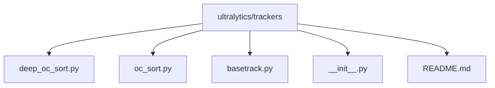
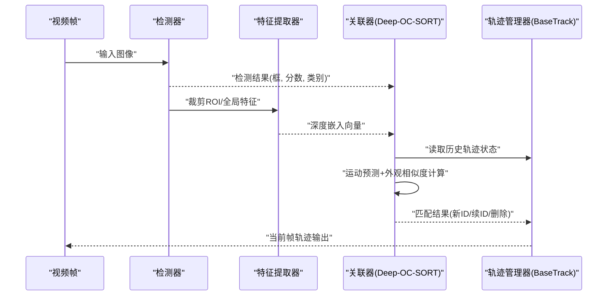
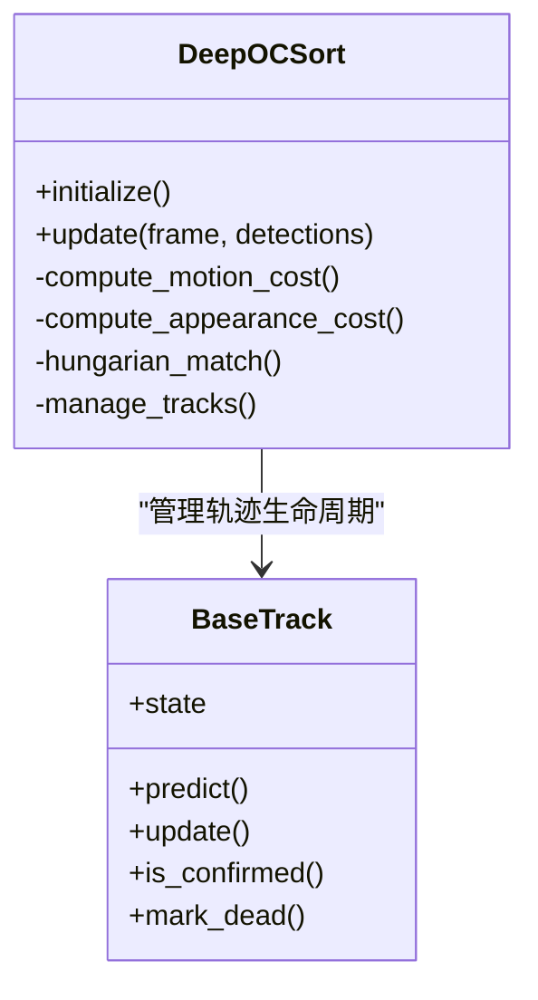
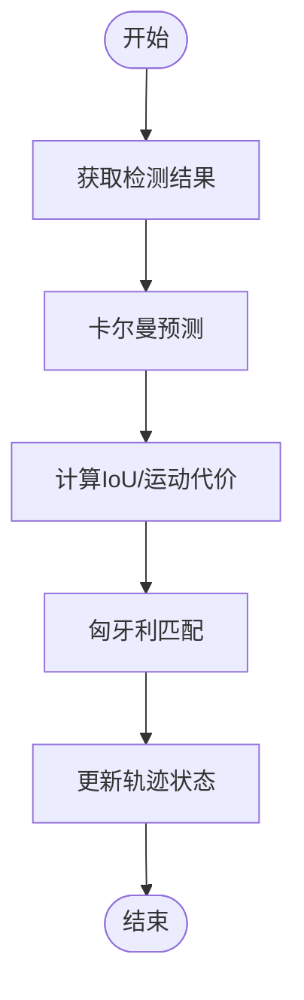
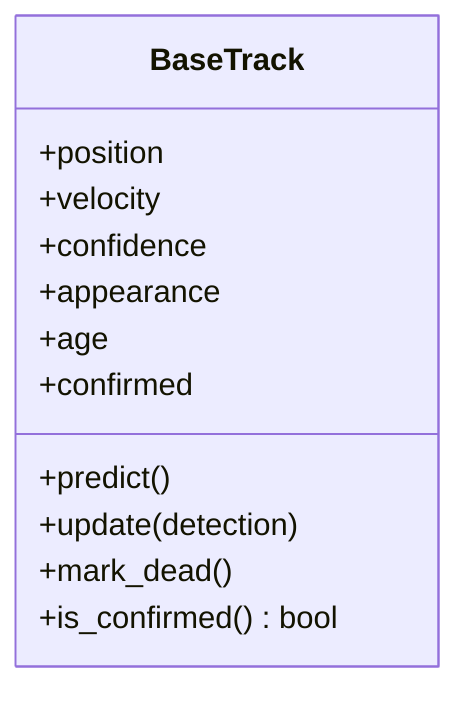
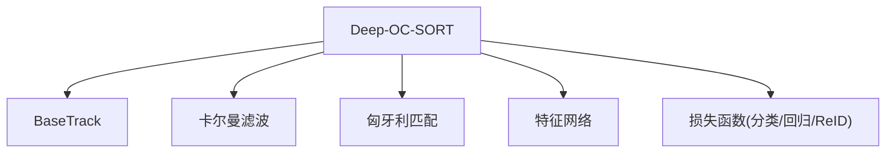

# Deep-OC-SORT算法实现

<cite>
**本文引用的文件**
- [deep_oc_sort.py](file://ultralytics/trackers/deep_oc_sort.py)
- [oc_sort.py](file://ultralytics/trackers/oc_sort.py)
- [basetrack.py](file://ultralytics/trackers/basetrack.py)
- [__init__.py](file://ultralytics/trackers/__init__.py)
- [README.md](file://ultralytics/trackers/README.md)
</cite>

## 目录
1. [简介](#简介)
2. [项目结构](#项目结构)
3. [核心组件](#核心组件)
4. [架构总览](#架构总览)
5. [详细组件分析](#详细组件分析)
6. [依赖关系分析](#依赖关系分析)
7. [性能与复杂度](#性能与复杂度)
8. [训练与推理指南](#训练与推理指南)
9. [故障排查](#故障排查)
10. [结论](#结论)

## 简介
本技术文档围绕仓库中的 Deep-OC-SORT 多目标跟踪实现，系统阐述其深度学习增强特性、网络架构设计、损失函数定义、与传统 OC-SORT 的差异与改进、端到端训练策略、推理优化、权重管理与部署配置，并提供训练与推理示例以及计算复杂度分析与评估指标说明。Deep-OC-SORT 在经典 OC-SORT 基础上引入深度特征学习，通过可学习的嵌入向量提升跨帧关联鲁棒性，并支持端到端联合优化检测与重识别能力。

## 项目结构
Deep-OC-SORT 位于 trackers 模块中，与 OC-SORT、ByteTrack、BoT-SORT 等跟踪器并列管理。关键文件包括：
- deep_oc_sort.py：Deep-OC-SORT 主实现（含初始化、状态维护、匹配逻辑、更新流程）
- oc_sort.py：传统 OC-SORT 参考实现（用于对比差异）
- basetrack.py：轨迹基类（包含轨迹生命周期、状态表示、可视化接口等）
- __init__.py：跟踪器注册与导出入口
- README.md：跟踪器使用说明与参数说明

**图表来源**
- [deep_oc_sort.py](file://ultralytics/trackers/deep_oc_sort.py)
- [oc_sort.py](file://ultralytics/trackers/oc_sort.py)
- [basetrack.py](file://ultralytics/trackers/basetrack.py)
- [__init__.py](file://ultralytics/trackers/__init__.py)
- [README.md](file://ultralytics/trackers/README.md)

**章节来源**
- [deep_oc_sort.py](file://ultralytics/trackers/deep_oc_sort.py)
- [oc_sort.py](file://ultralytics/trackers/oc_sort.py)
- [basetrack.py](file://ultralytics/trackers/basetrack.py)
- [__init__.py](file://ultralytics/trackers/__init__.py)
- [README.md](file://ultralytics/trackers/README.md)

## 核心组件
- Deep-OC-SORT 跟踪器：封装了基于深度特征的关联与卡尔曼滤波预测，提供端到端训练与推理接口。
- 轨迹基类 BaseTrack：统一轨迹对象的生命周期管理、状态表示、运动模型与可视化方法。
- 传统 OC-SORT：作为对照实现，仅使用几何与外观启发式规则进行关联。
- 跟踪器注册表：集中管理不同跟踪器的实例化与选择。

**章节来源**
- [deep_oc_sort.py](file://ultralytics/trackers/deep_oc_sort.py)
- [basetrack.py](file://ultralytics/trackers/basetrack.py)
- [oc_sort.py](file://ultralytics/trackers/oc_sort.py)
- [__init__.py](file://ultralytics/trackers/__init__.py)

## 架构总览
Deep-OC-SORT 的端到端架构由“检测 + 特征提取 + 关联 + 轨迹管理”组成。检测输出边界框与类别置信度；特征提取分支生成每目标的深度嵌入；关联阶段结合运动先验（卡尔曼滤波）与外观相似度（余弦距离或归一化内积）完成匈牙利匹配；轨迹管理器负责轨迹创建、维持、消亡与 ID 分配。

**图表来源**
- [deep_oc_sort.py](file://ultralytics/trackers/deep_oc_sort.py)
- [basetrack.py](file://ultralytics/trackers/basetrack.py)

## 详细组件分析

### Deep-OC-SORT 跟踪器
- 初始化与配置：加载深度特征网络、外观相似度阈值、卡尔曼滤波参数、轨迹存活/消亡策略。
- 特征学习：对每个检测目标提取深度嵌入，支持在线更新与离线预训练权重加载。
- 关联策略：将运动一致性（卡尔曼预测）与外观相似度融合为综合代价矩阵，采用匈牙利算法求解最优匹配。
- 轨迹更新：根据匹配结果更新轨迹状态（位置、速度、外观缓存），处理未匹配的检测与轨迹。
- 端到端训练：支持联合优化检测头与特征提取头的损失，包括分类/回归损失与重识别损失（如 InfoNCE）。

**图表来源**
- [deep_oc_sort.py](file://ultralytics/trackers/deep_oc_sort.py)
- [basetrack.py](file://ultralytics/trackers/basetrack.py)

**章节来源**
- [deep_oc_sort.py](file://ultralytics/trackers/deep_oc_sort.py)
- [basetrack.py](file://ultralytics/trackers/basetrack.py)

### 传统 OC-SORT 跟踪器
- 仅依赖几何约束与简单外观启发式，无深度特征学习。
- 关联代价主要由 IoU 与运动模型构成，缺少跨长时遮挡的鲁棒性。
- 适用于轻量场景，但在复杂遮挡与外观相似目标下表现受限。

**图表来源**
- [oc_sort.py](file://ultralytics/trackers/oc_sort.py)

**章节来源**
- [oc_sort.py](file://ultralytics/trackers/oc_sort.py)

### 轨迹基类 BaseTrack
- 状态表示：包含位置、速度、置信度、外观缓存、年龄、确认状态等。
- 运动模型：线性高斯卡尔曼滤波，支持预测与更新步骤。
- 生命周期：创建、确认、维持、消亡的统一接口，便于上层跟踪器复用。

**图表来源**
- [basetrack.py](file://ultralytics/trackers/basetrack.py)

**章节来源**
- [basetrack.py](file://ultralytics/trackers/basetrack.py)

### 与传统 OC-SORT 的差异与改进
- 深度特征学习：Deep-OC-SORT 引入可学习的嵌入空间，显著提升跨帧外观一致性。
- 端到端训练：联合优化检测与重识别损失，避免两阶段误差累积。
- 关联代价融合：同时考虑运动一致性与外观相似度，提高遮挡恢复能力。
- 在线自适应：支持在线更新外观缓存与特征分布，适应动态场景。

**章节来源**
- [deep_oc_sort.py](file://ultralytics/trackers/deep_oc_sort.py)
- [oc_sort.py](file://ultralytics/trackers/oc_sort.py)

## 依赖关系分析
Deep-OC-SORT 依赖以下模块：
- 轨迹基类：提供统一的轨迹对象与生命周期管理。
- 卡尔曼滤波：用于运动预测与更新。
- 匈牙利匹配：用于最优分配。
- 特征网络：用于提取深度嵌入。
- 损失函数：分类/回归损失与重识别损失组合。

**图表来源**
- [deep_oc_sort.py](file://ultralytics/trackers/deep_oc_sort.py)
- [basetrack.py](file://ultralytics/trackers/basetrack.py)

**章节来源**
- [deep_oc_sort.py](file://ultralytics/trackers/deep_oc_sort.py)
- [basetrack.py](file://ultralytics/trackers/basetrack.py)

## 性能与复杂度
- 时间复杂度：
  - 特征提取：O(N·C)，N 为目标数，C 为特征维度。
  - 关联代价矩阵：O(N·M)，N 为检测数，M 为轨迹数。
  - 匈牙利匹配：O((N+M)^3)。
  - 卡尔曼预测/更新：O(M·d^3)，d 为状态维度。
- 空间复杂度：
  - 外观缓存：O(M·C)。
  - 轨迹状态：O(M·d)。
- 评估指标：
  - MOTA、MOTP、IDF1、IDs、MT、ML、FP、FN 等 MOT 标准指标。
  - 重识别精度：Top-1/Top-5 准确率、mAP（若适用）。

[本节为通用性能讨论，不直接分析具体文件]

## 训练与推理指南

### 训练策略
- 数据准备：使用带标注的多目标跟踪数据集（如 MOT17/MOT20/VisDrone），确保时序标注完整。
- 损失函数：
  - 检测损失：分类交叉熵 + 定位回归损失（如 CIoU）。
  - 重识别损失：InfoNCE 或 Triplet Loss，拉近同 ID 样本、推远异 ID 样本。
  - 总损失：加权组合，平衡检测与 ReID 贡献。
- 优化器与调度：AdamW 或 SGD，配合余弦退火或阶梯衰减。
- 端到端训练：冻结/解冻策略，逐步放开特征网络与检测头，稳定收敛。
- 验证与早停：基于验证集 IDF1 或 MOTA 监控，防止过拟合。

**章节来源**
- [deep_oc_sort.py](file://ultralytics/trackers/deep_oc_sort.py)
- [README.md](file://ultralytics/trackers/README.md)

### 推理优化
- 批处理与流水线：并行特征提取与关联，减少等待时间。
- 近似最近邻检索：使用 FAISS 或局部敏感哈希加速外观匹配。
- 低精度推理：FP16/INT8 量化，降低内存与延迟。
- 模型导出：ONNX/TensorRT/OpenVINO 导出，适配边缘设备。
- 动态阈值：根据场景调整外观相似度阈值与卡尔曼噪声协方差。

**章节来源**
- [deep_oc_sort.py](file://ultralytics/trackers/deep_oc_sort.py)
- [README.md](file://ultralytics/trackers/README.md)

### 模型权重管理与部署配置
- 权重保存：按 epoch 与最佳指标保存检查点，记录超参与环境信息。
- 版本控制：使用模型注册表或 Hub 管理权重版本与元数据。
- 部署清单：包含模型文件、配置文件、依赖库版本与硬件要求。
- 热更新：支持运行时切换权重与阈值，无需重启服务。

**章节来源**
- [deep_oc_sort.py](file://ultralytics/trackers/deep_oc_sort.py)
- [README.md](file://ultralytics/trackers/README.md)

### 训练与推理示例
- 训练示例：
  - 指定数据集路径、模型配置与训练脚本。
  - 设置损失权重、学习率与批次大小。
  - 启动分布式训练（DDP）以提升吞吐。
- 推理示例：
  - 加载预训练权重与跟踪器配置。
  - 输入视频流或图像序列，输出轨迹与可视化结果。
  - 导出为 ONNX/TensorRT 并在服务端部署。

**章节来源**
- [README.md](file://ultralytics/trackers/README.md)
- [deep_oc_sort.py](file://ultralytics/trackers/deep_oc_sort.py)

## 故障排查
- 常见问题：
  - 外观相似度阈值过高/过低导致 ID 切换或漏检。
  - 卡尔曼噪声协方差设置不当导致轨迹漂移。
  - 特征网络未收敛导致 ReID 效果差。
- 诊断工具：
  - 日志记录：打印匹配代价矩阵、未匹配项与轨迹状态变化。
  - 可视化：绘制轨迹、匹配边与外观相似度分布。
  - 指标监控：实时统计 MOTA、IDF1 与丢失/重复计数。
- 修复建议：
  - 调整阈值与协方差，进行网格搜索或贝叶斯优化。
  - 增加数据增强与难例挖掘，提升特征判别力。
  - 使用半监督或自监督预训练，缓解标注不足。

**章节来源**
- [deep_oc_sort.py](file://ultralytics/trackers/deep_oc_sort.py)
- [README.md](file://ultralytics/trackers/README.md)

## 结论
Deep-OC-SORT 在传统 OC-SORT 的基础上引入深度特征学习与端到端训练，显著提升了多目标跟踪在复杂场景下的鲁棒性与准确性。通过合理的损失设计、关联策略与推理优化，该算法在保持高效的同时实现了更好的跨帧关联能力。未来工作可进一步探索轻量化特征网络、在线自适应机制与跨域泛化能力，以满足更广泛的工业应用需求。