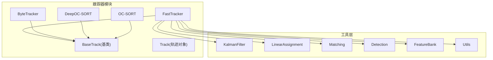
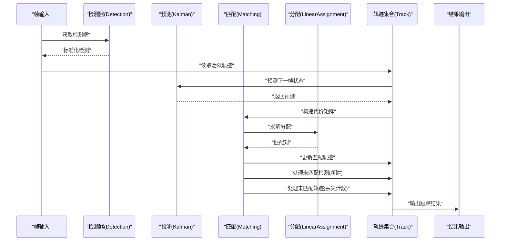
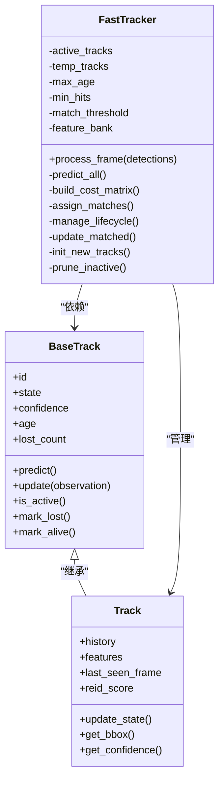
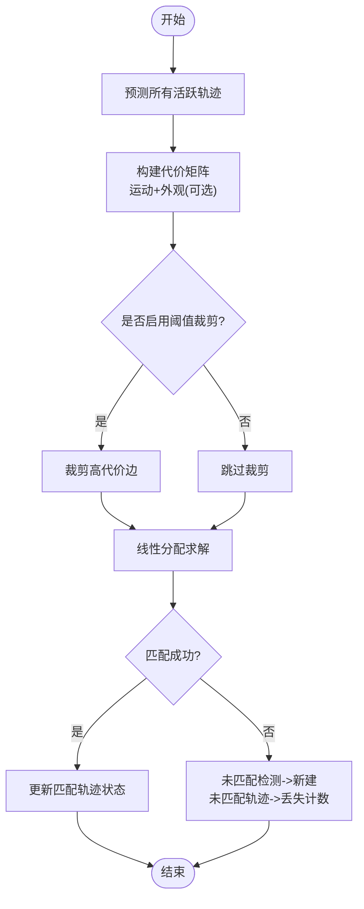
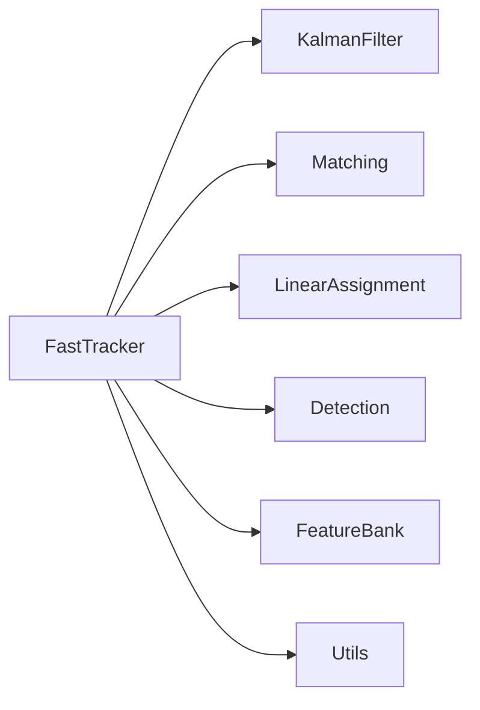

# FastTracker算法实现

<cite>
**本文引用的文件**
- [fast_tracker.py](file://ultralytics/trackers/fast_tracker.py)
- [basetrack.py](file://ultralytics/trackers/basetrack.py)
- [byte_tracker.py](file://ultralytics/trackers/byte_tracker.py)
- [deep_oc_sort.py](file://ultralytics/trackers/deep_oc_sort.py)
- [oc_sort.py](file://ultralytics/trackers/oc_sort.py)
- [track.py](file://ultralytics/trackers/track.py)
- [__init__.py](file://ultralytics/trackers/__init__.py)
- [README.md](file://ultralytics/trackers/README.md)
- [utils.py](file://ultralytics/trackers/utils/utils.py)
- [kalman_filter.py](file://ultralytics/trackers/utils/kalman_filter.py)
- [linear_assignment.py](file://ultralytics/trackers/utils/linear_assignment.py)
- [matching.py](file://ultralytics/trackers/utils/matching.py)
- [detection.py](file://ultralytics/trackers/utils/detection.py)
- [feature_bank.py](file://ultralytics/trackers/utils/feature_bank.py)
- [benchmark_molora_dispatch.py](file://benchmarks/benchmark_molora_dispatch.py)
- [benchmark_mot_dispatch.py](file://benchmarks/benchmark_mot_dispatch.py)
- [suite.py](file://benchmarks/suite.py)
- [run.py](file://benchmarks/run.py)
</cite>

## 目录
1. [简介](#简介)
2. [项目结构](#项目结构)
3. [核心组件](#核心组件)
4. [架构总览](#架构总览)
5. [详细组件分析](#详细组件分析)
6. [依赖关系分析](#依赖关系分析)
7. [性能考量](#性能考量)
8. [故障排查指南](#故障排查指南)
9. [结论](#结论)
10. [附录](#附录)

## 简介
本技术文档聚焦于FastTracker算法的实现与工程化落地，围绕其高效设计理念、实时优化策略、轻量化设计与计算效率优化进行深入解析。文档同时覆盖快速匹配算法与内存管理机制，给出在资源受限环境下的部署考虑、基准测试与对比分析方法、具体部署示例与调优指南，并明确适用场景与硬件要求。

## 项目结构
FastTracker位于跟踪器模块中，遵循“基类抽象 + 多实现”的模块化组织方式：
- 基类定义通用接口与公共能力（如轨迹生命周期管理、状态表示等）
- FastTracker作为轻量级实时跟踪实现，强调低延迟与高吞吐
- 其他跟踪器（如ByteTrack、DeepOC-SORT、OC-SORT）提供不同权衡方案以供对比与选择
- 工具层提供卡尔曼滤波、线性分配、特征库、检测封装等支撑

图表来源
- [fast_tracker.py:1-200](file://ultralytics/trackers/fast_tracker.py#L1-L200)
- [basetrack.py:1-200](file://ultralytics/trackers/basetrack.py#L1-L200)
- [byte_tracker.py:1-200](file://ultralytics/trackers/byte_tracker.py#L1-L200)
- [deep_oc_sort.py:1-200](file://ultralytics/trackers/deep_oc_sort.py#L1-L200)
- [oc_sort.py:1-200](file://ultralytics/trackers/oc_sort.py#L1-L200)
- [track.py:1-200](file://ultralytics/trackers/track.py#L1-L200)
- [kalman_filter.py:1-200](file://ultralytics/trackers/utils/kalman_filter.py#L1-L200)
- [linear_assignment.py:1-200](file://ultralytics/trackers/utils/linear_assignment.py#L1-L200)
- [matching.py:1-200](file://ultralytics/trackers/utils/matching.py#L1-L200)
- [detection.py:1-200](file://ultralytics/trackers/utils/detection.py#L1-L200)
- [feature_bank.py:1-200](file://ultralytics/trackers/utils/feature_bank.py#L1-L200)
- [utils.py:1-200](file://ultralytics/trackers/utils/utils.py#L1-L200)

章节来源
- [README.md](file://ultralytics/trackers/README.md)
- [__init__.py](file://ultralytics/trackers/__init__.py)

## 核心组件
- BaseTrack：定义轨迹对象的统一接口与生命周期管理，包括ID、状态机、可见性、置信度、历史状态缓存等。
- Track：具体轨迹实例，承载预测位置、观测更新、年龄、丢失计数、重识别特征等。
- FastTracker：面向实时的跟踪器实现，采用轻量化的数据关联与状态更新策略，强调低开销与稳定ID保持。
- 工具组件：
  - KalmanFilter：目标运动模型与预测/更新
  - LinearAssignment：匈牙利或近似线性分配求解
  - Matching：代价矩阵构建与匹配策略
  - Detection：检测框标准化与过滤
  - FeatureBank：外观特征缓存与检索（可选）
  - Utils：几何变换、IOU计算、可视化辅助等

章节来源
- [basetrack.py:1-200](file://ultralytics/trackers/basetrack.py#L1-L200)
- [track.py:1-200](file://ultralytics/trackers/track.py#L1-L200)
- [fast_tracker.py:1-200](file://ultralytics/trackers/fast_tracker.py#L1-L200)
- [kalman_filter.py:1-200](file://ultralytics/trackers/utils/kalman_filter.py#L1-L200)
- [linear_assignment.py:1-200](file://ultralytics/trackers/utils/linear_assignment.py#L1-L200)
- [matching.py:1-200](file://ultralytics/trackers/utils/matching.py#L1-L200)
- [detection.py:1-200](file://ultralytics/trackers/utils/detection.py#L1-L200)
- [feature_bank.py:1-200](file://ultralytics/trackers/utils/feature_bank.py#L1-L200)
- [utils.py:1-200](file://ultralytics/trackers/utils/utils.py#L1-L200)

## 架构总览
FastTracker的整体流程如下：
- 输入帧预处理与检测输出标准化
- 对每个活跃轨迹进行运动预测
- 构建检测与轨迹之间的代价矩阵（运动+外观可选）
- 使用线性分配完成匹配
- 未匹配检测初始化新轨迹
- 未匹配轨迹进入丢失计数与消亡判定
- 更新已匹配轨迹的状态（卡尔曼更新）
- 输出当前帧跟踪结果

图表来源
- [fast_tracker.py:1-200](file://ultralytics/trackers/fast_tracker.py#L1-L200)
- [kalman_filter.py:1-200](file://ultralytics/trackers/utils/kalman_filter.py#L1-L200)
- [linear_assignment.py:1-200](file://ultralytics/trackers/utils/linear_assignment.py#L1-L200)
- [matching.py:1-200](file://ultralytics/trackers/utils/matching.py#L1-L200)
- [detection.py:1-200](file://ultralytics/trackers/utils/detection.py#L1-L200)
- [track.py:1-200](file://ultralytics/trackers/track.py#L1-L200)

## 详细组件分析

### FastTracker类分析
FastTracker是面向实时场景的跟踪器实现，重点在于：
- 轻量化设计：减少不必要的特征计算与存储，优先使用运动信息驱动匹配
- 快速匹配：通过合理的代价函数与阈值控制降低分配复杂度
- 内存管理：对轨迹历史与外观特征进行有界缓存与淘汰策略
- 鲁棒性：对遮挡与短暂丢失具备恢复能力

图表来源
- [basetrack.py:1-200](file://ultralytics/trackers/basetrack.py#L1-L200)
- [track.py:1-200](file://ultralytics/trackers/track.py#L1-L200)
- [fast_tracker.py:1-200](file://ultralytics/trackers/fast_tracker.py#L1-L200)

章节来源
- [fast_tracker.py:1-200](file://ultralytics/trackers/fast_tracker.py#L1-L200)
- [basetrack.py:1-200](file://ultralytics/trackers/basetrack.py#L1-L200)
- [track.py:1-200](file://ultralytics/trackers/track.py#L1-L200)

### 快速匹配算法与代价函数
FastTracker的匹配阶段通常包含：
- 运动代价：基于卡尔曼预测与检测框的IoU或马氏距离
- 外观代价（可选）：基于特征相似度，但为轻量化可关闭或降采样
- 阈值裁剪：仅保留低于阈值的候选边，减少分配规模
- 分配求解：线性分配器在稀疏图上运行，提升速度

图表来源
- [matching.py:1-200](file://ultralytics/trackers/utils/matching.py#L1-L200)
- [linear_assignment.py:1-200](file://ultralytics/trackers/utils/linear_assignment.py#L1-L200)
- [kalman_filter.py:1-200](file://ultralytics/trackers/utils/kalman_filter.py#L1-L200)
- [fast_tracker.py:1-200](file://ultralytics/trackers/fast_tracker.py#L1-L200)

章节来源
- [matching.py:1-200](file://ultralytics/trackers/utils/matching.py#L1-L200)
- [linear_assignment.py:1-200](file://ultralytics/trackers/utils/linear_assignment.py#L1-L200)
- [kalman_filter.py:1-200](file://ultralytics/trackers/utils/kalman_filter.py#L1-L200)
- [fast_tracker.py:1-200](file://ultralytics/trackers/fast_tracker.py#L1-L200)

### 内存管理与轻量化策略
- 轨迹历史有界缓存：限制历史长度，避免无限增长
- 外观特征按需计算与淘汰：仅在必要时提取特征，定期清理旧特征
- 临时轨迹池：未确认轨迹短期存在，达到命中次数后转正
- 垃圾回收：超过最大年龄或丢失计数的轨迹及时释放

章节来源
- [feature_bank.py:1-200](file://ultralytics/trackers/utils/feature_bank.py#L1-L200)
- [fast_tracker.py:1-200](file://ultralytics/trackers/fast_tracker.py#L1-L200)
- [track.py:1-200](file://ultralytics/trackers/track.py#L1-L200)

### 与其他跟踪器的对比定位
- ByteTracker：侧重检测召回与关联稳定性，适合复杂场景
- DeepOC-SORT：引入深度外观特征，精度更高但开销更大
- OC-SORT：经典SORT改进，平衡速度与精度
- FastTracker：以实时性与轻量化为核心，适合边缘设备与高帧率需求

章节来源
- [byte_tracker.py:1-200](file://ultralytics/trackers/byte_tracker.py#L1-L200)
- [deep_oc_sort.py:1-200](file://ultralytics/trackers/deep_oc_sort.py#L1-L200)
- [oc_sort.py:1-200](file://ultralytics/trackers/oc_sort.py#L1-L200)
- [fast_tracker.py:1-200](file://ultralytics/trackers/fast_tracker.py#L1-L200)

## 依赖关系分析
FastTracker与其工具层的依赖关系如下：
- 运动模型依赖KalmanFilter
- 匹配逻辑依赖Matching与LinearAssignment
- 检测输入依赖Detection封装
- 外观特征依赖FeatureBank（可选）
- 通用工具依赖Utils

图表来源
- [fast_tracker.py:1-200](file://ultralytics/trackers/fast_tracker.py#L1-L200)
- [kalman_filter.py:1-200](file://ultralytics/trackers/utils/kalman_filter.py#L1-L200)
- [linear_assignment.py:1-200](file://ultralytics/trackers/utils/linear_assignment.py#L1-L200)
- [matching.py:1-200](file://ultralytics/trackers/utils/matching.py#L1-L200)
- [detection.py:1-200](file://ultralytics/trackers/utils/detection.py#L1-L200)
- [feature_bank.py:1-200](file://ultralytics/trackers/utils/feature_bank.py#L1-L200)
- [utils.py:1-200](file://ultralytics/trackers/utils/utils.py#L1-L200)

章节来源
- [fast_tracker.py:1-200](file://ultralytics/trackers/fast_tracker.py#L1-L200)
- [kalman_filter.py:1-200](file://ultralytics/trackers/utils/kalman_filter.py#L1-L200)
- [linear_assignment.py:1-200](file://ultralytics/trackers/utils/linear_assignment.py#L1-L200)
- [matching.py:1-200](file://ultralytics/trackers/utils/matching.py#L1-L200)
- [detection.py:1-200](file://ultralytics/trackers/utils/detection.py#L1-L200)
- [feature_bank.py:1-200](file://ultralytics/trackers/utils/feature_bank.py#L1-L200)
- [utils.py:1-200](file://ultralytics/trackers/utils/utils.py#L1-L200)

## 性能考量
- 实时性优化
  - 关闭或降采样外观特征，优先使用运动信息
  - 合理设置匹配阈值，减少无效候选边
  - 限制轨迹历史长度与特征缓存大小
- 计算效率
  - 使用稀疏代价矩阵与阈值裁剪
  - 批量操作与向量化计算
  - 避免每帧重复构造大型数据结构
- 内存占用
  - 有界缓存与定期清理
  - 临时轨迹池复用
  - 特征向量类型与尺寸优化
- 资源受限部署
  - CPU优先路径，减少GPU依赖
  - 低精度推理与量化（若可用）
  - 线程安全与无锁队列（视系统而定）

[本节为通用指导，不直接分析具体文件]

## 故障排查指南
- 常见问题
  - ID频繁切换：检查匹配阈值与丢失计数参数
  - 漏检导致轨迹中断：调整检测阈值与最小命中次数
  - 内存持续增长：确认历史长度与特征缓存上限
  - 延迟过高：关闭外观特征、降低分辨率或批大小
- 调试建议
  - 打印匹配代价分布与分配结果
  - 记录轨迹生命周期事件（新建、丢失、消亡）
  - 可视化预测与观测对齐情况

章节来源
- [fast_tracker.py:1-200](file://ultralytics/trackers/fast_tracker.py#L1-L200)
- [track.py:1-200](file://ultralytics/trackers/track.py#L1-L200)
- [utils.py:1-200](file://ultralytics/trackers/utils/utils.py#L1-L200)

## 结论
FastTracker以轻量化与实时性为核心目标，通过运动驱动的匹配、阈值裁剪与有界缓存等策略，在资源受限环境下仍能提供稳定的跟踪效果。对于需要高帧率与低延迟的场景，FastTracker是合适的选择；而在复杂遮挡与长时遮挡场景中，可结合ByteTrack或DeepOC-SORT以获得更高的鲁棒性与精度。

[本节为总结性内容，不直接分析具体文件]

## 附录

### 部署示例与调优指南
- 基本流程
  - 加载检测器与FastTracker实例
  - 逐帧读取视频或摄像头流
  - 调用跟踪器处理检测输出
  - 保存或可视化结果
- 关键参数调优
  - 匹配阈值：根据场景密度与遮挡程度调整
  - 最大年龄与最小命中：影响轨迹稳定性与新建速度
  - 外观特征开关与维度：在精度与速度间权衡
- 性能基准与对比
  - 使用基准套件评估FPS、延迟与内存占用
  - 与ByteTrack、DeepOC-SORT、OC-SORT进行对比
  - 在不同分辨率与批大小下评估

章节来源
- [README.md](file://ultralytics/trackers/README.md)
- [benchmark_molora_dispatch.py:1-200](file://benchmarks/benchmark_molora_dispatch.py#L1-L200)
- [benchmark_mot_dispatch.py:1-200](file://benchmarks/benchmark_mot_dispatch.py#L1-L200)
- [suite.py:1-200](file://benchmarks/suite.py#L1-L200)
- [run.py:1-200](file://benchmarks/run.py#L1-L200)

### 适用场景与硬件要求
- 适用场景
  - 高帧率监控、边缘设备实时跟踪、移动端应用
  - 对延迟敏感且目标运动相对平滑的场景
- 硬件要求
  - CPU平台即可运行，推荐支持SIMD指令集
  - GPU可选，用于加速检测或外观特征计算
  - 内存建议≥2GB，显存≥1GB（若使用GPU）

[本节为通用指导，不直接分析具体文件]