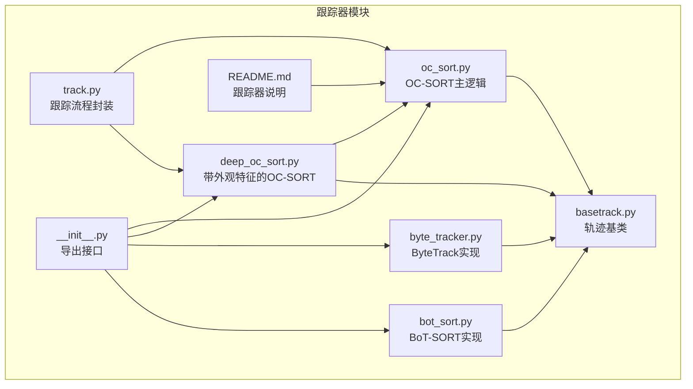
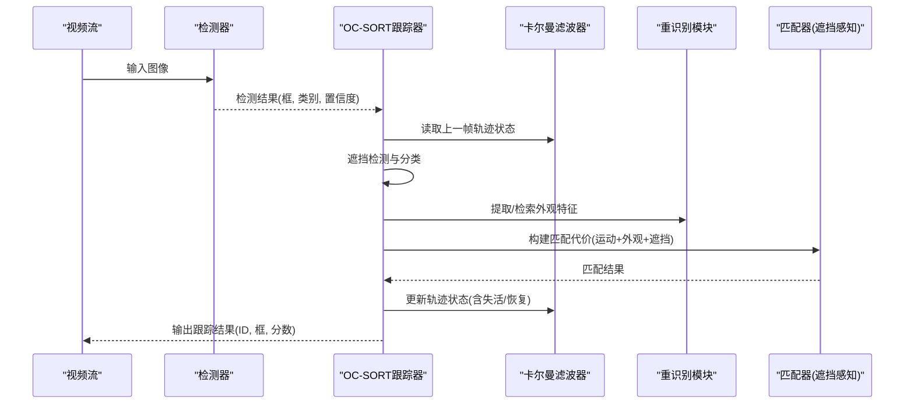
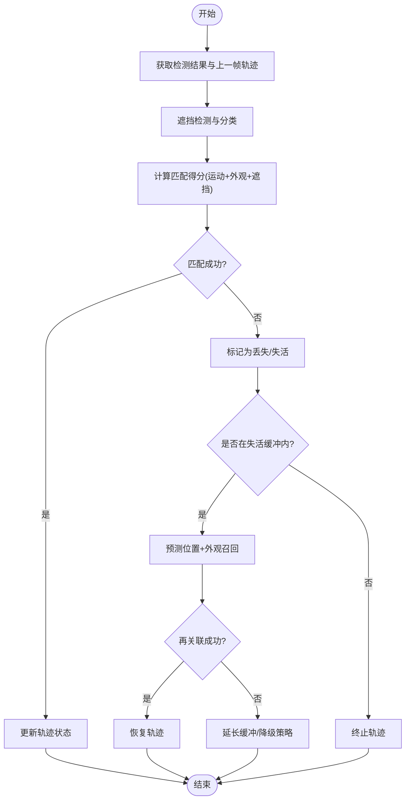
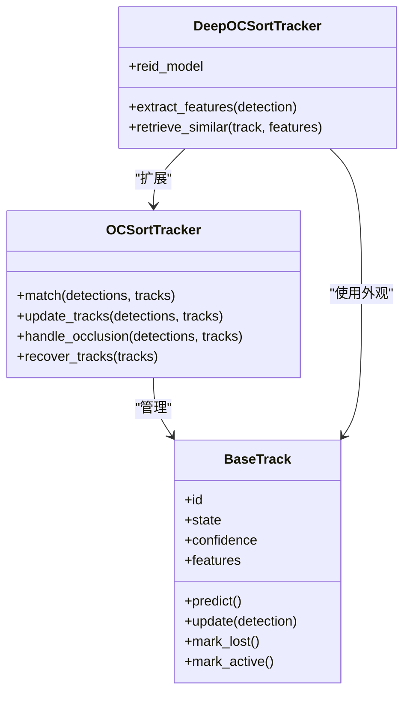
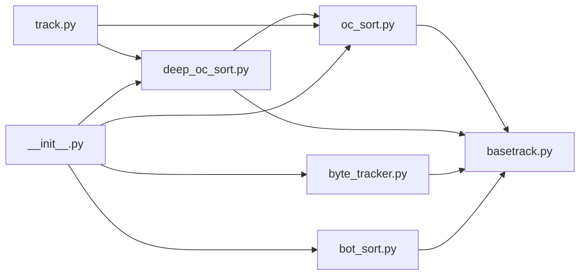

# OC-SORT算法实现

<cite>
**本文引用的文件**
- [oc_sort.py](file://ultralytics/trackers/oc_sort.py)
- [basetrack.py](file://ultralytics/trackers/basetrack.py)
- [deep_oc_sort.py](file://ultralytics/trackers/deep_oc_sort.py)
- [byte_tracker.py](file://ultralytics/trackers/byte_tracker.py)
- [bot_sort.py](file://ultralytics/trackers/bot_sort.py)
- [track.py](file://ultralytics/trackers/track.py)
- [__init__.py](file://ultralytics/trackers/__init__.py)
- [README.md](file://ultralytics/trackers/README.md)
</cite>

## 目录
1. [简介](#简介)
2. [项目结构](#项目结构)
3. [核心组件](#核心组件)
4. [架构总览](#架构总览)
5. [详细组件分析](#详细组件分析)
6. [依赖关系分析](#依赖关系分析)
7. [性能考量](#性能考量)
8. [故障排查指南](#故障排查指南)
9. [结论](#结论)
10. [附录](#附录)

## 简介
本技术文档围绕OC-SORT（遮挡感知排序）在多目标跟踪中的实现展开，重点解释其核心思想：遮挡感知排序与轨迹一致性维护。文档将深入剖析遮挡检测机制、轨迹恢复策略、长时间遮挡下的鲁棒性设计，并系统阐述关键模块（遮挡分类器、轨迹评分函数、重识别模块）的职责与交互。同时提供参数配置方法、调优经验、使用示例与遮挡场景处理案例，并对与其他方法的改进点与性能优势进行对比说明。

## 项目结构
仓库中与多目标跟踪相关的代码集中在 trackers 目录下，其中 oc_sort.py 为OC-SORT的核心实现，basetrack.py 定义了轨迹基类，deep_oc_sort.py 在OC-SORT基础上引入外观特征以增强遮挡恢复能力，其他如 byte_tracker.py、bot_sort.py 等提供了可对比的跟踪器实现。

图表来源
- [oc_sort.py](file://ultralytics/trackers/oc_sort.py)
- [basetrack.py](file://ultralytics/trackers/basetrack.py)
- [deep_oc_sort.py](file://ultralytics/trackers/deep_oc_sort.py)
- [byte_tracker.py](file://ultralytics/trackers/byte_tracker.py)
- [bot_sort.py](file://ultralytics/trackers/bot_sort.py)
- [track.py](file://ultralytics/trackers/track.py)
- [__init__.py](file://ultralytics/trackers/__init__.py)
- [README.md](file://ultralytics/trackers/README.md)

章节来源
- [oc_sort.py](file://ultralytics/trackers/oc_sort.py)
- [basetrack.py](file://ultralytics/trackers/basetrack.py)
- [deep_oc_sort.py](file://ultralytics/trackers/deep_oc_sort.py)
- [byte_tracker.py](file://ultralytics/trackers/byte_tracker.py)
- [bot_sort.py](file://ultralytics/trackers/bot_sort.py)
- [track.py](file://ultralytics/trackers/track.py)
- [__init__.py](file://ultralytics/trackers/__init__.py)
- [README.md](file://ultralytics/trackers/README.md)

## 核心组件
- 遮挡感知排序：在匹配阶段对候选检测与现有轨迹进行排序时显式考虑遮挡状态，降低误匹配风险，提升遮挡场景下的稳定性。
- 轨迹一致性维护：通过卡尔曼滤波预测、时序一致性与外观相似度等多源证据融合，维持轨迹ID稳定，减少ID切换。
- 遮挡检测机制：基于检测置信度、IoU、运动一致性以及可选的外观特征判别遮挡程度，形成遮挡分类信号。
- 轨迹恢复策略：对丢失轨迹设置“失活”缓冲期，结合预测位置与外观召回进行再关联；长时间遮挡下采用更宽松的匹配阈值与延迟激活策略。
- 关键模块：
  - 遮挡分类器：输出当前帧中检测或轨迹的遮挡概率或等级。
  - 轨迹评分函数：综合运动距离、外观相似度、遮挡状态、历史一致性等计算匹配得分。
  - 重识别模块：提取并比对外观特征，用于遮挡后重新关联。

章节来源
- [oc_sort.py](file://ultralytics/trackers/oc_sort.py)
- [deep_oc_sort.py](file://ultralytics/trackers/deep_oc_sort.py)
- [basetrack.py](file://ultralytics/trackers/basetrack.py)

## 架构总览
OC-SORT的整体流程包括：读取上一帧轨迹状态与模型预测结果，执行遮挡检测与分类，构建匹配代价矩阵并进行匈牙利匹配，更新轨迹状态（包含失活与恢复），最终输出当前帧跟踪结果。

图表来源
- [oc_sort.py](file://ultralytics/trackers/oc_sort.py)
- [deep_oc_sort.py](file://ultralytics/trackers/deep_oc_sort.py)
- [basetrack.py](file://ultralytics/trackers/basetrack.py)

## 详细组件分析

### 遮挡分类器
- 职责：根据检测置信度、IoU、运动残差及外观相似度等指标，判定当前检测或轨迹是否处于遮挡状态，输出遮挡等级或概率。
- 设计要点：
  - 低置信度检测更易被判定为遮挡或噪声。
  - 与最近邻轨迹的IoU较低且运动不一致时，倾向于遮挡。
  - 外观相似度显著下降可作为遮挡辅助证据。
- 输出：遮挡标签或概率，供匹配代价与轨迹恢复策略使用。

章节来源
- [oc_sort.py](file://ultralytics/trackers/oc_sort.py)
- [deep_oc_sort.py](file://ultralytics/trackers/deep_oc_sort.py)

### 轨迹评分函数
- 职责：为候选检测与轨迹对计算匹配得分，作为匹配器的依据。
- 组成要素：
  - 运动距离：通常基于马氏距离或欧氏距离，衡量预测位置与检测位置的接近程度。
  - 外观相似度：由重识别模块提供的特征余弦相似度或嵌入距离。
  - 遮挡惩罚：若任一对象被判定为遮挡，则相应降低匹配得分。
  - 历史一致性：轨迹的存活时长、近期匹配成功率等作为先验权重。
- 输出：标量得分，用于匈牙利匹配或贪心匹配。

章节来源
- [oc_sort.py](file://ultralytics/trackers/oc_sort.py)
- [deep_oc_sort.py](file://ultralytics/trackers/deep_oc_sort.py)

### 重识别模块
- 职责：提取检测框的外观特征，并在需要时检索已有轨迹的特征库，完成遮挡后的再关联。
- 关键点：
  - 特征归一化与缓存管理，避免重复计算。
  - 特征更新策略：仅在可靠匹配后更新轨迹外观，防止漂移。
  - 相似度阈值与回退策略：当外观不可靠时退回仅运动匹配。

章节来源
- [deep_oc_sort.py](file://ultralytics/trackers/deep_oc_sort.py)
- [basetrack.py](file://ultralytics/trackers/basetrack.py)

### 遮挡检测机制与轨迹恢复策略
- 遮挡检测：
  - 规则与学习相结合：基于置信度、IoU、运动一致性等启发式规则，并可结合轻量分类器输出。
  - 分级遮挡：轻度、中度、重度遮挡分别影响匹配代价与恢复策略。
- 轨迹恢复：
  - 失活缓冲：轨迹丢失后进入“失活”状态，保留一段时间等待再关联。
  - 预测外推：利用卡尔曼滤波预测位置，扩大匹配搜索范围。
  - 外观召回：在失活期内尝试用外观特征召回匹配。
  - 长时间遮挡：放宽阈值、增加缓冲时长、降低外观权重，提高鲁棒性。

图表来源
- [oc_sort.py](file://ultralytics/trackers/oc_sort.py)
- [deep_oc_sort.py](file://ultralytics/trackers/deep_oc_sort.py)
- [basetrack.py](file://ultralytics/trackers/basetrack.py)

章节来源
- [oc_sort.py](file://ultralytics/trackers/oc_sort.py)
- [deep_oc_sort.py](file://ultralytics/trackers/deep_oc_sort.py)
- [basetrack.py](file://ultralytics/trackers/basetrack.py)

### 类关系图（代码级）

图表来源
- [basetrack.py](file://ultralytics/trackers/basetrack.py)
- [oc_sort.py](file://ultralytics/trackers/oc_sort.py)
- [deep_oc_sort.py](file://ultralytics/trackers/deep_oc_sort.py)

章节来源
- [basetrack.py](file://ultralytics/trackers/basetrack.py)
- [oc_sort.py](file://ultralytics/trackers/oc_sort.py)
- [deep_oc_sort.py](file://ultralytics/trackers/deep_oc_sort.py)

### 使用示例与遮挡场景处理案例
- 基本用法：
  - 初始化OC-SORT跟踪器，传入必要参数（如最大失活时长、匹配阈值、外观权重等）。
  - 在每帧调用跟踪器，输入检测器输出的边界框、类别与置信度。
  - 获取跟踪结果（ID、框、分数），用于可视化或下游任务。
- 遮挡场景案例：
  - 短时遮挡：适度收紧匹配阈值，快速恢复轨迹。
  - 长时遮挡：放宽阈值、增大失活缓冲，优先保证ID稳定。
  - 密集遮挡：降低外观权重，更多依赖运动一致性与遮挡分类。

章节来源
- [oc_sort.py](file://ultralytics/trackers/oc_sort.py)
- [deep_oc_sort.py](file://ultralytics/trackers/deep_oc_sort.py)
- [README.md](file://ultralytics/trackers/README.md)

### 参数配置与调优经验
- 关键参数：
  - 匹配阈值：控制运动与外观的综合匹配严格程度。
  - 失活缓冲时长：决定轨迹丢失后等待再关联的时间。
  - 外观权重：调节重识别模块对匹配的影响。
  - 遮挡阈值：判定遮挡的置信度与相似度边界。
- 调优建议：
  - 高遮挡场景：适当提高失活缓冲与遮挡容忍度，降低外观权重。
  - 高速运动场景：加强运动项权重，确保预测准确性。
  - 外观区分度高：提升外观权重，改善遮挡后重关联。
  - 实时性要求高：简化外观计算与特征更新频率。

章节来源
- [oc_sort.py](file://ultralytics/trackers/oc_sort.py)
- [deep_oc_sort.py](file://ultralytics/trackers/deep_oc_sort.py)
- [README.md](file://ultralytics/trackers/README.md)

### 与其他方法的改进点与性能优势
- 相比传统SORT：
  - 引入遮挡感知匹配与失活恢复，显著提升遮挡场景稳定性。
- 相比ByteTrack：
  - ByteTrack侧重弱检测的再利用，OC-SORT强调遮挡分类与轨迹一致性维护，适合复杂遮挡环境。
- 相比BoT-SORT：
  - BoT-SORT强于外观重识别，OC-SORT在遮挡分类与匹配代价设计上更具针对性，兼顾速度与鲁棒性。
- 性能优势：
  - 在遮挡密集场景中保持更高的轨迹连续性与较低的ID切换率。
  - 通过遮挡感知与恢复策略，在长时遮挡下仍具备较好的再关联能力。

章节来源
- [byte_tracker.py](file://ultralytics/trackers/byte_tracker.py)
- [bot_sort.py](file://ultralytics/trackers/bot_sort.py)
- [oc_sort.py](file://ultralytics/trackers/oc_sort.py)
- [deep_oc_sort.py](file://ultralytics/trackers/deep_oc_sort.py)

## 依赖关系分析
OC-SORT与其相关跟踪器之间的依赖关系如下：

图表来源
- [oc_sort.py](file://ultralytics/trackers/oc_sort.py)
- [deep_oc_sort.py](file://ultralytics/trackers/deep_oc_sort.py)
- [basetrack.py](file://ultralytics/trackers/basetrack.py)
- [byte_tracker.py](file://ultralytics/trackers/byte_tracker.py)
- [bot_sort.py](file://ultralytics/trackers/bot_sort.py)
- [track.py](file://ultralytics/trackers/track.py)
- [__init__.py](file://ultralytics/trackers/__init__.py)

章节来源
- [oc_sort.py](file://ultralytics/trackers/oc_sort.py)
- [deep_oc_sort.py](file://ultralytics/trackers/deep_oc_sort.py)
- [basetrack.py](file://ultralytics/trackers/basetrack.py)
- [byte_tracker.py](file://ultralytics/trackers/byte_tracker.py)
- [bot_sort.py](file://ultralytics/trackers/bot_sort.py)
- [track.py](file://ultralytics/trackers/track.py)
- [__init__.py](file://ultralytics/trackers/__init__.py)

## 性能考量
- 计算开销：外观特征提取与相似度计算可能成为瓶颈，可通过特征缓存、降采样或异步更新缓解。
- 内存占用：轨迹特征库需定期清理与压缩，避免无限增长。
- 实时性：在高帧率场景下，合理设置外观更新频率与匹配窗口大小，平衡精度与速度。
- 数值稳定性：卡尔曼滤波的参数需针对场景调整，避免预测发散。

[本节为通用指导，不直接分析具体文件]

## 故障排查指南
- 常见问题：
  - ID频繁切换：检查遮挡阈值与匹配阈值是否过严，适当放宽。
  - 轨迹过早终止：增加失活缓冲时长，优化外观更新策略。
  - 重识别失效：确认外观特征质量与相似度阈值，必要时降低外观权重。
- 诊断建议：
  - 记录遮挡分类结果与匹配代价分布，定位问题环节。
  - 可视化轨迹与预测位置，验证卡尔曼滤波效果。
  - 对比不同参数组合的HOTA/MOTA等指标，量化改进。

章节来源
- [oc_sort.py](file://ultralytics/trackers/oc_sort.py)
- [deep_oc_sort.py](file://ultralytics/trackers/deep_oc_sort.py)
- [README.md](file://ultralytics/trackers/README.md)

## 结论
OC-SORT通过遮挡感知排序与轨迹一致性维护，在复杂遮挡场景下展现出更强的鲁棒性与稳定性。其关键模块（遮挡分类器、轨迹评分函数、重识别模块）协同工作，配合失活缓冲与恢复策略，有效应对短时长与长时长遮挡。相较于其他跟踪器，OC-SORT在遮挡密集环境中具有明显优势，适用于实际部署中对轨迹连续性要求较高的应用。

[本节为总结性内容，不直接分析具体文件]

## 附录
- 参考实现路径：
  - OC-SORT主逻辑：[oc_sort.py](file://ultralytics/trackers/oc_sort.py)
  - 带外观的OC-SORT：[deep_oc_sort.py](file://ultralytics/trackers/deep_oc_sort.py)
  - 轨迹基类：[basetrack.py](file://ultralytics/trackers/basetrack.py)
  - 其他跟踪器对比：[byte_tracker.py](file://ultralytics/trackers/byte_tracker.py)、[bot_sort.py](file://ultralytics/trackers/bot_sort.py)
  - 跟踪流程封装：[track.py](file://ultralytics/trackers/track.py)
  - 导出接口：[__init__.py](file://ultralytics/trackers/__init__.py)
  - 跟踪器说明：[README.md](file://ultralytics/trackers/README.md)