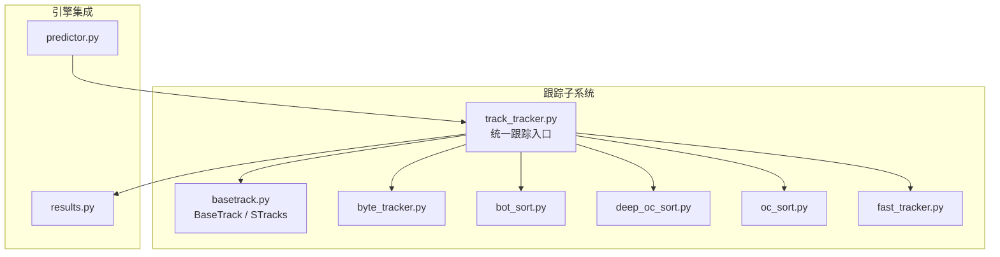
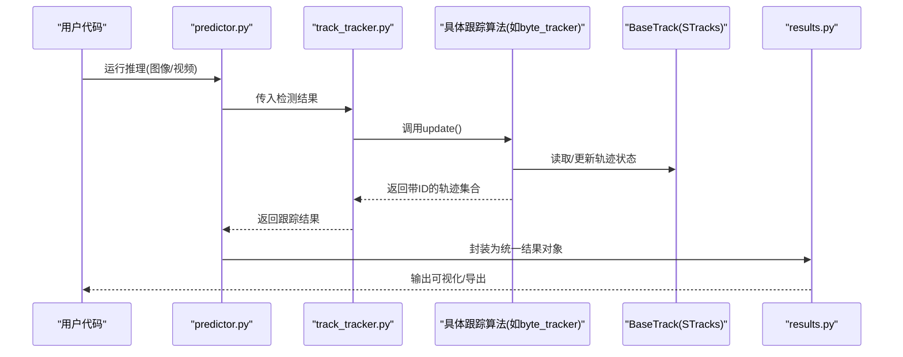
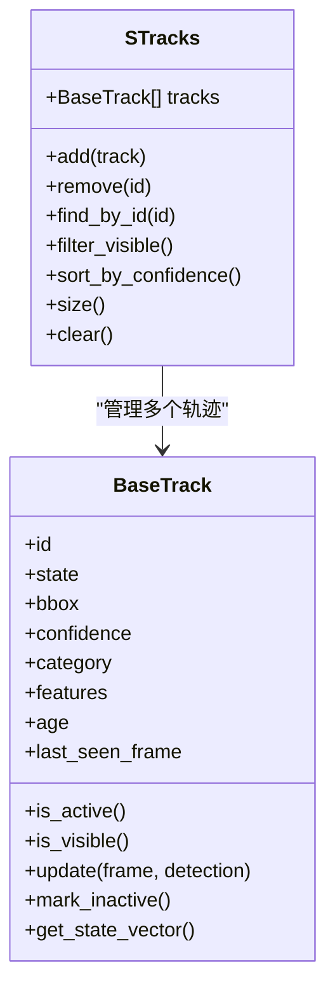
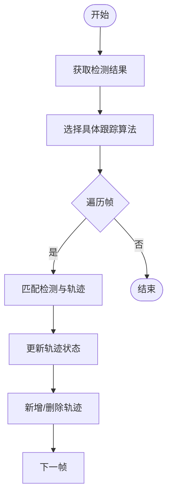
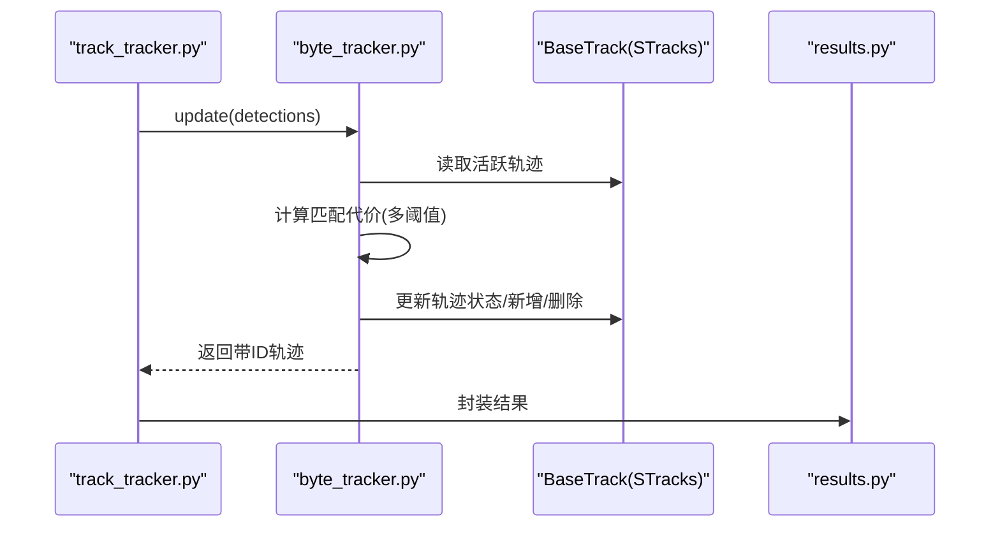
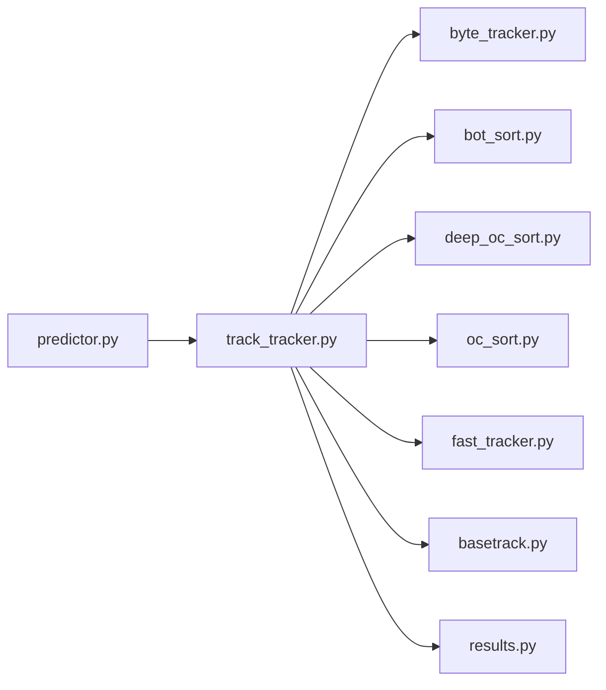

# 基础跟踪类设计

<cite>
**本文引用的文件**
- [basetrack.py](file://ultralytics/trackers/basetrack.py)
- [track.py](file://ultralytics/trackers/track.py)
- [byte_tracker.py](file://ultralytics/trackers/byte_tracker.py)
- [bot_sort.py](file://ultralytics/trackers/bot_sort.py)
- [deep_oc_sort.py](file://ultralytics/trackers/deep_oc_sort.py)
- [oc_sort.py](file://ultralytics/trackers/oc_sort.py)
- [fast_tracker.py](file://ultralytics/trackers/fast_tracker.py)
- [track_tracker.py](file://ultralytics/trackers/track_tracker.py)
- [predictor.py](file://ultralytics/engine/predictor.py)
- [results.py](file://ultralytics/engine/results.py)
</cite>

## 目录
1. [简介](#简介)
2. [项目结构](#项目结构)
3. [核心组件](#核心组件)
4. [架构总览](#架构总览)
5. [详细组件分析](#详细组件分析)
6. [依赖分析](#依赖分析)
7. [性能考虑](#性能考虑)
8. [故障排查指南](#故障排查指南)
9. [结论](#结论)
10. [附录](#附录)

## 简介
本文件聚焦于 YOLO-Master 的“基础跟踪类”与“STracks 数据结构”，系统性阐述 BaseTrack 的核心架构、抽象接口、对象生命周期管理、状态表示与通用方法；解释 STracks 的设计动机与字段语义；梳理跟踪算法的通用流程与扩展机制；说明跟踪 ID 分配策略、轨迹管理与状态更新机制；并提供自定义跟踪算法的开发指南、最佳实践、继承模式以及与预测器、结果对象的集成方式与数据流处理。

## 项目结构
跟踪子系统位于 ultralytics/trackers 目录下，采用“基类 + 多实现”的分层组织：
- 基类与通用数据结构：basetrack.py（BaseTrack、STracks）
- 具体跟踪算法：byte_tracker.py、bot_sort.py、deep_oc_sort.py、oc_sort.py、fast_tracker.py
- 统一跟踪入口：track_tracker.py（对外暴露统一的跟踪接口）
- 与引擎集成：predictor.py（调用跟踪器）、results.py（封装带跟踪ID的结果）

图表来源
- [basetrack.py](file://ultralytics/trackers/basetrack.py)
- [track_tracker.py](file://ultralytics/trackers/track_tracker.py)
- [byte_tracker.py](file://ultralytics/trackers/byte_tracker.py)
- [bot_sort.py](file://ultralytics/trackers/bot_sort.py)
- [deep_oc_sort.py](file://ultralytics/trackers/deep_oc_sort.py)
- [oc_sort.py](file://ultralytics/trackers/oc_sort.py)
- [fast_tracker.py](file://ultralytics/trackers/fast_tracker.py)
- [predictor.py](file://ultralytics/engine/predictor.py)
- [results.py](file://ultralytics/engine/results.py)

章节来源
- [basetrack.py](file://ultralytics/trackers/basetrack.py)
- [track_tracker.py](file://ultralytics/trackers/track_tracker.py)
- [predictor.py](file://ultralytics/engine/predictor.py)
- [results.py](file://ultralytics/engine/results.py)

## 核心组件
本节深入解析 BaseTrack 与 STracks 的设计要点。

- BaseTrack 的职责
  - 定义跟踪对象的最小公共接口：初始化、状态更新、是否存活、是否可见等。
  - 提供通用的生命周期管理：创建、激活、消亡判定、清理。
  - 维护与帧相关的元信息：时间戳、帧号、置信度、类别、框坐标等。
  - 为派生算法提供可复用的工具方法：距离度量、相似度计算、阈值判断等。

- STracks 数据结构
  - 用于在单帧内聚合和管理一组跟踪对象（即“当前帧的轨迹集合”）。
  - 典型字段包括：唯一ID、边界框、类别、置信度、特征向量（可选）、运动状态（如均值-方差或卡尔曼滤波状态）、可见性标志、年龄/寿命、最后更新时间等。
  - 提供常用操作：按ID查找、过滤可见/不可见轨迹、排序（按置信度或匹配代价）、合并/拆分（由上层算法决定）。

- 生命周期与状态
  - 常见状态：未激活、活跃、隐藏、消亡。
  - 触发条件：新检测进入、匹配成功、长时间未观测到、置信度过低、超龄等。
  - 状态迁移遵循“最小化误删、最大化连续性”的原则，结合可见性与运动一致性进行决策。

- 通用方法与扩展点
  - 匹配接口：将检测与现有轨迹进行关联（匈牙利匹配、最近邻、图匹配等）。
  - 更新接口：根据匹配结果更新轨迹的状态与外观特征。
  - 新增/删除接口：处理未匹配的检测与长期未匹配的轨迹。
  - 这些扩展点允许不同算法以插件式方式接入，保持统一的数据契约。

章节来源
- [basetrack.py](file://ultralytics/trackers/basetrack.py)
- [track.py](file://ultralytics/trackers/track.py)

## 架构总览
跟踪系统采用“统一入口 + 多算法实现 + 基类抽象”的架构：
- track_tracker.py 作为统一入口，负责选择并调度具体跟踪算法。
- 各算法实现 byte_tracker、bot_sort、deep_oc_sort、oc_sort、fast_tracker 等，均基于 BaseTrack 提供的接口完成匹配、更新、增删逻辑。
- predictor.py 在推理阶段调用跟踪器，将检测结果送入跟踪管线。
- results.py 将跟踪结果（含跟踪ID）包装为统一格式，供可视化与下游任务使用。

图表来源
- [predictor.py](file://ultralytics/engine/predictor.py)
- [track_tracker.py](file://ultralytics/trackers/track_tracker.py)
- [byte_tracker.py](file://ultralytics/trackers/byte_tracker.py)
- [basetrack.py](file://ultralytics/trackers/basetrack.py)
- [results.py](file://ultralytics/engine/results.py)

## 详细组件分析

### BaseTrack 与 STracks 设计
- 设计目标
  - 通过最小公共接口屏蔽不同跟踪算法的差异，使上层调用保持一致。
  - 将“轨迹对象”与“轨迹集合”解耦，便于在不同场景下复用与组合。
- 关键抽象
  - 轨迹对象：包含ID、状态、属性、更新接口。
  - 轨迹集合：提供批量操作（查找、过滤、排序、统计）。
- 复杂度与性能
  - 单帧内轨迹集合操作通常为 O(N) 或 O(N log N)，取决于排序与查找策略。
  - 匹配阶段可能引入 O(N×M) 的代价矩阵计算，需结合阈值裁剪与近似匹配优化。

图表来源
- [basetrack.py](file://ultralytics/trackers/basetrack.py)

章节来源
- [basetrack.py](file://ultralytics/trackers/basetrack.py)

### 统一跟踪入口 track_tracker.py
- 职责
  - 接收预测器的检测结果，选择具体跟踪算法实例。
  - 协调多帧间的轨迹更新，保证ID一致性与稳定性。
  - 将最终结果转换为标准格式，交由 results.py 封装。
- 与预测器集成
  - predictor.py 在每帧推理后调用跟踪器，传入检测结果与必要上下文（如图像尺寸、时间戳）。
  - 跟踪器返回带ID的轨迹列表，预测器将其写入结果对象。

图表来源
- [track_tracker.py](file://ultralytics/trackers/track_tracker.py)
- [predictor.py](file://ultralytics/engine/predictor.py)

章节来源
- [track_tracker.py](file://ultralytics/trackers/track_tracker.py)
- [predictor.py](file://ultralytics/engine/predictor.py)

### 具体跟踪算法示例：ByteTrack
- 特点
  - 强调“高召回+稳定ID”的平衡，适合密集场景。
  - 通过多阈值策略区分强匹配与弱匹配，提升漏检恢复能力。
- 与基类的协作
  - 使用 BaseTrack 的状态与属性进行匹配与更新。
  - 利用 STracks 管理当前帧轨迹集合，执行过滤与排序。

图表来源
- [track_tracker.py](file://ultralytics/trackers/track_tracker.py)
- [byte_tracker.py](file://ultralytics/trackers/byte_tracker.py)
- [basetrack.py](file://ultralytics/trackers/basetrack.py)
- [results.py](file://ultralytics/engine/results.py)

章节来源
- [byte_tracker.py](file://ultralytics/trackers/byte_tracker.py)
- [basetrack.py](file://ultralytics/trackers/basetrack.py)

### 其他算法对比与扩展点
- bot_sort、deep_oc_sort、oc_sort、fast_tracker 等均以 BaseTrack 为基础，差异主要体现在：
  - 匹配策略：IoU、ReID特征、运动模型（卡尔曼滤波）、图匹配等。
  - 状态更新：外观融合权重、运动平滑策略、遮挡处理。
  - 新增/删除策略：超时阈值、置信度门限、轨迹长度惩罚。
- 扩展建议
  - 优先实现匹配与更新两个核心接口，确保与 BaseTrack 契约一致。
  - 对复杂场景（遮挡、快速运动）引入鲁棒的外观与运动模型。
  - 控制计算开销：裁剪候选集、近似匹配、增量更新。

章节来源
- [bot_sort.py](file://ultralytics/trackers/bot_sort.py)
- [deep_oc_sort.py](file://ultralytics/trackers/deep_oc_sort.py)
- [oc_sort.py](file://ultralytics/trackers/oc_sort.py)
- [fast_tracker.py](file://ultralytics/trackers/fast_tracker.py)
- [basetrack.py](file://ultralytics/trackers/basetrack.py)

## 依赖分析
- 内部依赖
  - track_tracker.py 依赖具体算法实现与 BaseTrack。
  - 具体算法实现依赖 BaseTrack 与 STracks 提供的数据结构与接口。
  - predictor.py 与 results.py 构成跟踪结果的输入输出契约。
- 外部依赖
  - 数值计算库（如 NumPy/Torch）用于距离度量与特征运算。
  - 可能的第三方匹配库（如 scipy.optimize.linear_sum_assignment）用于匈牙利匹配。

图表来源
- [predictor.py](file://ultralytics/engine/predictor.py)
- [track_tracker.py](file://ultralytics/trackers/track_tracker.py)
- [byte_tracker.py](file://ultralytics/trackers/byte_tracker.py)
- [bot_sort.py](file://ultralytics/trackers/bot_sort.py)
- [deep_oc_sort.py](file://ultralytics/trackers/deep_oc_sort.py)
- [oc_sort.py](file://ultralytics/trackers/oc_sort.py)
- [fast_tracker.py](file://ultralytics/trackers/fast_tracker.py)
- [basetrack.py](file://ultralytics/trackers/basetrack.py)
- [results.py](file://ultralytics/engine/results.py)

章节来源
- [predictor.py](file://ultralytics/engine/predictor.py)
- [track_tracker.py](file://ultralytics/trackers/track_tracker.py)
- [basetrack.py](file://ultralytics/trackers/basetrack.py)
- [results.py](file://ultralytics/engine/results.py)

## 性能考虑
- 匹配复杂度
  - 直接全量匹配为 O(N×M)，可通过空间索引、区域划分、候选集裁剪降低实际计算量。
- 特征计算
  - ReID 特征计算开销较大，建议缓存、异步计算或降采样。
- 状态更新
  - 卡尔曼滤波等运动模型应控制维度与协方差更新频率。
- 内存管理
  - 及时释放不可见或消亡轨迹，避免轨迹集合无限增长。
- 并行与批处理
  - 在多目标场景下，尽量向量化操作，减少 Python 循环开销。

[本节为通用指导，不直接分析具体文件]

## 故障排查指南
- 常见问题
  - ID频繁跳变：检查匹配阈值与重识别特征质量，调整多阈值策略。
  - 轨迹过早消亡：提高可见性容忍度与超时阈值，增强遮挡处理。
  - 漏检恢复慢：引入弱匹配分支与回溯机制，提升召回率。
  - 性能瓶颈：定位匹配与特征计算热点，启用近似匹配与缓存。
- 调试建议
  - 打印每帧匹配代价矩阵与匹配结果，观察异常路径。
  - 记录轨迹状态迁移日志，定位状态突变原因。
  - 可视化轨迹与检测框，辅助人工校验。

章节来源
- [basetrack.py](file://ultralytics/trackers/basetrack.py)
- [track_tracker.py](file://ultralytics/trackers/track_tracker.py)

## 结论
BaseTrack 与 STracks 构成了 YOLO-Master 跟踪子系统的基石，提供了稳定的抽象接口与数据结构，使得多种跟踪算法可以以插件式方式接入并保持统一的数据契约。通过 track_tracker.py 的统一入口，预测器与结果对象得以无缝集成，形成端到端的跟踪流水线。在实际工程中，应根据场景特性选择合适的算法与参数，并在匹配、更新、新增/删除三个关键环节进行精细化调优，以实现高精度、高稳定性的跟踪效果。

[本节为总结性内容，不直接分析具体文件]

## 附录
- 开发指南与最佳实践
  - 继承 BaseTrack 时，严格遵循接口契约，确保状态字段与生命周期方法行为一致。
  - 在匹配阶段引入多源证据（几何、外观、运动），并使用阈值裁剪降低计算量。
  - 对遮挡与快速运动场景，增加鲁棒性设计（如延迟消亡、回溯匹配）。
  - 提供清晰的配置项（阈值、超时、权重），便于实验与部署。
- 代码示例与继承模式
  - 参考 byte_tracker.py、bot_sort.py、deep_oc_sort.py、oc_sort.py、fast_tracker.py 的实现风格，理解如何基于 BaseTrack 扩展匹配与更新逻辑。
  - 在 track_tracker.py 中注册新算法，使其能被统一入口调度。
- 与其他组件的集成
  - predictor.py 负责将检测结果送入跟踪器，results.py 负责将带ID的轨迹封装为标准结果对象，便于可视化与导出。

章节来源
- [byte_tracker.py](file://ultralytics/trackers/byte_tracker.py)
- [bot_sort.py](file://ultralytics/trackers/bot_sort.py)
- [deep_oc_sort.py](file://ultralytics/trackers/deep_oc_sort.py)
- [oc_sort.py](file://ultralytics/trackers/oc_sort.py)
- [fast_tracker.py](file://ultralytics/trackers/fast_tracker.py)
- [track_tracker.py](file://ultralytics/trackers/track_tracker.py)
- [predictor.py](file://ultralytics/engine/predictor.py)
- [results.py](file://ultralytics/engine/results.py)