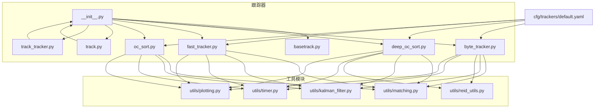
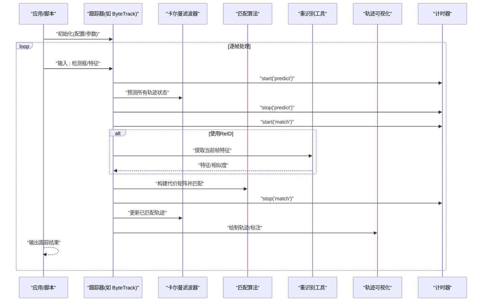
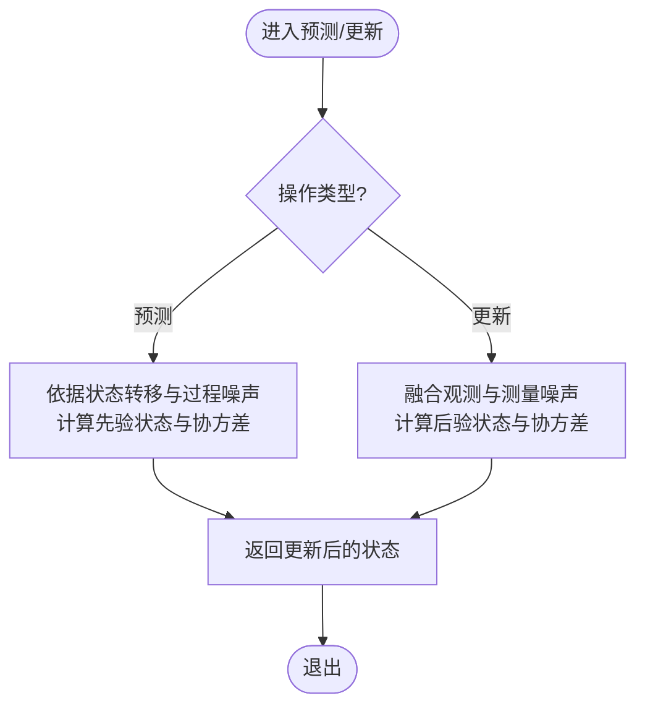
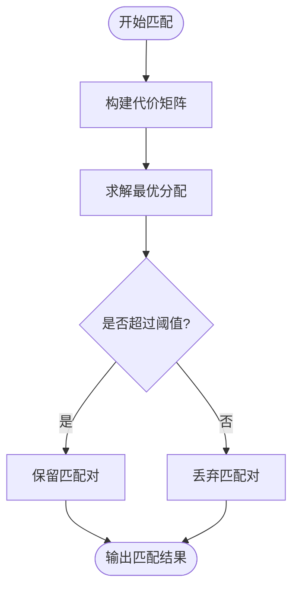
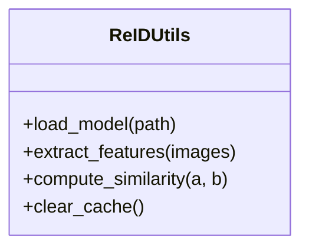
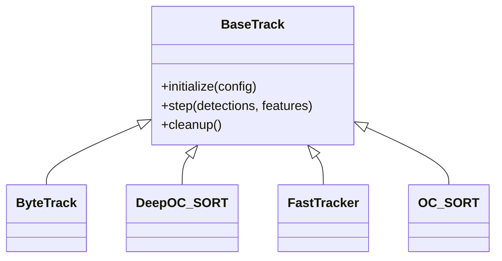
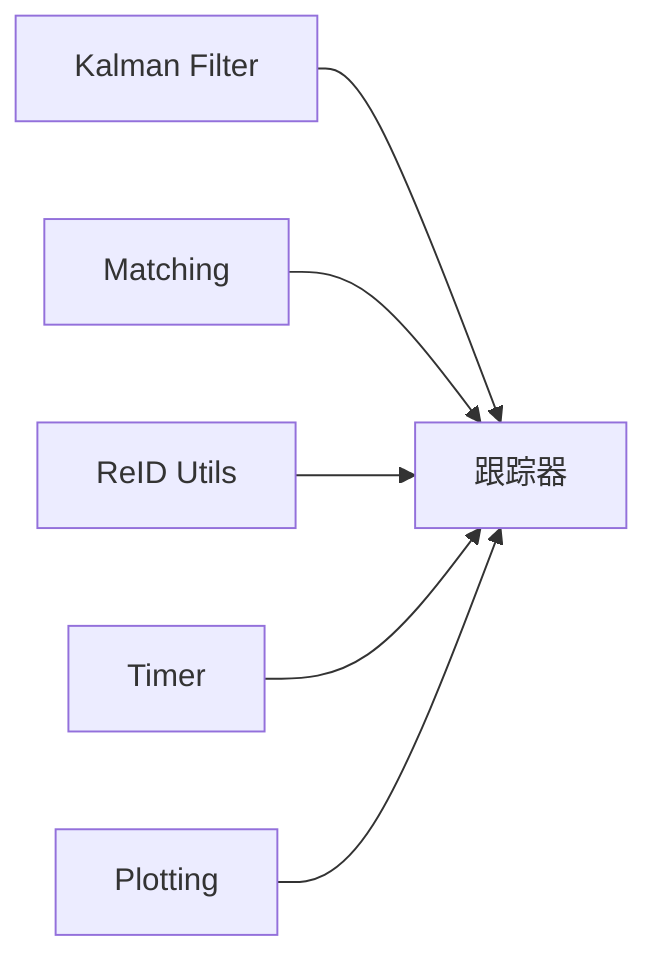

# 跟踪工具模块

<cite>
**本文引用的文件**
- [ultralytics/trackers/__init__.py](file://ultralytics/trackers/__init__.py)
- [ultralytics/trackers/basetrack.py](file://ultralytics/trackers/basetrack.py)
- [ultralytics/trackers/byte_tracker.py](file://ultralytics/trackers/byte_tracker.py)
- [ultralytics/trackers/deep_oc_sort.py](file://ultralytics/trackers/deep_oc_sort.py)
- [ultralytics/trackers/fast_tracker.py](file://ultralytics/trackers/fast_tracker.py)
- [ultralytics/trackers/oc_sort.py](file://ultralytics/trackers/oc_sort.py)
- [ultralytics/trackers/track.py](file://ultralytics/trackers/track.py)
- [ultralytics/trackers/track_tracker.py](file://ultralytics/trackers/track_tracker.py)
- [ultralytics/trackers/utils/matching.py](file://ultralytics/trackers/utils/matching.py)
- [ultralytics/trackers/utils/kalman_filter.py](file://ultralytics/trackers/utils/kalman_filter.py)
- [ultralytics/trackers/utils/reid_utils.py](file://ultralytics/trackers/utils/reid_utils.py)
- [ultralytics/trackers/utils/timer.py](file://ultralytics/trackers/utils/timer.py)
- [ultralytics/trackers/utils/plotting.py](file://ultralytics/trackers/utils/plotting.py)
- [ultralytics/cfg/trackers/default.yaml](file://ultralytics/cfg/trackers/default.yaml)
- [examples/YOLO-Interactive-Tracking-UI/interactive_tracker.py](file://examples/YOLO-Interactive-Tracking-UI/interactive_tracker.py)
</cite>

## 目录
1. [简介](#简介)
2. [项目结构](#项目结构)
3. [核心组件](#核心组件)
4. [架构总览](#架构总览)
5. [详细组件分析](#详细组件分析)
6. [依赖关系分析](#依赖关系分析)
7. [性能考虑](#性能考虑)
8. [故障排查指南](#故障排查指南)
9. [结论](#结论)
10. [附录](#附录)

## 简介
本技术文档聚焦于跟踪系统的“工具模块”，涵盖卡尔曼滤波器、匹配算法、重识别（ReID）工具与轨迹可视化等关键辅助能力，并说明它们如何被上层跟踪器组合使用。文档面向希望理解或扩展跟踪工具链的工程师与研究者，提供接口概览、数据流、配置项、扩展点、组合示例、最佳实践、性能优化与调试方法，以及测试与验证流程建议。

## 项目结构
跟踪工具模块主要位于以下路径：
- 跟踪器实现与入口：ultralytics/trackers/*
- 工具子模块：ultralytics/trackers/utils/*
- 默认配置：ultralytics/cfg/trackers/default.yaml
- 交互式演示：examples/YOLO-Interactive-Tracking-UI/interactive_tracker.py

图表来源
- [ultralytics/trackers/__init__.py](file://ultralytics/trackers/__init__.py)
- [ultralytics/trackers/basetrack.py](file://ultralytics/trackers/basetrack.py)
- [ultralytics/trackers/byte_tracker.py](file://ultralytics/trackers/byte_tracker.py)
- [ultralytics/trackers/deep_oc_sort.py](file://ultralytics/trackers/deep_oc_sort.py)
- [ultralytics/trackers/fast_tracker.py](file://ultralytics/trackers/fast_tracker.py)
- [ultralytics/trackers/oc_sort.py](file://ultralytics/trackers/oc_sort.py)
- [ultralytics/trackers/track.py](file://ultralytics/trackers/track.py)
- [ultralytics/trackers/track_tracker.py](file://ultralytics/trackers/track_tracker.py)
- [ultralytics/trackers/utils/matching.py](file://ultralytics/trackers/utils/matching.py)
- [ultralytics/trackers/utils/kalman_filter.py](file://ultralytics/trackers/utils/kalman_filter.py)
- [ultralytics/trackers/utils/reid_utils.py](file://ultralytics/trackers/utils/reid_utils.py)
- [ultralytics/trackers/utils/timer.py](file://ultralytics/trackers/utils/timer.py)
- [ultralytics/trackers/utils/plotting.py](file://ultralytics/trackers/utils/plotting.py)
- [ultralytics/cfg/trackers/default.yaml](file://ultralytics/cfg/trackers/default.yaml)

章节来源
- [ultralytics/trackers/__init__.py](file://ultralytics/trackers/__init__.py)
- [ultralytics/trackers/basetrack.py](file://ultralytics/trackers/basetrack.py)
- [ultralytics/trackers/byte_tracker.py](file://ultralytics/trackers/byte_tracker.py)
- [ultralytics/trackers/deep_oc_sort.py](file://ultralytics/trackers/deep_oc_sort.py)
- [ultralytics/trackers/fast_tracker.py](file://ultralytics/trackers/fast_tracker.py)
- [ultralytics/trackers/oc_sort.py](file://ultralytics/trackers/oc_sort.py)
- [ultralytics/trackers/track.py](file://ultralytics/trackers/track.py)
- [ultralytics/trackers/track_tracker.py](file://ultralytics/trackers/track_tracker.py)
- [ultralytics/trackers/utils/matching.py](file://ultralytics/trackers/utils/matching.py)
- [ultralytics/trackers/utils/kalman_filter.py](file://ultralytics/trackers/utils/kalman_filter.py)
- [ultralytics/trackers/utils/reid_utils.py](file://ultralytics/trackers/utils/reid_utils.py)
- [ultralytics/trackers/utils/timer.py](file://ultralytics/trackers/utils/timer.py)
- [ultralytics/trackers/utils/plotting.py](file://ultralytics/trackers/utils/plotting.py)
- [ultralytics/cfg/trackers/default.yaml](file://ultralytics/cfg/trackers/default.yaml)

## 核心组件
本节概述各工具模块的职责与对外接口要点，便于快速定位与组合使用。

- 卡尔曼滤波器（Kalman Filter）
  - 功能：对目标状态进行线性高斯预测与更新，支持位置/速度建模与观测融合。
  - 典型接口：初始化、预测（按帧推进）、更新（融合检测框观测）。
  - 复杂度：状态维度固定时，预测/更新为常数时间；矩阵运算规模由状态向量决定。
  - 扩展点：自定义观测模型、过程噪声与观测噪声协方差。

- 匹配算法（Matching）
  - 功能：在检测与轨迹之间建立关联，常用匈牙利算法求解最小代价匹配。
  - 典型接口：计算代价矩阵、执行分配、返回匹配索引。
  - 扩展点：代价函数可替换（IoU、马氏距离、ReID相似度等），阈值策略可调。

- 重识别工具（ReID Utils）
  - 功能：提供特征提取、相似度计算与缓存管理，用于跨帧身份一致性判别。
  - 典型接口：加载模型、提取特征、计算相似度、清理过期缓存。
  - 扩展点：可插拔特征模型、相似度度量、缓存淘汰策略。

- 计时器（Timer）
  - 功能：统计各阶段耗时，便于性能分析与瓶颈定位。
  - 典型接口：开始/结束计时、获取累计耗时、重置。

- 轨迹可视化（Plotting）
  - 功能：绘制轨迹线、历史窗口、ID标注、热力图等，辅助调试与展示。
  - 典型接口：绘制单帧结果、累积轨迹、导出图像。

- 跟踪器基类与具体实现
  - 基类：定义统一的跟踪生命周期（初始化、步进、清理）与通用属性。
  - 具体实现：ByteTrack、DeepOC-SORT、FastTracker、OC-SORT 等，组合上述工具完成不同策略的跟踪。

章节来源
- [ultralytics/trackers/utils/kalman_filter.py](file://ultralytics/trackers/utils/kalman_filter.py)
- [ultralytics/trackers/utils/matching.py](file://ultralytics/trackers/utils/matching.py)
- [ultralytics/trackers/utils/reid_utils.py](file://ultralytics/trackers/utils/reid_utils.py)
- [ultralytics/trackers/utils/timer.py](file://ultralytics/trackers/utils/timer.py)
- [ultralytics/trackers/utils/plotting.py](file://ultralytics/trackers/utils/plotting.py)
- [ultralytics/trackers/basetrack.py](file://ultralytics/trackers/basetrack.py)
- [ultralytics/trackers/byte_tracker.py](file://ultralytics/trackers/byte_tracker.py)
- [ultralytics/trackers/deep_oc_sort.py](file://ultralytics/trackers/deep_oc_sort.py)
- [ultralytics/trackers/fast_tracker.py](file://ultralytics/trackers/fast_tracker.py)
- [ultralytics/trackers/oc_sort.py](file://ultralytics/trackers/oc_sort.py)

## 架构总览
跟踪系统以“跟踪器”为核心编排者，调用工具模块完成预测、匹配、身份判别与可视化。下图展示了典型的数据流与控制流。

图表来源
- [ultralytics/trackers/byte_tracker.py](file://ultralytics/trackers/byte_tracker.py)
- [ultralytics/trackers/utils/kalman_filter.py](file://ultralytics/trackers/utils/kalman_filter.py)
- [ultralytics/trackers/utils/matching.py](file://ultralytics/trackers/utils/matching.py)
- [ultralytics/trackers/utils/reid_utils.py](file://ultralytics/trackers/utils/reid_utils.py)
- [ultralytics/trackers/utils/plotting.py](file://ultralytics/trackers/utils/plotting.py)
- [ultralytics/trackers/utils/timer.py](file://ultralytics/trackers/utils/timer.py)

## 详细组件分析

### 卡尔曼滤波器（Kalman Filter）
- 职责：维护每个轨迹的状态估计，提供预测与更新两个核心步骤。
- 关键接口（概念性）：
  - 初始化：设置状态维、转移矩阵、观测矩阵、协方差。
  - 预测：根据上一时刻状态与过程噪声，推演下一时刻先验。
  - 更新：用当前观测修正先验，得到后验状态。
- 复杂度：O(d^3) 量级（d 为状态维度），通常 d 较小，开销可控。
- 扩展点：
  - 自定义观测模型（例如仅观测中心点或包含宽高）。
  - 自适应噪声调节（基于残差或置信度）。
- 常见陷阱：数值不稳定（协方差非正定）、异常观测导致发散。

图表来源
- [ultralytics/trackers/utils/kalman_filter.py](file://ultralytics/trackers/utils/kalman_filter.py)

章节来源
- [ultralytics/trackers/utils/kalman_filter.py](file://ultralytics/trackers/utils/kalman_filter.py)

### 匹配算法（Matching）
- 职责：将当前帧检测与已有轨迹进行一一对应，最大化整体匹配质量。
- 关键接口（概念性）：
  - 构建代价矩阵：综合 IoU、马氏距离、ReID 相似度等。
  - 执行分配：使用匈牙利算法或其他最优分配求解器。
  - 过滤未匹配：根据阈值判定是否保留候选。
- 复杂度：O(n^3)（n 为候选数），可通过剪枝与阈值降低实际规模。
- 扩展点：
  - 代价函数可插拔（几何/外观/运动一致性）。
  - 多阶段匹配（先粗配再精配）。
- 常见陷阱：阈值不当导致 ID 切换或漏跟；大规模场景下性能退化。

图表来源
- [ultralytics/trackers/utils/matching.py](file://ultralytics/trackers/utils/matching.py)

章节来源
- [ultralytics/trackers/utils/matching.py](file://ultralytics/trackers/utils/matching.py)

### 重识别工具（ReID Utils）
- 职责：提供外观特征提取与相似度计算，增强长时跟踪鲁棒性。
- 关键接口（概念性）：
  - 加载模型与预处理管线。
  - 提取特征向量。
  - 计算相似度（余弦/欧氏等）。
  - 缓存管理与失效策略。
- 复杂度：取决于特征模型大小与批量尺寸；可批量化推理提升吞吐。
- 扩展点：
  - 替换特征模型（轻量/高精度）。
  - 动态阈值与在线校准。
- 常见陷阱：内存泄漏（缓存过大）、特征漂移（需定期刷新）。

图表来源
- [ultralytics/trackers/utils/reid_utils.py](file://ultralytics/trackers/utils/reid_utils.py)

章节来源
- [ultralytics/trackers/utils/reid_utils.py](file://ultralytics/trackers/utils/reid_utils.py)

### 轨迹可视化（Plotting）
- 职责：将跟踪结果直观呈现，包括轨迹线、历史窗口、ID 标签、热力图等。
- 关键接口（概念性）：
  - 绘制单帧结果。
  - 累积绘制轨迹。
  - 导出图像/视频片段。
- 扩展点：
  - 自定义样式（颜色映射、线宽、透明度）。
  - 叠加其他信息（速度矢量、置信度）。

章节来源
- [ultralytics/trackers/utils/plotting.py](file://ultralytics/trackers/utils/plotting.py)

### 计时器（Timer）
- 职责：细粒度统计各阶段耗时，支撑性能分析与调优。
- 关键接口（概念性）：
  - start/stop/reset。
  - 查询累计耗时与均值。
- 使用建议：在预测、匹配、ReID、绘图等关键路径埋点。

章节来源
- [ultralytics/trackers/utils/timer.py](file://ultralytics/trackers/utils/timer.py)

### 跟踪器基类与具体实现
- 基类（BaseTrack）：统一生命周期与通用属性，定义抽象接口供子类实现。
- 具体实现：
  - ByteTrack：结合多尺度检测与轨迹关联，适合复杂场景。
  - DeepOC-SORT：引入深度外观特征与排序逻辑，提高遮挡恢复能力。
  - FastTracker：轻量化设计，强调低延迟。
  - OC-SORT：经典排序型跟踪器，侧重速度与稳定性平衡。
- 组合模式：各跟踪器通过工具模块拼装出不同策略。

图表来源
- [ultralytics/trackers/basetrack.py](file://ultralytics/trackers/basetrack.py)
- [ultralytics/trackers/byte_tracker.py](file://ultralytics/trackers/byte_tracker.py)
- [ultralytics/trackers/deep_oc_sort.py](file://ultralytics/trackers/deep_oc_sort.py)
- [ultralytics/trackers/fast_tracker.py](file://ultralytics/trackers/fast_tracker.py)
- [ultralytics/trackers/oc_sort.py](file://ultralytics/trackers/oc_sort.py)

章节来源
- [ultralytics/trackers/basetrack.py](file://ultralytics/trackers/basetrack.py)
- [ultralytics/trackers/byte_tracker.py](file://ultralytics/trackers/byte_tracker.py)
- [ultralytics/trackers/deep_oc_sort.py](file://ultralytics/trackers/deep_oc_sort.py)
- [ultralytics/trackers/fast_tracker.py](file://ultralytics/trackers/fast_tracker.py)
- [ultralytics/trackers/oc_sort.py](file://ultralytics/trackers/oc_sort.py)

## 依赖关系分析
- 内聚与耦合
  - 工具模块高度内聚且低耦合，便于替换与复用。
  - 跟踪器作为编排层，依赖工具模块但不反向依赖具体实现细节。
- 外部依赖
  - 数值库（矩阵运算）、图匹配库（匈牙利算法）、深度学习框架（ReID 推理）。
- 潜在循环依赖
  - 工具模块之间无直接循环；跟踪器与工具为单向依赖。
- 接口契约
  - 工具模块通过稳定接口暴露能力，跟踪器通过配置注入行为。

图表来源
- [ultralytics/trackers/utils/kalman_filter.py](file://ultralytics/trackers/utils/kalman_filter.py)
- [ultralytics/trackers/utils/matching.py](file://ultralytics/trackers/utils/matching.py)
- [ultralytics/trackers/utils/reid_utils.py](file://ultralytics/trackers/utils/reid_utils.py)
- [ultralytics/trackers/utils/timer.py](file://ultralytics/trackers/utils/timer.py)
- [ultralytics/trackers/utils/plotting.py](file://ultralytics/trackers/utils/plotting.py)

章节来源
- [ultralytics/trackers/utils/kalman_filter.py](file://ultralytics/trackers/utils/kalman_filter.py)
- [ultralytics/trackers/utils/matching.py](file://ultralytics/trackers/utils/matching.py)
- [ultralytics/trackers/utils/reid_utils.py](file://ultralytics/trackers/utils/reid_utils.py)
- [ultralytics/trackers/utils/timer.py](file://ultralytics/trackers/utils/timer.py)
- [ultralytics/trackers/utils/plotting.py](file://ultralytics/trackers/utils/plotting.py)

## 性能考虑
- 批量化与并行化
  - ReID 特征提取尽量批量化；GPU 上利用并行减少延迟。
- 阈值与剪枝
  - 匹配前对候选集做预筛选（如 IoU 阈值、距离阈值），降低代价矩阵规模。
- 状态维度与数值稳定
  - 合理设置卡尔曼状态维度；必要时加入正则化避免协方差奇异。
- 缓存与内存管理
  - ReID 特征缓存设置上限与 TTL，防止内存增长。
- 计时与热点定位
  - 使用计时器在关键路径埋点，定位瓶颈后进行针对性优化。

[本节为通用指导，不直接分析具体文件]

## 故障排查指南
- 常见问题
  - ID 频繁切换：检查匹配阈值、ReID 相似度权重与轨迹存活策略。
  - 轨迹发散：调整卡尔曼过程/观测噪声，增加异常观测剔除。
  - 性能不足：启用批量化、减少 ReID 频率、裁剪候选集。
- 调试技巧
  - 开启可视化，观察轨迹连续性、匹配对应关系。
  - 打印关键中间变量（代价矩阵分布、匹配成功率、未匹配比例）。
  - 使用计时器对比不同配置下的耗时差异。
- 回归与验证
  - 针对问题场景构造小样本用例，确保修复后指标回退不出现。

章节来源
- [ultralytics/trackers/utils/timer.py](file://ultralytics/trackers/utils/timer.py)
- [ultralytics/trackers/utils/plotting.py](file://ultralytics/trackers/utils/plotting.py)

## 结论
跟踪工具模块以清晰的分层与稳定的接口，为多种跟踪策略提供了可复用的基础能力。通过合理配置与组合，可在精度、速度与鲁棒性之间取得良好平衡。建议在真实场景中持续监控关键指标，并结合可视化工具与计时器进行迭代优化。

[本节为总结性内容，不直接分析具体文件]

## 附录

### 配置选项与自定义扩展点
- 默认配置
  - 路径：ultralytics/cfg/trackers/default.yaml
  - 作用：集中管理跟踪器参数（阈值、噪声、ReID 开关等）。
- 扩展点
  - 自定义代价函数：在匹配模块中注册新度量。
  - 自定义观测模型：在卡尔曼滤波器中替换观测矩阵。
  - 自定义可视化：在绘图模块中添加图层或样式。

章节来源
- [ultralytics/cfg/trackers/default.yaml](file://ultralytics/cfg/trackers/default.yaml)

### 组合使用示例与最佳实践
- 示例脚本
  - 交互式跟踪 UI：examples/YOLO-Interactive-Tracking-UI/interactive_tracker.py
  - 用途：演示如何在应用中集成跟踪器与工具模块，进行实时可视化与交互。
- 最佳实践
  - 先运行轻量跟踪器（如 FastTracker）评估基线，再逐步引入 ReID 与更复杂的匹配策略。
  - 针对不同场景调参：拥挤场景提高外观权重，高速场景强化运动模型。
  - 使用计时器与可视化闭环验证改进效果。

章节来源
- [examples/YOLO-Interactive-Tracking-UI/interactive_tracker.py](file://examples/YOLO-Interactive-Tracking-UI/interactive_tracker.py)

### 测试方法与验证流程
- 单元测试
  - 针对工具模块编写独立用例：匹配正确性、卡尔曼收敛性、ReID 相似度范围。
- 集成测试
  - 端到端跑通跟踪流程，验证输出格式与基本指标。
- 回归测试
  - 保存基准数据集与结果，确保后续修改不破坏既有性能。
- 性能测试
  - 在不同分辨率与硬件上测量延迟与吞吐，记录计时器汇总。

[本节为通用指导，不直接分析具体文件]