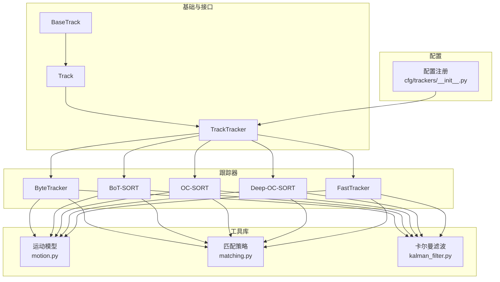
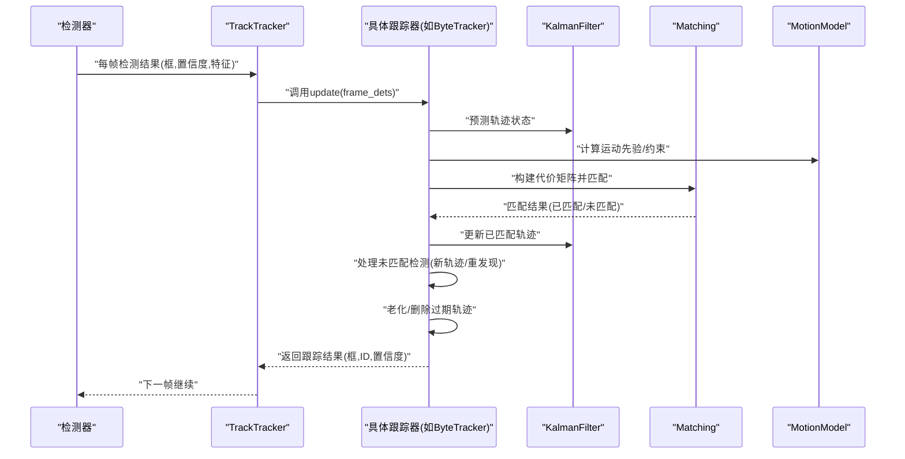
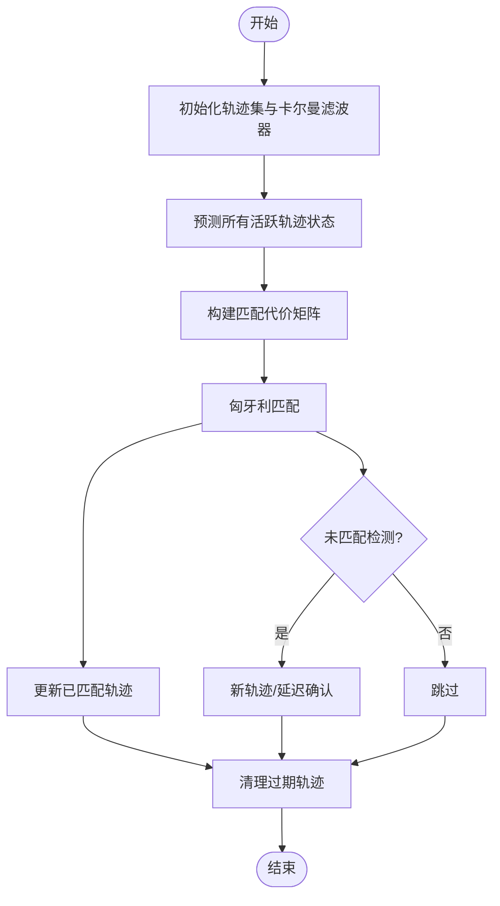
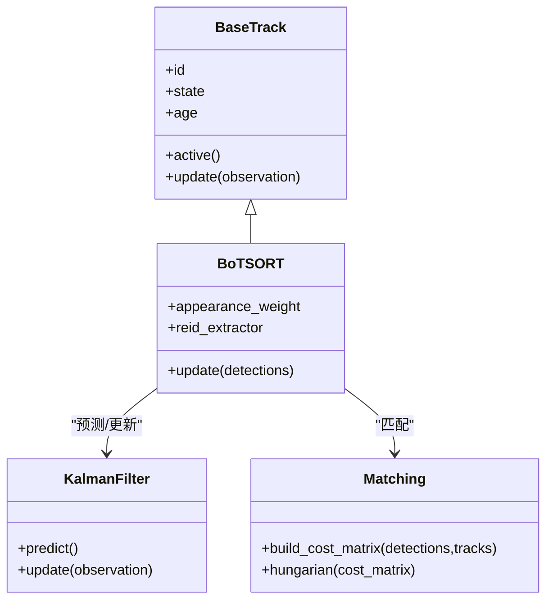
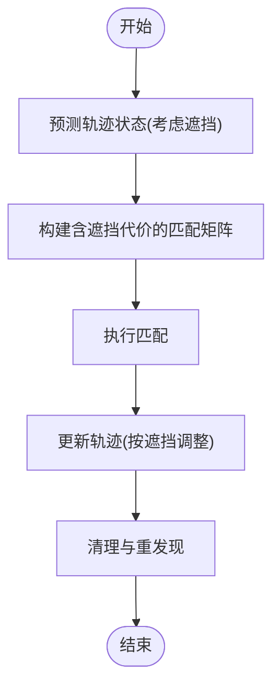
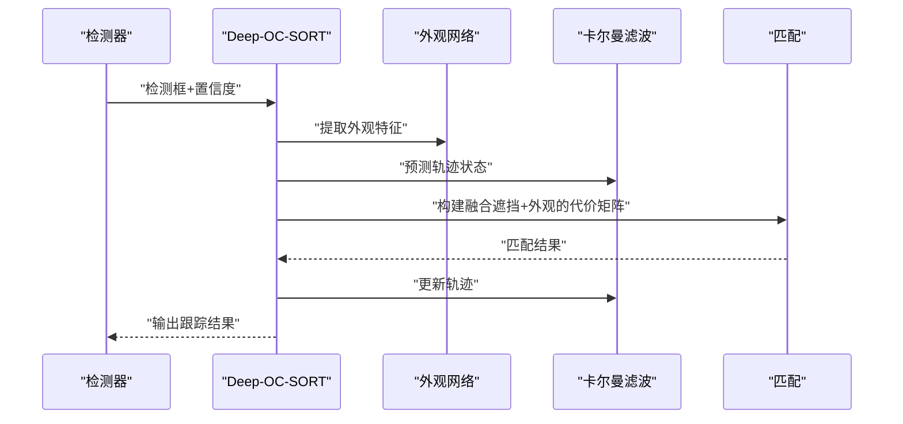
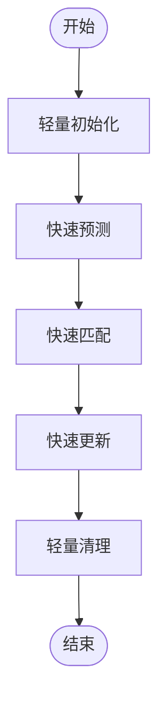
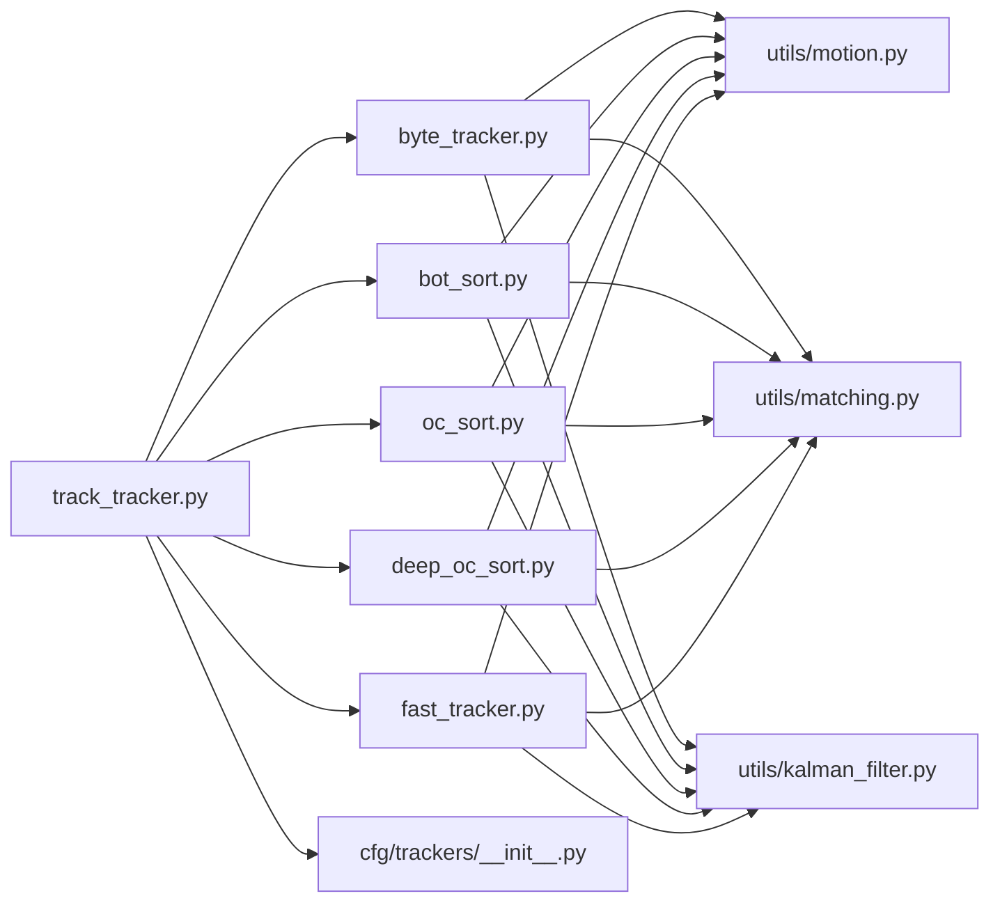

# 跟踪算法实现

<cite>
**本文引用的文件**
- [ultralytics/trackers/basetrack.py](file://ultralytics/trackers/basetrack.py)
- [ultralytics/trackers/byte_tracker.py](file://ultralytics/trackers/byte_tracker.py)
- [ultralytics/trackers/bot_sort.py](file://ultralytics/trackers/bot_sort.py)
- [ultralytics/trackers/oc_sort.py](file://ultralytics/trackers/oc_sort.py)
- [ultralytics/trackers/deep_oc_sort.py](file://ultralytics/trackers/deep_oc_sort.py)
- [ultralytics/trackers/fast_tracker.py](file://ultralytics/trackers/fast_tracker.py)
- [ultralytics/trackers/track.py](file://ultralytics/trackers/track.py)
- [ultralytics/trackers/track_tracker.py](file://ultralytics/trackers/track_tracker.py)
- [ultralytics/trackers/utils/motion.py](file://ultralytics/trackers/utils/motion.py)
- [ultralytics/trackers/utils/matching.py](file://ultralytics/trackers/utils/matching.py)
- [ultralytics/trackers/utils/kalman_filter.py](file://ultralytics/trackers/utils/kalman_filter.py)
- [ultralytics/cfg/trackers/__init__.py](file://ultralytics/cfg/trackers/__init__.py)
</cite>

## 目录
1. [简介](#简介)
2. [项目结构](#项目结构)
3. [核心组件](#核心组件)
4. [架构总览](#架构总览)
5. [详细组件分析](#详细组件分析)
6. [依赖关系分析](#依赖关系分析)
7. [性能考量](#性能考量)
8. [故障排查指南](#故障排查指南)
9. [结论](#结论)
10. [附录](#附录)

## 简介
本技术文档聚焦于 YOLO-Master 中的多目标跟踪（MOT）算法实现，覆盖 ByteTrack、BoT-SORT、OC-SORT、Deep-OC-SORT、FastTracker 等主流算法的数学模型与代码实现细节。文档从系统架构、数据流、关键数据结构与核心方法入手，解释各算法的适用场景、性能特点与配置参数，并提供调优建议、扩展点与自定义开发方法，帮助读者快速理解并高效使用这些跟踪器。

## 项目结构
跟踪子系统位于 ultralytics/trackers 目录下，采用“基类 + 具体算法 + 工具库”的分层组织方式：
- 基类与统一接口：basetrack.py、track.py、track_tracker.py
- 具体算法实现：byte_tracker.py、bot_sort.py、oc_sort.py、deep_oc_sort.py、fast_tracker.py
- 通用工具：utils/motion.py、utils/matching.py、utils/kalman_filter.py
- 配置注册：cfg/trackers/__init__.py

图表来源
- [ultralytics/trackers/basetrack.py](file://ultralytics/trackers/basetrack.py)
- [ultralytics/trackers/track.py](file://ultralytics/trackers/track.py)
- [ultralytics/trackers/track_tracker.py](file://ultralytics/trackers/track_tracker.py)
- [ultralytics/trackers/byte_tracker.py](file://ultralytics/trackers/byte_tracker.py)
- [ultralytics/trackers/bot_sort.py](file://ultralytics/trackers/bot_sort.py)
- [ultralytics/trackers/oc_sort.py](file://ultralytics/trackers/oc_sort.py)
- [ultralytics/trackers/deep_oc_sort.py](file://ultralytics/trackers/deep_oc_sort.py)
- [ultralytics/trackers/fast_tracker.py](file://ultralytics/trackers/fast_tracker.py)
- [ultralytics/trackers/utils/motion.py](file://ultralytics/trackers/utils/motion.py)
- [ultralytics/trackers/utils/matching.py](file://ultralytics/trackers/utils/matching.py)
- [ultralytics/trackers/utils/kalman_filter.py](file://ultralytics/trackers/utils/kalman_filter.py)
- [ultralytics/cfg/trackers/__init__.py](file://ultralytics/cfg/trackers/__init__.py)

章节来源
- [ultralytics/trackers/basetrack.py](file://ultralytics/trackers/basetrack.py)
- [ultralytics/trackers/track.py](file://ultralytics/trackers/track.py)
- [ultralytics/trackers/track_tracker.py](file://ultralytics/trackers/track_tracker.py)
- [ultralytics/trackers/utils/motion.py](file://ultralytics/trackers/utils/motion.py)
- [ultralytics/trackers/utils/matching.py](file://ultralytics/trackers/utils/matching.py)
- [ultralytics/trackers/utils/kalman_filter.py](file://ultralytics/trackers/utils/kalman_filter.py)
- [ultralytics/cfg/trackers/__init__.py](file://ultralytics/cfg/trackers/__init__.py)

## 核心组件
- 基类与接口
  - BaseTrack：定义轨迹对象的最小公共属性与方法，如唯一ID、状态管理、生命周期控制等。
  - Track：封装单帧检测输入到跟踪输出的基本流程，包括预测、关联、更新、消亡管理等。
  - TrackTracker：提供统一的初始化、运行接口，负责调度具体跟踪器实例，维护全局轨迹集合与时间步推进。
- 工具库
  - motion.py：运动模型（如匀速/匀加速）、状态转移矩阵、观测矩阵等。
  - matching.py：匈牙利匹配、距离度量（IoU、马氏距离、外观相似度等）。
  - kalman_filter.py：卡尔曼滤波实现，用于状态预测与更新。
- 配置注册
  - cfg/trackers/__init__.py：集中注册不同跟踪器的构造方法与默认参数，便于外部通过名称选择。

章节来源
- [ultralytics/trackers/basetrack.py](file://ultralytics/trackers/basetrack.py)
- [ultralytics/trackers/track.py](file://ultralytics/trackers/track.py)
- [ultralytics/trackers/track_tracker.py](file://ultralytics/trackers/track_tracker.py)
- [ultralytics/trackers/utils/motion.py](file://ultralytics/trackers/utils/motion.py)
- [ultralytics/trackers/utils/matching.py](file://ultralytics/trackers/utils/matching.py)
- [ultralytics/trackers/utils/kalman_filter.py](file://ultralytics/trackers/utils/kalman_filter.py)
- [ultralytics/cfg/trackers/__init__.py](file://ultralytics/cfg/trackers/__init__.py)

## 架构总览
下图展示了典型的一帧处理时序：检测输出进入跟踪器，进行状态预测、关联匹配、轨迹更新与未匹配项处理，最终输出带ID的目标框序列。

图表来源
- [ultralytics/trackers/track_tracker.py](file://ultralytics/trackers/track_tracker.py)
- [ultralytics/trackers/byte_tracker.py](file://ultralytics/trackers/byte_tracker.py)
- [ultralytics/trackers/bot_sort.py](file://ultralytics/trackers/bot_sort.py)
- [ultralytics/trackers/oc_sort.py](file://ultralytics/trackers/oc_sort.py)
- [ultralytics/trackers/deep_oc_sort.py](file://ultralytics/trackers/deep_oc_sort.py)
- [ultralytics/trackers/fast_tracker.py](file://ultralytics/trackers/fast_tracker.py)
- [ultralytics/trackers/utils/kalman_filter.py](file://ultralytics/trackers/utils/kalman_filter.py)
- [ultralytics/trackers/utils/matching.py](file://ultralytics/trackers/utils/matching.py)
- [ultralytics/trackers/utils/motion.py](file://ultralytics/trackers/utils/motion.py)

## 详细组件分析

### ByteTracker
- 核心思想
  - 基于低阈值检测保留更多候选，利用轨迹与检测之间的关联进行匹配；对未匹配的检测尝试在后续帧中重新关联，提升召回率。
  - 通常结合卡尔曼滤波预测与IoU/马氏距离等度量进行匹配。
- 适用场景
  - 高遮挡、密集场景下需要较高召回率的视频跟踪。
- 关键数据结构
  - 轨迹集合、待匹配队列、历史匹配记录、卡尔曼状态。
- 核心方法
  - 初始化：加载默认参数、创建轨迹容器、设置卡尔曼滤波器。
  - 预测：对所有活跃轨迹进行状态预测。
  - 匹配：构建代价矩阵，执行匈牙利匹配。
  - 更新：对已匹配轨迹进行观测更新；对未匹配检测进行新轨迹或延迟确认。
  - 清理：按年龄/置信度阈值淘汰轨迹。
- 配置参数要点
  - 低阈值、高阈值、最大失配次数、卡尔曼噪声、匹配阈值等。
- 性能特点
  - 在复杂场景中鲁棒性较好，但需权衡误检与计算开销。

图表来源
- [ultralytics/trackers/byte_tracker.py](file://ultralytics/trackers/byte_tracker.py)
- [ultralytics/trackers/utils/matching.py](file://ultralytics/trackers/utils/matching.py)
- [ultralytics/trackers/utils/kalman_filter.py](file://ultralytics/trackers/utils/kalman_filter.py)
- [ultralytics/trackers/utils/motion.py](file://ultralytics/trackers/utils/motion.py)

章节来源
- [ultralytics/trackers/byte_tracker.py](file://ultralytics/trackers/byte_tracker.py)
- [ultralytics/trackers/utils/matching.py](file://ultralytics/trackers/utils/matching.py)
- [ultralytics/trackers/utils/kalman_filter.py](file://ultralytics/trackers/utils/kalman_filter.py)
- [ultralytics/trackers/utils/motion.py](file://ultralytics/trackers/utils/motion.py)

### BoT-SORT
- 核心思想
  - 在SORT基础上引入外观特征（Re-ID）与更稳健的运动模型，结合卡尔曼滤波与外观相似度进行联合匹配。
- 适用场景
  - 存在长时间遮挡、身份切换频繁的场景，强调身份一致性。
- 关键数据结构
  - 轨迹外观特征缓存、外观相似度矩阵、运动状态。
- 核心方法
  - 初始化：加载外观特征提取器、设置外观权重与运动权重。
  - 预测与更新：同卡尔曼框架，但在代价矩阵中加入外观项。
  - 匹配：加权组合IoU/马氏距离与外观相似度。
  - 清理：基于外观稳定性与轨迹寿命综合判断。
- 配置参数要点
  - 外观相似度阈值、外观权重、卡尔曼噪声、轨迹寿命等。
- 性能特点
  - 身份保持能力强，但对外观特征质量敏感，计算开销高于纯运动模型。

图表来源
- [ultralytics/trackers/basetrack.py](file://ultralytics/trackers/basetrack.py)
- [ultralytics/trackers/bot_sort.py](file://ultralytics/trackers/bot_sort.py)
- [ultralytics/trackers/utils/kalman_filter.py](file://ultralytics/trackers/utils/kalman_filter.py)
- [ultralytics/trackers/utils/matching.py](file://ultralytics/trackers/utils/matching.py)

章节来源
- [ultralytics/trackers/bot_sort.py](file://ultralytics/trackers/bot_sort.py)
- [ultralytics/trackers/basetrack.py](file://ultralytics/trackers/basetrack.py)
- [ultralytics/trackers/utils/kalman_filter.py](file://ultralytics/trackers/utils/kalman_filter.py)
- [ultralytics/trackers/utils/matching.py](file://ultralytics/trackers/utils/matching.py)

### OC-SORT
- 核心思想
  - 引入遮挡感知（Occlusion-aware）的匹配策略，针对遮挡导致的检测缺失与误检进行优化，常结合运动一致性与遮挡概率。
- 适用场景
  - 遮挡严重、目标进出频繁的场景。
- 关键数据结构
  - 遮挡估计、轨迹可见性标记、遮挡代价。
- 核心方法
  - 初始化：设置遮挡阈值与代价函数。
  - 预测：考虑遮挡可能性的状态预测。
  - 匹配：加入遮挡惩罚，避免错误关联。
  - 更新：根据遮挡情况调整轨迹置信度与寿命。
- 配置参数要点
  - 遮挡阈值、遮挡代价权重、匹配阈值等。
- 性能特点
  - 在遮挡环境下稳定性提升，但需合理调节遮挡相关参数以避免过度保守。

图表来源
- [ultralytics/trackers/oc_sort.py](file://ultralytics/trackers/oc_sort.py)
- [ultralytics/trackers/utils/matching.py](file://ultralytics/trackers/utils/matching.py)
- [ultralytics/trackers/utils/kalman_filter.py](file://ultralytics/trackers/utils/kalman_filter.py)
- [ultralytics/trackers/utils/motion.py](file://ultralytics/trackers/utils/motion.py)

章节来源
- [ultralytics/trackers/oc_sort.py](file://ultralytics/trackers/oc_sort.py)
- [ultralytics/trackers/utils/matching.py](file://ultralytics/trackers/utils/matching.py)
- [ultralytics/trackers/utils/kalman_filter.py](file://ultralytics/trackers/utils/kalman_filter.py)
- [ultralytics/trackers/utils/motion.py](file://ultralytics/trackers/utils/motion.py)

### Deep-OC-SORT
- 核心思想
  - 在OC-SORT基础上引入深度外观特征，增强遮挡环境下的身份识别能力。
- 适用场景
  - 遮挡+身份混淆严重的复杂场景。
- 关键数据结构
  - 深度外观嵌入、遮挡估计、轨迹外观缓存。
- 核心方法
  - 初始化：加载外观网络与遮挡模块。
  - 预测与匹配：融合运动、遮挡与外观信息。
  - 更新：依据外观稳定性与遮挡情况动态调整轨迹。
- 配置参数要点
  - 外观权重、遮挡阈值、外观相似度阈值、网络推理开销控制。
- 性能特点
  - 精度更高，但计算成本显著增加，适合离线或算力充足场景。

图表来源
- [ultralytics/trackers/deep_oc_sort.py](file://ultralytics/trackers/deep_oc_sort.py)
- [ultralytics/trackers/utils/kalman_filter.py](file://ultralytics/trackers/utils/kalman_filter.py)
- [ultralytics/trackers/utils/matching.py](file://ultralytics/trackers/utils/matching.py)

章节来源
- [ultralytics/trackers/deep_oc_sort.py](file://ultralytics/trackers/deep_oc_sort.py)
- [ultralytics/trackers/utils/kalman_filter.py](file://ultralytics/trackers/utils/kalman_filter.py)
- [ultralytics/trackers/utils/matching.py](file://ultralytics/trackers/utils/matching.py)

### FastTracker
- 核心思想
  - 面向实时性优化的轻量级跟踪器，简化外观与遮挡建模，侧重速度与稳定性的平衡。
- 适用场景
  - 实时视频流、边缘设备部署。
- 关键数据结构
  - 精简轨迹状态、轻量匹配代价。
- 核心方法
  - 初始化：最小化参数与内存占用。
  - 预测与匹配：使用简化的运动模型与快速匹配策略。
  - 更新：快速更新与清理，减少计算路径。
- 配置参数要点
  - 匹配阈值、轨迹寿命、卡尔曼噪声等轻量化设置。
- 性能特点
  - 速度优先，精度略低于复杂模型，适合资源受限环境。

图表来源
- [ultralytics/trackers/fast_tracker.py](file://ultralytics/trackers/fast_tracker.py)
- [ultralytics/trackers/utils/matching.py](file://ultralytics/trackers/utils/matching.py)
- [ultralytics/trackers/utils/kalman_filter.py](file://ultralytics/trackers/utils/kalman_filter.py)

章节来源
- [ultralytics/trackers/fast_tracker.py](file://ultralytics/trackers/fast_tracker.py)
- [ultralytics/trackers/utils/matching.py](file://ultralytics/trackers/utils/matching.py)
- [ultralytics/trackers/utils/kalman_filter.py](file://ultralytics/trackers/utils/kalman_filter.py)

## 依赖关系分析
- 耦合与内聚
  - 具体跟踪器均依赖统一的运动模型、匹配策略与卡尔曼滤波，形成高内聚、低耦合的结构。
- 直接依赖
  - byte_tracker.py、bot_sort.py、oc_sort.py、deep_oc_sort.py、fast_tracker.py 均导入 utils/motion.py、utils/matching.py、utils/kalman_filter.py。
- 间接依赖
  - track_tracker.py 作为统一入口，通过配置注册表选择具体算法实例。
- 外部集成点
  - 外观特征提取器（BoT-SORT、Deep-OC-SORT）可替换为不同后端（ONNX/TensorRT/CPU），以适配部署需求。

图表来源
- [ultralytics/trackers/byte_tracker.py](file://ultralytics/trackers/byte_tracker.py)
- [ultralytics/trackers/bot_sort.py](file://ultralytics/trackers/bot_sort.py)
- [ultralytics/trackers/oc_sort.py](file://ultralytics/trackers/oc_sort.py)
- [ultralytics/trackers/deep_oc_sort.py](file://ultralytics/trackers/deep_oc_sort.py)
- [ultralytics/trackers/fast_tracker.py](file://ultralytics/trackers/fast_tracker.py)
- [ultralytics/trackers/track_tracker.py](file://ultralytics/trackers/track_tracker.py)
- [ultralytics/trackers/utils/motion.py](file://ultralytics/trackers/utils/motion.py)
- [ultralytics/trackers/utils/matching.py](file://ultralytics/trackers/utils/matching.py)
- [ultralytics/trackers/utils/kalman_filter.py](file://ultralytics/trackers/utils/kalman_filter.py)
- [ultralytics/cfg/trackers/__init__.py](file://ultralytics/cfg/trackers/__init__.py)

章节来源
- [ultralytics/trackers/track_tracker.py](file://ultralytics/trackers/track_tracker.py)
- [ultralytics/cfg/trackers/__init__.py](file://ultralytics/cfg/trackers/__init__.py)

## 性能考量
- 复杂度与开销
  - 外观特征提取（BoT-SORT、Deep-OC-SORT）带来额外计算，建议在GPU或专用加速器上运行。
  - 匹配阶段的时间复杂度与检测数×轨迹数成正比，可通过限制轨迹数量与提前剪枝降低开销。
- 内存与缓存
  - 外观特征缓存需控制大小与刷新频率，避免内存泄漏。
- 数值稳定性
  - 卡尔曼滤波的协方差矩阵需定期正则化，防止数值不稳定。
- 并行与批处理
  - 匹配与外观特征提取可并行化，充分利用多核/GPU。
- 部署优化
  - 将外观网络导出为ONNX/TensorRT，减少Python运行时开销。

[本节为通用指导，不直接分析具体文件]

## 故障排查指南
- 常见问题
  - ID频繁跳变：检查外观相似度阈值与权重，适当提高外观稳定性要求。
  - 漏检增多：降低低阈值或放宽匹配阈值，关注遮挡相关参数。
  - 计算超时：启用FastTracker或关闭外观特征，减少匹配规模。
  - 数值异常：检查卡尔曼噪声与协方差更新逻辑，必要时添加数值保护。
- 调试建议
  - 打印匹配代价矩阵与匹配结果，定位错误关联。
  - 可视化轨迹寿命与置信度变化，辅助参数调优。
  - 分模块测试（仅运动/仅外观/联合），隔离问题来源。

章节来源
- [ultralytics/trackers/byte_tracker.py](file://ultralytics/trackers/byte_tracker.py)
- [ultralytics/trackers/bot_sort.py](file://ultralytics/trackers/bot_sort.py)
- [ultralytics/trackers/oc_sort.py](file://ultralytics/trackers/oc_sort.py)
- [ultralytics/trackers/deep_oc_sort.py](file://ultralytics/trackers/deep_oc_sort.py)
- [ultralytics/trackers/fast_tracker.py](file://ultralytics/trackers/fast_tracker.py)
- [ultralytics/trackers/utils/matching.py](file://ultralytics/trackers/utils/matching.py)
- [ultralytics/trackers/utils/kalman_filter.py](file://ultralytics/trackers/utils/kalman_filter.py)

## 结论
YOLO-Master的跟踪子系统以清晰的基类与工具库为基础，提供了多种主流跟踪算法的实现。ByteTrack在召回率与鲁棒性方面表现优异；BoT-SORT与Deep-OC-SORT在身份一致性上更强；OC-SORT针对遮挡进行了专门优化；FastTracker则面向实时与资源受限场景。实际应用中应根据场景特性（遮挡、密度、算力）选择合适的算法，并通过合理的参数调优与部署优化达到最佳效果。

[本节为总结性内容，不直接分析具体文件]

## 附录
- 使用模式与示例
  - 通过配置注册表选择跟踪器名称，初始化后逐帧调用update接口即可得到跟踪结果。
  - 示例参考路径：examples/object_tracking.ipynb（概念性说明，非代码片段）。
- 扩展与自定义
  - 新增跟踪器：继承基类并在配置注册表中注册，实现update接口以完成预测、匹配、更新与清理。
  - 替换外观特征：在BoT-SORT/Deep-OC-SORT中注入新的外观提取器，确保输出维度与归一化一致。
  - 自定义匹配代价：在matching.py中扩展代价函数，并在具体跟踪器中接入。

章节来源
- [ultralytics/cfg/trackers/__init__.py](file://ultralytics/cfg/trackers/__init__.py)
- [ultralytics/trackers/basetrack.py](file://ultralytics/trackers/basetrack.py)
- [ultralytics/trackers/track.py](file://ultralytics/trackers/track.py)
- [ultralytics/trackers/track_tracker.py](file://ultralytics/trackers/track_tracker.py)
- [ultralytics/trackers/utils/matching.py](file://ultralytics/trackers/utils/matching.py)