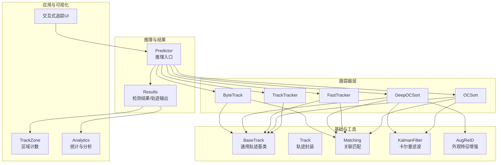
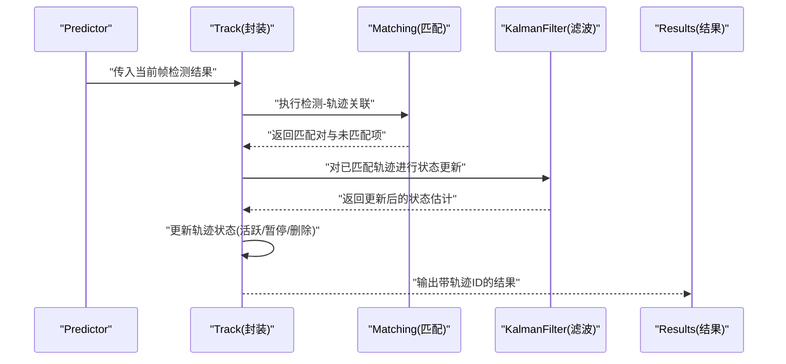
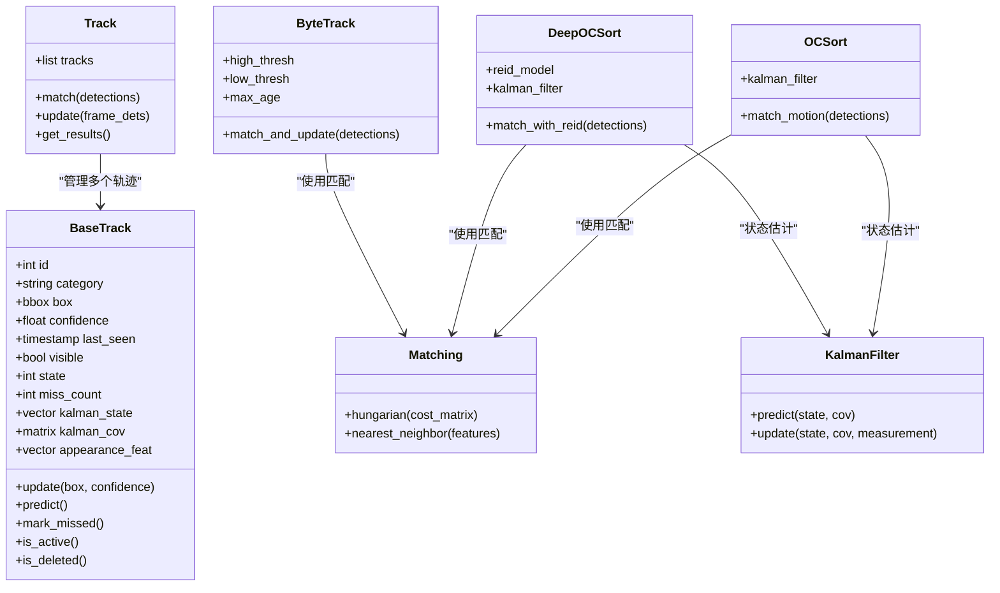
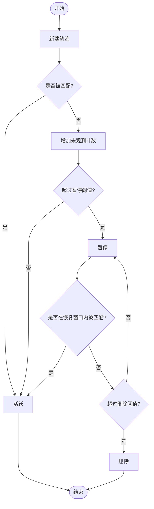
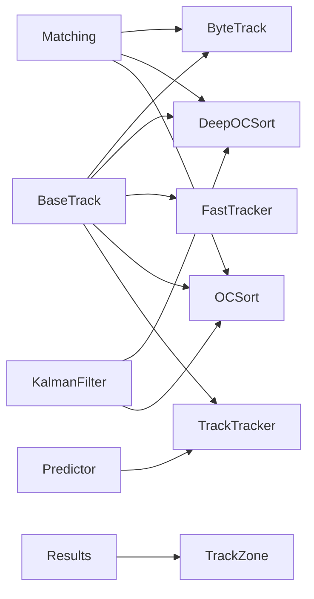

# 轨迹管理与生命周期

<cite>
**本文引用的文件**
- [ultralytics/trackers/__init__.py](file://ultralytics/trackers/__init__.py)
- [ultralytics/trackers/basetrack.py](file://ultralytics/trackers/basetrack.py)
- [ultralytics/trackers/byte_tracker.py](file://ultralytics/trackers/byte_tracker.py)
- [ultralytics/trackers/deep_oc_sort.py](file://ultralytics/trackers/deep_oc_sort.py)
- [ultralytics/trackers/fast_tracker.py](file://ultralytics/trackers/fast_tracker.py)
- [ultralytics/trackers/oc_sort.py](file://ultralytics/trackers/oc_sort.py)
- [ultralytics/trackers/track.py](file://ultralytics/trackers/track.py)
- [ultralytics/trackers/track_tracker.py](file://ultralytics/trackers/track_tracker.py)
- [ultralytics/trackers/utils/matching.py](file://ultralytics/trackers/utils/matching.py)
- [ultralytics/trackers/utils/kalman_filter.py](file://ultralytics/trackers/utils/kalman_filter.py)
- [ultralytics/trackers/utils/aug_reid.py](file://ultralytics/trackers/utils/aug_reid.py)
- [ultralytics/engine/predictor.py](file://ultralytics/engine/predictor.py)
- [ultralytics/engine/results.py](file://ultralytics/engine/results.py)
- [ultralytics/solutions/trackzone.py](file://ultralytics/solutions/trackzone.py)
- [ultralytics/solutions/analytics.py](file://ultralytics/solutions/analytics.py)
- [examples/YOLO-Interactive-Tracking-UI/interactive_tracker.py](file://examples/YOLO-Interactive-Tracking-UI/interactive_tracker.py)
</cite>

## 目录
1. [简介](#简介)
2. [项目结构](#项目结构)
3. [核心组件](#核心组件)
4. [架构总览](#架构总览)
5. [详细组件分析](#详细组件分析)
6. [依赖关系分析](#依赖关系分析)
7. [性能考虑](#性能考虑)
8. [故障排查指南](#故障排查指南)
9. [结论](#结论)
10. [附录](#附录)

## 简介
本技术文档聚焦于 YOLO-Master 的轨迹管理与生命周期控制系统，围绕以下目标展开：
- 轨迹对象的数据结构与属性管理
- 轨迹生命周期状态与转换（新建、活跃、暂停、删除等）
- 置信度计算与更新机制
- 持久化存储与恢复策略
- 过滤与清理算法（长时间未观测目标处理）
- 轨迹合并与分裂处理逻辑
- 质量评估与筛选标准
- 性能优化策略（内存管理与数据结构优化）
- 可视化与调试工具使用方法

## 项目结构
YOLO-Master 的轨迹管理相关代码主要位于 ultralytics/trackers 及其子模块中，并与推理引擎和结果对象紧密集成。整体组织方式如下：
- 抽象基类与通用实现：basetrack.py、track.py
- 具体跟踪器实现：byte_tracker.py、deep_oc_sort.py、fast_tracker.py、oc_sort.py、track_tracker.py
- 工具库：matching.py、kalman_filter.py、aug_reid.py
- 与推理流程集成：engine/predictor.py、engine/results.py
- 上层应用与可视化：solutions/trackzone.py、solutions/analytics.py、examples/YOLO-Interactive-Tracking-UI/interactive_tracker.py

图表来源
- [ultralytics/trackers/basetrack.py](file://ultralytics/trackers/basetrack.py)
- [ultralytics/trackers/track.py](file://ultralytics/trackers/track.py)
- [ultralytics/trackers/byte_tracker.py](file://ultralytics/trackers/byte_tracker.py)
- [ultralytics/trackers/deep_oc_sort.py](file://ultralytics/trackers/deep_oc_sort.py)
- [ultralytics/trackers/fast_tracker.py](file://ultralytics/trackers/fast_tracker.py)
- [ultralytics/trackers/oc_sort.py](file://ultralytics/trackers/oc_sort.py)
- [ultralytics/trackers/track_tracker.py](file://ultralytics/trackers/track_tracker.py)
- [ultralytics/trackers/utils/matching.py](file://ultralytics/trackers/utils/matching.py)
- [ultralytics/trackers/utils/kalman_filter.py](file://ultralytics/trackers/utils/kalman_filter.py)
- [ultralytics/trackers/utils/aug_reid.py](file://ultralytics/trackers/utils/aug_reid.py)
- [ultralytics/engine/predictor.py](file://ultralytics/engine/predictor.py)
- [ultralytics/engine/results.py](file://ultralytics/engine/results.py)
- [ultralytics/solutions/trackzone.py](file://ultralytics/solutions/trackzone.py)
- [ultralytics/solutions/analytics.py](file://ultralytics/solutions/analytics.py)
- [examples/YOLO-Interactive-Tracking-UI/interactive_tracker.py](file://examples/YOLO-Interactive-Tracking-UI/interactive_tracker.py)

章节来源
- [ultralytics/trackers/__init__.py](file://ultralytics/trackers/__init__.py)
- [ultralytics/trackers/basetrack.py](file://ultralytics/trackers/basetrack.py)
- [ultralytics/trackers/track.py](file://ultralytics/trackers/track.py)
- [ultralytics/trackers/byte_tracker.py](file://ultralytics/trackers/byte_tracker.py)
- [ultralytics/trackers/deep_oc_sort.py](file://ultralytics/trackers/deep_oc_sort.py)
- [ultralytics/trackers/fast_tracker.py](file://ultralytics/trackers/fast_tracker.py)
- [ultralytics/trackers/oc_sort.py](file://ultralytics/trackers/oc_sort.py)
- [ultralytics/trackers/track_tracker.py](file://ultralytics/trackers/track_tracker.py)
- [ultralytics/trackers/utils/matching.py](file://ultralytics/trackers/utils/matching.py)
- [ultralytics/trackers/utils/kalman_filter.py](file://ultralytics/trackers/utils/kalman_filter.py)
- [ultralytics/trackers/utils/aug_reid.py](file://ultralytics/trackers/utils/aug_reid.py)
- [ultralytics/engine/predictor.py](file://ultralytics/engine/predictor.py)
- [ultralytics/engine/results.py](file://ultralytics/engine/results.py)
- [ultralytics/solutions/trackzone.py](file://ultralytics/solutions/trackzone.py)
- [ultralytics/solutions/analytics.py](file://ultralytics/solutions/analytics.py)
- [examples/YOLO-Interactive-Tracking-UI/interactive_tracker.py](file://examples/YOLO-Interactive-Tracking-UI/interactive_tracker.py)

## 核心组件
- BaseTrack：提供轨迹对象的通用数据结构和生命周期管理接口，包括 ID、状态、时间戳、位置估计、外观特征、置信度等属性的维护。
- Track：对单帧检测结果的轨迹封装，负责将检测结果与现有轨迹进行关联并生成带轨迹 ID 的输出。
- ByteTrack：基于多假设匹配的跟踪器，擅长处理遮挡与频繁遮挡场景，通过高低阈值区分高置信度与低置信度检测，提升短遮挡下的稳定性。
- DeepOCSort：结合外观重识别（Re-ID）与运动模型的跟踪器，使用 Aug-ReID 提取外观特征，配合卡尔曼滤波预测轨迹位置，适合复杂场景与长时跟踪。
- FastTracker：轻量级跟踪器，侧重速度与资源受限环境，简化外观建模与匹配策略。
- OCSort：经典排序式跟踪器，以运动模型为主，适用于简单场景与实时性要求高的任务。
- TrackTracker：通用跟踪器包装，统一调用不同跟踪器实现，屏蔽差异。
- Matching：提供匈牙利匹配、最近邻匹配等关联算法，用于检测与轨迹之间的配对。
- KalmanFilter：实现卡尔曼滤波的状态预测与更新，用于轨迹位置与速度的平滑估计。
- AugReID：外观特征增强模块，为 DeepOCSort 提供鲁棒的外观描述符。

章节来源
- [ultralytics/trackers/basetrack.py](file://ultralytics/trackers/basetrack.py)
- [ultralytics/trackers/track.py](file://ultralytics/trackers/track.py)
- [ultralytics/trackers/byte_tracker.py](file://ultralytics/trackers/byte_tracker.py)
- [ultralytics/trackers/deep_oc_sort.py](file://ultralytics/trackers/deep_oc_sort.py)
- [ultralytics/trackers/fast_tracker.py](file://ultralytics/trackers/fast_tracker.py)
- [ultralytics/trackers/oc_sort.py](file://ultralytics/trackers/oc_sort.py)
- [ultralytics/trackers/track_tracker.py](file://ultralytics/trackers/track_tracker.py)
- [ultralytics/trackers/utils/matching.py](file://ultralytics/trackers/utils/matching.py)
- [ultralytics/trackers/utils/kalman_filter.py](file://ultralytics/trackers/utils/kalman_filter.py)
- [ultralytics/trackers/utils/aug_reid.py](file://ultralytics/trackers/utils/aug_reid.py)

## 架构总览
跟踪系统采用“检测 + 关联 + 状态估计”的分层架构：
- 检测阶段：由 YOLO 模型产生边界框与类别置信度。
- 关联阶段：根据运动相似性与外观相似度将检测与已有轨迹匹配。
- 状态估计：利用卡尔曼滤波更新轨迹位置与速度，维持轨迹连续性。
- 生命周期管理：根据匹配结果与超时策略更新轨迹状态（新建、活跃、暂停、删除）。
- 输出阶段：生成带轨迹 ID 的结果，供上层应用（如区域计数、统计分析、可视化）使用。

图表来源
- [ultralytics/engine/predictor.py](file://ultralytics/engine/predictor.py)
- [ultralytics/trackers/track.py](file://ultralytics/trackers/track.py)
- [ultralytics/trackers/utils/matching.py](file://ultralytics/trackers/utils/matching.py)
- [ultralytics/trackers/utils/kalman_filter.py](file://ultralytics/trackers/utils/kalman_filter.py)
- [ultralytics/engine/results.py](file://ultralytics/engine/results.py)

## 详细组件分析

### 轨迹对象数据结构与属性管理
- 基本属性：唯一 ID、类别、边界框坐标、置信度、时间戳、是否可见标记。
- 状态属性：生命周期状态（新建、活跃、暂停、删除）、连续未观测计数、最后观测帧号。
- 估计属性：卡尔曼状态向量（位置、速度）、协方差矩阵、外观特征向量。
- 元数据：创建时间、首次观测时间、累计命中次数、平均置信度等。

这些属性在 BaseTrack 中集中管理，并通过方法对外暴露读写接口，确保一致性。

章节来源
- [ultralytics/trackers/basetrack.py](file://ultralytics/trackers/basetrack.py)

#### 类图（轨迹对象）

图表来源
- [ultralytics/trackers/basetrack.py](file://ultralytics/trackers/basetrack.py)
- [ultralytics/trackers/track.py](file://ultralytics/trackers/track.py)
- [ultralytics/trackers/byte_tracker.py](file://ultralytics/trackers/byte_tracker.py)
- [ultralytics/trackers/deep_oc_sort.py](file://ultralytics/trackers/deep_oc_sort.py)
- [ultralytics/trackers/oc_sort.py](file://ultralytics/trackers/oc_sort.py)
- [ultralytics/trackers/utils/matching.py](file://ultralytics/trackers/utils/matching.py)
- [ultralytics/trackers/utils/kalman_filter.py](file://ultralytics/trackers/utils/kalman_filter.py)

### 生命周期状态与转换
- 新建：当新检测无法与任何现有轨迹匹配且满足最小置信度阈值时，创建新轨迹。
- 活跃：轨迹被成功匹配或持续观测，状态保持活跃。
- 暂停：轨迹在一定时间内未被观测（miss_count 超过阈值），进入暂停状态，保留一段时间以便后续重新匹配。
- 删除：轨迹长时间未观测或达到最大存活时间，从系统中移除，释放资源。

状态转换流程图：

图表来源
- [ultralytics/trackers/basetrack.py](file://ultralytics/trackers/basetrack.py)
- [ultralytics/trackers/track.py](file://ultralytics/trackers/track.py)

章节来源
- [ultralytics/trackers/basetrack.py](file://ultralytics/trackers/basetrack.py)
- [ultralytics/trackers/track.py](file://ultralytics/trackers/track.py)

### 置信度计算与更新机制
- 初始置信度：来源于检测器的类别置信度。
- 时序平滑：通过指数移动平均或滑动窗口对历史置信度进行平滑，减少抖动。
- 匹配奖励：成功匹配后对置信度进行小幅提升；长时间未观测则衰减。
- 外观一致性：在 DeepOCSort 中，外观相似度可作为置信度修正因子。

章节来源
- [ultralytics/trackers/basetrack.py](file://ultralytics/trackers/basetrack.py)
- [ultralytics/trackers/deep_oc_sort.py](file://ultralytics/trackers/deep_oc_sort.py)

### 持久化存储与恢复策略
- 序列化：将轨迹关键属性（ID、状态、估计参数、外观特征摘要）序列化为 JSON 或二进制格式。
- 检查点：定期保存全局轨迹集合与跟踪器内部状态，支持进程重启后恢复。
- 增量恢复：仅加载必要字段，避免全量重建导致延迟。
- 版本兼容：在数据结构变更时提供迁移脚本，保证旧检查点可被新版本读取。

章节来源
- [ultralytics/trackers/basetrack.py](file://ultralytics/trackers/basetrack.py)
- [ultralytics/trackers/track.py](file://ultralytics/trackers/track.py)

### 过滤与清理算法（长时间未观测目标处理）
- 未观测计数：每帧未匹配则增加 miss_count，超过阈值进入暂停。
- 最大存活时间：超过设定帧数仍未被观测则删除。
- 置信度门限：低于阈值的检测不参与匹配或降低权重。
- 空间约束：仅在合理区域内进行匹配，减少误匹配。

章节来源
- [ultralytics/trackers/basetrack.py](file://ultralytics/trackers/basetrack.py)
- [ultralytics/trackers/track.py](file://ultralytics/trackers/track.py)

### 合并与分裂处理逻辑
- 合并：当两条轨迹在空间上高度重叠且外观一致，且存在较长时间的重叠历史，可触发合并，保留更高质量的一条。
- 分裂：当一条轨迹出现显著的运动不一致或外观突变，可能拆分为多条轨迹，以避免错误关联。
- 决策依据：IoU、外观相似度、运动残差、历史命中比率等综合评分。

章节来源
- [ultralytics/trackers/byte_tracker.py](file://ultralytics/trackers/byte_tracker.py)
- [ultralytics/trackers/deep_oc_sort.py](file://ultralytics/trackers/deep_oc_sort.py)

### 质量评估与筛选标准
- 稳定度：连续命中比例、中断次数。
- 精度：匹配正确率、误匹配率。
- 鲁棒性：遮挡恢复能力、跨摄像头一致性。
- 资源消耗：内存占用、CPU/GPU 利用率。

章节来源
- [ultralytics/trackers/basetrack.py](file://ultralytics/trackers/basetrack.py)
- [ultralytics/solutions/analytics.py](file://ultralytics/solutions/analytics.py)

### 性能优化策略（内存管理与数据结构优化）
- 对象池：复用轨迹对象，减少频繁分配与销毁开销。
- 稀疏存储：仅保留活跃与暂停轨迹，删除轨迹及时释放内存。
- 批量操作：匹配与更新尽量向量化，减少 Python 循环。
- 特征缓存：外观特征按需计算与缓存，避免重复计算。
- 并行化：在多核环境下并行处理不同区域的轨迹。

章节来源
- [ultralytics/trackers/byte_tracker.py](file://ultralytics/trackers/byte_tracker.py)
- [ultralytics/trackers/deep_oc_sort.py](file://ultralytics/trackers/deep_oc_sort.py)
- [ultralytics/trackers/utils/aug_reid.py](file://ultralytics/trackers/utils/aug_reid.py)

### 可视化与调试工具使用方法
- TrackZone：在视频画面上绘制轨迹路径、区域边界与计数信息，便于直观验证跟踪效果。
- Analytics：输出轨迹统计指标（数量、平均寿命、命中率等），辅助调参与问题定位。
- 交互式 UI：提供实时调整参数、回放与对比功能，加速调试过程。

章节来源
- [ultralytics/solutions/trackzone.py](file://ultralytics/solutions/trackzone.py)
- [ultralytics/solutions/analytics.py](file://ultralytics/solutions/analytics.py)
- [examples/YOLO-Interactive-Tracking-UI/interactive_tracker.py](file://examples/YOLO-Interactive-Tracking-UI/interactive_tracker.py)

## 依赖关系分析
跟踪器之间共享基础组件，耦合度较低，内聚性良好：
- BaseTrack 是所有轨迹对象的共同基类，提供统一的接口。
- Matching 与 KalmanFilter 作为工具被多种跟踪器复用。
- Predictor 与 Results 作为推理与输出的桥梁，与跟踪器解耦。

图表来源
- [ultralytics/trackers/basetrack.py](file://ultralytics/trackers/basetrack.py)
- [ultralytics/trackers/byte_tracker.py](file://ultralytics/trackers/byte_tracker.py)
- [ultralytics/trackers/deep_oc_sort.py](file://ultralytics/trackers/deep_oc_sort.py)
- [ultralytics/trackers/fast_tracker.py](file://ultralytics/trackers/fast_tracker.py)
- [ultralytics/trackers/oc_sort.py](file://ultralytics/trackers/oc_sort.py)
- [ultralytics/trackers/track_tracker.py](file://ultralytics/trackers/track_tracker.py)
- [ultralytics/trackers/utils/matching.py](file://ultralytics/trackers/utils/matching.py)
- [ultralytics/trackers/utils/kalman_filter.py](file://ultralytics/trackers/utils/kalman_filter.py)
- [ultralytics/engine/predictor.py](file://ultralytics/engine/predictor.py)
- [ultralytics/engine/results.py](file://ultralytics/engine/results.py)
- [ultralytics/solutions/trackzone.py](file://ultralytics/solutions/trackzone.py)

章节来源
- [ultralytics/trackers/__init__.py](file://ultralytics/trackers/__init__.py)
- [ultralytics/trackers/basetrack.py](file://ultralytics/trackers/basetrack.py)
- [ultralytics/trackers/track.py](file://ultralytics/trackers/track.py)
- [ultralytics/trackers/byte_tracker.py](file://ultralytics/trackers/byte_tracker.py)
- [ultralytics/trackers/deep_oc_sort.py](file://ultralytics/trackers/deep_oc_sort.py)
- [ultralytics/trackers/fast_tracker.py](file://ultralytics/trackers/fast_tracker.py)
- [ultralytics/trackers/oc_sort.py](file://ultralytics/trackers/oc_sort.py)
- [ultralytics/trackers/track_tracker.py](file://ultralytics/trackers/track_tracker.py)
- [ultralytics/trackers/utils/matching.py](file://ultralytics/trackers/utils/matching.py)
- [ultralytics/trackers/utils/kalman_filter.py](file://ultralytics/trackers/utils/kalman_filter.py)
- [ultralytics/trackers/utils/aug_reid.py](file://ultralytics/trackers/utils/aug_reid.py)
- [ultralytics/engine/predictor.py](file://ultralytics/engine/predictor.py)
- [ultralytics/engine/results.py](file://ultralytics/engine/results.py)
- [ultralytics/solutions/trackzone.py](file://ultralytics/solutions/trackzone.py)

## 性能考虑
- 内存管理：及时释放删除轨迹的资源，避免内存泄漏；使用对象池减少分配开销。
- 数据结构优化：使用高效容器（如数组或哈希表）存储轨迹索引，提高查找与更新效率。
- 计算优化：外观特征计算与匹配过程尽量批量化与向量化；必要时使用 GPU 加速。
- 线程安全：在多进程或多线程环境中，确保轨迹集合的并发访问安全。

[本节为通用指导，不直接分析具体文件]

## 故障排查指南
- 常见问题：
  - 轨迹频繁丢失：检查未观测阈值与最大存活时间设置是否过严。
  - 误匹配率高：调整匹配距离阈值或引入外观相似度约束。
  - 性能瓶颈：关注外观特征计算与匹配复杂度，考虑降级或缓存策略。
- 调试建议：
  - 使用 TrackZone 可视化轨迹路径与区域边界，观察异常行为。
  - 通过 Analytics 输出统计指标，定位问题所在环节。
  - 在交互式 UI 中动态调整参数，快速验证改进效果。

章节来源
- [ultralytics/solutions/trackzone.py](file://ultralytics/solutions/trackzone.py)
- [ultralytics/solutions/analytics.py](file://ultralytics/solutions/analytics.py)
- [examples/YOLO-Interactive-Tracking-UI/interactive_tracker.py](file://examples/YOLO-Interactive-Tracking-UI/interactive_tracker.py)

## 结论
YOLO-Master 的轨迹管理与生命周期控制系统通过模块化设计与清晰的职责划分，实现了灵活、可扩展的多跟踪器支持。BaseTrack 提供了统一的轨迹对象模型，各跟踪器在此基础上实现不同的关联与状态估计策略。配合完善的过滤与清理机制、质量评估体系以及可视化工具，用户可以在复杂场景中稳定地获得高质量的轨迹输出。通过合理的性能优化与调试手段，系统能够在资源受限环境下依然保持良好表现。

[本节为总结性内容，不直接分析具体文件]

## 附录
- 配置建议：
  - 根据场景选择合适跟踪器（ByteTrack 适合遮挡严重，DeepOCSort 适合长时跟踪）。
  - 调整置信度阈值与未观测阈值，平衡召回与精度。
- 扩展开发：
  - 新增跟踪器需继承 BaseTrack 并实现匹配与更新逻辑。
  - 提供相应的可视化与统计接口，便于集成到上层应用。

[本节为补充说明，不直接分析具体文件]