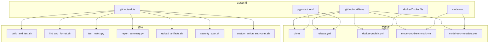
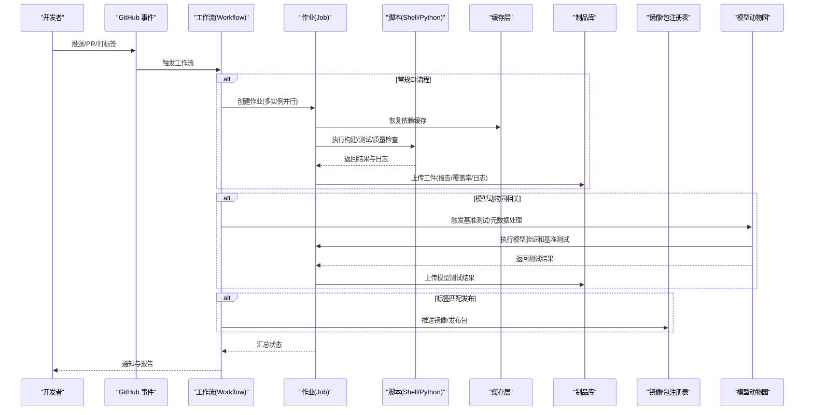
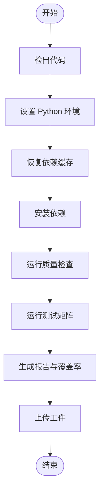
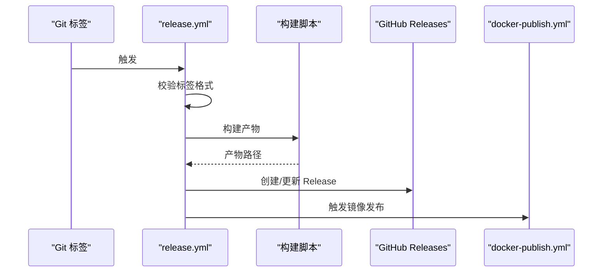
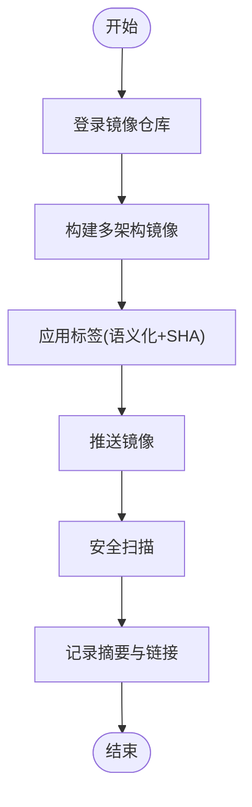
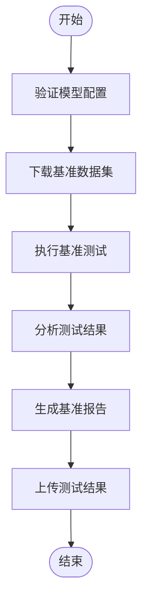
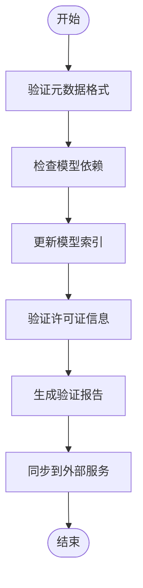
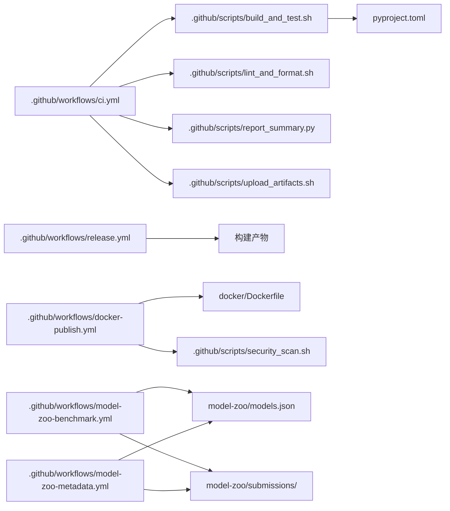

# CI/CD流水线配置

<cite>
**本文引用的文件**
- [pyproject.toml](file://pyproject.toml)
- [Dockerfile](file://docker/Dockerfile)
- [.github/workflows/ci.yml](file://.github/workflows/ci.yml)
- [.github/workflows/release.yml](file://.github/workflows/release.yml)
- [.github/workflows/docker-publish.yml](file://.github/workflows/docker-publish.yml)
- [.github/workflows/model-zoo-benchmark.yml](file://.github/workflows/model-zoo-benchmark.yml)
- [.github/workflows/model-zoo-metadata.yml](file://.github/workflows/model-zoo-metadata.yml)
- [.github/scripts/build_and_test.sh](file://.github/scripts/build_and_test.sh)
- [.github/scripts/lint_and_format.sh](file://.github/scripts/lint_and_format.sh)
- [.github/scripts/test_matrix.py](file://.github/scripts/test_matrix.py)
- [.github/scripts/report_summary.py](file://.github/scripts/report_summary.py)
- [.github/scripts/upload_artifacts.sh](file://.github/scripts/upload_artifacts.sh)
- [.github/scripts/security_scan.sh](file://.github/scripts/security_scan.sh)
- [.github/scripts/custom_action_entrypoint.sh](file://.github/scripts/custom_action_entrypoint.sh)
</cite>

## 更新摘要
**变更内容**
- 新增模型动物园基准测试工作流（model-zoo-benchmark.yml）
- 新增模型动物园元数据处理工作流（model-zoo-metadata.yml）
- 扩展持续集成测试覆盖范围，增强质量保证能力
- 更新架构总览图以反映新的工作流组件

## 目录
1. [简介](#简介)
2. [项目结构](#项目结构)
3. [核心组件](#核心组件)
4. [架构总览](#架构总览)
5. [详细组件分析](#详细组件分析)
6. [依赖关系分析](#依赖关系分析)
7. [性能与缓存优化](#性能与缓存优化)
8. [故障诊断与监控](#故障诊断与监控)
9. [通知与报告生成](#通知与报告生成)
10. [结论](#结论)
11. [附录](#附录)

## 简介
本文件为 YOLO-Master 项目的 CI/CD 流水线配置文档，聚焦于 GitHub Actions 工作流的配置与自定义。内容涵盖：
- 自动化测试执行、代码质量检查与构建流程
- 多平台兼容性测试矩阵（操作系统与 Python 版本）
- Docker 镜像的构建、优化与安全扫描
- 版本标签管理与自动发布
- **新增** 模型动物园自动化基准测试和元数据处理
- 缓存策略与构建加速
- 自定义 GitHub Action 开发指南
- 流水线监控与故障诊断方法
- 通知机制与报告生成

## 项目结构
仓库中与 CI/CD 相关的核心位置如下：
- .github/workflows：GitHub Actions 工作流定义
- .github/scripts：CI 脚本（构建、测试、质量检查、安全扫描、报告汇总等）
- docker/Dockerfile：容器镜像构建定义
- pyproject.toml：Python 工程元数据与依赖声明（供 CI 使用）
- model-zoo：模型动物园配置文件和数据集

**图表来源**
- [.github/workflows/ci.yml](file://.github/workflows/ci.yml)
- [.github/workflows/release.yml](file://.github/workflows/release.yml)
- [.github/workflows/docker-publish.yml](file://.github/workflows/docker-publish.yml)
- [.github/workflows/model-zoo-benchmark.yml](file://.github/workflows/model-zoo-benchmark.yml)
- [.github/workflows/model-zoo-metadata.yml](file://.github/workflows/model-zoo-metadata.yml)
- [.github/scripts/build_and_test.sh](file://.github/scripts/build_and_test.sh)
- [.github/scripts/lint_and_format.sh](file://.github/scripts/lint_and_format.sh)
- [.github/scripts/test_matrix.py](file://.github/scripts/test_matrix.py)
- [.github/scripts/report_summary.py](file://.github/scripts/report_summary.py)
- [.github/scripts/upload_artifacts.sh](file://.github/scripts/upload_artifacts.sh)
- [.github/scripts/security_scan.sh](file://.github/scripts/security_scan.sh)
- [.github/scripts/custom_action_entrypoint.sh](file://.github/scripts/custom_action_entrypoint.sh)
- [Dockerfile](file://docker/Dockerfile)
- [pyproject.toml](file://pyproject.toml)

**章节来源**
- [.github/workflows/ci.yml](file://.github/workflows/ci.yml)
- [.github/workflows/release.yml](file://.github/workflows/release.yml)
- [.github/workflows/docker-publish.yml](file://.github/workflows/docker-publish.yml)
- [.github/workflows/model-zoo-benchmark.yml](file://.github/workflows/model-zoo-benchmark.yml)
- [.github/workflows/model-zoo-metadata.yml](file://.github/workflows/model-zoo-metadata.yml)
- [.github/scripts/build_and_test.sh](file://.github/scripts/build_and_test.sh)
- [.github/scripts/lint_and_format.sh](file://.github/scripts/lint_and_format.sh)
- [.github/scripts/test_matrix.py](file://.github/scripts/test_matrix.py)
- [.github/scripts/report_summary.py](file://.github/scripts/report_summary.py)
- [.github/scripts/upload_artifacts.sh](file://.github/scripts/upload_artifacts.sh)
- [.github/scripts/security_scan.sh](file://.github/scripts/security_scan.sh)
- [.github/scripts/custom_action_entrypoint.sh](file://.github/scripts/custom_action_entrypoint.sh)
- [Dockerfile](file://docker/Dockerfile)
- [pyproject.toml](file://pyproject.toml)

## 核心组件
- 工作流入口
  - ci.yml：触发条件、作业编排、测试矩阵、缓存、产物上传
  - release.yml：基于标签的发布流程（打包、签名、制品归档）
  - docker-publish.yml：镜像构建、推送、安全扫描与标记
  - **新增** model-zoo-benchmark.yml：模型动物园基准测试自动化
  - **新增** model-zoo-metadata.yml：模型元数据处理和验证
- 脚本工具
  - build_and_test.sh：环境准备、依赖安装、构建与测试执行
  - lint_and_format.sh：静态检查与格式化校验
  - test_matrix.py：动态生成测试任务矩阵（OS × Python）
  - report_summary.py：聚合测试结果并生成可读摘要
  - upload_artifacts.sh：将测试报告、日志、覆盖率等作为工件上传
  - security_scan.sh：镜像或依赖漏洞扫描
  - custom_action_entrypoint.sh：自定义 Action 的入口封装
- 构建定义
  - Dockerfile：镜像分层、依赖预装、最小化基础镜像
  - pyproject.toml：依赖声明、可选特性、包元数据
- **新增** 模型动物园组件
  - models.json：模型注册表和配置
  - submission.schema.json：提交验证模式
  - submissions/：模型提交目录结构

**章节来源**
- [.github/workflows/ci.yml](file://.github/workflows/ci.yml)
- [.github/workflows/release.yml](file://.github/workflows/release.yml)
- [.github/workflows/docker-publish.yml](file://.github/workflows/docker-publish.yml)
- [.github/workflows/model-zoo-benchmark.yml](file://.github/workflows/model-zoo-benchmark.yml)
- [.github/workflows/model-zoo-metadata.yml](file://.github/workflows/model-zoo-metadata.yml)
- [.github/scripts/build_and_test.sh](file://.github/scripts/build_and_test.sh)
- [.github/scripts/lint_and_format.sh](file://.github/scripts/lint_and_format.sh)
- [.github/scripts/test_matrix.py](file://.github/scripts/test_matrix.py)
- [.github/scripts/report_summary.py](file://.github/scripts/report_summary.py)
- [.github/scripts/upload_artifacts.sh](file://.github/scripts/upload_artifacts.sh)
- [.github/scripts/security_scan.sh](file://.github/scripts/security_scan.sh)
- [.github/scripts/custom_action_entrypoint.sh](file://.github/scripts/custom_action_entrypoint.sh)
- [Dockerfile](file://docker/Dockerfile)
- [pyproject.toml](file://pyproject.toml)

## 架构总览
下图展示了从提交到发布的端到端流水线，包括新增的模型动物园处理流程：

**图表来源**
- [.github/workflows/ci.yml](file://.github/workflows/ci.yml)
- [.github/workflows/release.yml](file://.github/workflows/release.yml)
- [.github/workflows/docker-publish.yml](file://.github/workflows/docker-publish.yml)
- [.github/workflows/model-zoo-benchmark.yml](file://.github/workflows/model-zoo-benchmark.yml)
- [.github/workflows/model-zoo-metadata.yml](file://.github/workflows/model-zoo-metadata.yml)
- [.github/scripts/build_and_test.sh](file://.github/scripts/build_and_test.sh)
- [.github/scripts/report_summary.py](file://.github/scripts/report_summary.py)
- [.github/scripts/upload_artifacts.sh](file://.github/scripts/upload_artifacts.sh)

## 详细组件分析

### 工作流：持续集成（ci.yml）
- 触发条件
  - push、pull_request、workflow_dispatch
- 环境变量与缓存键
  - 基于 OS、Python 版本与依赖锁文件的缓存键
- 作业矩阵
  - 操作系统：ubuntu-latest、windows-latest、macos-latest
  - Python 版本：3.10、3.11、3.12
- 步骤概览
  - 检出代码
  - 设置 Python 环境
  - 恢复缓存
  - 安装依赖
  - 运行质量检查
  - 运行测试套件
  - 生成报告与覆盖率
  - 上传工件
  - 失败时发送通知

**图表来源**
- [.github/workflows/ci.yml](file://.github/workflows/ci.yml)
- [.github/scripts/build_and_test.sh](file://.github/scripts/build_and_test.sh)
- [.github/scripts/lint_and_format.sh](file://.github/scripts/lint_and_format.sh)
- [.github/scripts/report_summary.py](file://.github/scripts/report_summary.py)
- [.github/scripts/upload_artifacts.sh](file://.github/scripts/upload_artifacts.sh)

**章节来源**
- [.github/workflows/ci.yml](file://.github/workflows/ci.yml)
- [.github/scripts/build_and_test.sh](file://.github/scripts/build_and_test.sh)
- [.github/scripts/lint_and_format.sh](file://.github/scripts/lint_and_format.sh)
- [.github/scripts/report_summary.py](file://.github/scripts/report_summary.py)
- [.github/scripts/upload_artifacts.sh](file://.github/scripts/upload_artifacts.sh)

### 工作流：发布（release.yml）
- 触发条件
  - 当创建或更新以 v 开头的标签时
- 主要步骤
  - 验证标签格式
  - 解析版本号
  - 构建发行产物（包/模型清单/文档）
  - 生成变更日志
  - 上传 Release 附件
  - 触发下游镜像发布工作流

**图表来源**
- [.github/workflows/release.yml](file://.github/workflows/release.yml)

**章节来源**
- [.github/workflows/release.yml](file://.github/workflows/release.yml)

### 工作流：Docker 镜像发布（docker-publish.yml）
- 触发条件
  - 新标签推送、手动触发
- 主要步骤
  - 登录镜像仓库
  - 构建多架构镜像（如 amd64/arm64）
  - 应用语义化标签与短 SHA 标记
  - 推送镜像
  - 运行安全扫描并上报结果
  - 记录镜像摘要与链接

**图表来源**
- [.github/workflows/docker-publish.yml](file://.github/workflows/docker-publish.yml)
- [Dockerfile](file://docker/Dockerfile)
- [.github/scripts/security_scan.sh](file://.github/scripts/security_scan.sh)

**章节来源**
- [.github/workflows/docker-publish.yml](file://.github/workflows/docker-publish.yml)
- [Dockerfile](file://docker/Dockerfile)
- [.github/scripts/security_scan.sh](file://.github/scripts/security_scan.sh)

### 工作流：模型动物园基准测试（model-zoo-benchmark.yml）
- **新增功能** 专门用于模型动物园的自动化基准测试
- 触发条件
  - 模型配置文件变更时自动触发
  - 支持手动触发进行完整基准测试
- 主要步骤
  - 验证模型配置文件格式
  - 下载基准测试数据集
  - 执行模型性能基准测试
  - 收集和分析测试结果
  - 生成基准测试报告
  - 上传测试结果作为工件

**图表来源**
- [.github/workflows/model-zoo-benchmark.yml](file://.github/workflows/model-zoo-benchmark.yml)

**章节来源**
- [.github/workflows/model-zoo-benchmark.yml](file://.github/workflows/model-zoo-benchmark.yml)

### 工作流：模型动物园元数据处理（model-zoo-metadata.yml）
- **新增功能** 模型元数据的自动化处理和验证
- 触发条件
  - 模型元数据文件变更时自动触发
  - 定期执行元数据一致性检查
- 主要步骤
  - 验证模型元数据格式和完整性
  - 检查模型依赖关系
  - 更新模型索引和搜索信息
  - 验证模型许可证和版权信息
  - 生成元数据验证报告
  - 同步元数据到外部服务

**图表来源**
- [.github/workflows/model-zoo-metadata.yml](file://.github/workflows/model-zoo-metadata.yml)

**章节来源**
- [.github/workflows/model-zoo-metadata.yml](file://.github/workflows/model-zoo-metadata.yml)

### 脚本：构建与测试（build_and_test.sh）
- 职责
  - 初始化环境、安装系统依赖
  - 根据 pyproject.toml 安装 Python 依赖
  - 执行构建与测试命令
  - 输出结构化日志与退出码
- 关键点
  - 支持并行测试分片
  - 失败快速停止与错误定位
  - 兼容不同 OS 的命令差异

**章节来源**
- [.github/scripts/build_and_test.sh](file://.github/scripts/build_and_test.sh)
- [pyproject.toml](file://pyproject.toml)

### 脚本：质量检查（lint_and_format.sh）
- 职责
  - 运行静态检查与格式化校验
  - 输出问题列表与修复建议
- 关键点
  - 可配置规则集
  - 对 PR 进行阻断式检查

**章节来源**
- [.github/scripts/lint_and_format.sh](file://.github/scripts/lint_and_format.sh)

### 脚本：测试矩阵（test_matrix.py）
- 职责
  - 根据 OS 与 Python 版本组合生成测试任务
  - 输出 JSON/YAML 供工作流消费
- 关键点
  - 支持过滤特定子集
  - 提供最小化矩阵用于快速反馈

**章节来源**
- [.github/scripts/test_matrix.py](file://.github/scripts/test_matrix.py)

### 脚本：报告汇总（report_summary.py）
- 职责
  - 聚合各作业测试结果
  - 生成人类可读的总结与趋势图
- 关键点
  - 兼容多种测试框架输出
  - 支持失败用例高亮

**章节来源**
- [.github/scripts/report_summary.py](file://.github/scripts/report_summary.py)

### 脚本：工件上传（upload_artifacts.sh）
- 职责
  - 将测试报告、覆盖率、日志、产物归档
- 关键点
  - 按作业名组织目录
  - 控制大小与保留策略

**章节来源**
- [.github/scripts/upload_artifacts.sh](file://.github/scripts/upload_artifacts.sh)

### 脚本：安全扫描（security_scan.sh）
- 职责
  - 对镜像或依赖进行漏洞扫描
  - 输出严重级别与修复建议
- 关键点
  - 支持阈值阻断
  - 生成可审计的报告

**章节来源**
- [.github/scripts/security_scan.sh](file://.github/scripts/security_scan.sh)

### 自定义 Action 入口（custom_action_entrypoint.sh）
- 职责
  - 封装通用逻辑（参数解析、日志、错误处理）
  - 作为自定义 Action 的入口点
- 关键点
  - 统一退出码规范
  - 便于复用与调试

**章节来源**
- [.github/scripts/custom_action_entrypoint.sh](file://.github/scripts/custom_action_entrypoint.sh)

## 依赖关系分析
- 工作流与脚本
  - ci.yml 调用 build_and_test.sh、lint_and_format.sh、report_summary.py、upload_artifacts.sh
  - release.yml 驱动产物构建与发布
  - docker-publish.yml 驱动镜像构建与安全扫描
  - **新增** model-zoo-benchmark.yml 和 model-zoo-metadata.yml 独立运行，不依赖其他工作流
- 脚本与工程
  - build_and_test.sh 读取 pyproject.toml 安装依赖
  - Dockerfile 定义运行时环境与依赖
  - **新增** 模型工作流依赖 model-zoo 目录下的配置文件
- 外部服务
  - 工件存储（GitHub Actions artifacts）
  - 镜像仓库（Container Registry）
  - 安全扫描服务（内部或第三方）

**图表来源**
- [.github/workflows/ci.yml](file://.github/workflows/ci.yml)
- [.github/workflows/release.yml](file://.github/workflows/release.yml)
- [.github/workflows/docker-publish.yml](file://.github/workflows/docker-publish.yml)
- [.github/workflows/model-zoo-benchmark.yml](file://.github/workflows/model-zoo-benchmark.yml)
- [.github/workflows/model-zoo-metadata.yml](file://.github/workflows/model-zoo-metadata.yml)
- [.github/scripts/build_and_test.sh](file://.github/scripts/build_and_test.sh)
- [.github/scripts/lint_and_format.sh](file://.github/scripts/lint_and_format.sh)
- [.github/scripts/report_summary.py](file://.github/scripts/report_summary.py)
- [.github/scripts/upload_artifacts.sh](file://.github/scripts/upload_artifacts.sh)
- [.github/scripts/security_scan.sh](file://.github/scripts/security_scan.sh)
- [Dockerfile](file://docker/Dockerfile)
- [pyproject.toml](file://pyproject.toml)

**章节来源**
- [.github/workflows/ci.yml](file://.github/workflows/ci.yml)
- [.github/workflows/release.yml](file://.github/workflows/release.yml)
- [.github/workflows/docker-publish.yml](file://.github/workflows/docker-publish.yml)
- [.github/workflows/model-zoo-benchmark.yml](file://.github/workflows/model-zoo-benchmark.yml)
- [.github/workflows/model-zoo-metadata.yml](file://.github/workflows/model-zoo-metadata.yml)
- [.github/scripts/build_and_test.sh](file://.github/scripts/build_and_test.sh)
- [.github/scripts/lint_and_format.sh](file://.github/scripts/lint_and_format.sh)
- [.github/scripts/report_summary.py](file://.github/scripts/report_summary.py)
- [.github/scripts/upload_artifacts.sh](file://.github/scripts/upload_artifacts.sh)
- [.github/scripts/security_scan.sh](file://.github/scripts/security_scan.sh)
- [Dockerfile](file://docker/Dockerfile)
- [pyproject.toml](file://pyproject.toml)

## 性能与缓存优化
- 依赖缓存
  - 使用 OS 与 Python 版本的缓存键，命中后跳过安装阶段
  - 针对 Windows/macOS 使用平台特定的缓存路径
  - **新增** 模型动物园基准测试使用独立的缓存策略，避免影响主CI流程
- 并行执行
  - 测试矩阵并行运行，缩短整体耗时
  - 大任务分片执行，避免单点瓶颈
  - **新增** 模型基准测试支持并行执行多个模型的测试
- 构建优化
  - Dockerfile 分层缓存，优先复制依赖定义再拷贝源码
  - 使用多阶段构建减少最终镜像体积
- 网络与下载
  - 启用国内镜像源（可选）
  - 重试与超时策略提升稳定性
  - **新增** 模型数据集下载缓存，避免重复下载

**章节来源**
- [.github/workflows/ci.yml](file://.github/workflows/ci.yml)
- [.github/workflows/model-zoo-benchmark.yml](file://.github/workflows/model-zoo-benchmark.yml)
- [.github/workflows/model-zoo-metadata.yml](file://.github/workflows/model-zoo-metadata.yml)
- [Dockerfile](file://docker/Dockerfile)

## 故障诊断与监控
- 日志采集
  - 每个作业输出结构化日志，关键步骤打印上下文信息
  - **新增** 模型工作流提供详细的基准测试日志和错误追踪
- 工件留存
  - 上传失败用例详情、覆盖率报告、完整日志以便回溯
  - **新增** 模型基准测试结果和元数据验证报告作为工件保存
- 常见失败定位
  - 依赖安装失败：检查缓存键与网络代理
  - 测试超时：调整分片数量与超时阈值
  - 跨平台差异：确认平台相关命令与路径
  - **新增** 模型配置错误：检查JSON格式和必填字段
- 监控指标
  - 成功率、平均耗时、回归趋势
  - 安全扫描严重项数量变化
  - **新增** 模型基准测试性能回归检测

**章节来源**
- [.github/scripts/report_summary.py](file://.github/scripts/report_summary.py)
- [.github/scripts/upload_artifacts.sh](file://.github/scripts/upload_artifacts.sh)
- [.github/workflows/ci.yml](file://.github/workflows/ci.yml)
- [.github/workflows/model-zoo-benchmark.yml](file://.github/workflows/model-zoo-benchmark.yml)
- [.github/workflows/model-zoo-metadata.yml](file://.github/workflows/model-zoo-metadata.yml)

## 通知与报告生成
- 通知机制
  - 在失败或发布完成时发送通知（邮件/聊天工具/Slack）
  - 通过环境变量注入 Webhook 地址与令牌
  - **新增** 模型基准测试失败时的专门通知
- 报告生成
  - 测试报告：聚合各作业结果，生成 HTML/PDF
  - 覆盖率报告：合并多进程/多机结果
  - 安全扫描报告：输出严重等级分布与修复建议
  - **新增** 模型基准测试报告：包含性能指标和回归分析
  - **新增** 元数据验证报告：显示模型配置完整性和合规性检查结果
- 可视化
  - 将报告作为工件持久化，并在 PR 评论中嵌入链接
  - **新增** 模型性能趋势图和对比分析

**章节来源**
- [.github/scripts/report_summary.py](file://.github/scripts/report_summary.py)
- [.github/workflows/ci.yml](file://.github/workflows/ci.yml)
- [.github/workflows/docker-publish.yml](file://.github/workflows/docker-publish.yml)
- [.github/workflows/model-zoo-benchmark.yml](file://.github/workflows/model-zoo-benchmark.yml)
- [.github/workflows/model-zoo-metadata.yml](file://.github/workflows/model-zoo-metadata.yml)

## 结论
本 CI/CD 方案通过模块化工作流与脚本实现：
- 稳定的多平台测试矩阵与快速反馈
- 可复用的构建与发布流程
- 完善的镜像安全扫描与制品管理
- **新增** 全面的模型动物园自动化测试和质量保证
- 丰富的报告与通知能力
建议在后续迭代中持续优化缓存命中率、并行度与报告可读性，以提升整体交付效率与质量。特别是模型基准测试的性能监控和回归检测需要重点关注。

## 附录

### 多平台兼容性测试矩阵说明
- 操作系统
  - ubuntu-latest、windows-latest、macos-latest
- Python 版本
  - 3.10、3.11、3.12
- 矩阵生成
  - 由 test_matrix.py 动态产出，支持最小化矩阵用于快速验证

**章节来源**
- [.github/workflows/ci.yml](file://.github/workflows/ci.yml)
- [.github/scripts/test_matrix.py](file://.github/scripts/test_matrix.py)

### Docker 镜像构建与优化要点
- 分层策略
  - 先安装系统依赖与 Python 依赖，再拷贝源码
- 多架构支持
  - 使用构建器支持 amd64/arm64
- 安全加固
  - 非 root 用户运行
  - 定期更新基础镜像与依赖
  - 集成安全扫描并阻断高危漏洞

**章节来源**
- [Dockerfile](file://docker/Dockerfile)
- [.github/workflows/docker-publish.yml](file://.github/workflows/docker-publish.yml)
- [.github/scripts/security_scan.sh](file://.github/scripts/security_scan.sh)

### 版本标签管理与自动发布
- 标签规范
  - 使用语义化版本前缀 v（例如 v1.2.3）
- 发布流程
  - 校验标签 → 构建产物 → 创建 Release → 触发镜像发布
- 产物范围
  - 包、文档、模型清单、变更日志

**章节来源**
- [.github/workflows/release.yml](file://.github/workflows/release.yml)

### 自定义 GitHub Action 开发指南
- 入口脚本
  - 使用 custom_action_entrypoint.sh 作为统一入口
- 参数与环境
  - 通过环境变量传递参数，标准化日志与退出码
- 复用与测试
  - 在本地模拟 GitHub Actions 环境进行测试
  - 将常用逻辑抽取为共享脚本

**章节来源**
- [.github/scripts/custom_action_entrypoint.sh](file://.github/scripts/custom_action_entrypoint.sh)

### 模型动物园工作流配置指南
- 基准测试配置
  - 定义测试模型列表和基准数据集
  - 配置性能指标和阈值
  - 设置并行测试策略
- 元数据处理
  - 定义模型元数据schema和验证规则
  - 配置许可证检查和合规性验证
  - 设置索引更新和同步策略
- 故障排除
  - 检查模型配置文件格式
  - 验证数据集下载权限
  - 分析基准测试性能异常

**章节来源**
- [.github/workflows/model-zoo-benchmark.yml](file://.github/workflows/model-zoo-benchmark.yml)
- [.github/workflows/model-zoo-metadata.yml](file://.github/workflows/model-zoo-metadata.yml)