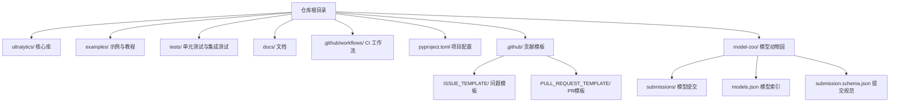
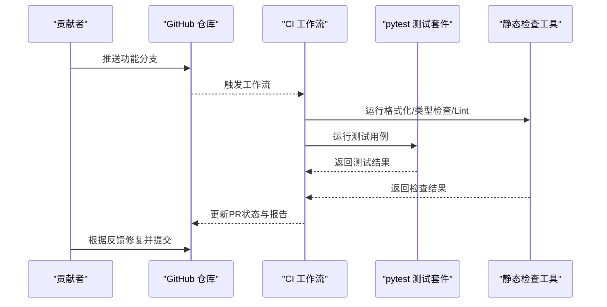
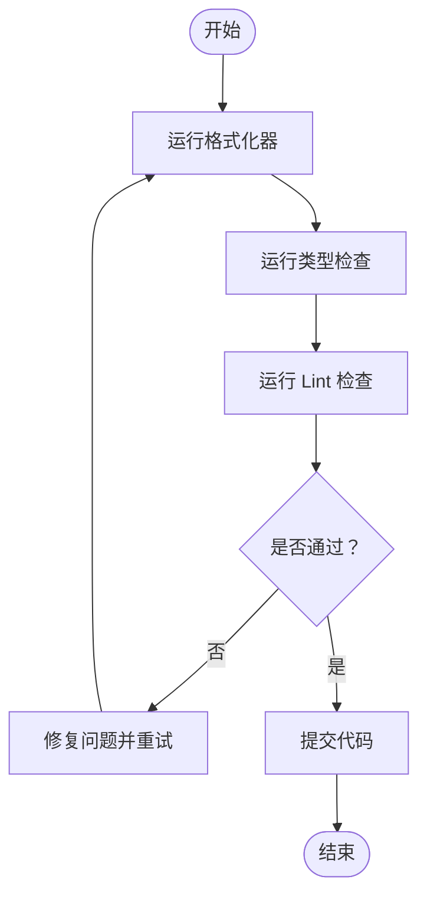
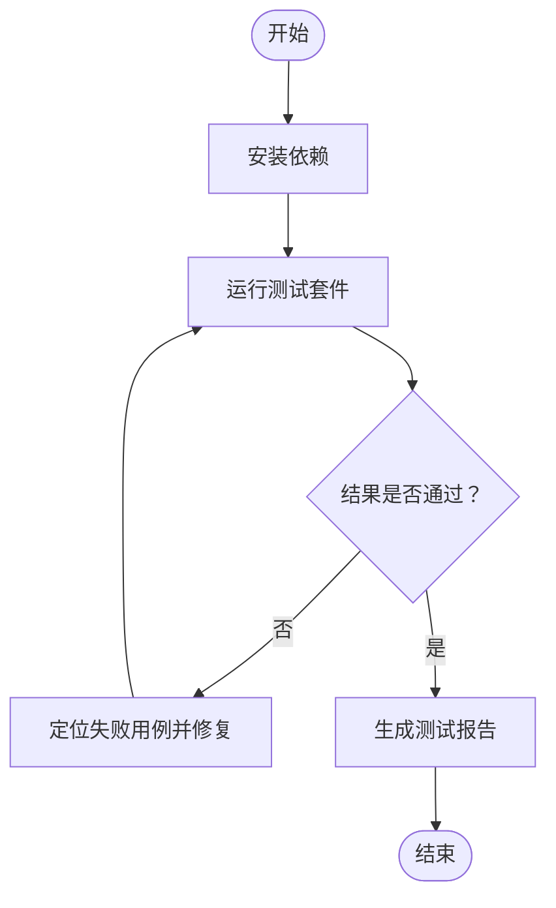
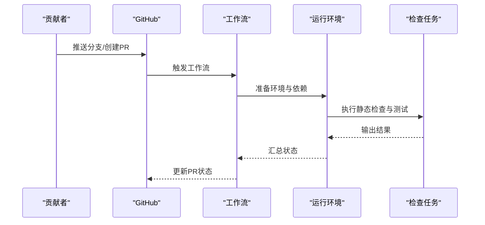
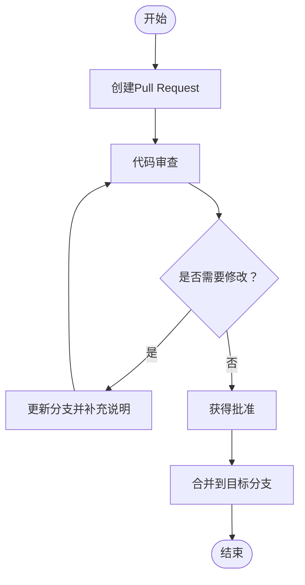
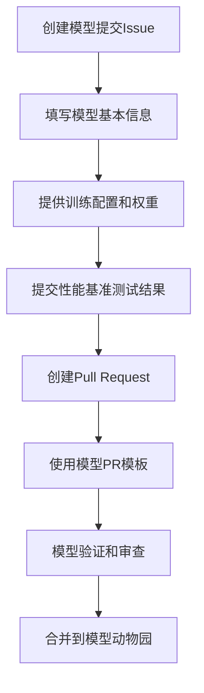
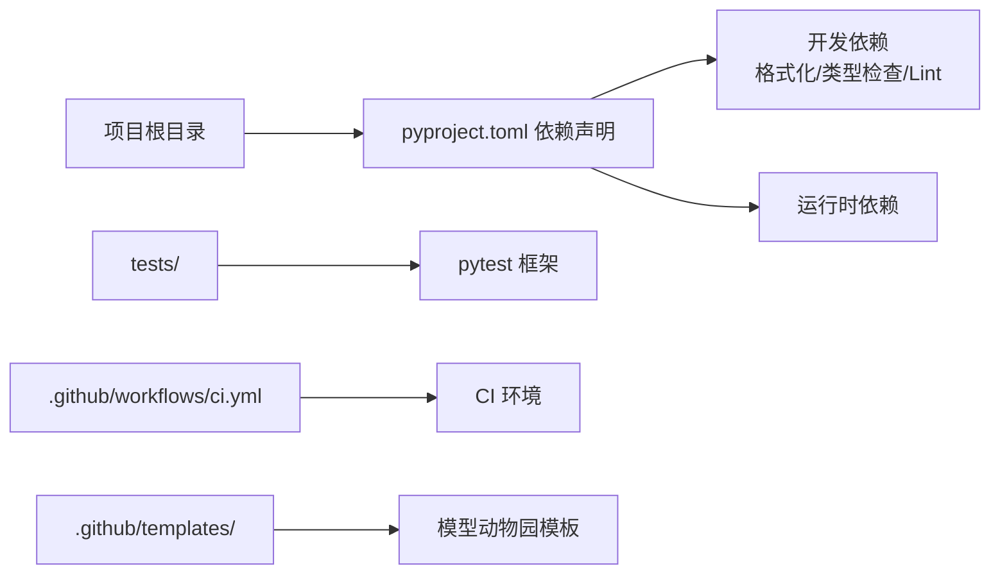

# 代码贡献指南

<cite>
**本文引用的文件**
- [CONTRIBUTING.md](file://CONTRIBUTING.md)
- [.github/workflows/ci.yml](file://.github/workflows/ci.yml)
- [pyproject.toml](file://pyproject.toml)
- [tests/conftest.py](file://tests/conftest.py)
- [docs/en/help/contributing.md](file://docs/en/help/contributing.md)
- [docs/en/help/code-of-conduct.md](file://docs/en/help/code-of-conduct.md)
- [.github/ISSUE_TEMPLATE/model-zoo-submission.md](file://.github/ISSUE_TEMPLATE/model-zoo-submission.md)
- [.github/PULL_REQUEST_TEMPLATE/model-zoo-pr-template.md](file://.github/PULL_REQUEST_TEMPLATE/model-zoo-pr-template.md)
- [model-zoo/submissions/example.yaml](file://model-zoo/submissions/example.yaml)
- [model-zoo/models.json](file://model-zoo/models.json)
- [model-zoo/submission.schema.json](file://model-zoo/submission.schema.json)
</cite>

## 更新摘要
**变更内容**
- 新增模型动物园贡献模板和工作流章节
- 添加标准化的模型提交流程说明
- 扩展Pull Request模板使用指南
- 完善模型提交格式要求和验证流程

## 目录
1. [简介](#简介)
2. [项目结构](#项目结构)
3. [核心组件](#核心组件)
4. [架构总览](#架构总览)
5. [详细组件分析](#详细组件分析)
6. [依赖分析](#依赖分析)
7. [性能考虑](#性能考虑)
8. [故障排查指南](#故障排查指南)
9. [结论](#结论)
10. [附录](#附录)

## 简介
本指南面向希望为 YOLO-Master 项目贡献代码的开发者，提供从环境搭建、分支与提交规范、静态检查与测试，到 Pull Request 流程与代码审查清单的完整说明。目标是让贡献者以一致的方式协作，确保代码质量与可维护性。

## 项目结构
仓库采用模块化组织方式：
- 核心库位于 ultralytics/ 下，包含模型、引擎、数据、工具等模块
- 示例与教程在 examples/
- 自动化测试在 tests/
- 文档在 docs/
- 持续集成配置在 .github/workflows/
- 项目级配置（含开发工具）在 pyproject.toml
- 模型动物园模板和配置文件在 .github/ 和 model-zoo/ 目录下

## 核心组件
- 贡献入口与规范
  - 贡献流程、行为准则与帮助文档位于 docs/en/help/ 与 CONTRIBUTING.md
- 持续集成
  - GitHub Actions 工作流定义在 .github/workflows/ 中，用于触发构建与测试
- 开发与质量工具
  - 格式化、类型检查、Lint 等工具的配置集中在 pyproject.toml
- 测试框架
  - pytest 配置与夹具在 tests/conftest.py
- 模型动物园贡献模板
  - 标准化的模型提交流程通过 ISSUE_TEMPLATE 和 PULL_REQUEST_TEMPLATE 提供
  - 模型提交格式规范由 submission.schema.json 定义

**章节来源**
- [CONTRIBUTING.md](file://CONTRIBUTING.md)
- [docs/en/help/contributing.md](file://docs/en/help/contributing.md)
- [docs/en/help/code-of-conduct.md](file://docs/en/help/code-of-conduct.md)
- [.github/workflows/ci.yml](file://.github/workflows/ci.yml)
- [pyproject.toml](file://pyproject.toml)
- [tests/conftest.py](file://tests/conftest.py)
- [.github/ISSUE_TEMPLATE/model-zoo-submission.md](file://.github/ISSUE_TEMPLATE/model-zoo-submission.md)
- [.github/PULL_REQUEST_TEMPLATE/model-zoo-pr-template.md](file://.github/PULL_REQUEST_TEMPLATE/model-zoo-pr-template.md)
- [model-zoo/submission.schema.json](file://model-zoo/submission.schema.json)

## 架构总览
下图展示了贡献者在本地完成改动后，通过 Git 推送并发起 PR，由 CI 自动执行静态检查与测试的整体流程。

**图表来源**
- [.github/workflows/ci.yml](file://.github/workflows/ci.yml)
- [pyproject.toml](file://pyproject.toml)
- [tests/conftest.py](file://tests/conftest.py)

## 详细组件分析

### 分支管理与提交规范
- 分支策略
  - 主分支保护：避免直接向受保护分支直接推送
  - 功能分支命名：建议以"特性/问题"语义化命名，便于追踪
  - 发布分支：按版本或里程碑创建，合并前需通过全部检查
- 提交信息格式
  - 使用清晰的主题行，必要时附带详细描述
  - 将变更与相关任务或问题关联
- 常见场景
  - 新功能：基于最新主分支创建功能分支
  - Bug 修复：从受影响分支拉取修复分支
  - 文档改进：独立分支，聚焦文档变更

**章节来源**
- [CONTRIBUTING.md](file://CONTRIBUTING.md)
- [docs/en/help/contributing.md](file://docs/en/help/contributing.md)

### 代码风格与静态检查
- 统一格式化
  - 使用项目配置的 Python 格式化器，保证风格一致
- 类型检查
  - 启用类型检查以提升健壮性与可读性
- Linting
  - 遵循统一的规则集，提前发现潜在问题
- 本地预检
  - 建议在提交前本地运行格式化、类型检查与 Lint，减少 CI 失败

**图表来源**
- [pyproject.toml](file://pyproject.toml)

**章节来源**
- [pyproject.toml](file://pyproject.toml)

### 测试与验证
- 测试框架
  - 使用 pytest 组织与运行测试
- 基础测试
  - 快速验证核心路径与关键用例
- 扩展测试
  - 针对新增功能编写单测与集成测试，覆盖边界条件与错误路径
- 测试配置
  - 夹具与全局设置在 tests/conftest.py 中管理

**图表来源**
- [tests/conftest.py](file://tests/conftest.py)

**章节来源**
- [tests/conftest.py](file://tests/conftest.py)

### 持续集成与工作流
- 触发条件
  - 推送至功能分支或发起 PR 时自动触发
- 执行步骤
  - 安装依赖
  - 运行静态检查
  - 运行测试套件
  - 上传必要产物与报告
- 失败处理
  - 根据日志定位问题，修复后重新推送触发再次检查

**图表来源**
- [.github/workflows/ci.yml](file://.github/workflows/ci.yml)

**章节来源**
- [.github/workflows/ci.yml](file://.github/workflows/ci.yml)

### Pull Request 流程与代码审查
- 发起 PR
  - 选择目标分支，填写变更说明与影响范围
  - 附上相关截图或日志（如适用）
- 审查要点
  - 正确性：逻辑与边界条件
  - 可维护性：结构与注释
  - 兼容性：接口与行为不变性
  - 性能：无显著退化
  - 测试：覆盖新增与修改路径
- 合并策略
  - 通过所有检查后进行合并
  - 保持历史整洁，必要时进行变基整理

**章节来源**
- [CONTRIBUTING.md](file://CONTRIBUTING.md)
- [docs/en/help/contributing.md](file://docs/en/help/contributing.md)

### 模型动物园贡献流程

**新增** 项目现已提供标准化的模型动物园贡献模板和工作流，简化社区成员的模型提交流程。

#### 模型提交模板
项目提供了专门的 Issue 模板用于模型提交申请：
- 模板位置：`.github/ISSUE_TEMPLATE/model-zoo-submission.md`
- 用途：标准化模型基本信息、训练配置、性能指标等元数据收集
- 要求：完整填写所有必填字段，确保模型信息准确性

#### 模型提交流程

#### 模型提交格式规范
- 配置文件：遵循 `submission.schema.json` 定义的JSON Schema
- 权重文件：支持标准YOLO格式模型权重
- 文档要求：包含完整的训练数据集、超参数和评估结果
- 验证流程：自动化的格式检查和完整性验证

#### Pull Request 模板
针对模型提交的专用PR模板：
- 模板位置：`.github/PULL_REQUEST_TEMPLATE/model-zoo-pr-template.md`
- 内容要求：详细说明模型特性、训练环境、性能对比
- 审查清单：确保模型质量和文档完整性

**章节来源**
- [.github/ISSUE_TEMPLATE/model-zoo-submission.md](file://.github/ISSUE_TEMPLATE/model-zoo-submission.md)
- [.github/PULL_REQUEST_TEMPLATE/model-zoo-pr-template.md](file://.github/PULL_REQUEST_TEMPLATE/model-zoo-pr-template.md)
- [model-zoo/submission.schema.json](file://model-zoo/submission.schema.json)
- [model-zoo/submissions/example.yaml](file://model-zoo/submissions/example.yaml)
- [model-zoo/models.json](file://model-zoo/models.json)

### 社区行为准则与沟通渠道
- 行为准则
  - 尊重、包容与建设性沟通
  - 遵守社区规范，营造友好协作氛围
- 沟通渠道
  - 使用 Issue 与 PR 讨论技术细节
  - 在文档与评论中保持清晰与准确
- 模型贡献沟通
  - 通过专用的模型提交模板进行沟通
  - 遵循标准化的模型描述格式

**章节来源**
- [docs/en/help/code-of-conduct.md](file://docs/en/help/code-of-conduct.md)

## 依赖分析
- 开发依赖
  - 格式化、类型检查、Lint 与测试工具在项目配置中声明
- 运行时依赖
  - 核心库与示例所需的第三方包
- 版本锁定
  - 建议使用虚拟环境或容器，确保一致性

**图表来源**
- [pyproject.toml](file://pyproject.toml)
- [.github/workflows/ci.yml](file://.github/workflows/ci.yml)

**章节来源**
- [pyproject.toml](file://pyproject.toml)

## 性能考虑
- 在引入新算法或优化时，提供基准对比与回归测试
- 避免不必要的对象创建与拷贝，关注内存与计算热点
- 对大规模数据处理路径增加增量验证与采样测试
- 模型提交时需提供性能基准测试结果，确保质量可控

## 故障排查指南
- 本地失败
  - 逐步运行格式化、类型检查与 Lint，定位问题
  - 缩小测试范围，复现最小用例
- CI 失败
  - 查看工作流日志，确认失败阶段
  - 在本地复现相同环境并调试
- 模型提交问题
  - 检查提交格式是否符合 schema 规范
  - 验证模型权重文件的完整性和可加载性
  - 确认性能测试结果的有效性和可比性
- 常见问题
  - 依赖冲突：清理缓存并使用隔离环境
  - 平台差异：在目标平台或容器中验证

**章节来源**
- [.github/workflows/ci.yml](file://.github/workflows/ci.yml)
- [pyproject.toml](file://pyproject.toml)

## 结论
遵循本指南的分支与提交规范、代码风格与静态检查要求、测试与 CI 流程，以及代码审查清单，有助于提升协作效率与代码质量。新增的模型动物园贡献模板进一步简化了社区贡献流程，使模型分享更加标准化和规范化。遇到问题时，优先在本地复现并逐步定位，再结合 CI 日志进行修复。

## 附录
- 常用命令
  - 安装依赖：参考项目配置中的依赖声明
  - 运行格式化与检查：使用项目配置的工具链
  - 运行测试：使用测试框架执行套件
- 参考文档
  - 贡献指南与行为准则详见 docs/en/help/ 与 CONTRIBUTING.md
- 模型贡献资源
  - 模型提交模板：`.github/ISSUE_TEMPLATE/model-zoo-submission.md`
  - 模型PR模板：`.github/PULL_REQUEST_TEMPLATE/model-zoo-pr-template.md`
  - 提交格式规范：`model-zoo/submission.schema.json`
  - 示例提交：`model-zoo/submissions/example.yaml`

**章节来源**
- [CONTRIBUTING.md](file://CONTRIBUTING.md)
- [docs/en/help/contributing.md](file://docs/en/help/contributing.md)
- [docs/en/help/code-of-conduct.md](file://docs/en/help/code-of-conduct.md)
- [pyproject.toml](file://pyproject.toml)
- [.github/ISSUE_TEMPLATE/model-zoo-submission.md](file://.github/ISSUE_TEMPLATE/model-zoo-submission.md)
- [.github/PULL_REQUEST_TEMPLATE/model-zoo-pr-template.md](file://.github/PULL_REQUEST_TEMPLATE/model-zoo-pr-template.md)
- [model-zoo/submission.schema.json](file://model-zoo/submission.schema.json)
- [model-zoo/submissions/example.yaml](file://model-zoo/submissions/example.yaml)