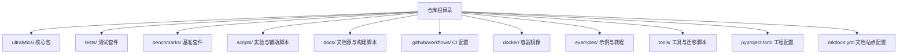
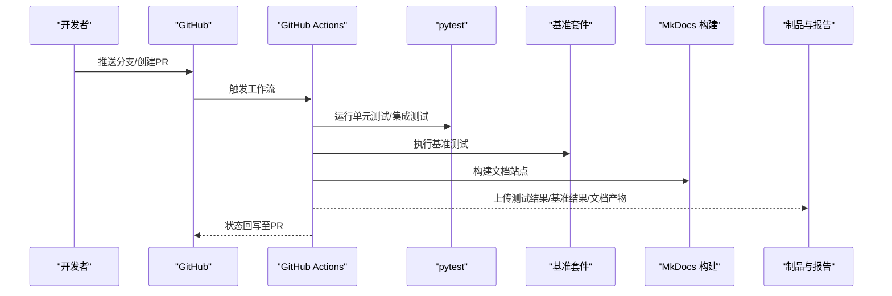
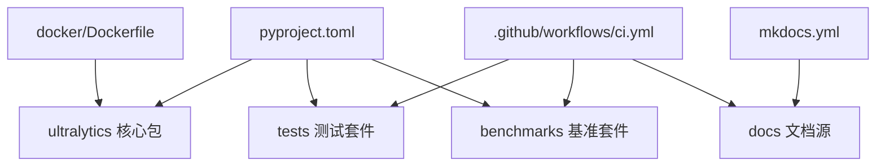

# 开发者指南

<cite>
**本文引用的文件**
- [CONTRIBUTING.md](file://CONTRIBUTING.md)
- [README.md](file://README.md)
- [pyproject.toml](file://pyproject.toml)
- [mkdocs.yml](file://mkdocs.yml)
- [docs/build_docs.py](file://docs/build_docs.py)
- [tests/conftest.py](file://tests/conftest.py)
- [benchmarks/run.py](file://benchmarks/run.py)
- [.github/workflows/ci.yml](file://.github/workflows/ci.yml)
- [docker/Dockerfile](file://docker/Dockerfile)
</cite>

## 目录
1. [简介](#简介)
2. [项目结构](#项目结构)
3. [核心组件](#核心组件)
4. [架构总览](#架构总览)
5. [详细组件分析](#详细组件分析)
6. [依赖分析](#依赖分析)
7. [性能考虑](#性能考虑)
8. [故障排查指南](#故障排查指南)
9. [结论](#结论)
10. [附录](#附录)

## 简介
本指南面向希望为 YOLO-Master 贡献代码、维护测试与文档、参与 CI/CD 流水线以及进行新特性开发的开发者。内容涵盖：
- Git 工作流、代码审查与提交流程
- 目录结构与代码组织原则
- 测试体系（单元、集成、端到端）的构建方法
- CI/CD 流水线配置与自动化执行
- 文档系统的维护与更新流程
- 新特性开发全流程（需求、设计、实现、测试）
- 性能基准与回归测试方法
- 版本发布与变更管理
- 代码风格规范与静态检查工具配置
- 调试与故障诊断高级技巧
- 社区参与与沟通渠道

## 项目结构
仓库采用按功能域与层次混合的组织方式，核心 Python 包位于 ultralytics/，测试集中于 tests/，基准与脚本在 benchmarks/ 与 scripts/，文档使用 MkDocs 在 docs/ 下维护，CI 配置在 .github/workflows/，容器镜像定义在 docker/。

章节来源
- [README.md](file://README.md)
- [pyproject.toml](file://pyproject.toml)
- [mkdocs.yml](file://mkdocs.yml)

## 核心组件
- 工程与依赖管理：通过 pyproject.toml 声明依赖、可执行入口与打包元数据，统一安装与运行环境。
- 文档系统：基于 MkDocs，配置文件 mkdocs.yml 与构建脚本 docs/build_docs.py 共同驱动文档生成。
- 测试框架：pytest 作为测试运行器，tests/conftest.py 提供全局夹具与共享配置。
- 基准测试：benchmarks/run.py 提供基准套件入口，用于性能评估与回归对比。
- CI/CD：.github/workflows/ci.yml 定义持续集成任务，包括测试、基准与文档构建等步骤。
- 容器化：docker/Dockerfile 提供一致的运行环境与复现基础。

章节来源
- [pyproject.toml](file://pyproject.toml)
- [mkdocs.yml](file://mkdocs.yml)
- [docs/build_docs.py](file://docs/build_docs.py)
- [tests/conftest.py](file://tests/conftest.py)
- [benchmarks/run.py](file://benchmarks/run.py)
- [.github/workflows/ci.yml](file://.github/workflows/ci.yml)
- [docker/Dockerfile](file://docker/Dockerfile)

## 架构总览
下图展示了从本地开发到持续集成的关键路径：开发者提交 PR → GitHub Actions 触发 CI → 拉取依赖并运行测试与基准 → 构建文档 → 产出报告与制品。

图表来源
- [.github/workflows/ci.yml](file://.github/workflows/ci.yml)
- [tests/conftest.py](file://tests/conftest.py)
- [benchmarks/run.py](file://benchmarks/run.py)
- [mkdocs.yml](file://mkdocs.yml)
- [docs/build_docs.py](file://docs/build_docs.py)

## 详细组件分析

### 代码贡献流程与规范
- 分支策略
  - 主分支保护：禁止直接推送至受保护分支，所有变更通过 Pull Request 合并。
  - 功能分支命名：建议以 feat/fix/chore/docs 前缀区分变更类型，便于追踪与发布说明生成。
- 提交流程
  - 小步提交：每次提交聚焦单一职责，提交信息清晰描述动机与影响范围。
  - 关联问题：在提交信息与 PR 描述中引用相关 Issue 编号，确保可追溯性。
- 代码审查
  - 至少一名维护者审阅通过后合并。
  - 关注点：API 契约稳定性、向后兼容性、性能影响、测试覆盖与文档同步。
- 提交后验证
  - 自动触发 CI，包含测试、基准与文档构建；全部通过后进入合并队列。

章节来源
- [CONTRIBUTING.md](file://CONTRIBUTING.md)

### 目录结构与代码组织原则
- 分层与模块化
  - 核心能力集中在 ultralytics/ 下，按模块划分（如 engine、models、nn、utils）。
  - 测试用例与业务逻辑一一对应，便于定位与回归。
- 配置与资源
  - 模型与数据集配置集中管理，避免硬编码。
  - 文档素材与宏定义置于 docs/ 下，保持与源码同步。
- 可观测性与工具
  - 日志、事件与导出能力矩阵等工具独立成模块，降低耦合度。

章节来源
- [pyproject.toml](file://pyproject.toml)
- [mkdocs.yml](file://mkdocs.yml)

### 测试体系构建
- 测试分类
  - 单元测试：针对函数与类的最小粒度行为验证。
  - 集成测试：跨模块协作场景验证，如训练/验证/导出链路。
  - 端到端测试：模拟真实用户工作流，覆盖 CLI 与典型用例。
- 运行与组织
  - 使用 pytest 作为统一运行器，conftest.py 提供全局夹具与共享配置。
  - 测试数据与缓存由专用脚本管理，保证可重复性。
- 编写建议
  - 每个新增或修改的功能需配套相应测试。
  - 对数值敏感逻辑增加稳定性与边界条件断言。
  - 对异步或多进程路径补充控制流与错误传播测试。

章节来源
- [tests/conftest.py](file://tests/conftest.py)

### CI/CD 流水线配置与自动化执行
- 触发条件
  - 推送至分支或创建/更新 PR 时自动触发。
- 主要阶段
  - 环境准备：安装依赖、缓存常用包与数据集。
  - 测试执行：并行运行单测与集成测试，收集覆盖率与失败详情。
  - 基准执行：运行基准套件，输出指标并与基线对比。
  - 文档构建：校验链接与生成站点，必要时归档产物。
- 结果上报
  - 将测试结果、基准报告与构建产物上传至制品存储，供后续发布与审计。

章节来源
- [.github/workflows/ci.yml](file://.github/workflows/ci.yml)

### 文档系统维护与更新流程
- 站点配置
  - 使用 mkdocs.yml 定义站点导航、主题与插件。
- 构建脚本
  - docs/build_docs.py 封装构建命令与参数，支持增量构建与错误提示。
- 更新规范
  - 新增功能需同步更新对应文档页与参考手册。
  - 变更涉及 API 或配置项时，更新宏与表格，确保一致性。
- 本地预览
  - 通过构建脚本启动本地服务，快速验证渲染效果。

章节来源
- [mkdocs.yml](file://mkdocs.yml)
- [docs/build_docs.py](file://docs/build_docs.py)

### 新特性开发完整指南
- 需求分析
  - 明确目标、约束与验收标准，记录于 Issue 或设计文档。
- 设计文档
  - 输出接口契约、数据流图与风险清单，评审通过后进入实现。
- 实现与自测
  - 遵循现有模块边界与约定，添加必要日志与可观测性。
  - 编写单测与集成用例，覆盖正常与异常路径。
- 基准与回归
  - 对性能敏感特性补充基准用例，建立基线并在 CI 中定期回归。
- 文档与示例
  - 更新用户文档、参考手册与示例脚本，确保可复现。
- 提交与审查
  - 拆分提交、完善提交信息，发起 PR 并响应审查意见。

[本节为通用方法论，不直接分析具体文件]

### 性能基准测试与回归测试
- 基准套件
  - benchmarks/run.py 提供统一入口，支持多任务与多配置的批量执行。
- 指标与报告
  - 输出吞吐、延迟与资源占用，生成结构化报告以便对比。
- 回归策略
  - 在 CI 中固定数据集与随机种子，确保可比性。
  - 设定阈值告警，超阈则阻断合并或要求额外审批。

章节来源
- [benchmarks/run.py](file://benchmarks/run.py)

### 版本发布与变更管理
- 版本号策略
  - 遵循语义化版本，重大变更升级主版本，兼容改进升级次版本，修复缺陷修订版本。
- 变更清单
  - 依据提交信息与 PR 描述自动生成变更日志，标注破坏性变更与弃用提醒。
- 发布流程
  - 打标签、构建制品、发布文档站点与模型权重，通知社区并归档报告。

[本节为通用方法论，不直接分析具体文件]

### 代码风格规范与静态检查工具
- 风格规范
  - 遵循 PEP 8 与项目内约定，保持一致的命名、导入顺序与注释风格。
- 静态检查
  - 使用 ruff 进行快速检查与格式化，结合 pre-commit 钩子在提交前自动修复。
- 类型与契约
  - 鼓励使用类型注解与契约式编程，提升可读性与可维护性。

章节来源
- [pyproject.toml](file://pyproject.toml)

### 调试与故障诊断高级技巧
- 日志与事件
  - 利用内置日志与事件回调定位训练/推理链路中的瓶颈与异常。
- 分布式与设备
  - 针对 DDP 与多设备场景，检查通信与归约路径，捕获 NaN/Inf 与内存泄漏。
- 可视化与回放
  - 借助导出与可视化工具回放中间结果，辅助定位偏差来源。
- 容器化复现
  - 使用 docker/Dockerfile 提供的镜像与环境，确保问题可复现。

章节来源
- [docker/Dockerfile](file://docker/Dockerfile)

### 社区参与与沟通渠道
- 讨论与问题
  - 使用 Issues 提出 Bug 与功能请求，附上最小可复现示例与运行环境信息。
- 贡献指引
  - 阅读 CONTRIBUTING.md 了解分支、提交与审查规范。
- 行为准则
  - 遵守社区行为准则，尊重多元背景与贡献方式。

章节来源
- [CONTRIBUTING.md](file://CONTRIBUTING.md)

## 依赖分析
下图展示工程顶层依赖关系与外部集成点：Python 包管理与文档构建、测试与基准、CI 与容器化。

图表来源
- [pyproject.toml](file://pyproject.toml)
- [mkdocs.yml](file://mkdocs.yml)
- [.github/workflows/ci.yml](file://.github/workflows/ci.yml)
- [docker/Dockerfile](file://docker/Dockerfile)

章节来源
- [pyproject.toml](file://pyproject.toml)
- [mkdocs.yml](file://mkdocs.yml)
- [.github/workflows/ci.yml](file://.github/workflows/ci.yml)
- [docker/Dockerfile](file://docker/Dockerfile)

## 性能考虑
- 数据加载与预处理
  - 使用高效数据管道与缓存，减少 IO 瓶颈。
- 计算与内存
  - 合理设置批大小与精度，启用混合精度与编译优化（如适用）。
- 分布式训练
  - 平衡通信与计算，监控梯度同步与归约开销。
- 基准与回归
  - 固定随机种子与硬件环境，定期回归检测性能退化。

[本节为通用指导，不直接分析具体文件]

## 故障排查指南
- 常见问题定位
  - 确认依赖版本与环境一致，优先在容器环境中复现。
  - 查看 CI 日志与测试报告，定位失败用例与堆栈。
- 性能问题
  - 使用基准套件对比历史结果，识别退化点。
  - 结合日志与事件回调，定位热点路径与异常分支。
- 文档与构建
  - 使用本地构建脚本验证链接与模板，逐步缩小问题范围。

章节来源
- [tests/conftest.py](file://tests/conftest.py)
- [benchmarks/run.py](file://benchmarks/run.py)
- [docs/build_docs.py](file://docs/build_docs.py)

## 结论
本指南提供了从贡献流程、代码组织、测试与基准、CI/CD、文档维护到新特性开发与发布的完整实践路径。遵循本文档的流程与规范，有助于提升协作效率与代码质量，保障项目的长期可维护性与生态健康。

[本节为总结性内容，不直接分析具体文件]

## 附录
- 快速开始
  - 安装依赖与初始化环境，参考 README 与 pyproject.toml。
  - 运行测试与基准，验证本地环境正确性。
- 常用命令
  - 构建文档：使用 docs/build_docs.py 启动本地预览。
  - 运行测试：通过 pytest 指定用例或标记过滤。
  - 执行基准：调用 benchmarks/run.py 选择任务与配置。

章节来源
- [README.md](file://README.md)
- [pyproject.toml](file://pyproject.toml)
- [docs/build_docs.py](file://docs/build_docs.py)
- [benchmarks/run.py](file://benchmarks/run.py)