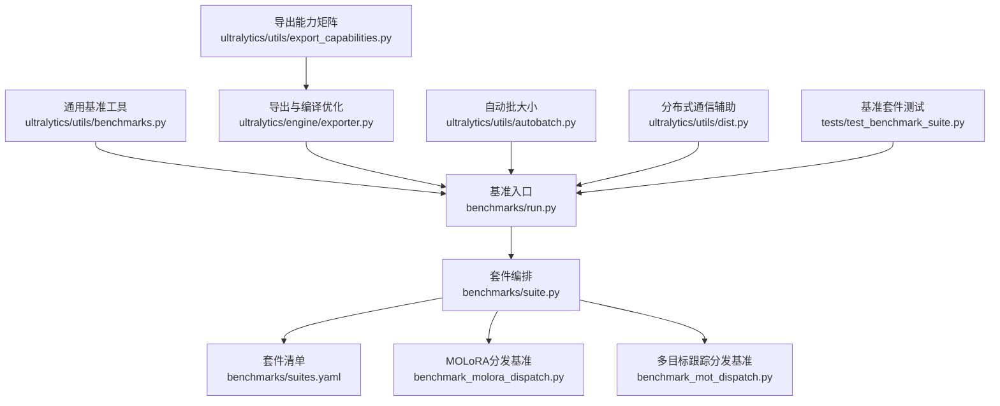
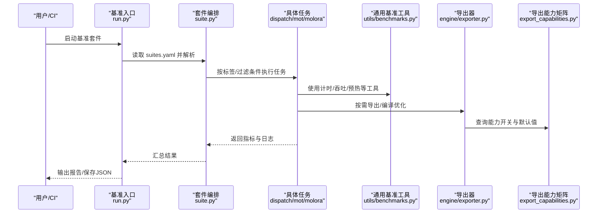
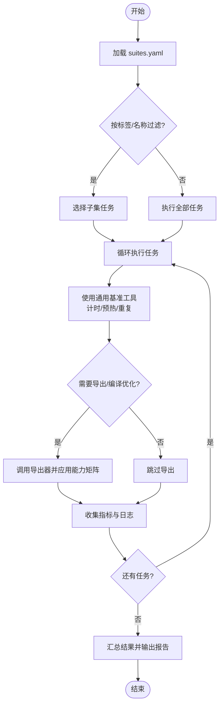
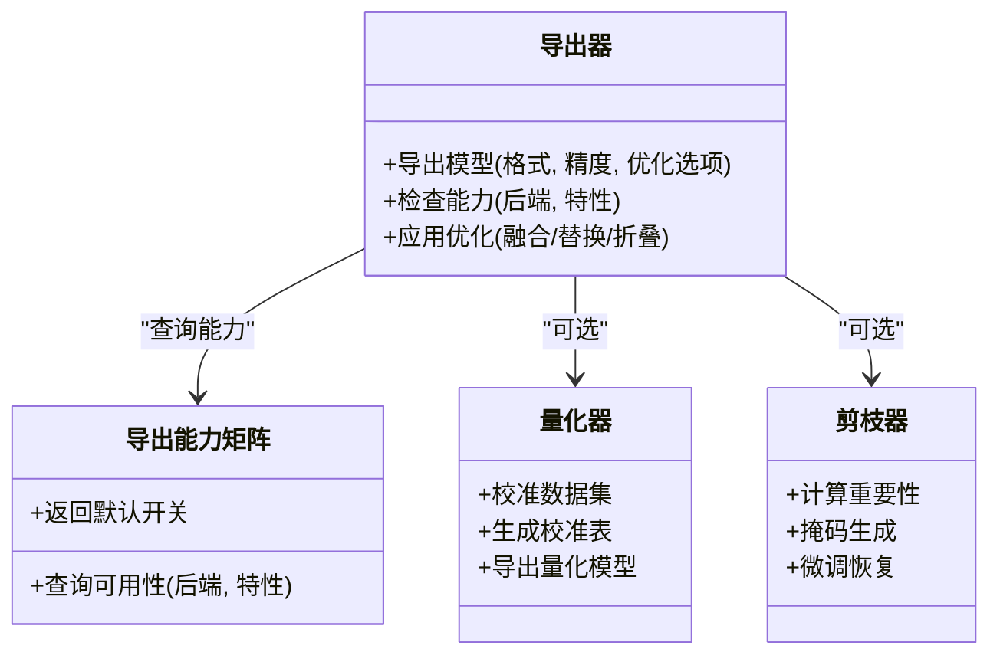
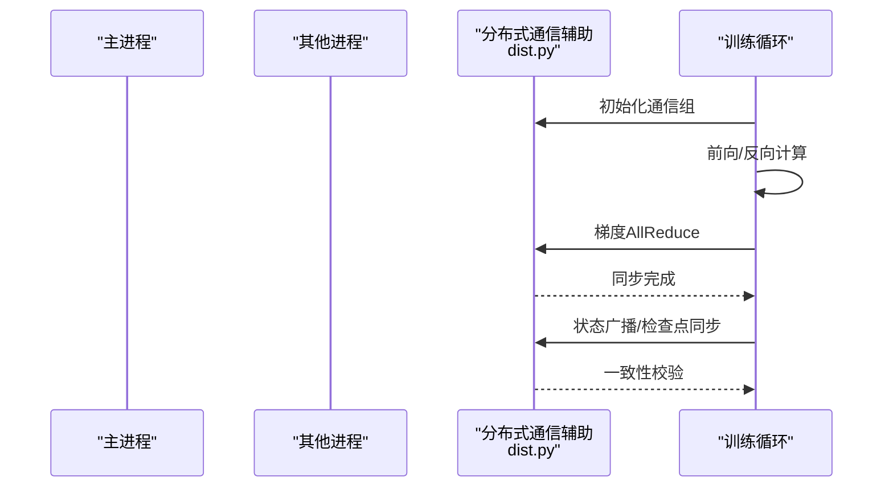
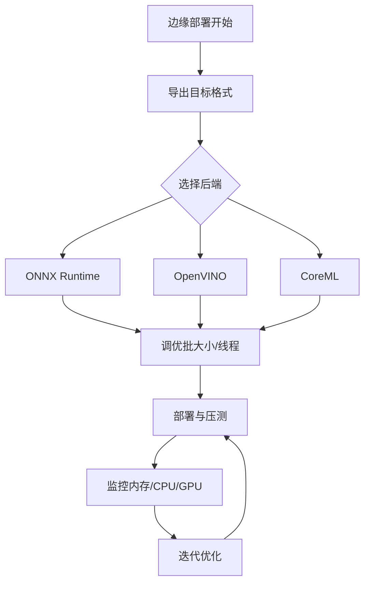
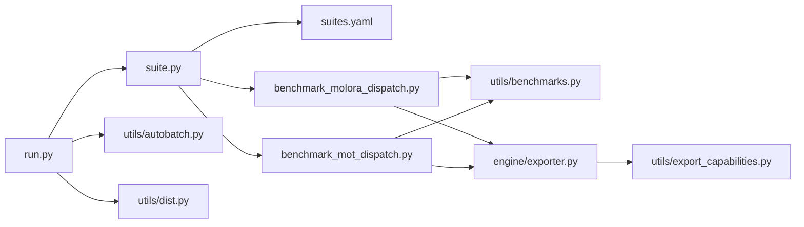

# 性能优化与基准测试

<cite>
**本文引用的文件**
- [benchmarks/run.py](file://benchmarks/run.py)
- [benchmarks/suite.py](file://benchmarks/suite.py)
- [benchmarks/suites.yaml](file://benchmarks/suites.yaml)
- [benchmarks/benchmark_molora_dispatch.py](file://benchmarks/benchmark_molora_dispatch.py)
- [benchmarks/benchmark_mot_dispatch.py](file://benchmarks/benchmark_mot_dispatch.py)
- [ultralytics/utils/benchmarks.py](file://ultralytics/utils/benchmarks.py)
- [ultralytics/engine/exporter.py](file://ultralytics/engine/exporter.py)
- [ultralytics/utils/export_capabilities.py](file://ultralytics/utils/export_capabilities.py)
- [ultralytics/utils/autobatch.py](file://ultralytics/utils/autobatch.py)
- [ultralytics/utils/dist.py](file://ultralytics/utils/dist.py)
- [tests/test_benchmark_suite.py](file://tests/test_benchmark_suite.py)
- [examples/YOLO-Master-Cross-Platform-Edge-Deployment/README.md](file://examples/YOLO-Master-Cross-Platform-Edge-Deployment/README.md)
- [examples/YOLO-Master-Edge-Deployment/edge_utils.py](file://examples/YOLO-Master-Edge-Deployment/edge_utils.py)
- [examples/YOLO-Master-Edge-Deployment/export_edge_models.py](file://examples/YOLO-Master-Edge-Deployment/export_edge_models.py)
- [examples/YOLOv8-ONNXRuntime-Python/main.py](file://examples/YOLOv8-ONNXRuntime-Python/main.py)
- [examples/YOLOv8-OpenVINO-CPP-Inference/main.cc](file://examples/YOLOv8-OpenVINO-CPP-Inference/main.cc)
- [scripts/bench_moe_micro.py](file://scripts/bench_moe_micro.py)
- [scripts/bench_moe_mps.py](file://scripts/bench_moe_mps.py)
- [docs/governance/performance-gates.md](file://docs/governance/performance-gates.md)
- [docs/governance/benchmark-suite.md](file://docs/governance/benchmark-suite.md)
</cite>

## 目录
1. [简介](#简介)
2. [项目结构](#项目结构)
3. [核心组件](#核心组件)
4. [架构总览](#架构总览)
5. [详细组件分析](#详细组件分析)
6. [依赖关系分析](#依赖关系分析)
7. [性能考量](#性能考量)
8. [故障排查指南](#故障排查指南)
9. [结论](#结论)
10. [附录](#附录)

## 简介
本指南面向YOLO-Master项目的性能优化与基准测试，覆盖以下主题：
- 内置基准测试套件的使用与扩展方法
- 性能分析工具（内存、CPU、GPU）的集成与实践
- 模型优化技术（量化、剪枝、编译优化）
- 分布式训练的性能调优（通信与负载均衡）
- 边缘设备部署的性能优化策略
- 性能回归检测的自动化流程
- 性能报告生成与分析技巧
- 瓶颈定位与优化验证方法

## 项目结构
本项目在多个位置提供与性能相关的代码与文档：
- benchmarks：基准测试套件入口、套件定义与调度
- ultralytics/utils/benchmarks.py：通用基准工具
- ultralytics/engine/exporter.py：导出与编译优化相关能力
- ultralytics/utils/export_capabilities.py：导出能力矩阵与开关
- ultralytics/utils/autobatch.py：自动批大小选择
- ultralytics/utils/dist.py：分布式通信辅助
- tests/test_benchmark_suite.py：基准套件测试
- examples：跨平台与边缘部署示例（含推理脚本）
- scripts：MoE微基准与MPS基准等专用脚本
- docs/governance：性能门禁与基准套件治理文档

图表来源
- [benchmarks/run.py](file://benchmarks/run.py)
- [benchmarks/suite.py](file://benchmarks/suite.py)
- [benchmarks/suites.yaml](file://benchmarks/suites.yaml)
- [benchmarks/benchmark_molora_dispatch.py](file://benchmarks/benchmark_molora_dispatch.py)
- [benchmarks/benchmark_mot_dispatch.py](file://benchmarks/benchmark_mot_dispatch.py)
- [ultralytics/utils/benchmarks.py](file://ultralytics/utils/benchmarks.py)
- [ultralytics/engine/exporter.py](file://ultralytics/engine/exporter.py)
- [ultralytics/utils/export_capabilities.py](file://ultralytics/utils/export_capabilities.py)
- [ultralytics/utils/autobatch.py](file://ultralytics/utils/autobatch.py)
- [ultralytics/utils/dist.py](file://ultralytics/utils/dist.py)
- [tests/test_benchmark_suite.py](file://tests/test_benchmark_suite.py)

章节来源
- [benchmarks/run.py](file://benchmarks/run.py)
- [benchmarks/suite.py](file://benchmarks/suite.py)
- [benchmarks/suites.yaml](file://benchmarks/suites.yaml)
- [benchmarks/benchmark_molora_dispatch.py](file://benchmarks/benchmark_molora_dispatch.py)
- [benchmarks/benchmark_mot_dispatch.py](file://benchmarks/benchmark_mot_dispatch.py)
- [ultralytics/utils/benchmarks.py](file://ultralytics/utils/benchmarks.py)
- [ultralytics/engine/exporter.py](file://ultralytics/engine/exporter.py)
- [ultralytics/utils/export_capabilities.py](file://ultralytics/utils/export_capabilities.py)
- [ultralytics/utils/autobatch.py](file://ultralytics/utils/autobatch.py)
- [ultralytics/utils/dist.py](file://ultralytics/utils/dist.py)
- [tests/test_benchmark_suite.py](file://tests/test_benchmark_suite.py)

## 核心组件
- 基准入口与套件编排
  - 通过统一入口加载并执行套件清单中的任务，支持按标签筛选、并行度控制与结果汇总。
  - 套件清单以YAML定义，便于版本化与CI复用。
- 通用基准工具
  - 提供计时、吞吐统计、预热、重复次数、随机种子固定等基础能力。
- 导出与编译优化
  - 导出器负责将模型转换为多种后端格式，并启用相应编译优化选项。
  - 导出能力矩阵用于控制不同后端/精度的可用性与默认行为。
- 自动批大小
  - 根据硬件资源与显存上限动态选择最优批大小，提升吞吐。
- 分布式通信辅助
  - 提供进程间通信、同步与错误传播等辅助函数，支撑DDP/多卡训练与推理。
- 基准套件测试
  - 对基准入口与套件进行端到端冒烟测试，确保稳定性。

章节来源
- [benchmarks/run.py](file://benchmarks/run.py)
- [benchmarks/suite.py](file://benchmarks/suite.py)
- [benchmarks/suites.yaml](file://benchmarks/suites.yaml)
- [ultralytics/utils/benchmarks.py](file://ultralytics/utils/benchmarks.py)
- [ultralytics/engine/exporter.py](file://ultralytics/engine/exporter.py)
- [ultralytics/utils/export_capabilities.py](file://ultralytics/utils/export_capabilities.py)
- [ultralytics/utils/autobatch.py](file://ultralytics/utils/autobatch.py)
- [ultralytics/utils/dist.py](file://ultralytics/utils/dist.py)
- [tests/test_benchmark_suite.py](file://tests/test_benchmark_suite.py)

## 架构总览
下图展示了基准测试从入口到具体任务的调用链，以及导出与能力矩阵的协作关系。

图表来源
- [benchmarks/run.py](file://benchmarks/run.py)
- [benchmarks/suite.py](file://benchmarks/suite.py)
- [benchmarks/benchmark_molora_dispatch.py](file://benchmarks/benchmark_molora_dispatch.py)
- [benchmarks/benchmark_mot_dispatch.py](file://benchmarks/benchmark_mot_dispatch.py)
- [ultralytics/utils/benchmarks.py](file://ultralytics/utils/benchmarks.py)
- [ultralytics/engine/exporter.py](file://ultralytics/engine/exporter.py)
- [ultralytics/utils/export_capabilities.py](file://ultralytics/utils/export_capabilities.py)

## 详细组件分析

### 基准测试套件使用方法
- 运行内置套件
  - 通过基准入口加载套件清单，可按标签或名称筛选任务，设置并发度与重复次数，最终汇总为结构化结果。
- 自定义基准测试
  - 新增任务时，参考现有分发基准的实现模式，注册到套件编排中，并在套件清单中添加条目。
  - 使用通用基准工具封装计时、预热、重复执行与指标聚合逻辑，保证可复现性。
- 关键配置项
  - 套件清单包含任务名、描述、标签、参数、是否启用等信息，便于CI与本地灵活组合。

图表来源
- [benchmarks/run.py](file://benchmarks/run.py)
- [benchmarks/suite.py](file://benchmarks/suite.py)
- [benchmarks/suites.yaml](file://benchmarks/suites.yaml)
- [ultralytics/utils/benchmarks.py](file://ultralytics/utils/benchmarks.py)
- [ultralytics/engine/exporter.py](file://ultralytics/engine/exporter.py)
- [ultralytics/utils/export_capabilities.py](file://ultralytics/utils/export_capabilities.py)

章节来源
- [benchmarks/run.py](file://benchmarks/run.py)
- [benchmarks/suite.py](file://benchmarks/suite.py)
- [benchmarks/suites.yaml](file://benchmarks/suites.yaml)
- [ultralytics/utils/benchmarks.py](file://ultralytics/utils/benchmarks.py)
- [ultralytics/engine/exporter.py](file://ultralytics/engine/exporter.py)
- [ultralytics/utils/export_capabilities.py](file://ultralytics/utils/export_capabilities.py)

### 性能分析工具使用
- 内存使用分析
  - 结合框架提供的内存监控接口与Python内存分析工具，记录峰值与趋势，识别泄漏点。
- CPU性能分析
  - 使用系统级与语言级剖析器，定位热点函数与锁竞争，关注数据预处理与I/O路径。
- GPU利用率监控
  - 利用驱动与运行时API采集GPU占用、显存、功耗与温度，评估算子效率与队列阻塞。

实践建议
- 在基准任务中开启“预热”阶段，避免冷启动偏差。
- 固定随机种子与输入分布，确保对比公平。
- 对关键路径添加细粒度计时点，便于定位瓶颈。

章节来源
- [ultralytics/utils/benchmarks.py](file://ultralytics/utils/benchmarks.py)
- [benchmarks/benchmark_molora_dispatch.py](file://benchmarks/benchmark_molora_dispatch.py)
- [benchmarks/benchmark_mot_dispatch.py](file://benchmarks/benchmark_mot_dispatch.py)

### 模型优化技术
- 量化
  - 针对目标后端（如TensorRT/OpenVINO/ONNX Runtime）选择合适的精度（FP16/INT8），并进行校准与验证。
- 剪枝
  - 基于稀疏性或重要性度量移除冗余权重，配合重训练恢复精度。
- 编译优化
  - 通过导出器启用图融合、算子替换、常量折叠等优化；依据能力矩阵选择可用优化。

图表来源
- [ultralytics/engine/exporter.py](file://ultralytics/engine/exporter.py)
- [ultralytics/utils/export_capabilities.py](file://ultralytics/utils/export_capabilities.py)

章节来源
- [ultralytics/engine/exporter.py](file://ultralytics/engine/exporter.py)
- [ultralytics/utils/export_capabilities.py](file://ultralytics/utils/export_capabilities.py)

### 分布式训练性能调优
- 通信优化
  - 合理设置梯度同步策略、通信后端与带宽限制，减少AllReduce开销。
- 负载均衡
  - 调整数据分片与批大小，避免长尾样本导致的不均衡。
- 监控与诊断
  - 采集各进程耗时、通信延迟与队列长度，定位热点节点。

图表来源
- [ultralytics/utils/dist.py](file://ultralytics/utils/dist.py)

章节来源
- [ultralytics/utils/dist.py](file://ultralytics/utils/dist.py)

### 边缘设备部署优化
- 导出与推理
  - 使用跨平台示例工程，针对不同后端（ONNX Runtime、OpenVINO、CoreML等）进行导出与推理。
- 批大小与线程数
  - 结合自动批大小与设备约束，选择合适批大小与并行度。
- 内存与缓存
  - 预分配张量、复用缓冲区，降低GC与拷贝开销。

图表来源
- [examples/YOLO-Master-Cross-Platform-Edge-Deployment/README.md](file://examples/YOLO-Master-Cross-Platform-Edge-Deployment/README.md)
- [examples/YOLO-Master-Edge-Deployment/edge_utils.py](file://examples/YOLO-Master-Edge-Deployment/edge_utils.py)
- [examples/YOLO-Master-Edge-Deployment/export_edge_models.py](file://examples/YOLO-Master-Edge-Deployment/export_edge_models.py)
- [examples/YOLOv8-ONNXRuntime-Python/main.py](file://examples/YOLOv8-ONNXRuntime-Python/main.py)
- [examples/YOLOv8-OpenVINO-CPP-Inference/main.cc](file://examples/YOLOv8-OpenVINO-CPP-Inference/main.cc)
- [ultralytics/utils/autobatch.py](file://ultralytics/utils/autobatch.py)

章节来源
- [examples/YOLO-Master-Cross-Platform-Edge-Deployment/README.md](file://examples/YOLO-Master-Cross-Platform-Edge-Deployment/README.md)
- [examples/YOLO-Master-Edge-Deployment/edge_utils.py](file://examples/YOLO-Master-Edge-Deployment/edge_utils.py)
- [examples/YOLO-Master-Edge-Deployment/export_edge_models.py](file://examples/YOLO-Master-Edge-Deployment/export_edge_models.py)
- [examples/YOLOv8-ONNXRuntime-Python/main.py](file://examples/YOLOv8-ONNXRuntime-Python/main.py)
- [examples/YOLOv8-OpenVINO-CPP-Inference/main.cc](file://examples/YOLOv8-OpenVINO-CPP-Inference/main.cc)
- [ultralytics/utils/autobatch.py](file://ultralytics/utils/autobatch.py)

### 性能回归检测自动化
- 门禁与阈值
  - 在CI中运行基准套件，对比基线指标，超过阈值则失败。
- 报告与归档
  - 将每次运行的结果持久化为JSON/Markdown，便于趋势分析与审计。
- 版本化与可追溯
  - 关联提交哈希、环境信息与套件清单，确保可重现。

章节来源
- [docs/governance/performance-gates.md](file://docs/governance/performance-gates.md)
- [docs/governance/benchmark-suite.md](file://docs/governance/benchmark-suite.md)
- [tests/test_benchmark_suite.py](file://tests/test_benchmark_suite.py)

### 性能报告生成与分析技巧
- 指标维度
  - 延迟（P50/P95/P99）、吞吐（FPS）、显存峰值、CPU占用、能耗。
- 可视化与对比
  - 生成表格与折线图，对比不同优化前后指标变化。
- 根因分析
  - 结合剖析结果与日志，定位热点算子、I/O瓶颈与通信等待。

章节来源
- [benchmarks/run.py](file://benchmarks/run.py)
- [benchmarks/suite.py](file://benchmarks/suite.py)
- [ultralytics/utils/benchmarks.py](file://ultralytics/utils/benchmarks.py)

### 瓶颈定位与优化验证
- 定位步骤
  - 先粗后细：先确认整体吞吐下降，再聚焦单模块/单算子。
  - 分层剖析：数据预处理、模型推理、后处理、I/O分别测量。
- 验证方法
  - 最小化复现实例，固定输入与随机种子，对比优化前后指标。
  - 使用A/B测试与灰度发布，逐步扩大影响范围。

章节来源
- [benchmarks/benchmark_molora_dispatch.py](file://benchmarks/benchmark_molora_dispatch.py)
- [benchmarks/benchmark_mot_dispatch.py](file://benchmarks/benchmark_mot_dispatch.py)
- [scripts/bench_moe_micro.py](file://scripts/bench_moe_micro.py)
- [scripts/bench_moe_mps.py](file://scripts/bench_moe_mps.py)

## 依赖关系分析
- 组件耦合
  - 基准入口依赖套件编排与清单；套件编排依赖具体任务实现；任务依赖通用基准工具与导出器。
- 外部依赖
  - 导出器依赖目标后端库；分布式通信依赖PyTorch分布式后端。
- 潜在风险
  - 能力矩阵变更可能影响导出行为；分布式通信配置不当会导致性能退化。

图表来源
- [benchmarks/run.py](file://benchmarks/run.py)
- [benchmarks/suite.py](file://benchmarks/suite.py)
- [benchmarks/suites.yaml](file://benchmarks/suites.yaml)
- [benchmarks/benchmark_molora_dispatch.py](file://benchmarks/benchmark_molora_dispatch.py)
- [benchmarks/benchmark_mot_dispatch.py](file://benchmarks/benchmark_mot_dispatch.py)
- [ultralytics/utils/benchmarks.py](file://ultralytics/utils/benchmarks.py)
- [ultralytics/engine/exporter.py](file://ultralytics/engine/exporter.py)
- [ultralytics/utils/export_capabilities.py](file://ultralytics/utils/export_capabilities.py)
- [ultralytics/utils/autobatch.py](file://ultralytics/utils/autobatch.py)
- [ultralytics/utils/dist.py](file://ultralytics/utils/dist.py)

章节来源
- [benchmarks/run.py](file://benchmarks/run.py)
- [benchmarks/suite.py](file://benchmarks/suite.py)
- [benchmarks/suites.yaml](file://benchmarks/suites.yaml)
- [benchmarks/benchmark_molora_dispatch.py](file://benchmarks/benchmark_molora_dispatch.py)
- [benchmarks/benchmark_mot_dispatch.py](file://benchmarks/benchmark_mot_dispatch.py)
- [ultralytics/utils/benchmarks.py](file://ultralytics/utils/benchmarks.py)
- [ultralytics/engine/exporter.py](file://ultralytics/engine/exporter.py)
- [ultralytics/utils/export_capabilities.py](file://ultralytics/utils/export_capabilities.py)
- [ultralytics/utils/autobatch.py](file://ultralytics/utils/autobatch.py)
- [ultralytics/utils/dist.py](file://ultralytics/utils/dist.py)

## 性能考量
- 预热与稳定期
  - 首次导入与冷启动开销较大，应在基准中加入足够预热轮次。
- 批大小与并行度
  - 自动批大小能提升吞吐，但需结合显存与延迟目标权衡。
- 数据管道
  - 预处理与I/O常成为瓶颈，建议使用异步加载与内存映射。
- 随机性与可复现
  - 固定随机种子与输入分布，确保对比公平。
- 资源隔离
  - 在多租户环境中隔离CPU/GPU资源，避免相互干扰。

[本节为通用指导，不直接分析具体文件]

## 故障排查指南
- 常见问题
  - 导出失败：检查后端依赖与能力矩阵开关。
  - 基准不稳定：增加预热与重复次数，固定随机种子。
  - 分布式异常：核对通信组初始化与错误传播路径。
- 调试手段
  - 使用通用基准工具的细粒度计时点，定位慢路径。
  - 借助系统剖析器与GPU监控工具，观察资源占用。
- 回归检测
  - 在CI中运行基准套件，对比基线阈值，失败时快速回滚。

章节来源
- [tests/test_benchmark_suite.py](file://tests/test_benchmark_suite.py)
- [ultralytics/utils/benchmarks.py](file://ultralytics/utils/benchmarks.py)
- [ultralytics/utils/dist.py](file://ultralytics/utils/dist.py)
- [docs/governance/performance-gates.md](file://docs/governance/performance-gates.md)

## 结论
通过统一的基准套件、完善的导出与能力矩阵、自动批大小与分布式通信辅助，YOLO-Master提供了从开发到部署的全链路性能优化能力。建议在CI中常态化运行基准套件，建立性能门禁与报告体系，持续追踪优化效果并及时发现回归问题。

[本节为总结性内容，不直接分析具体文件]

## 附录
- 常用命令与参数
  - 运行基准套件：通过入口指定套件清单与过滤条件。
  - 导出模型：选择目标后端与精度，启用所需优化。
  - 分布式训练：配置进程数与通信后端，监控同步开销。
- 参考示例
  - 边缘部署：参考跨平台示例工程的导出与推理脚本。
  - MoE微基准：使用专用脚本评估路由与专家负载。

章节来源
- [benchmarks/run.py](file://benchmarks/run.py)
- [benchmarks/suite.py](file://benchmarks/suite.py)
- [benchmarks/suites.yaml](file://benchmarks/suites.yaml)
- [examples/YOLO-Master-Cross-Platform-Edge-Deployment/README.md](file://examples/YOLO-Master-Cross-Platform-Edge-Deployment/README.md)
- [scripts/bench_moe_micro.py](file://scripts/bench_moe_micro.py)
- [scripts/bench_moe_mps.py](file://scripts/bench_moe_mps.py)