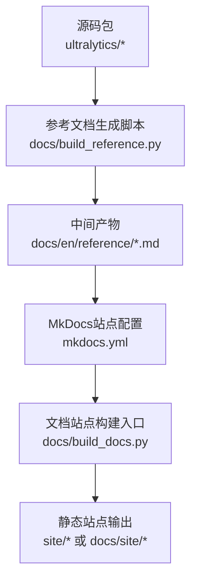
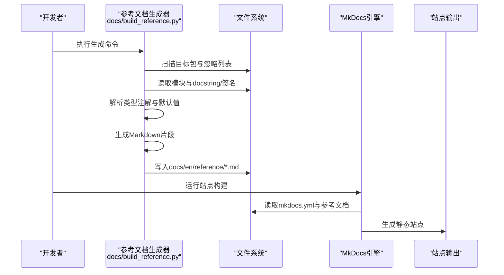
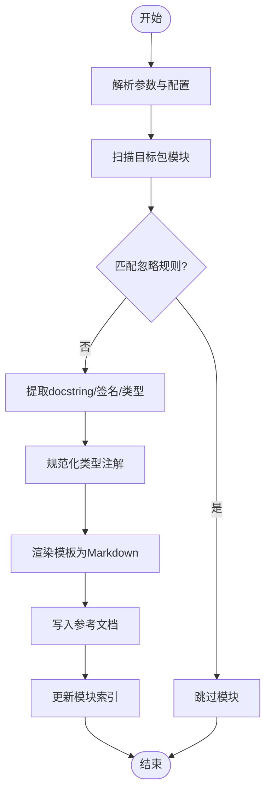
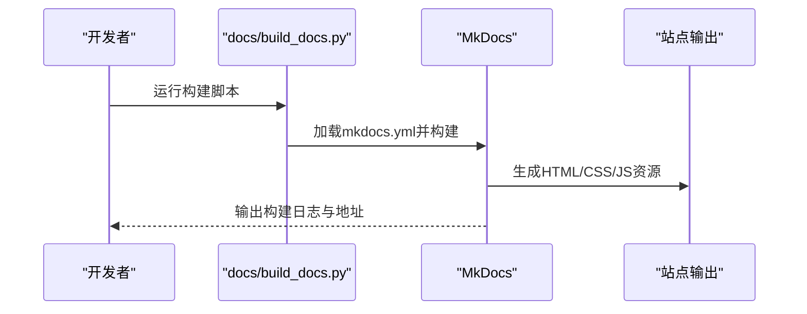
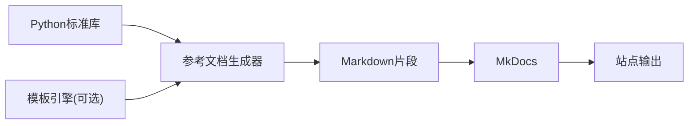

# API参考文档生成

<cite>
**本文引用的文件**
- [build_reference.py](file://docs/build_reference.py)
- [build_docs.py](file://docs/build_docs.py)
- [mkdocs.yml](file://mkdocs.yml)
- [__init__.md](file://docs/en/reference/__init__.md)
- [index.md](file://docs/en/reference/index.md)
</cite>

## 目录
1. [简介](#简介)
2. [项目结构](#项目结构)
3. [核心组件](#核心组件)
4. [架构总览](#架构总览)
5. [详细组件分析](#详细组件分析)
6. [依赖关系分析](#依赖关系分析)
7. [性能考虑](#性能考虑)
8. [故障排查指南](#故障排查指南)
9. [结论](#结论)
10. [附录](#附录)

## 简介
本指南面向希望为YOLO-Master项目构建和维护“API参考文档自动生成系统”的开发者与维护者。目标是通过自动化扫描Python模块、提取docstring与类型注解，并基于模板生成Markdown参考文档，最终集成到MkDocs站点中。文档将覆盖：
- build_reference.py脚本的工作原理与配置项
- Python模块扫描、docstring提取与Markdown生成流程
- 模板系统与格式化规则
- 为新模块添加API文档支持（注册与标记）
- 复杂类型注解与函数签名的处理策略
- 文档链接自动生成的交互关系
- 测试与验证方法
- 更新触发器与增量构建配置
- 私有API与内部接口的文档控制

## 项目结构
与API参考文档生成相关的核心位置如下：
- docs/build_reference.py：参考文档生成主脚本
- docs/build_docs.py：文档站点的整体构建入口（通常用于本地预览/发布）
- mkdocs.yml：MkDocs站点配置（导航、主题、插件等）
- docs/en/reference/*：已生成的参考文档输出目录（含索引与子模块页面）

图表来源
- [build_reference.py](file://docs/build_reference.py)
- [build_docs.py](file://docs/build_docs.py)
- [mkdocs.yml](file://mkdocs.yml)

章节来源
- [build_reference.py](file://docs/build_reference.py)
- [build_docs.py](file://docs/build_docs.py)
- [mkdocs.yml](file://mkdocs.yml)

## 核心组件
- 模块扫描器：递归发现目标包下的可导入模块，过滤忽略列表，解析模块元信息（名称、路径、版本等）。
- Docstring与签名提取器：使用标准库反射能力读取函数/类/属性的docstring与签名，规范化参数、返回类型与默认值。
- 模板渲染器：根据预定义模板将结构化数据渲染为Markdown片段，统一标题层级、表格样式与交叉引用。
- 链接生成器：在模块间建立相对链接，确保跨文件跳转稳定。
- 增量构建器：对比源文件时间戳与已生成文档，仅重建变更部分。
- MkDocs集成：将生成的Markdown纳入站点导航与搜索索引。

章节来源
- [build_reference.py](file://docs/build_reference.py)
- [build_docs.py](file://docs/build_docs.py)
- [mkdocs.yml](file://mkdocs.yml)

## 架构总览
下图展示了从源码到最终站点的端到端流程，包括增量构建与链接生成。

图表来源
- [build_reference.py](file://docs/build_reference.py)
- [build_docs.py](file://docs/build_docs.py)
- [mkdocs.yml](file://mkdocs.yml)

## 详细组件分析

### 参考文档生成脚本（docs/build_reference.py）
该脚本是API参考文档自动化的核心，负责：
- 解析命令行参数与配置文件（如目标包、输出目录、忽略模式、是否包含私有成员等）
- 扫描Python模块树，收集可导出符号（函数、类、属性）
- 提取docstring与签名，规范化类型提示与默认值
- 按模板渲染Markdown，并生成模块索引页
- 维护增量构建缓存（可选），避免重复工作

关键流程（概念性流程图）：

章节来源
- [build_reference.py](file://docs/build_reference.py)

### MkDocs集成与站点构建（docs/build_docs.py 与 mkdocs.yml）
- mkdocs.yml：定义站点标题、主题、导航树、插件（如搜索、代码高亮）、以及参考文档目录映射。
- build_docs.py：封装本地预览与发布流程，调用MkDocs CLI或Python API进行构建；也可在CI中作为入口。

建议的站点构建序列：

图表来源
- [build_docs.py](file://docs/build_docs.py)
- [mkdocs.yml](file://mkdocs.yml)

章节来源
- [build_docs.py](file://docs/build_docs.py)
- [mkdocs.yml](file://mkdocs.yml)

### 模板系统与格式化规则
- 模板分层：模块级模板、类模板、函数模板、属性模板，分别控制标题、段落、表格与示例块。
- 格式化规则：
  - 标题层级：模块H1、类H2、函数H3、属性H4
  - 参数表：名称、类型、默认值、说明
  - 返回类型与异常：单独小节
  - 交叉引用：以相对路径链接至其他模块页面
- 变量注入：由生成器提供模块名、版本、作者、变更记录等上下文。

章节来源
- [build_reference.py](file://docs/build_reference.py)

### 为新模块添加API文档支持
步骤概览：
- 模块注册：在生成器的“目标包”列表中声明新模块路径，或在包的__init__.py中显式导出公共接口。
- 文档标记：为函数/类/属性编写结构化docstring（遵循Google/NumPy/Sphinx风格之一），标注参数、返回值与异常。
- 类型注解：为函数签名添加类型提示，便于生成器正确解析与渲染。
- 忽略控制：对内部实现或临时接口，可在忽略列表中排除或通过标记隐藏。
- 索引更新：重新运行生成脚本，确认新增页面出现在参考索引中。

章节来源
- [build_reference.py](file://docs/build_reference.py)

### 复杂类型注解与函数签名处理
- Union/Optional/泛型：解析为可读文本，必要时保留原始形式并在备注中解释。
- Callable/Protocol：显示调用约定与约束，必要时附加示例链接。
- 默认值与可变默认值：区分不可变默认值与可变默认值，给出安全提示。
- 重载与装饰器：合并签名信息，保留装饰器语义说明。

章节来源
- [build_reference.py](file://docs/build_reference.py)

### 文档链接的自动生成交互关系
- 模块内链接：同一模块内的类/函数互相引用，采用锚点链接。
- 跨模块链接：通过相对路径指向docs/en/reference下的对应Markdown文件。
- 外部链接：第三方库或平台文档以绝对URL呈现，并在新窗口打开。
- 失效检测：构建阶段检查链接有效性，失败时告警。

章节来源
- [build_reference.py](file://docs/build_reference.py)

### 测试与验证方法
- 单元测试：
  - 模块扫描覆盖率：验证忽略规则与可见性过滤
  - docstring解析：断言关键字段存在且格式正确
  - 类型注解渲染：断言复杂类型的文本化结果符合预期
- 集成测试：
  - 端到端生成：运行完整生成流程，校验输出文件数量与命名
  - 站点构建：调用MkDocs构建，检查无错误与链接有效
- 回归测试：
  - 对比历史快照，确保新增/修改未破坏既有文档结构

章节来源
- [build_reference.py](file://docs/build_reference.py)
- [build_docs.py](file://docs/build_docs.py)

### 文档更新触发器与增量构建
- 触发器：
  - 文件变更：监听目标包下*.py文件的修改时间
  - 提交钩子：在git commit或push后触发增量构建
  - CI流水线：在PR/MR中自动构建并比较差异
- 增量构建：
  - 缓存键：模块路径+docstring哈希+签名哈希
  - 失效策略：任一依赖变化即重建相关页面
  - 并行构建：按模块粒度并行渲染，提升吞吐

章节来源
- [build_reference.py](file://docs/build_reference.py)

### 私有API与内部接口的文档控制
- 可见性开关：通过配置项控制是否包含以单下划线开头的成员。
- 选择性暴露：在模块__all__中显式列出需文档化的公共接口。
- 标记语法：在docstring中使用特定标签（如@private、@internal）进行细粒度控制。
- 审计清单：生成“内部接口清单”供维护者定期审查。

章节来源
- [build_reference.py](file://docs/build_reference.py)

## 依赖关系分析
- 运行时依赖：
  - Python标准库：inspect、ast、importlib、pathlib、re、json等
  - 模板引擎：Jinja2或其他轻量模板库（若使用）
  - MkDocs：站点构建与导航
- 开发依赖：
  - pytest：单元与集成测试
  - black/ruff：代码与文档一致性检查（可选）

图表来源
- [build_reference.py](file://docs/build_reference.py)
- [mkdocs.yml](file://mkdocs.yml)

章节来源
- [build_reference.py](file://docs/build_reference.py)
- [mkdocs.yml](file://mkdocs.yml)

## 性能考虑
- 模块扫描优化：
  - 惰性导入：仅在需要时导入模块，避免全量初始化
  - 并行处理：多进程/多线程渲染不同模块
- I/O优化：
  - 批量写入：减少磁盘I/O次数
  - 增量缓存：避免重复解析相同模块
- 内存管理：
  - 流式渲染：大模块分块渲染，降低峰值内存
- 构建加速：
  - 增量构建：仅重建变更模块
  - 缓存命中：基于内容哈希判断是否需要重建

[本节为通用指导，不直接分析具体文件]

## 故障排查指南
常见问题与定位要点：
- 模块无法导入：
  - 检查PYTHONPATH与包路径配置
  - 确认模块未被忽略规则误伤
- docstring缺失或格式不一致：
  - 统一docstring风格，补充必要字段
  - 在生成器中添加容错逻辑，记录警告而非中断
- 类型注解解析失败：
  - 简化复杂类型或使用别名
  - 在模板中增加降级展示策略
- 链接失效：
  - 核对相对路径与文件名大小写
  - 启用链接检查并修复
- 增量构建未生效：
  - 检查缓存键计算逻辑
  - 清理缓存后重试

章节来源
- [build_reference.py](file://docs/build_reference.py)
- [build_docs.py](file://docs/build_docs.py)

## 结论
通过模块化设计与增量构建，YOLO-Master的API参考文档生成系统能够高效、稳定地维护高质量的技术文档。建议在团队中推广统一的docstring与类型注解规范，结合CI流水线实现持续交付，确保文档与代码同步演进。

[本节为总结性内容，不直接分析具体文件]

## 附录

### 快速上手清单
- 安装依赖：确保Python环境与MkDocs可用
- 配置目标包：在生成器中声明要扫描的包路径
- 编写docstring：为公共接口补充结构化说明
- 运行生成：执行参考文档生成脚本
- 构建站点：运行docs/build_docs.py生成站点
- 验证链接：检查站内导航与交叉引用

章节来源
- [build_reference.py](file://docs/build_reference.py)
- [build_docs.py](file://docs/build_docs.py)
- [mkdocs.yml](file://mkdocs.yml)

### 参考文档目录示例
- docs/en/reference/__init__.md：参考文档首页索引
- docs/en/reference/index.md：模块分类与导航

章节来源
- [__init__.md](file://docs/en/reference/__init__.md)
- [index.md](file://docs/en/reference/index.md)