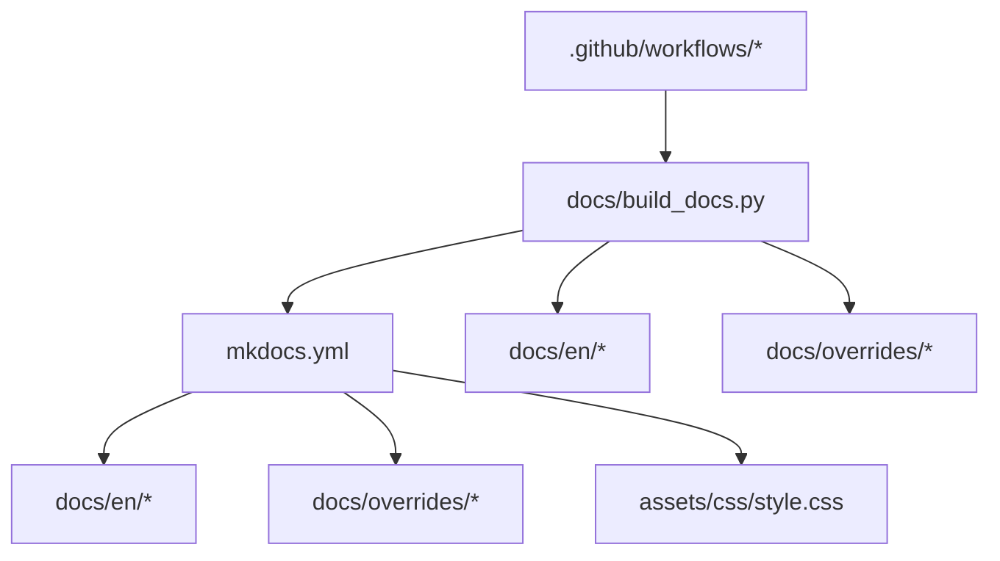
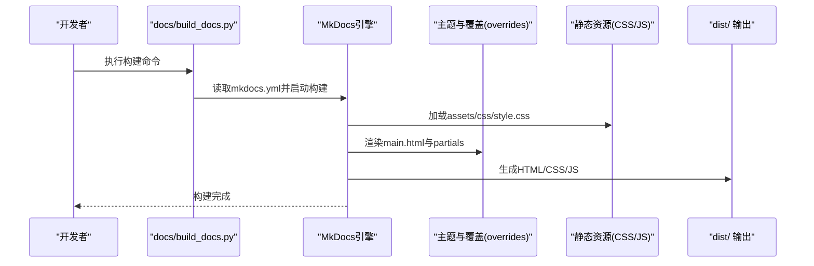
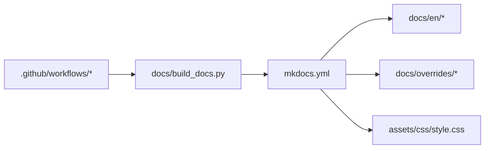

# MkDocs配置与构建

<cite>
**本文引用的文件**
- [mkdocs.yml](file://mkdocs.yml)
- [build_docs.py](file://docs/build_docs.py)
- [index.html](file://docs/index.html)
- [overrides/main.html](file://docs/overrides/main.html)
- [assets/css/style.css](file://assets/css/style.css)
- [overrides/javascript/custom.js](file://docs/overrides/javascript/custom.js)
- [overrides/partials/nav-item.html](file://docs/overrides/partials/nav-item.html)
- [overrides/stylesheets/custom.css](file://docs/overrides/stylesheets/custom.css)
- [en/index.md](file://docs/en/index.md)
- [en/quickstart.md](file://docs/en/quickstart.md)
- [en/datasets/index.md](file://docs/en/datasets/index.md)
- [en/guides/index.md](file://docs/en/guides/index.md)
- [en/help/index.md](file://docs/en/help/index.md)
- [en/hub/index.md](file://docs/en/hub/index.md)
- [en/inference/index.md](file://docs/en/inference/index.md)
- [en/integrations/index.md](file://docs/en/integrations/index.md)
- [en/models/index.md](file://docs/en/models/index.md)
- [en/modes/index.md](file://docs/en/modes/index.md)
- [en/platform/index.md](file://docs/en/platform/index.md)
- [en/reference/index.md](file://docs/en/reference/index.md)
- [en/solutions/index.md](file://docs/en/solutions/index.md)
- [en/tasks/index.md](file://docs/en/tasks/index.md)
- [en/usage/index.md](file://docs/en/usage/index.md)
- [en/yolov5/index.md](file://docs/en/yolov5/index.md)
</cite>

## 目录
1. [简介](#简介)
2. [项目结构](#项目结构)
3. [核心组件](#核心组件)
4. [架构总览](#架构总览)
5. [详细组件分析](#详细组件分析)
6. [依赖关系分析](#依赖关系分析)
7. [性能考虑](#性能考虑)
8. [故障排查指南](#故障排查指南)
9. [结论](#结论)
10. [附录](#附录)

## 简介
本指南面向YOLO-Master项目的文档工程，聚焦于基于MkDocs的站点配置、主题与插件定制、构建流程自动化、搜索优化、多语言组织、版本发布与缓存策略。文档以仓库中实际存在的配置文件与脚本为依据，帮助读者快速搭建、定制并高效维护项目文档站点。

## 项目结构
与文档构建直接相关的顶层与子目录如下：
- mkdocs.yml：MkDocs站点主配置（站点元数据、导航、主题、插件等）
- docs/：文档源内容与自定义资源
  - en/：英文文档内容（按功能域分目录）
  - overrides/：主题覆盖（模板、样式、脚本）
  - assets/css/style.css：全局样式覆盖入口
  - build_docs.py：文档构建脚本（封装构建命令、参数与环境）
  - index.html：可选的首页重定向或占位页
- .github/workflows/：CI工作流（用于自动构建与发布）

图表来源
- [mkdocs.yml](file://mkdocs.yml)
- [build_docs.py](file://docs/build_docs.py)
- [assets/css/style.css](file://assets/css/style.css)
- [overrides/main.html](file://docs/overrides/main.html)

章节来源
- [mkdocs.yml](file://mkdocs.yml)
- [build_docs.py](file://docs/build_docs.py)
- [index.html](file://docs/index.html)

## 核心组件
- 站点配置（mkdocs.yml）
  - 站点元数据：站点名称、描述、版权、仓库地址等
  - 导航结构：通过nav定义多级菜单与页面映射
  - 主题配置：选择主题及主题相关选项
  - 插件设置：启用search、i18n、宏生成等插件及其参数
- 构建脚本（docs/build_docs.py）
  - 封装mkdocs build/run命令
  - 支持传入额外参数（如--strict、--config-file等）
  - 提供本地预览与生产构建的统一入口
- 主题覆盖（docs/overrides/*）
  - main.html：站点根模板覆盖
  - partials/*：局部模板覆盖（如导航项）
  - stylesheets/* 与 assets/css/*：CSS覆盖
  - javascript/*：JS扩展（如埋点、交互增强）
- 多语言内容（docs/en/*）
  - 按功能域划分：datasets、guides、help、hub、inference、integrations、models、modes、platform、reference、solutions、tasks、usage、yolov5等
  - 各域包含index.md作为该域的入口页

章节来源
- [mkdocs.yml](file://mkdocs.yml)
- [build_docs.py](file://docs/build_docs.py)
- [overrides/main.html](file://docs/overrides/main.html)
- [assets/css/style.css](file://assets/css/style.css)
- [overrides/javascript/custom.js](file://docs/overrides/javascript/custom.js)
- [overrides/partials/nav-item.html](file://docs/overrides/partials/nav-item.html)
- [overrides/stylesheets/custom.css](file://docs/overrides/stylesheets/custom.css)
- [en/index.md](file://docs/en/index.md)
- [en/datasets/index.md](file://docs/en/datasets/index.md)
- [en/guides/index.md](file://docs/en/guides/index.md)
- [en/help/index.md](file://docs/en/help/index.md)
- [en/hub/index.md](file://docs/en/hub/index.md)
- [en/inference/index.md](file://docs/en/inference/index.md)
- [en/integrations/index.md](file://docs/en/integrations/index.md)
- [en/models/index.md](file://docs/en/models/index.md)
- [en/modes/index.md](file://docs/en/modes/index.md)
- [en/platform/index.md](file://docs/en/platform/index.md)
- [en/reference/index.md](file://docs/en/reference/index.md)
- [en/solutions/index.md](file://docs/en/solutions/index.md)
- [en/tasks/index.md](file://docs/en/tasks/index.md)
- [en/usage/index.md](file://docs/en/usage/index.md)
- [en/yolov5/index.md](file://docs/en/yolov5/index.md)

## 架构总览
下图展示了从源码到静态站点的整体构建链路，包括配置加载、内容解析、主题渲染与输出产物。

图表来源
- [mkdocs.yml](file://mkdocs.yml)
- [build_docs.py](file://docs/build_docs.py)
- [overrides/main.html](file://docs/overrides/main.html)
- [assets/css/style.css](file://assets/css/style.css)

## 详细组件分析

### 站点配置（mkdocs.yml）
- 站点元数据
  - 站点名称、描述、版权信息、仓库URL等字段用于生成站点头部、侧边栏与页脚信息
- 导航结构（nav）
  - 通过键值对与列表组合定义多级菜单；每个条目指向docs下的Markdown文件或外部链接
  - 建议为每个功能域提供index.md作为聚合入口，便于导航与SEO
- 主题配置
  - 指定主题名称与主题级选项（如logo、favicon、配色、字体等）
  - 可通过theme.custom_dir指向自定义覆盖目录
- 插件设置
  - search：启用站内全文检索
  - i18n：多语言支持（需配合content_base与翻译文件组织）
  - 其他插件：如宏替换、代码高亮增强等按需启用
- 资源与覆盖
  - extra_css/extra_javascript：引入自定义样式与脚本
  - theme.custom_dir：指向docs/overrides，实现模板与样式覆盖
- 站点行为
  - strict模式：在构建时开启严格检查，提前发现错误
  - dev_server：本地开发服务器端口与热重载配置
  - repo_url/repo_name：用于“编辑此页”与仓库跳转

章节来源
- [mkdocs.yml](file://mkdocs.yml)

### 构建脚本（docs/build_docs.py）
- 功能概述
  - 封装mkdocs命令行，统一本地开发与CI构建入口
  - 支持传递额外参数（如--strict、--config-file、--site-dir等）
  - 可区分本地预览（serve）与生产构建（build）两种模式
- 使用方式
  - 本地预览：运行脚本进入开发服务器，修改内容后自动刷新
  - 生产构建：生成静态站点至dist目录，供部署平台托管
- 环境变量与参数
  - 可通过环境变量控制日志级别、是否启用缓存、目标站点目录等
  - 建议在CI中固定Python与MkDocs版本，确保构建一致性

章节来源
- [build_docs.py](file://docs/build_docs.py)

### 主题覆盖与样式定制
- 模板覆盖
  - main.html：覆盖站点根模板，可注入全局变量、统计脚本、自定义头部/尾部
  - partials/nav-item.html：覆盖导航项渲染逻辑，实现特殊链接或图标
- 样式覆盖
  - assets/css/style.css：作为全局样式入口，被mkdocs.yml引用
  - overrides/stylesheets/custom.css：主题内样式覆盖，优先级高于默认样式
- JavaScript扩展
  - docs/overrides/javascript/custom.js：注入前端交互、埋点、动态行为
- 最佳实践
  - 将通用样式放入assets/css/style.css，主题特定样式放入overrides/stylesheets
  - JS脚本尽量异步加载，避免阻塞首屏渲染
  - 使用命名空间或前缀避免与主题默认样式冲突

章节来源
- [overrides/main.html](file://docs/overrides/main.html)
- [overrides/partials/nav-item.html](file://docs/overrides/partials/nav-item.html)
- [assets/css/style.css](file://assets/css/style.css)
- [overrides/stylesheets/custom.css](file://docs/overrides/stylesheets/custom.css)
- [overrides/javascript/custom.js](file://docs/overrides/javascript/custom.js)

### 文档搜索配置与优化
- 启用search插件
  - 在mkdocs.yml中启用search，并确保内容足够丰富以提升召回率
- 索引优化
  - 合理拆分大文档，避免单页过大导致索引缓慢
  - 使用标题层级与关键词提升搜索相关性
- 用户体验
  - 在main.html中可注入搜索框提示语、快捷键说明
  - 结合analytics记录热门搜索词，持续优化内容结构

章节来源
- [mkdocs.yml](file://mkdocs.yml)
- [overrides/main.html](file://docs/overrides/main.html)

### 多语言支持与翻译文件组织
- 内容组织
  - 当前仓库采用docs/en/作为英文内容根目录，可按功能域进一步细分
  - 每个域提供index.md作为聚合入口，便于导航与SEO
- 多语言机制
  - 使用i18n插件时，需配置content_base与翻译文件路径
  - 建议为每种语言建立独立目录（如docs/en、docs/zh），并通过导航切换
- 翻译协作
  - 制定翻译规范（术语表、风格指南）
  - 在CI中增加翻译完整性校验（缺失文件检测）

章节来源
- [en/index.md](file://docs/en/index.md)
- [en/datasets/index.md](file://docs/en/datasets/index.md)
- [en/guides/index.md](file://docs/en/guides/index.md)
- [en/help/index.md](file://docs/en/help/index.md)
- [en/hub/index.md](file://docs/en/hub/index.md)
- [en/inference/index.md](file://docs/en/inference/index.md)
- [en/integrations/index.md](file://docs/en/integrations/index.md)
- [en/models/index.md](file://docs/en/models/index.md)
- [en/modes/index.md](file://docs/en/modes/index.md)
- [en/platform/index.md](file://docs/en/platform/index.md)
- [en/reference/index.md](file://docs/en/reference/index.md)
- [en/solutions/index.md](file://docs/en/solutions/index.md)
- [en/tasks/index.md](file://docs/en/tasks/index.md)
- [en/usage/index.md](file://docs/en/usage/index.md)
- [en/yolov5/index.md](file://docs/en/yolov5/index.md)

### 版本控制与发布流程自动化
- CI工作流
  - 在.github/workflows中定义构建与发布任务，触发条件可为push/tag
  - 安装依赖、执行docs/build_docs.py进行构建，产出dist目录
- 发布目标
  - GitHub Pages：将dist推送到gh-pages分支或使用Actions部署
  - 对象存储：上传至S3/OSS并清理旧版本
- 版本标记
  - 使用语义化标签（vX.Y.Z）驱动构建与发布
  - 在站点中展示版本号与变更日志链接

章节来源
- [build_docs.py](file://docs/build_docs.py)

### 构建性能优化与缓存策略
- 构建缓存
  - 在CI中缓存Python包与MkDocs依赖，减少重复安装时间
  - 缓存docs/_build或dist目录增量更新
- 并行与增量
  - 启用MkDocs增量构建，仅重建变更页面
  - 大型站点可考虑分页或分模块构建
- 资源优化
  - 压缩CSS/JS，延迟加载非关键脚本
  - 图片使用现代格式与CDN加速

章节来源
- [build_docs.py](file://docs/build_docs.py)

## 依赖关系分析
- 配置与内容
  - mkdocs.yml驱动docs/en/*内容的解析与渲染
- 主题与资源
  - overrides/*与assets/css/*被主题加载，影响最终HTML输出
- 构建脚本与CI
  - docs/build_docs.py封装构建命令，.github/workflows调用脚本完成自动化

图表来源
- [mkdocs.yml](file://mkdocs.yml)
- [build_docs.py](file://docs/build_docs.py)
- [overrides/main.html](file://docs/overrides/main.html)
- [assets/css/style.css](file://assets/css/style.css)

章节来源
- [mkdocs.yml](file://mkdocs.yml)
- [build_docs.py](file://docs/build_docs.py)

## 性能考虑
- 构建阶段
  - 使用--strict模式尽早发现问题，避免后期返工
  - 在CI中缓存依赖与中间产物，缩短流水线时长
- 运行时
  - 减少不必要的JS执行，优先使用静态资源
  - 合理使用search插件，避免超大索引文件
- 部署
  - 启用HTTP缓存头与CDN，提升用户访问速度
  - 定期清理历史版本，降低存储成本

[本节为通用指导，不直接分析具体文件]

## 故障排查指南
- 构建失败
  - 检查mkdocs.yml语法与路径是否正确
  - 确认Python与MkDocs版本兼容
  - 查看构建日志中的错误堆栈定位问题
- 主题覆盖无效
  - 确认overrides目录结构与文件名符合主题要求
  - 检查CSS/JS路径与加载顺序
- 搜索无结果
  - 确认search插件已启用且内容未被忽略
  - 检查页面标题与正文关键词是否充分
- 多语言未生效
  - 核对i18n插件配置与翻译文件路径
  - 验证导航切换逻辑与content_base设置

章节来源
- [mkdocs.yml](file://mkdocs.yml)
- [build_docs.py](file://docs/build_docs.py)
- [overrides/main.html](file://docs/overrides/main.html)

## 结论
通过合理的mkdocs.yml配置、完善的主题覆盖与插件体系、统一的构建脚本与CI自动化，YOLO-Master文档可实现高质量、可扩展、易维护的站点工程。建议持续优化搜索体验、多语言协作与构建性能，以提升团队效率与用户满意度。

[本节为总结性内容，不直接分析具体文件]

## 附录
- 常用命令
  - 本地预览：通过docs/build_docs.py启动开发服务器
  - 生产构建：通过docs/build_docs.py生成dist静态站点
- 参考入口
  - 英文主页：docs/en/index.md
  - 快速开始：docs/en/quickstart.md
  - 各功能域入口：docs/en/*/index.md

章节来源
- [en/index.md](file://docs/en/index.md)
- [en/quickstart.md](file://docs/en/quickstart.md)