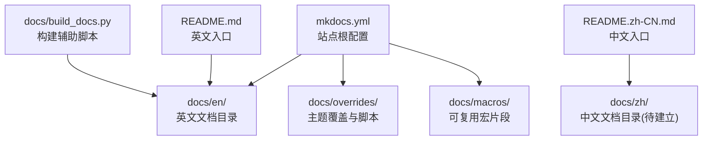
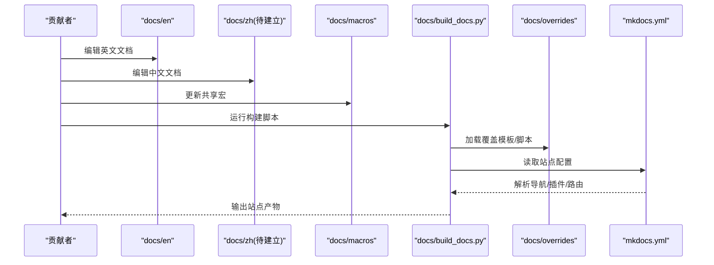
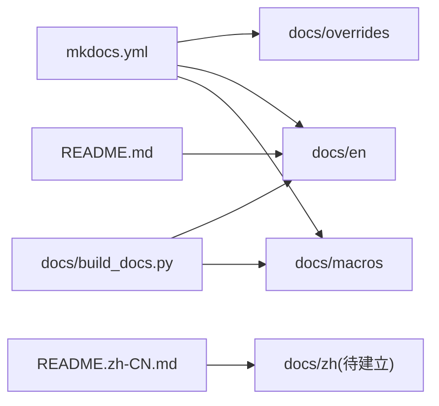

# 多语言文档支持

<cite>
**本文引用的文件**
- [mkdocs.yml](file://mkdocs.yml)
- [docs/en/index.md](file://docs/en/index.md)
- [docs/README.md](file://docs/README.md)
- [docs/build_docs.py](file://docs/build_docs.py)
- [docs/mkdocs_github_authors.yaml](file://docs/mkdocs_github_authors.yaml)
- [README.md](file://README.md)
- [README.zh-CN.md](file://README.zh-CN.md)
- [CONTRIBUTING.md](file://CONTRIBUTING.md)
</cite>

## 目录
1. [简介](#简介)
2. [项目结构](#项目结构)
3. [核心组件](#核心组件)
4. [架构总览](#架构总览)
5. [详细组件分析](#详细组件分析)
6. [依赖关系分析](#依赖关系分析)
7. [性能考虑](#性能考虑)
8. [故障排查指南](#故障排查指南)
9. [结论](#结论)
10. [附录](#附录)

## 简介
本指南面向YOLO-Master项目的多语言文档维护，聚焦英文与中文文档的组织结构、同步机制、翻译工作流、质量检查、版本一致性策略、术语统一与本地化适配、作者信息国际化配置、新增语言的流程、翻译质量评估与回滚机制，以及代码示例的多语言适配与平台差异处理。目标是让不同背景的贡献者都能高效参与文档的本地化与维护。

## 项目结构
仓库采用“按主题+按语言”的文档组织方式：
- docs/en：英文文档主目录，包含数据集、指南、参考、集成、模型、模式、平台、使用等子目录。
- docs/overrides：构建与展示相关的覆盖模板（样式、脚本、页面模板）。
- docs/macros：可复用的宏片段，用于在不同语言中复用表格与参数说明。
- docs/governance、docs/plans：治理与规划类文档（当前以英文为主）。
- mkdocs.yml：站点根配置，定义站点元数据、导航、插件、主题、多语言路由等。
- docs/build_docs.py：文档构建辅助脚本，负责生成参考文档、聚合内容等。
- README.md / README.zh-CN.md：仓库级中英文快速入门入口。

图表来源
- [mkdocs.yml](file://mkdocs.yml)
- [docs/en/index.md](file://docs/en/index.md)
- [docs/build_docs.py](file://docs/build_docs.py)

章节来源
- [mkdocs.yml](file://mkdocs.yml)
- [docs/en/index.md](file://docs/en/index.md)
- [docs/README.md](file://docs/README.md)
- [docs/build_docs.py](file://docs/build_docs.py)

## 核心组件
- 站点根配置（mkdocs.yml）
  - 定义站点标题、描述、仓库地址、导航树、主题与插件、多语言路由规则、GitHub作者映射等。
  - 通过导航与插件协同实现多语言站点结构与访问路径控制。
- 英文文档集（docs/en）
  - 按功能域分目录组织，便于独立更新与定位。
- 构建辅助脚本（docs/build_docs.py）
  - 提供自动化能力，如生成API参考、聚合宏、预处理素材等，减少重复劳动。
- 主题覆盖（docs/overrides）
  - 自定义样式、脚本与页面模板，支撑多语言切换、搜索、导航等体验优化。
- 仓库级入口（README.md / README.zh-CN.md）
  - 作为用户第一触点，引导至对应语言文档站点的首页或快速开始页。

章节来源
- [mkdocs.yml](file://mkdocs.yml)
- [docs/en/index.md](file://docs/en/index.md)
- [docs/build_docs.py](file://docs/build_docs.py)
- [README.md](file://README.md)
- [README.zh-CN.md](file://README.zh-CN.md)

## 架构总览
下图展示了多语言文档从源码到站点的整体流程：开发者在各自语言目录下编辑Markdown，借助构建脚本与主题覆盖进行渲染，最终由站点根配置驱动生成多语言站点。

图表来源
- [mkdocs.yml](file://mkdocs.yml)
- [docs/build_docs.py](file://docs/build_docs.py)
- [docs/en/index.md](file://docs/en/index.md)

## 详细组件分析

### 站点根配置（mkdocs.yml）
- 职责
  - 定义站点元数据、导航结构、主题与插件、多语言路由、GitHub作者映射等。
  - 协调多语言页面的URL路径与跳转逻辑。
- 关键要点
  - 导航需为每种语言预留一致的层级结构，便于跨语言对照。
  - 插件与主题应支持多语言切换与SEO友好（如sitemap、alternate链接）。
  - GitHub作者映射文件用于显示贡献者信息，避免硬编码。

章节来源
- [mkdocs.yml](file://mkdocs.yml)

### 英文文档集（docs/en）
- 职责
  - 承载英文侧所有用户文档，包括数据集、指南、参考、集成、模型、模式、平台、使用等。
- 关键要点
  - 保持目录结构与中文一致，便于后续镜像与同步。
  - 使用相对链接与宏引用，降低跨文件维护成本。

章节来源
- [docs/en/index.md](file://docs/en/index.md)

### 构建辅助脚本（docs/build_docs.py）
- 职责
  - 自动化生成参考文档、聚合宏、预处理素材，提升构建效率与一致性。
- 关键要点
  - 将易变内容（如参数表、能力矩阵）从静态Markdown中抽离，集中管理。
  - 在多语言场景下，确保生成的产物能被各语言站点正确引用。

章节来源
- [docs/build_docs.py](file://docs/build_docs.py)

### 主题覆盖（docs/overrides）
- 职责
  - 定制样式、脚本与页面模板，增强多语言切换、导航、搜索等体验。
- 关键要点
  - 多语言切换按钮、语言选择器、默认语言设置需在覆盖模板中明确。
  - 注意与第三方插件的兼容性，避免冲突。

章节来源
- [docs/overrides/main.html](file://docs/overrides/main.html)

### 仓库级入口（README.md / README.zh-CN.md）
- 职责
  - 作为用户第一触点，分别指向英文与中文的快速开始与文档入口。
- 关键要点
  - 保持两版入口的一致性，及时同步变更。
  - 链接到对应语言的站点首页或快速开始页。

章节来源
- [README.md](file://README.md)
- [README.zh-CN.md](file://README.zh-CN.md)

### 作者信息国际化（mkdocs_github_authors.yaml）
- 职责
  - 集中管理GitHub作者映射，避免在文档中硬编码作者名，支持国际化显示。
- 关键要点
  - 新增贡献者时，优先更新此映射文件。
  - 与站点配置联动，确保作者信息在各语言站点一致显示。

章节来源
- [docs/mkdocs_github_authors.yaml](file://docs/mkdocs_github_authors.yaml)

## 依赖关系分析
- 模块耦合
  - mkdocs.yml 驱动整个站点构建，依赖主题覆盖与插件生态。
  - build_docs.py 产出供各语言站点引用的中间产物。
  - docs/en 与未来 docs/zh 应保持结构对称，降低同步复杂度。
- 外部依赖
  - MkDocs生态（主题、插件）、GitHub作者映射、CI流水线（可选）。

图表来源
- [mkdocs.yml](file://mkdocs.yml)
- [docs/build_docs.py](file://docs/build_docs.py)
- [docs/en/index.md](file://docs/en/index.md)

章节来源
- [mkdocs.yml](file://mkdocs.yml)
- [docs/build_docs.py](file://docs/build_docs.py)
- [docs/en/index.md](file://docs/en/index.md)

## 性能考虑
- 构建性能
  - 将动态内容抽取到脚本生成，减少大段Markdown体积。
  - 合理使用宏与片段，避免重复渲染开销。
- 站点性能
  - 启用缓存与增量构建，缩短迭代时间。
  - 图片与资源按需压缩与懒加载。

[本节为通用建议，不直接分析具体文件]

## 故障排查指南
- 常见问题
  - 多语言路由异常：检查mkdocs.yml中的导航与路由配置是否完整。
  - 作者信息显示错误：核对mkdocs_github_authors.yaml映射是否正确。
  - 构建失败：确认build_docs.py依赖与输入路径是否存在。
- 回滚策略
  - 基于Git提交记录回滚到上一个稳定版本的文档分支。
  - 对已发布的站点产物保留历史快照，必要时恢复旧版本。

章节来源
- [mkdocs.yml](file://mkdocs.yml)
- [docs/mkdocs_github_authors.yaml](file://docs/mkdocs_github_authors.yaml)
- [docs/build_docs.py](file://docs/build_docs.py)

## 结论
通过清晰的目录结构、统一的站点配置、自动化的构建脚本与主题覆盖，YOLO-Master的多语言文档体系具备良好的可扩展性与可维护性。遵循本指南的流程与规范，可有效保障英文与中文文档的一致性与高质量交付。

[本节为总结性内容，不直接分析具体文件]

## 附录

### 翻译工作流程与任务分配
- 角色分工
  - 原文负责人：维护英文源文档，保证准确性与时效性。
  - 翻译负责人：负责中文翻译与本地化适配。
  - 审校负责人：进行术语一致性、可读性与技术准确性审查。
  - 发布负责人：合并PR、触发构建与发布。
- 任务流转
  - 创建翻译任务 → 分配译者 → 完成初译 → 同行审校 → 合并与发布。
- 工具建议
  - 使用协作平台（如GitHub Issues/Pull Requests）跟踪任务与评审。
  - 利用术语表与风格指南约束翻译质量。

[本节为流程性内容，不直接分析具体文件]

### 质量检查与验收标准
- 术语一致性：对照术语表，确保关键概念翻译统一。
- 可读性：语句通顺、段落清晰、示例可执行。
- 完整性：与英文源文档章节一一对应，无遗漏。
- 链接有效性：内部与外部链接可用。
- 自动化检查（可选）：lint、链接校验、拼写检查。

[本节为通用建议，不直接分析具体文件]

### 版本同步策略
- 同步原则
  - 以英文为权威源，中文在变更后尽快跟进。
  - 重大更新时，双语同步发布；小修小补可异步更新。
- 同步方法
  - 使用结构化目录与命名约定，便于对比与迁移。
  - 通过脚本或CI提示缺失章节与差异。
- 冲突解决
  - 以英文为准，结合业务上下文协商调整。
  - 记录决策与原因，形成知识库条目。

[本节为通用建议，不直接分析具体文件]

### 技术术语统一与本地化适配
- 术语管理
  - 维护术语表（中英对照），定期评审与更新。
  - 在文档中引入术语注释与链接，提高一致性。
- 本地化适配
  - 单位、日期、数字格式按目标语言习惯调整。
  - 示例命令与路径尽量保持平台无关或提供多平台说明。

[本节为通用建议，不直接分析具体文件]

### 作者信息的国际化配置与管理
- 配置位置
  - 使用集中式作者映射文件，避免在文档中硬编码。
- 管理机制
  - 新增贡献者时，先更新映射文件，再在文档中引用。
  - 定期清理无效或重复条目。

章节来源
- [docs/mkdocs_github_authors.yaml](file://docs/mkdocs_github_authors.yaml)

### 新语言添加的完整流程与配置要求
- 步骤
  - 在站点根配置中添加新语言路由与导航项。
  - 新建语言目录（如docs/fr），复制并初始化基础结构。
  - 更新主题覆盖以支持语言选择器与默认语言。
  - 在仓库级入口添加新语言快速开始链接。
  - 验证构建与站点展示。
- 配置要求
  - 导航层级与现有语言保持一致。
  - 插件与主题对新语言的支持需提前验证。
  - 作者映射与SEO元数据需包含新语言。

章节来源
- [mkdocs.yml](file://mkdocs.yml)
- [docs/overrides/main.html](file://docs/overrides/main.html)
- [README.md](file://README.md)
- [README.zh-CN.md](file://README.zh-CN.md)

### 翻译质量评估与回滚机制
- 评估指标
  - 术语一致性、可读性、完整性、链接可用性、示例可执行性。
- 评估流程
  - 同行评审 + 抽样抽检 + 自动化检查。
- 回滚机制
  - 基于Git标签或分支回滚到上一稳定版本。
  - 站点产物保留历史快照，必要时恢复旧版本。

[本节为通用建议，不直接分析具体文件]

### 代码示例的多语言适配与平台差异
- 适配策略
  - 示例代码尽量保持平台无关，或在同一文件中提供多平台说明。
  - 使用环境变量或配置文件区分平台差异。
- 文档呈现
  - 在示例前后增加平台注意事项与前置条件。
  - 提供常见错误的排查指引。

[本节为通用建议，不直接分析具体文件]