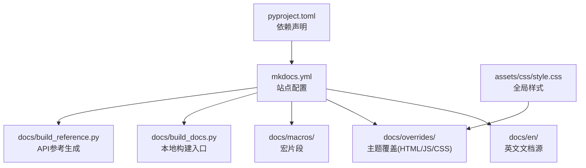
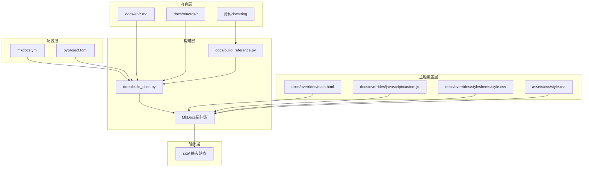
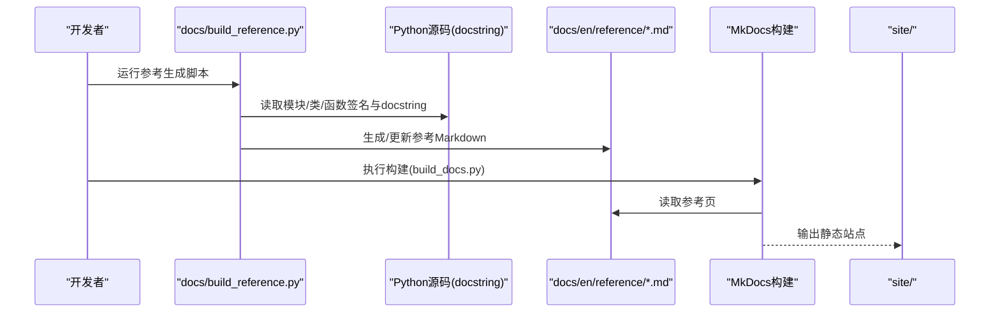
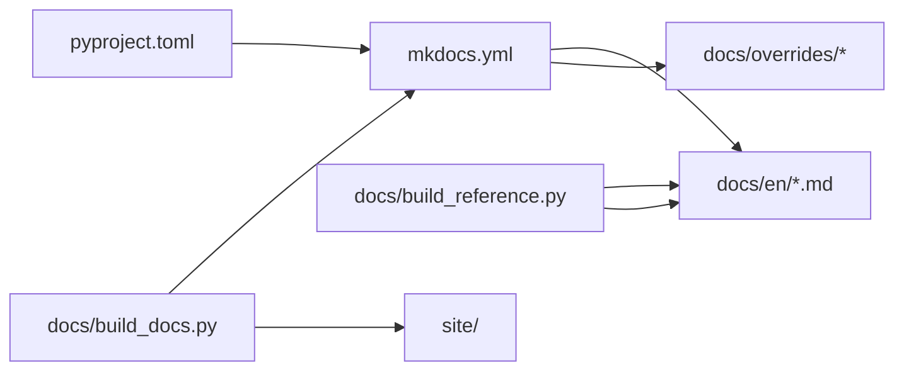

# 文档系统维护

<cite>
**本文引用的文件**
- [mkdocs.yml](file://mkdocs.yml)
- [docs/build_docs.py](file://docs/build_docs.py)
- [docs/build_reference.py](file://docs/build_reference.py)
- [docs/index.html](file://docs/index.html)
- [docs/overrides/main.html](file://docs/overrides/main.html)
- [docs/overrides/javascript/custom.js](file://docs/overrides/javascript/custom.js)
- [docs/overrides/stylesheets/style.css](file://docs/overrides/stylesheets/style.css)
- [assets/css/style.css](file://assets/css/style.css)
- [docs/en/index.md](file://docs/en/index.md)
- [docs/en/reference/index.md](file://docs/en/reference/index.md)
- [docs/en/reference/__init__.md](file://docs/en/reference/__init__.md)
- [docs/mkdocs_github_authors.yaml](file://docs/mkdocs_github_authors.yaml)
- [pyproject.toml](file://pyproject.toml)
</cite>

## 目录
1. [简介](#简介)
2. [项目结构](#项目结构)
3. [核心组件](#核心组件)
4. [架构总览](#架构总览)
5. [详细组件分析](#详细组件分析)
6. [依赖关系分析](#依赖关系分析)
7. [性能与可维护性建议](#性能与可维护性建议)
8. [故障排查指南](#故障排查指南)
9. [结论](#结论)
10. [附录](#附录)

## 简介
本指南面向YOLO-Master项目的文档系统维护者，聚焦于基于MkDocs的文档站点构建、主题定制、API参考自动生成、多语言维护、自动化构建与部署、搜索与导航优化、内容编写最佳实践、版本管理与迁移策略，以及新增/更新页面流程。目标是帮助读者快速上手并高效维护高质量的技术文档站点。

## 项目结构
文档系统围绕以下关键目录与文件组织：
- docs：文档源（Markdown）、构建脚本、主题覆盖、宏与资源
- assets/css：全局样式
- mkdocs.yml：MkDocs主配置
- pyproject.toml：Python工程与依赖声明（含文档相关依赖）
- docs/en：英文文档根目录（多语言扩展时可按需复制为其他语言目录）

图表来源
- [mkdocs.yml](file://mkdocs.yml)
- [docs/build_docs.py](file://docs/build_docs.py)
- [docs/build_reference.py](file://docs/build_reference.py)
- [docs/overrides/main.html](file://docs/overrides/main.html)
- [docs/overrides/javascript/custom.js](file://docs/overrides/javascript/custom.js)
- [docs/overrides/stylesheets/style.css](file://docs/overrides/stylesheets/style.css)
- [assets/css/style.css](file://assets/css/style.css)
- [pyproject.toml](file://pyproject.toml)

章节来源
- [mkdocs.yml](file://mkdocs.yml)
- [docs/build_docs.py](file://docs/build_docs.py)
- [docs/build_reference.py](file://docs/build_reference.py)
- [docs/overrides/main.html](file://docs/overrides/main.html)
- [docs/overrides/javascript/custom.js](file://docs/overrides/javascript/custom.js)
- [docs/overrides/stylesheets/style.css](file://docs/overrides/stylesheets/style.css)
- [assets/css/style.css](file://assets/css/style.css)
- [pyproject.toml](file://pyproject.toml)

## 核心组件
- MkDocs站点配置：定义站点元信息、主题、插件、导航、多语言等。
- 主题覆盖：通过overrides目录注入自定义HTML模板、JavaScript与CSS，实现品牌化与交互增强。
- 构建脚本：build_docs.py负责常规构建；build_reference.py负责从源码docstring生成API参考。
- 宏与片段：macros目录存放可复用的表格/参数说明片段，供各页面引用。
- 多语言：以docs/en为基准，按语言子目录组织，配合MkDocs多语言插件或仓库级方案进行同步。
- 依赖管理：在pyproject.toml中声明文档相关依赖，确保环境一致性。

章节来源
- [mkdocs.yml](file://mkdocs.yml)
- [docs/build_docs.py](file://docs/build_docs.py)
- [docs/build_reference.py](file://docs/build_reference.py)
- [docs/overrides/main.html](file://docs/overrides/main.html)
- [docs/overrides/javascript/custom.js](file://docs/overrides/javascript/custom.js)
- [docs/overrides/stylesheets/style.css](file://docs/overrides/stylesheets/style.css)
- [assets/css/style.css](file://assets/css/style.css)
- [pyproject.toml](file://pyproject.toml)

## 架构总览
下图展示了文档站点的整体构建与渲染流程，包括配置加载、主题覆盖、插件处理、参考生成与最终输出。

图表来源
- [mkdocs.yml](file://mkdocs.yml)
- [docs/build_docs.py](file://docs/build_docs.py)
- [docs/build_reference.py](file://docs/build_reference.py)
- [docs/overrides/main.html](file://docs/overrides/main.html)
- [docs/overrides/javascript/custom.js](file://docs/overrides/javascript/custom.js)
- [docs/overrides/stylesheets/style.css](file://docs/overrides/stylesheets/style.css)
- [assets/css/style.css](file://assets/css/style.css)
- [pyproject.toml](file://pyproject.toml)

## 详细组件分析

### MkDocs站点配置（mkdocs.yml）
- 作用：定义站点标题、描述、主题、插件、导航树、多语言、仓库链接、搜索与SEO等。
- 关键点：
  - 主题与插件：启用必要的插件（如搜索、多语言、宏、GitHub作者等）。
  - 导航：集中管理页面顺序与分组，便于跨语言保持一致结构。
  - 多语言：配置默认语言与备选语言，统一路由前缀。
  - 仓库与作者：关联代码仓库与贡献者映射，提升协作体验。
  - 站点URL与路径：设置正确的base URL与相对路径，避免资源加载失败。

章节来源
- [mkdocs.yml](file://mkdocs.yml)

### 主题覆盖（overrides）
- main.html：覆盖默认布局，注入站点头部/尾部、统计脚本、自定义菜单等。
- custom.js：在页面加载后执行，增强搜索、导航、交互行为。
- style.css：覆盖主题样式，统一品牌色、字体、间距等。
- assets/css/style.css：作为全局样式补充，被主题覆盖引入。

章节来源
- [docs/overrides/main.html](file://docs/overrides/main.html)
- [docs/overrides/javascript/custom.js](file://docs/overrides/javascript/custom.js)
- [docs/overrides/stylesheets/style.css](file://docs/overrides/stylesheets/style.css)
- [assets/css/style.css](file://assets/css/style.css)

### 构建脚本（docs/build_docs.py）
- 作用：封装本地构建命令，统一环境变量、清理输出、并行构建等。
- 典型流程：
  - 解析命令行参数（如是否包含参考生成、是否开启调试日志）。
  - 调用MkDocs CLI或Python API执行构建。
  - 输出站点到指定目录，便于预览与部署。

章节来源
- [docs/build_docs.py](file://docs/build_docs.py)

### API参考自动生成（docs/build_reference.py）
- 目标：从Python源码中提取docstring，生成结构化API参考页，保持与代码同步。
- 流程概览：
  - 扫描目标模块与类/函数。
  - 提取签名、参数、返回值、示例与备注。
  - 将结果写入Markdown模板，插入到docs/en/reference下。
  - 由MkDocs统一渲染到站点。

图表来源
- [docs/build_reference.py](file://docs/build_reference.py)
- [docs/en/reference/index.md](file://docs/en/reference/index.md)
- [docs/en/reference/__init__.md](file://docs/en/reference/__init__.md)
- [docs/build_docs.py](file://docs/build_docs.py)

章节来源
- [docs/build_reference.py](file://docs/build_reference.py)
- [docs/en/reference/index.md](file://docs/en/reference/index.md)
- [docs/en/reference/__init__.md](file://docs/en/reference/__init__.md)
- [docs/build_docs.py](file://docs/build_docs.py)

### 多语言文档维护
- 目录结构：以docs/en为基准，新增语言时创建对应目录（如docs/zh），并在mkdocs.yml中注册。
- 翻译流程：
  - 复制英文页面到新语言目录，逐页翻译并保持路径一致。
  - 使用统一的导航结构，确保跨语言跳转稳定。
  - 对动态生成的参考页，考虑按语言拆分或仅维护英文参考。
- 同步机制：
  - 通过CI任务对比语言目录差异，提示缺失翻译。
  - 使用宏与片段减少重复内容，降低同步成本。

章节来源
- [mkdocs.yml](file://mkdocs.yml)
- [docs/en/index.md](file://docs/en/index.md)

### 构建与部署自动化
- 本地构建：通过docs/build_docs.py一键构建，支持增量与清理选项。
- CI/CD：在GitHub Actions或其他流水线中安装依赖、执行参考生成、构建站点、发布至托管平台。
- 缓存策略：缓存Python包与MkDocs中间产物，加速构建。
- 版本发布：结合标签触发构建，生成带版本号的站点分支或路径。

章节来源
- [docs/build_docs.py](file://docs/build_docs.py)
- [pyproject.toml](file://pyproject.toml)

### 搜索与导航优化
- 搜索：启用内置搜索引擎，必要时添加自定义索引逻辑或第三方插件。
- 导航：在mkdocs.yml中集中管理导航树，保证层级清晰、命名一致。
- SEO：完善站点元数据、站点地图与robots.txt，提升可发现性。
- 用户体验：通过custom.js实现锚点高亮、回到顶部、面包屑等增强功能。

章节来源
- [mkdocs.yml](file://mkdocs.yml)
- [docs/overrides/javascript/custom.js](file://docs/overrides/javascript/custom.js)

### 内容编写最佳实践与模板
- 规范：
  - 使用一致的标题层级与术语表。
  - 每个页面包含简短摘要、前置条件、步骤与常见问题。
  - 图片与代码块提供替代文本与注释。
- 模板：
  - 新建页面时参考现有模板（如docs/en/index.md），保持结构与风格一致。
  - 使用macros中的表格与参数片段，减少重复劳动。
- 质量检查：
  - 本地构建验证链接与图片路径。
  - 使用lint工具检查Markdown格式与拼写。

章节来源
- [docs/en/index.md](file://docs/en/index.md)
- [docs/macros](file://docs/macros)

### 版本管理与迁移策略
- 版本标记：在仓库中使用语义化版本标签，CI根据标签构建对应版本的文档站点。
- 迁移策略：
  - 大版本升级前先评估MkDocs与插件兼容性。
  - 逐步替换已弃用配置项，保留向后兼容的过渡期。
  - 记录变更日志，指导用户从旧版文档迁移到新版。

章节来源
- [mkdocs.yml](file://mkdocs.yml)
- [pyproject.toml](file://pyproject.toml)

### 如何添加新页面与更新现有内容
- 新增页面：
  - 在docs/en下创建Markdown文件，遵循现有目录约定。
  - 在mkdocs.yml的导航中添加条目，确保排序合理。
  - 若涉及API参考，先运行参考生成脚本再构建站点。
- 更新内容：
  - 直接编辑现有Markdown，注意保持链接与图片路径有效。
  - 使用宏与片段替换重复内容，提高可维护性。
  - 本地构建验证无误后提交PR。

章节来源
- [mkdocs.yml](file://mkdocs.yml)
- [docs/en/index.md](file://docs/en/index.md)
- [docs/build_reference.py](file://docs/build_reference.py)

## 依赖关系分析
- 工程依赖：pyproject.toml声明了构建与渲染所需的Python包（如MkDocs、主题、插件、参考生成工具等）。
- 运行时依赖：构建阶段需要Node/浏览器无关的渲染能力；主题覆盖不依赖外部运行时。
- 耦合与内聚：
  - mkdocs.yml与docs/en强耦合（导航与内容路径）。
  - build_docs.py与build_reference.py松耦合，可通过参数控制是否生成参考。
  - 主题覆盖与MkDocs主题解耦，便于替换主题而不影响内容。

图表来源
- [pyproject.toml](file://pyproject.toml)
- [mkdocs.yml](file://mkdocs.yml)
- [docs/build_docs.py](file://docs/build_docs.py)
- [docs/build_reference.py](file://docs/build_reference.py)

章节来源
- [pyproject.toml](file://pyproject.toml)
- [mkdocs.yml](file://mkdocs.yml)
- [docs/build_docs.py](file://docs/build_docs.py)
- [docs/build_reference.py](file://docs/build_reference.py)

## 性能与可维护性建议
- 构建性能：
  - 启用增量构建与缓存，避免全量重建。
  - 限制参考生成范围，按需只更新变更模块。
- 主题性能：
  - 精简自定义CSS/JS，避免阻塞渲染。
  - 使用异步加载非关键脚本。
- 可维护性：
  - 将通用片段放入macros，减少重复。
  - 在mkdocs.yml中集中管理导航，避免分散配置。
  - 为重要页面添加“最后更新时间”与贡献者信息。

[本节为通用建议，无需特定文件来源]

## 故障排查指南
- 构建失败：
  - 检查mkdocs.yml语法与路径是否正确。
  - 确认依赖安装完整，版本兼容。
  - 查看构建日志定位具体错误。
- 参考生成异常：
  - 确认目标模块可导入且docstring完整。
  - 检查生成脚本的输出目录权限。
- 主题覆盖失效：
  - 确认overrides目录结构与文件名符合主题要求。
  - 检查CSS/JS路径与资源加载状态。
- 多语言问题：
  - 核对mkdocs.yml中语言注册与导航条目。
  - 确保各语言目录路径一致。

章节来源
- [mkdocs.yml](file://mkdocs.yml)
- [docs/build_docs.py](file://docs/build_docs.py)
- [docs/build_reference.py](file://docs/build_reference.py)
- [docs/overrides/main.html](file://docs/overrides/main.html)
- [docs/overrides/javascript/custom.js](file://docs/overrides/javascript/custom.js)
- [docs/overrides/stylesheets/style.css](file://docs/overrides/stylesheets/style.css)

## 结论
通过合理的MkDocs配置、主题覆盖、参考自动生成与多语言维护策略，YOLO-Master的文档系统可实现高效构建、良好体验与长期可维护性。建议持续优化导航与搜索、完善模板与最佳实践，并将构建与部署纳入CI/CD，确保文档与代码同步演进。

[本节为总结性内容，无需特定文件来源]

## 附录
- 常用命令：
  - 本地构建：运行docs/build_docs.py
  - 生成API参考：运行docs/build_reference.py
  - 预览站点：启动本地服务器（依据MkDocs配置）
- 参考文件：
  - 站点首页：docs/en/index.md
  - 参考首页：docs/en/reference/index.md
  - 参考初始化：docs/en/reference/__init__.md
  - GitHub作者映射：docs/mkdocs_github_authors.yaml

章节来源
- [docs/en/index.md](file://docs/en/index.md)
- [docs/en/reference/index.md](file://docs/en/reference/index.md)
- [docs/en/reference/__init__.md](file://docs/en/reference/__init__.md)
- [docs/mkdocs_github_authors.yaml](file://docs/mkdocs_github_authors.yaml)