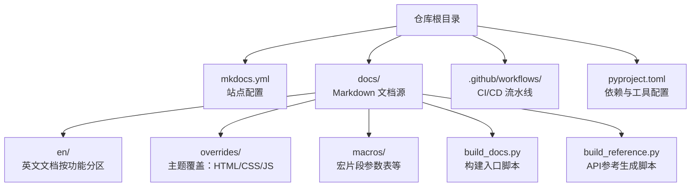
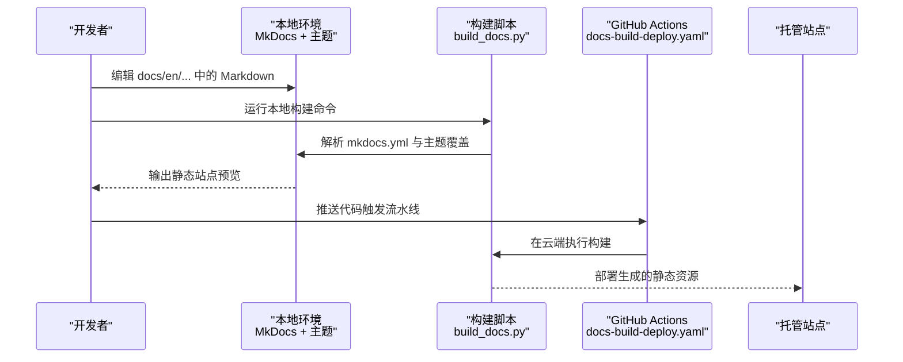
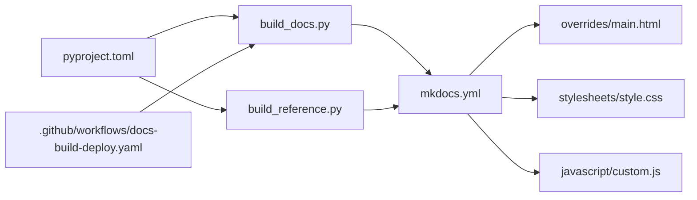

# 文档编写工作流

<cite>
**本文引用的文件**
- [mkdocs.yml](file://mkdocs.yml)
- [docs/README.md](file://docs/README.md)
- [docs/build_docs.py](file://docs/build_docs.py)
- [docs/build_reference.py](file://docs/build_reference.py)
- [docs/index.html](file://docs/index.html)
- [docs/overrides/main.html](file://docs/overrides/main.html)
- [docs/overrides/stylesheets/style.css](file://docs/overrides/stylesheets/style.css)
- [docs/overrides/javascript/custom.js](file://docs/overrides/javascript/custom.js)
- [docs/en/help/contributing.md](file://docs/en/help/contributing.md)
- [CONTRIBUTING.md](file://CONTRIBUTING.md)
- [.github/workflows/docs-build-deploy.yaml](file://.github/workflows/docs-build-deploy.yaml)
- [pyproject.toml](file://pyproject.toml)
</cite>

## 目录
1. [简介](#简介)
2. [项目结构](#项目结构)
3. [核心组件](#核心组件)
4. [架构总览](#架构总览)
5. [详细组件分析](#详细组件分析)
6. [依赖关系分析](#依赖关系分析)
7. [性能与构建优化](#性能与构建优化)
8. [故障排查指南](#故障排查指南)
9. [结论](#结论)
10. [附录](#附录)

## 简介
本指南面向YOLO-Master项目的文档贡献者，提供从本地开发、内容规范、模板使用到CI/CD构建与部署的完整工作流说明。目标是帮助作者高效产出高质量、可维护且搜索引擎友好的文档。

## 项目结构
本项目采用 MkDocs Material 作为文档站点生成器，源码位于 docs 目录，主题覆盖在 docs/overrides，构建脚本位于 docs 根目录，GitHub Actions 负责自动化构建与部署。

图表来源
- [mkdocs.yml:1-200](file://mkdocs.yml#L1-L200)
- [docs/build_docs.py:1-200](file://docs/build_docs.py#L1-L200)
- [docs/build_reference.py:1-200](file://docs/build_reference.py#L1-L200)
- [docs/overrides/main.html:1-200](file://docs/overrides/main.html#L1-L200)
- [docs/overrides/stylesheets/style.css:1-200](file://docs/overrides/stylesheets/style.css#L1-L200)
- [docs/overrides/javascript/custom.js:1-200](file://docs/overrides/javascript/custom.js#L1-L200)
- [pyproject.toml:1-200](file://pyproject.toml#L1-L200)

章节来源
- [mkdocs.yml:1-200](file://mkdocs.yml#L1-L200)
- [docs/README.md:1-200](file://docs/README.md#L1-L200)

## 核心组件
- 站点配置与导航：通过 mkdocs.yml 定义站点元信息、主题、插件、导航树与SEO设置。
- 文档源码：以 Markdown 组织，按 en/ 下的功能域划分，便于多语言扩展与维护。
- 主题覆盖：通过 overrides 注入自定义 HTML 片段、样式与脚本，增强交互与展示。
- 构建脚本：build_docs.py 用于本地一键构建；build_reference.py 用于自动生成 API 参考页。
- CI/CD：GitHub Actions 流水线执行构建与部署任务。
- 依赖管理：pyproject.toml 声明构建期依赖与可选工具。

章节来源
- [mkdocs.yml:1-200](file://mkdocs.yml#L1-L200)
- [docs/build_docs.py:1-200](file://docs/build_docs.py#L1-L200)
- [docs/build_reference.py:1-200](file://docs/build_reference.py#L1-L200)
- [pyproject.toml:1-200](file://pyproject.toml#L1-L200)

## 架构总览
下图展示了文档站点的端到端流程：开发者在本地编辑 Markdown，运行构建脚本生成静态站点；提交后由 GitHub Actions 自动构建并部署至托管平台。

图表来源
- [mkdocs.yml:1-200](file://mkdocs.yml#L1-L200)
- [docs/build_docs.py:1-200](file://docs/build_docs.py#L1-L200)
- [.github/workflows/docs-build-deploy.yaml:1-200](file://.github/workflows/docs-build-deploy.yaml#L1-L200)

## 详细组件分析

### 站点配置与导航（mkdocs.yml）
- 站点元信息与主题：定义站点名称、描述、主题及插件。
- 导航结构：按模块组织页面，确保读者快速定位。
- SEO 配置：站点标题、描述、关键词、Open Graph 与 Twitter Card 等。
- 自定义覆盖：引入 overrides 中的 main.html、样式与脚本。
- 构建选项：是否启用增量构建、缓存、链接检查等。

章节来源
- [mkdocs.yml:1-200](file://mkdocs.yml#L1-L200)

### 文档源码组织（docs/en）
- 推荐目录结构：
  - guides：实践指南与教程
  - reference：API 参考
  - datasets/models/tasks：领域数据与模型说明
  - help：贡献、行为准则、常见问题
- 命名规范：小写连字符分隔，语义清晰，避免过长路径。
- 跨页引用：使用相对路径或别名，保持链接稳定。

章节来源
- [docs/README.md:1-200](file://docs/README.md#L1-L200)

### 主题覆盖（docs/overrides）
- main.html：注入站点头部/尾部、侧边栏定制、统计脚本等。
- stylesheets/style.css：全局样式微调，如字体、间距、表格样式。
- javascript/custom.js：客户端交互逻辑，如搜索增强、外链处理。

章节来源
- [docs/overrides/main.html:1-200](file://docs/overrides/main.html#L1-L200)
- [docs/overrides/stylesheets/style.css:1-200](file://docs/overrides/stylesheets/style.css#L1-L200)
- [docs/overrides/javascript/custom.js:1-200](file://docs/overrides/javascript/custom.js#L1-L200)

### 构建脚本（docs/build_docs.py / docs/build_reference.py）
- build_docs.py：封装本地构建命令，支持清理、增量构建、错误提示。
- build_reference.py：基于代码库生成 API 参考页，统一参数表与示例索引。

章节来源
- [docs/build_docs.py:1-200](file://docs/build_docs.py#L1-L200)
- [docs/build_reference.py:1-200](file://docs/build_reference.py#L1-L200)

### 贡献流程与协作规范
- 分支策略：建议以功能/修复为维度创建分支，合并回主分支前完成审查。
- 提交规范：简洁清晰的提交信息，必要时附带问题编号与变更摘要。
- 代码审查：关注可读性、一致性、链接有效性、图片与多媒体质量。
- 行为准则与安全：遵循社区公约与安全披露流程。

章节来源
- [docs/en/help/contributing.md:1-200](file://docs/en/help/contributing.md#L1-L200)
- [CONTRIBUTING.md:1-200](file://CONTRIBUTING.md#L1-L200)

### CI/CD 流水线（.github/workflows/docs-build-deploy.yaml）
- 触发条件：push/PR 事件。
- 构建步骤：安装依赖、执行构建脚本、生成站点。
- 部署步骤：将静态资源发布至目标平台。
- 失败处理：保留日志、通知贡献者。

章节来源
- [.github/workflows/docs-build-deploy.yaml:1-200](file://.github/workflows/docs-build-deploy.yaml#L1-L200)

### 依赖与工具（pyproject.toml）
- 构建依赖：MkDocs、Material 主题、必要插件。
- 可选工具：语法检查、链接校验、SEO 辅助脚本。
- 版本锁定：确保团队与CI环境一致。

章节来源
- [pyproject.toml:1-200](file://pyproject.toml#L1-L200)

## 依赖关系分析

图表来源
- [mkdocs.yml:1-200](file://mkdocs.yml#L1-L200)
- [docs/build_docs.py:1-200](file://docs/build_docs.py#L1-L200)
- [docs/build_reference.py:1-200](file://docs/build_reference.py#L1-L200)
- [docs/overrides/main.html:1-200](file://docs/overrides/main.html#L1-L200)
- [docs/overrides/stylesheets/style.css:1-200](file://docs/overrides/stylesheets/style.css#L1-L200)
- [docs/overrides/javascript/custom.js:1-200](file://docs/overrides/javascript/custom.js#L1-L200)
- [pyproject.toml:1-200](file://pyproject.toml#L1-L200)
- [.github/workflows/docs-build-deploy.yaml:1-200](file://.github/workflows/docs-build-deploy.yaml#L1-L200)

## 性能与构建优化
- 增量构建：利用 MkDocs 增量能力减少重复编译时间。
- 资源压缩：启用主题与插件的资源压缩选项。
- 图片优化：使用合适格式与尺寸，避免过大图片拖慢加载。
- 缓存策略：合理配置浏览器缓存与CDN缓存头。
- 构建并行：在CI中并行安装依赖与构建步骤。

[本节为通用指导，不直接分析具体文件]

## 故障排查指南
- 构建失败：检查 mkdocs.yml 语法、主题覆盖路径、依赖版本。
- 链接失效：启用链接检查插件，修正相对路径与别名。
- 样式异常：确认 CSS 未被覆盖冲突，清理浏览器缓存。
- 脚本错误：查看浏览器控制台与构建日志，定位 JS 报错。
- 权限问题：CI 部署凭据与目标平台访问控制。

章节来源
- [mkdocs.yml:1-200](file://mkdocs.yml#L1-L200)
- [docs/overrides/main.html:1-200](file://docs/overrides/main.html#L1-L200)
- [docs/overrides/stylesheets/style.css:1-200](file://docs/overrides/stylesheets/style.css#L1-L200)
- [docs/overrides/javascript/custom.js:1-200](file://docs/overrides/javascript/custom.js#L1-L200)

## 结论
通过统一的配置、规范的源码组织、完善的主题覆盖与自动化流水线，YOLO-Master 文档体系具备高可维护性与可扩展性。遵循本工作流，贡献者可高效产出高质量文档，并确保站点稳定发布与良好体验。

[本节为总结性内容，不直接分析具体文件]

## 附录

### 最佳实践清单
- 内容结构：先概述后细节，分节明确，层级不超过四级。
- 写作风格：简洁准确，术语一致，避免歧义。
- 格式规范：使用标准 Markdown，图片与代码块标注来源与许可证。
- 模板使用：优先复用 macros 与参考页模板，保证一致性。
- SEO 优化：完善标题、描述、关键词与结构化数据。
- 多媒体嵌入：图片使用 WebP/AVIF，视频提供多码率与字幕。
- 质量检查：本地运行构建与链接检查，CI 自动验证。
- 贡献流程：分支隔离、提交清晰、审查完备。

[本节为通用指导，不直接分析具体文件]