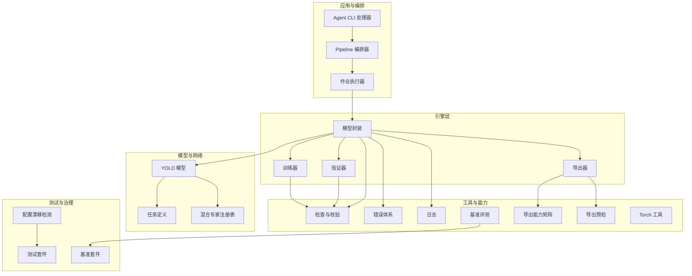
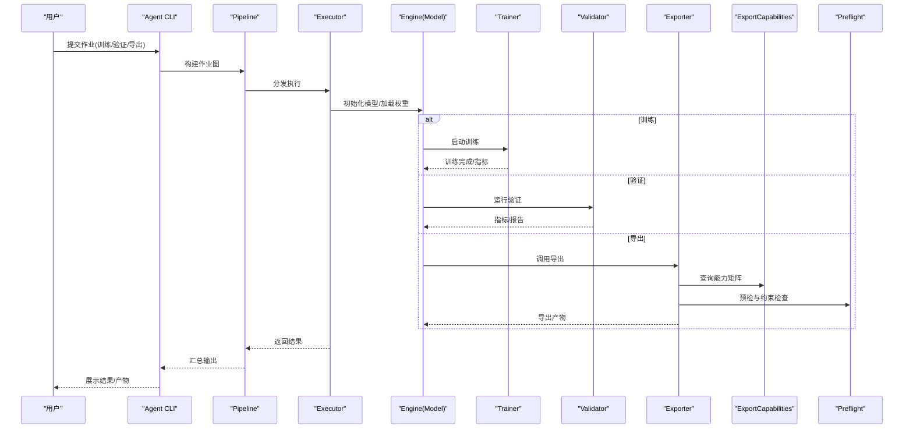
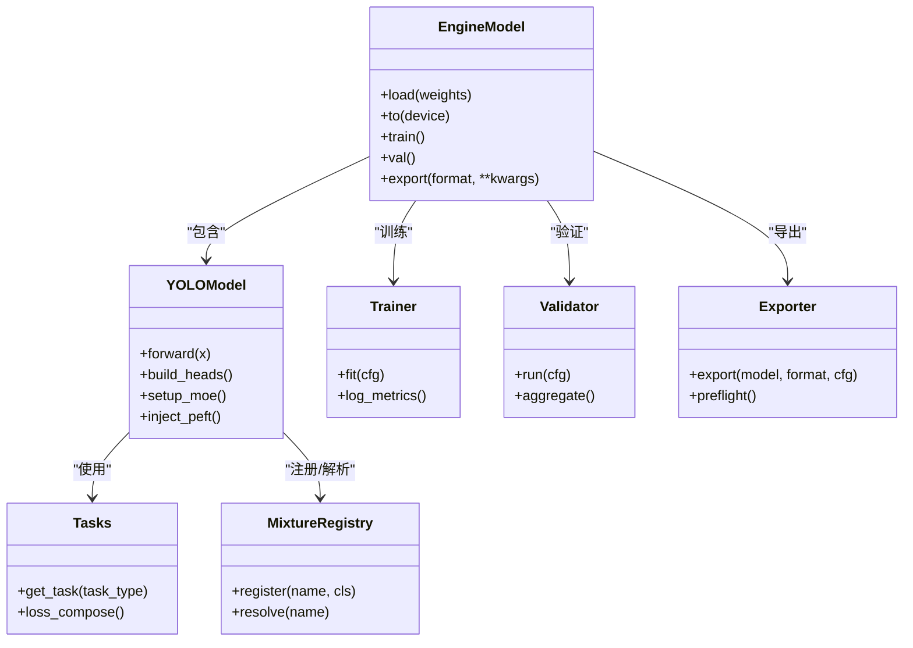
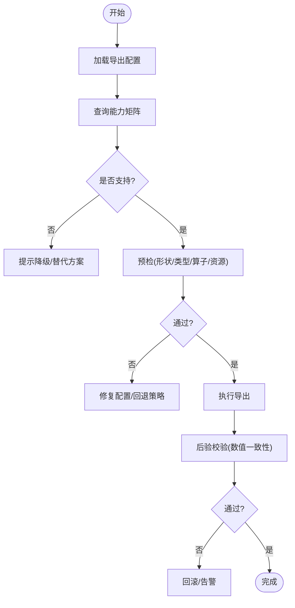
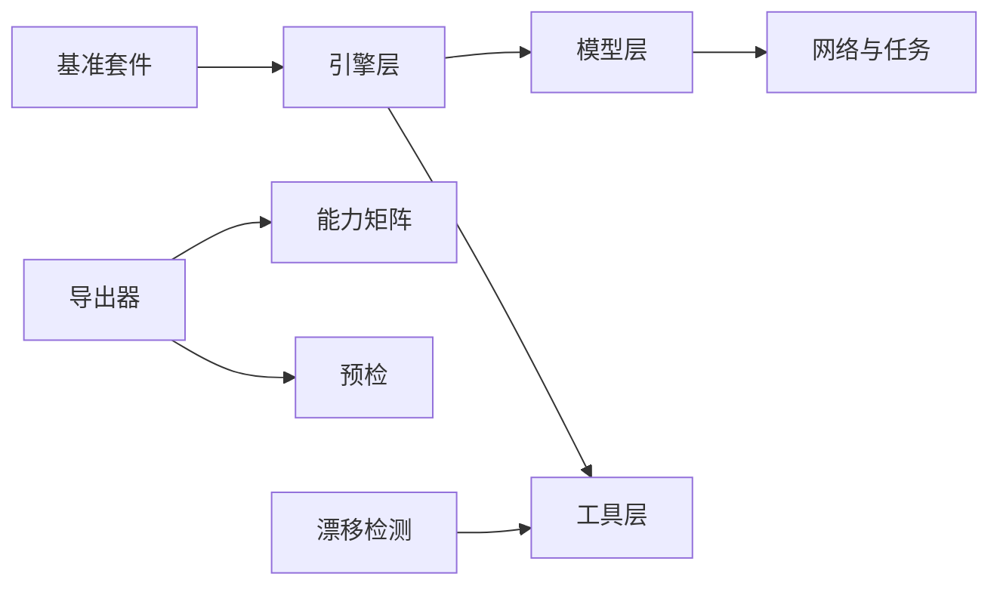

# 功能设计与规划

<cite>
**本文引用的文件**
- [README.md](file://README.md)
- [pyproject.toml](file://pyproject.toml)
- [ultralytics/cfg/default.yaml](file://ultralytics/cfg/default.yaml)
- [ultralytics/cfg/__init__.py](file://ultralytics/cfg/__init__.py)
- [ultralytics/engine/model.py](file://ultralytics/engine/model.py)
- [ultralytics/engine/trainer.py](file://ultralytics/engine/trainer.py)
- [ultralytics/engine/validator.py](file://ultralytics/engine/validator.py)
- [ultralytics/engine/exporter.py](file://ultralytics/engine/exporter.py)
- [ultralytics/utils/checks.py](file://ultralytics/utils/checks.py)
- [ultralytics/utils/errors.py](file://ultralytics/utils/errors.py)
- [ultralytics/utils/logger.py](file://ultralytics/utils/logger.py)
- [ultralytics/utils/benchmarks.py](file://ultralytics/utils/benchmarks.py)
- [ultralytics/utils/export_capabilities.py](file://ultralytics/utils/export_capabilities.py)
- [ultralytics/utils/export_preflight.py](file://ultralytics/utils/export_preflight.py)
- [ultralytics/utils/export_validation.py](file://ultralytics/utils/export_validation.py)
- [ultralytics/utils/torch_utils.py](file://ultralytics/utils/torch_utils.py)
- [ultralytics/models/yolo/model.py](file://ultralytics/models/yolo/model.py)
- [ultralytics/nn/mixture_registry.py](file://ultralytics/nn/mixture_registry.py)
- [ultralytics/nn/tasks.py](file://ultralytics/nn/tasks.py)
- [tests/test_config_drift_detector.py](file://tests/test_config_drift_detector.py)
- [tests/test_export_preflight.py](file://tests/test_export_preflight.py)
- [tests/test_default_config_integrity.py](file://tests/test_default_config_integrity.py)
- [tests/test_master_model_configs.py](file://tests/test_master_model_configs.py)
- [tests/test_mixture_config_resolution.py](file://tests/test_mixture_config_resolution.py)
- [tests/test_mixture_config_registry.py](file://tests/test_mixture_config_registry.py)
- [tests/test_model_adapter_facade.py](file://tests/test_model_adapter_facade.py)
- [tests/test_model_registry.py](file://tests/test_model_registry.py)
- [tests/test_peft_adapters.py](file://tests/test_peft_adapters.py)
- [tests/test_molora.py](file://tests/test_molora.py)
- [tests/test_molora_merge_semantics.py](file://tests/test_molora_merge_semantics.py)
- [tests/test_moe_dynamic_scheduler.py](file://tests/test_moe_dynamic_scheduler.py)
- [tests/test_moe_router_boundaries.py](file://tests/test_moe_router_boundaries.py)
- [tests/test_planner.py](file://tests/test_planner.py)
- [tests/test_planner_integration.py](file://tests/test_planner_integration.py)
- [tests/test_mot_scene_aware_router.py](file://tests/test_mot_scene_aware_router.py)
- [tests/test_routing_interpreter.py](file://tests/test_routing_interpreter.py)
- [tools/config_drift_detector.py](file://tools/config_drift_detector.py)
- [tools/routing_interpreter.py](file://tools/routing_interpreter.py)
- [benchmarks/suite.py](file://benchmarks/suite.py)
- [benchmarks/run.py](file://benchmarks/run.py)
- [benchmarks/suites.yaml](file://benchmarks/suites.yaml)
- [agent/runtime/cli/core_handlers.py](file://agent/runtime/cli/core_handlers.py)
- [agent/runtime/cli/pipeline.py](file://agent/runtime/cli/pipeline.py)
- [agent/runtime/cli/executor.py](file://agent/runtime/cli/executor.py)
- [agent/runtime/cli/job_handlers.py](file://agent/runtime/cli/job_handlers.py)
- [agent/runtime/cli/launcher_handlers.py](file://agent/runtime/cli/launcher_handlers.py)
- [agent/runtime/cli/model_handlers.py](file://agent/runtime/cli/model_handlers.py)
- [agent/runtime/cli/multimodal_handlers.py](file://agent/runtime/cli/multimodal_handlers.py)
- [agent/runtime/cli/lora_tools.py](file://agent/runtime/cli/lora_tools.py)
- [agent/runtime/cli/moe_tools.py](file://agent/runtime/cli/moe_tools.py)
- [agent/runtime/cli/validate.py](file://agent/runtime/cli/validate.py)
- [agent/runtime/cli/system_handlers.py](file://agent/runtime/cli/system_handlers.py)
- [agent/runtime/cli/device.py](file://agent/runtime/cli/device.py)
- [agent/runtime/cli/normalize.py](file://agent/runtime/cli/normalize.py)
- [agent/runtime/cli/progress.py](file://agent/runtime/cli/progress.py)
- [agent/runtime/cli/dispatcher.py](file://agent/runtime/cli/dispatcher.py)
- [agent/runtime/cli/async_jobs.py](file://agent/runtime/cli/async_jobs.py)
- [agent/runtime/cli/peft_compare.py](file://agent/runtime/cli/peft_compare.py)
- [agent/runtime/cli/snapshot.py](file://agent/runtime/cli/snapshot.py)
- [agent/runtime/cli/stability.py](file://agent/runtime/cli/stability.py)
- [agent/runtime/cli/regenerate_open_world_report.py](file://agent/runtime/cli/regenerate_open_world_report.py)
- [agent/runtime/cli/compare_open_world_profiles.py](file://agent/runtime/cli/compare_open_world_profiles.py)
- [agent/runtime/cli/sahi_compare.py](file://agent/runtime/cli/sahi_compare.py)
- [agent/runtime/cli/dataset.py](file://agent/runtime/cli/dataset.py)
- [agent/runtime/cli/contract.py](file://agent/runtime/cli/contract.py)
</cite>

## 目录
1. [引言](#引言)
2. [项目结构](#项目结构)
3. [核心组件](#核心组件)
4. [架构总览](#架构总览)
5. [详细组件分析](#详细组件分析)
6. [依赖关系分析](#依赖关系分析)
7. [性能考量](#性能考量)
8. [故障排查指南](#故障排查指南)
9. [结论](#结论)
10. [附录](#附录)

## 引言
本指南面向YOLO-Master项目的功能设计与规划，聚焦于如何编写高质量的技术设计文档：从需求分析、架构设计到接口定义；从技术方案选择标准（性能评估、兼容性、扩展性）到配置系统的设计模式与验证机制；并给出新功能与现有系统的集成策略（向后兼容与版本管理）、设计评审检查清单与最佳实践，以及风险评估与缓解措施制定方法。文档以仓库现有实现为依据，确保建议可落地、可度量、可演进。

## 项目结构
项目采用分层与模块化组织方式：
- 引擎层：模型加载、训练、验证、导出等核心流程
- 模型与网络：任务建模、混合专家路由、PEFT适配器等
- 工具与能力：基准评测、导出能力矩阵、预检与校验、日志与错误处理
- 测试与治理：回归与特性测试、配置漂移检测、能力矩阵与基线
- Agent运行时：CLI编排、作业调度、设备与系统交互、多模态与LoRA/MoE工具
- 文档与示例：用户手册、参考API、示例脚本与部署方案

图表来源
- [ultralytics/engine/model.py](file://ultralytics/engine/model.py)
- [ultralytics/engine/trainer.py](file://ultralytics/engine/trainer.py)
- [ultralytics/engine/validator.py](file://ultralytics/engine/validator.py)
- [ultralytics/engine/exporter.py](file://ultralytics/engine/exporter.py)
- [ultralytics/models/yolo/model.py](file://ultralytics/models/yolo/model.py)
- [ultralytics/nn/tasks.py](file://ultralytics/nn/tasks.py)
- [ultralytics/nn/mixture_registry.py](file://ultralytics/nn/mixture_registry.py)
- [ultralytics/utils/checks.py](file://ultralytics/utils/checks.py)
- [ultralytics/utils/errors.py](file://ultralytics/utils/errors.py)
- [ultralytics/utils/logger.py](file://ultralytics/utils/logger.py)
- [ultralytics/utils/benchmarks.py](file://ultralytics/utils/benchmarks.py)
- [ultralytics/utils/export_capabilities.py](file://ultralytics/utils/export_capabilities.py)
- [ultralytics/utils/export_preflight.py](file://ultralytics/utils/export_preflight.py)
- [benchmarks/suite.py](file://benchmarks/suite.py)
- [tools/config_drift_detector.py](file://tools/config_drift_detector.py)

章节来源
- [README.md](file://README.md)
- [pyproject.toml](file://pyproject.toml)

## 核心组件
- 模型封装与生命周期：负责模型实例化、权重加载、设备放置、推理/训练/验证/导出入口的统一抽象
- 训练器：数据加载、优化器、损失、回调、分布式训练、EMA、早停等训练流程编排
- 验证器：指标计算、结果聚合、报告生成、跨平台一致性校验
- 导出器：格式转换、能力矩阵匹配、预检与后验校验、目标后端适配
- 任务与网络：任务类型抽象、骨干/颈部/头部组合、MoE路由与专家管理、PEFT适配器注入
- 工具与治理：配置解析与校验、错误分类与上报、日志分级、基准评测、导出能力矩阵、配置漂移检测

章节来源
- [ultralytics/engine/model.py](file://ultralytics/engine/model.py)
- [ultralytics/engine/trainer.py](file://ultralytics/engine/trainer.py)
- [ultralytics/engine/validator.py](file://ultralytics/engine/validator.py)
- [ultralytics/engine/exporter.py](file://ultralytics/engine/exporter.py)
- [ultralytics/models/yolo/model.py](file://ultralytics/models/yolo/model.py)
- [ultralytics/nn/tasks.py](file://ultralytics/nn/tasks.py)
- [ultralytics/nn/mixture_registry.py](file://ultralytics/nn/mixture_registry.py)
- [ultralytics/utils/checks.py](file://ultralytics/utils/checks.py)
- [ultralytics/utils/errors.py](file://ultralytics/utils/errors.py)
- [ultralytics/utils/logger.py](file://ultralytics/utils/logger.py)
- [ultralytics/utils/benchmarks.py](file://ultralytics/utils/benchmarks.py)
- [ultralytics/utils/export_capabilities.py](file://ultralytics/utils/export_capabilities.py)
- [ultralytics/utils/export_preflight.py](file://ultralytics/utils/export_preflight.py)

## 架构总览
整体架构遵循“编排-引擎-模型-工具”的分层解耦原则：
- 编排层（Agent CLI/Pipeline/Executor）将用户意图转化为可执行的作业流，协调设备、数据集、模型与训练/验证/导出任务
- 引擎层提供稳定的API边界，屏蔽底层差异，统一生命周期管理
- 模型层通过任务抽象与注册表机制支持可扩展的模型变体（含MoE、PEFT、Mixture等）
- 工具层提供配置、校验、日志、基准、导出能力矩阵与预检等横切能力

图表来源
- [agent/runtime/cli/core_handlers.py](file://agent/runtime/cli/core_handlers.py)
- [agent/runtime/cli/pipeline.py](file://agent/runtime/cli/pipeline.py)
- [agent/runtime/cli/executor.py](file://agent/runtime/cli/executor.py)
- [ultralytics/engine/model.py](file://ultralytics/engine/model.py)
- [ultralytics/engine/trainer.py](file://ultralytics/engine/trainer.py)
- [ultralytics/engine/validator.py](file://ultralytics/engine/validator.py)
- [ultralytics/engine/exporter.py](file://ultralytics/engine/exporter.py)
- [ultralytics/utils/export_capabilities.py](file://ultralytics/utils/export_capabilities.py)
- [ultralytics/utils/export_preflight.py](file://ultralytics/utils/export_preflight.py)

## 详细组件分析

### 配置系统与YAML设计模式
- 配置文件位置与默认值：默认配置位于配置包中，作为各模块的基线参数集
- 解析与合并：支持从YAML加载、命令行覆盖、环境变量注入，形成最终配置对象
- 校验机制：基于schema与自定义校验器进行字段类型、取值范围、互斥/依赖关系检查
- 漂移检测：对比当前配置与基线/历史版本，识别潜在不兼容变更
- 最佳实践：
  - 显式声明必填项与可选项，提供默认值与注释
  - 使用命名空间隔离不同子系统配置
  - 对关键路径（如导出目标、设备、精度）增加强校验与告警
  - 为每个重大变更维护迁移说明与兼容性矩阵

章节来源
- [ultralytics/cfg/default.yaml](file://ultralytics/cfg/default.yaml)
- [ultralytics/cfg/__init__.py](file://ultralytics/cfg/__init__.py)
- [tests/test_default_config_integrity.py](file://tests/test_default_config_integrity.py)
- [tests/test_config_drift_detector.py](file://tests/test_config_drift_detector.py)
- [tools/config_drift_detector.py](file://tools/config_drift_detector.py)

### 模型与任务抽象
- 模型封装：统一加载、设备放置、前向接口、状态保存/恢复
- 任务定义：按任务类型（检测、分割、姿态等）组织头/尾与损失函数
- 注册表机制：通过注册表动态发现与实例化模型变体，支持插件式扩展
- MoE与路由：在模型层引入路由与专家管理，支持动态调度与稀疏激活
- PEFT适配器：在训练/推理阶段按需注入轻量级适配器，支持LoRA等策略

图表来源
- [ultralytics/engine/model.py](file://ultralytics/engine/model.py)
- [ultralytics/models/yolo/model.py](file://ultralytics/models/yolo/model.py)
- [ultralytics/nn/tasks.py](file://ultralytics/nn/tasks.py)
- [ultralytics/nn/mixture_registry.py](file://ultralytics/nn/mixture_registry.py)
- [ultralytics/engine/trainer.py](file://ultralytics/engine/trainer.py)
- [ultralytics/engine/validator.py](file://ultralytics/engine/validator.py)
- [ultralytics/engine/exporter.py](file://ultralytics/engine/exporter.py)

章节来源
- [ultralytics/engine/model.py](file://ultralytics/engine/model.py)
- [ultralytics/models/yolo/model.py](file://ultralytics/models/yolo/model.py)
- [ultralytics/nn/tasks.py](file://ultralytics/nn/tasks.py)
- [ultralytics/nn/mixture_registry.py](file://ultralytics/nn/mixture_registry.py)
- [tests/test_model_registry.py](file://tests/test_model_registry.py)
- [tests/test_master_model_configs.py](file://tests/test_master_model_configs.py)
- [tests/test_model_adapter_facade.py](file://tests/test_model_adapter_facade.py)

### 导出能力与预检
- 能力矩阵：描述各后端/格式的支持情况与限制，用于自动决策与提示
- 预检流程：在导出前检查输入形状、数据类型、算子支持、内存与磁盘约束
- 后验校验：导出产物与原始模型的数值一致性校验，保障无损或可控误差
- 最佳实践：
  - 将能力矩阵与预检规则纳入CI，防止退化
  - 针对边缘设备设置严格约束与降级策略
  - 记录导出元数据（版本、环境、随机种子）便于复现

图表来源
- [ultralytics/utils/export_capabilities.py](file://ultralytics/utils/export_capabilities.py)
- [ultralytics/utils/export_preflight.py](file://ultralytics/utils/export_preflight.py)
- [ultralytics/utils/export_validation.py](file://ultralytics/utils/export_validation.py)
- [tests/test_export_preflight.py](file://tests/test_export_preflight.py)

章节来源
- [ultralytics/utils/export_capabilities.py](file://ultralytics/utils/export_capabilities.py)
- [ultralytics/utils/export_preflight.py](file://ultralytics/utils/export_preflight.py)
- [ultralytics/utils/export_validation.py](file://ultralytics/utils/export_validation.py)
- [tests/test_export_preflight.py](file://tests/test_export_preflight.py)

### 基准评测与性能评估
- 基准套件：定义场景、数据集、指标、硬件要求与阈值
- 运行器：批量执行、并行控制、结果聚合与可视化
- 性能门控：在CI中设定门槛，阻止性能退化
- 最佳实践：
  - 固定随机种子与环境，保证可复现
  - 区分端到端延迟与吞吐，分别评估
  - 针对关键路径（I/O、编译、缓存）做专项基准

章节来源
- [benchmarks/suite.py](file://benchmarks/suite.py)
- [benchmarks/run.py](file://benchmarks/run.py)
- [benchmarks/suites.yaml](file://benchmarks/suites.yaml)
- [ultralytics/utils/benchmarks.py](file://ultralytics/utils/benchmarks.py)

### 配置漂移检测与版本管理
- 漂移检测：对比当前配置与基线/历史版本，识别新增/删除/变更字段
- 影响面分析：关联变更字段与下游能力（导出、训练、推理）
- 版本管理：语义化版本、兼容性矩阵、迁移脚本与弃用策略
- 最佳实践：
  - 所有公开配置变更需附带迁移说明
  - 对破坏性变更提供过渡期与自动迁移工具
  - 在PR中强制运行漂移检测与回归测试

章节来源
- [tools/config_drift_detector.py](file://tools/config_drift_detector.py)
- [tests/test_config_drift_detector.py](file://tests/test_config_drift_detector.py)
- [tests/test_default_config_integrity.py](file://tests/test_default_config_integrity.py)

### 路由解释器与诊断
- 路由解释器：解析MoE路由行为、专家利用率、负载分布
- 诊断工具：定位热点专家、负载均衡问题、异常激活
- 最佳实践：
  - 在训练与推理阶段持续采集路由指标
  - 结合业务场景调整路由策略与专家容量
  - 将诊断结果纳入发布前的质量门禁

章节来源
- [tools/routing_interpreter.py](file://tools/routing_interpreter.py)
- [tests/test_routing_interpreter.py](file://tests/test_routing_interpreter.py)

### PEFT与Mixture（MoE/MoA）集成
- PEFT适配器：在保持主干冻结的前提下注入低秩更新，支持多种策略与扫描
- Mixture注册表：统一管理混合专家/注意力变体，支持动态选择与切换
- 合并语义：明确权重合并顺序、稀疏性与精度影响
- 最佳实践：
  - 为每种PEFT策略提供最小可复现实例与基准
  - 对MoE路由边界与动态调度进行充分测试
  - 在导出时考虑稀疏结构与后端支持

章节来源
- [tests/test_peft_adapters.py](file://tests/test_peft_adapters.py)
- [tests/test_molora.py](file://tests/test_molora.py)
- [tests/test_molora_merge_semantics.py](file://tests/test_molora_merge_semantics.py)
- [tests/test_moe_dynamic_scheduler.py](file://tests/test_moe_dynamic_scheduler.py)
- [tests/test_moe_router_boundaries.py](file://tests/test_moe_router_boundaries.py)
- [tests/test_mixture_config_resolution.py](file://tests/test_mixture_config_resolution.py)
- [tests/test_mixture_config_registry.py](file://tests/test_mixture_config_registry.py)

### 多目标跟踪（MoT）场景感知路由
- 场景感知路由：根据场景特征动态调整跟踪策略与路由
- 评估与对比：在不同数据集上验证稳定性与精度
- 最佳实践：
  - 建立场景分类与路由映射表
  - 对长尾场景进行专项优化与监控

章节来源
- [tests/test_mot_scene_aware_router.py](file://tests/test_mot_scene_aware_router.py)

### Planner（计划器）与集成
- Planner：在训练/导出/部署链路中自动生成最优计划（如算子融合、量化、稀疏化）
- 集成点：与模型、导出器、基准套件紧密协作
- 最佳实践：
  - 为每个计划提供可解释性与可回退策略
  - 在CI中验证计划正确性与性能收益

章节来源
- [tests/test_planner.py](file://tests/test_planner.py)
- [tests/test_planner_integration.py](file://tests/test_planner_integration.py)

### Agent运行时与作业编排
- CLI处理器：解析命令、参数归一化、权限与设备选择
- Pipeline：构建作业图、依赖解析、失败重试与断点续跑
- Executor：并发控制、资源隔离、进度与日志上报
- 领域工具：LoRA、MoE、多模态、系统信息、快照、稳定性检查等
- 最佳实践：
  - 作业契约化：输入输出规范、错误码与重试策略
  - 幂等与可观测性：每次运行产出可审计的工件与日志

章节来源
- [agent/runtime/cli/core_handlers.py](file://agent/runtime/cli/core_handlers.py)
- [agent/runtime/cli/pipeline.py](file://agent/runtime/cli/pipeline.py)
- [agent/runtime/cli/executor.py](file://agent/runtime/cli/executor.py)
- [agent/runtime/cli/job_handlers.py](file://agent/runtime/cli/job_handlers.py)
- [agent/runtime/cli/launcher_handlers.py](file://agent/runtime/cli/launcher_handlers.py)
- [agent/runtime/cli/model_handlers.py](file://agent/runtime/cli/model_handlers.py)
- [agent/runtime/cli/multimodal_handlers.py](file://agent/runtime/cli/multimodal_handlers.py)
- [agent/runtime/cli/lora_tools.py](file://agent/runtime/cli/lora_tools.py)
- [agent/runtime/cli/moe_tools.py](file://agent/runtime/cli/moe_tools.py)
- [agent/runtime/cli/validate.py](file://agent/runtime/cli/validate.py)
- [agent/runtime/cli/system_handlers.py](file://agent/runtime/cli/system_handlers.py)
- [agent/runtime/cli/device.py](file://agent/runtime/cli/device.py)
- [agent/runtime/cli/normalize.py](file://agent/runtime/cli/normalize.py)
- [agent/runtime/cli/progress.py](file://agent/runtime/cli/progress.py)
- [agent/runtime/cli/dispatcher.py](file://agent/runtime/cli/dispatcher.py)
- [agent/runtime/cli/async_jobs.py](file://agent/runtime/cli/async_jobs.py)
- [agent/runtime/cli/peft_compare.py](file://agent/runtime/cli/peft_compare.py)
- [agent/runtime/cli/snapshot.py](file://agent/runtime/cli/snapshot.py)
- [agent/runtime/cli/stability.py](file://agent/runtime/cli/stability.py)
- [agent/runtime/cli/regenerate_open_world_report.py](file://agent/runtime/cli/regenerate_open_world_report.py)
- [agent/runtime/cli/compare_open_world_profiles.py](file://agent/runtime/cli/compare_open_world_profiles.py)
- [agent/runtime/cli/sahi_compare.py](file://agent/runtime/cli/sahi_compare.py)
- [agent/runtime/cli/dataset.py](file://agent/runtime/cli/dataset.py)
- [agent/runtime/cli/contract.py](file://agent/runtime/cli/contract.py)

## 依赖关系分析
- 内聚与耦合：
  - 引擎层对模型层松耦合，通过任务与注册表扩展
  - 导出器依赖能力矩阵与预检，避免硬编码后端逻辑
  - 工具层被各层复用，提升一致性与可维护性
- 外部依赖：
  - PyTorch生态、第三方导出后端、基准与可视化工具
- 循环依赖：
  - 通过注册表与接口抽象避免直接循环引用
- 接口契约：
  - 明确的输入输出类型、错误码与日志约定

图表来源
- [ultralytics/engine/model.py](file://ultralytics/engine/model.py)
- [ultralytics/engine/exporter.py](file://ultralytics/engine/exporter.py)
- [ultralytics/utils/export_capabilities.py](file://ultralytics/utils/export_capabilities.py)
- [ultralytics/utils/export_preflight.py](file://ultralytics/utils/export_preflight.py)
- [benchmarks/suite.py](file://benchmarks/suite.py)
- [tools/config_drift_detector.py](file://tools/config_drift_detector.py)

章节来源
- [ultralytics/engine/model.py](file://ultralytics/engine/model.py)
- [ultralytics/engine/exporter.py](file://ultralytics/engine/exporter.py)
- [ultralytics/utils/export_capabilities.py](file://ultralytics/utils/export_capabilities.py)
- [ultralytics/utils/export_preflight.py](file://ultralytics/utils/export_preflight.py)
- [benchmarks/suite.py](file://benchmarks/suite.py)
- [tools/config_drift_detector.py](file://tools/config_drift_detector.py)

## 性能考量
- 评估维度：端到端延迟、吞吐、内存占用、I/O瓶颈、编译与缓存命中
- 实验设计：固定数据规模与批次、多轮取均值、置信区间
- 优化策略：算子融合、量化、稀疏化、批大小自适应、异步I/O
- 门控与回归：在CI中设定阈值，超阈阻断合并并触发复盘

[本节为通用指导，无需特定文件来源]

## 故障排查指南
- 错误分类与上报：
  - 配置错误：字段缺失/类型不符/互斥冲突
  - 运行时错误：设备不可用、内存不足、算子不支持
  - 导出错误：能力矩阵不匹配、预检失败、后验不一致
- 日志与诊断：
  - 分级日志、结构化事件、关键路径埋点
  - 路由解释器与基准报告辅助定位
- 常见症状与对策：
  - 导出失败：检查能力矩阵与预检日志，回退至兼容配置
  - 训练不稳定：检查学习率、梯度裁剪、AMP与混合精度
  - 路由失衡：查看专家利用率与负载分布，调整路由策略

章节来源
- [ultralytics/utils/errors.py](file://ultralytics/utils/errors.py)
- [ultralytics/utils/logger.py](file://ultralytics/utils/logger.py)
- [tools/routing_interpreter.py](file://tools/routing_interpreter.py)
- [tests/test_routing_interpreter.py](file://tests/test_routing_interpreter.py)

## 结论
本指南基于仓库现有实现，给出了YOLO-Master的功能设计与规划要点：分层架构、配置与校验、导出能力与预检、基准评测、配置漂移检测、路由与PEFT集成、Agent编排与作业契约。建议在后续迭代中持续完善能力矩阵与预检规则、强化回归与性能门控、沉淀迁移与兼容性文档，并通过设计评审与风险评估保障质量与演进效率。

## 附录

### 技术设计文档编写模板（面向团队）
- 背景与目标：问题陈述、业务价值、成功标准
- 需求分析：功能与非功能需求、约束与假设
- 架构设计：分层与模块划分、关键流程图与时序图
- 接口定义：输入输出、错误码、日志与可观测性
- 技术方案选择：备选方案对比、评估指标与取舍理由
- 配置与版本：配置结构、校验规则、迁移与兼容性
- 集成策略：向后兼容、灰度发布、回滚预案
- 风险与缓解：风险清单、概率与影响、缓解措施与责任人
- 测试与验收：用例设计、基准与门控、验收标准
- 运维与排障：监控指标、告警策略、排障手册

### 设计评审检查清单
- 需求对齐：是否满足业务目标与约束？
- 架构合理：分层清晰、职责单一、扩展点明确？
- 接口稳定：契约完整、错误处理完备、可观测性强？
- 配置安全：校验充分、默认值合理、漂移可检测？
- 性能达标：基准通过、门控通过、回归可控？
- 兼容与迁移：向后兼容、迁移脚本可用、文档齐全？
- 风险可控：风险已识别、缓解措施有效、应急预案就绪？
- 可维护性：代码可读、测试覆盖、文档同步？

### 风险评估与缓解措施制定方法
- 风险识别：技术、依赖、合规、交付、运维
- 评估维度：发生概率、影响程度、可检测性
- 缓解策略：规避、转移、减轻、接受
- 监控与预警：指标阈值、告警规则、演练与复盘
- 责任与周期：责任人、里程碑、复查频率