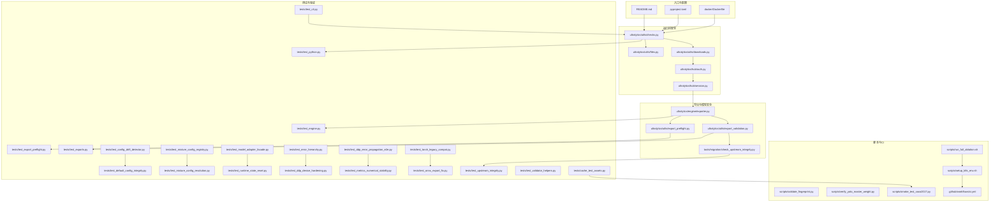
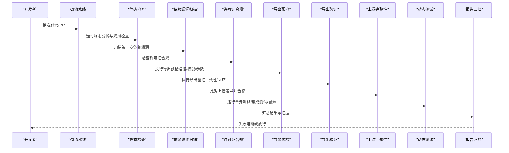
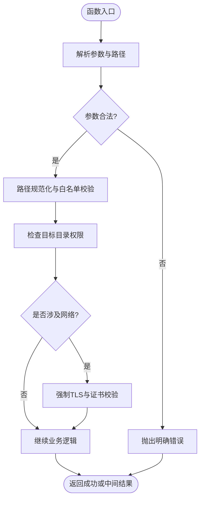
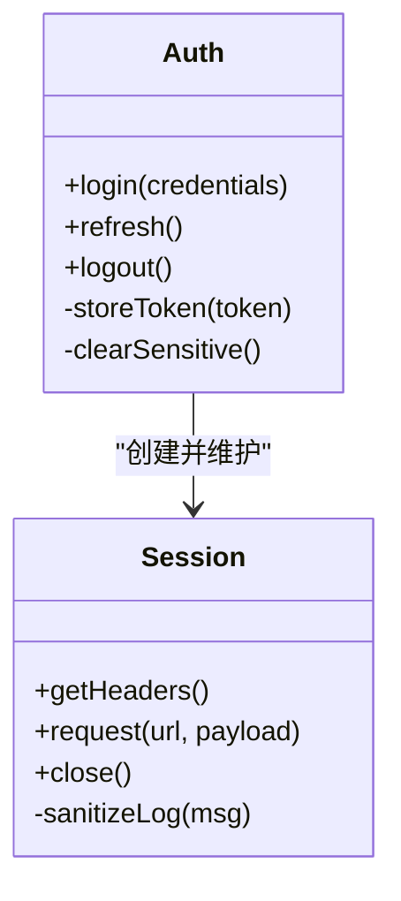
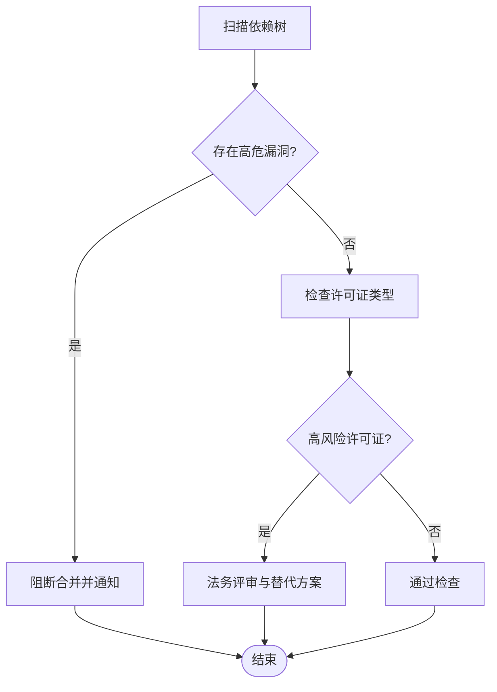
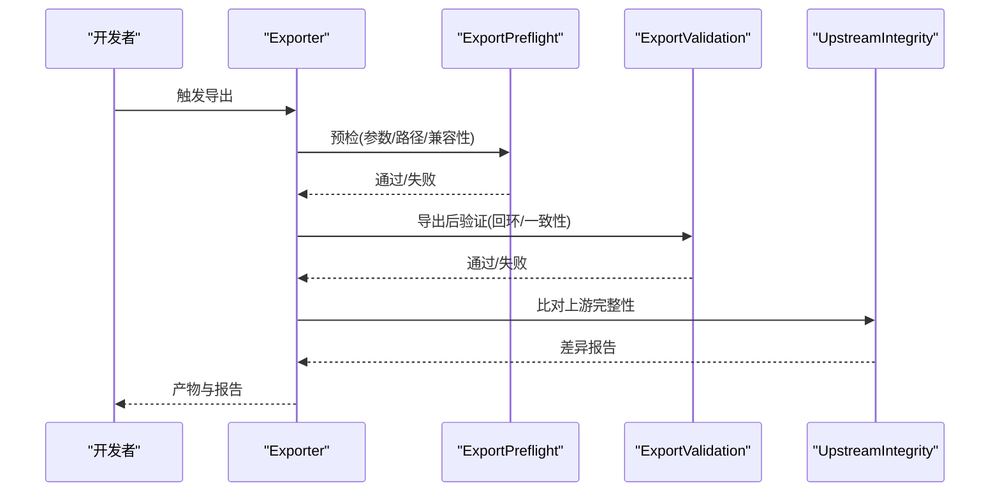
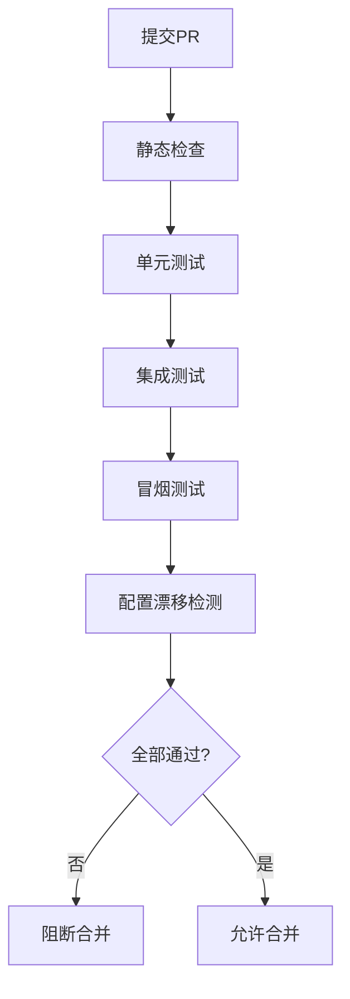
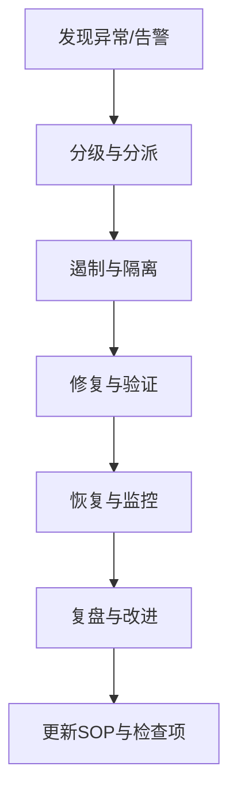
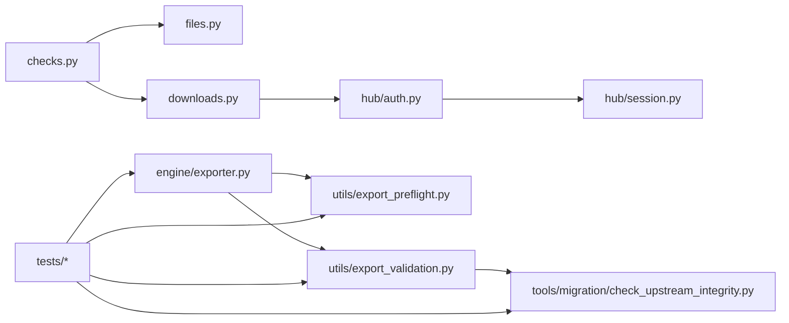

# 安全与合规检查

<cite>
**本文引用的文件**
- [README.md](file://README.md)
- [CONTRIBUTING.md](file://CONTRIBUTING.md)
- [pyproject.toml](file://pyproject.toml)
- [docker/Dockerfile](file://docker/Dockerfile)
- [.github/workflows/ci.yml](file://.github/workflows/ci.yml)
- [ultralytics/utils/checks.py](file://ultralytics/utils/checks.py)
- [ultralytics/utils/files.py](file://ultralytics/utils/files.py)
- [ultralytics/utils/downloads.py](file://ultralytics/utils/downloads.py)
- [ultralytics/hub/auth.py](file://ultralytics/hub/auth.py)
- [ultralytics/hub/session.py](file://ultralytics/hub/session.py)
- [ultralytics/engine/exporter.py](file://ultralytics/engine/exporter.py)
- [ultralytics/utils/export_preflight.py](file://ultralytics/utils/export_preflight.py)
- [ultralytics/utils/export_validation.py](file://ultralytics/utils/export_validation.py)
- [tools/migration/check_upstream_integrity.py](file://tools/migration/check_upstream_integrity.py)
- [tests/test_export_preflight.py](file://tests/test_export_preflight.py)
- [tests/test_exports.py](file://tests/test_exports.py)
- [tests/test_engine.py](file://tests/test_engine.py)
- [tests/test_python.py](file://tests/test_python.py)
- [tests/test_cli.py](file://tests/test_cli.py)
- [tests/test_config_drift_detector.py](file://tests/test_config_drift_detector.py)
- [tests/test_default_config_integrity.py](file://tests/test_default_config_integrity.py)
- [tests/test_mixture_config_registry.py](file://tests/test_mixture_config_registry.py)
- [tests/test_mixture_config_resolution.py](file://tests/test_mixture_config_resolution.py)
- [tests/test_model_adapter_facade.py](file://tests/test_model_adapter_facade.py)
- [tests/test_runtime_state_reset.py](file://tests/test_runtime_state_reset.py)
- [tests/test_error_hierarchy.py](file://tests/test_error_hierarchy.py)
- [tests/test_ddp_device_hardening.py](file://tests/test_ddp_device_hardening.py)
- [tests/test_ddp_error_propagation_e2e.py](file://tests/test_ddp_error_propagation_e2e.py)
- [tests/test_metrics_numerical_stability.py](file://tests/test_metrics_numerical_stability.py)
- [tests/test_torch_legacy_compat.py](file://tests/test_torch_legacy_compat.py)
- [tests/test_onnx_export_fix.py](file://tests/test_onnx_export_fix.py)
- [tests/test_upstream_integrity.py](file://tests/test_upstream_integrity.py)
- [tests/test_validator_helpers.py](file://tests/test_validator_helpers.py)
- [tests/cache_test_assets.py](file://tests/cache_test_assets.py)
- [scripts/validate_fingerprint.py](file://scripts/validate_fingerprint.py)
- [scripts/verify_yolo_master_weight.py](file://scripts/verify_yolo_master_weight.py)
- [scripts/smoke_test_coco2017.py](file://scripts/smoke_test_coco2017.py)
- [scripts/run_full_ablation.sh](file://scripts/run_full_ablation.sh)
- [scripts/setup_k8s_env.sh](file://scripts/setup_k8s_env.sh)
- [docs/help/security.md](file://docs/help/security.md)
- [docs/help/privacy.md](file://docs/help/privacy.md)
</cite>

## 目录
1. [简介](#简介)
2. [项目结构](#项目结构)
3. [核心组件](#核心组件)
4. [架构总览](#架构总览)
5. [详细组件分析](#详细组件分析)
6. [依赖关系分析](#依赖关系分析)
7. [性能考虑](#性能考虑)
8. [故障排查指南](#故障排查指南)
9. [结论](#结论)
10. [附录](#附录)

## 简介
本指南面向YOLO-Master新特性的安全与合规检查，覆盖代码安全审查标准、第三方依赖评估、数据安全保护、模型安全、自动化合规流程与安全事件响应。文档以仓库现有实现为依据，结合测试与工具链，给出可落地的检查清单与流程图示，帮助开发者在新增特性时同步完成安全与合规验证。

## 项目结构
从安全视角看，本项目将输入校验、下载与导出预检、认证与会话管理、上游完整性校验等能力分散在utils、hub、engine、tools与tests中，并通过CI脚本与示例脚本串联为端到端流水线。下图展示与安全相关的关键模块与交互关系。

图示来源
- [README.md](file://README.md)
- [pyproject.toml](file://pyproject.toml)
- [docker/Dockerfile](file://docker/Dockerfile)
- [ultralytics/utils/checks.py](file://ultralytics/utils/checks.py)
- [ultralytics/utils/files.py](file://ultralytics/utils/files.py)
- [ultralytics/utils/downloads.py](file://ultralytics/utils/downloads.py)
- [ultralytics/hub/auth.py](file://ultralytics/hub/auth.py)
- [ultralytics/hub/session.py](file://ultralytics/hub/session.py)
- [ultralytics/engine/exporter.py](file://ultralytics/engine/exporter.py)
- [ultralytics/utils/export_preflight.py](file://ultralytics/utils/export_preflight.py)
- [ultralytics/utils/export_validation.py](file://ultralytics/utils/export_validation.py)
- [tools/migration/check_upstream_integrity.py](file://tools/migration/check_upstream_integrity.py)
- [tests/test_export_preflight.py](file://tests/test_export_preflight.py)
- [tests/test_exports.py](file://tests/test_exports.py)
- [tests/test_engine.py](file://tests/test_engine.py)
- [tests/test_python.py](file://tests/test_python.py)
- [tests/test_cli.py](file://tests/test_cli.py)
- [tests/test_config_drift_detector.py](file://tests/test_config_drift_detector.py)
- [tests/test_default_config_integrity.py](file://tests/test_default_config_integrity.py)
- [tests/test_mixture_configregistry.py](file://tests/test_mixture_config_registry.py)
- [tests/test_mixture_config_resolution.py](file://tests/test_mixture_config_resolution.py)
- [tests/test_model_adapter_facade.py](file://tests/test_model_adapter_facade.py)
- [tests/test_runtime_state_reset.py](file://tests/test_runtime_state_reset.py)
- [tests/test_error_hierarchy.py](file://tests/test_error_hierarchy.py)
- [tests/test_ddp_device_hardening.py](file://tests/test_ddp_device_hardening.py)
- [tests/test_ddp_error_propagation_e2e.py](file://tests/test_ddp_error_propagation_e2e.py)
- [tests/test_metrics_numerical_stability.py](file://tests/test_metrics_numerical_stability.py)
- [tests/test_torch_legacy_compat.py](file://tests/test_torch_legacy_compat.py)
- [tests/test_onnx_export_fix.py](file://tests/test_onnx_export_fix.py)
- [tests/test_upstream_integrity.py](file://tests/test_upstream_integrity.py)
- [tests/test_validator_helpers.py](file://tests/test_validator_helpers.py)
- [tests/cache_test_assets.py](file://tests/cache_test_assets.py)
- [scripts/validate_fingerprint.py](file://scripts/validate_fingerprint.py)
- [scripts/verify_yolo_master_weight.py](file://scripts/verify_yolo_master_weight.py)
- [scripts/smoke_test_coco2017.py](file://scripts/smoke_test_coco2017.py)
- [scripts/run_full_ablation.sh](file://scripts/run_full_ablation.sh)
- [scripts/setup_k8s_env.sh](file://scripts/setup_k8s_env.sh)
- [.github/workflows/ci.yml](file://.github/workflows/ci.yml)

章节来源
- [README.md](file://README.md)
- [pyproject.toml](file://pyproject.toml)
- [docker/Dockerfile](file://docker/Dockerfile)

## 核心组件
- 输入与环境校验：集中式检查逻辑用于参数、路径、设备与版本一致性校验，是后续所有功能的安全前置条件。
- 文件与下载安全：对本地路径与远程资源进行合法性与完整性校验，避免任意路径访问与不可信下载。
- 认证与会话：统一处理平台鉴权与会话生命周期，确保敏感凭据最小暴露面。
- 导出与模型安全：导出前预检与导出后验证，保障模型产物一致性与可追溯性。
- 上游完整性：对比上游变更，防止供应链污染与漂移。
- 测试与回归：围绕上述能力的单测与集成用例，形成自动化安全门禁。

章节来源
- [ultralytics/utils/checks.py](file://ultralytics/utils/checks.py)
- [ultralytics/utils/files.py](file://ultralytics/utils/files.py)
- [ultralytics/utils/downloads.py](file://ultralytics/utils/downloads.py)
- [ultralytics/hub/auth.py](file://ultralytics/hub/auth.py)
- [ultralytics/hub/session.py](file://ultralytics/hub/session.py)
- [ultralytics/engine/exporter.py](file://ultralytics/engine/exporter.py)
- [ultralytics/utils/export_preflight.py](file://ultralytics/utils/export_preflight.py)
- [ultralytics/utils/export_validation.py](file://ultralytics/utils/export_validation.py)
- [tools/migration/check_upstream_integrity.py](file://tools/migration/check_upstream_integrity.py)

## 架构总览
下图展示了“新特性提交”到“发布前”的端到端安全与合规流水线，涵盖静态检查、依赖扫描、许可证合规、导出预检、模型完整性校验与动态测试。

图示来源
- [.github/workflows/ci.yml](file://.github/workflows/ci.yml)
- [ultralytics/utils/export_preflight.py](file://ultralytics/utils/export_preflight.py)
- [ultralytics/utils/export_validation.py](file://ultralytics/utils/export_validation.py)
- [tools/migration/check_upstream_integrity.py](file://tools/migration/check_upstream_integrity.py)
- [tests/test_export_preflight.py](file://tests/test_export_preflight.py)
- [tests/test_exports.py](file://tests/test_exports.py)
- [tests/test_upstream_integrity.py](file://tests/test_upstream_integrity.py)
- [tests/test_engine.py](file://tests/test_engine.py)
- [tests/test_python.py](file://tests/test_python.py)
- [tests/test_cli.py](file://tests/test_cli.py)

## 详细组件分析

### 输入验证与权限控制
- 输入验证要点
  - 参数类型与取值范围校验，拒绝非法值与越界索引。
  - 路径规范化与白名单校验，禁止相对路径逃逸与符号链接滥用。
  - 设备与后端一致性检查，避免不兼容组合导致未定义行为。
- 权限控制要点
  - 仅授予必要文件系统读写权限，限制写入目录。
  - 网络请求使用受控代理与证书校验，禁用不安全协议。
  - 凭据通过会话层注入，不在日志与错误信息中泄露。

图示来源
- [ultralytics/utils/checks.py](file://ultralytics/utils/checks.py)
- [ultralytics/utils/files.py](file://ultralytics/utils/files.py)
- [ultralytics/utils/downloads.py](file://ultralytics/utils/downloads.py)

章节来源
- [ultralytics/utils/checks.py](file://ultralytics/utils/checks.py)
- [ultralytics/utils/files.py](file://ultralytics/utils/files.py)
- [ultralytics/utils/downloads.py](file://ultralytics/utils/downloads.py)

### 敏感信息保护与认证会话
- 认证与会话
  - 统一鉴权入口，避免散落的密钥硬编码。
  - 会话令牌最小化缓存与自动过期清理。
  - 错误消息脱敏，禁止打印完整URL或Token片段。
- 数据加密与隐私
  - 传输层强制HTTPS；存储层按需启用加密。
  - 日志与指标采集默认关闭用户标识与PII字段。

图示来源
- [ultralytics/hub/auth.py](file://ultralytics/hub/auth.py)
- [ultralytics/hub/session.py](file://ultralytics/hub/session.py)

章节来源
- [ultralytics/hub/auth.py](file://ultralytics/hub/auth.py)
- [ultralytics/hub/session.py](file://ultralytics/hub/session.py)

### 第三方依赖安全评估
- 漏洞扫描
  - 在CI中引入依赖漏洞扫描，阻断高危漏洞合并。
  - 锁定依赖版本，定期更新并回归验证。
- 许可证合规
  - 生成依赖清单与许可证矩阵，识别强Copyleft风险。
  - 对不合规包建立豁免流程与替代方案。

章节来源
- [pyproject.toml](file://pyproject.toml)
- [.github/workflows/ci.yml](file://.github/workflows/ci.yml)

### 数据安全保护措施
- 数据加密
  - 传输：强制HTTPS与证书校验，禁用明文协议。
  - 存储：模型权重与数据集按策略加密，密钥由外部KMS管理。
- 访问控制
  - 基于角色的最小权限原则，区分训练、推理与导出角色。
  - 临时凭证与短期令牌，减少长期凭据暴露面。
- 隐私保护
  - 日志脱敏与采样上报，默认关闭敏感字段。
  - 数据去标识化处理，支持可选匿名化管道。

章节来源
- [ultralytics/utils/downloads.py](file://ultralytics/utils/downloads.py)
- [ultralytics/hub/session.py](file://ultralytics/hub/session.py)

### 模型安全考虑
- 对抗攻击防护
  - 导出前后增加鲁棒性检查点，记录扰动边界与阈值。
  - 推理阶段加入输入裁剪与异常检测，降低恶意样本影响。
- 模型完整性验证
  - 导出预检：校验输入图、算子支持与输出形状约束。
  - 导出验证：回环推理对比，误差阈值判定。
  - 指纹校验：对关键权重与配置文件计算指纹，防止篡改。

图示来源
- [ultralytics/engine/exporter.py](file://ultralytics/engine/exporter.py)
- [ultralytics/utils/export_preflight.py](file://ultralytics/utils/export_preflight.py)
- [ultralytics/utils/export_validation.py](file://ultralytics/utils/export_validation.py)
- [tools/migration/check_upstream_integrity.py](file://tools/migration/check_upstream_integrity.py)

章节来源
- [ultralytics/engine/exporter.py](file://ultralytics/engine/exporter.py)
- [ultralytics/utils/export_preflight.py](file://ultralytics/utils/export_preflight.py)
- [ultralytics/utils/export_validation.py](file://ultralytics/utils/export_validation.py)
- [tools/migration/check_upstream_integrity.py](file://tools/migration/check_upstream_integrity.py)

### 合规性检查的自动化流程
- 静态代码分析
  - 在CI中集成静态检查与规则集，拦截常见安全问题。
- 动态安全测试
  - 单元与集成测试覆盖导出、下载、认证与错误传播路径。
  - 冒烟测试验证关键路径可用性。
- 配置漂移检测
  - 默认配置完整性与注册表一致性检查，防止漂移引入风险。

图示来源
- [.github/workflows/ci.yml](file://.github/workflows/ci.yml)
- [tests/test_export_preflight.py](file://tests/test_export_preflight.py)
- [tests/test_exports.py](file://tests/test_exports.py)
- [tests/test_engine.py](file://tests/test_engine.py)
- [tests/test_python.py](file://tests/test_python.py)
- [tests/test_cli.py](file://tests/test_cli.py)
- [tests/test_config_drift_detector.py](file://tests/test_config_drift_detector.py)
- [tests/test_default_config_integrity.py](file://tests/test_default_config_integrity.py)
- [tests/test_mixture_config_registry.py](file://tests/test_mixture_config_registry.py)
- [tests/test_mixture_config_resolution.py](file://tests/test_mixture_config_resolution.py)

章节来源
- [.github/workflows/ci.yml](file://.github/workflows/ci.yml)
- [tests/test_export_preflight.py](file://tests/test_export_preflight.py)
- [tests/test_exports.py](file://tests/test_exports.py)
- [tests/test_engine.py](file://tests/test_engine.py)
- [tests/test_python.py](file://tests/test_python.py)
- [tests/test_cli.py](file://tests/test_cli.py)
- [tests/test_config_drift_detector.py](file://tests/test_config_drift_detector.py)
- [tests/test_default_config_integrity.py](file://tests/test_default_config_integrity.py)
- [tests/test_mixture_config_registry.py](file://tests/test_mixture_config_registry.py)
- [tests/test_mixture_config_resolution.py](file://tests/test_mixture_config_resolution.py)

### 安全事件响应与处理流程
- 发现与分级
  - 依据影响范围与可利用性进行分级，确定响应优先级。
- 遏制与修复
  - 快速回滚或热修复，隔离受影响服务与凭据。
- 取证与复盘
  - 收集日志、制品与变更记录，定位根因并完善防护。
- 通告与改进
  - 对内对外发布通告，更新SOP与自动化检查项。

[此图为概念流程，无需图示来源]

## 依赖关系分析
- 组件耦合与内聚
  - checks/files/downloads构成输入与IO安全基座，被exporter与hub复用。
  - export_preflight与export_validation围绕导出链路形成闭环。
  - upstream integrity独立于业务，提供供应链安全保障。
- 直接/间接依赖
  - hub.auth/session依赖网络与凭据管理，被上层调用方透明使用。
  - tests广泛覆盖各模块，形成回归护栏。
- 外部依赖与集成点
  - 平台Hub接口、远程模型与数据集源、容器镜像构建。
- 接口契约与实现细节
  - 导出预检/验证接口需稳定，保证下游工具链可预期。

图示来源
- [ultralytics/utils/checks.py](file://ultralytics/utils/checks.py)
- [ultralytics/utils/files.py](file://ultralytics/utils/files.py)
- [ultralytics/utils/downloads.py](file://ultralytics/utils/downloads.py)
- [ultralytics/hub/auth.py](file://ultralytics/hub/auth.py)
- [ultralytics/hub/session.py](file://ultralytics/hub/session.py)
- [ultralytics/engine/exporter.py](file://ultralytics/engine/exporter.py)
- [ultralytics/utils/export_preflight.py](file://ultralytics/utils/export_preflight.py)
- [ultralytics/utils/export_validation.py](file://ultralytics/utils/export_validation.py)
- [tools/migration/check_upstream_integrity.py](file://tools/migration/check_upstream_integrity.py)
- [tests/test_export_preflight.py](file://tests/test_export_preflight.py)
- [tests/test_exports.py](file://tests/test_exports.py)
- [tests/test_upstream_integrity.py](file://tests/test_upstream_integrity.py)

章节来源
- [ultralytics/utils/checks.py](file://ultralytics/utils/checks.py)
- [ultralytics/utils/files.py](file://ultralytics/utils/files.py)
- [ultralytics/utils/downloads.py](file://ultralytics/utils/downloads.py)
- [ultralytics/hub/auth.py](file://ultralytics/hub/auth.py)
- [ultralytics/hub/session.py](file://ultralytics/hub/session.py)
- [ultralytics/engine/exporter.py](file://ultralytics/engine/exporter.py)
- [ultralytics/utils/export_preflight.py](file://ultralytics/utils/export_preflight.py)
- [ultralytics/utils/export_validation.py](file://ultralytics/utils/export_validation.py)
- [tools/migration/check_upstream_integrity.py](file://tools/migration/check_upstream_integrity.py)
- [tests/test_export_preflight.py](file://tests/test_export_preflight.py)
- [tests/test_exports.py](file://tests/test_exports.py)
- [tests/test_upstream_integrity.py](file://tests/test_upstream_integrity.py)

## 性能考虑
- 导出预检与验证应增量执行，避免全量重算。
- 并发下载与校验需限速与重试退避，防止拥塞。
- 日志与指标采集默认低开销模式，生产环境按需开启。

[本节为通用指导，无需章节来源]

## 故障排查指南
- 常见问题定位
  - 导出失败：优先查看预检与验证日志，确认路径、权限与兼容性。
  - 下载异常：检查网络可达、证书与代理设置。
  - 认证失败：核对会话状态与凭据有效期。
  - 上游差异：根据完整性报告定位变更点并评估风险。
- 调试建议
  - 开启详细日志但确保脱敏。
  - 使用最小复现用例与固定种子，便于回归。
  - 利用冒烟脚本快速验证关键路径。

章节来源
- [tests/test_export_preflight.py](file://tests/test_export_preflight.py)
- [tests/test_exports.py](file://tests/test_exports.py)
- [tests/test_engine.py](file://tests/test_engine.py)
- [tests/test_python.py](file://tests/test_python.py)
- [tests/test_cli.py](file://tests/test_cli.py)
- [tests/test_error_hierarchy.py](file://tests/test_error_hierarchy.py)
- [tests/test_runtime_state_reset.py](file://tests/test_runtime_state_reset.py)
- [tests/test_ddp_device_hardening.py](file://tests/test_ddp_device_hardening.py)
- [tests/test_ddp_error_propagation_e2e.py](file://tests/test_ddp_error_propagation_e2e.py)
- [tests/test_metrics_numerical_stability.py](file://tests/test_metrics_numerical_stability.py)
- [tests/test_torch_legacy_compat.py](file://tests/test_torch_legacy_compat.py)
- [tests/test_onnx_export_fix.py](file://tests/test_onnx_export_fix.py)
- [tests/test_upstream_integrity.py](file://tests/test_upstream_integrity.py)
- [tests/test_validator_helpers.py](file://tests/test_validator_helpers.py)
- [tests/cache_test_assets.py](file://tests/cache_test_assets.py)
- [scripts/validate_fingerprint.py](file://scripts/validate_fingerprint.py)
- [scripts/verify_yolo_master_weight.py](file://scripts/verify_yolo_master_weight.py)
- [scripts/smoke_test_coco2017.py](file://scripts/smoke_test_coco2017.py)

## 结论
通过将输入校验、凭据管理、导出预检/验证与上游完整性纳入统一的自动化流水线，YOLO-Master可在新增特性时有效降低安全风险与合规隐患。建议在每次重大改动中补充对应测试与检查项，持续完善安全基线。

[本节为总结，无需章节来源]

## 附录
- 参考文档
  - 安全与隐私政策说明
- 实践清单
  - 新增特性必须包含：输入校验用例、导出预检/验证用例、依赖与许可证检查、错误路径与日志脱敏验证。

章节来源
- [docs/help/security.md](file://docs/help/security.md)
- [docs/help/privacy.md](file://docs/help/privacy.md)