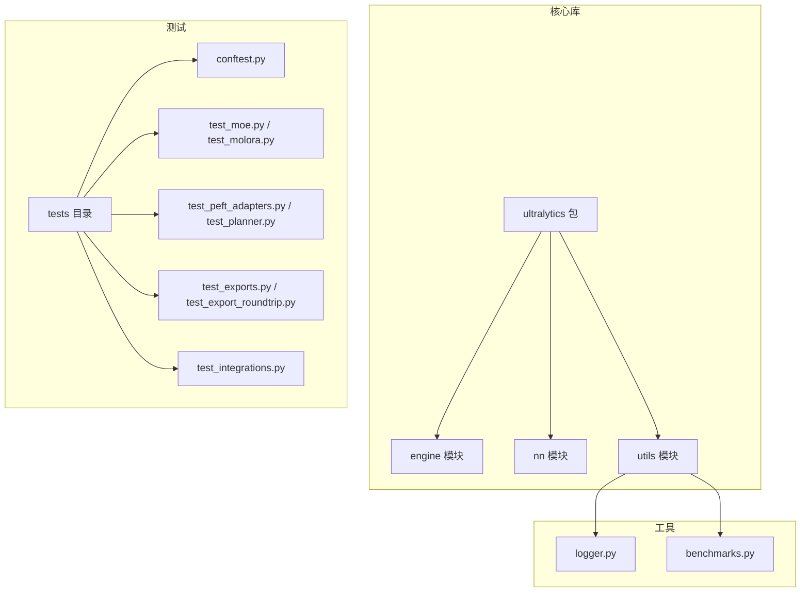
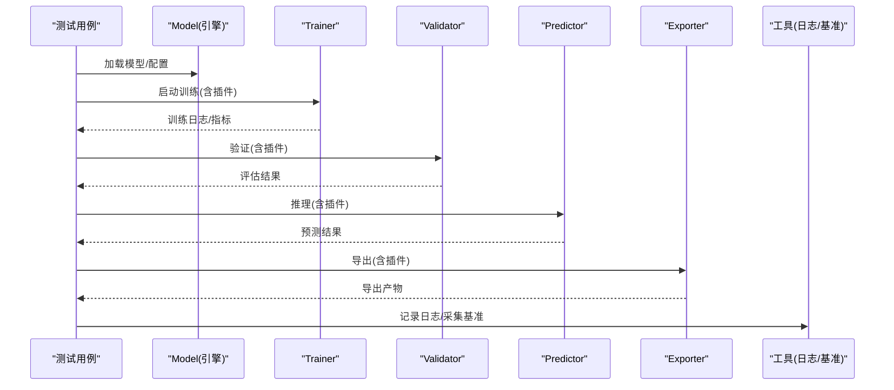
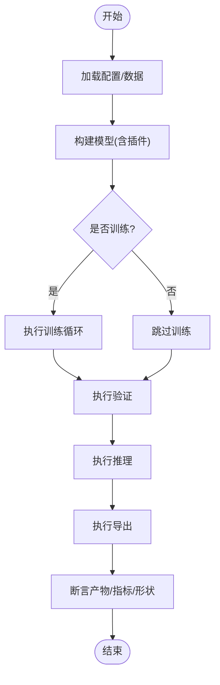
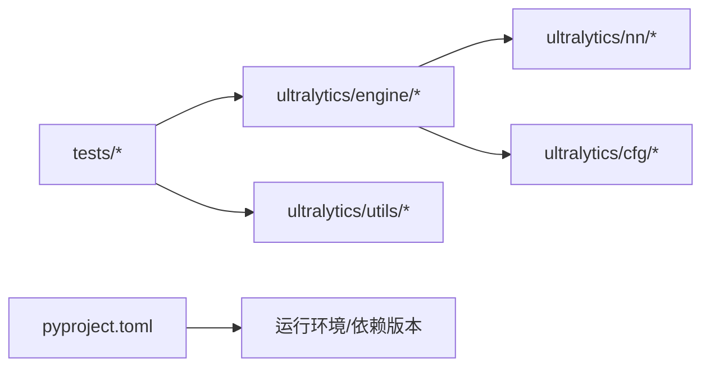

# 插件测试与调试

<cite>
**本文引用的文件**
- [tests/conftest.py](file://tests/conftest.py)
- [tests/test_cli.py](file://tests/test_cli.py)
- [tests/test_engine.py](file://tests/test_engine.py)
- [tests/test_python.py](file://tests/test_python.py)
- [tests/test_moe.py](file://tests/test_moe.py)
- [tests/test_molora.py](file://tests/test_molora.py)
- [tests/test_peft_adapters.py](file://tests/test_peft_adapters.py)
- [tests/test_planner.py](file://tests/test_planner.py)
- [tests/test_mot.py](file://tests/test_mot.py)
- [tests/test_solutions.py](file://tests/test_solutions.py)
- [tests/test_export_roundtrip.py](file://tests/test_export_roundtrip.py)
- [tests/test_exports.py](file://tests/test_exports.py)
- [tests/test_integrations.py](file://tests/test_integrations.py)
- [tests/cache_test_assets.py](file://tests/cache_test_assets.py)
- [ultralytics/utils/logger.py](file://ultralytics/utils/logger.py)
- [ultralytics/utils/benchmarks.py](file://ultralytics/utils/benchmarks.py)
- [ultralytics/engine/model.py](file://ultralytics/engine/model.py)
- [ultralytics/engine/trainer.py](file://ultralytics/engine/trainer.py)
- [ultralytics/engine/validator.py](file://ultralytics/engine/validator.py)
- [ultralytics/engine/predictor.py](file://ultralytics/engine/predictor.py)
- [ultralytics/engine/exporter.py](file://ultralytics/engine/exporter.py)
- [pyproject.toml](file://pyproject.toml)
</cite>

## 目录
1. [简介](#简介)
2. [项目结构](#项目结构)
3. [核心组件](#核心组件)
4. [架构总览](#架构总览)
5. [详细组件分析](#详细组件分析)
6. [依赖分析](#依赖分析)
7. [性能考虑](#性能考虑)
8. [故障排查指南](#故障排查指南)
9. [结论](#结论)
10. [附录](#附录)

## 简介
本指南面向YOLO-Master项目的插件（模型扩展、网络模块、回调函数等）测试与调试，提供从单元测试到集成测试、端到端验证、调试技巧、兼容性测试以及持续集成的完整实践方法。文档以仓库现有测试与工具为依据，帮助读者快速建立稳定可靠的插件质量保障体系。

## 项目结构
仓库采用“功能域+测试覆盖”的组织方式：
- 核心代码位于 ultralytics 包下，包含引擎、模型、网络模块、导出、工具与回调等。
- 测试集中于 tests 目录，按能力域划分（如 MoE、LoRA/PEFT、MOT、导出、集成等）。
- 配置与脚本在根目录与 scripts 中，便于复现实验与基准。

图表来源
- [tests/conftest.py](file://tests/conftest.py)
- [tests/test_moe.py](file://tests/test_moe.py)
- [tests/test_molora.py](file://tests/test_molora.py)
- [tests/test_peft_adapters.py](file://tests/test_peft_adapters.py)
- [tests/test_planner.py](file://tests/test_planner.py)
- [tests/test_exports.py](file://tests/test_exports.py)
- [tests/test_export_roundtrip.py](file://tests/test_export_roundtrip.py)
- [tests/test_integrations.py](file://tests/test_integrations.py)
- [ultralytics/utils/logger.py](file://ultralytics/utils/logger.py)
- [ultralytics/utils/benchmarks.py](file://ultralytics/utils/benchmarks.py)

章节来源
- [tests/conftest.py](file://tests/conftest.py)
- [tests/test_moe.py](file://tests/test_moe.py)
- [tests/test_molora.py](file://tests/test_molora.py)
- [tests/test_peft_adapters.py](file://tests/test_peft_adapters.py)
- [tests/test_planner.py](file://tests/test_planner.py)
- [tests/test_exports.py](file://tests/test_exports.py)
- [tests/test_export_roundtrip.py](file://tests/test_export_roundtrip.py)
- [tests/test_integrations.py](file://tests/test_integrations.py)
- [ultralytics/utils/logger.py](file://ultralytics/utils/logger.py)
- [ultralytics/utils/benchmarks.py](file://ultralytics/utils/benchmarks.py)

## 核心组件
- 测试框架与夹具
  - 使用 pytest 作为统一测试框架；conftest.py 集中管理共享夹具与全局配置，确保跨用例一致的环境与数据准备。
  - 建议将数据集缓存、设备选择、随机种子、日志级别等放入夹具，减少重复代码并提升可维护性。
- 关键被测对象
  - 模型与训练/推理/验证/导出流程：通过 engine 层接口进行端到端串联。
  - 插件化模块：MoE/MoA、LoRA/PEFT、MOT、Planner、Solutions 等，分别由对应测试文件覆盖。
- 断言策略
  - 数值稳定性：对损失、指标、输出张量形状与范围进行断言。
  - 契约一致性：对导出产物、注册表、路由行为、回调钩子触发顺序进行断言。
  - 鲁棒性：异常路径、边界输入、空批、不同精度与设备切换的健壮性断言。

章节来源
- [tests/conftest.py](file://tests/conftest.py)
- [tests/test_engine.py](file://tests/test_engine.py)
- [tests/test_python.py](file://tests/test_python.py)
- [tests/test_moe.py](file://tests/test_moe.py)
- [tests/test_molora.py](file://tests/test_molora.py)
- [tests/test_peft_adapters.py](file://tests/test_peft_adapters.py)
- [tests/test_planner.py](file://tests/test_planner.py)
- [tests/test_mot.py](file://tests/test_mot.py)
- [tests/test_solutions.py](file://tests/test_solutions.py)
- [tests/test_export_roundtrip.py](file://tests/test_export_roundtrip.py)
- [tests/test_exports.py](file://tests/test_exports.py)
- [tests/test_integrations.py](file://tests/test_integrations.py)

## 架构总览
下图展示插件在训练/推理/导出链路中的位置与交互关系，以及测试如何覆盖这些路径。

图表来源
- [ultralytics/engine/model.py](file://ultralytics/engine/model.py)
- [ultralytics/engine/trainer.py](file://ultralytics/engine/trainer.py)
- [ultralytics/engine/validator.py](file://ultralytics/engine/validator.py)
- [ultralytics/engine/predictor.py](file://ultralytics/engine/predictor.py)
- [ultralytics/engine/exporter.py](file://ultralytics/engine/exporter.py)
- [ultralytics/utils/logger.py](file://ultralytics/utils/logger.py)
- [ultralytics/utils/benchmarks.py](file://ultralytics/utils/benchmarks.py)

## 详细组件分析

### 单元测试编写指南
- 测试框架选择
  - 使用 pytest 组织用例，结合 conftest.py 提供共享夹具（如小样本数据、固定随机种子、CPU/GPU选择）。
- 测试用例设计
  - 最小可复现：构造极小输入与简化配置，保证快速执行。
  - 分层覆盖：单元级（单模块）、集成级（多模块协作）、端到端（CLI/Python API）。
- 断言策略
  - 形状与类型：输入输出维度、数据类型、设备一致性。
  - 数值范围：损失非负、概率归一、IoU阈值区间。
  - 契约与副作用：注册表条目存在、回调被调用次数与顺序、导出产物完整性。

章节来源
- [tests/conftest.py](file://tests/conftest.py)
- [tests/test_engine.py](file://tests/test_engine.py)
- [tests/test_python.py](file://tests/test_python.py)

### 集成测试与端到端流程
- 端到端流程
  - 训练：加载数据→构建模型→训练循环→指标收敛性检查。
  - 推理：加载权重→前向传播→后处理→可视化或保存结果。
  - 导出：导出为多种后端格式→校验图结构与算子支持→反序列化运行。
- 模拟环境搭建
  - 使用本地小数据集与轻量模型，避免外部依赖与网络请求。
  - 通过夹具隔离资源（临时目录、进程间通信、分布式初始化）。

章节来源
- [tests/test_moe.py](file://tests/test_moe.py)
- [tests/test_molora.py](file://tests/test_molora.py)
- [tests/test_peft_adapters.py](file://tests/test_peft_adapters.py)
- [tests/test_planner.py](file://tests/test_planner.py)
- [tests/test_mot.py](file://tests/test_mot.py)
- [tests/test_solutions.py](file://tests/test_solutions.py)
- [tests/test_export_roundtrip.py](file://tests/test_export_roundtrip.py)
- [tests/test_exports.py](file://tests/test_exports.py)

### 插件调试工具与技巧
- 日志记录
  - 使用统一日志工具输出结构化信息，便于定位问题与回溯。
- 性能分析
  - 使用基准工具采集耗时、吞吐、内存占用，对比基线与变更差异。
- 内存泄漏检测
  - 在长时训练/推理场景下监控显存/内存增长趋势，结合梯度累积与清理逻辑验证。

章节来源
- [ultralytics/utils/logger.py](file://ultralytics/utils/logger.py)
- [ultralytics/utils/benchmarks.py](file://ultralytics/utils/benchmarks.py)

### 插件兼容性测试
- 版本兼容
  - 针对上游依赖（PyTorch、ONNX、后端运行时）进行最小/最大版本矩阵测试。
- 依赖冲突检测
  - 通过 pyproject.toml 声明约束，CI 中并行安装不同组合，捕获导入错误与运行时异常。
- 回归门禁
  - 对关键指标与导出产物设置阈值，失败则阻断合并。

章节来源
- [pyproject.toml](file://pyproject.toml)
- [tests/test_integrations.py](file://tests/test_integrations.py)

### 完整测试用例开发示例（路径指引）
- 模型插件（MoE/MoA）
  - 参考：[tests/test_moe.py](file://tests/test_moe.py)、[tests/test_molora.py](file://tests/test_molora.py)
  - 关注点：路由分发、专家激活稀疏性、损失组成、导出兼容性。
- 网络模块（Planner/路由解释器）
  - 参考：[tests/test_planner.py](file://tests/test_planner.py)
  - 关注点：调度策略、边界条件、数值稳定性。
- 回调函数
  - 参考：[tests/test_engine.py](file://tests/test_engine.py)、[tests/test_python.py](file://tests/test_python.py)
  - 关注点：钩子触发时机、参数传递、副作用清理。
- 导出与往返
  - 参考：[tests/test_exports.py](file://tests/test_exports.py)、[tests/test_export_roundtrip.py](file://tests/test_export_roundtrip.py)
  - 关注点：图结构一致性、算子支持、反序列化运行正确性。
- 目标跟踪（MOT）
  - 参考：[tests/test_mot.py](file://tests/test_mot.py)
  - 关注点：轨迹连续性、ID切换率、时序一致性。
- 解决方案（Solutions）
  - 参考：[tests/test_solutions.py](file://tests/test_solutions.py)
  - 关注点：可视化输出、模板渲染、IO路径。

章节来源
- [tests/test_moe.py](file://tests/test_moe.py)
- [tests/test_molora.py](file://tests/test_molora.py)
- [tests/test_planner.py](file://tests/test_planner.py)
- [tests/test_engine.py](file://tests/test_engine.py)
- [tests/test_python.py](file://tests/test_python.py)
- [tests/test_exports.py](file://tests/test_exports.py)
- [tests/test_export_roundtrip.py](file://tests/test_export_roundtrip.py)
- [tests/test_mot.py](file://tests/test_mot.py)
- [tests/test_solutions.py](file://tests/test_solutions.py)

## 依赖分析
- 内部依赖
  - 测试用例主要依赖 ultralytics.engine.* 与 ultralytics.utils.*，并通过 conftest.py 注入共享资源。
- 外部依赖
  - 通过 pyproject.toml 声明 Python 与第三方库版本约束，确保在不同环境中可重现。
- 潜在耦合
  - 导出与后端运行时强耦合，需通过导出前后校验与往返测试降低风险。

图表来源
- [pyproject.toml](file://pyproject.toml)
- [tests/test_integrations.py](file://tests/test_integrations.py)

章节来源
- [pyproject.toml](file://pyproject.toml)
- [tests/test_integrations.py](file://tests/test_integrations.py)

## 性能考虑
- 基准采集
  - 使用基准工具在相同硬件与数据规模下对比变更前后吞吐与延迟。
- 训练稳定性
  - 监控损失曲线与梯度范数，设置早停与回滚策略。
- 内存优化
  - 启用混合精度、梯度检查点、及时释放中间变量，避免显存泄漏。

## 故障排查指南
- 常见问题定位
  - 导入错误：检查依赖版本与平台差异（Windows/CUDA/ROCm）。
  - 导出失败：核对算子支持与后端限制，查看导出预检日志。
  - 指标不达标：确认数据预处理、标签格式与评估协议一致性。
- 调试技巧
  - 开启详细日志，缩小复现场景至最小用例。
  - 使用基准工具定位热点路径，逐步替换为Mock或简化实现验证假设。
- 资源与缓存
  - 使用缓存脚本准备测试资产，避免网络抖动影响稳定性。

章节来源
- [tests/cache_test_assets.py](file://tests/cache_test_assets.py)
- [ultralytics/utils/logger.py](file://ultralytics/utils/logger.py)
- [ultralytics/utils/benchmarks.py](file://ultralytics/utils/benchmarks.py)

## 结论
通过统一的测试框架、清晰的断言策略、完善的端到端流程与调试工具链，YOLO-Master的插件质量可以得到系统化保障。建议在CI中固化关键用例与性能门禁，持续回归以确保版本演进过程中的稳定性与兼容性。

## 附录
- 快速上手
  - 安装依赖：依据 pyproject.toml 创建虚拟环境并安装。
  - 运行测试：使用 pytest 指定用例或标记，结合 conftest.py 提供的夹具。
  - 生成报告：结合日志与基准输出，形成可追溯的质量报告。