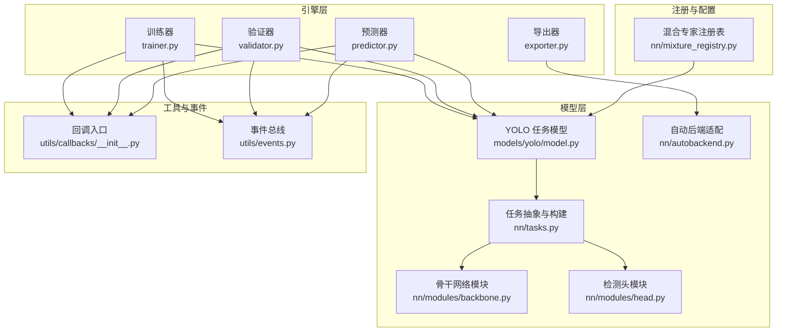
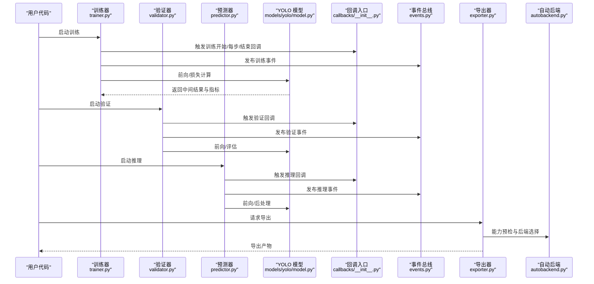
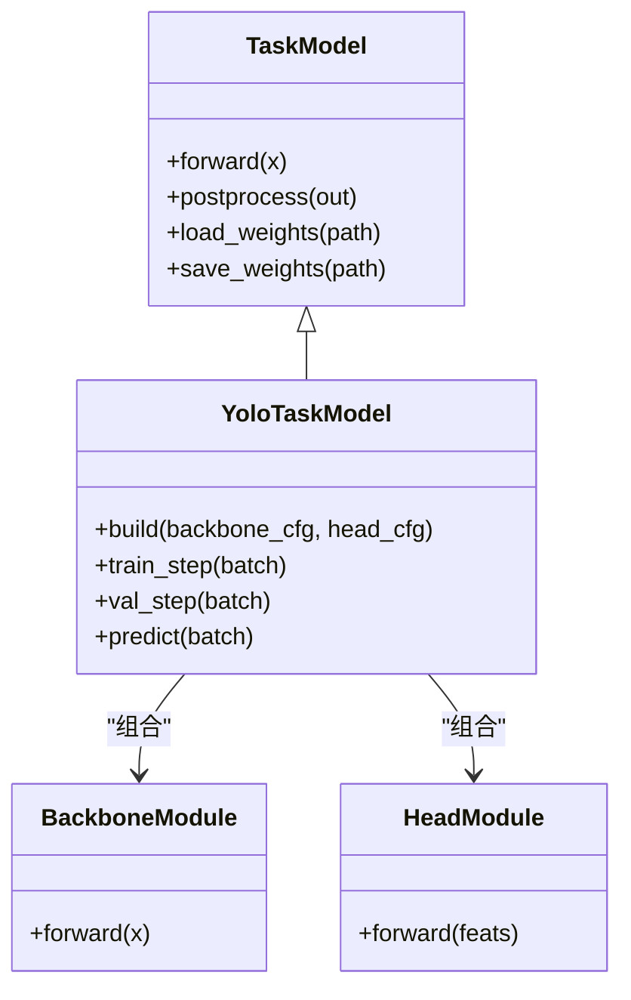
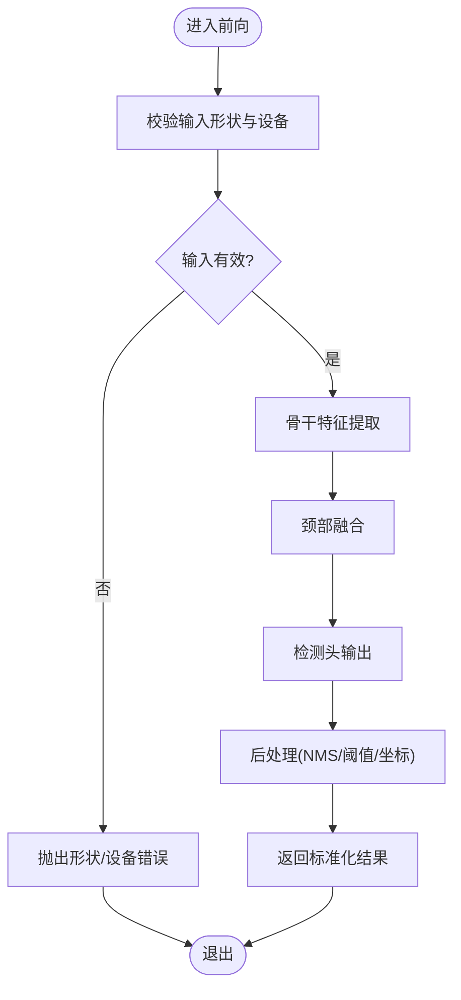
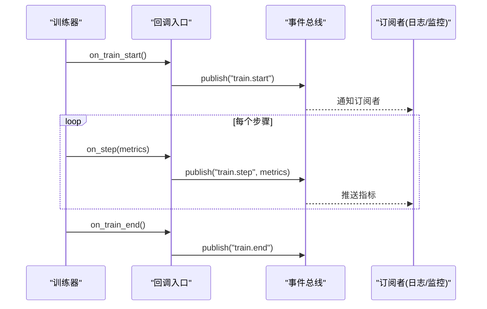
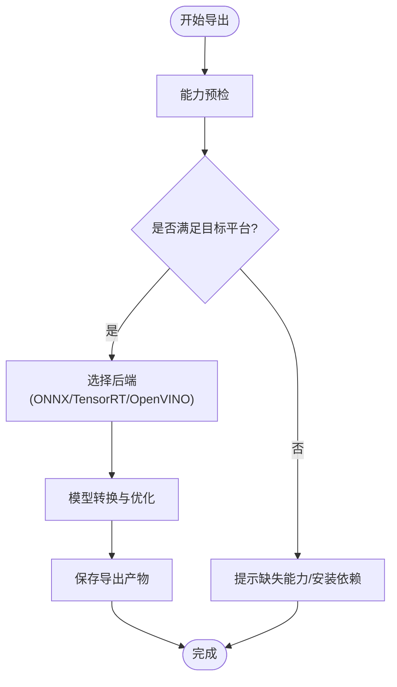
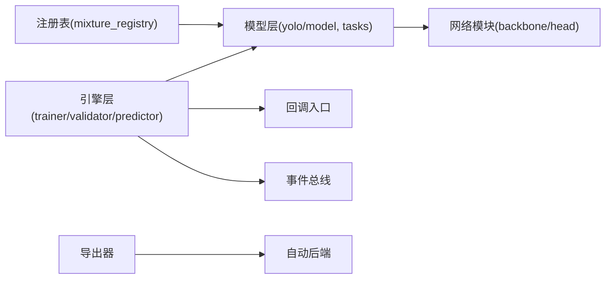

# 插件系统开发

<cite>
**本文引用的文件**
- [ultralytics/engine/trainer.py](file://ultralytics/engine/trainer.py)
- [ultralytics/engine/validator.py](file://ultralytics/engine/validator.py)
- [ultralytics/engine/predictor.py](file://ultralytics/engine/predictor.py)
- [ultralytics/utils/callbacks/__init__.py](file://ultralytics/utils/callbacks/__init__.py)
- [ultralytics/utils/events.py](file://ultralytics/utils/events.py)
- [ultralytics/models/yolo/model.py](file://ultralytics/models/yolo/model.py)
- [ultralytics/nn/mixture_registry.py](file://ultralytics/nn/mixture_registry.py)
- [ultralytics/nn/tasks.py](file://ultralytics/nn/tasks.py)
- [ultralytics/nn/modules/backbone.py](file://ultralytics/nn/modules/backbone.py)
- [ultralytics/nn/modules/head.py](file://ultralytics/nn/modules/head.py)
- [ultralytics/nn/autobackend.py](file://ultralytics/nn/autobackend.py)
- [ultralytics/engine/exporter.py](file://ultralytics/engine/exporter.py)
- [tests/test_model_registry.py](file://tests/test_model_registry.py)
- [tests/test_mixture_config_registry.py](file://tests/test_mixture_config_registry.py)
- [tests/test_export_preflight.py](file://tests/test_export_preflight.py)
</cite>

## 目录
1. [简介](#简介)
2. [项目结构](#项目结构)
3. [核心组件](#核心组件)
4. [架构总览](#架构总览)
5. [详细组件分析](#详细组件分析)
6. [依赖关系分析](#依赖关系分析)
7. [性能考量](#性能考量)
8. [故障排查指南](#故障排查指南)
9. [结论](#结论)
10. [附录](#附录)

## 简介
本指南面向希望在 YOLO-Master 中扩展与定制能力的开发者，围绕“插件化”能力提供系统化说明。内容覆盖：
- 模块注册机制（模型、混合专家配置等）
- 生命周期管理（训练/验证/推理/导出阶段钩子）
- 依赖注入（通过配置与运行时上下文装配）
- 自定义模型实现（继承结构、参数配置、权重管理）
- 网络模块规范（层定义、前向传播、后处理）
- 回调系统与事件机制（训练监控、结果处理）
- 插件测试与调试（单元与集成测试）
- 打包与分发最佳实践

## 项目结构
YOLO-Master 的插件化能力主要分布在以下层次：
- 引擎层：训练器、验证器、预测器负责编排生命周期并触发回调
- 模型层：任务模型与网络模块提供可插拔的前向与后处理
- 注册中心：模型与混合专家配置的集中注册与解析
- 工具层：事件总线与导出预检等通用能力
- 测试层：针对注册表、导出能力等的回归与契约测试

图表来源
- [ultralytics/engine/trainer.py](file://ultralytics/engine/trainer.py)
- [ultralytics/engine/validator.py](file://ultralytics/engine/validator.py)
- [ultralytics/engine/predictor.py](file://ultralytics/engine/predictor.py)
- [ultralytics/engine/exporter.py](file://ultralytics/engine/exporter.py)
- [ultralytics/models/yolo/model.py](file://ultralytics/models/yolo/model.py)
- [ultralytics/nn/tasks.py](file://ultralytics/nn/tasks.py)
- [ultralytics/nn/modules/backbone.py](file://ultralytics/nn/modules/backbone.py)
- [ultralytics/nn/modules/head.py](file://ultralytics/nn/modules/head.py)
- [ultralytics/nn/autobackend.py](file://ultralytics/nn/autobackend.py)
- [ultralytics/nn/mixture_registry.py](file://ultralytics/nn/mixture_registry.py)
- [ultralytics/utils/callbacks/__init__.py](file://ultralytics/utils/callbacks/__init__.py)
- [ultralytics/utils/events.py](file://ultralytics/utils/events.py)

章节来源
- [ultralytics/engine/trainer.py](file://ultralytics/engine/trainer.py)
- [ultralytics/engine/validator.py](file://ultralytics/engine/validator.py)
- [ultralytics/engine/predictor.py](file://ultralytics/engine/predictor.py)
- [ultralytics/engine/exporter.py](file://ultralytics/engine/exporter.py)
- [ultralytics/models/yolo/model.py](file://ultralytics/models/yolo/model.py)
- [ultralytics/nn/tasks.py](file://ultralytics/nn/tasks.py)
- [ultralytics/nn/modules/backbone.py](file://ultralytics/nn/modules/backbone.py)
- [ultralytics/nn/modules/head.py](file://ultralytics/nn/modules/head.py)
- [ultralytics/nn/autobackend.py](file://ultralytics/nn/autobackend.py)
- [ultralytics/nn/mixture_registry.py](file://ultralytics/nn/mixture_registry.py)
- [ultralytics/utils/callbacks/__init__.py](file://ultralytics/utils/callbacks/__init__.py)
- [ultralytics/utils/events.py](file://ultralytics/utils/events.py)

## 核心组件
- 模型注册中心
  - 作用：统一注册与解析模型类或混合专家配置，避免硬编码分支
  - 关键点：键名一致性、版本兼容、默认回退策略
- 任务模型与网络模块
  - 作用：封装骨干、颈部与检测头的组合，提供标准前向接口与后处理
  - 关键点：输入输出张量约定、形状广播、设备无关性
- 引擎生命周期与回调
  - 作用：在训练/验证/推理/导出的关键阶段触发回调，支持监控与结果处理
  - 关键点：事件顺序、异常隔离、幂等性
- 事件总线
  - 作用：解耦组件间通信，订阅/发布事件，便于扩展
  - 关键点：事件命名空间、优先级、异步安全
- 导出预检与自动后端
  - 作用：在导出前校验能力矩阵，选择最优后端执行
  - 关键点：能力清单、降级路径、错误诊断

章节来源
- [ultralytics/nn/mixture_registry.py](file://ultralytics/nn/mixture_registry.py)
- [ultralytics/models/yolo/model.py](file://ultralytics/models/yolo/model.py)
- [ultralytics/nn/tasks.py](file://ultralytics/nn/tasks.py)
- [ultralytics/utils/callbacks/__init__.py](file://ultralytics/utils/callbacks/__init__.py)
- [ultralytics/utils/events.py](file://ultralytics/utils/events.py)
- [ultralytics/engine/exporter.py](file://ultralytics/engine/exporter.py)
- [ultralytics/nn/autobackend.py](file://ultralytics/nn/autobackend.py)

## 架构总览
下图展示了从用户调用到模型执行与回调触发的端到端流程，以及导出阶段的预检与后端选择。

图表来源
- [ultralytics/engine/trainer.py](file://ultralytics/engine/trainer.py)
- [ultralytics/engine/validator.py](file://ultralytics/engine/validator.py)
- [ultralytics/engine/predictor.py](file://ultralytics/engine/predictor.py)
- [ultralytics/models/yolo/model.py](file://ultralytics/models/yolo/model.py)
- [ultralytics/utils/callbacks/__init__.py](file://ultralytics/utils/callbacks/__init__.py)
- [ultralytics/utils/events.py](file://ultralytics/utils/events.py)
- [ultralytics/engine/exporter.py](file://ultralytics/engine/exporter.py)
- [ultralytics/nn/autobackend.py](file://ultralytics/nn/autobackend.py)

## 详细组件分析

### 模块注册机制（模型与混合专家）
- 设计要点
  - 使用集中式注册表维护“名称→类/配置”映射，避免 if/else 分支扩散
  - 提供默认回退与版本兼容性检查，确保升级平滑
  - 支持动态发现与热更新（按需加载）
- 典型流程
  - 初始化时扫描注册表
  - 根据配置键解析目标实现
  - 实例化并注入依赖（如设备、精度、优化器配置）
- 建议
  - 为每个插件提供唯一且稳定的键名
  - 在注册表中记录元数据（作者、版本、依赖）
  - 对不兼容变更进行弃用警告与迁移指引

章节来源
- [ultralytics/nn/mixture_registry.py](file://ultralytics/nn/mixture_registry.py)
- [tests/test_mixture_config_registry.py](file://tests/test_mixture_config_registry.py)

### 生命周期管理与依赖注入
- 生命周期阶段
  - 训练：准备数据、迭代、保存检查点、日志与回调
  - 验证：周期性评估、指标汇总、早停判断
  - 推理：批处理、NMS/后处理、可视化
  - 导出：能力预检、格式转换、后端选择
- 依赖注入方式
  - 通过构造函数或配置对象注入（设备、精度、IO、日志、回调）
  - 使用工厂方法创建具体实现，便于替换与测试
- 最佳实践
  - 将副作用最小化，保持函数式风格
  - 明确边界条件与异常类型
  - 保证幂等性与可重入性

章节来源
- [ultralytics/engine/trainer.py](file://ultralytics/engine/trainer.py)
- [ultralytics/engine/validator.py](file://ultralytics/engine/validator.py)
- [ultralytics/engine/predictor.py](file://ultralytics/engine/predictor.py)
- [ultralytics/engine/exporter.py](file://ultralytics/engine/exporter.py)

### 自定义模型实现（继承结构与参数配置）
- 继承结构
  - 基于任务模型基类扩展，复用通用前向/后处理逻辑
  - 通过模块化组合（骨干、颈部、检测头）拼装复杂网络
- 参数配置
  - 使用 YAML/字典驱动的配置，区分超参与结构参数
  - 提供默认值与校验规则，避免非法配置导致崩溃
- 权重管理
  - 支持部分加载、冻结/解冻策略、权重指纹校验
  - 导出时保留必要元信息以便复现实验

图表来源
- [ultralytics/models/yolo/model.py](file://ultralytics/models/yolo/model.py)
- [ultralytics/nn/tasks.py](file://ultralytics/nn/tasks.py)
- [ultralytics/nn/modules/backbone.py](file://ultralytics/nn/modules/backbone.py)
- [ultralytics/nn/modules/head.py](file://ultralytics/nn/modules/head.py)

章节来源
- [ultralytics/models/yolo/model.py](file://ultralytics/models/yolo/model.py)
- [ultralytics/nn/tasks.py](file://ultralytics/nn/tasks.py)
- [ultralytics/nn/modules/backbone.py](file://ultralytics/nn/modules/backbone.py)
- [ultralytics/nn/modules/head.py](file://ultralytics/nn/modules/head.py)
- [tests/test_model_registry.py](file://tests/test_model_registry.py)

### 网络模块开发规范（层定义、前向与后处理）
- 层定义
  - 遵循 PyTorch Module 规范，显式声明子模块与参数
  - 提供 shape 推导与广播语义说明
- 前向传播
  - 输入输出形状稳定，避免隐式维度变化
  - 尽量使用向量化操作，减少 Python 循环
- 后处理逻辑
  - NMS、阈值过滤、坐标变换等应独立成函数
  - 支持批量与多尺度输入，保持内存友好

图表来源
- [ultralytics/nn/tasks.py](file://ultralytics/nn/tasks.py)
- [ultralytics/nn/modules/backbone.py](file://ultralytics/nn/modules/backbone.py)
- [ultralytics/nn/modules/head.py](file://ultralytics/nn/modules/head.py)

章节来源
- [ultralytics/nn/tasks.py](file://ultralytics/nn/tasks.py)
- [ultralytics/nn/modules/backbone.py](file://ultralytics/nn/modules/backbone.py)
- [ultralytics/nn/modules/head.py](file://ultralytics/nn/modules/head.py)

### 回调系统与事件机制（训练监控与结果处理）
- 回调系统
  - 在训练/验证/推理的关键节点插入自定义逻辑（如日志、断点、可视化）
  - 支持按阶段、按指标阈值触发
- 事件机制
  - 通过事件总线发布/订阅，解耦业务逻辑
  - 事件包含上下文（时间戳、批次索引、指标快照）
- 使用建议
  - 回调函数应保持轻量，避免阻塞主流程
  - 对异常进行捕获与上报，不影响主流程稳定性

图表来源
- [ultralytics/utils/callbacks/__init__.py](file://ultralytics/utils/callbacks/__init__.py)
- [ultralytics/utils/events.py](file://ultralytics/utils/events.py)
- [ultralytics/engine/trainer.py](file://ultralytics/engine/trainer.py)

章节来源
- [ultralytics/utils/callbacks/__init__.py](file://ultralytics/utils/callbacks/__init__.py)
- [ultralytics/utils/events.py](file://ultralytics/utils/events.py)
- [ultralytics/engine/trainer.py](file://ultralytics/engine/trainer.py)

### 导出与自动后端选择
- 导出预检
  - 在导出前检查模型能力、算子支持与目标平台约束
  - 失败时给出明确的修复建议
- 自动后端
  - 根据环境特性选择最优执行后端（如 ONNX/TensorRT/OpenVINO）
  - 提供降级路径与回退策略

图表来源
- [ultralytics/engine/exporter.py](file://ultralytics/engine/exporter.py)
- [ultralytics/nn/autobackend.py](file://ultralytics/nn/autobackend.py)
- [tests/test_export_preflight.py](file://tests/test_export_preflight.py)

章节来源
- [ultralytics/engine/exporter.py](file://ultralytics/engine/exporter.py)
- [ultralytics/nn/autobackend.py](file://ultralytics/nn/autobackend.py)
- [tests/test_export_preflight.py](file://tests/test_export_preflight.py)

## 依赖关系分析
- 耦合与内聚
  - 引擎层与模型层通过标准接口交互，降低耦合度
  - 注册表集中管理依赖，提高内聚性
- 外部依赖
  - 导出阶段依赖第三方后端库（ONNXRuntime、TensorRT 等）
  - 事件与回调依赖日志与监控基础设施
- 潜在循环依赖
  - 避免模型直接引用引擎；通过回调与事件解耦
- 接口契约
  - 前向/后处理的输入输出形状与数据类型需严格一致
  - 注册表键名与配置字段需保持稳定

图表来源
- [ultralytics/engine/trainer.py](file://ultralytics/engine/trainer.py)
- [ultralytics/engine/validator.py](file://ultralytics/engine/validator.py)
- [ultralytics/engine/predictor.py](file://ultralytics/engine/predictor.py)
- [ultralytics/models/yolo/model.py](file://ultralytics/models/yolo/model.py)
- [ultralytics/nn/tasks.py](file://ultralytics/nn/tasks.py)
- [ultralytics/nn/modules/backbone.py](file://ultralytics/nn/modules/backbone.py)
- [ultralytics/nn/modules/head.py](file://ultralytics/nn/modules/head.py)
- [ultralytics/utils/callbacks/__init__.py](file://ultralytics/utils/callbacks/__init__.py)
- [ultralytics/utils/events.py](file://ultralytics/utils/events.py)
- [ultralytics/engine/exporter.py](file://ultralytics/engine/exporter.py)
- [ultralytics/nn/autobackend.py](file://ultralytics/nn/autobackend.py)
- [ultralytics/nn/mixture_registry.py](file://ultralytics/nn/mixture_registry.py)

章节来源
- [ultralytics/engine/trainer.py](file://ultralytics/engine/trainer.py)
- [ultralytics/engine/validator.py](file://ultralytics/engine/validator.py)
- [ultralytics/engine/predictor.py](file://ultralytics/engine/predictor.py)
- [ultralytics/models/yolo/model.py](file://ultralytics/models/yolo/model.py)
- [ultralytics/nn/tasks.py](file://ultralytics/nn/tasks.py)
- [ultralytics/nn/modules/backbone.py](file://ultralytics/nn/modules/backbone.py)
- [ultralytics/nn/modules/head.py](file://ultralytics/nn/modules/head.py)
- [ultralytics/utils/callbacks/__init__.py](file://ultralytics/utils/callbacks/__init__.py)
- [ultralytics/utils/events.py](file://ultralytics/utils/events.py)
- [ultralytics/engine/exporter.py](file://ultralytics/engine/exporter.py)
- [ultralytics/nn/autobackend.py](file://ultralytics/nn/autobackend.py)
- [ultralytics/nn/mixture_registry.py](file://ultralytics/nn/mixture_registry.py)

## 性能考量
- 前向优化
  - 使用向量化与原地操作，减少临时张量分配
  - 合理设置批大小与内存池，避免频繁 GPU/CPU 同步
- 导出优化
  - 启用图级优化与算子融合
  - 针对目标硬件选择合适后端与精度（FP16/INT8）
- 回调与事件
  - 避免在回调中进行重型 I/O 或阻塞操作
  - 采用异步写入与缓冲策略

[本节为通用指导，无需特定文件来源]

## 故障排查指南
- 常见错误定位
  - 注册表键名不一致：检查配置文件与注册表映射
  - 导出失败：查看能力预检报告与缺失依赖提示
  - 回调异常：确认回调函数签名与异常隔离
- 调试技巧
  - 在关键阶段打印形状与设备信息
  - 使用最小可复现示例与单元测试快速定位问题
  - 结合事件日志追踪调用链

章节来源
- [tests/test_export_preflight.py](file://tests/test_export_preflight.py)
- [tests/test_model_registry.py](file://tests/test_model_registry.py)
- [tests/test_mixture_config_registry.py](file://tests/test_mixture_config_registry.py)

## 结论
通过统一的注册中心、清晰的模块边界、完善的回调与事件机制，YOLO-Master 提供了强大的插件化能力。开发者可以以较低成本扩展模型、网络模块与训练/推理流程，同时借助导出预检与自动后端选择提升部署效率。建议在扩展过程中遵循本文规范，完善测试与文档，确保可维护性与可移植性。

[本节为总结性内容，无需特定文件来源]

## 附录
- 插件开发清单
  - 定义唯一键名与元数据
  - 实现标准接口与前后处理
  - 编写单元与集成测试
  - 提供配置模板与使用说明
- 推荐测试用例
  - 注册表解析与回退
  - 导出能力预检与后端选择
  - 回调触发顺序与异常隔离
  - 模型权重加载/保存与指纹校验

[本节为补充信息，无需特定文件来源]