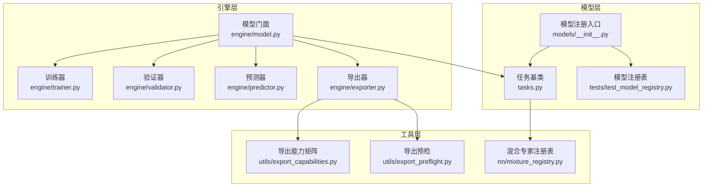
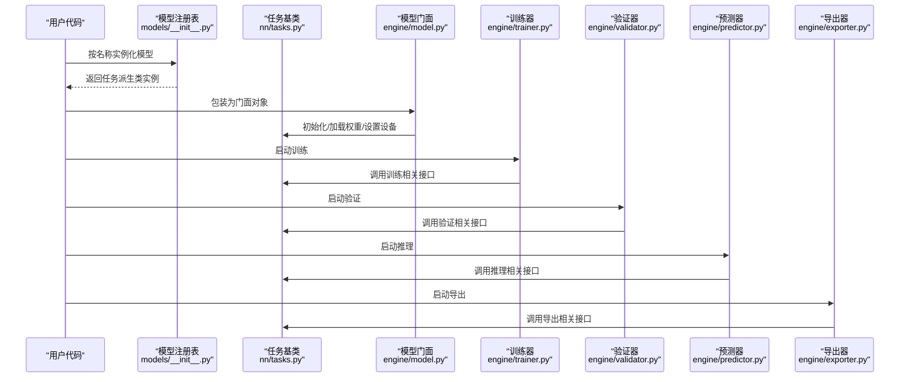
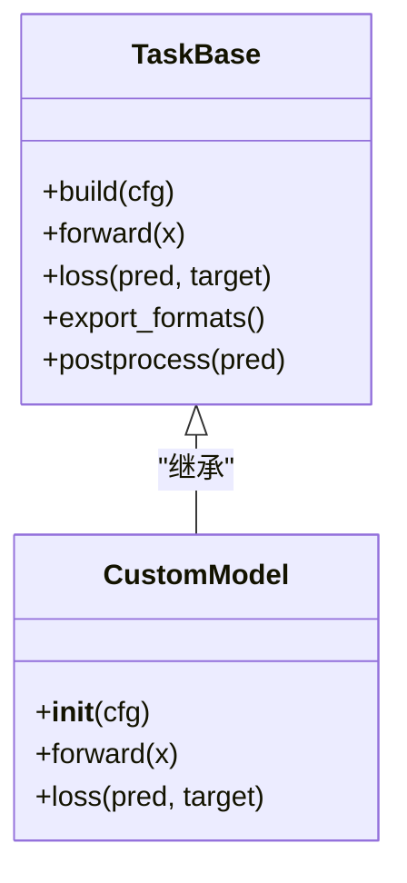
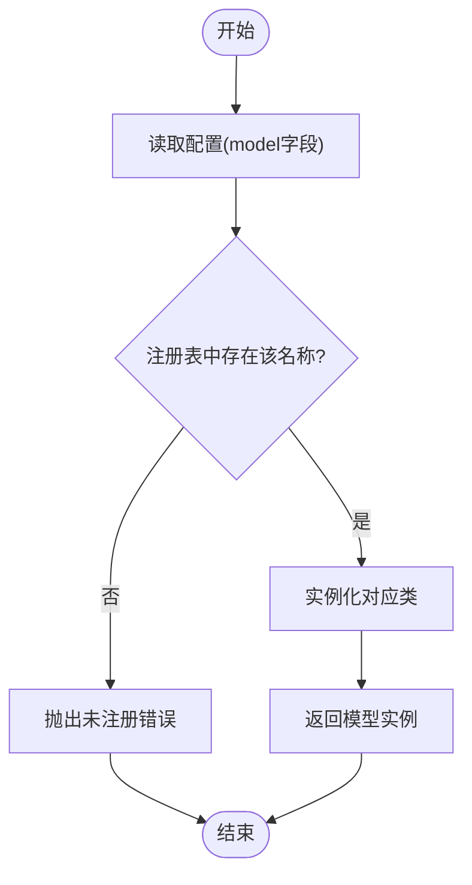
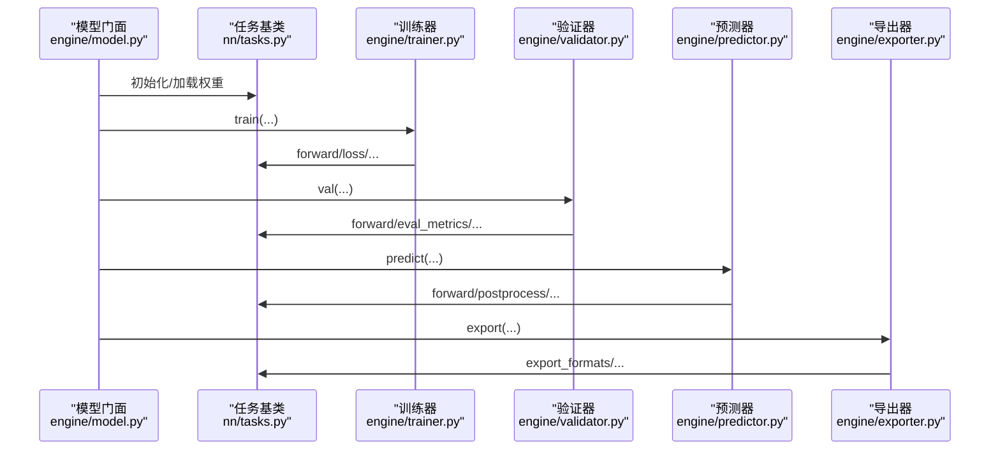
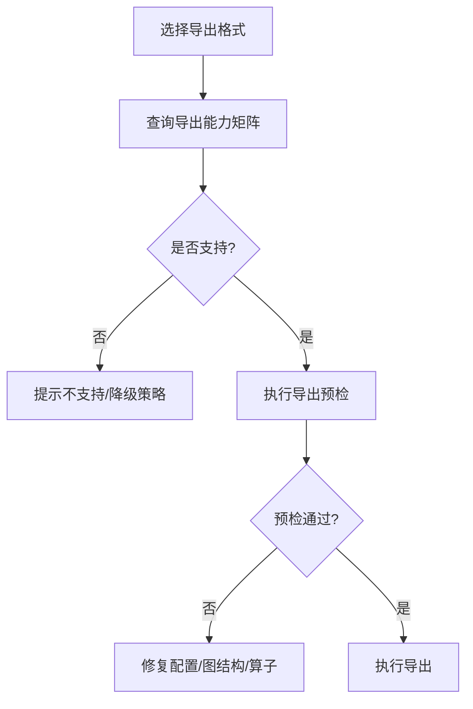
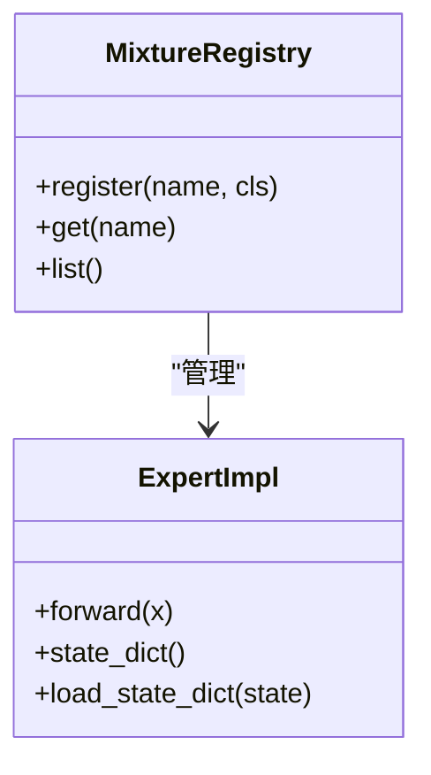
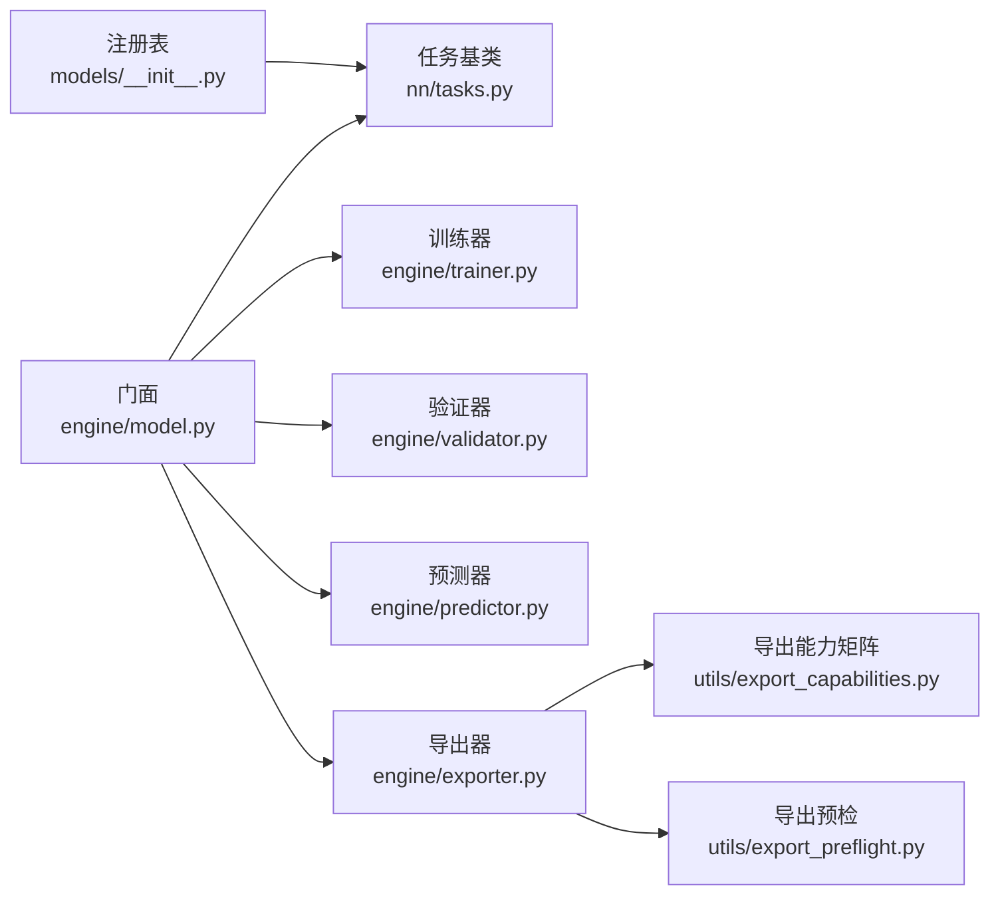

# 模型插件开发

<cite>
**本文引用的文件**
- [ultralytics/models/__init__.py](file://ultralytics/models/__init__.py)
- [ultralytics/nn/tasks.py](file://ultralytics/nn/tasks.py)
- [ultralytics/engine/model.py](file://ultralytics/engine/model.py)
- [ultralytics/engine/trainer.py](file://ultralytics/engine/trainer.py)
- [ultralytics/engine/validator.py](file://ultralytics/engine/validator.py)
- [ultralytics/engine/predictor.py](file://ultralytics/engine/predictor.py)
- [ultralytics/engine/exporter.py](file://ultralytics/engine/exporter.py)
- [ultralytics/utils/export_capabilities.py](file://ultralytics/utils/export_capabilities.py)
- [ultralytics/utils/export_preflight.py](file://ultralytics/utils/export_preflight.py)
- [ultralytics/nn/mixture_registry.py](file://ultralytics/nn/mixture_registry.py)
- [tests/test_model_registry.py](file://tests/test_model_registry.py)
- [tests/test_mixture_config_registry.py](file://tests/test_mixture_config_registry.py)
- [tests/test_export_capability_matrix.py](file://tests/test_export_capability_matrix.py)
</cite>

## 目录
1. [简介](#简介)
2. [项目结构](#项目结构)
3. [核心组件](#核心组件)
4. [架构总览](#架构总览)
5. [详细组件分析](#详细组件分析)
6. [依赖分析](#依赖分析)
7. [性能考虑](#性能考虑)
8. [故障排查指南](#故障排查指南)
9. [结论](#结论)
10. [附录](#附录)

## 简介
本指南面向希望在 YOLO-Master 中实现“自定义模型插件”的开发者，系统阐述以下主题：
- 自定义模型的继承结构与参数配置、权重管理
- 模型注册机制与工厂模式、动态加载流程
- 模型生命周期（初始化、训练、推理、导出）的处理逻辑
- 模型适配器设计模式（接口定义与实现规范）
- 从分类到检测的完整示例路径
- 性能优化与内存管理最佳实践

## 项目结构
YOLO-Master 将“模型定义、任务抽象、运行时引擎、工具能力”分层组织。与模型插件开发直接相关的核心位置如下：
- 模型注册入口与任务映射：ultralytics/models/__init__.py
- 任务基类与通用构建器：ultralytics/nn/tasks.py
- 模型运行时门面：ultralytics/engine/model.py
- 训练/验证/预测/导出引擎：ultralytics/engine/{trainer,validator,predictor,exporter}.py
- 导出能力矩阵与预检：ultralytics/utils/export_capabilities.py, ultralytics/utils/export_preflight.py
- 混合专家注册表（扩展点）：ultralytics/nn/mixture_registry.py
- 相关测试用例：tests/test_model_registry.py, tests/test_mixture_config_registry.py, tests/test_export_capability_matrix.py

图示来源
- [ultralytics/models/__init__.py](file://ultralytics/models/__init__.py)
- [ultralytics/nn/tasks.py](file://ultralytics/nn/tasks.py)
- [ultralytics/engine/model.py](file://ultralytics/engine/model.py)
- [ultralytics/engine/trainer.py](file://ultralytics/engine/trainer.py)
- [ultralytics/engine/validator.py](file://ultralytics/engine/validator.py)
- [ultralytics/engine/predictor.py](file://ultralytics/engine/predictor.py)
- [ultralytics/engine/exporter.py](file://ultralytics/engine/exporter.py)
- [ultralytics/utils/export_capabilities.py](file://ultralytics/utils/export_capabilities.py)
- [ultralytics/utils/export_preflight.py](file://ultralytics/utils/export_preflight.py)
- [ultralytics/nn/mixture_registry.py](file://ultralytics/nn/mixture_registry.py)
- [tests/test_model_registry.py](file://tests/test_model_registry.py)

章节来源
- [ultralytics/models/__init__.py](file://ultralytics/models/__init__.py)
- [ultralytics/nn/tasks.py](file://ultralytics/nn/tasks.py)
- [ultralytics/engine/model.py](file://ultralytics/engine/model.py)

## 核心组件
- 任务基类与构建器：提供统一的模型构建、前向签名、输出解析、损失计算等通用能力，是自定义模型必须遵循的契约。
- 模型注册入口：维护“名称→类”的映射，支持通过字符串名动态实例化模型。
- 模型门面：封装设备放置、权重加载、训练/验证/预测/导出的统一入口。
- 训练/验证/预测/导出引擎：分别负责不同生命周期的编排与回调。
- 导出能力与预检：描述模型对目标后端的支持情况，并在导出前进行一致性检查。
- 混合专家注册表：为 MoE/MoA 等扩展提供可插拔的专家路由与组合注册点。

章节来源
- [ultralytics/nn/tasks.py](file://ultralytics/nn/tasks.py)
- [ultralytics/models/__init__.py](file://ultralytics/models/__init__.py)
- [ultralytics/engine/model.py](file://ultralytics/engine/model.py)
- [ultralytics/engine/trainer.py](file://ultralytics/engine/trainer.py)
- [ultralytics/engine/validator.py](file://ultralytics/engine/validator.py)
- [ultralytics/engine/predictor.py](file://ultralytics/engine/predictor.py)
- [ultralytics/engine/exporter.py](file://ultralytics/engine/exporter.py)
- [ultralytics/utils/export_capabilities.py](file://ultralytics/utils/export_capabilities.py)
- [ultralytics/utils/export_preflight.py](file://ultralytics/utils/export_preflight.py)
- [ultralytics/nn/mixture_registry.py](file://ultralytics/nn/mixture_registry.py)

## 架构总览
下图展示了自定义模型在系统中的装配与运行路径：用户通过注册表以字符串名创建模型，由门面统一管理生命周期，训练/验证/预测/导出各自调用任务的相应方法。

图示来源
- [ultralytics/models/__init__.py](file://ultralytics/models/__init__.py)
- [ultralytics/nn/tasks.py](file://ultralytics/nn/tasks.py)
- [ultralytics/engine/model.py](file://ultralytics/engine/model.py)
- [ultralytics/engine/trainer.py](file://ultralytics/engine/trainer.py)
- [ultralytics/engine/validator.py](file://ultralytics/engine/validator.py)
- [ultralytics/engine/predictor.py](file://ultralytics/engine/predictor.py)
- [ultralytics/engine/exporter.py](file://ultralytics/engine/exporter.py)

## 详细组件分析

### 任务基类与自定义模型继承结构
- 继承关系：自定义模型应继承自任务基类，复用通用的构建、前向、损失、后处理等能力。
- 关键职责：
  - 构建阶段：根据配置生成网络结构，注册子模块，完成参数初始化。
  - 前向阶段：定义输入张量形状、通道数、类别数等契约；输出需遵循任务约定（如分类概率、检测框+掩码等）。
  - 损失阶段：若参与训练，需提供或组合损失函数。
  - 导出阶段：声明支持的导出格式与约束。
- 复杂度与扩展点：
  - 时间复杂度主要由骨干网络与头决定；可通过模块化替换（如替换 backbone/head）实现差异化。
  - 扩展点包括：新增子模块、重写特定钩子、接入混合专家注册表。

图示来源
- [ultralytics/nn/tasks.py](file://ultralytics/nn/tasks.py)

章节来源
- [ultralytics/nn/tasks.py](file://ultralytics/nn/tasks.py)

### 模型注册机制与工厂模式
- 注册表维护“名称→类”的映射，允许通过字符串名动态实例化模型。
- 典型流程：
  - 在注册入口中登记新模型名称与其类引用。
  - 使用统一 API 按名称获取并实例化模型。
  - 单元测试覆盖注册/反注册、重复注册冲突、缺失键异常等边界条件。
- 动态加载：
  - 结合配置文件中的 model 字段，可在运行时自动选择具体模型类。

图示来源
- [ultralytics/models/__init__.py](file://ultralytics/models/__init__.py)
- [tests/test_model_registry.py](file://tests/test_model_registry.py)

章节来源
- [ultralytics/models/__init__.py](file://ultralytics/models/__init__.py)
- [tests/test_model_registry.py](file://tests/test_model_registry.py)

### 模型门面与生命周期管理
- 门面职责：
  - 设备放置：CPU/GPU/CUDA 等设备的自动选择与切换。
  - 权重管理：加载预训练权重、校验参数维度、兼容旧版本权重。
  - 生命周期编排：初始化→训练→验证→预测→导出。
- 训练阶段：
  - 由训练器驱动，调用任务的损失与前向，管理优化器、调度器、EMA、日志与回调。
- 验证阶段：
  - 由验证器驱动，执行指标计算与结果汇总。
- 预测阶段：
  - 由预测器驱动，执行批处理、NMS、可视化等后处理。
- 导出阶段：
  - 由导出器驱动，调用导出能力矩阵与预检，生成目标格式。

图示来源
- [ultralytics/engine/model.py](file://ultralytics/engine/model.py)
- [ultralytics/nn/tasks.py](file://ultralytics/nn/tasks.py)
- [ultralytics/engine/trainer.py](file://ultralytics/engine/trainer.py)
- [ultralytics/engine/validator.py](file://ultralytics/engine/validator.py)
- [ultralytics/engine/predictor.py](file://ultralytics/engine/predictor.py)
- [ultralytics/engine/exporter.py](file://ultralytics/engine/exporter.py)

章节来源
- [ultralytics/engine/model.py](file://ultralytics/engine/model.py)
- [ultralytics/engine/trainer.py](file://ultralytics/engine/trainer.py)
- [ultralytics/engine/validator.py](file://ultralytics/engine/validator.py)
- [ultralytics/engine/predictor.py](file://ultralytics/engine/predictor.py)
- [ultralytics/engine/exporter.py](file://ultralytics/engine/exporter.py)

### 导出能力与预检
- 导出能力矩阵：集中描述各模型对 ONNX/TensorRT/OpenVINO 等后端的支持状态与约束。
- 导出预检：在导出前进行参数/图结构/算子兼容性检查，避免运行时失败。
- 建议：
  - 为新模型补充导出能力条目。
  - 在自定义导出路径时，确保与预检规则一致。

图示来源
- [ultralytics/utils/export_capabilities.py](file://ultralytics/utils/export_capabilities.py)
- [ultralytics/utils/export_preflight.py](file://ultralytics/utils/export_preflight.py)
- [tests/test_export_capability_matrix.py](file://tests/test_export_capability_matrix.py)

章节来源
- [ultralytics/utils/export_capabilities.py](file://ultralytics/utils/export_capabilities.py)
- [ultralytics/utils/export_preflight.py](file://ultralytics/utils/export_preflight.py)
- [tests/test_export_capability_matrix.py](file://tests/test_export_capability_matrix.py)

### 混合专家注册表（MoE/MoA 扩展点）
- 作用：为专家路由、专家组合、动态调度等提供可插拔注册点。
- 使用方式：
  - 在注册表中登记新的专家/路由实现。
  - 在任务或门面中按需启用。
- 测试覆盖：
  - 注册/查找/冲突处理等行为的正确性。

图示来源
- [ultralytics/nn/mixture_registry.py](file://ultralytics/nn/mixture_registry.py)
- [tests/test_mixture_config_registry.py](file://tests/test_mixture_config_registry.py)

章节来源
- [ultralytics/nn/mixture_registry.py](file://ultralytics/nn/mixture_registry.py)
- [tests/test_mixture_config_registry.py](file://tests/test_mixture_config_registry.py)

### 自定义模型开发示例（从分类到检测）
- 简单分类模型：
  - 继承任务基类，实现前向与可选的损失。
  - 在注册入口登记名称。
  - 通过门面进行训练/验证/预测/导出。
- 复杂检测模型：
  - 在任务基类基础上，实现检测头、后处理（NMS）、多尺度训练、数据增强适配。
  - 完善导出能力与预检项。
  - 如需引入 MoE/MoA，通过混合专家注册表注册专家与路由。

（本节为概念性指导，不直接分析具体文件）

## 依赖分析
- 耦合关系：
  - 模型门面强依赖任务基类与各引擎（训练/验证/预测/导出）。
  - 导出器依赖导出能力矩阵与预检模块。
  - 注册表与任务基类解耦良好，便于扩展。
- 外部依赖：
  - PyTorch 张量与模块体系。
  - 第三方导出后端（ONNX/TensorRT/OpenVINO 等）由导出器与能力矩阵协调。

图示来源
- [ultralytics/models/__init__.py](file://ultralytics/models/__init__.py)
- [ultralytics/nn/tasks.py](file://ultralytics/nn/tasks.py)
- [ultralytics/engine/model.py](file://ultralytics/engine/model.py)
- [ultralytics/engine/trainer.py](file://ultralytics/engine/trainer.py)
- [ultralytics/engine/validator.py](file://ultralytics/engine/validator.py)
- [ultralytics/engine/predictor.py](file://ultralytics/engine/predictor.py)
- [ultralytics/engine/exporter.py](file://ultralytics/engine/exporter.py)
- [ultralytics/utils/export_capabilities.py](file://ultralytics/utils/export_capabilities.py)
- [ultralytics/utils/export_preflight.py](file://ultralytics/utils/export_preflight.py)

章节来源
- [ultralytics/models/__init__.py](file://ultralytics/models/__init__.py)
- [ultralytics/nn/tasks.py](file://ultralytics/nn/tasks.py)
- [ultralytics/engine/model.py](file://ultralytics/engine/model.py)
- [ultralytics/engine/exporter.py](file://ultralytics/engine/exporter.py)

## 性能考虑
- 计算与内存
  - 合理设置 batch size 与图像尺寸，避免显存峰值过高。
  - 使用梯度累积与混合精度训练以降低显存占用。
  - 对大模型采用分块/稀疏激活（如 MoE）减少计算量。
- 导出优化
  - 优先选择目标平台最优后端（如 TensorRT/OpenVINO）。
  - 利用导出能力矩阵与预检提前发现算子不兼容问题。
- I/O 与缓存
  - 开启数据预取与缓存，减少磁盘 IO 瓶颈。
  - 推理侧使用批处理与固定输入尺寸提升吞吐。
- 监控与诊断
  - 记录训练曲线与资源使用，定位热点模块。
  - 针对导出失败场景，依据预检报告逐项修复。

（本节为通用指导，不直接分析具体文件）

## 故障排查指南
- 模型未注册或名称冲突
  - 现象：按名称实例化失败或返回非预期类。
  - 排查：确认注册入口是否正确登记；检查重复注册与命名空间冲突。
- 权重加载失败
  - 现象：维度不匹配、键名不一致、类型不符。
  - 排查：核对任务基类的参数命名与维度约定；必要时进行权重迁移脚本。
- 导出失败
  - 现象：指定后端不支持或预检报错。
  - 排查：查看导出能力矩阵；根据预检报告调整图结构/算子/输入形状。
- 训练不稳定
  - 现象：Loss 发散、NaN、梯度爆炸。
  - 排查：降低学习率、启用梯度裁剪、检查数据标签与损失实现。

章节来源
- [tests/test_model_registry.py](file://tests/test_model_registry.py)
- [tests/test_export_capability_matrix.py](file://tests/test_export_capability_matrix.py)

## 结论
通过在任务基类之上实现自定义模型，并在注册入口登记名称，即可无缝融入 YOLO-Master 的训练/验证/预测/导出全链路。配合导出能力矩阵与预检，可快速验证目标部署平台的兼容性。对于更复杂的场景（如 MoE/MoA），可利用混合专家注册表进行扩展。遵循本文的生命周期与最佳实践，能够高效、稳定地交付高质量的自定义模型插件。

## 附录
- 术语
  - 任务基类：提供统一的前向/损失/导出契约的基类。
  - 模型门面：封装设备、权重与生命周期的统一入口。
  - 导出能力矩阵：描述模型对各后端的支持情况。
  - 导出预检：导出前的兼容性检查。
  - 混合专家注册表：用于注册与管理专家/路由的可插拔组件。