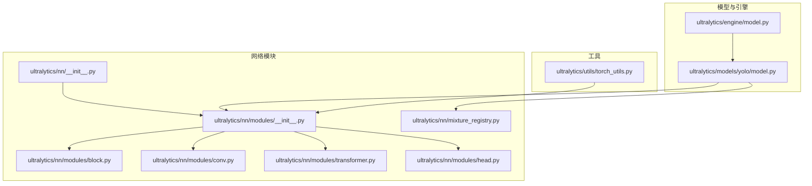
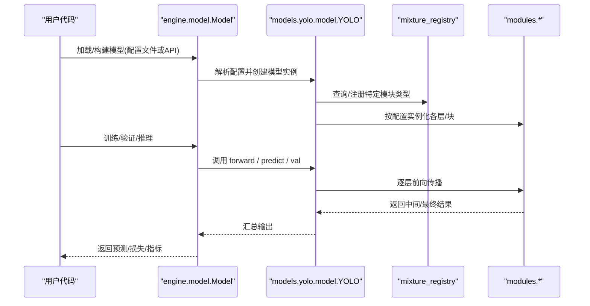
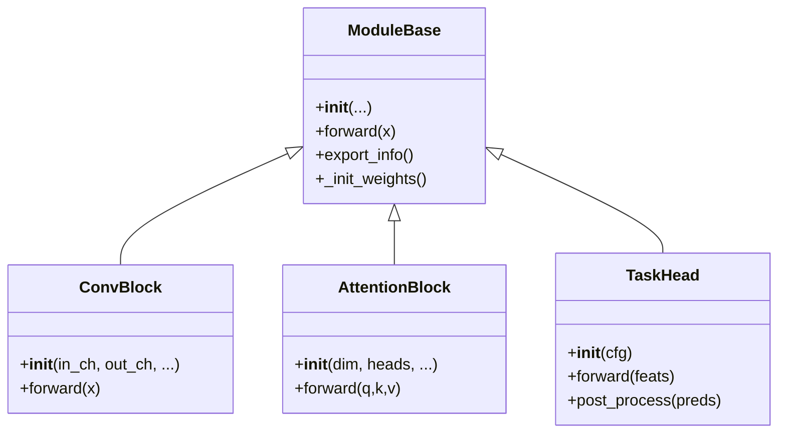
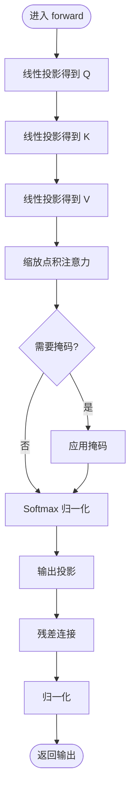
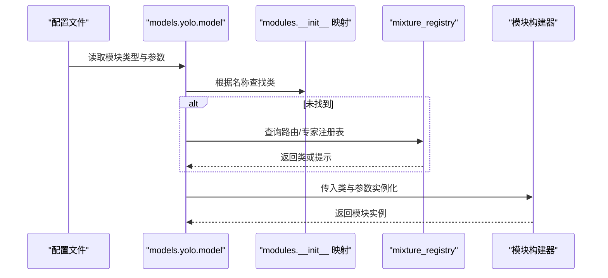
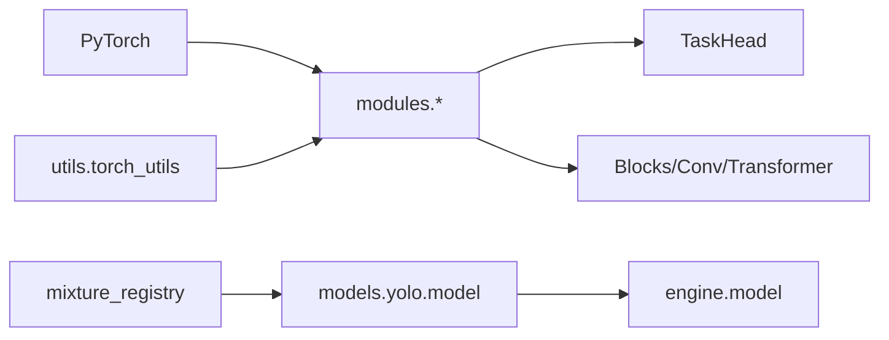

# 网络模块开发

<cite>
**本文引用的文件**
- [ultralytics/nn/__init__.py](file://ultralytics/nn/__init__.py)
- [ultralytics/nn/modules/__init__.py](file://ultralytics/nn/modules/__init__.py)
- [ultralytics/nn/modules/block.py](file://ultralytics/nn/modules/block.py)
- [ultralytics/nn/modules/head.py](file://ultralytics/nn/modules/head.py)
- [ultralytics/nn/modules/conv.py](file://ultralytics/nn/modules/conv.py)
- [ultralytics/nn/modules/transformer.py](file://ultralytics/nn/modules/transformer.py)
- [ultralytics/nn/mixture_registry.py](file://ultralytics/nn/mixture_registry.py)
- [ultralytics/models/yolo/model.py](file://ultralytics/models/yolo/model.py)
- [ultralytics/engine/model.py](file://ultralytics/engine/model.py)
- [ultralytics/utils/torch_utils.py](file://ultralytics/utils/torch_utils.py)
</cite>

## 目录
1. [简介](#简介)
2. [项目结构](#项目结构)
3. [核心组件](#核心组件)
4. [架构总览](#架构总览)
5. [详细组件分析](#详细组件分析)
6. [依赖关系分析](#依赖关系分析)
7. [性能考量](#性能考量)
8. [故障排查指南](#故障排查指南)
9. [结论](#结论)
10. [附录](#附录)

## 简介
本指南面向希望在 YOLO-Master 项目中扩展与自定义网络模块的开发者，聚焦以下目标：
- 自定义网络层的实现方法：层定义、前向传播与后处理逻辑
- 模块基类的继承结构与参数初始化、权重管理、梯度计算规范
- 复杂网络架构构建：多层组合、跳跃连接与注意力机制
- 模块注册与发现机制：自动发现与手动注册
- 完整示例：从简单卷积层到复杂注意力模块
- 性能测试与调试方法

## 项目结构
YOLO-Master 的网络模块主要位于 ultralytics/nn 下，其中：
- modules：基础算子与高层模块（如卷积、Transformer、Head）
- mixture_registry：混合专家/路由相关的注册表
- models/yolo：YOLO 模型装配与配置解析入口
- engine/model：引擎侧模型加载与执行
- utils/torch_utils：通用张量工具与训练辅助

图表来源
- [ultralytics/nn/__init__.py](file://ultralytics/nn/__init__.py)
- [ultralytics/nn/modules/__init__.py](file://ultralytics/nn/modules/__init__.py)
- [ultralytics/nn/modules/block.py](file://ultralytics/nn/modules/block.py)
- [ultralytics/nn/modules/conv.py](file://ultralytics/nn/modules/conv.py)
- [ultralytics/nn/modules/transformer.py](file://ultralytics/nn/modules/transformer.py)
- [ultralytics/nn/modules/head.py](file://ultralytics/nn/modules/head.py)
- [ultralytics/nn/mixture_registry.py](file://ultralytics/nn/mixture_registry.py)
- [ultralytics/models/yolo/model.py](file://ultralytics/models/yolo/model.py)
- [ultralytics/engine/model.py](file://ultralytics/engine/model.py)
- [ultralytics/utils/torch_utils.py](file://ultralytics/utils/torch_utils.py)

章节来源
- [ultralytics/nn/__init__.py](file://ultralytics/nn/__init__.py)
- [ultralytics/nn/modules/__init__.py](file://ultralytics/nn/modules/__init__.py)
- [ultralytics/nn/modules/block.py](file://ultralytics/nn/modules/block.py)
- [ultralytics/nn/modules/conv.py](file://ultralytics/nn/modules/conv.py)
- [ultralytics/nn/modules/transformer.py](file://ultralytics/nn/modules/transformer.py)
- [ultralytics/nn/modules/head.py](file://ultralytics/nn/modules/head.py)
- [ultralytics/nn/mixture_registry.py](file://ultralytics/nn/mixture_registry.py)
- [ultralytics/models/yolo/model.py](file://ultralytics/models/yolo/model.py)
- [ultralytics/engine/model.py](file://ultralytics/engine/model.py)
- [ultralytics/utils/torch_utils.py](file://ultralytics/utils/torch_utils.py)

## 核心组件
- 模块基类与导出协议
  - 所有可被模型装配的模块应遵循统一的接口约定，确保在构建、导出与推理阶段行为一致。
  - 关键职责包括：参数声明与初始化、前向传播、可选的后处理、以及导出时的图节点描述。
- 基础算子与块
  - 卷积族与激活、归一化等基础算子提供高性能实现，并支持多种后端优化。
  - 高层块（Block）封装常见模式（如残差、多分支融合），便于快速组合。
- Transformer 与注意力
  - 提供多头自注意力、交叉注意力与位置编码等组件，用于构建复杂特征交互。
- Head 模块
  - 检测/分割/姿态等任务头负责将骨干特征转换为任务输出，包含解码与后处理逻辑。
- 混合专家/路由注册表
  - 为 MoE/MoA 相关模块提供统一注册与发现能力，支持动态调度与权重合并。

章节来源
- [ultralytics/nn/modules/block.py](file://ultralytics/nn/modules/block.py)
- [ultralytics/nn/modules/conv.py](file://ultralytics/nn/modules/conv.py)
- [ultralytics/nn/modules/transformer.py](file://ultralytics/nn/modules/transformer.py)
- [ultralytics/nn/modules/head.py](file://ultralytics/nn/modules/head.py)
- [ultralytics/nn/mixture_registry.py](file://ultralytics/nn/mixture_registry.py)

## 架构总览
下图展示了从模型装配到模块实例化的整体流程，以及模块注册与发现的参与点。

图表来源
- [ultralytics/engine/model.py](file://ultralytics/engine/model.py)
- [ultralytics/models/yolo/model.py](file://ultralytics/models/yolo/model.py)
- [ultralytics/nn/mixture_registry.py](file://ultralytics/nn/mixture_registry.py)
- [ultralytics/nn/modules/__init__.py](file://ultralytics/nn/modules/__init__.py)

## 详细组件分析

### 模块基类与导出协议
- 设计要点
  - 统一的 __init__ 签名与参数命名规范，便于配置驱动构建。
  - 明确的 forward 输入/输出形状约定，避免维度歧义。
  - 导出钩子：在导出时生成稳定的图节点描述，保证跨后端一致性。
- 参数初始化与权重管理
  - 使用框架默认初始化策略，必要时覆盖关键权重（如注意力投影、门控）。
  - 对稀疏/路由权重进行特殊处理，确保在合并与剪枝流程中保持语义正确。
- 梯度计算
  - 避免在 forward 中进行破坏梯度的操作；如需数值稳定技巧，使用可导近似。
  - 对条件分支（如路由选择）采用平滑或可导替代，防止梯度断链。

章节来源
- [ultralytics/nn/modules/block.py](file://ultralytics/nn/modules/block.py)
- [ultralytics/nn/modules/conv.py](file://ultralytics/nn/modules/conv.py)
- [ultralytics/nn/modules/transformer.py](file://ultralytics/nn/modules/transformer.py)
- [ultralytics/nn/modules/head.py](file://ultralytics/nn/modules/head.py)

#### 类关系图（示意）

图表来源
- [ultralytics/nn/modules/block.py](file://ultralytics/nn/modules/block.py)
- [ultralytics/nn/modules/transformer.py](file://ultralytics/nn/modules/transformer.py)
- [ultralytics/nn/modules/head.py](file://ultralytics/nn/modules/head.py)

### 自定义卷积层开发示例
- 步骤概览
  - 定义层：在 modules 下新增 .py 文件，实现 __init__ 与 forward。
  - 注册：若需通过配置自动发现，需在模块包 __init__ 中暴露名称映射；否则可在模型装配处手动注册。
  - 集成：在 Block 或 Head 中使用新层，确保维度匹配与数据类型一致。
  - 导出：若涉及非标准算子，补充 export_info 以描述图节点。
- 注意事项
  - 保持前向函数无副作用，不修改全局状态。
  - 对大核卷积或分组卷积，注意内存占用与并行度。
  - 在训练与推理模式下行为一致，必要时使用 torch.no_grad 包裹导出路径。

章节来源
- [ultralytics/nn/modules/conv.py](file://ultralytics/nn/modules/conv.py)
- [ultralytics/nn/modules/__init__.py](file://ultralytics/nn/modules/__init__.py)

### 复杂注意力模块开发示例
- 设计要点
  - 多头注意力：分离 Q/K/V 投影，缩放点积，掩码与 softmax。
  - 位置编码：绝对/相对位置编码按需叠加。
  - 残差与归一化：遵循 Pre-LN 或 Post-LN 风格，保证稳定性。
  - 稀疏/路由：结合 mixture_registry 实现专家选择或门控。
- 前向后处理
  - 前向：输入序列 -> 线性投影 -> 注意力 -> 输出投影 -> 残差/归一化。
  - 后处理：可选的上下文聚合、特征重加权或裁剪。
- 复杂度与优化
  - 时间复杂度 O(N^2·D)，空间复杂度 O(N^2)。
  - 可使用分块注意力、KV缓存、FlashAttention 等加速（视后端支持）。

章节来源
- [ultralytics/nn/modules/transformer.py](file://ultralytics/nn/modules/transformer.py)
- [ultralytics/nn/mixture_registry.py](file://ultralytics/nn/mixture_registry.py)

#### 注意力前向流程图

图表来源
- [ultralytics/nn/modules/transformer.py](file://ultralytics/nn/modules/transformer.py)

### 模块注册与发现机制
- 自动发现
  - 在模块包的 __init__ 中维护名称到类的映射，模型装配时根据配置键查找对应类。
  - 建议提供默认别名与版本兼容映射，降低迁移成本。
- 手动注册
  - 在模型装配入口显式注册自定义类名，适用于第三方扩展或实验性模块。
- 混合专家/路由注册
  - 通过 mixture_registry 统一管理路由与专家模块，支持动态加载与权重合并。

章节来源
- [ultralytics/nn/modules/__init__.py](file://ultralytics/nn/modules/__init__.py)
- [ultralytics/nn/mixture_registry.py](file://ultralytics/nn/mixture_registry.py)
- [ultralytics/models/yolo/model.py](file://ultralytics/models/yolo/model.py)

#### 注册与装配时序图

图表来源
- [ultralytics/models/yolo/model.py](file://ultralytics/models/yolo/model.py)
- [ultralytics/nn/modules/__init__.py](file://ultralytics/nn/modules/__init__.py)
- [ultralytics/nn/mixture_registry.py](file://ultralytics/nn/mixture_registry.py)

### 复杂网络架构构建方法
- 多层组合
  - 使用 Block 组合多个卷积/注意力单元，形成深层骨干。
  - 通过通道数与步长控制特征图分辨率变化。
- 跳跃连接
  - 在解码阶段拼接或相加浅层特征，提升小目标召回。
  - 注意对齐尺寸与通道数，必要时插入轻量适配层。
- 注意力机制
  - 在瓶颈层或头部引入自/交叉注意力，增强全局建模。
  - 结合路由/门控实现条件计算，降低冗余。

章节来源
- [ultralytics/nn/modules/block.py](file://ultralytics/nn/modules/block.py)
- [ultralytics/nn/modules/transformer.py](file://ultralytics/nn/modules/transformer.py)
- [ultralytics/nn/modules/head.py](file://ultralytics/nn/modules/head.py)

## 依赖关系分析
- 模块间耦合
  - modules 内部低耦合，通过清晰接口交互；head 依赖 backbone 输出。
  - mixture_registry 与 model 装配解耦，便于替换路由策略。
- 外部依赖
  - torch 及其子模块（nn、autograd、functional）。
  - 可选后端加速库（如 FlashAttention、ONNX Runtime），由 utils/torch_utils 抽象。

图表来源
- [ultralytics/nn/modules/__init__.py](file://ultralytics/nn/modules/__init__.py)
- [ultralytics/nn/modules/conv.py](file://ultralytics/nn/modules/conv.py)
- [ultralytics/nn/modules/transformer.py](file://ultralytics/nn/modules/transformer.py)
- [ultralytics/nn/modules/head.py](file://ultralytics/nn/modules/head.py)
- [ultralytics/nn/mixture_registry.py](file://ultralytics/nn/mixture_registry.py)
- [ultralytics/models/yolo/model.py](file://ultralytics/models/yolo/model.py)
- [ultralytics/engine/model.py](file://ultralytics/engine/model.py)
- [ultralytics/utils/torch_utils.py](file://ultralytics/utils/torch_utils.py)

章节来源
- [ultralytics/nn/modules/__init__.py](file://ultralytics/nn/modules/__init__.py)
- [ultralytics/nn/mixture_registry.py](file://ultralytics/nn/mixture_registry.py)
- [ultralytics/models/yolo/model.py](file://ultralytics/models/yolo/model.py)
- [ultralytics/engine/model.py](file://ultralytics/engine/model.py)
- [ultralytics/utils/torch_utils.py](file://ultralytics/utils/torch_utils.py)

## 性能考量
- 算子选择
  - 优先使用内核优化的卷积/归一化实现；对注意力考虑分块或硬件加速。
- 内存与带宽
  - 减少中间张量复制，复用缓冲区；合理设置 batch 与分辨率。
- 训练稳定性
  - 使用混合精度与梯度累积；对路由/门控加入正则项，避免退化。
- 导出与部署
  - 提前进行导出预检，确保所有模块具备稳定图描述；对不支持算子提供回退实现。

[本节为通用指导，无需具体文件引用]

## 故障排查指南
- 常见问题
  - 维度不匹配：检查卷积/注意力前后通道与尺寸对齐。
  - 梯度消失/爆炸：检查归一化与残差连接顺序，调整学习率与初始化。
  - 路由不稳定：检查门控输出范围与温度系数，添加熵正则。
- 调试手段
  - 打印中间张量形状与统计量（均值/方差/NaN）。
  - 使用最小复现脚本隔离问题；逐步注释模块定位异常。
  - 导出图可视化，确认图节点与期望一致。

章节来源
- [ultralytics/utils/torch_utils.py](file://ultralytics/utils/torch_utils.py)
- [ultralytics/nn/modules/transformer.py](file://ultralytics/nn/modules/transformer.py)
- [ultralytics/nn/modules/head.py](file://ultralytics/nn/modules/head.py)

## 结论
通过在 YOLO-Master 中遵循统一的模块接口、清晰的注册机制与稳健的前后处理设计，可以高效地扩展自定义网络层与复杂架构。结合注意力与路由技术，能够在保持性能的同时获得更强的表达能力。建议在开发过程中重视导出兼容性、数值稳定性与性能基准，以确保从训练到部署的全链路可靠性。

[本节为总结性内容，无需具体文件引用]

## 附录
- 最佳实践清单
  - 明确输入输出形状与数据类型约束
  - 提供可配置的超参与默认值
  - 编写单元测试覆盖典型用例与边界情况
  - 在导出路径上增加健壮性检查
- 参考路径
  - 基础卷积与块：[ultralytics/nn/modules/conv.py](file://ultralytics/nn/modules/conv.py)、[ultralytics/nn/modules/block.py](file://ultralytics/nn/modules/block.py)
  - 注意力与Transformer：[ultralytics/nn/modules/transformer.py](file://ultralytics/nn/modules/transformer.py)
  - 任务头与后处理：[ultralytics/nn/modules/head.py](file://ultralytics/nn/modules/head.py)
  - 模块注册与发现：[ultralytics/nn/modules/__init__.py](file://ultralytics/nn/modules/__init__.py)、[ultralytics/nn/mixture_registry.py](file://ultralytics/nn/mixture_registry.py)
  - 模型装配与引擎：[ultralytics/models/yolo/model.py](file://ultralytics/models/yolo/model.py)、[ultralytics/engine/model.py](file://ultralytics/engine/model.py)
  - 工具与辅助：[ultralytics/utils/torch_utils.py](file://ultralytics/utils/torch_utils.py)