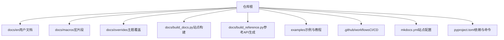
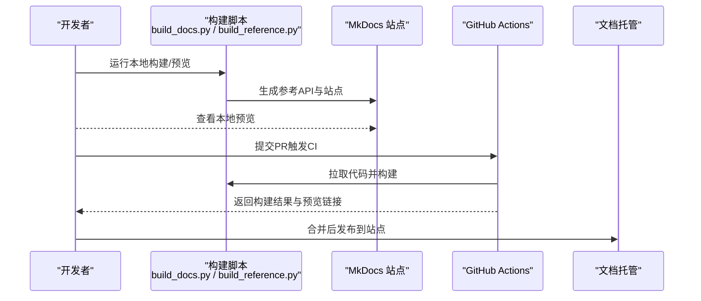
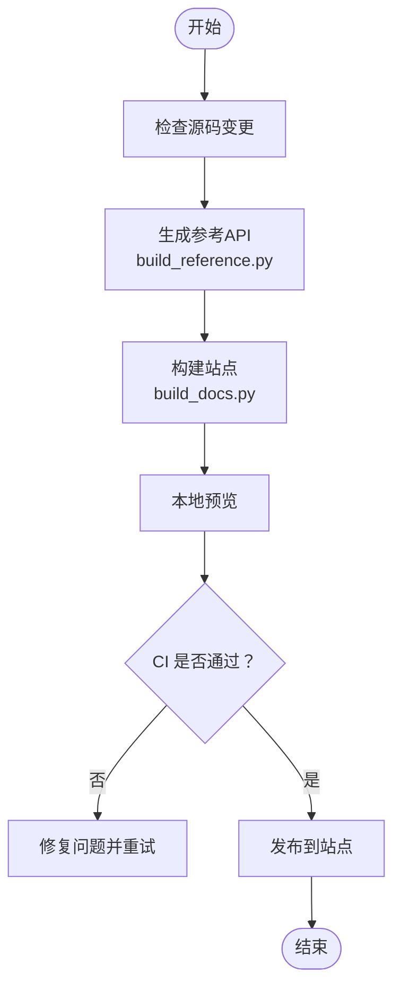
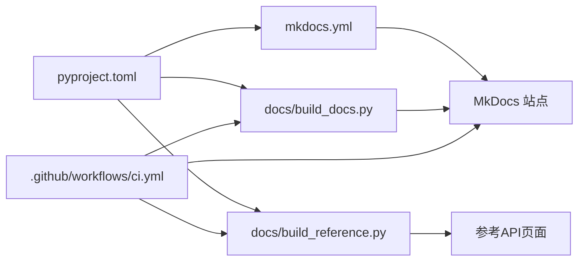

# 文档编写与发布

<cite>
**本文引用的文件**
- [mkdocs.yml](file://mkdocs.yml)
- [docs/build_docs.py](file://docs/build_docs.py)
- [docs/build_reference.py](file://docs/build_reference.py)
- [docs/README.md](file://docs/README.md)
- [CONTRIBUTING.md](file://CONTRIBUTING.md)
- [pyproject.toml](file://pyproject.toml)
- [.github/workflows/ci.yml](file://.github/workflows/ci.yml)
- [examples/README.md](file://examples/README.md)
- [examples/tutorial.ipynb](file://examples/tutorial.ipynb)
- [examples/hub.ipynb](file://examples/hub.ipynb)
- [examples/object_counting.ipynb](file://examples/object_counting.ipynb)
- [examples/object_tracking.ipynb](file://examples/object_tracking.ipynb)
- [examples/heatmaps.ipynb](file://examples/heatmaps.ipynb)
- [docs/en/index.md](file://docs/en/index.md)
- [docs/en/quickstart.md](file://docs/en/quickstart.md)
- [docs/en/help/contributing.md](file://docs/en/help/contributing.md)
- [docs/en/guides/yolo-common-issues.md](file://docs/en/guides/yolo-common-issues.md)
- [docs/en/reference/__init__.md](file://docs/en/reference/__init__.md)
- [docs/en/modes/index.md](file://docs/en/modes/index.md)
- [docs/en/models/index.md](file://docs/en/models/index.md)
- [docs/en/integrations/index.md](file://docs/en/integrations/index.md)
- [docs/en/platform/index.md](file://docs/en/platform/index.md)
- [docs/en/datasets/index.md](file://docs/en/datasets/index.md)
- [docs/en/solutions/index.md](file://docs/en/solutions/index.md)
- [docs/en/tasks/index.md](file://docs/en/tasks/index.md)
- [docs/en/usage/index.md](file://docs/en/usage/index.md)
- [docs/en/inference/index.md](file://docs/en/inference/index.md)
- [docs/en/hub/index.md](file://docs/en/hub/index.md)
- [docs/en/platform/api/index.md](file://docs/en/platform/api/index.md)
- [docs/en/reference/engine/index.md](file://docs/en/reference/engine/index.md)
- [docs/en/reference/models/index.md](file://docs/en/reference/models/index.md)
- [docs/en/reference/utils/index.md](file://docs/en/reference/utils/index.md)
- [docs/en/reference/data/index.md](file://docs/en/reference/data/index.md)
- [docs/en/reference/nn/index.md](file://docs/en/reference/nn/index.md)
- [docs/en/reference/optim/index.md](file://docs/en/reference/optim/index.md)
- [docs/en/reference/solutions/index.md](file://docs/en/reference/solutions/index.md)
- [docs/en/reference/trackers/index.md](file://docs/en/reference/trackers/index.md)
- [docs/en/reference/cfg/index.md](file://docs/en/reference/cfg/index.md)
- [docs/en/reference/hub/index.md](file://docs/en/reference/hub/index.md)
</cite>

## 目录
1. [简介](#简介)
2. [项目结构](#项目结构)
3. [核心组件](#核心组件)
4. [架构总览](#架构总览)
5. [详细组件分析](#详细组件分析)
6. [依赖分析](#依赖分析)
7. [性能考虑](#性能考虑)
8. [故障排除指南](#故障排除指南)
9. [结论](#结论)
10. [附录](#附录)

## 简介
本指南面向YOLO-Master项目的贡献者与维护者，系统化说明用户文档、开发者文档、示例代码的编写与维护规范，以及版本发布流程与自动化文档工具链。目标是确保文档质量一致、可追溯、可构建、可部署，并建立社区反馈收集与处理机制，提升整体可用性与协作效率。

## 项目结构
本项目采用多语言文档组织方式：英文文档位于 docs/en，根级 README 提供中文入口；参考文档由脚本从源码自动抽取生成；示例代码集中于 examples；文档站点通过 MkDocs 构建与部署；CI 工作流负责构建与预览。

图表来源
- [mkdocs.yml](file://mkdocs.yml)
- [docs/build_docs.py](file://docs/build_docs.py)
- [docs/build_reference.py](file://docs/build_reference.py)
- [examples/README.md](file://examples/README.md)
- [pyproject.toml](file://pyproject.toml)

章节来源
- [docs/README.md](file://docs/README.md)
- [mkdocs.yml](file://mkdocs.yml)
- [pyproject.toml](file://pyproject.toml)

## 核心组件
- 文档站点与导航
  - 站点入口与导航定义在 mkdocs.yml，包含首页、快速开始、模式、模型、集成、平台、数据集、解决方案、任务、用法、推理、Hub 等模块索引。
  - 参考 API 文档由 docs/build_reference.py 自动生成，按 engine、models、utils、data、nn、optim、solutions、trackers、cfg、hub 等子包组织。
- 构建与参考生成
  - docs/build_docs.py 负责站点构建与本地预览；docs/build_reference.py 负责从源码提取 docstring 生成参考页面。
- 示例与教程
  - examples 下提供可运行的 Python 与 Notebook 示例，包括 tutorial.ipynb、object_counting.ipynb、object_tracking.ipynb、heatmaps.ipynb、hub.ipynb 等。
- CI 与发布
  - .github/workflows/ci.yml 用于文档构建与检查；发布流程结合变更日志、向后兼容性检查与标记。

章节来源
- [mkdocs.yml](file://mkdocs.yml)
- [docs/build_docs.py](file://docs/build_docs.py)
- [docs/build_reference.py](file://docs/build_reference.py)
- [examples/README.md](file://examples/README.md)
- [examples/tutorial.ipynb](file://examples/tutorial.ipynb)
- [examples/hub.ipynb](file://examples/hub.ipynb)
- [examples/object_counting.ipynb](file://examples/object_counting.ipynb)
- [examples/object_tracking.ipynb](file://examples/object_tracking.ipynb)
- [examples/heatmaps.ipynb](file://examples/heatmaps.ipynb)
- [.github/workflows/ci.yml](file://.github/workflows/ci.yml)

## 架构总览
文档系统采用“源码驱动 + 静态站点”的架构：源码中的 docstring 与 Markdown 内容共同构成文档；构建阶段生成参考 API 页面并组装为 MkDocs 站点；CI 执行构建与预览；发布时更新变更日志并进行兼容性校验。

图表来源
- [docs/build_docs.py](file://docs/build_docs.py)
- [docs/build_reference.py](file://docs/build_reference.py)
- [mkdocs.yml](file://mkdocs.yml)
- [.github/workflows/ci.yml](file://.github/workflows/ci.yml)

## 详细组件分析

### 用户文档编写规范
- 结构与组织
  - 首页与导航：docs/en/index.md、docs/en/quickstart.md 作为入口与快速上手。
  - 模式与任务：docs/en/modes/index.md、docs/en/tasks/index.md 描述训练、验证、预测、跟踪、导出等模式。
  - 模型与集成：docs/en/models/index.md、docs/en/integrations/index.md 提供模型与第三方集成说明。
  - 平台与数据：docs/en/platform/index.md、docs/en/datasets/index.md 涵盖平台能力与数据集格式。
  - 解决方案与推理：docs/en/solutions/index.md、docs/en/inference/index.md 展示端到端方案与推理实践。
  - 使用指南：docs/en/usage/index.md 汇总常用用法与最佳实践。
- 写作要求
  - 每个功能点需包含：目标、前置条件、步骤、输出、常见问题。
  - 配图与表格应标注来源与用途，避免冗余。
  - 术语统一，首次出现给出定义或链接。
- API 文档
  - 参考页面由 docs/build_reference.py 自动生成，保持函数/类 docstring 完整、参数类型清晰、返回值说明明确。
  - 新增接口需在 docs/en/reference 对应子目录补充索引页（如 engine、models、utils 等）。
- 教程示例
  - 教程以 Notebook 为主，遵循可复现原则：固定随机种子、记录环境、提供最小数据集。
  - 示例需附带 requirements 与环境说明，确保一键运行。
- 故障排除指南
  - 常见错误分类：环境、数据、训练、导出、部署。
  - 每个问题提供症状、原因定位、解决步骤与相关参考链接。

章节来源
- [docs/en/index.md](file://docs/en/index.md)
- [docs/en/quickstart.md](file://docs/en/quickstart.md)
- [docs/en/modes/index.md](file://docs/en/modes/index.md)
- [docs/en/models/index.md](file://docs/en/models/index.md)
- [docs/en/integrations/index.md](file://docs/en/integrations/index.md)
- [docs/en/platform/index.md](file://docs/en/platform/index.md)
- [docs/en/datasets/index.md](file://docs/en/datasets/index.md)
- [docs/en/solutions/index.md](file://docs/en/solutions/index.md)
- [docs/en/tasks/index.md](file://docs/en/tasks/index.md)
- [docs/en/usage/index.md](file://docs/en/usage/index.md)
- [docs/en/inference/index.md](file://docs/en/inference/index.md)
- [docs/en/hub/index.md](file://docs/en/hub/index.md)
- [docs/en/reference/__init__.md](file://docs/en/reference/__init__.md)
- [docs/en/reference/engine/index.md](file://docs/en/reference/engine/index.md)
- [docs/en/reference/models/index.md](file://docs/en/reference/models/index.md)
- [docs/en/reference/utils/index.md](file://docs/en/reference/utils/index.md)
- [docs/en/reference/data/index.md](file://docs/en/reference/data/index.md)
- [docs/en/reference/nn/index.md](file://docs/en/reference/nn/index.md)
- [docs/en/reference/optim/index.md](file://docs/en/reference/optim/index.md)
- [docs/en/reference/solutions/index.md](file://docs/en/reference/solutions/index.md)
- [docs/en/reference/trackers/index.md](file://docs/en/reference/trackers/index.md)
- [docs/en/reference/cfg/index.md](file://docs/en/reference/cfg/index.md)
- [docs/en/reference/hub/index.md](file://docs/en/reference/hub/index.md)
- [docs/en/guides/yolo-common-issues.md](file://docs/en/guides/yolo-common-issues.md)

### 开发者文档要求
- 代码注释
  - 公共接口必须包含完整的 docstring：目的、参数、返回值、异常、示例路径。
  - 复杂逻辑添加行内注释，解释关键分支与边界条件。
- 架构说明
  - 新增模块需提供设计文档：背景、目标、约束、替代方案、决策依据。
  - 架构图与流程图置于 docs/plans 或 wiki，并在 PR 中引用。
- 设计决策记录
  - 变更记录于 docs/governance 或 plans，包含日期、影响范围、回滚策略。
  - 重大变更需进行兼容性评估与回归测试。

章节来源
- [CONTRIBUTING.md](file://CONTRIBUTING.md)
- [docs/en/help/contributing.md](file://docs/en/help/contributing.md)

### 示例代码维护方法
- 可运行示例
  - 每个示例目录包含 README 说明目标、环境与运行步骤。
  - Notebook 示例需保证可重复执行，必要时提供缓存或下载脚本。
- 更新流程
  - 修改示例后，本地验证通过再提交 PR；CI 会检查构建与基本运行。
  - 示例依赖变更需同步更新 requirements 或 pyproject 配置。
- 示例索引
  - examples/README.md 提供分类与导航，便于查找与学习。

章节来源
- [examples/README.md](file://examples/README.md)
- [examples/tutorial.ipynb](file://examples/tutorial.ipynb)
- [examples/hub.ipynb](file://examples/hub.ipynb)
- [examples/object_counting.ipynb](file://examples/object_counting.ipynb)
- [examples/object_tracking.ipynb](file://examples/object_tracking.ipynb)
- [examples/heatmaps.ipynb](file://examples/heatmaps.ipynb)

### 版本发布流程
- 变更日志
  - 每次特性或修复需记录变更摘要、影响范围、迁移指引。
  - 变更日志应与代码提交关联，便于回溯。
- 向后兼容性检查
  - 对公开 API 与配置文件进行兼容性矩阵评估，避免破坏性变更。
  - 若存在破坏性变更，提供迁移脚本与升级指南。
- 发布标记
  - 使用语义化版本标签，配合 CI 构建文档站点与示例产物。
  - 发布前完成全量构建、示例运行与回归测试。

章节来源
- [CONTRIBUTING.md](file://CONTRIBUTING.md)
- [docs/en/help/contributing.md](file://docs/en/help/contributing.md)

### 文档自动化工具链
- 构建与预览
  - 使用 docs/build_docs.py 进行本地构建与预览，确保站点渲染正确。
  - 使用 docs/build_reference.py 生成参考 API 页面，保持与源码同步。
- 站点配置
  - mkdocs.yml 定义站点元信息、导航、插件与主题覆盖。
- 依赖管理
  - pyproject.toml 声明构建与文档依赖，统一开发环境。
- CI 流水线
  - .github/workflows/ci.yml 在 PR 与合并时触发文档构建与检查，提供预览链接。

图表来源
- [docs/build_docs.py](file://docs/build_docs.py)
- [docs/build_reference.py](file://docs/build_reference.py)
- [mkdocs.yml](file://mkdocs.yml)
- [pyproject.toml](file://pyproject.toml)
- [.github/workflows/ci.yml](file://.github/workflows/ci.yml)

### 社区反馈收集与处理机制
- 收集渠道
  - GitHub Issues、讨论区、Pull Requests 评论。
  - 文档站点底部反馈表单或链接。
- 分类与优先级
  - 将反馈分为：文档错误、功能缺失、体验改进、安全与合规。
  - 根据影响面与频率设定优先级。
- 处理流程
  - 确认问题、复现步骤、提出修复方案、评审与合并、发布说明。
  - 定期回顾未决反馈，形成迭代计划。

章节来源
- [CONTRIBUTING.md](file://CONTRIBUTING.md)
- [docs/en/help/contributing.md](file://docs/en/help/contributing.md)

## 依赖分析
文档系统与构建依赖关系如下：

图表来源
- [pyproject.toml](file://pyproject.toml)
- [mkdocs.yml](file://mkdocs.yml)
- [docs/build_docs.py](file://docs/build_docs.py)
- [docs/build_reference.py](file://docs/build_reference.py)
- [.github/workflows/ci.yml](file://.github/workflows/ci.yml)

章节来源
- [pyproject.toml](file://pyproject.toml)
- [mkdocs.yml](file://mkdocs.yml)
- [docs/build_docs.py](file://docs/build_docs.py)
- [docs/build_reference.py](file://docs/build_reference.py)
- [.github/workflows/ci.yml](file://.github/workflows/ci.yml)

## 性能考虑
- 构建性能
  - 增量构建：仅重建变更页面，减少等待时间。
  - 并行生成：参考 API 与站点构建尽量并行执行。
- 资源占用
  - 控制示例数据大小，使用轻量数据集或缓存。
  - 限制 Notebook 执行时间与内存上限，避免 CI 超时。
- 缓存策略
  - 复用虚拟环境与依赖缓存，缩短构建周期。
  - 对大型模型权重与数据集提供预下载与校验。

## 故障排除指南
- 构建失败
  - 检查依赖安装与版本一致性；确认 mkdocs.yml 配置无误。
  - 参考 API 生成失败时，核对 docstring 与导入路径。
- 预览异常
  - 清理缓存并重新构建；检查主题覆盖与样式冲突。
- 示例无法运行
  - 验证环境依赖与设备可用性；检查数据路径与权限。
- 常见问题
  - 参考 docs/en/guides/yolo-common-issues.md 获取常见错误与解决方案。

章节来源
- [docs/en/guides/yolo-common-issues.md](file://docs/en/guides/yolo-common-issues.md)

## 结论
通过统一的文档规范、自动化构建与发布流程、严格的兼容性检查与社区反馈机制，YOLO-Master 的文档体系能够持续提供高质量、可维护、可扩展的用户与开发者体验。建议在新特性引入时同步更新文档与示例，确保文档与代码保持一致。

## 附录
- 快速开始
  - 本地构建：运行 docs/build_docs.py 启动预览。
  - 生成参考：运行 docs/build_reference.py 更新 API 页面。
  - 提交 PR：触发 CI 构建与检查，获得预览链接。
- 参考索引
  - 模式：docs/en/modes/index.md
  - 模型：docs/en/models/index.md
  - 集成：docs/en/integrations/index.md
  - 平台：docs/en/platform/index.md
  - 数据集：docs/en/datasets/index.md
  - 解决方案：docs/en/solutions/index.md
  - 任务：docs/en/tasks/index.md
  - 用法：docs/en/usage/index.md
  - 推理：docs/en/inference/index.md
  - Hub：docs/en/hub/index.md
  - 参考 API：docs/en/reference/*