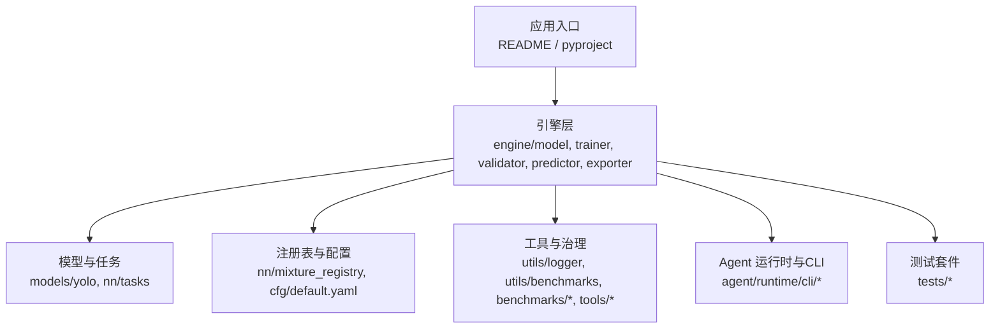
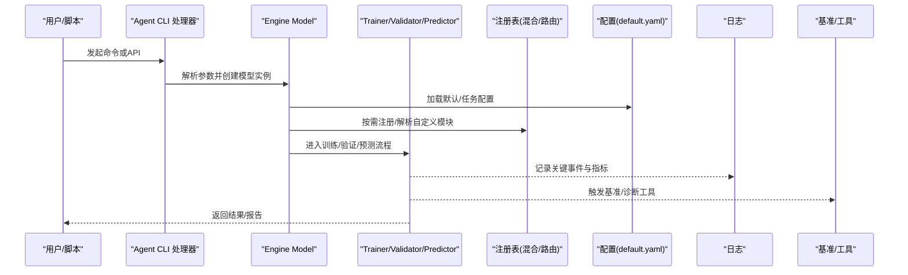
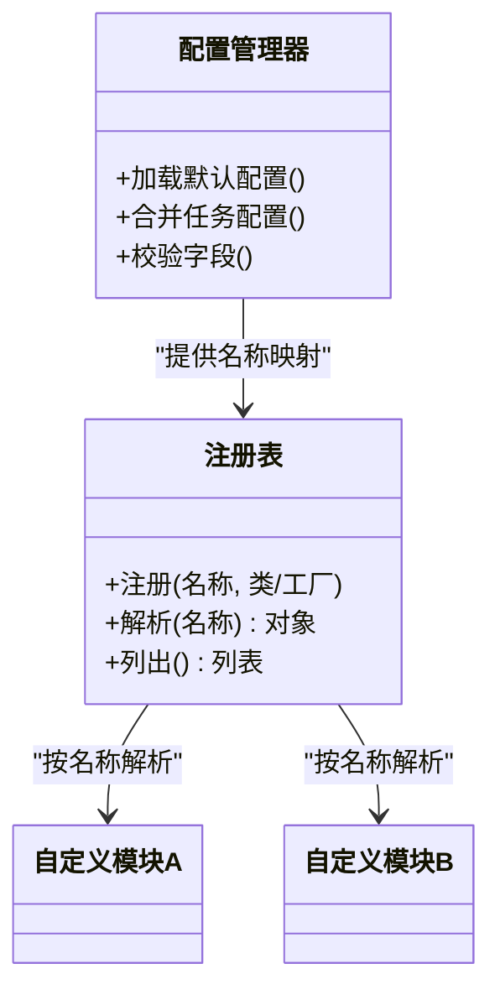
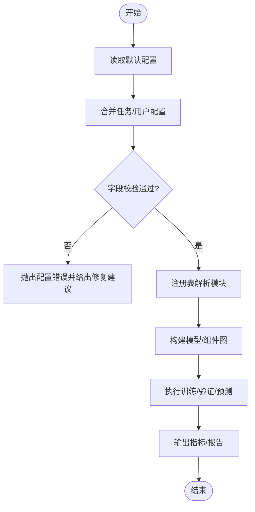
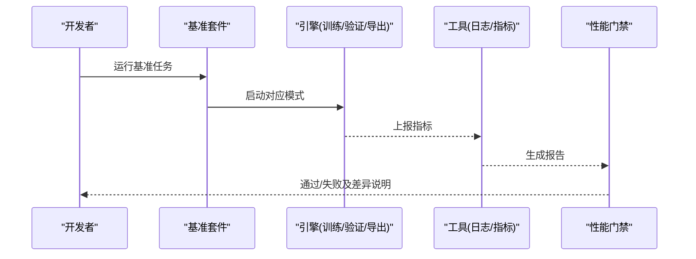
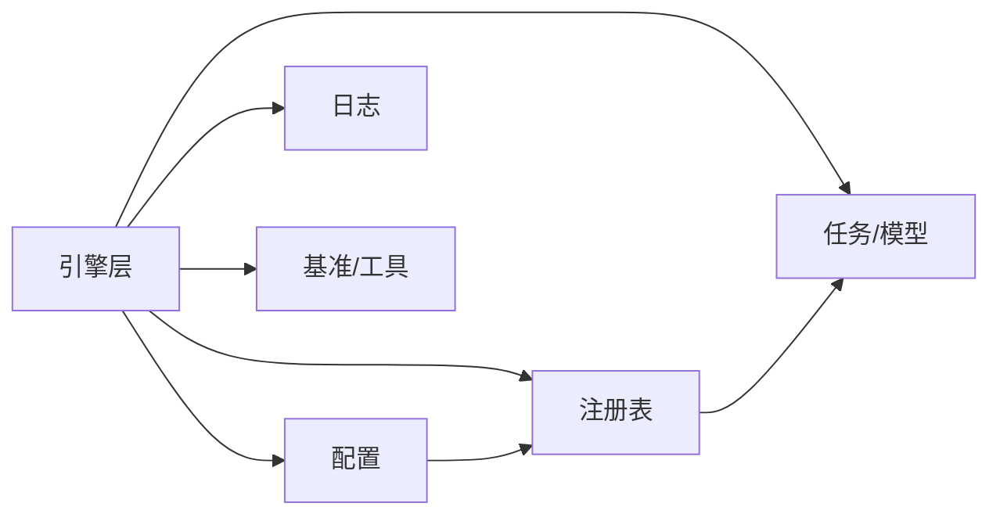

# 新特性开发指南

<cite>
**本文引用的文件**
- [README.md](file://README.md)
- [CONTRIBUTING.md](file://CONTRIBUTING.md)
- [pyproject.toml](file://pyproject.toml)
- [mkdocs.yml](file://mkdocs.yml)
- [ultralytics/__init__.py](file://ultralytics/__init__.py)
- [ultralytics/engine/model.py](file://ultralytics/engine/model.py)
- [ultralytics/engine/trainer.py](file://ultralytics/engine/trainer.py)
- [ultralytics/engine/validator.py](file://ultralytics/engine/validator.py)
- [ultralytics/engine/predictor.py](file://ultralytics/engine/predictor.py)
- [ultralytics/engine/exporter.py](file://ultralytics/engine/exporter.py)
- [ultralytics/models/yolo/model.py](file://ultralytics/models/yolo/model.py)
- [ultralytics/nn/mixture_registry.py](file://ultralytics/nn/mixture_registry.py)
- [ultralytics/nn/tasks.py](file://ultralytics/nn/tasks.py)
- [ultralytics/cfg/default.yaml](file://ultralytics/cfg/default.yaml)
- [ultralytics/utils/logger.py](file://ultralytics/utils/logger.py)
- [ultralytics/utils/benchmarks.py](file://ultralytics/utils/benchmarks.py)
- [benchmarks/run.py](file://benchmarks/run.py)
- [benchmarks/suite.py](file://benchmarks/suite.py)
- [tests/test_benchmark_suite.py](file://tests/test_benchmark_suite.py)
- [tests/test_model_registry.py](file://tests/test_model_registry.py)
- [tests/test_mixture_config_registry.py](file://tests/test_mixture_config_registry.py)
- [tools/config_drift_detector.py](file://tools/config_drift_detector.py)
- [docs/governance/performance-gates.md](file://docs/governance/performance-gates.md)
- [docs/governance/benchmark-suite.md](file://docs/governance/benchmark-suite.md)
- [agent/runtime/cli/core_handlers.py](file://agent/runtime/cli/core_handlers.py)
- [agent/runtime/cli/dispatcher.py](file://agent/runtime/cli/dispatcher.py)
</cite>

## 目录
1. [引言](#引言)
2. [项目结构](#项目结构)
3. [核心组件](#核心组件)
4. [架构总览](#架构总览)
5. [详细组件分析](#详细组件分析)
6. [依赖分析](#依赖分析)
7. [性能考虑](#性能考虑)
8. [故障排查指南](#故障排查指南)
9. [结论](#结论)
10. [附录](#附录)

## 引言
本指南面向希望在 YOLO-Master 项目中新增特性的开发者，覆盖从需求分析、设计文档与技术选型，到插件扩展、配置管理、接口集成与向后兼容、基准测试与性能评估、调试与日志、安全与风险评估、演示与用户文档、代码审查与合并流程的完整开发生命周期。目标是帮助你在不破坏现有系统稳定性的前提下，高效、可验证地交付高质量的新功能。

## 项目结构
YOLO-Master 采用分层模块化组织：
- 顶层入口与工程配置：README、CONTRIBUTING、pyproject、mkdocs 等
- 核心运行时与引擎：ultralytics/engine 下的模型、训练、验证、预测、导出
- 模型与任务定义：ultralytics/models 与 ultralytics/nn
- 配置与默认参数：ultralytics/cfg
- 工具与治理：benchmarks、tools、docs/governance
- Agent 运行时与 CLI：agent/runtime/cli
- 测试：tests

图表来源
- [README.md](file://README.md)
- [pyproject.toml](file://pyproject.toml)
- [ultralytics/engine/model.py](file://ultralytics/engine/model.py)
- [ultralytics/models/yolo/model.py](file://ultralytics/models/yolo/model.py)
- [ultralytics/nn/mixture_registry.py](file://ultralytics/nn/mixture_registry.py)
- [ultralytics/cfg/default.yaml](file://ultralytics/cfg/default.yaml)
- [benchmarks/run.py](file://benchmarks/run.py)
- [agent/runtime/cli/core_handlers.py](file://agent/runtime/cli/core_handlers.py)

章节来源
- [README.md](file://README.md)
- [CONTRIBUTING.md](file://CONTRIBUTING.md)
- [pyproject.toml](file://pyproject.toml)
- [mkdocs.yml](file://mkdocs.yml)

## 核心组件
- 模型与任务
  - 统一模型封装与生命周期管理（加载、推理、训练、导出）
  - 任务路由与多任务支持（检测、分割、姿态等）
- 训练与验证
  - 训练器负责优化循环、回调、检查点、分布式策略
  - 验证器负责指标计算、结果汇总与报告生成
- 预测与导出
  - 预测器提供推理流水线（预处理、后处理、可视化）
  - 导出器对接多种后端（ONNX/TensorRT/OpenVINO 等）
- 配置与注册
  - 默认配置与任务级配置
  - 模块注册表（如混合专家/路由相关）用于动态发现与装配
- 工具与治理
  - 日志、基准、漂移检测、能力矩阵等

章节来源
- [ultralytics/engine/model.py](file://ultralytics/engine/model.py)
- [ultralytics/engine/trainer.py](file://ultralytics/engine/trainer.py)
- [ultralytics/engine/validator.py](file://ultralytics/engine/validator.py)
- [ultralytics/engine/predictor.py](file://ultralytics/engine/predictor.py)
- [ultralytics/engine/exporter.py](file://ultralytics/engine/exporter.py)
- [ultralytics/models/yolo/model.py](file://ultralytics/models/yolo/model.py)
- [ultralytics/nn/tasks.py](file://ultralytics/nn/tasks.py)
- [ultralytics/nn/mixture_registry.py](file://ultralytics/nn/mixture_registry.py)
- [ultralytics/cfg/default.yaml](file://ultralytics/cfg/default.yaml)

## 架构总览
下图展示了新特性在系统中的典型接入点与数据流：配置驱动、注册表装配、引擎调用、工具链与测试闭环。

图表来源
- [agent/runtime/cli/core_handlers.py](file://agent/runtime/cli/core_handlers.py)
- [ultralytics/engine/model.py](file://ultralytics/engine/model.py)
- [ultralytics/engine/trainer.py](file://ultralytics/engine/trainer.py)
- [ultralytics/engine/validator.py](file://ultralytics/engine/validator.py)
- [ultralytics/engine/predictor.py](file://ultralytics/engine/predictor.py)
- [ultralytics/nn/mixture_registry.py](file://ultralytics/nn/mixture_registry.py)
- [ultralytics/cfg/default.yaml](file://ultralytics/cfg/default.yaml)
- [ultralytics/utils/logger.py](file://ultralytics/utils/logger.py)
- [benchmarks/run.py](file://benchmarks/run.py)

## 详细组件分析

### 插件系统与扩展机制
- 注册表模式
  - 通过统一的注册表进行模块发现与装配，避免硬编码耦合
  - 常见场景：混合专家路由、专家选择策略、损失组合、任务特定模块
- 自定义模块注册
  - 在模块实现处完成注册声明
  - 在配置中通过名称引用，由注册表解析并实例化
- 配置管理
  - 使用默认配置作为基线，任务级配置覆盖差异项
  - 新增字段需保证默认值与向后兼容

图表来源
- [ultralytics/nn/mixture_registry.py](file://ultralytics/nn/mixture_registry.py)
- [ultralytics/cfg/default.yaml](file://ultralytics/cfg/default.yaml)

章节来源
- [ultralytics/nn/mixture_registry.py](file://ultralytics/nn/mixture_registry.py)
- [ultralytics/cfg/default.yaml](file://ultralytics/cfg/default.yaml)
- [tests/test_mixture_config_registry.py](file://tests/test_mixture_config_registry.py)

### 新功能与现有系统的集成方法
- 接口设计原则
  - 以配置为中心：新增能力通过配置开关或参数启用
  - 最小侵入：优先在注册表与任务层扩展，避免修改核心训练/验证主循环
  - 明确契约：输入输出类型、错误码、日志格式保持一致
- 向后兼容性保证
  - 新增配置项必须提供默认值
  - 旧版配置在不显式指定新字段时行为不变
  - 对弃用字段提供迁移提示与兼容路径

图表来源
- [ultralytics/cfg/default.yaml](file://ultralytics/cfg/default.yaml)
- [ultralytics/nn/mixture_registry.py](file://ultralytics/nn/mixture_registry.py)
- [ultralytics/engine/model.py](file://ultralytics/engine/model.py)

章节来源
- [ultralytics/engine/model.py](file://ultralytics/engine/model.py)
- [ultralytics/cfg/default.yaml](file://ultralytics/cfg/default.yaml)
- [tests/test_default_config_integrity.py](file://tests/test_default_config_integrity.py)

### 性能评估与基准测试集成
- 基准套件
  - 统一入口与用例编排，支持数据集、任务、硬件、批大小等维度
  - 与治理文档对齐，确保回归门禁
- 集成方式
  - 在训练/验证/导出流程中插入轻量探针，收集吞吐、延迟、内存占用
  - 将结果写入标准格式，便于对比与可视化
- 回归门禁
  - 基于治理文档定义的阈值与基线，自动判定是否放行

图表来源
- [benchmarks/run.py](file://benchmarks/run.py)
- [benchmarks/suite.py](file://benchmarks/suite.py)
- [docs/governance/performance-gates.md](file://docs/governance/performance-gates.md)
- [docs/governance/benchmark-suite.md](file://docs/governance/benchmark-suite.md)
- [tests/test_benchmark_suite.py](file://tests/test_benchmark_suite.py)

章节来源
- [benchmarks/run.py](file://benchmarks/run.py)
- [benchmarks/suite.py](file://benchmarks/suite.py)
- [docs/governance/performance-gates.md](file://docs/governance/performance-gates.md)
- [docs/governance/benchmark-suite.md](file://docs/governance/benchmark-suite.md)
- [tests/test_benchmark_suite.py](file://tests/test_benchmark_suite.py)

### 调试与日志记录最佳实践
- 结构化日志
  - 统一日志级别与格式，包含上下文信息（任务、设备、批次号）
  - 关键路径打点：初始化、配置加载、模块注册、训练步、验证步、导出阶段
- 诊断工具
  - 利用内置工具进行配置漂移检测、路由解释、导出能力矩阵校验
- 可观测性
  - 指标采集与可视化，结合基准套件形成前后对比

章节来源
- [ultralytics/utils/logger.py](file://ultralytics/utils/logger.py)
- [tools/config_drift_detector.py](file://tools/config_drift_detector.py)
- [ultralytics/utils/benchmarks.py](file://ultralytics/utils/benchmarks.py)

### 安全考虑与风险评估
- 配置安全
  - 禁止在生产环境开启高开销调试选项
  - 敏感参数（密钥、路径）通过环境变量注入，避免硬编码
- 依赖与导入
  - 仅引入必要依赖，控制第三方库版本范围
  - 对动态导入进行白名单校验，防止任意代码执行
- 数据与模型
  - 输入校验与边界检查，防止越界与异常形状
  - 导出产物签名与完整性校验，降低篡改风险

[本节为通用指导，无需具体文件来源]

### 功能演示与用户文档编写要求
- 演示脚本
  - 提供端到端示例，覆盖安装、配置、训练/验证/导出、可视化
  - 包含最小可复现实例与常见问题FAQ
- 文档规范
  - 使用 mkdocs 组织文档，遵循既有结构与风格
  - 新增页面需更新索引与导航，保持跨页链接有效

章节来源
- [mkdocs.yml](file://mkdocs.yml)
- [docs/index.html](file://docs/index.html)

### 代码审查与合并流程
- 提交前自检
  - 运行单元测试与基准套件，确保无回归
  - 更新相关文档与变更日志
- 审查清单
  - 接口契约与兼容性
  - 配置默认值与迁移策略
  - 性能影响与基准结果
  - 安全与隐私影响
- 合并策略
  - 小步快跑、频繁PR；必要时分阶段上线与灰度发布

章节来源
- [CONTRIBUTING.md](file://CONTRIBUTING.md)

## 依赖分析
- 模块内聚与耦合
  - 引擎层相对独立，通过注册表与配置解耦具体实现
  - 任务与模型定义集中在 models/nn 层，便于替换与扩展
- 外部依赖
  - 基准与工具依赖第三方库，需在 pyproject 中声明版本约束
- 潜在循环依赖
  - 避免在注册表与配置之间形成双向依赖，应单向解析

图表来源
- [ultralytics/engine/model.py](file://ultralytics/engine/model.py)
- [ultralytics/nn/mixture_registry.py](file://ultralytics/nn/mixture_registry.py)
- [ultralytics/cfg/default.yaml](file://ultralytics/cfg/default.yaml)
- [ultralytics/utils/logger.py](file://ultralytics/utils/logger.py)
- [benchmarks/run.py](file://benchmarks/run.py)

章节来源
- [pyproject.toml](file://pyproject.toml)
- [ultralytics/engine/model.py](file://ultralytics/engine/model.py)
- [ultralytics/nn/mixture_registry.py](file://ultralytics/nn/mixture_registry.py)
- [ultralytics/cfg/default.yaml](file://ultralytics/cfg/default.yaml)

## 性能考虑
- 训练/验证
  - 合理设置批大小与精度，关注显存峰值与吞吐
  - 使用缓存与预取减少I/O瓶颈
- 导出
  - 针对不同后端选择合适的优化选项，平衡体积与速度
- 监控
  - 持续采集关键指标，建立基线与告警阈值

[本节为通用指导，无需具体文件来源]

## 故障排查指南
- 配置问题
  - 使用配置漂移检测工具定位不一致项
  - 核对默认配置与任务配置的差异
- 注册表问题
  - 确认模块已正确注册且名称一致
  - 检查解析顺序与依赖关系
- 基准与回归
  - 查看基准报告中的差异项，定位性能退化原因
- 日志与诊断
  - 提升日志级别，捕获关键路径上下文
  - 使用路由解释与导出能力矩阵辅助定位

章节来源
- [tools/config_drift_detector.py](file://tools/config_drift_detector.py)
- [tests/test_mixture_config_registry.py](file://tests/test_mixture_config_registry.py)
- [tests/test_benchmark_suite.py](file://tests/test_benchmark_suite.py)
- [ultralytics/utils/logger.py](file://ultralytics/utils/logger.py)

## 结论
通过在注册表与配置层面进行扩展，配合完善的基准测试、日志与治理流程，可以在保证向后兼容的前提下快速交付高质量的新特性。建议在每个迭代中同步完善文档与演示，确保用户与下游团队能顺利上手与验证。

## 附录
- 常用入口参考
  - 模型与任务：[ultralytics/engine/model.py](file://ultralytics/engine/model.py)、[ultralytics/models/yolo/model.py](file://ultralytics/models/yolo/model.py)、[ultralytics/nn/tasks.py](file://ultralytics/nn/tasks.py)
  - 训练/验证/预测/导出：[ultralytics/engine/trainer.py](file://ultralytics/engine/trainer.py)、[ultralytics/engine/validator.py](file://ultralytics/engine/validator.py)、[ultralytics/engine/predictor.py](file://ultralytics/engine/predictor.py)、[ultralytics/engine/exporter.py](file://ultralytics/engine/exporter.py)
  - 注册表与配置：[ultralytics/nn/mixture_registry.py](file://ultralytics/nn/mixture_registry.py)、[ultralytics/cfg/default.yaml](file://ultralytics/cfg/default.yaml)
  - 基准与工具：[benchmarks/run.py](file://benchmarks/run.py)、[benchmarks/suite.py](file://benchmarks/suite.py)、[tools/config_drift_detector.py](file://tools/config_drift_detector.py)
  - 治理文档：[docs/governance/performance-gates.md](file://docs/governance/performance-gates.md)、[docs/governance/benchmark-suite.md](file://docs/governance/benchmark-suite.md)
  - Agent CLI：[agent/runtime/cli/core_handlers.py](file://agent/runtime/cli/core_handlers.py)、[agent/runtime/cli/dispatcher.py](file://agent/runtime/cli/dispatcher.py)