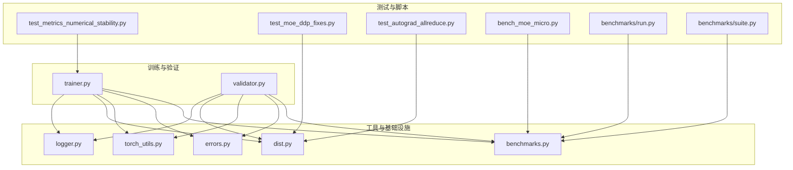
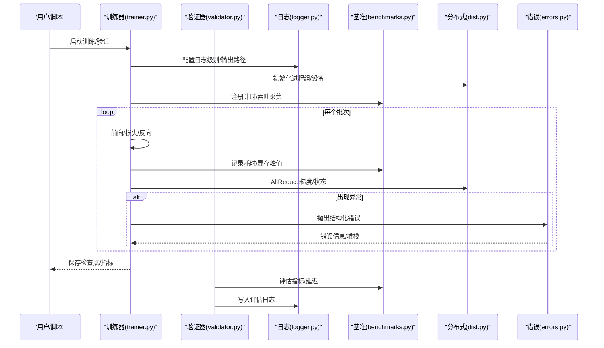
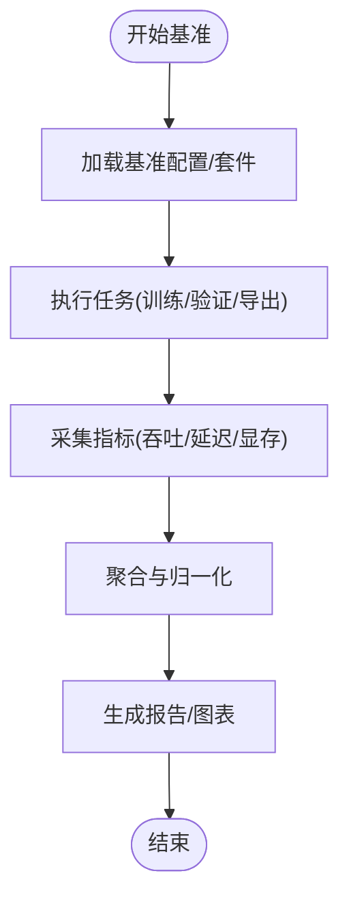
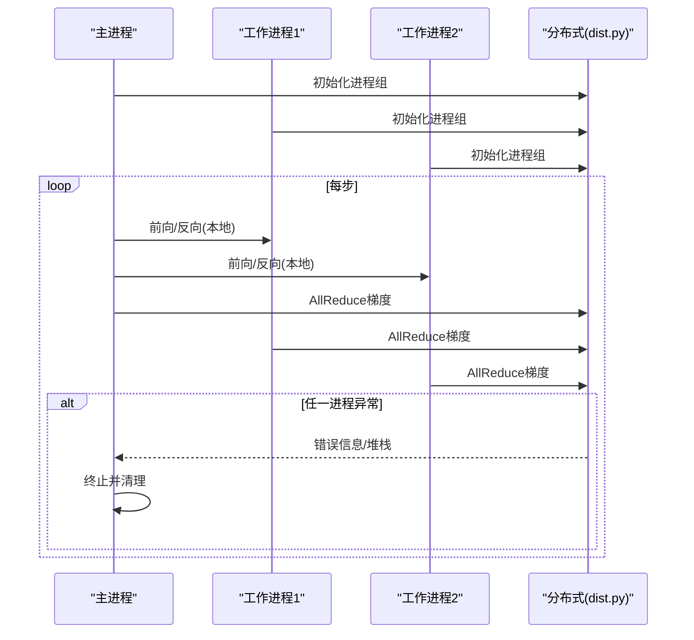
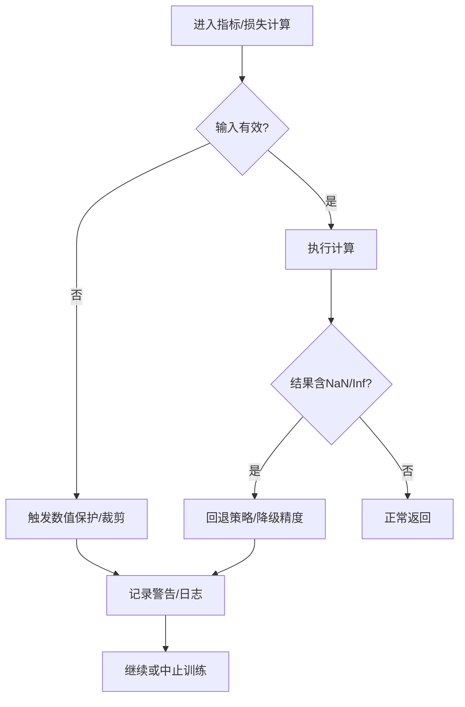
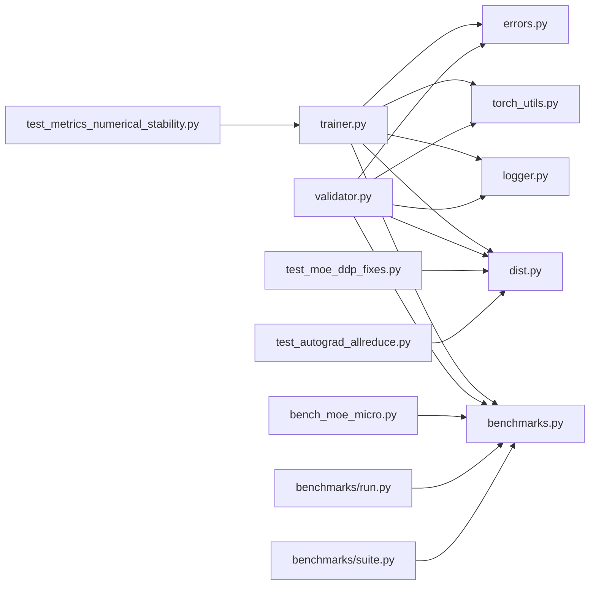

# 调试与性能分析

<cite>
**本文引用的文件**
- [README.md](file://README.md)
- [pyproject.toml](file://pyproject.toml)
- [ultralytics/utils/logger.py](file://ultralytics/utils/logger.py)
- [ultralytics/utils/benchmarks.py](file://ultralytics/utils/benchmarks.py)
- [ultralytics/engine/trainer.py](file://ultralytics/engine/trainer.py)
- [ultralytics/engine/validator.py](file://ultralytics/engine/validator.py)
- [ultralytics/utils/dist.py](file://ultralytics/utils/dist.py)
- [ultralytics/utils/torch_utils.py](file://ultralytics/utils/torch_utils.py)
- [ultralytics/utils/errors.py](file://ultralytics/utils/errors.py)
- [tests/test_metrics_numerical_stability.py](file://tests/test_metrics_numerical_stability.py)
- [tests/test_moe_ddp_fixes.py](file://tests/test_moe_ddp_fixes.py)
- [tests/test_autograd_allreduce.py](file://tests/test_autograd_allreduce.py)
- [scripts/bench_moe_micro.py](file://scripts/bench_moe_micro.py)
- [benchmarks/run.py](file://benchmarks/run.py)
- [benchmarks/suite.py](file://benchmarks/suite.py)
</cite>

## 目录
1. [简介](#简介)
2. [项目结构](#项目结构)
3. [核心组件](#核心组件)
4. [架构总览](#架构总览)
5. [详细组件分析](#详细组件分析)
6. [依赖关系分析](#依赖关系分析)
7. [性能考量](#性能考量)
8. [故障排查指南](#故障排查指南)
9. [结论](#结论)
10. [附录](#附录)

## 简介
本指南面向YOLO-Master新特性的调试与性能分析，覆盖日志记录、断点调试、错误追踪、内存与GPU利用率监控、计算瓶颈识别、数值稳定性问题（如NaN/Inf）、梯度消失检测、内存泄漏定位、分布式训练（多进程通信与同步）的排障方法，以及性能优化最佳实践与性能报告生成与分析流程。文档以仓库现有实现为依据，提供可操作的步骤与可视化流程图，帮助读者快速定位问题并提升训练/推理效率。

## 项目结构
围绕调试与性能分析，本项目在以下位置提供了关键能力：
- 日志与事件：统一日志工具与训练/验证回调集成
- 基准与评测：内置基准套件与微基准脚本
- 分布式：DDP通信、AllReduce、设备与进程管理
- 数值稳定与错误处理：异常层次、数值稳定性测试
- 示例与脚本：MoE微基准、端到端基准运行入口

图表来源
- [ultralytics/engine/trainer.py](file://ultralytics/engine/trainer.py)
- [ultralytics/engine/validator.py](file://ultralytics/engine/validator.py)
- [ultralytics/utils/logger.py](file://ultralytics/utils/logger.py)
- [ultralytics/utils/benchmarks.py](file://ultralytics/utils/benchmarks.py)
- [ultralytics/utils/dist.py](file://ultralytics/utils/dist.py)
- [ultralytics/utils/torch_utils.py](file://ultralytics/utils/torch_utils.py)
- [ultralytics/utils/errors.py](file://ultralytics/utils/errors.py)
- [tests/test_metrics_numerical_stability.py](file://tests/test_metrics_numerical_stability.py)
- [tests/test_moe_ddp_fixes.py](file://tests/test_moe_ddp_fixes.py)
- [tests/test_autograd_allreduce.py](file://tests/test_autograd_allreduce.py)
- [scripts/bench_moe_micro.py](file://scripts/bench_moe_micro.py)
- [benchmarks/run.py](file://benchmarks/run.py)
- [benchmarks/suite.py](file://benchmarks/suite.py)

章节来源
- [README.md](file://README.md)
- [pyproject.toml](file://pyproject.toml)

## 核心组件
- 日志系统：集中式日志输出，支持分级、格式化与训练/验证阶段的事件上报，便于断点前后上下文复现与结果回溯。
- 基准与评测：统一的基准运行器与套件定义，支持吞吐/延迟统计、指标汇总与报告生成。
- 分布式通信：封装进程组初始化、AllReduce、广播等集合通信原语，提供训练/验证中的跨进程同步与错误传播。
- 数值稳定性与错误处理：异常层次化、数值检查与诊断辅助，配合单元测试覆盖常见不稳定场景。
- 微基准与端到端基准：针对MoE等模块的微基准与完整基准流水线，用于定位热点与回归。

章节来源
- [ultralytics/utils/logger.py](file://ultralytics/utils/logger.py)
- [ultralytics/utils/benchmarks.py](file://ultralytics/utils/benchmarks.py)
- [ultralytics/utils/dist.py](file://ultralytics/utils/dist.py)
- [ultralytics/utils/torch_utils.py](file://ultralytics/utils/torch_utils.py)
- [ultralytics/utils/errors.py](file://ultralytics/utils/errors.py)
- [tests/test_metrics_numerical_stability.py](file://tests/test_metrics_numerical_stability.py)
- [tests/test_moe_ddp_fixes.py](file://tests/test_moe_ddp_fixes.py)
- [tests/test_autograd_allreduce.py](file://tests/test_autograd_allreduce.py)
- [scripts/bench_moe_micro.py](file://scripts/bench_moe_micro.py)
- [benchmarks/run.py](file://benchmarks/run.py)
- [benchmarks/suite.py](file://benchmarks/suite.py)

## 架构总览
下图展示训练/验证主流程与调试/性能工具的集成点：训练循环调用日志与基准接口；分布式层负责进程间通信；错误处理贯穿全链路；数值稳定性测试与微基准作为质量门禁。

图表来源
- [ultralytics/engine/trainer.py](file://ultralytics/engine/trainer.py)
- [ultralytics/engine/validator.py](file://ultralytics/engine/validator.py)
- [ultralytics/utils/logger.py](file://ultralytics/utils/logger.py)
- [ultralytics/utils/benchmarks.py](file://ultralytics/utils/benchmarks.py)
- [ultralytics/utils/dist.py](file://ultralytics/utils/dist.py)
- [ultralytics/utils/errors.py](file://ultralytics/utils/errors.py)

## 详细组件分析

### 日志系统与断点调试
- 日志等级与输出：通过统一日志接口设置级别、目标（控制台/文件），在训练/验证的关键节点输出上下文信息，便于断点前后对比。
- 断点调试建议：
  - 在训练循环的前向/损失/反向处插入断点，结合日志查看输入张量形状、dtype与范围。
  - 使用分布式时，确保仅在主进程打印关键信息，避免刷屏干扰。
  - 将随机种子、超参、数据加载参数一并写入日志，提高复现性。
- 事件上报：将关键指标（loss、学习率、显存占用）以结构化格式记录，便于后续聚合与可视化。

章节来源
- [ultralytics/utils/logger.py](file://ultralytics/utils/logger.py)
- [ultralytics/engine/trainer.py](file://ultralytics/engine/trainer.py)
- [ultralytics/engine/validator.py](file://ultralytics/engine/validator.py)

### 基准与性能分析工具
- 基准套件：通过基准运行器与套件定义，统一执行训练/验证/导出等任务，收集吞吐、延迟、资源占用等指标。
- 微基准：针对特定模块（如MoE路由、专家选择）进行细粒度计时与内存采样，定位热点。
- 指标与报告：基准框架支持汇总与导出，便于横向对比不同配置或模型变体。

图表来源
- [benchmarks/run.py](file://benchmarks/run.py)
- [benchmarks/suite.py](file://benchmarks/suite.py)
- [ultralytics/utils/benchmarks.py](file://ultralytics/utils/benchmarks.py)
- [scripts/bench_moe_micro.py](file://scripts/bench_moe_micro.py)

章节来源
- [benchmarks/run.py](file://benchmarks/run.py)
- [benchmarks/suite.py](file://benchmarks/suite.py)
- [ultralytics/utils/benchmarks.py](file://ultralytics/utils/benchmarks.py)
- [scripts/bench_moe_micro.py](file://scripts/bench_moe_micro.py)

### 分布式训练调试（多进程通信与同步）
- 进程组与设备：分布式初始化后，各进程绑定到指定设备，确保数据并行一致性与负载均衡。
- AllReduce与同步：梯度与中间状态的集合通信需保证顺序与一致性，异常应向上层传播以便根因定位。
- 常见问题：
  - 进程死锁：检查所有collective调用是否成对且路径一致。
  - 梯度不一致：核对AllReduce参与集与步数对齐。
  - 错误传播：利用错误层次与结构化异常，快速定位失败进程与原因。

图表来源
- [ultralytics/utils/dist.py](file://ultralytics/utils/dist.py)
- [tests/test_moe_ddp_fixes.py](file://tests/test_moe_ddp_fixes.py)
- [tests/test_autograd_allreduce.py](file://tests/test_autograd_allreduce.py)

章节来源
- [ultralytics/utils/dist.py](file://ultralytics/utils/dist.py)
- [tests/test_moe_ddp_fixes.py](file://tests/test_moe_ddp_fixes.py)
- [tests/test_autograd_allreduce.py](file://tests/test_autograd_allreduce.py)

### 数值稳定性与错误追踪
- 数值稳定性：在指标计算与损失组合中引入数值保护（如防除零、裁剪、类型转换），并通过单元测试覆盖边界条件。
- 错误追踪：采用结构化异常层次，包含错误码、上下文信息与堆栈，便于自动化分析与告警。
- 典型问题：
  - NaN/Inf：检查激活值范围、学习率过大、数值溢出。
  - 梯度消失/爆炸：监控梯度范数与分布，调整网络初始化与正则。

图表来源
- [tests/test_metrics_numerical_stability.py](file://tests/test_metrics_numerical_stability.py)
- [ultralytics/utils/errors.py](file://ultralytics/utils/errors.py)
- [ultralytics/utils/torch_utils.py](file://ultralytics/utils/torch_utils.py)

章节来源
- [tests/test_metrics_numerical_stability.py](file://tests/test_metrics_numerical_stability.py)
- [ultralytics/utils/errors.py](file://ultralytics/utils/errors.py)
- [ultralytics/utils/torch_utils.py](file://ultralytics/utils/torch_utils.py)

### 内存使用监控与GPU利用率
- 内存监控：在训练/验证关键节点采样显存峰值与分配情况，结合基准框架输出趋势图。
- GPU利用率：通过基准套件统计吞吐与时延，识别CPU/GPU/IO瓶颈。
- 操作建议：
  - 减少不必要的张量拷贝与中间变量保留。
  - 合理设置批大小与数据加载线程，平衡吞吐与显存。
  - 对热点算子使用混合精度或后端优化（如适用）。

章节来源
- [ultralytics/utils/benchmarks.py](file://ultralytics/utils/benchmarks.py)
- [benchmarks/run.py](file://benchmarks/run.py)
- [scripts/bench_moe_micro.py](file://scripts/bench_moe_micro.py)

### 计算瓶颈识别与优化
- 热点定位：使用微基准对候选模块（如路由、专家、NMS）进行逐段计时，比较不同实现与参数。
- 工程优化：
  - 数据管线：预取、缓存、异步I/O。
  - 模型侧：算子融合、稀疏化、量化（按部署需求）。
  - 分布式：梯度压缩、重叠通信与计算。
- 算法优化：
  - 动态调度（如MoE专家选择阈值）。
  - 损失加权与早停策略，避免无效迭代。

章节来源
- [scripts/bench_moe_micro.py](file://scripts/bench_moe_micro.py)
- [benchmarks/suite.py](file://benchmarks/suite.py)
- [ultralytics/utils/benchmarks.py](file://ultralytics/utils/benchmarks.py)

## 依赖关系分析
- 训练/验证模块依赖日志、基准、分布式与错误处理工具。
- 基准套件依赖运行器与工具函数，提供统一度量口径。
- 分布式模块为训练/验证提供进程组与集合通信能力。
- 数值稳定性与错误处理贯穿全链路，保障健壮性。

图表来源
- [ultralytics/engine/trainer.py](file://ultralytics/engine/trainer.py)
- [ultralytics/engine/validator.py](file://ultralytics/engine/validator.py)
- [ultralytics/utils/logger.py](file://ultralytics/utils/logger.py)
- [ultralytics/utils/benchmarks.py](file://ultralytics/utils/benchmarks.py)
- [ultralytics/utils/dist.py](file://ultralytics/utils/dist.py)
- [ultralytics/utils/torch_utils.py](file://ultralytics/utils/torch_utils.py)
- [ultralytics/utils/errors.py](file://ultralytics/utils/errors.py)
- [tests/test_metrics_numerical_stability.py](file://tests/test_metrics_numerical_stability.py)
- [tests/test_moe_ddp_fixes.py](file://tests/test_moe_ddp_fixes.py)
- [tests/test_autograd_allreduce.py](file://tests/test_autograd_allreduce.py)
- [scripts/bench_moe_micro.py](file://scripts/bench_moe_micro.py)
- [benchmarks/run.py](file://benchmarks/run.py)
- [benchmarks/suite.py](file://benchmarks/suite.py)

## 性能考量
- 批大小与数据加载：增大批大小提升吞吐但增加显存；数据加载线程与缓存策略影响整体时延。
- 混合精度与算子优化：在可用环境下启用混合精度，优先使用高效后端实现。
- 分布式通信：尽量重叠通信与计算，减少同步点；校验AllReduce参与集一致性。
- 监控与回归：将基准指标纳入CI，防止性能退化。

[本节为通用指导，不直接分析具体文件]

## 故障排查指南
- 数值稳定性问题
  - 现象：loss为NaN/Inf、指标异常。
  - 排查：检查输入范围、学习率、数值保护逻辑；参考数值稳定性测试用例思路。
- 梯度消失/爆炸
  - 现象：训练停滞或发散。
  - 排查：监控梯度范数与分布，调整初始化、正则与优化器参数。
- 内存泄漏
  - 现象：显存持续增长。
  - 排查：定位未释放的中间张量与缓存；使用微基准隔离可疑模块。
- 分布式同步问题
  - 现象：进程卡住或结果不一致。
  - 排查：核对collective调用路径与次数；检查错误传播与日志。

章节来源
- [tests/test_metrics_numerical_stability.py](file://tests/test_metrics_numerical_stability.py)
- [tests/test_moe_ddp_fixes.py](file://tests/test_moe_ddp_fixes.py)
- [tests/test_autograd_allreduce.py](file://tests/test_autograd_allreduce.py)
- [ultralytics/utils/errors.py](file://ultralytics/utils/errors.py)
- [ultralytics/utils/torch_utils.py](file://ultralytics/utils/torch_utils.py)

## 结论
通过统一的日志、基准与分布式工具链，YOLO-Master为新特性调试与性能分析提供了坚实基础。建议在日常开发中：
- 以基准套件为度量基线，持续监控吞吐/延迟与资源占用。
- 在关键路径加入结构化日志与数值保护，提升可观测性与鲁棒性。
- 针对分布式场景完善错误传播与同步校验，降低定位成本。
- 将性能回归纳入自动化流程，确保版本演进的质量。

[本节为总结性内容，不直接分析具体文件]

## 附录
- 常用命令与入口
  - 基准运行：参考基准运行器与套件定义。
  - 微基准：针对特定模块的快速计时与采样。
- 参考文档与说明
  - 项目概览与使用说明：参见项目根目录说明文件与配置文件。

章节来源
- [benchmarks/run.py](file://benchmarks/run.py)
- [benchmarks/suite.py](file://benchmarks/suite.py)
- [scripts/bench_moe_micro.py](file://scripts/bench_moe_micro.py)
- [README.md](file://README.md)
- [pyproject.toml](file://pyproject.toml)