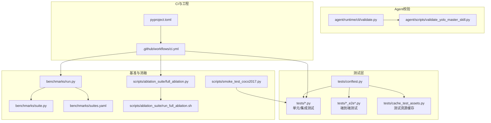
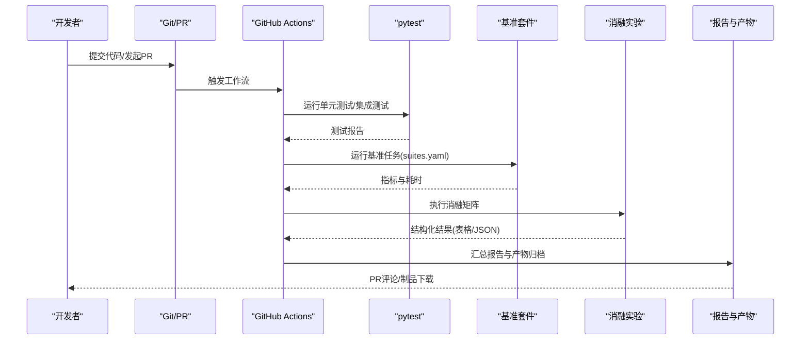
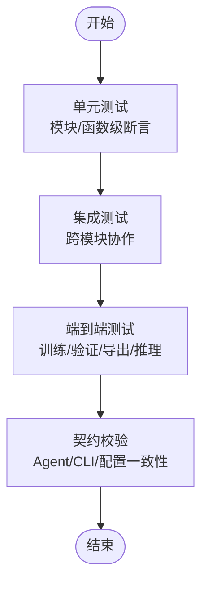
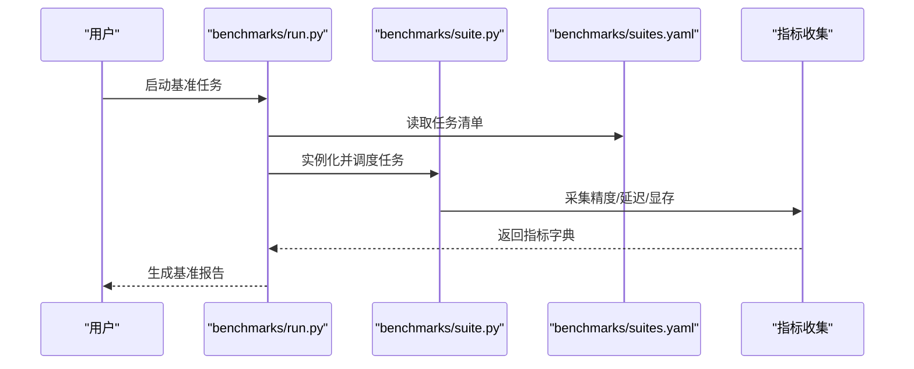
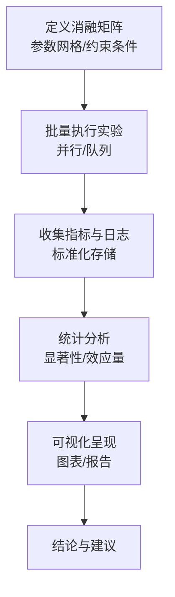
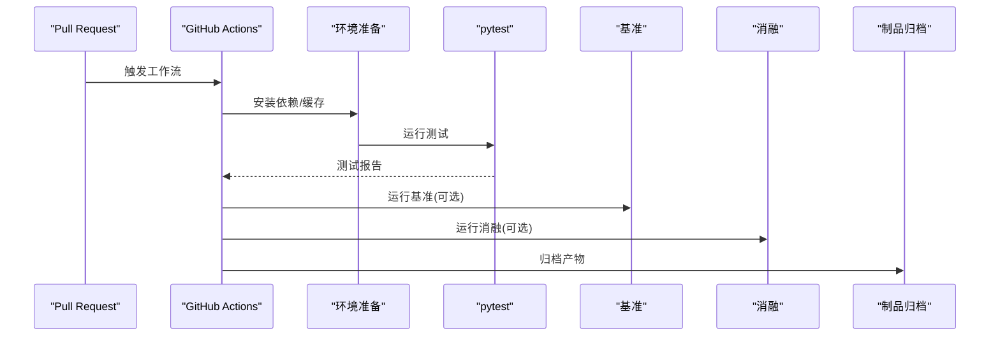
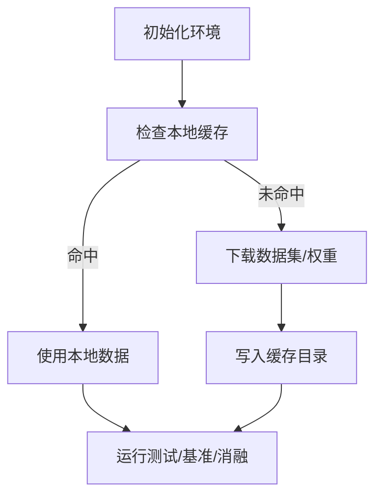
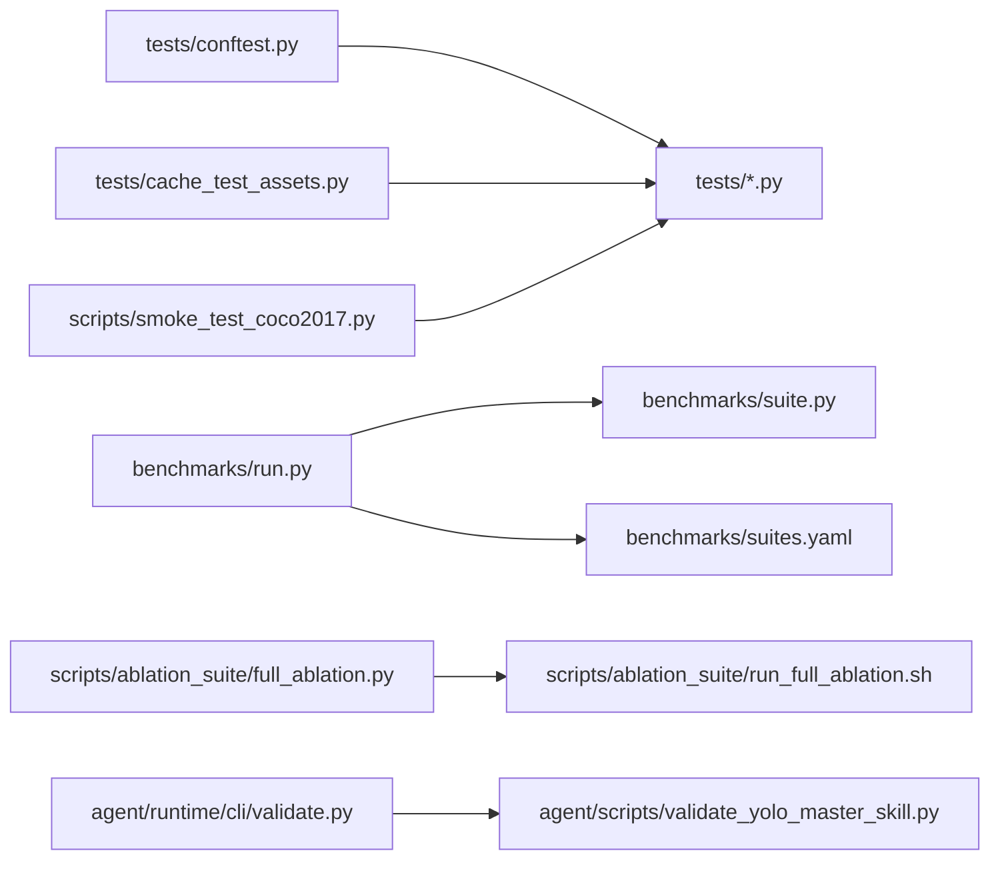

# 集成测试与验证

<cite>
**本文引用的文件**
- [tests/conftest.py](file://tests/conftest.py)
- [tests/test_benchmark_suite.py](file://tests/test_benchmark_suite.py)
- [tests/test_cli.py](file://tests/test_cli.py)
- [tests/test_engine.py](file://tests/test_engine.py)
- [tests/test_moe.py](file://tests/test_moe.py)
- [tests/test_molora.py](file://tests/test_molora.py)
- [tests/test_mot.py](file://tests/test_mot.py)
- [tests/test_peft_adapters.py](file://tests/test_peft_adapters.py)
- [tests/test_planner_integration.py](file://tests/test_planner_integration.py)
- [tests/test_exports.py](file://tests/test_exports.py)
- [tests/test_integrations.py](file://tests/test_integrations.py)
- [tests/cache_test_assets.py](file://tests/cache_test_assets.py)
- [benchmarks/run.py](file://benchmarks/run.py)
- [benchmarks/suite.py](file://benchmarks/suite.py)
- [benchmarks/suites.yaml](file://benchmarks/suites.yaml)
- [scripts/ablation_suite/full_ablation.py](file://scripts/ablation_suite/full_ablation.py)
- [scripts/ablation_suite/run_full_ablation.sh](file://scripts/ablation_suite/run_full_ablation.sh)
- [scripts/smoke_test_coco2017.py](file://scripts/smoke_test_coco2017.py)
- [agent/runtime/cli/validate.py](file://agent/runtime/cli/validate.py)
- [agent/scripts/validate_yolo_master_skill.py](file://agent/scripts/validate_yolo_master_skill.py)
- [.github/workflows/ci.yml](file://.github/workflows/ci.yml)
- [pyproject.toml](file://pyproject.toml)
</cite>

## 目录
1. [简介](#简介)
2. [项目结构](#项目结构)
3. [核心组件](#核心组件)
4. [架构总览](#架构总览)
5. [详细组件分析](#详细组件分析)
6. [依赖关系分析](#依赖关系分析)
7. [性能考量](#性能考量)
8. [故障排查指南](#故障排查指南)
9. [结论](#结论)
10. [附录](#附录)

## 简介
本指南面向YOLO-Master新特性的集成测试与验证，覆盖以下目标：
- 制定分层测试策略（单元测试、集成测试、端到端测试）
- 构建基准测试体系（指标定义、对比实验设计）
- 实施消融实验流程（变量控制、结果分析）
- 自动化回归测试与CI/CD流水线集成
- 测试数据管理（数据集准备与版本控制）
- 测试结果分析与工具使用

## 项目结构
仓库已具备完善的测试与基准基础设施。关键位置如下：
- 测试用例：tests/
- 基准套件：benchmarks/
- 消融实验脚本：scripts/ablation_suite/
- 快速冒烟脚本：scripts/smoke_test_coco2017.py
- Agent侧校验入口：agent/runtime/cli/validate.py、agent/scripts/validate_yolo_master_skill.py
- CI配置：.github/workflows/ci.yml
- 包与依赖：pyproject.toml

图表来源
- [tests/conftest.py](file://tests/conftest.py)
- [tests/cache_test_assets.py](file://tests/cache_test_assets.py)
- [benchmarks/run.py](file://benchmarks/run.py)
- [benchmarks/suite.py](file://benchmarks/suite.py)
- [benchmarks/suites.yaml](file://benchmarks/suites.yaml)
- [scripts/ablation_suite/full_ablation.py](file://scripts/ablation_suite/full_ablation.py)
- [scripts/ablation_suite/run_full_ablation.sh](file://scripts/ablation_suite/run_full_ablation.sh)
- [scripts/smoke_test_coco2017.py](file://scripts/smoke_test_coco2017.py)
- [agent/runtime/cli/validate.py](file://agent/runtime/cli/validate.py)
- [agent/scripts/validate_yolo_master_skill.py](file://agent/scripts/validate_yolo_master_skill.py)
- [.github/workflows/ci.yml](file://.github/workflows/ci.yml)
- [pyproject.toml](file://pyproject.toml)

章节来源
- [tests/conftest.py](file://tests/conftest.py)
- [tests/cache_test_assets.py](file://tests/cache_test_assets.py)
- [benchmarks/run.py](file://benchmarks/run.py)
- [benchmarks/suite.py](file://benchmarks/suite.py)
- [benchmarks/suites.yaml](file://benchmarks/suites.yaml)
- [scripts/ablation_suite/full_ablation.py](file://scripts/ablation_suite/full_ablation.py)
- [scripts/ablation_suite/run_full_ablation.sh](file://scripts/ablation_suite/run_full_ablation.sh)
- [scripts/smoke_test_coco2017.py](file://scripts/smoke_test_coco2017.py)
- [agent/runtime/cli/validate.py](file://agent/runtime/cli/validate.py)
- [agent/scripts/validate_yolo_master_skill.py](file://agent/scripts/validate_yolo_master_skill.py)
- [.github/workflows/ci.yml](file://.github/workflows/ci.yml)
- [pyproject.toml](file://pyproject.toml)

## 核心组件
- 测试框架与夹具
  - conftest.py提供全局夹具、设备选择、日志与临时目录管理，统一测试环境。
  - cache_test_assets.py用于下载/缓存小样本数据集与权重，加速本地与CI执行。
- 基准测试套件
  - benchmarks/run.py与suite.py定义基准运行器与任务编排；suites.yaml声明数据集、模型与指标组合。
- 消融实验
  - scripts/ablation_suite/full_ablation.py与run_full_ablation.sh组织多场景、多变量的消融矩阵，输出结构化报告。
- 冒烟与端到端
  - scripts/smoke_test_coco2017.py用于快速验证训练/验证/导出链路。
  - tests/*_e2e*.py覆盖跨模块的完整工作流。
- Agent侧校验
  - agent/runtime/cli/validate.py与agent/scripts/validate_yolo_master_skill.py提供技能级契约校验与一致性检查。
- CI/CD
  - .github/workflows/ci.yml串联pytest、基准与消融任务，实现自动化回归。

章节来源
- [tests/conftest.py](file://tests/conftest.py)
- [tests/cache_test_assets.py](file://tests/cache_test_assets.py)
- [benchmarks/run.py](file://benchmarks/run.py)
- [benchmarks/suite.py](file://benchmarks/suite.py)
- [benchmarks/suites.yaml](file://benchmarks/suites.yaml)
- [scripts/ablation_suite/full_ablation.py](file://scripts/ablation_suite/full_ablation.py)
- [scripts/ablation_suite/run_full_ablation.sh](file://scripts/ablation_suite/run_full_ablation.sh)
- [scripts/smoke_test_coco2017.py](file://scripts/smoke_test_coco2017.py)
- [agent/runtime/cli/validate.py](file://agent/runtime/cli/validate.py)
- [agent/scripts/validate_yolo_master_skill.py](file://agent/scripts/validate_yolo_master_skill.py)

## 架构总览
下图展示从代码变更到测试、基准、消融与报告的端到端流水线。

图表来源
- [.github/workflows/ci.yml](file://.github/workflows/ci.yml)
- [benchmarks/run.py](file://benchmarks/run.py)
- [benchmarks/suite.py](file://benchmarks/suite.py)
- [benchmarks/suites.yaml](file://benchmarks/suites.yaml)
- [scripts/ablation_suite/full_ablation.py](file://scripts/ablation_suite/full_ablation.py)

## 详细组件分析

### 测试策略与分层设计
- 单元测试
  - 聚焦函数/类级别行为，如导出、引擎、Mixture/MoE路由、PEFT适配器等。
  - 参考用例：
    - [tests/test_engine.py](file://tests/test_engine.py)
    - [tests/test_moe.py](file://tests/test_moe.py)
    - [tests/test_molora.py](file://tests/test_molora.py)
    - [tests/test_peft_adapters.py](file://tests/test_peft_adapters.py)
    - [tests/test_exports.py](file://tests/test_exports.py)
- 集成测试
  - 覆盖跨模块交互，如MoA/MoT、Planner集成、导出前后一致性等。
  - 参考用例：
    - [tests/test_moa.py](file://tests/test_moa.py)
    - [tests/test_mot.py](file://tests/test_mot.py)
    - [tests/test_planner_integration.py](file://tests/test_planner_integration.py)
    - [tests/test_integrations.py](file://tests/test_integrations.py)
- 端到端测试
  - 以真实或迷你数据集驱动完整训练/验证/导出/推理链路。
  - 参考用例：
    - [tests/test_lovo_e2e.py](file://tests/test_lovo_e2e.py)
    - [scripts/smoke_test_coco2017.py](file://scripts/smoke_test_coco2017.py)
- 契约与校验
  - 通过Agent侧校验脚本保障技能契约与配置一致性。
  - 参考入口：
    - [agent/runtime/cli/validate.py](file://agent/runtime/cli/validate.py)
    - [agent/scripts/validate_yolo_master_skill.py](file://agent/scripts/validate_yolo_master_skill.py)

章节来源
- [tests/test_engine.py](file://tests/test_engine.py)
- [tests/test_moe.py](file://tests/test_moe.py)
- [tests/test_molora.py](file://tests/test_molora.py)
- [tests/test_peft_adapters.py](file://tests/test_peft_adapters.py)
- [tests/test_exports.py](file://tests/test_exports.py)
- [tests/test_moa.py](file://tests/test_moa.py)
- [tests/test_mot.py](file://tests/test_mot.py)
- [tests/test_planner_integration.py](file://tests/test_planner_integration.py)
- [tests/test_integrations.py](file://tests/test_integrations.py)
- [tests/test_lovo_e2e.py](file://tests/test_lovo_e2e.py)
- [scripts/smoke_test_coco2017.py](file://scripts/smoke_test_coco2017.py)
- [agent/runtime/cli/validate.py](file://agent/runtime/cli/validate.py)
- [agent/scripts/validate_yolo_master_skill.py](file://agent/scripts/validate_yolo_master_skill.py)

### 基准测试构建方法
- 指标定义
  - 精度指标：mAP、mAP50、mAP75、每类别AP等
  - 效率指标：吞吐(QPS)、延迟(P50/P95)、显存占用、CPU/GPU利用率
  - 稳定性指标：多次运行的方差、收敛曲线波动
- 对比实验设计
  - 基线模型 vs 新特性分支
  - 不同数据集规模与分布（COCO、VisDrone、自定义小集）
  - 不同硬件后端（CUDA、OpenVINO、ONNXRuntime等）
- 运行方式
  - 通过benchmarks/run.py加载suites.yaml中的任务集合，批量执行并汇总指标。
  - 参考：
    - [benchmarks/run.py](file://benchmarks/run.py)
    - [benchmarks/suite.py](file://benchmarks/suite.py)
    - [benchmarks/suites.yaml](file://benchmarks/suites.yaml)

图表来源
- [benchmarks/run.py](file://benchmarks/run.py)
- [benchmarks/suite.py](file://benchmarks/suite.py)
- [benchmarks/suites.yaml](file://benchmarks/suites.yaml)

章节来源
- [benchmarks/run.py](file://benchmarks/run.py)
- [benchmarks/suite.py](file://benchmarks/suite.py)
- [benchmarks/suites.yaml](file://benchmarks/suites.yaml)

### 消融实验实施流程
- 变量控制
  - 维度示例：路由策略、专家数量、LoRA秩、混合损失权重、多尺度输入、采样策略等
  - 通过full_ablation.py定义参数网格，结合run_full_ablation.sh批量执行
- 结果分析
  - 输出结构化结果（CSV/JSON），便于后续可视化与统计检验
  - 建议关注主效应与交互效应，绘制热力图/折线图辅助决策
- 参考实现
  - [scripts/ablation_suite/full_ablation.py](file://scripts/ablation_suite/full_ablation.py)
  - [scripts/ablation_suite/run_full_ablation.sh](file://scripts/ablation_suite/run_full_ablation.sh)

章节来源
- [scripts/ablation_suite/full_ablation.py](file://scripts/ablation_suite/full_ablation.py)
- [scripts/ablation_suite/run_full_ablation.sh](file://scripts/ablation_suite/run_full_ablation.sh)

### 回归测试自动化与CI/CD集成
- 触发条件
  - 推送/PR事件触发工作流，按阶段执行冒烟、测试、基准与消融
- 阶段划分
  - 安装依赖与缓存
  - 运行pytest（含标记过滤）
  - 运行基准套件（可选）
  - 运行消融实验（可选）
  - 上传产物与报告
- 参考配置
  - [.github/workflows/ci.yml](file://.github/workflows/ci.yml)
  - [pyproject.toml](file://pyproject.toml)

图表来源
- [.github/workflows/ci.yml](file://.github/workflows/ci.yml)
- [pyproject.toml](file://pyproject.toml)

章节来源
- [.github/workflows/ci.yml](file://.github/workflows/ci.yml)
- [pyproject.toml](file://pyproject.toml)

### 测试数据管理与版本控制
- 数据准备
  - 使用cache_test_assets.py在首次运行时自动下载/缓存小样本数据集与权重，避免重复网络请求
  - 对大型数据集建议使用外部存储（对象存储/HF Hub）并通过符号链接或数据卷挂载
- 版本控制
  - 将配置文件、基准任务清单、消融矩阵纳入版本控制
  - 对不可变的数据快照使用哈希或标签记录，确保可复现
- 参考实现
  - [tests/cache_test_assets.py](file://tests/cache_test_assets.py)

图表来源
- [tests/cache_test_assets.py](file://tests/cache_test_assets.py)

章节来源
- [tests/cache_test_assets.py](file://tests/cache_test_assets.py)

### 测试结果分析与工具使用
- 终端查看
  - pytest --collect-only / --tb=short / -v 等常用选项
  - 参考：[tests/test_cli.py](file://tests/test_cli.py)
- 基准报告
  - 基准套件输出结构化指标，便于横向对比
  - 参考：[benchmarks/run.py](file://benchmarks/run.py)
- 消融报告
  - 全量消融脚本输出汇总结果，支持后续可视化
  - 参考：[scripts/ablation_suite/full_ablation.py](file://scripts/ablation_suite/full_ablation.py)
- Agent校验
  - 通过validate入口进行契约一致性检查
  - 参考：[agent/runtime/cli/validate.py](file://agent/runtime/cli/validate.py), [agent/scripts/validate_yolo_master_skill.py](file://agent/scripts/validate_yolo_master_skill.py)

章节来源
- [tests/test_cli.py](file://tests/test_cli.py)
- [benchmarks/run.py](file://benchmarks/run.py)
- [scripts/ablation_suite/full_ablation.py](file://scripts/ablation_suite/full_ablation.py)
- [agent/runtime/cli/validate.py](file://agent/runtime/cli/validate.py)
- [agent/scripts/validate_yolo_master_skill.py](file://agent/scripts/validate_yolo_master_skill.py)

## 依赖关系分析
- 测试与基准耦合点
  - conftest为所有测试提供共享夹具；benchmark suite由run.py驱动，读取suites.yaml
  - 消融脚本独立于测试，但复用相同的数据与模型接口
- 外部依赖
  - 数据集与权重通过缓存机制获取；CI中需配置必要的凭据与缓存键
- 潜在循环依赖
  - 测试与基准均依赖核心引擎与模型注册表，应避免在测试中引入生产路径的全量初始化

图表来源
- [tests/conftest.py](file://tests/conftest.py)
- [tests/cache_test_assets.py](file://tests/cache_test_assets.py)
- [benchmarks/run.py](file://benchmarks/run.py)
- [benchmarks/suite.py](file://benchmarks/suite.py)
- [benchmarks/suites.yaml](file://benchmarks/suites.yaml)
- [scripts/ablation_suite/full_ablation.py](file://scripts/ablation_suite/full_ablation.py)
- [scripts/ablation_suite/run_full_ablation.sh](file://scripts/ablation_suite/run_full_ablation.sh)
- [scripts/smoke_test_coco2017.py](file://scripts/smoke_test_coco2017.py)
- [agent/runtime/cli/validate.py](file://agent/runtime/cli/validate.py)
- [agent/scripts/validate_yolo_master_skill.py](file://agent/scripts/validate_yolo_master_skill.py)

章节来源
- [tests/conftest.py](file://tests/conftest.py)
- [tests/cache_test_assets.py](file://tests/cache_test_assets.py)
- [benchmarks/run.py](file://benchmarks/run.py)
- [benchmarks/suite.py](file://benchmarks/suite.py)
- [benchmarks/suites.yaml](file://benchmarks/suites.yaml)
- [scripts/ablation_suite/full_ablation.py](file://scripts/ablation_suite/full_ablation.py)
- [scripts/ablation_suite/run_full_ablation.sh](file://scripts/ablation_suite/run_full_ablation.sh)
- [scripts/smoke_test_coco2017.py](file://scripts/smoke_test_coco2017.py)
- [agent/runtime/cli/validate.py](file://agent/runtime/cli/validate.py)
- [agent/scripts/validate_yolo_master_skill.py](file://agent/scripts/validate_yolo_master_skill.py)

## 性能考量
- 基准执行
  - 预热阶段：避免冷启动偏差
  - 稳定期测量：取P50/P95延迟与吞吐均值/方差
  - 资源监控：显存峰值、GPU利用率、I/O等待
- 并行与批大小
  - 根据硬件能力调整batch size与workers，避免OOM
- 结果可比性
  - 固定随机种子、数据顺序与预处理管线
  - 同一硬件/驱动/库版本下对比

## 故障排查指南
- 常见失败定位
  - 测试超时：检查数据下载与缓存、GPU内存不足
  - 基准不一致：确认随机种子、数据版本与后端版本一致
  - 消融结果异常：核对参数网格与约束条件
- 实用命令
  - pytest -x -v --tb=long
  - 仅运行特定标记：pytest -m "smoke"
  - 基准单任务调试：benchmarks/run.py --task <name>
- 参考入口
  - [tests/test_cli.py](file://tests/test_cli.py)
  - [benchmarks/run.py](file://benchmarks/run.py)
  - [scripts/ablation_suite/full_ablation.py](file://scripts/ablation_suite/full_ablation.py)

章节来源
- [tests/test_cli.py](file://tests/test_cli.py)
- [benchmarks/run.py](file://benchmarks/run.py)
- [scripts/ablation_suite/full_ablation.py](file://scripts/ablation_suite/full_ablation.py)

## 结论
通过分层测试、基准套件与消融实验的协同，配合CI/CD自动化与数据缓存机制，YOLO-Master的新特性可在质量、性能与可复现性方面得到系统化保障。建议在每次重大改动后执行冒烟+基准+关键消融的组合，确保回归风险可控。

## 附录
- 快速上手
  - 本地运行测试：pytest
  - 运行基准：benchmarks/run.py
  - 运行消融：scripts/ablation_suite/run_full_ablation.sh
  - 冒烟验证：scripts/smoke_test_coco2017.py
- 参考文件
  - [tests/conftest.py](file://tests/conftest.py)
  - [tests/cache_test_assets.py](file://tests/cache_test_assets.py)
  - [benchmarks/run.py](file://benchmarks/run.py)
  - [benchmarks/suite.py](file://benchmarks/suite.py)
  - [benchmarks/suites.yaml](file://benchmarks/suites.yaml)
  - [scripts/ablation_suite/full_ablation.py](file://scripts/ablation_suite/full_ablation.py)
  - [scripts/ablation_suite/run_full_ablation.sh](file://scripts/ablation_suite/run_full_ablation.sh)
  - [scripts/smoke_test_coco2017.py](file://scripts/smoke_test_coco2017.py)
  - [agent/runtime/cli/validate.py](file://agent/runtime/cli/validate.py)
  - [agent/scripts/validate_yolo_master_skill.py](file://agent/scripts/validate_yolo_master_skill.py)
  - [.github/workflows/ci.yml](file://.github/workflows/ci.yml)
  - [pyproject.toml](file://pyproject.toml)