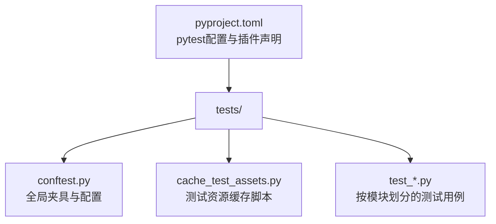
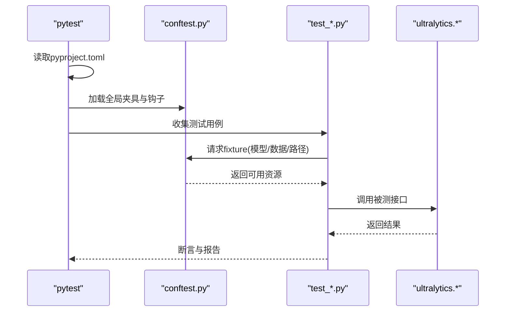
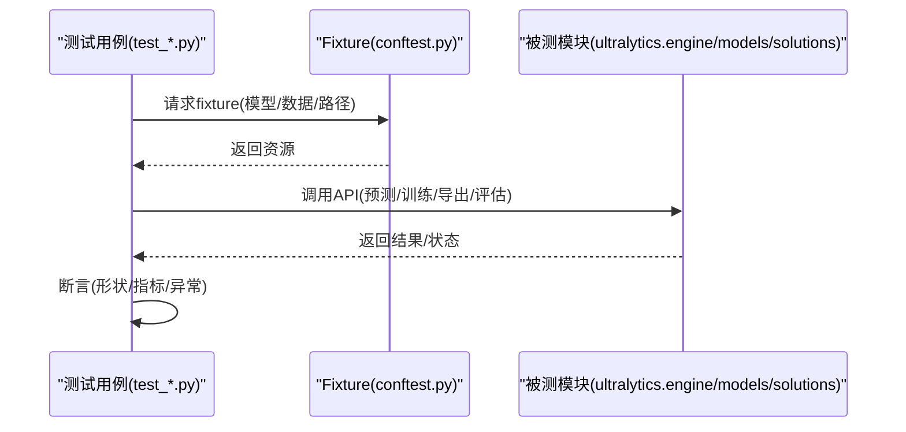
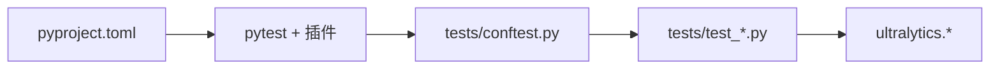

# 单元测试框架

<cite>
**本文引用的文件**
- [tests/conftest.py](file://tests/conftest.py)
- [tests/cache_test_assets.py](file://tests/cache_test_assets.py)
- [pyproject.toml](file://pyproject.toml)
- [tests/test_cli.py](file://tests/test_cli.py)
- [tests/test_engine.py](file://tests/test_engine.py)
- [tests/test_exports.py](file://tests/test_exports.py)
- [tests/test_moe.py](file://tests/test_moe.py)
- [tests/test_molora.py](file://tests/test_molora.py)
- [tests/test_mot.py](file://tests/test_mot.py)
- [tests/test_solutions.py](file://tests/test_solutions.py)
</cite>

## 目录
1. [简介](#简介)
2. [项目结构](#项目结构)
3. [核心组件](#核心组件)
4. [架构总览](#架构总览)
5. [详细组件分析](#详细组件分析)
6. [依赖分析](#依赖分析)
7. [性能考虑](#性能考虑)
8. [故障排查指南](#故障排查指南)
9. [结论](#结论)
10. [附录](#附录)

## 简介
本文件面向YOLO-Master项目的单元测试体系，聚焦pytest框架的配置与使用、测试组织与命名约定、conftest夹具的编写与复用、断言库最佳实践、模拟对象（Mock）策略（含PyTorch模型与数据加载器）、异步测试方法、测试数据管理与缓存、以及覆盖率统计与报告生成。文档旨在帮助开发者快速上手并高质量地维护测试套件。

## 项目结构
测试代码集中于tests目录，采用“按功能/模块划分”的组织方式：每个被测模块或特性对应一个或多个test_*.py文件；共享的夹具、钩子与全局配置放在conftest.py中；测试资源与缓存脚本位于tests目录下。

图表来源
- [tests/conftest.py](file://tests/conftest.py)
- [tests/cache_test_assets.py](file://tests/cache_test_assets.py)
- [pyproject.toml](file://pyproject.toml)

章节来源
- [tests/conftest.py](file://tests/conftest.py)
- [tests/cache_test_assets.py](file://tests/cache_test_assets.py)
- [pyproject.toml](file://pyproject.toml)

## 核心组件
- pytest配置与插件
  - 通过pyproject.toml集中管理pytest行为、标记、插件与参数。
- conftest夹具与生命周期
  - 在tests/conftest.py中定义可复用的fixture，支持不同作用域（function/session等），并通过依赖注入为测试提供环境、模型、数据集路径等。
- 测试资源与缓存
  - tests/cache_test_assets.py用于准备和缓存小体积测试数据集、权重或中间产物，避免重复下载与IO开销。
- 模块化测试用例
  - 以test_*.py命名，按功能域拆分，便于并行执行与定位问题。

章节来源
- [pyproject.toml](file://pyproject.toml)
- [tests/conftest.py](file://tests/conftest.py)
- [tests/cache_test_assets.py](file://tests/cache_test_assets.py)

## 架构总览
下图展示测试运行时的关键交互：pytest启动后加载pyproject.toml配置，发现tests下的测试文件，按需解析conftest中的fixture，并在测试执行期间调用被测试模块（如engine、models、solutions等）。

图表来源
- [pyproject.toml](file://pyproject.toml)
- [tests/conftest.py](file://tests/conftest.py)
- [tests/test_engine.py](file://tests/test_engine.py)
- [tests/test_moe.py](file://tests/test_moe.py)
- [tests/test_molora.py](file://tests/test_molora.py)
- [tests/test_mot.py](file://tests/test_mot.py)
- [tests/test_solutions.py](file://tests/test_solutions.py)

## 详细组件分析

### pytest配置与插件（pyproject.toml）
- 建议将pytest相关配置集中在pyproject.toml中，包括：
  - 插件启用（如pytest-cov、pytest-xdist等）
  - 默认命令行参数（如-v、--tb=short、--strict-markers）
  - 自定义标记（markers）与忽略规则
  - 覆盖范围与输出路径
- 优点：统一入口、版本可控、CI友好。

章节来源
- [pyproject.toml](file://pyproject.toml)

### 测试夹具与复用机制（conftest.py）
- 作用域管理
  - function：每个测试函数独立实例化，适合隔离性要求高的场景。
  - class/module/session：跨用例共享，适合昂贵资源（如模型加载、数据集构建）。
- 依赖注入
  - fixture之间可以互相依赖，形成清晰的资源装配链。
  - 结合autouse=True可实现自动初始化/清理逻辑。
- 推荐模式
  - 将“路径类”、“配置类”、“轻量模型/数据构造”拆分为多个细粒度fixture，组合使用。
  - 对需要GPU/分布式环境的fixture进行条件跳过或降级处理。

章节来源
- [tests/conftest.py](file://tests/conftest.py)

### 测试数据与缓存策略（cache_test_assets.py）
- 目标
  - 预置小体积数据集/权重/中间产物，减少网络IO与磁盘占用。
- 策略
  - 首次运行时生成并缓存到固定目录；后续直接复用。
  - 提供校验与重建开关，保证一致性。
- 集成
  - 在conftest中通过fixture引用缓存路径，供测试直接使用。

章节来源
- [tests/cache_test_assets.py](file://tests/cache_test_assets.py)

### 断言库与最佳实践
- 标准断言
  - 优先使用pytest内置断言（如assert x == y），以获得更友好的失败信息。
- 自定义断言
  - 在conftest或utils中封装领域专用断言（如张量形状、数值容差、指标阈值），提升可读性与复用性。
- 常见技巧
  - 使用pytest.approx进行浮点近似比较。
  - 对异常路径使用pytest.raises上下文管理器。
  - 对多分支逻辑使用参数化（@pytest.mark.parametrize）驱动。

章节来源
- [tests/conftest.py](file://tests/conftest.py)

### 模拟对象（Mock）策略
- PyTorch模型模拟
  - 使用unittest.mock.patch替换forward/训练循环等关键方法，验证控制流与错误传播。
  - 对大型模型仅mock必要接口，避免真实推理带来的开销。
- 数据加载器模拟
  - 用生成器或简单迭代器替代真实DataLoader，确保稳定且快速的批数据产出。
- 外部依赖
  - 对网络请求、文件系统、日志写入等进行mock，保证离线可测与确定性。

章节来源
- [tests/conftest.py](file://tests/conftest.py)

### 异步测试（async/await）
- 若被测接口为协程，测试函数需声明为async def，并使用pytest-asyncio运行。
- 在conftest中注册必要的异步fixture，确保事件循环正确创建与销毁。
- 注意：避免在异步测试中进行阻塞IO操作。

章节来源
- [tests/conftest.py](file://tests/conftest.py)

### 典型测试流程时序（以引擎/导出/任务为例）

图表来源
- [tests/test_engine.py](file://tests/test_engine.py)
- [tests/test_exports.py](file://tests/test_exports.py)
- [tests/test_moe.py](file://tests/test_moe.py)
- [tests/test_molora.py](file://tests/test_molora.py)
- [tests/test_mot.py](file://tests/test_mot.py)
- [tests/test_solutions.py](file://tests/test_solutions.py)

## 依赖分析
- 测试与源码耦合
  - 测试主要依赖ultralytics包内的engine、models、solutions等模块；通过fixture注入最小必要依赖，降低耦合度。
- 插件与工具
  - pytest-cov用于覆盖率统计；pytest-xdist用于并行执行；pytest-asyncio用于异步测试。
- 潜在风险
  - 大模型或大数据集fixture应避免在短耗时用例中加载；必要时使用session级fixture+缓存。

图表来源
- [pyproject.toml](file://pyproject.toml)
- [tests/conftest.py](file://tests/conftest.py)
- [tests/test_cli.py](file://tests/test_cli.py)
- [tests/test_engine.py](file://tests/test_engine.py)
- [tests/test_exports.py](file://tests/test_exports.py)
- [tests/test_moe.py](file://tests/test_moe.py)
- [tests/test_molora.py](file://tests/test_molora.py)
- [tests/test_mot.py](file://tests/test_mot.py)
- [tests/test_solutions.py](file://tests/test_solutions.py)

章节来源
- [pyproject.toml](file://pyproject.toml)
- [tests/conftest.py](file://tests/conftest.py)
- [tests/test_cli.py](file://tests/test_cli.py)
- [tests/test_engine.py](file://tests/test_engine.py)
- [tests/test_exports.py](file://tests/test_exports.py)
- [tests/test_moe.py](file://tests/test_moe.py)
- [tests/test_molora.py](file://tests/test_molora.py)
- [tests/test_mot.py](file://tests/test_mot.py)
- [tests/test_solutions.py](file://tests/test_solutions.py)

## 性能考虑
- 并行执行
  - 使用pytest-xdist分片执行，缩短整体时长；注意避免共享可变状态。
- 资源复用
  - 将昂贵fixture设为module或session作用域，配合缓存脚本减少IO。
- 选择性执行
  - 使用pytest标记（如@slow、@gpu）筛选用例，加速本地开发反馈。
- 内存与显存
  - 及时释放模型与中间张量；避免在长生命周期fixture中持有大对象。

[本节为通用指导，不直接分析具体文件]

## 故障排查指南
- 常见问题
  - 测试不稳定：检查随机种子、并发冲突、共享状态。
  - 资源缺失：确认缓存脚本是否成功生成，路径是否正确。
  - 环境差异：在fixture中做设备/后端可用性检测并跳过不适配用例。
- 定位技巧
  - 使用-vv与--tb=long获取详细堆栈。
  - 针对单个文件/函数执行，缩小范围。
  - 打印fixture解析顺序（pytest --fixtures）辅助调试。

章节来源
- [tests/conftest.py](file://tests/conftest.py)

## 结论
通过统一的pytest配置、清晰的conftest夹具分层、稳定的测试数据缓存、合理的Mock策略与异步测试支持，YOLO-Master的测试体系能够在保持高覆盖率的同时兼顾执行效率与可维护性。建议在持续集成中开启并行与覆盖率报告，并对慢用例进行分级与隔离。

[本节为总结性内容，不直接分析具体文件]

## 附录

### 常用命令速查
- 运行全部测试：pytest
- 并行执行：pytest -n auto
- 指定标记：pytest -m "not slow"
- 覆盖率：pytest --cov=ultralytics --cov-report=term-missing
- 单文件/函数：pytest tests/test_engine.py::test_xxx -vv

[本节为通用指导，不直接分析具体文件]