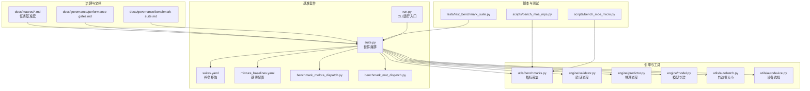
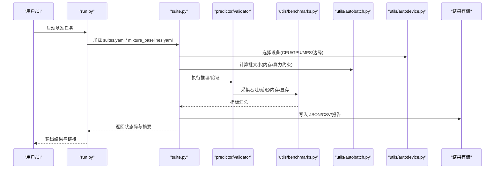
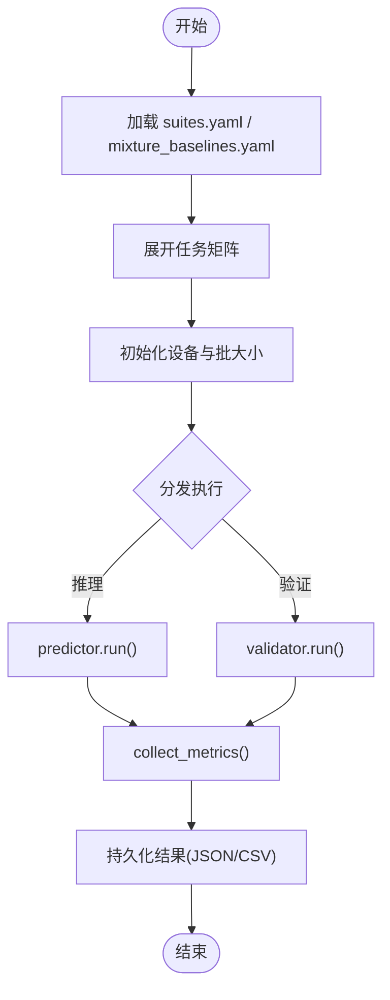
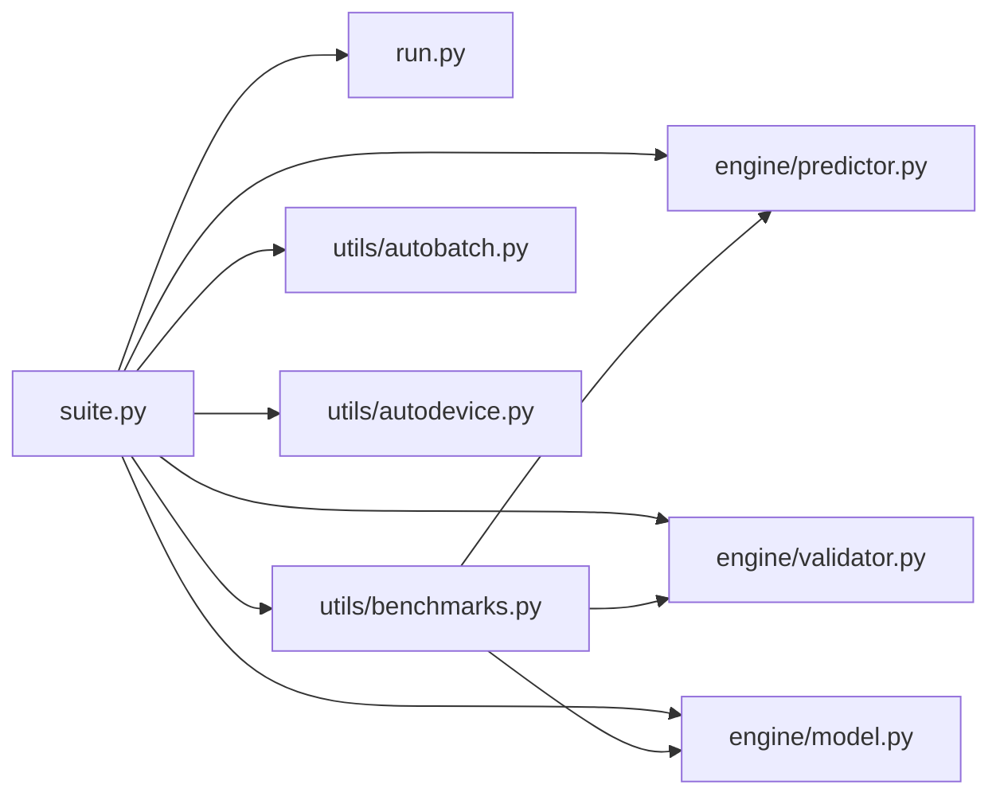

# 基准测试套件

<cite>
**本文引用的文件**
- [benchmarks/suite.py](file://benchmarks/suite.py)
- [benchmarks/run.py](file://benchmarks/run.py)
- [benchmarks/suites.yaml](file://benchmarks/suites.yaml)
- [benchmarks/mixture_baselines.yaml](file://benchmarks/mixture_baselines.yaml)
- [benchmarks/benchmark_molora_dispatch.py](file://benchmarks/benchmark_molora_dispatch.py)
- [benchmarks/benchmark_mot_dispatch.py](file://benchmarks/benchmark_mot_dispatch.py)
- [tests/test_benchmark_suite.py](file://tests/test_benchmark_suite.py)
- [ultralytics/utils/benchmarks.py](file://ultralytics/utils/benchmarks.py)
- [ultralytics/engine/validator.py](file://ultralytics/engine/validator.py)
- [ultralytics/engine/predictor.py](file://ultralytics/engine/predictor.py)
- [ultralytics/engine/model.py](file://ultralytics/engine/model.py)
- [ultralytics/utils/autobatch.py](file://ultralytics/utils/autobatch.py)
- [ultralytics/utils/autodevice.py](file://ultralytics/utils/autodevice.py)
- [scripts/bench_moe_micro.py](file://scripts/bench_moe_micro.py)
- [scripts/bench_moe_mps.py](file://scripts/bench_moe_mps.py)
- [docs/governance/benchmark-suite.md](file://docs/governance/benchmark-suite.md)
- [docs/governance/performance-gates.md](file://docs/governance/performance-gates.md)
- [docs/macros/yolo-det-perf.md](file://docs/macros/yolo-det-perf.md)
- [docs/macros/yolo-seg-perf.md](file://docs/macros/yolo-seg-perf.md)
- [docs/macros/yolo-pose-perf.md](file://docs/macros/yolo-obb-perf.md)
- [docs/macros/yolo-cls-perf.md](file://docs/macros/yolo-cls-perf.md)
- [docs/macros/yolo-semantic-perf.md](file://docs/macros/yolo-semantic-perf.md)
- [docs/macros/yolo-semantic-ade20k-perf.md](file://docs/macros/yolo-semantic-ade20k-perf.md)
</cite>

## 目录
1. [简介](#简介)
2. [项目结构](#项目结构)
3. [核心组件](#核心组件)
4. [架构总览](#架构总览)
5. [详细组件分析](#详细组件分析)
6. [依赖关系分析](#依赖关系分析)
7. [性能考量](#性能考量)
8. [故障排查指南](#故障排查指南)
9. [结论](#结论)
10. [附录](#附录)

## 简介
本文件为 YOLO-Master 项目的基准测试套件提供系统化文档，覆盖整体架构、用例组织与执行引擎、指标采集与计算方法、多硬件平台配置、结果分析与可视化、CI/CD 集成策略以及自定义基准用例开发指南。目标读者包括算法工程师、系统工程师与质量保障人员，旨在帮助团队在不同任务（检测、分割、姿态、分类、语义分割等）和不同后端（CPU/GPU/边缘设备）上稳定、可复现地评估模型性能。

## 项目结构
基准测试相关代码主要分布在以下位置：
- benchmarks：基准套件入口、调度器、任务定义与基线数据
- ultralytics/utils/benchmarks.py：通用基准工具（吞吐/延迟/内存等）
- ultralytics/engine/*：推理与验证引擎（预测器、验证器、模型封装）
- scripts/*：面向特定场景的基准脚本（如 MoE 微基准、MPS 基准）
- tests/test_benchmark_suite.py：基准套件回归与冒烟测试
- docs/governance/*：基准治理规范与性能门禁
- docs/macros/*：各任务的基准宏模板（用于报告生成）

图表来源
- [benchmarks/suite.py](file://benchmarks/suite.py)
- [benchmarks/run.py](file://benchmarks/run.py)
- [benchmarks/suites.yaml](file://benchmarks/suites.yaml)
- [benchmarks/mixture_baselines.yaml](file://benchmarks/mixture_baselines.yaml)
- [benchmarks/benchmark_molora_dispatch.py](file://benchmarks/benchmark_molora_dispatch.py)
- [benchmarks/benchmark_mot_dispatch.py](file://benchmarks/benchmark_mot_dispatch.py)
- [ultralytics/utils/benchmarks.py](file://ultralytics/utils/benchmarks.py)
- [ultralytics/engine/validator.py](file://ultralytics/engine/validator.py)
- [ultralytics/engine/predictor.py](file://ultralytics/engine/predictor.py)
- [ultralytics/engine/model.py](file://ultralytics/engine/model.py)
- [ultralytics/utils/autobatch.py](file://ultralytics/utils/autobatch.py)
- [ultralytics/utils/autodevice.py](file://ultralytics/utils/autodevice.py)
- [scripts/bench_moe_micro.py](file://scripts/bench_moe_micro.py)
- [scripts/bench_moe_mps.py](file://scripts/bench_moe_mps.py)
- [tests/test_benchmark_suite.py](file://tests/test_benchmark_suite.py)
- [docs/governance/benchmark-suite.md](file://docs/governance/benchmark-suite.md)
- [docs/governance/performance-gates.md](file://docs/governance/performance-gates.md)
- [docs/macros/yolo-det-perf.md](file://docs/macros/yolo-det-perf.md)
- [docs/macros/yolo-seg-perf.md](file://docs/macros/yolo-seg-perf.md)
- [docs/macros/yolo-pose-perf.md](file://docs/macros/yolo-pose-perf.md)
- [docs/macros/yolo-obb-perf.md](file://docs/macros/yolo-obb-perf.md)
- [docs/macros/yolo-cls-perf.md](file://docs/macros/yolo-cls-perf.md)
- [docs/macros/yolo-semantic-perf.md](file://docs/macros/yolo-semantic-perf.md)
- [docs/macros/yolo-semantic-ade20k-perf.md](file://docs/macros/yolo-semantic-ade20k-perf.md)

章节来源
- [benchmarks/suite.py](file://benchmarks/suite.py)
- [benchmarks/run.py](file://benchmarks/run.py)
- [benchmarks/suites.yaml](file://benchmarks/suites.yaml)
- [benchmarks/mixture_baselines.yaml](file://benchmarks/mixture_baselines.yaml)
- [benchmarks/benchmark_molora_dispatch.py](file://benchmarks/benchmark_molora_dispatch.py)
- [benchmarks/benchmark_mot_dispatch.py](file://benchmarks/benchmark_mot_dispatch.py)
- [ultralytics/utils/benchmarks.py](file://ultralytics/utils/benchmarks.py)
- [ultralytics/engine/validator.py](file://ultralytics/engine/validator.py)
- [ultralytics/engine/predictor.py](file://ultralytics/engine/predictor.py)
- [ultralytics/engine/model.py](file://ultralytics/engine/model.py)
- [ultralytics/utils/autobatch.py](file://ultralytics/utils/autobatch.py)
- [ultralytics/utils/autodevice.py](file://ultralytics/utils/autodevice.py)
- [scripts/bench_moe_micro.py](file://scripts/bench_moe_micro.py)
- [scripts/bench_moe_mps.py](file://scripts/bench_moe_mps.py)
- [tests/test_benchmark_suite.py](file://tests/test_benchmark_suite.py)
- [docs/governance/benchmark-suite.md](file://docs/governance/benchmark-suite.md)
- [docs/governance/performance-gates.md](file://docs/governance/performance-gates.md)
- [docs/macros/yolo-det-perf.md](file://docs/macros/yolo-det-perf.md)
- [docs/macros/yolo-seg-perf.md](file://docs/macros/yolo-seg-perf.md)
- [docs/macros/yolo-pose-perf.md](file://docs/macros/yolo-pose-perf.md)
- [docs/macros/yolo-obb-perf.md](file://docs/macros/yolo-obb-perf.md)
- [docs/macros/yolo-cls-perf.md](file://docs/macros/yolo-cls-perf.md)
- [docs/macros/yolo-semantic-perf.md](file://docs/macros/yolo-semantic-perf.md)
- [docs/macros/yolo-semantic-ade20k-perf.md](file://docs/macros/yolo-semantic-ade20k-perf.md)

## 核心组件
- 套件编排器（suite.py）：负责加载 suites.yaml 与 mixture_baselines.yaml，解析任务矩阵（模型×数据集×任务×设备），并驱动执行引擎。
- 运行入口（run.py）：提供 CLI 或 API 调用方式，支持按标签/任务筛选、并发控制、输出路径与日志级别设置。
- 指标采集（utils/benchmarks.py）：统一封装吞吐、延迟（P50/P95/P99）、内存峰值、显存占用、I/O 耗时等指标的采集与聚合。
- 验证/推理引擎（engine/validator.py, engine/predictor.py, engine/model.py）：分别承担验证集评测与批量推理流程；model.py 作为对外封装，屏蔽后端差异。
- 自动批大小与设备选择（utils/autobatch.py, utils/autodevice.py）：根据硬件能力与内存约束动态调整批大小与设备，提升稳定性与可比性。
- 专项基准脚本（scripts/bench_moe_micro.py, scripts/bench_moe_mps.py）：针对 MoE 路由、专家负载与 MPS 后端的微基准，便于快速定位瓶颈。
- 治理与门禁（docs/governance/benchmark-suite.md, docs/governance/performance-gates.md）：定义基准规范、通过阈值与回归告警策略。
- 任务基准宏（docs/macros/*.md）：为不同任务提供统一的报告模板与指标口径，确保跨版本对比一致性。

章节来源
- [benchmarks/suite.py](file://benchmarks/suite.py)
- [benchmarks/run.py](file://benchmarks/run.py)
- [ultralytics/utils/benchmarks.py](file://ultralytics/utils/benchmarks.py)
- [ultralytics/engine/validator.py](file://ultralytics/engine/validator.py)
- [ultralytics/engine/predictor.py](file://ultralytics/engine/predictor.py)
- [ultralytics/engine/model.py](file://ultralytics/engine/model.py)
- [ultralytics/utils/autobatch.py](file://ultralytics/utils/autobatch.py)
- [ultralytics/utils/autodevice.py](file://ultralytics/utils/autodevice.py)
- [scripts/bench_moe_micro.py](file://scripts/bench_moe_micro.py)
- [scripts/bench_moe_mps.py](file://scripts/bench_moe_mps.py)
- [docs/governance/benchmark-suite.md](file://docs/governance/benchmark-suite.md)
- [docs/governance/performance-gates.md](file://docs/governance/performance-gates.md)
- [docs/macros/yolo-det-perf.md](file://docs/macros/yolo-det-perf.md)
- [docs/macros/yolo-seg-perf.md](file://docs/macros/yolo-seg-perf.md)
- [docs/macros/yolo-pose-perf.md](file://docs/macros/yolo-pose-perf.md)
- [docs/macros/yolo-obb-perf.md](file://docs/macros/yolo-obb-perf.md)
- [docs/macros/yolo-cls-perf.md](file://docs/macros/yolo-cls-perf.md)
- [docs/macros/yolo-semantic-perf.md](file://docs/macros/yolo-semantic-perf.md)
- [docs/macros/yolo-semantic-ade20k-perf.md](file://docs/macros/yolo-semantic-ade20k-perf.md)

## 架构总览
基准测试套件采用“配置驱动 + 引擎抽象”的分层架构：
- 配置层：suites.yaml 描述任务矩阵（模型、数据集、任务类型、设备、批大小、预热轮次等），mixture_baselines.yaml 提供基线对照。
- 编排层：suite.py 解析配置，构建执行计划，管理并发与资源隔离。
- 执行层：通过 predictor/validator 对模型进行推理/验证，benchmarks.py 采集指标，autobatch/autodevice 保证环境一致性与稳定性。
- 产出层：结构化结果（JSON/CSV）与可视化报告（HTML/Markdown），供 CI/CD 与人工审阅。

图表来源
- [benchmarks/run.py](file://benchmarks/run.py)
- [benchmarks/suite.py](file://benchmarks/suite.py)
- [ultralytics/utils/benchmarks.py](file://ultralytics/utils/benchmarks.py)
- [ultralytics/engine/predictor.py](file://ultralytics/engine/predictor.py)
- [ultralytics/engine/validator.py](file://ultralytics/engine/validator.py)
- [ultralytics/utils/autobatch.py](file://ultralytics/utils/autobatch.py)
- [ultralytics/utils/autodevice.py](file://ultralytics/utils/autodevice.py)

## 详细组件分析

### 套件编排器（suite.py）
- 职责：读取 suites.yaml 与 mixture_baselines.yaml，展开任务矩阵，生成执行计划；管理并发度、重试与失败隔离；汇总指标并持久化。
- 关键流程：
  - 解析配置项（模型权重、数据集路径、任务类型、设备、批大小、预热次数、采样数量）。
  - 初始化设备与批大小策略。
  - 分发到 predictor/validator 执行。
  - 收集 metrics 并落盘。
- 扩展点：新增任务类型时，在 suites.yaml 中声明即可；如需新指标，扩展 benchmarks.py 并在 suite.py 中注册。

图表来源
- [benchmarks/suite.py](file://benchmarks/suite.py)
- [benchmarks/suites.yaml](file://benchmarks/suites.yaml)
- [benchmarks/mixture_baselines.yaml](file://benchmarks/mixture_baselines.yaml)
- [ultralytics/engine/predictor.py](file://ultralytics/engine/predictor.py)
- [ultralytics/engine/validator.py](file://ultralytics/engine/validator.py)
- [ultralytics/utils/benchmarks.py](file://ultralytics/utils/benchmarks.py)

章节来源
- [benchmarks/suite.py](file://benchmarks/suite.py)
- [benchmarks/suites.yaml](file://benchmarks/suites.yaml)
- [benchmarks/mixture_baselines.yaml](file://benchmarks/mixture_baselines.yaml)

### 运行入口（run.py）
- 职责：暴露命令行接口，支持按标签/任务过滤、并发线程数、输出目录、日志级别、是否仅导出等参数。
- 典型用法：指定 suites 标签、设备、批大小、并发度、结果保存路径。
- 错误处理：捕获异常并记录上下文（模型、数据集、设备、批大小），便于复现问题。

章节来源
- [benchmarks/run.py](file://benchmarks/run.py)

### 指标采集（utils/benchmarks.py）
- 吞吐（FPS）：单位时间内处理的样本数，通常基于有效推理时间窗口统计。
- 延迟（ms）：单样本端到端延迟，常用 P50/P95/P99 分位数衡量尾部延迟。
- 内存使用：进程 RSS 峰值、增量分配；GPU 显存峰值与平均占用。
- I/O 耗时：图像解码、预处理、NMS 等阶段耗时分解。
- 聚合方法：按任务/模型/设备维度分组，计算均值/方差/分位数，并输出结构化结果。

章节来源
- [ultralytics/utils/benchmarks.py](file://ultralytics/utils/benchmarks.py)

### 验证与推理引擎（validator.py, predictor.py, model.py）
- validator.py：面向验证集的精度+性能联合评测，支持多尺度、滑动窗口、TTA 等选项。
- predictor.py：面向批量推理的高吞吐路径，侧重吞吐与延迟优化。
- model.py：统一封装模型加载、设备迁移、导出格式兼容，屏蔽底层差异。

章节来源
- [ultralytics/engine/validator.py](file://ultralytics/engine/validator.py)
- [ultralytics/engine/predictor.py](file://ultralytics/engine/predictor.py)
- [ultralytics/engine/model.py](file://ultralytics/engine/model.py)

### 自动批大小与设备选择（autobatch.py, autodevice.py）
- autobatch.py：依据可用显存/内存、输入分辨率、模型规模估算最大稳定批大小，避免 OOM。
- autodevice.py：自动选择 CPU/GPU/MPS/NPU 等设备，并设置必要的运行时标志。

章节来源
- [ultralytics/utils/autobatch.py](file://ultralytics/utils/autobatch.py)
- [ultralytics/utils/autodevice.py](file://ultralytics/utils/autodevice.py)

### 专项基准脚本（scripts/bench_moe_micro.py, scripts/bench_moe_mps.py）
- bench_moe_micro.py：针对 MoE 路由与专家调度的微基准，测量路由开销、专家激活分布、负载均衡等。
- bench_moe_mps.py：在 Apple MPS 后端下的性能探针，关注内存拷贝与内核融合效果。

章节来源
- [scripts/bench_moe_micro.py](file://scripts/bench_moe_micro.py)
- [scripts/bench_moe_mps.py](file://scripts/bench_moe_mps.py)

### 基准治理与门禁（docs/governance/benchmark-suite.md, docs/governance/performance-gates.md）
- benchmark-suite.md：定义基准任务范围、数据版本、随机种子、预热策略、结果归档规范。
- performance-gates.md：定义性能门禁阈值（相对基线的退化容忍度）、回归告警与阻断规则。

章节来源
- [docs/governance/benchmark-suite.md](file://docs/governance/benchmark-suite.md)
- [docs/governance/performance-gates.md](file://docs/governance/performance-gates.md)

### 任务基准宏（docs/macros/*.md）
- yolo-det-perf.md、yolo-seg-perf.md、yolo-pose-perf.md、yolo-obb-perf.md、yolo-cls-perf.md、yolo-semantic-perf.md、yolo-semantic-ade20k-perf.md：为不同任务提供一致的指标口径与报告模板，便于横向对比与趋势追踪。

章节来源
- [docs/macros/yolo-det-perf.md](file://docs/macros/yolo-det-perf.md)
- [docs/macros/yolo-seg-perf.md](file://docs/macros/yolo-seg-perf.md)
- [docs/macros/yolo-pose-perf.md](file://docs/macros/yolo-pose-perf.md)
- [docs/macros/yolo-obb-perf.md](file://docs/macros/yolo-obb-perf.md)
- [docs/macros/yolo-cls-perf.md](file://docs/macros/yolo-cls-perf.md)
- [docs/macros/yolo-semantic-perf.md](file://docs/macros/yolo-semantic-perf.md)
- [docs/macros/yolo-semantic-ade20k-perf.md](file://docs/macros/yolo-semantic-ade20k-perf.md)

## 依赖关系分析
- 低耦合高内聚：suite.py 仅依赖配置与执行引擎，不直接实现指标采集；指标采集集中在 benchmarks.py，便于复用与替换。
- 外部依赖：torch/torchvision、OpenCV、Pillow、pyyaml、pandas、matplotlib/seaborn（可选）等。
- 潜在循环依赖：应避免 suite.py 反向导入 benchmarks.py 的具体实现细节，保持单向依赖。

图表来源
- [benchmarks/suite.py](file://benchmarks/suite.py)
- [benchmarks/run.py](file://benchmarks/run.py)
- [ultralytics/utils/benchmarks.py](file://ultralytics/utils/benchmarks.py)
- [ultralytics/engine/predictor.py](file://ultralytics/engine/predictor.py)
- [ultralytics/engine/validator.py](file://ultralytics/engine/validator.py)
- [ultralytics/engine/model.py](file://ultralytics/engine/model.py)
- [ultralytics/utils/autobatch.py](file://ultralytics/utils/autobatch.py)
- [ultralytics/utils/autodevice.py](file://ultralytics/utils/autodevice.py)

章节来源
- [benchmarks/suite.py](file://benchmarks/suite.py)
- [benchmarks/run.py](file://benchmarks/run.py)
- [ultralytics/utils/benchmarks.py](file://ultralytics/utils/benchmarks.py)
- [ultralytics/engine/predictor.py](file://ultralytics/engine/predictor.py)
- [ultralytics/engine/validator.py](file://ultralytics/engine/validator.py)
- [ultralytics/engine/model.py](file://ultralytics/engine/model.py)
- [ultralytics/utils/autobatch.py](file://ultralytics/utils/autobatch.py)
- [ultralytics/utils/autodevice.py](file://ultralytics/utils/autodevice.py)

## 性能考量
- 预热与冷启动：建议至少 1~3 轮预热以消除 JIT/缓存/内存分配抖动的影响。
- 批大小敏感性：小批偏向延迟，大批偏向吞吐；应同时报告 P50/P95/P99 与 FPS。
- 数据路径：使用 SSD、关闭不必要的磁盘写放大；必要时启用内存映射或预取。
- GPU 内存碎片：定期重启进程或使用独立子进程隔离，避免长时运行的碎片累积。
- 随机性与复现：固定随机种子、禁用非确定性算子或锁定其开关，确保跨机器可复现。
- 监控开销：指标采集应尽量轻量，避免引入显著额外开销影响真实性能。

[本节为通用指导，无需具体文件引用]

## 故障排查指南
- 常见错误
  - OOM：降低输入分辨率或批大小，检查 autodevice 选择的设备是否正确。
  - 指标异常波动：增加预热轮次，减少并发干扰，确认 I/O 未成为瓶颈。
  - 设备不可用：检查 CUDA/MPS/NPU 驱动与运行时版本，确认权限与环境变量。
- 诊断步骤
  - 使用最小数据集与最小模型快速复现。
  - 开启详细日志，定位耗时热点（I/O、预处理、推理、后处理）。
  - 对比基线结果，判断是否为回归或环境问题。
- 参考测试
  - tests/test_benchmark_suite.py 提供基准套件的冒烟与回归用例，可用于本地快速验证。

章节来源
- [tests/test_benchmark_suite.py](file://tests/test_benchmark_suite.py)

## 结论
YOLO-Master 基准测试套件通过配置驱动与引擎抽象，实现了跨任务、跨设备的标准化性能评估。借助统一的指标采集与治理规范，团队可在持续集成环境中稳定地跟踪性能趋势、拦截回归并指导优化方向。建议在生产环境中结合门禁策略与自动化报告，形成闭环的质量保障体系。

[本节为总结性内容，无需具体文件引用]

## 附录

### 多硬件平台基准配置要点
- CPU
  - 推荐：大内存、SSD、多线程并行；关闭不必要的后台任务。
  - 注意：GIL 限制下，合理设置并发与批大小。
- GPU（CUDA）
  - 推荐：固定批大小、预热、禁用频繁的设备切换；监控显存峰值。
  - 注意：多卡环境下需考虑通信开销与负载均衡。
- 边缘设备（Jetson/RKNN/OpenVINO/TFLite 等）
  - 推荐：使用对应后端导出与推理路径；关注内存带宽与热节流。
  - 注意：校准数据与量化参数需与部署一致。

[本节为通用指导，无需具体文件引用]

### 结果分析与可视化
- 指标口径：统一使用 benchmarks.py 定义的吞吐/延迟/内存指标。
- 图表类型
  - 趋势图：按提交/日期绘制 FPS、P95 延迟、显存峰值变化。
  - 对比图：不同模型/任务/设备间的柱状或箱线图。
- 报告模板：使用 docs/macros/*.md 中的模板生成 Markdown/HTML 报告。

章节来源
- [ultralytics/utils/benchmarks.py](file://ultralytics/utils/benchmarks.py)
- [docs/macros/yolo-det-perf.md](file://docs/macros/yolo-det-perf.md)
- [docs/macros/yolo-seg-perf.md](file://docs/macros/yolo-seg-perf.md)
- [docs/macros/yolo-pose-perf.md](file://docs/macros/yolo-pose-perf.md)
- [docs/macros/yolo-obb-perf.md](file://docs/macros/yolo-obb-perf.md)
- [docs/macros/yolo-cls-perf.md](file://docs/macros/yolo-cls-perf.md)
- [docs/macros/yolo-semantic-perf.md](file://docs/macros/yolo-semantic-perf.md)
- [docs/macros/yolo-semantic-ade20k-perf.md](file://docs/macros/yolo-semantic-ade20k-perf.md)

### CI/CD 集成建议
- 触发策略：PR 合并前、每日定时、发布候选版。
- 环境固化：容器镜像包含所有依赖与驱动；固定数据集版本。
- 门禁规则：基于 performance-gates.md 的阈值判定，失败则阻断合并。
- 结果归档：将 JSON/CSV/报告上传至对象存储或仓库附件，保留历史版本。

章节来源
- [docs/governance/performance-gates.md](file://docs/governance/performance-gates.md)

### 自定义基准用例开发指南
- 新增任务
  - 在 suites.yaml 中添加任务条目（模型、数据集、任务类型、设备、批大小、预热等）。
  - 若涉及新指标，扩展 benchmarks.py 并在 suite.py 中注册。
- 新增模型/算法
  - 确保模型可通过 engine/model.py 加载与推理。
  - 在 suites.yaml 中声明权重路径与必要参数。
- 回归测试
  - 在 tests/test_benchmark_suite.py 中添加最小用例，确保新改动不会破坏既有基准。

章节来源
- [benchmarks/suites.yaml](file://benchmarks/suites.yaml)
- [benchmarks/suite.py](file://benchmarks/suite.py)
- [ultralytics/utils/benchmarks.py](file://ultralytics/utils/benchmarks.py)
- [ultralytics/engine/model.py](file://ultralytics/engine/model.py)
- [tests/test_benchmark_suite.py](file://tests/test_benchmark_suite.py)

### 基准数据存储与管理策略
- 存储格式：JSON（元数据与指标）、CSV（表格化分析）、Markdown/HTML（报告）。
- 命名规范：按“任务_模型_设备_时间戳”组织，便于检索与对比。
- 版本控制：数据集与权重哈希纳入文件名或元数据，确保可追溯。
- 清理策略：保留最近 N 个版本与关键里程碑快照，其余归档至冷存储。

[本节为通用指导，无需具体文件引用]