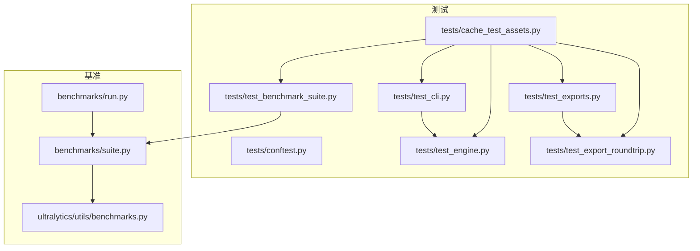
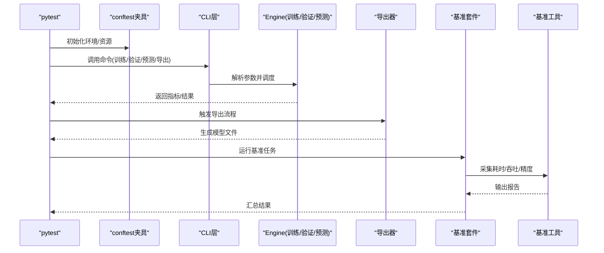
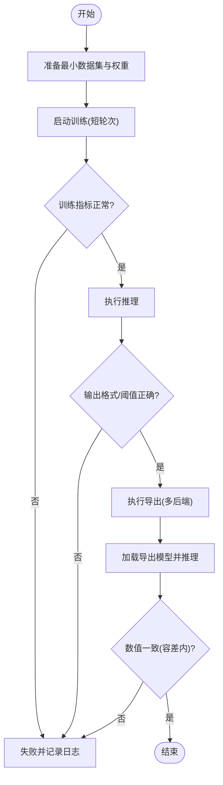
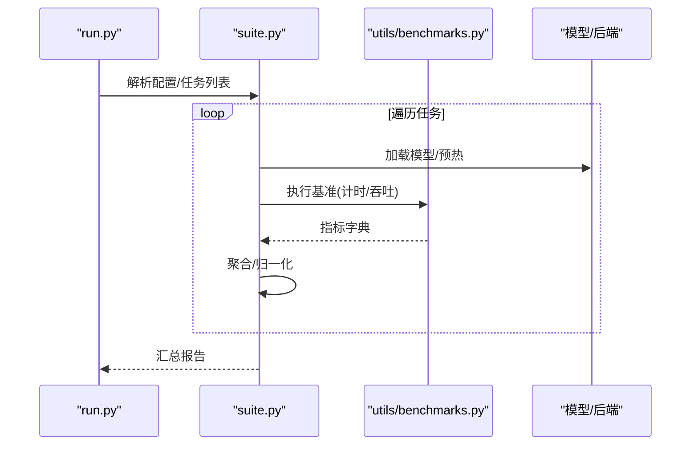
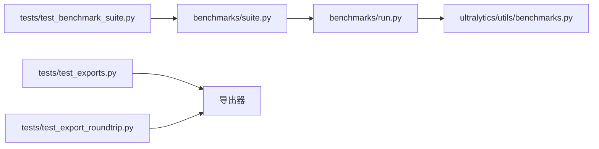

# 测试体系构建

<cite>
**本文引用的文件**
- [tests/conftest.py](file://tests/conftest.py)
- [tests/test_cli.py](file://tests/test_cli.py)
- [tests/test_engine.py](file://tests/test_engine.py)
- [tests/test_exports.py](file://tests/test_exports.py)
- [tests/test_export_roundtrip.py](file://tests/test_export_roundtrip.py)
- [tests/test_benchmark_suite.py](file://tests/test_benchmark_suite.py)
- [tests/cache_test_assets.py](file://tests/cache_test_assets.py)
- [benchmarks/suite.py](file://benchmarks/suite.py)
- [benchmarks/run.py](file://benchmarks/run.py)
- [ultralytics/utils/benchmarks.py](file://ultralytics/utils/benchmarks.py)
- [pyproject.toml](file://pyproject.toml)
</cite>

## 目录
1. [简介](#简介)
2. [项目结构](#项目结构)
3. [核心组件](#核心组件)
4. [架构总览](#架构总览)
5. [详细组件分析](#详细组件分析)
6. [依赖关系分析](#依赖关系分析)
7. [性能考量](#性能考量)
8. [故障排查指南](#故障排查指南)
9. [结论](#结论)
10. [附录](#附录)

## 简介
本文件面向YOLO-Master项目的测试体系建设，覆盖单元测试、集成测试、端到端流程（训练/推理/导出）、性能基准、回归测试、测试数据与模拟对象管理、覆盖率统计与质量门禁、分布式与并行执行优化、自定义测试工具编写以及调试失败方法。文档以仓库现有测试与基准代码为依据，提供可落地的实践建议与可视化说明，帮助团队在持续集成中稳定保障模型能力与工程健壮性。

## 项目结构
仓库的测试与基准相关组织如下：
- tests：pytest用例集合，包含CLI、引擎、导出、基准套件等；conftest.py提供全局配置与夹具；cache_test_assets.py用于缓存测试资源。
- benchmarks：基准套件定义与运行入口，suite.py定义任务集，run.py为统一入口。
- ultralytics/utils/benchmarks.py：通用基准工具函数。
- pyproject.toml：项目依赖与可选测试依赖声明。

图示来源
- [tests/conftest.py](file://tests/conftest.py)
- [tests/test_cli.py](file://tests/test_cli.py)
- [tests/test_engine.py](file://tests/test_engine.py)
- [tests/test_exports.py](file://tests/test_exports.py)
- [tests/test_export_roundtrip.py](file://tests/test_export_roundtrip.py)
- [tests/test_benchmark_suite.py](file://tests/test_benchmark_suite.py)
- [tests/cache_test_assets.py](file://tests/cache_test_assets.py)
- [benchmarks/suite.py](file://benchmarks/suite.py)
- [benchmarks/run.py](file://benchmarks/run.py)
- [ultralytics/utils/benchmarks.py](file://ultralytics/utils/benchmarks.py)

章节来源
- [tests/conftest.py](file://tests/conftest.py)
- [tests/test_cli.py](file://tests/test_cli.py)
- [tests/test_engine.py](file://tests/test_engine.py)
- [tests/test_exports.py](file://tests/test_exports.py)
- [tests/test_export_roundtrip.py](file://tests/test_export_roundtrip.py)
- [tests/test_benchmark_suite.py](file://tests/test_benchmark_suite.py)
- [tests/cache_test_assets.py](file://tests/cache_test_assets.py)
- [benchmarks/suite.py](file://benchmarks/suite.py)
- [benchmarks/run.py](file://benchmarks/run.py)
- [ultralytics/utils/benchmarks.py](file://ultralytics/utils/benchmarks.py)

## 核心组件
- pytest配置与夹具：通过conftest集中管理设备选择、临时目录、数据集路径、随机种子、日志级别等，确保用例可重复与环境隔离。
- CLI与引擎测试：验证命令行接口参数解析、错误传播、训练/验证/预测/导出等主流程的基本可用性。
- 导出与往返一致性：覆盖多后端导出与加载后的数值一致性检查，保证导出链路正确。
- 基准套件：基于suite.py定义任务矩阵，run.py作为统一入口，结合utils/benchmarks进行指标采集与结果汇总。
- 测试资产缓存：cache_test_assets.py负责下载/缓存小样本数据与权重，加速本地与CI执行。

章节来源
- [tests/conftest.py](file://tests/conftest.py)
- [tests/test_cli.py](file://tests/test_cli.py)
- [tests/test_engine.py](file://tests/test_engine.py)
- [tests/test_exports.py](file://tests/test_exports.py)
- [tests/test_export_roundtrip.py](file://tests/test_export_roundtrip.py)
- [tests/test_benchmark_suite.py](file://tests/test_benchmark_suite.py)
- [tests/cache_test_assets.py](file://tests/cache_test_assets.py)
- [benchmarks/suite.py](file://benchmarks/suite.py)
- [benchmarks/run.py](file://benchmarks/run.py)
- [ultralytics/utils/benchmarks.py](file://ultralytics/utils/benchmarks.py)

## 架构总览
下图展示从用例到引擎、导出与基准的调用关系，体现端到端闭环：CLI触发引擎，引擎驱动训练/验证/预测/导出；导出产物进入往返校验或基准评估。

图示来源
- [tests/test_cli.py](file://tests/test_cli.py)
- [tests/test_engine.py](file://tests/test_engine.py)
- [tests/test_exports.py](file://tests/test_exports.py)
- [tests/test_export_roundtrip.py](file://tests/test_export_roundtrip.py)
- [tests/test_benchmark_suite.py](file://tests/test_benchmark_suite.py)
- [benchmarks/suite.py](file://benchmarks/suite.py)
- [benchmarks/run.py](file://benchmarks/run.py)
- [ultralytics/utils/benchmarks.py](file://ultralytics/utils/benchmarks.py)

## 详细组件分析

### 单元测试：pytest框架使用与最佳实践
- 命名与组织
  - 文件名以test_前缀，模块按功能域划分（如engine、exports、benchmark_suite）。
  - 每个用例聚焦单一职责，避免跨模块耦合。
- 断言策略
  - 对数值型指标采用近似比较（容忍浮点误差），对布尔/枚举采用精确匹配。
  - 对异常路径使用异常类型与消息片段断言，确保错误语义稳定。
- 夹具与共享状态
  - 在conftest中定义设备、临时目录、数据集路径、随机种子等夹具，减少重复设置。
  - 使用session级或module级夹具缓存昂贵资源（如小权重、小数据集）。
- 参数化与组合
  - 使用参数化覆盖不同模型/任务/后端组合，控制用例规模与时长。
- 可重复性与隔离
  - 固定随机种子、禁用外部网络访问（必要时显式允许）、清理临时文件。

章节来源
- [tests/conftest.py](file://tests/conftest.py)
- [tests/test_cli.py](file://tests/test_cli.py)
- [tests/test_engine.py](file://tests/test_engine.py)

### 集成测试：训练/推理/导出的端到端设计
- 训练端到端
  - 使用最小数据集与极短轮次，验证损失收敛方向、日志输出、权重保存。
  - 校验关键回调与中间指标是否按预期写入。
- 推理端到端
  - 输入图像/视频流，断言输出格式、类别映射、置信度阈值过滤、NMS行为。
- 导出端到端
  - 覆盖常用后端（如ONNX/TensorRT/OpenVINO等，视可用后端而定），断言导出成功与文件大小范围。
- 往返一致性
  - 将导出模型重新加载，对比原始与导出后推理结果的数值差异，设定合理容差。

图示来源
- [tests/test_engine.py](file://tests/test_engine.py)
- [tests/test_exports.py](file://tests/test_exports.py)
- [tests/test_export_roundtrip.py](file://tests/test_export_roundtrip.py)

章节来源
- [tests/test_engine.py](file://tests/test_engine.py)
- [tests/test_exports.py](file://tests/test_exports.py)
- [tests/test_export_roundtrip.py](file://tests/test_export_roundtrip.py)

### 性能基准测试：套件设计与结果分析
- 套件设计
  - suite.py定义任务矩阵（模型×任务×后端×数据规模），run.py作为统一入口解析参数并分发。
  - 使用utils/benchmarks中的工具函数进行计时、吞吐计算与结果聚合。
- 指标与报告
  - 延迟、吞吐、内存占用、精度变化；输出结构化报告便于趋势追踪。
- 基线与回归
  - 将历史结果作为基线，新结果与之对比，超阈则告警。

图示来源
- [benchmarks/run.py](file://benchmarks/run.py)
- [benchmarks/suite.py](file://benchmarks/suite.py)
- [ultralytics/utils/benchmarks.py](file://ultralytics/utils/benchmarks.py)

章节来源
- [benchmarks/suite.py](file://benchmarks/suite.py)
- [benchmarks/run.py](file://benchmarks/run.py)
- [ultralytics/utils/benchmarks.py](file://ultralytics/utils/benchmarks.py)

### 回归测试：防止破坏既有功能
- 快速冒烟
  - 针对核心路径（CLI、引擎、导出）的最小用例集，每次提交必跑。
- 数值回归
  - 对关键指标与导出模型输出建立阈值门控，超出阈值即阻断合并。
- 配置漂移检测
  - 对默认配置变更进行影响面评估，必要时触发更全面的回归套件。

章节来源
- [tests/test_cli.py](file://tests/test_cli.py)
- [tests/test_engine.py](file://tests/test_engine.py)
- [tests/test_exports.py](file://tests/test_exports.py)

### 测试数据管理与模拟对象
- 数据缓存
  - cache_test_assets.py负责下载/缓存小样本数据与权重，避免重复网络请求。
- 数据契约
  - 约定数据集最小结构与标签格式，确保各用例可复用同一份数据。
- 模拟与桩
  - 对外部依赖（如网络、硬件特性）使用mock/patch，保证离线可测与稳定性。

章节来源
- [tests/cache_test_assets.py](file://tests/cache_test_assets.py)

### 覆盖率统计与质量门禁
- 覆盖率收集
  - 使用pytest-cov收集覆盖率，按模块/行粒度输出HTML/XML报告。
- 质量门禁
  - 在CI中设置最低覆盖率阈值与关键路径覆盖率要求，未达标则失败。
- 依赖声明
  - pyproject.toml中声明可选测试依赖，便于按需安装。

章节来源
- [pyproject.toml](file://pyproject.toml)

### 分布式测试与并行执行优化
- 并行执行
  - 使用pytest-xdist在多进程下并行运行用例，缩短整体时间。
- 分布式训练/推理
  - 针对DDP/MOE等场景，提供smoke与validation用例，确保通信与同步逻辑正确。
- 资源隔离
  - 为GPU密集型用例分配独立工作进程，避免资源争用导致不稳定。

章节来源
- [tests/test_benchmark_suite.py](file://tests/test_benchmark_suite.py)

### 自定义测试工具与调试技巧
- 自定义工具
  - 在scripts或tools下提供辅助脚本，如批量导出验证、路由诊断、指标对比等。
- 调试失败
  - 启用详细日志、打印中间张量形状与数值分布、保存失败样例与中间产物以便复现。
- 断点与单步
  - 在关键路径插入断点，配合IDE逐步定位问题根因。

章节来源
- [tests/test_cli.py](file://tests/test_cli.py)
- [tests/test_engine.py](file://tests/test_engine.py)

## 依赖关系分析
- 测试与基准之间的依赖
  - test_benchmark_suite依赖benchmarks/suite与run，后者再依赖utils/benchmarks。
  - export与roundtrip测试依赖导出器与加载器，形成闭环。
- 外部依赖
  - pytest生态（pytest、pytest-xdist、pytest-cov等）与可选后端库。

图示来源
- [tests/test_benchmark_suite.py](file://tests/test_benchmark_suite.py)
- [benchmarks/suite.py](file://benchmarks/suite.py)
- [benchmarks/run.py](file://benchmarks/run.py)
- [ultralytics/utils/benchmarks.py](file://ultralytics/utils/benchmarks.py)
- [tests/test_exports.py](file://tests/test_exports.py)
- [tests/test_export_roundtrip.py](file://tests/test_export_roundtrip.py)

章节来源
- [tests/test_benchmark_suite.py](file://tests/test_benchmark_suite.py)
- [benchmarks/suite.py](file://benchmarks/suite.py)
- [benchmarks/run.py](file://benchmarks/run.py)
- [ultralytics/utils/benchmarks.py](file://ultralytics/utils/benchmarks.py)
- [tests/test_exports.py](file://tests/test_exports.py)
- [tests/test_export_roundtrip.py](file://tests/test_export_roundtrip.py)

## 性能考量
- 用例分层
  - 快速路径（秒级）用于频繁提交；慢速路径（分钟/小时级）用于定时任务。
- 资源复用
  - 会话级夹具缓存模型与数据，减少IO与加载开销。
- 并行与隔离
  - 使用-xdist并行，同时为GPU用例隔离进程，避免相互干扰。
- 结果持久化
  - 基准结果与覆盖率报告持久化，便于趋势分析与回溯。

[本节为通用指导，不直接分析具体文件]

## 故障排查指南
- 常见问题
  - 资源缺失：确认cache_test_assets已执行且路径正确。
  - 权限/路径：检查临时目录读写权限与磁盘空间。
  - 设备不可用：当无GPU时跳过或降级到CPU路径。
- 定位步骤
  - 缩小范围：仅运行失败用例与其依赖夹具。
  - 增强日志：提高日志级别，捕获关键中间状态。
  - 复现实例：保存失败时的输入与中间产物，构造最小复现。
- 修复验证
  - 先跑快速冒烟，再扩展至完整套件；必要时增加针对性回归用例。

章节来源
- [tests/cache_test_assets.py](file://tests/cache_test_assets.py)
- [tests/test_cli.py](file://tests/test_cli.py)
- [tests/test_engine.py](file://tests/test_engine.py)

## 结论
通过分层化的测试体系（单元/集成/端到端/基准/回归）、完善的夹具与资源管理、严格的覆盖率与质量门禁，以及并行与分布式优化，YOLO-Master能够在保持高迭代效率的同时，稳定保障模型能力与工程健壮性。建议持续完善基准基线、强化数值回归门控，并将更多关键路径纳入自动化流水线。

## 附录
- 常用命令
  - 运行全部用例：pytest
  - 并行执行：pytest -n auto
  - 覆盖率报告：pytest --cov=ultralytics --cov-report=html
  - 指定标记：pytest -m "fast" / "-m "slow""
- 参考文件
  - 测试配置与夹具：tests/conftest.py
  - CLI与引擎用例：tests/test_cli.py, tests/test_engine.py
  - 导出与往返：tests/test_exports.py, tests/test_export_roundtrip.py
  - 基准套件：benchmarks/suite.py, benchmarks/run.py, ultralytics/utils/benchmarks.py
  - 测试资源缓存：tests/cache_test_assets.py
  - 依赖与可选包：pyproject.toml