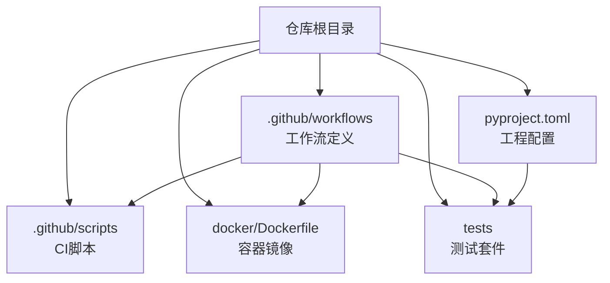
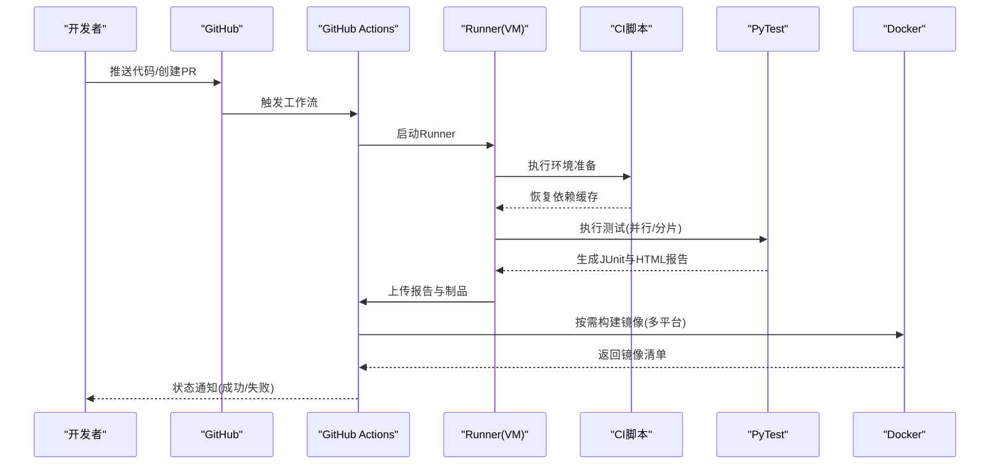
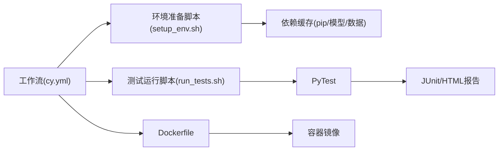

# 测试自动化与CI/CD

<cite>
**本文引用的文件**
- [pyproject.toml](file://pyproject.toml)
- [docker/Dockerfile](file://docker/Dockerfile)
- [.github/workflows/ci.yml](file://.github/workflows/ci.yml)
- [.github/workflows/docker-publish.yml](file://.github/workflows/docker-publish.yml)
- [.github/scripts/setup_env.sh](file://.github/scripts/setup_env.sh)
- [.github/scripts/run_tests.sh](file://.github/scripts/run_tests.sh)
- [tests/conftest.py](file://tests/conftest.py)
- [tests/cache_test_assets.py](file://tests/cache_test_assets.py)
</cite>

## 目录
1. [简介](#简介)
2. [项目结构](#项目结构)
3. [核心组件](#核心组件)
4. [架构总览](#架构总览)
5. [详细组件分析](#详细组件分析)
6. [依赖关系分析](#依赖关系分析)
7. [性能考虑](#性能考虑)
8. [故障排查指南](#故障排查指南)
9. [结论](#结论)
10. [附录](#附录)

## 简介
本文件面向YOLO-Master项目的测试自动化与CI/CD集成，目标是：
- 说明GitHub Actions工作流的配置与自定义方式，包括测试矩阵并行执行与环境矩阵设置
- 解释测试任务的编排与依赖管理（顺序控制、资源分配）
- 文档化测试报告的自动生成与发布（HTML报告与JUnit格式输出）
- 集成代码质量检查（静态分析、格式检查、类型检查）
- 容器化测试环境的构建与管理（含多平台支持）
- 提供缓存与加速策略（依赖缓存、测试数据预加载）
- 建立失败告警通知与故障排查流程

## 项目结构
仓库中与测试自动化和CI/CD相关的关键位置如下：
- .github/workflows：GitHub Actions工作流定义
- .github/scripts：CI脚本（环境准备、测试运行等）
- docker/Dockerfile：容器镜像构建定义
- tests：PyTest测试套件与公共夹具
- pyproject.toml：Python工程元数据与可选工具配置入口

图表来源
- [.github/workflows/ci.yml](file://.github/workflows/ci.yml)
- [.github/workflows/docker-publish.yml](file://.github/workflows/docker-publish.yml)
- [.github/scripts/setup_env.sh](file://.github/scripts/setup_env.sh)
- [.github/scripts/run_tests.sh](file://.github/scripts/run_tests.sh)
- [docker/Dockerfile](file://docker/Dockerfile)
- [tests/conftest.py](file://tests/conftest.py)
- [pyproject.toml](file://pyproject.toml)

章节来源
- [.github/workflows/ci.yml](file://.github/workflows/ci.yml)
- [.github/workflows/docker-publish.yml](file://.github/workflows/docker-publish.yml)
- [.github/scripts/setup_env.sh](file://.github/scripts/setup_env.sh)
- [.github/scripts/run_tests.sh](file://.github/scripts/run_tests.sh)
- [docker/Dockerfile](file://docker/Dockerfile)
- [tests/conftest.py](file://tests/conftest.py)
- [pyproject.toml](file://pyproject.toml)

## 核心组件
- GitHub Actions工作流
  - CI主流程：触发条件、环境矩阵、任务编排、缓存、测试执行、报告上传、制品归档
  - Docker发布流程：镜像构建、多平台构建、推送至注册表
- CI脚本
  - 环境准备脚本：安装系统依赖、Python版本切换、依赖缓存恢复/保存
  - 测试运行脚本：调用pytest并生成JUnit与HTML报告
- 容器镜像
  - Dockerfile：基础镜像、CUDA/驱动、Python环境、依赖安装、时区与语言环境
- 测试套件
  - conftest.py：全局夹具、设备探测、数据集路径、日志与报告输出
  - cache_test_assets.py：测试数据下载与缓存逻辑

章节来源
- [.github/workflows/ci.yml](file://.github/workflows/ci.yml)
- [.github/workflows/docker-publish.yml](file://.github/workflows/docker-publish.yml)
- [.github/scripts/setup_env.sh](file://.github/scripts/setup_env.sh)
- [.github/scripts/run_tests.sh](file://.github/scripts/run_tests.sh)
- [docker/Dockerfile](file://docker/Dockerfile)
- [tests/conftest.py](file://tests/conftest.py)
- [tests/cache_test_assets.py](file://tests/cache_test_assets.py)

## 架构总览
下图展示了从代码提交到测试执行、报告产出与制品发布的端到端流程。

图表来源
- [.github/workflows/ci.yml](file://.github/workflows/ci.yml)
- [.github/workflows/docker-publish.yml](file://.github/workflows/docker-publish.yml)
- [.github/scripts/setup_env.sh](file://.github/scripts/setup_env.sh)
- [.github/scripts/run_tests.sh](file://.github/scripts/run_tests.sh)
- [docker/Dockerfile](file://docker/Dockerfile)

## 详细组件分析

### GitHub Actions工作流：CI主流程
- 触发条件
  - 默认分支推送、Pull Request事件、手动触发
- 环境矩阵
  - Python版本矩阵
  - OS矩阵（Linux/macOS/Windows）
  - GPU可用性标记（用于跳过或降级GPU相关用例）
- 任务编排
  - 步骤顺序：检出代码→设置Python→恢复缓存→安装依赖→运行测试→生成报告→上传制品
  - 并行策略：按矩阵维度并发；测试阶段可按分片或标签分组并行
- 缓存
  - pip包缓存、模型权重/数据集缓存、构建产物缓存
- 测试执行
  - 通过脚本调用pytest，指定插件与参数以输出JUnit与HTML报告
- 报告与制品
  - 将JUnit XML与HTML报告作为工件上传，便于在Actions页面查看与归档
- 失败处理
  - 使用continue-on-error控制非关键任务失败不阻断整体流程
  - 可结合通知渠道进行告警（见“故障排查指南”）

章节来源
- [.github/workflows/ci.yml](file://.github/workflows/ci.yml)

### GitHub Actions工作流：Docker发布流程
- 触发条件
  - 推送tag或手动触发
- 构建策略
  - 启用多平台构建（如linux/amd64、linux/arm64）
  - 使用Buildx与QEMU实现跨平台构建
- 镜像标签
  - 基于Git tag与短SHA生成镜像标签
- 推送与清单
  - 登录注册表→构建并推送镜像→生成并推送多平台清单
- 安全与凭据
  - 使用GitHub Secrets注入凭据

章节来源
- [.github/workflows/docker-publish.yml](file://.github/workflows/docker-publish.yml)

### CI脚本：环境准备与测试运行
- 环境准备脚本
  - 安装系统依赖（如图形库、编译工具链）
  - 切换Python版本（使用官方工具）
  - 恢复/保存pip缓存与第三方包缓存
  - 初始化测试数据缓存（若存在）
- 测试运行脚本
  - 调用pytest，指定：
    - JUnit输出路径
    - HTML报告输出路径
    - 并行选项（如进程数或分片）
    - 过滤标签（如仅CPU、仅GPU、快速回归）
  - 根据环境变量调整行为（如是否跳过网络下载、是否启用GPU）

章节来源
- [.github/scripts/setup_env.sh](file://.github/scripts/setup_env.sh)
- [.github/scripts/run_tests.sh](file://.github/scripts/run_tests.sh)

### 容器镜像：Dockerfile
- 基础镜像
  - 选择包含CUDA运行时与必要驱动的基础镜像（如需GPU测试）
- 系统依赖
  - 安装必要的系统库（如图像解码、音频、字体等）
- Python环境
  - 安装指定版本的Python与pip
- 应用依赖
  - 复制依赖清单并安装（优先使用缓存层）
- 运行环境
  - 设置时区、语言环境、用户权限
  - 暴露端口（如需要UI或服务）

章节来源
- [docker/Dockerfile](file://docker/Dockerfile)

### 测试套件：PyTest夹具与数据缓存
- conftest.py
  - 全局夹具：设备探测（CPU/GPU）、数据集路径解析、临时目录清理
  - 报告钩子：统一日志输出、失败截图/轨迹保存（可选）
- cache_test_assets.py
  - 检测本地缓存是否存在，不存在则下载并写入缓存目录
  - 支持断点续传与校验（可选）

章节来源
- [tests/conftest.py](file://tests/conftest.py)
- [tests/cache_test_assets.py](file://tests/cache_test_assets.py)

### 工程配置：pyproject.toml
- 作用
  - 声明项目元数据、依赖、可选工具配置入口（如ruff、mypy、pytest等）
- 与CI的关系
  - 工作流中可通过该文件定位依赖安装命令与工具配置项
  - 便于统一维护依赖版本与工具参数

章节来源
- [pyproject.toml](file://pyproject.toml)

## 依赖关系分析
下图展示工作流、脚本、镜像与测试套件之间的依赖关系。

图表来源
- [.github/workflows/ci.yml](file://.github/workflows/ci.yml)
- [.github/scripts/setup_env.sh](file://.github/scripts/setup_env.sh)
- [.github/scripts/run_tests.sh](file://.github/scripts/run_tests.sh)
- [docker/Dockerfile](file://docker/Dockerfile)

章节来源
- [.github/workflows/ci.yml](file://.github/workflows/ci.yml)
- [.github/scripts/setup_env.sh](file://.github/scripts/setup_env.sh)
- [.github/scripts/run_tests.sh](file://.github/scripts/run_tests.sh)
- [docker/Dockerfile](file://docker/Dockerfile)

## 性能考虑
- 并行与分片
  - 使用矩阵维度并行执行不同环境与任务
  - 对大型测试集采用分片或标签分组，缩短单次运行时间
- 缓存策略
  - pip包缓存：按操作系统与Python版本键名隔离
  - 模型与数据集缓存：按哈希或版本号持久化，避免重复下载
  - 构建缓存：Docker层缓存与中间产物缓存
- 资源分配
  - 为GPU密集型任务分配更大实例规格
  - 限制并发度以避免Runner资源争用
- 增量执行
  - 仅运行受影响模块的测试（基于变更范围）
  - 使用预热与懒加载减少冷启动开销

[本节为通用指导，无需源码引用]

## 故障排查指南
- 常见失败场景
  - 依赖安装失败：检查网络、镜像源、缓存键冲突
  - 测试超时：增加实例规格、降低并发、拆分测试集
  - GPU不可用：确认驱动与CUDA版本匹配，必要时降级为CPU模式
  - 报告缺失：确认pytest参数与输出路径正确，检查权限
- 定位方法
  - 查看Actions日志与工件（JUnit/HTML报告）
  - 在本地复现：使用相同Docker镜像与缓存策略
  - 最小化用例：通过标签筛选快速定位问题
- 告警与通知
  - 可在工作流中添加通知步骤（如邮件、IM），在失败时发送告警
  - 建议将关键指标（通过率、耗时、失败用例）纳入仪表盘

章节来源
- [.github/workflows/ci.yml](file://.github/workflows/ci.yml)
- [.github/scripts/run_tests.sh](file://.github/scripts/run_tests.sh)

## 结论
通过标准化的工作流、脚本与容器化方案，YOLO-Master实现了跨平台、可扩展且高效的测试自动化体系。借助缓存与并行策略，显著缩短了反馈周期；通过JUnit与HTML报告，提升了可观测性与可追溯性。后续可进一步引入变更影响分析、智能分片与更细粒度的失败告警，持续提升交付质量与效率。

[本节为总结性内容，无需源码引用]

## 附录
- 术语
  - 矩阵：工作流中按多个维度组合生成的并发任务集合
  - 工件：工作流产出的可下载文件（如报告、镜像）
  - 缓存：跨运行持久化的数据（依赖、模型、数据集）
- 最佳实践
  - 保持缓存键稳定且区分环境
  - 将耗时操作前置并缓存结果
  - 使用标签组织测试，便于选择性执行
  - 为关键任务设置超时与重试策略

[本节为补充信息，无需源码引用]