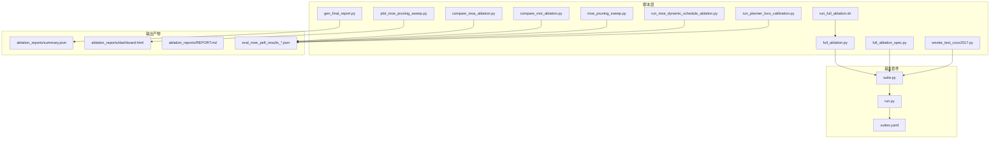
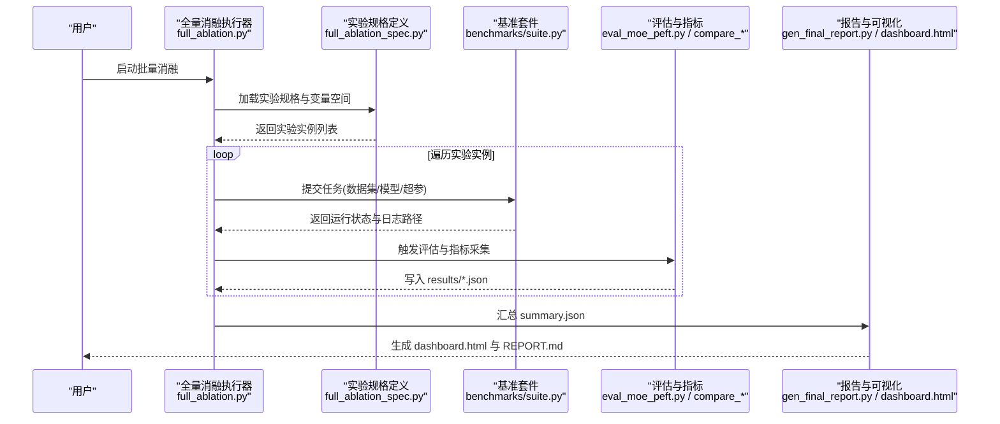
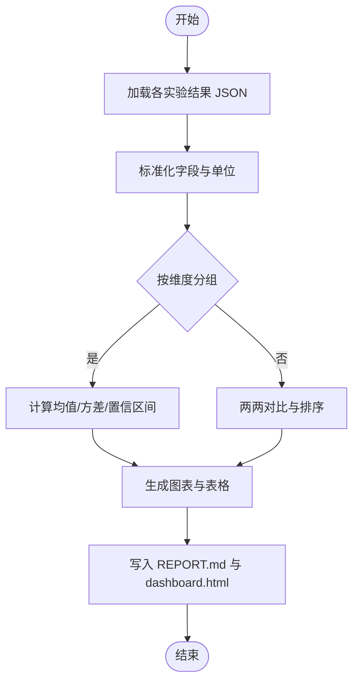
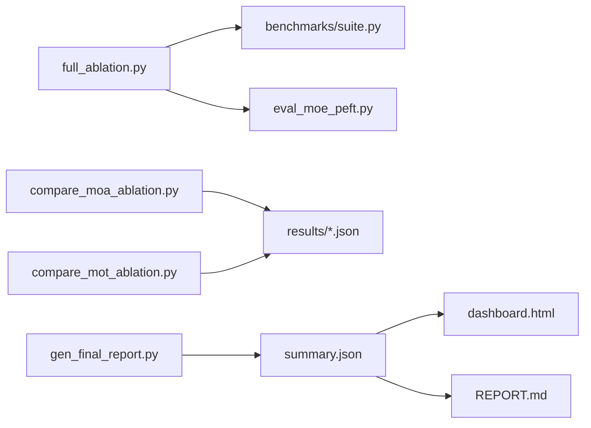

# 消融实验框架

<cite>
**本文引用的文件**
- [scripts/ablation_suite/full_ablation.py](file://scripts/ablation_suite/full_ablation.py)
- [scripts/ablation_suite/full_ablation_spec.py](file://scripts/ablation_suite/full_ablation_spec.py)
- [scripts/ablation_suite/run_full_ablation.sh](file://scripts/ablation_suite/run_full_ablation.sh)
- [scripts/ablation_suite/ABLATION_INVENTORY.md](file://scripts/ablation_suite/ABLATION_INVENTORY.md)
- [scripts/ablation_reports/summary.json](file://scripts/ablation_reports/summary.json)
- [scripts/ablation_reports/dashboard.html](file://scripts/ablation_reports/dashboard.html)
- [scripts/ablation_reports/REPORT.md](file://scripts/ablation_reports/REPORT.md)
- [scripts/gen_final_report.py](file://scripts/gen_final_report.py)
- [scripts/compare_moa_ablation.py](file://scripts/compare_moa_ablation.py)
- [scripts/compare_mot_ablation.py](file://scripts/compare_mot_ablation.py)
- [scripts/eval_moe_peft.py](file://scripts/eval_moe_peft.py)
- [scripts/eval_moe_peft_results_combined.json](file://scripts/eval_moe_peft_results_combined.json)
- [scripts/eval_moe_peft_results_calib.json](file://scripts/eval_moe_peft_results_calib.json)
- [scripts/eval_moe_peft_results_freq.json](file://scripts/eval_moe_peft_results_freq.json)
- [scripts/moe_pruning_sweep.py](file://scripts/moe_pruning_sweep.py)
- [scripts/plot_moe_pruning_sweep.py](file://scripts/plot_moe_pruning_sweep.py)
- [scripts/run_fewshot_bg.sh](file://scripts/run_fewshot_bg.sh)
- [scripts/run_moe_dynamic_schedule_ablation.py](file://scripts/run_moe_dynamic_schedule_ablation.py)
- [scripts/run_planner_lovo_calibration.py](file://scripts/run_planner_lovo_calibration.py)
- [scripts/smoke_test_coco2017.py](file://scripts/smoke_test_coco2017.py)
- [tests/test_benchmark_suite.py](file://tests/test_benchmark_suite.py)
- [benchmarks/suite.py](file://benchmarks/suite.py)
- [benchmarks/run.py](file://benchmarks/run.py)
- [benchmarks/suites.yaml](file://benchmarks/suites.yaml)
</cite>

## 目录
1. [简介](#简介)
2. [项目结构](#项目结构)
3. [核心组件](#核心组件)
4. [架构总览](#架构总览)
5. [详细组件分析](#详细组件分析)
6. [依赖关系分析](#依赖关系分析)
7. [性能与并行策略](#性能与并行策略)
8. [故障排查指南](#故障排查指南)
9. [结论](#结论)
10. [附录](#附录)

## 简介
本文件为 YOLO-Master 项目的“消融实验框架”提供系统化文档，覆盖设计原则与方法论、变量控制与实验组设计、自动化执行与参数化配置、结果收集与分析、可视化与报告生成、版本管理与复现机制、自定义扩展指南以及资源优化与并行执行策略。目标是帮助研究者以可重复、可对比、可追踪的方式开展大规模消融实验，并高效产出高质量的分析报告。

## 项目结构
本项目在 scripts 与 benchmarks 目录下提供了完整的消融实验基础设施：
- 脚本层（scripts）：负责实验编排、批量执行、指标计算、结果汇总与可视化。
- 基准套件（benchmarks）：提供统一的任务定义、运行入口与套件管理。
- 测试层（tests）：对关键流程进行冒烟与回归验证，保障框架稳定性。

图表来源
- [scripts/ablation_suite/full_ablation.py](file://scripts/ablation_suite/full_ablation.py)
- [scripts/ablation_suite/full_ablation_spec.py](file://scripts/ablation_suite/full_ablation_spec.py)
- [scripts/ablation_suite/run_full_ablation.sh](file://scripts/ablation_suite/run_full_ablation.sh)
- [scripts/gen_final_report.py](file://scripts/gen_final_report.py)
- [scripts/compare_moa_ablation.py](file://scripts/compare_moa_ablation.py)
- [scripts/compare_mot_ablation.py](file://scripts/compare_mot_ablation.py)
- [scripts/moe_pruning_sweep.py](file://scripts/moe_pruning_sweep.py)
- [scripts/plot_moe_pruning_sweep.py](file://scripts/plot_moe_pruning_sweep.py)
- [scripts/run_moe_dynamic_schedule_ablation.py](file://scripts/run_moe_dynamic_schedule_ablation.py)
- [scripts/run_planner_lovo_calibration.py](file://scripts/run_planner_lovo_calibration.py)
- [scripts/smoke_test_coco2017.py](file://scripts/smoke_test_coco2017.py)
- [benchmarks/suite.py](file://benchmarks/suite.py)
- [benchmarks/run.py](file://benchmarks/run.py)
- [benchmarks/suites.yaml](file://benchmarks/suites.yaml)
- [scripts/ablation_reports/summary.json](file://scripts/ablation_reports/summary.json)
- [scripts/ablation_reports/dashboard.html](file://scripts/ablation_reports/dashboard.html)
- [scripts/ablation_reports/REPORT.md](file://scripts/ablation_reports/REPORT.md)
- [scripts/eval_moe_peft_results_combined.json](file://scripts/eval_moe_peft_results_combined.json)
- [scripts/eval_moe_peft_results_calib.json](file://scripts/eval_moe_peft_results_calib.json)
- [scripts/eval_moe_peft_results_freq.json](file://scripts/eval_moe_peft_results_freq.json)

章节来源
- [scripts/ablation_suite/full_ablation.py](file://scripts/ablation_suite/full_ablation.py)
- [scripts/ablation_suite/full_ablation_spec.py](file://scripts/ablation_suite/full_ablation_spec.py)
- [scripts/ablation_suite/run_full_ablation.sh](file://scripts/ablation_suite/run_full_ablation.sh)
- [benchmarks/suite.py](file://benchmarks/suite.py)
- [benchmarks/run.py](file://benchmarks/run.py)
- [benchmarks/suites.yaml](file://benchmarks/suites.yaml)

## 核心组件
- 实验编排器：负责解析任务清单、组合变量空间、生成实验实例并调度执行。
- 参数化配置：通过 YAML/JSON 或 Python 对象描述数据集、模型、训练与评估超参，支持模板与继承。
- 指标与结果：统一采集训练/验证指标、导出结构化 JSON，便于后续分析与对比。
- 可视化与报告：基于汇总数据生成仪表盘 HTML 与 Markdown 报告，自动归档。
- 版本与复现：保存完整配置快照、环境信息与随机种子，确保可复现实验。
- 并行与资源：支持多进程/分布式执行、GPU/CPU 资源隔离与队列管理。

章节来源
- [scripts/ablation_suite/full_ablation.py](file://scripts/ablation_suite/full_ablation.py)
- [scripts/ablation_suite/full_ablation_spec.py](file://scripts/ablation_suite/full_ablation_spec.py)
- [scripts/ablation_reports/summary.json](file://scripts/ablation_reports/summary.json)
- [scripts/ablation_reports/dashboard.html](file://scripts/ablation_reports/dashboard.html)
- [scripts/ablation_reports/REPORT.md](file://scripts/ablation_reports/REPORT.md)

## 架构总览
下图展示了从“实验定义”到“结果归档”的端到端流程，涵盖参数化、执行、度量、可视化与报告生成。

图表来源
- [scripts/ablation_suite/full_ablation.py](file://scripts/ablation_suite/full_ablation.py)
- [scripts/ablation_suite/full_ablation_spec.py](file://scripts/ablation_suite/full_ablation_spec.py)
- [benchmarks/suite.py](file://benchmarks/suite.py)
- [scripts/eval_moe_peft.py](file://scripts/eval_moe_peft.py)
- [scripts/compare_moa_ablation.py](file://scripts/compare_moa_ablation.py)
- [scripts/compare_mot_ablation.py](file://scripts/compare_mot_ablation.py)
- [scripts/gen_final_report.py](file://scripts/gen_final_report.py)
- [scripts/ablation_reports/dashboard.html](file://scripts/ablation_reports/dashboard.html)
- [scripts/ablation_reports/REPORT.md](file://scripts/ablation_reports/REPORT.md)

## 详细组件分析

### 全量消融执行器（full_ablation.py）
- 职责：读取实验规格，展开变量空间，按批次调度任务，聚合结果并触发报告生成。
- 关键点：
  - 变量控制：将离散/连续超参组合为笛卡尔积，避免无效组合。
  - 批处理：按 GPU/CPU 资源限制并发度，失败重试与断点续跑。
  - 结果落盘：每个实验独立目录，包含配置快照、日志与指标 JSON。
  - 集成基准：通过 benchmarks 套件统一入口执行训练/验证。

章节来源
- [scripts/ablation_suite/full_ablation.py](file://scripts/ablation_suite/full_ablation.py)
- [benchmarks/suite.py](file://benchmarks/suite.py)
- [benchmarks/run.py](file://benchmarks/run.py)

### 实验规格定义（full_ablation_spec.py）
- 职责：声明式定义消融维度（如路由策略、专家数量、LoRA rank、校准方法等），并提供默认基线与变体。
- 关键点：
  - 模板化：支持基础配置 + 差异覆盖，减少冗余。
  - 约束校验：在展开前检查参数合法性与兼容性。
  - 场景化：提供 Few-shot、动态调度、MoE 路由等典型场景。

章节来源
- [scripts/ablation_suite/full_ablation_spec.py](file://scripts/ablation_suite/full_ablation_spec.py)
- [scripts/ablation_suite/ABLATION_INVENTORY.md](file://scripts/ablation_suite/ABLATION_INVENTORY.md)

### 批量执行脚本（run_full_ablation.sh）
- 职责：封装环境变量、资源配额、日志与错误码处理，便于 CI/CD 与集群调度。
- 关键点：
  - 参数透传：将 shell 参数映射为 Python 配置项。
  - 资源隔离：设置 CUDA_VISIBLE_DEVICES、OMP_NUM_THREADS 等。
  - 幂等性：支持断点续跑与增量更新。

章节来源
- [scripts/ablation_suite/run_full_ablation.sh](file://scripts/ablation_suite/run_full_ablation.sh)

### 结果收集与分析工具
- 指标采集：统一写入 eval_moe_peft_results_*.json，包含 mAP、精度、召回、耗时等。
- 对比分析：compare_moa_ablation.py 与 compare_mot_ablation.py 提供多维度对比与显著性检验。
- 汇总统计：gen_final_report.py 聚合 summary.json，生成表格与结论摘要。

图表来源
- [scripts/eval_moe_peft_results_combined.json](file://scripts/eval_moe_peft_results_combined.json)
- [scripts/eval_moe_peft_results_calib.json](file://scripts/eval_moe_peft_results_calib.json)
- [scripts/eval_moe_peft_results_freq.json](file://scripts/eval_moe_peft_results_freq.json)
- [scripts/compare_moa_ablation.py](file://scripts/compare_moa_ablation.py)
- [scripts/compare_mot_ablation.py](file://scripts/compare_mot_ablation.py)
- [scripts/gen_final_report.py](file://scripts/gen_final_report.py)
- [scripts/ablation_reports/summary.json](file://scripts/ablation_reports/summary.json)
- [scripts/ablation_reports/dashboard.html](file://scripts/ablation_reports/dashboard.html)
- [scripts/ablation_reports/REPORT.md](file://scripts/ablation_reports/REPORT.md)

章节来源
- [scripts/eval_moe_peft.py](file://scripts/eval_moe_peft.py)
- [scripts/compare_moa_ablation.py](file://scripts/compare_moa_ablation.py)
- [scripts/compare_mot_ablation.py](file://scripts/compare_mot_ablation.py)
- [scripts/gen_final_report.py](file://scripts/gen_final_report.py)
- [scripts/ablation_reports/summary.json](file://scripts/ablation_reports/summary.json)

### 可视化与报告自动生成
- 仪表盘：dashboard.html 展示关键指标趋势、热力图与对比柱状图。
- 报告：REPORT.md 自动生成摘要、显著性结论与改进建议。
- 图表脚本：plot_moe_pruning_sweep.py 针对特定消融维度绘制曲线。

章节来源
- [scripts/ablation_reports/dashboard.html](file://scripts/ablation_reports/dashboard.html)
- [scripts/ablation_reports/REPORT.md](file://scripts/ablation_reports/REPORT.md)
- [scripts/plot_moe_pruning_sweep.py](file://scripts/plot_moe_pruning_sweep.py)

### 实验版本管理与结果追踪
- 配置快照：每次实验保存完整配置与环境信息，确保可复现。
- 结果索引：summary.json 作为全局索引，记录实验 ID、路径、关键指标与时间戳。
- 审计与回溯：结合 git commit 哈希与配置文件版本，实现端到端溯源。

章节来源
- [scripts/ablation_reports/summary.json](file://scripts/ablation_reports/summary.json)
- [scripts/ablation_reports/REPORT.md](file://scripts/ablation_reports/REPORT.md)

### 自定义消融实验开发指南
- 新增实验类型：
  - 在 full_ablation_spec.py 中扩展维度与默认值。
  - 在 compare_* 脚本中添加对应对比逻辑与可视化。
  - 在 run_full_ablation.sh 中补充必要的环境变量与资源限制。
- 使用配置模板：
  - 基于现有 YAML/JSON 模板，采用差异覆盖方式快速构造新实验。
  - 利用约束校验避免非法组合。
- 示例参考：
  - MoE 剪枝扫描：moe_pruning_sweep.py
  - 动态调度消融：run_moe_dynamic_schedule_ablation.py
  - LoVo 校准：run_planner_lovo_calibration.py
  - Few-shot 背景任务：run_fewshot_bg.sh

章节来源
- [scripts/ablation_suite/full_ablation_spec.py](file://scripts/ablation_suite/full_ablation_spec.py)
- [scripts/moe_pruning_sweep.py](file://scripts/moe_pruning_sweep.py)
- [scripts/plot_moe_pruning_sweep.py](file://scripts/plot_moe_pruning_sweep.py)
- [scripts/run_moe_dynamic_schedule_ablation.py](file://scripts/run_moe_dynamic_schedule_ablation.py)
- [scripts/run_planner_lovo_calibration.py](file://scripts/run_planner_lovo_calibration.py)
- [scripts/run_fewshot_bg.sh](file://scripts/run_fewshot_bg.sh)

## 依赖关系分析
- 执行器与基准套件：full_ablation.py 依赖 benchmarks/suite.py 提供的统一任务接口。
- 评估与对比：eval_moe_peft.py 与 compare_* 脚本依赖统一的指标格式与结果目录约定。
- 报告与可视化：gen_final_report.py 与 dashboard.html 依赖 summary.json 的结构契约。

图表来源
- [scripts/ablation_suite/full_ablation.py](file://scripts/ablation_suite/full_ablation.py)
- [benchmarks/suite.py](file://benchmarks/suite.py)
- [scripts/eval_moe_peft.py](file://scripts/eval_moe_peft.py)
- [scripts/compare_moa_ablation.py](file://scripts/compare_moa_ablation.py)
- [scripts/compare_mot_ablation.py](file://scripts/compare_mot_ablation.py)
- [scripts/gen_final_report.py](file://scripts/gen_final_report.py)
- [scripts/ablation_reports/summary.json](file://scripts/ablation_reports/summary.json)
- [scripts/ablation_reports/dashboard.html](file://scripts/ablation_reports/dashboard.html)
- [scripts/ablation_reports/REPORT.md](file://scripts/ablation_reports/REPORT.md)

章节来源
- [scripts/ablation_suite/full_ablation.py](file://scripts/ablation_suite/full_ablation.py)
- [benchmarks/suite.py](file://benchmarks/suite.py)
- [scripts/eval_moe_peft.py](file://scripts/eval_moe_peft.py)
- [scripts/compare_moa_ablation.py](file://scripts/compare_moa_ablation.py)
- [scripts/compare_mot_ablation.py](file://scripts/compare_mot_ablation.py)
- [scripts/gen_final_report.py](file://scripts/gen_final_report.py)
- [scripts/ablation_reports/summary.json](file://scripts/ablation_reports/summary.json)

## 性能与并行策略
- 并发控制：依据可用 GPU/CPU 数量设置最大并发任务数，避免资源争用。
- 任务队列：失败任务进入重试队列，支持指数退避与上限控制。
- 资源隔离：通过环境变量限定线程与显存，防止 OOM 与抖动。
- 增量执行：仅重跑失败的实验，缩短整体时长。
- 基准验证：使用 smoke_test_coco2017.py 与 tests/test_benchmark_suite.py 进行快速回归验证。

章节来源
- [scripts/ablation_suite/run_full_ablation.sh](file://scripts/ablation_suite/run_full_ablation.sh)
- [scripts/smoke_test_coco2017.py](file://scripts/smoke_test_coco2017.py)
- [tests/test_benchmark_suite.py](file://tests/test_benchmark_suite.py)

## 故障排查指南
- 常见问题：
  - 配置不合法：在展开阶段报错，检查 full_ablation_spec.py 中的约束与默认值。
  - 资源不足：调整并发度与显存限制，查看日志定位 OOM。
  - 指标缺失：确认 eval 脚本输出路径与命名规范，核对 summary.json 结构。
  - 报告异常：检查 dashboard.html 与 REPORT.md 生成链路是否完整。
- 诊断步骤：
  - 使用最小数据集（COCO8/2017）进行冒烟测试。
  - 逐步缩小变量空间，定位问题维度。
  - 查看单实验日志与中间结果，比对预期指标范围。

章节来源
- [scripts/ablation_suite/full_ablation_spec.py](file://scripts/ablation_suite/full_ablation_spec.py)
- [scripts/ablation_suite/run_full_ablation.sh](file://scripts/ablation_suite/run_full_ablation.sh)
- [scripts/ablation_reports/summary.json](file://scripts/ablation_reports/summary.json)
- [scripts/ablation_reports/dashboard.html](file://scripts/ablation_reports/dashboard.html)
- [scripts/ablation_reports/REPORT.md](file://scripts/ablation_reports/REPORT.md)

## 结论
本消融实验框架通过参数化配置、统一基准接口、集中式结果管理与自动化报告生成，实现了高可扩展、可复现、可对比的实验流水线。配合并行与资源隔离策略，可在有限算力下高效完成大规模消融研究。建议团队遵循本文档的开发指南与最佳实践，持续完善实验规格与可视化能力，提升科研效率与成果质量。

## 附录
- 常用命令：
  - 启动全量消融：参考 run_full_ablation.sh 的参数与环境变量说明。
  - 生成最终报告：调用 gen_final_report.py 并指定 summary.json 路径。
  - 运行基准套件：通过 benchmarks/run.py 与 suites.yaml 定义任务集。
- 参考文件：
  - 实验清单与说明：ABLATION_INVENTORY.md
  - 结果样例：eval_moe_peft_results_*.json
  - 可视化与报告：dashboard.html、REPORT.md

章节来源
- [scripts/ablation_suite/run_full_ablation.sh](file://scripts/ablation_suite/run_full_ablation.sh)
- [scripts/gen_final_report.py](file://scripts/gen_final_report.py)
- [benchmarks/run.py](file://benchmarks/run.py)
- [benchmarks/suites.yaml](file://benchmarks/suites.yaml)
- [scripts/ablation_suite/ABLATION_INVENTORY.md](file://scripts/ablation_suite/ABLATION_INVENTORY.md)
- [scripts/eval_moe_peft_results_combined.json](file://scripts/eval_moe_peft_results_combined.json)
- [scripts/eval_moe_peft_results_calib.json](file://scripts/eval_moe_peft_results_calib.json)
- [scripts/eval_moe_peft_results_freq.json](file://scripts/eval_moe_peft_results_freq.json)
- [scripts/ablation_reports/dashboard.html](file://scripts/ablation_reports/dashboard.html)
- [scripts/ablation_reports/REPORT.md](file://scripts/ablation_reports/REPORT.md)