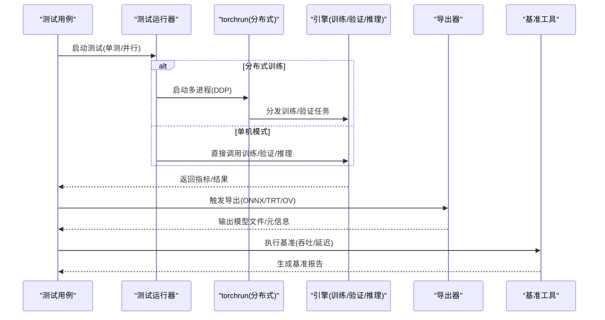
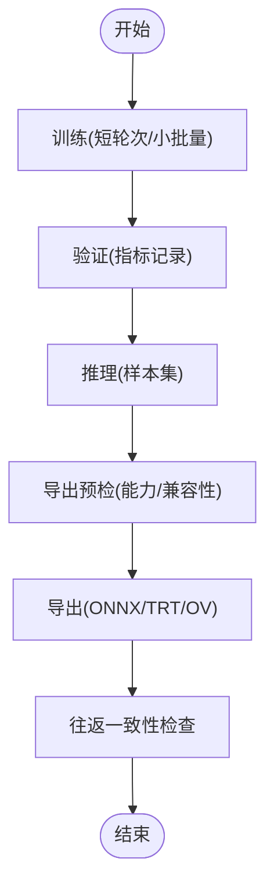
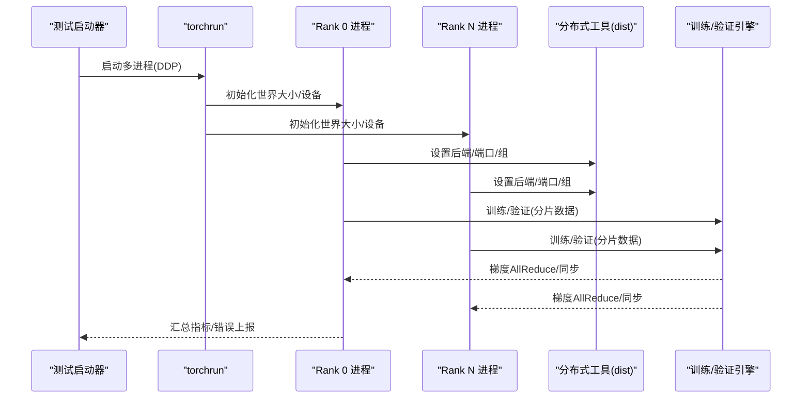
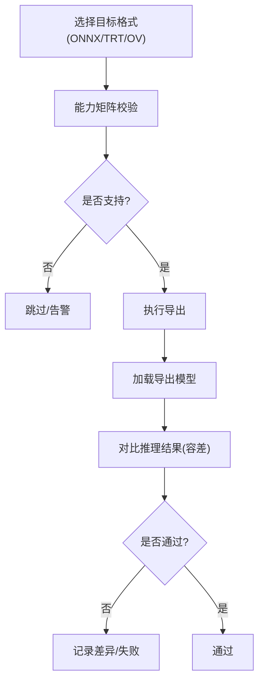
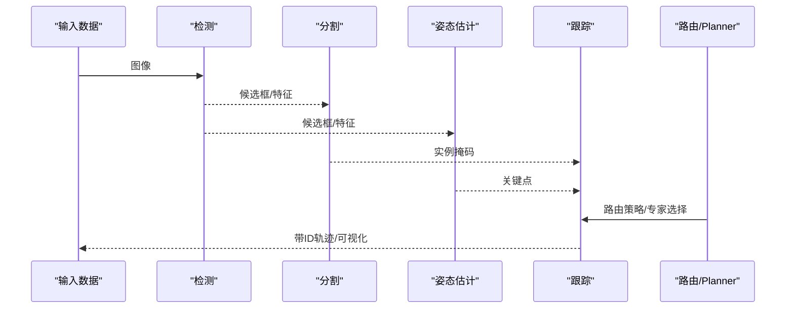
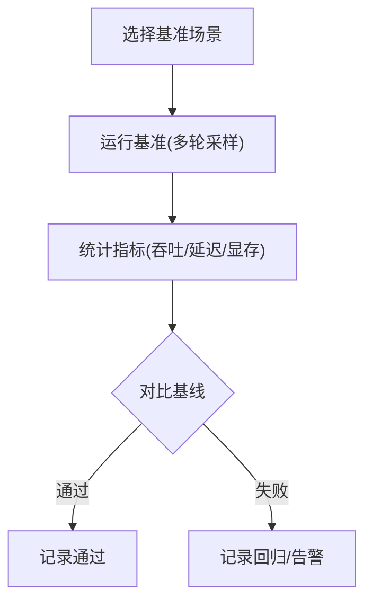
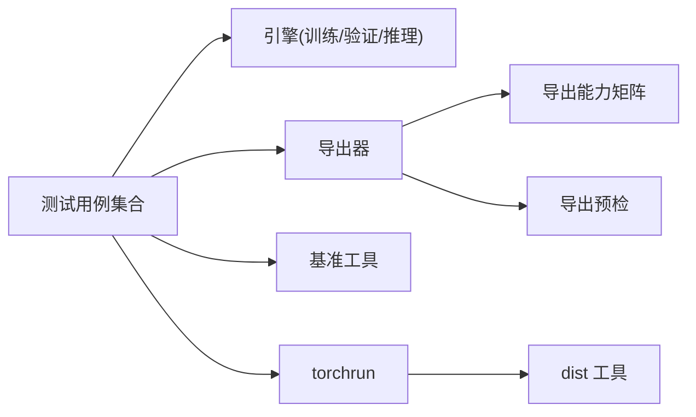

# 集成测试体系

<cite>
**本文引用的文件**
- [tests/conftest.py](file://tests/conftest.py)
- [tests/test_cli.py](file://tests/test_cli.py)
- [tests/test_engine.py](file://tests/test_engine.py)
- [tests/test_python.py](file://tests/test_python.py)
- [tests/test_integrations.py](file://tests/test_integrations.py)
- [tests/test_exports.py](file://tests/test_exports.py)
- [tests/test_export_roundtrip.py](file://tests/test_export_roundtrip.py)
- [tests/test_export_preflight.py](file://tests/test_export_preflight.py)
- [tests/test_export_capability_matrix.py](file://tests/test_export_capability_matrix.py)
- [tests/test_benchmark_suite.py](file://tests/test_benchmark_suite.py)
- [tests/ddp_moa_mot_smoke.py](file://tests/ddp_moa_mot_smoke.py)
- [tests/ddp_moe_smoke.py](file://tests/ddp_moe_smoke.py)
- [tests/ddp_moe_validation_smoke.py](file://tests/ddp_moe_validation_smoke.py)
- [tests/test_ddp_device_hardening.py](file://tests/test_ddp_device_hardening.py)
- [tests/test_ddp_error_propagation_e2e.py](file://tests/test_ddp_error传播_e2e.py)
- [tests/test_ddp_lifecycle_ema_nan.py](file://tests/test_ddp_lifecycle_ema_nan.py)
- [tests/test_ddp_root_cause_reporting.py](file://tests/test_ddp_root_cause_reporting.py)
- [tests/lora_e2e_smoke.py](file://tests/lora_e2e_smoke.py)
- [tests/lora_rankless_smoke.py](file://tests/lora_rankless_smoke.py)
- [tests/test_lovo_e2e.py](file://tests/test_lovo_e2e.py)
- [tests/test_mot.py](file://tests/test_mot.py)
- [tests/test_moa.py](file://tests/test_moa.py)
- [tests/test_moe.py](file://tests/test_moe.py)
- [tests/test_planner_integration.py](file://tests/test_planner_integration.py)
- [tests/test_solutions.py](file://tests/test_solutions.py)
- [ultralytics/engine/exporter.py](file://ultralytics/engine/exporter.py)
- [ultralytics/utils/export_capabilities.py](file://ultralytics/utils/export_capabilities.py)
- [ultralytics/utils/export_preflight.py](file://ultralytics/utils/export_preflight.py)
- [ultralytics/utils/benchmarks.py](file://ultralytics/utils/benchmarks.py)
- [ultralytics/utils/dist.py](file://ultralytics/utils/dist.py)
- [ultralytics/utils/torchrun.py](file://ultralytics/utils/torchrun.py)
- [benchmarks/suite.py](file://benchmarks/suite.py)
- [benchmarks/run.py](file://benchmarks/run.py)
</cite>

## 目录
1. [简介](#简介)
2. [项目结构](#项目结构)
3. [核心组件](#核心组件)
4. [架构总览](#架构总览)
5. [详细组件分析](#详细组件分析)
6. [依赖关系分析](#依赖关系分析)
7. [性能考量](#性能考量)
8. [故障排查指南](#故障排查指南)
9. [结论](#结论)
10. [附录](#附录)

## 简介
本文件面向YOLO-Master项目的集成测试体系，聚焦端到端流程（训练、验证、推理、导出）、分布式训练（DDP与多GPU）、模型导出（ONNX/TensorRT/OpenVINO）与多模态能力（检测/分割/姿态估计组合）的集成测试设计与实现。同时覆盖性能回归测试、环境隔离与资源管理最佳实践，以及失败调试与日志分析方法。

## 项目结构
仓库采用“功能域+测试用例”的组织方式：
- 核心引擎与工具位于 ultralytics 包下，包含导出、基准、分布式等关键模块。
- 测试用例集中于 tests 目录，按主题划分（如 DDP、导出、MoE/MoA、LoRA、MOT、Planner 等）。
- 基准套件在 benchmarks 目录，提供统一入口与套件编排。

```mermaid
graph TB
subgraph "测试层"
T_Conf["conftest.py"]
T_CLI["test_cli.py"]
T_Engine["test_engine.py"]
T_Python["test_python.py"]
T_Integ["test_integrations.py"]
T_Export["test_exports.py"]
T_RT["test_export_roundtrip.py"]
T_Pref["test_export_preflight.py"]
T_Cap["test_export_capability_matrix.py"]
T_Bench["test_benchmark_suite.py"]
T_DDP_MoA["ddp_moa_mot_smoke.py"]
T_DDP_MoE["ddp_moe_smoke.py"]
T_DDP_Val["ddp_moe_validation_smoke.py"]
T_LoRA_E2E["lora_e2e_smoke.py"]
T_LoRA_RL["lora_rankless_smoke.py"]
T_LOVO["test_lovo_e2e.py"]
T_MOT["test_mot.py"]
T_MOA["test_moa.py"]
T_MOE["test_moe.py"]
T_Planner["test_planner_integration.py"]
T_Sol["test_solutions.py"]
end
subgraph "运行期与工具"
U_Exp["engine/exporter.py"]
U_Cap["utils/export_capabilities.py"]
U_Pref["utils/export_preflight.py"]
U_Bench["utils/benchmarks.py"]
U_Dist["utils/dist.py"]
U_TorchRun["utils/torchrun.py"]
end
subgraph "基准套件"
B_Suite["benchmarks/suite.py"]
B_Run["benchmarks/run.py"]
end
T_Conf --> T_CLI
T_Conf --> T_Engine
T_Conf --> T_Python
T_Conf --> T_Integ
T_Conf --> T_Export
T_Conf --> T_RT
T_Conf --> T_Pref
T_Conf --> T_Cap
T_Conf --> T_Bench
T_Conf --> T_DDP_MoA
T_Conf --> T_DDP_MoE
T_Conf --> T_DDP_Val
T_Conf --> T_LoRA_E2E
T_Conf --> T_LoRA_RL
T_Conf --> T_LOVO
T_Conf --> T_MOT
T_Conf --> T_MOA
T_Conf --> T_MOE
T_Conf --> T_Planner
T_Conf --> T_Sol
T_Export --> U_Exp
T_RT --> U_Exp
T_Pref --> U_Pref
T_Cap --> U_Cap
T_Bench --> U_Bench
T_DDP_MoA --> U_Dist
T_DDP_MoE --> U_Dist
T_DDP_Val --> U_Dist
T_DDP_MoA --> U_TorchRun
T_DDP_MoE --> U_TorchRun
T_DDP_Val --> U_TorchRun
B_Suite --> U_Bench
B_Run --> B_Suite
```

图示来源
- [tests/conftest.py](file://tests/conftest.py)
- [tests/test_cli.py](file://tests/test_cli.py)
- [tests/test_engine.py](file://tests/test_engine.py)
- [tests/test_python.py](file://tests/test_python.py)
- [tests/test_integrations.py](file://tests/test_integrations.py)
- [tests/test_exports.py](file://tests/test_exports.py)
- [tests/test_export_roundtrip.py](file://tests/test_export_roundtrip.py)
- [tests/test_export_preflight.py](file://tests/test_export_preflight.py)
- [tests/test_export_capability_matrix.py](file://tests/test_export_capability_matrix.py)
- [tests/test_benchmark_suite.py](file://tests/test_benchmark_suite.py)
- [tests/ddp_moa_mot_smoke.py](file://tests/ddp_moa_mot_smoke.py)
- [tests/ddp_moe_smoke.py](file://tests/ddp_moe_smoke.py)
- [tests/ddp_moe_validation_smoke.py](file://tests/ddp_moe_validation_smoke.py)
- [ultralytics/engine/exporter.py](file://ultralytics/engine/exporter.py)
- [ultralytics/utils/export_capabilities.py](file://ultralytics/utils/export_capabilities.py)
- [ultralytics/utils/export_preflight.py](file://ultralytics/utils/export_preflight.py)
- [ultralytics/utils/benchmarks.py](file://ultralytics/utils/benchmarks.py)
- [ultralytics/utils/dist.py](file://ultralytics/utils/dist.py)
- [ultralytics/utils/torchrun.py](file://ultralytics/utils/torchrun.py)
- [benchmarks/suite.py](file://benchmarks/suite.py)
- [benchmarks/run.py](file://benchmarks/run.py)

章节来源
- [tests/conftest.py](file://tests/conftest.py)
- [tests/test_cli.py](file://tests/test_cli.py)
- [tests/test_engine.py](file://tests/test_engine.py)
- [tests/test_python.py](file://tests/test_python.py)
- [tests/test_integrations.py](file://tests/test_integrations.py)
- [tests/test_exports.py](file://tests/test_exports.py)
- [tests/test_export_roundtrip.py](file://tests/test_export_roundtrip.py)
- [tests/test_export_preflight.py](file://tests/test_export_preflight.py)
- [tests/test_export_capability_matrix.py](file://tests/test_export_capability_matrix.py)
- [tests/test_benchmark_suite.py](file://tests/test_benchmark_suite.py)
- [tests/ddp_moa_mot_smoke.py](file://tests/ddp_moa_mot_smoke.py)
- [tests/ddp_moe_smoke.py](file://tests/ddp_moe_smoke.py)
- [tests/ddp_moe_validation_smoke.py](file://tests/ddp_moe_validation_smoke.py)
- [ultralytics/engine/exporter.py](file://ultralytics/engine/exporter.py)
- [ultralytics/utils/export_capabilities.py](file://ultralytics/utils/export_capabilities.py)
- [ultralytics/utils/export_preflight.py](file://ultralytics/utils/export_preflight.py)
- [ultralytics/utils/benchmarks.py](file://ultralytics/utils/benchmarks.py)
- [ultralytics/utils/dist.py](file://ultralytics/utils/dist.py)
- [ultralytics/utils/torchrun.py](file://ultralytics/utils/torchrun.py)
- [benchmarks/suite.py](file://benchmarks/suite.py)
- [benchmarks/run.py](file://benchmarks/run.py)

## 核心组件
- 端到端训练/验证/推理/导出流水线
  - 通过 CLI 与 Python API 驱动，覆盖数据加载、模型构建、训练循环、指标计算、结果保存与导出。
  - 参考路径：[tests/test_cli.py](file://tests/test_cli.py)、[tests/test_engine.py](file://tests/test_engine.py)、[tests/test_python.py](file://tests/test_python.py)。
- 分布式训练（DDP）
  - 使用 torchrun 启动多进程，校验设备分配、错误传播、EMA/NAN 处理与根因报告。
  - 参考路径：[tests/ddp_moe_smoke.py](file://tests/ddp_moe_smoke.py)、[tests/ddp_moa_mot_smoke.py](file://tests/ddp_moa_mot_smoke.py)、[tests/ddp_moe_validation_smoke.py](file://tests/ddp_moe_validation_smoke.py)、[tests/test_ddp_device_hardening.py](file://tests/test_ddp_device_hardening.py)、[tests/test_ddp_error_propagation_e2e.py](file://tests/test_ddp_error传播_e2e.py)、[tests/test_ddp_lifecycle_ema_nan.py](file://tests/test_ddp_lifecycle_ema_nan.py)、[tests/test_ddp_root_cause_reporting.py](file://tests/test_ddp_root_cause_reporting.py)、[ultralytics/utils/torchrun.py](file://ultralytics/utils/torchrun.py)、[ultralytics/utils/dist.py](file://ultralytics/utils/dist.py)。
- 模型导出与格式验证
  - ONNX/TensorRT/OpenVINO 等格式的导出预检、能力矩阵校验、往返一致性检查。
  - 参考路径：[tests/test_exports.py](file://tests/test_exports.py)、[tests/test_export_roundtrip.py](file://tests/test_export_roundtrip.py)、[tests/test_export_preflight.py](file://tests/test_export_preflight.py)、[tests/test_export_capability_matrix.py](file://tests/test_export_capability_matrix.py)、[ultralytics/engine/exporter.py](file://ultralytics/engine/exporter.py)、[ultralytics/utils/export_capabilities.py](file://ultralytics/utils/export_capabilities.py)、[ultralytics/utils/export_preflight.py](file://ultralytics/utils/export_preflight.py)。
- 多模态与任务组合
  - 检测、分割、姿态估计的组合场景与跟踪链路验证。
  - 参考路径：[tests/test_mot.py](file://tests/test_mot.py)、[tests/test_moa.py](file://tests/test_moa.py)、[tests/test_moe.py](file://tests/test_moe.py)、[tests/test_planner_integration.py](file://tests/test_planner_integration.py)、[tests/test_solutions.py](file://tests/test_solutions.py)。
- 性能回归测试
  - 基于基准套件与运行时基准工具，进行吞吐/延迟对比与阈值判定。
  - 参考路径：[tests/test_benchmark_suite.py](file://tests/test_benchmark_suite.py)、[ultralytics/utils/benchmarks.py](file://ultralytics/utils/benchmarks.py)、[benchmarks/suite.py](file://benchmarks/suite.py)、[benchmarks/run.py](file://benchmarks/run.py)。

章节来源
- [tests/test_cli.py](file://tests/test_cli.py)
- [tests/test_engine.py](file://tests/test_engine.py)
- [tests/test_python.py](file://tests/test_python.py)
- [tests/ddp_moe_smoke.py](file://tests/ddp_moe_smoke.py)
- [tests/ddp_moa_mot_smoke.py](file://tests/ddp_moa_mot_smoke.py)
- [tests/ddp_moe_validation_smoke.py](file://tests/ddp_moe_validation_smoke.py)
- [tests/test_ddp_device_hardening.py](file://tests/test_ddp_device_hardening.py)
- [tests/test_ddp_error_propagation_e2e.py](file://tests/test_ddp_error传播_e2e.py)
- [tests/test_ddp_lifecycle_ema_nan.py](file://tests/test_ddp_lifecycle_ema_nan.py)
- [tests/test_ddp_root_cause_reporting.py](file://tests/test_ddp_root_cause_reporting.py)
- [tests/test_exports.py](file://tests/test_exports.py)
- [tests/test_export_roundtrip.py](file://tests/test_export_roundtrip.py)
- [tests/test_export_preflight.py](file://tests/test_export_preflight.py)
- [tests/test_export_capability_matrix.py](file://tests/test_export_capability_matrix.py)
- [tests/test_mot.py](file://tests/test_mot.py)
- [tests/test_moa.py](file://tests/test_moa.py)
- [tests/test_moe.py](file://tests/test_moe.py)
- [tests/test_planner_integration.py](file://tests/test_planner_integration.py)
- [tests/test_solutions.py](file://tests/test_solutions.py)
- [tests/test_benchmark_suite.py](file://tests/test_benchmark_suite.py)
- [ultralytics/engine/exporter.py](file://ultralytics/engine/exporter.py)
- [ultralytics/utils/export_capabilities.py](file://ultralytics/utils/export_capabilities.py)
- [ultralytics/utils/export_preflight.py](file://ultralytics/utils/export_preflight.py)
- [ultralytics/utils/benchmarks.py](file://ultralytics/utils/benchmarks.py)
- [ultralytics/utils/torchrun.py](file://ultralytics/utils/torchrun.py)
- [ultralytics/utils/dist.py](file://ultralytics/utils/dist.py)
- [benchmarks/suite.py](file://benchmarks/suite.py)
- [benchmarks/run.py](file://benchmarks/run.py)

## 架构总览
下图展示从测试入口到运行期组件的调用关系，涵盖训练/验证/推理/导出与分布式执行路径。

图示来源
- [tests/conftest.py](file://tests/conftest.py)
- [tests/test_cli.py](file://tests/test_cli.py)
- [tests/test_engine.py](file://tests/test_engine.py)
- [tests/test_python.py](file://tests/test_python.py)
- [tests/test_exports.py](file://tests/test_exports.py)
- [tests/test_benchmark_suite.py](file://tests/test_benchmark_suite.py)
- [ultralytics/utils/torchrun.py](file://ultralytics/utils/torchrun.py)
- [ultralytics/engine/exporter.py](file://ultralytics/engine/exporter.py)
- [ultralytics/utils/benchmarks.py](file://ultralytics/utils/benchmarks.py)

## 详细组件分析

### 端到端训练/验证/推理/导出流程
- 设计要点
  - 以最小数据集和短轮次快速验证主流程连通性。
  - 训练后自动触发验证，再对产出权重进行推理与导出。
  - 导出前进行能力与预检校验，导出后进行往返一致性检查。
- 关键断言
  - 训练收敛性：损失下降、指标达到最低阈值。
  - 推理正确性：输出张量形状、类别数、置信度范围。
  - 导出完整性：目标格式存在、元信息一致、可被对应后端加载。
  - 往返一致性：导出前后推理结果差异在容差范围内。
- 参考路径
  - [tests/test_cli.py](file://tests/test_cli.py)
  - [tests/test_engine.py](file://tests/test_engine.py)
  - [tests/test_python.py](file://tests/test_python.py)
  - [tests/test_exports.py](file://tests/test_exports.py)
  - [tests/test_export_roundtrip.py](file://tests/test_export_roundtrip.py)
  - [tests/test_export_preflight.py](file://tests/test_export_preflight.py)
  - [tests/test_export_capability_matrix.py](file://tests/test_export_capability_matrix.py)
  - [ultralytics/engine/exporter.py](file://ultralytics/engine/exporter.py)
  - [ultralytics/utils/export_capabilities.py](file://ultralytics/utils/export_capabilities.py)
  - [ultralytics/utils/export_preflight.py](file://ultralytics/utils/export_preflight.py)

图示来源
- [tests/test_cli.py](file://tests/test_cli.py)
- [tests/test_engine.py](file://tests/test_engine.py)
- [tests/test_python.py](file://tests/test_python.py)
- [tests/test_exports.py](file://tests/test_exports.py)
- [tests/test_export_roundtrip.py](file://tests/test_export_roundtrip.py)
- [tests/test_export_preflight.py](file://tests/test_export_preflight.py)
- [tests/test_export_capability_matrix.py](file://tests/test_export_capability_matrix.py)
- [ultralytics/engine/exporter.py](file://ultralytics/engine/exporter.py)
- [ultralytics/utils/export_capabilities.py](file://ultralytics/utils/export_capabilities.py)
- [ultralytics/utils/export_preflight.py](file://ultralytics/utils/export_preflight.py)

章节来源
- [tests/test_cli.py](file://tests/test_cli.py)
- [tests/test_engine.py](file://tests/test_engine.py)
- [tests/test_python.py](file://tests/test_python.py)
- [tests/test_exports.py](file://tests/test_exports.py)
- [tests/test_export_roundtrip.py](file://tests/test_export_roundtrip.py)
- [tests/test_export_preflight.py](file://tests/test_export_preflight.py)
- [tests/test_export_capability_matrix.py](file://tests/test_export_capability_matrix.py)
- [ultralytics/engine/exporter.py](file://ultralytics/engine/exporter.py)
- [ultralytics/utils/export_capabilities.py](file://ultralytics/utils/export_capabilities.py)
- [ultralytics/utils/export_preflight.py](file://ultralytics/utils/export_preflight.py)

### 分布式训练集成测试（DDP与多GPU）
- 设计要点
  - 使用 torchrun 启动多进程，模拟真实多卡环境。
  - 覆盖 MoE/MoA/MOT 等复杂模型的 DDP 路径，包括验证阶段通信。
  - 强化设备绑定、错误传播、EMA/NAN 稳定性与根因定位。
- 关键断言
  - 进程数量与 GPU 映射正确。
  - 梯度同步与聚合正常，无死锁或通信异常。
  - EMA 更新稳定，NaN 不扩散；错误能准确上报至根进程。
- 参考路径
  - [tests/ddp_moe_smoke.py](file://tests/ddp_moe_smoke.py)
  - [tests/ddp_moa_mot_smoke.py](file://tests/ddp_moa_mot_smoke.py)
  - [tests/ddp_moe_validation_smoke.py](file://tests/ddp_moe_validation_smoke.py)
  - [tests/test_ddp_device_hardening.py](file://tests/test_ddp_device_hardening.py)
  - [tests/test_ddp_error_propagation_e2e.py](file://tests/test_ddp_error传播_e2e.py)
  - [tests/test_ddp_lifecycle_ema_nan.py](file://tests/test_ddp_lifecycle_ema_nan.py)
  - [tests/test_ddp_root_cause_reporting.py](file://tests/test_ddp_root_cause_reporting.py)
  - [ultralytics/utils/torchrun.py](file://ultralytics/utils/torchrun.py)
  - [ultralytics/utils/dist.py](file://ultralytics/utils/dist.py)

图示来源
- [tests/ddp_moe_smoke.py](file://tests/ddp_moe_smoke.py)
- [tests/ddp_moa_mot_smoke.py](file://tests/ddp_moa_mot_smoke.py)
- [tests/ddp_moe_validation_smoke.py](file://tests/ddp_moe_validation_smoke.py)
- [tests/test_ddp_device_hardening.py](file://tests/test_ddp_device_hardening.py)
- [tests/test_ddp_error_propagation_e2e.py](file://tests/test_ddp_error传播_e2e.py)
- [tests/test_ddp_lifecycle_ema_nan.py](file://tests/test_ddp_lifecycle_ema_nan.py)
- [tests/test_ddp_root_cause_reporting.py](file://tests/test_ddp_root_cause_reporting.py)
- [ultralytics/utils/torchrun.py](file://ultralytics/utils/torchrun.py)
- [ultralytics/utils/dist.py](file://ultralytics/utils/dist.py)

章节来源
- [tests/ddp_moe_smoke.py](file://tests/ddp_moe_smoke.py)
- [tests/ddp_moa_mot_smoke.py](file://tests/ddp_moa_mot_smoke.py)
- [tests/ddp_moe_validation_smoke.py](file://tests/ddp_moe_validation_smoke.py)
- [tests/test_ddp_device_hardening.py](file://tests/test_ddp_device_hardening.py)
- [tests/test_ddp_error_propagation_e2e.py](file://tests/test_ddp_error传播_e2e.py)
- [tests/test_ddp_lifecycle_ema_nan.py](file://tests/test_ddp_lifecycle_ema_nan.py)
- [tests/test_ddp_root_cause_reporting.py](file://tests/test_ddp_root_cause_reporting.py)
- [ultralytics/utils/torchrun.py](file://ultralytics/utils/torchrun.py)
- [ultralytics/utils/dist.py](file://ultralytics/utils/dist.py)

### 模型导出集成测试（ONNX/TensorRT/OpenVINO）
- 设计要点
  - 导出前进行能力矩阵与预检，确保平台/版本/算子支持。
  - 导出后执行往返一致性检查，比较原始与导出模型推理结果。
  - 针对 TensorRT/OpenVINO 等后端，验证加载与基本推理通路。
- 关键断言
  - 导出产物存在且元信息完整。
  - 推理结果误差在容差范围内。
  - 目标后端可成功加载并执行一次前向。
- 参考路径
  - [tests/test_exports.py](file://tests/test_exports.py)
  - [tests/test_export_roundtrip.py](file://tests/test_export_roundtrip.py)
  - [tests/test_export_preflight.py](file://tests/test_export_preflight.py)
  - [tests/test_export_capability_matrix.py](file://tests/test_export_capability_matrix.py)
  - [ultralytics/engine/exporter.py](file://ultralytics/engine/exporter.py)
  - [ultralytics/utils/export_capabilities.py](file://ultralytics/utils/export_capabilities.py)
  - [ultralytics/utils/export_preflight.py](file://ultralytics/utils/export_preflight.py)

图示来源
- [tests/test_exports.py](file://tests/test_exports.py)
- [tests/test_export_roundtrip.py](file://tests/test_export_roundtrip.py)
- [tests/test_export_preflight.py](file://tests/test_export_preflight.py)
- [tests/test_export_capability_matrix.py](file://tests/test_export_capability_matrix.py)
- [ultralytics/engine/exporter.py](file://ultralytics/engine/exporter.py)
- [ultralytics/utils/export_capabilities.py](file://ultralytics/utils/export_capabilities.py)
- [ultralytics/utils/export_preflight.py](file://ultralytics/utils/export_preflight.py)

章节来源
- [tests/test_exports.py](file://tests/test_exports.py)
- [tests/test_export_roundtrip.py](file://tests/test_export_roundtrip.py)
- [tests/test_export_preflight.py](file://tests/test_export_preflight.py)
- [tests/test_export_capability_matrix.py](file://tests/test_export_capability_matrix.py)
- [ultralytics/engine/exporter.py](file://ultralytics/engine/exporter.py)
- [ultralytics/utils/export_capabilities.py](file://ultralytics/utils/export_capabilities.py)
- [ultralytics/utils/export_preflight.py](file://ultralytics/utils/export_preflight.py)

### 多模态功能集成测试（检测/分割/姿态估计组合）
- 设计要点
  - 在同一数据流上串联检测、分割、姿态估计与跟踪，验证跨任务数据契约与接口一致性。
  - 结合 Planner 与 MoA/MoE 路由，验证多专家/多适配器协同工作。
- 关键断言
  - 各任务输出字段与形状符合契约。
  - 跟踪ID稳定、轨迹连续。
  - 路由策略与专家选择逻辑在端到端中生效。
- 参考路径
  - [tests/test_mot.py](file://tests/test_mot.py)
  - [tests/test_moa.py](file://tests/test_moa.py)
  - [tests/test_moe.py](file://tests/test_moe.py)
  - [tests/test_planner_integration.py](file://tests/test_planner_integration.py)
  - [tests/test_solutions.py](file://tests/test_solutions.py)

图示来源
- [tests/test_mot.py](file://tests/test_mot.py)
- [tests/test_moa.py](file://tests/test_moa.py)
- [tests/test_moe.py](file://tests/test_moe.py)
- [tests/test_planner_integration.py](file://tests/test_planner_integration.py)
- [tests/test_solutions.py](file://tests/test_solutions.py)

章节来源
- [tests/test_mot.py](file://tests/test_mot.py)
- [tests/test_moa.py](file://tests/test_moa.py)
- [tests/test_moe.py](file://tests/test_moe.py)
- [tests/test_planner_integration.py](file://tests/test_planner_integration.py)
- [tests/test_solutions.py](file://tests/test_solutions.py)

### 性能回归测试
- 设计要点
  - 使用基准套件与运行时基准工具，采集吞吐/延迟/显存占用等指标。
  - 与基线结果对比，超过阈值即标记为回归。
- 关键断言
  - 吞吐不低于基线的下限阈值。
  - 延迟不超过上限阈值。
  - 显存峰值未显著上升。
- 参考路径
  - [tests/test_benchmark_suite.py](file://tests/test_benchmark_suite.py)
  - [ultralytics/utils/benchmarks.py](file://ultralytics/utils/benchmarks.py)
  - [benchmarks/suite.py](file://benchmarks/suite.py)
  - [benchmarks/run.py](file://benchmarks/run.py)

图示来源
- [tests/test_benchmark_suite.py](file://tests/test_benchmark_suite.py)
- [ultralytics/utils/benchmarks.py](file://ultralytics/utils/benchmarks.py)
- [benchmarks/suite.py](file://benchmarks/suite.py)
- [benchmarks/run.py](file://benchmarks/run.py)

章节来源
- [tests/test_benchmark_suite.py](file://tests/test_benchmark_suite.py)
- [ultralytics/utils/benchmarks.py](file://ultralytics/utils/benchmarks.py)
- [benchmarks/suite.py](file://benchmarks/suite.py)
- [benchmarks/run.py](file://benchmarks/run.py)

### LoRA/PEFT 端到端集成测试
- 设计要点
  - 覆盖全秩与 rankless 两种配置，验证微调后的训练/验证/推理/导出链路。
- 关键断言
  - 参数冻结/注入正确，训练步数与收敛曲线合理。
  - 导出后推理结果与微调前相比有预期变化。
- 参考路径
  - [tests/lora_e2e_smoke.py](file://tests/lora_e2e_smoke.py)
  - [tests/lora_rankless_smoke.py](file://tests/lora_rankless_smoke.py)

章节来源
- [tests/lora_e2e_smoke.py](file://tests/lora_e2e_smoke.py)
- [tests/lora_rankless_smoke.py](file://tests/lora_rankless_smoke.py)

### LOVO 端到端集成测试
- 设计要点
  - 针对 LOVO 数据集/任务的端到端训练与评估，验证数据契约与指标计算。
- 参考路径
  - [tests/test_lovo_e2e.py](file://tests/test_lovo_e2e.py)

章节来源
- [tests/test_lovo_e2e.py](file://tests/test_lovo_e2e.py)

## 依赖关系分析
- 组件耦合
  - 测试用例对引擎与导出模块存在强依赖，需保证接口稳定。
  - 分布式测试依赖 torchrun 与 dist 工具，需关注进程生命周期与通信健壮性。
- 外部依赖
  - ONNXRuntime、TensorRT、OpenVINO 等后端按需安装，导出能力由能力矩阵与预检控制。
- 潜在环依赖
  - 测试层仅调用运行期组件，避免反向依赖；保持单向依赖关系。

图示来源
- [tests/conftest.py](file://tests/conftest.py)
- [tests/test_cli.py](file://tests/test_cli.py)
- [tests/test_engine.py](file://tests/test_engine.py)
- [tests/test_python.py](file://tests/test_python.py)
- [tests/test_exports.py](file://tests/test_exports.py)
- [tests/test_benchmark_suite.py](file://tests/test_benchmark_suite.py)
- [ultralytics/engine/exporter.py](file://ultralytics/engine/exporter.py)
- [ultralytics/utils/export_capabilities.py](file://ultralytics/utils/export_capabilities.py)
- [ultralytics/utils/export_preflight.py](file://ultralytics/utils/export_preflight.py)
- [ultralytics/utils/benchmarks.py](file://ultralytics/utils/benchmarks.py)
- [ultralytics/utils/torchrun.py](file://ultralytics/utils/torchrun.py)
- [ultralytics/utils/dist.py](file://ultralytics/utils/dist.py)

章节来源
- [tests/conftest.py](file://tests/conftest.py)
- [tests/test_cli.py](file://tests/test_cli.py)
- [tests/test_engine.py](file://tests/test_engine.py)
- [tests/test_python.py](file://tests/test_python.py)
- [tests/test_exports.py](file://tests/test_exports.py)
- [tests/test_benchmark_suite.py](file://tests/test_benchmark_suite.py)
- [ultralytics/engine/exporter.py](file://ultralytics/engine/exporter.py)
- [ultralytics/utils/export_capabilities.py](file://ultralytics/utils/export_capabilities.py)
- [ultralytics/utils/export_preflight.py](file://ultralytics/utils/export_preflight.py)
- [ultralytics/utils/benchmarks.py](file://ultralytics/utils/benchmarks.py)
- [ultralytics/utils/torchrun.py](file://ultralytics/utils/torchrun.py)
- [ultralytics/utils/dist.py](file://ultralytics/utils/dist.py)

## 性能考量
- 基准采样策略
  - 预热后多次采样取稳健统计值，避免冷启动偏差。
- 资源隔离
  - 使用独立虚拟环境与容器，固定依赖版本，减少环境噪声。
- 并发与并行
  - 合理设置测试并行度，避免 GPU/CPU 资源争用导致抖动。
- 阈值设定
  - 依据历史基线与业务容忍度设定上下限，定期回顾与调整。

## 故障排查指南
- 常见问题定位
  - 分布式通信失败：检查端口占用、防火墙、NCCL 后端配置。
  - 导出失败：核对能力矩阵与预检结果，确认后端库版本兼容。
  - 性能回归：查看基准日志，定位热点算子或内存峰值。
- 日志与诊断
  - 开启详细日志级别，收集训练/验证/导出/基准全流程日志。
  - 对分布式场景，汇总各进程日志并按 Rank 区分。
  - 使用根因报告工具辅助定位错误源头。
- 参考路径
  - [tests/test_ddp_error_propagation_e2e.py](file://tests/test_ddp_error传播_e2e.py)
  - [tests/test_ddp_root_cause_reporting.py](file://tests/test_ddp_root_cause_reporting.py)
  - [tests/test_export_preflight.py](file://tests/test_export_preflight.py)
  - [tests/test_benchmark_suite.py](file://tests/test_benchmark_suite.py)

章节来源
- [tests/test_ddp_error_propagation_e2e.py](file://tests/test_ddp_error传播_e2e.py)
- [tests/test_ddp_root_cause_reporting.py](file://tests/test_ddp_root_cause_reporting.py)
- [tests/test_export_preflight.py](file://tests/test_export_preflight.py)
- [tests/test_benchmark_suite.py](file://tests/test_benchmark_suite.py)

## 结论
本集成测试体系围绕端到端流水线、分布式训练、模型导出与多模态组合展开，辅以性能回归与环境治理，形成闭环质量保障。建议持续完善能力矩阵与预检规则，扩展更多任务组合与平台适配，提升自动化覆盖率与稳定性。

## 附录
- 术语
  - DDP：分布式数据并行
  - MoE：混合专家
  - MoA：混合注意力
  - MOT：多目标跟踪
  - LoRA：低秩自适应
  - PEFT：参数高效微调
- 最佳实践
  - 将小样本与短轮次作为默认冒烟用例，长耗时用例按需启用。
  - 导出测试按平台分组执行，避免不必要的后端依赖。
  - 基准测试固定随机种子与硬件约束，确保可比性。