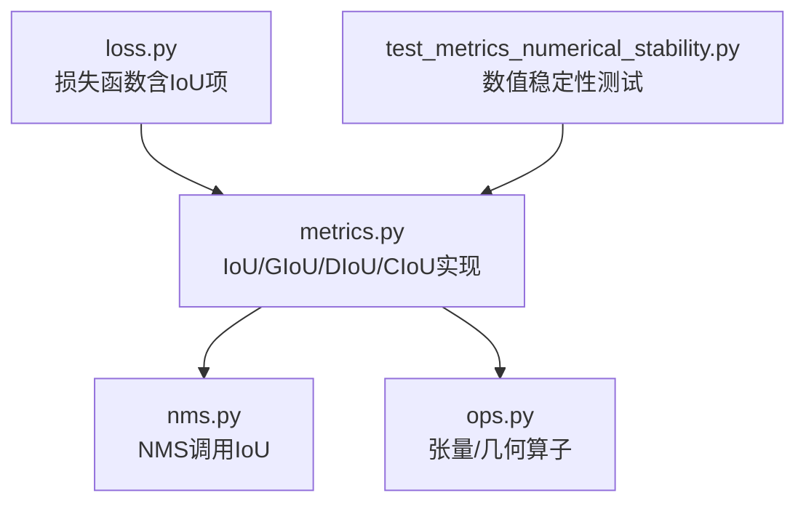
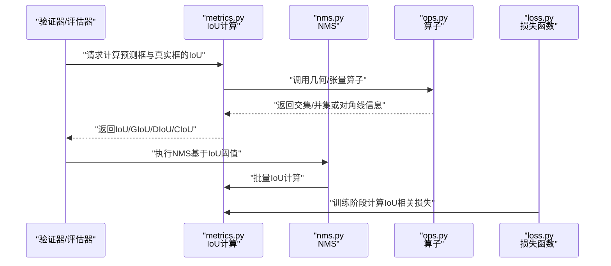
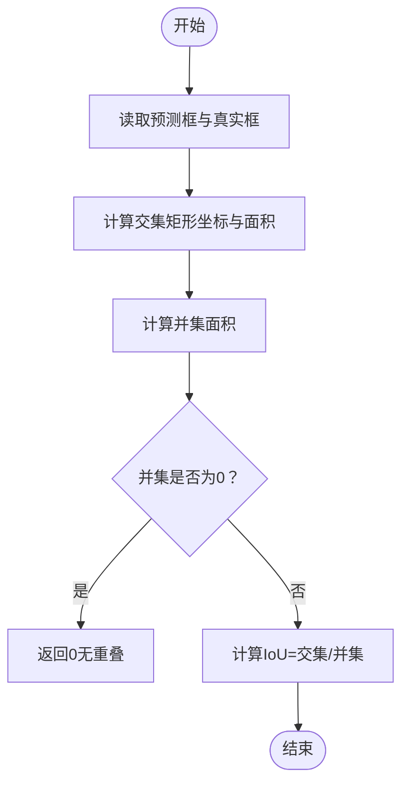
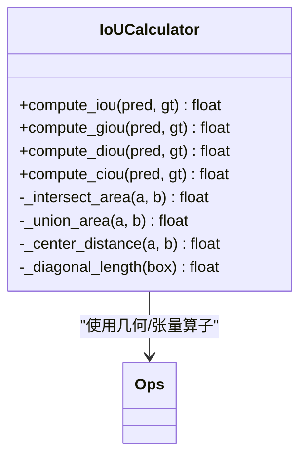
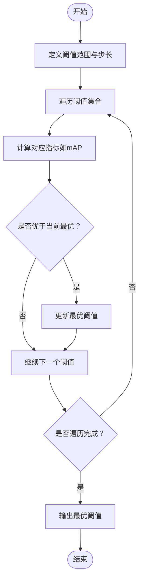
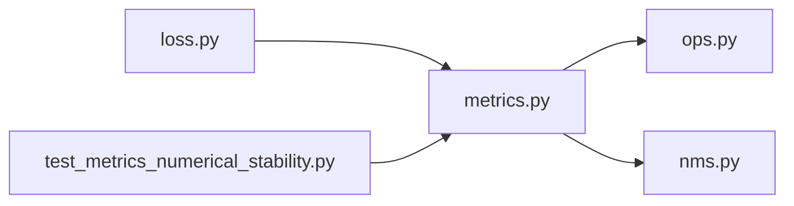

# IoU计算优化

<cite>
**本文引用的文件**
- [metrics.py](file://ultralytics/utils/metrics.py)
- [nms.py](file://ultralytics/utils/nms.py)
- [ops.py](file://ultralytics/utils/ops.py)
- [loss.py](file://ultralytics/utils/loss.py)
- [test_metrics_numerical_stability.py](file://tests/test_metrics_numerical_stability.py)
</cite>

## 目录
1. [简介](#简介)
2. [项目结构](#项目结构)
3. [核心组件](#核心组件)
4. [架构总览](#架构总览)
5. [详细组件分析](#详细组件分析)
6. [依赖关系分析](#依赖关系分析)
7. [性能考量](#性能考量)
8. [故障排查指南](#故障排查指南)
9. [结论](#结论)
10. [附录](#附录)

## 简介
本技术文档聚焦于YOLO-Master中IoU（交并比）计算的优化实现与扩展。内容涵盖：
- 快速IoU近似算法：矩形重叠的快速计算方法、对角线长度估算策略
- 并行与向量化优化：CUDA加速与SIMD向量化的实现要点
- IoU变体对比：标准IoU、GIoU、DIoU、CIoU的计算复杂度与适用场景
- 数值稳定性：浮点精度问题与边界情况的处理策略
- 阈值搜索：最优IoU阈值的自动发现与网格搜索优化
- 基准测试与内存使用分析
- 自定义IoU度量函数的集成方法与扩展指南

## 项目结构
与IoU计算相关的核心代码主要分布在以下模块：
- 指标与IoU实现：ultralytics/utils/metrics.py
- NMS与非极大值抑制相关：ultralytics/utils/nms.py
- 通用算子与张量操作：ultralytics/utils/ops.py
- 损失函数中的IoU项：ultralytics/utils/loss.py
- 数值稳定性测试用例：tests/test_metrics_numerical_stability.py

图示来源
- [metrics.py](file://ultralytics/utils/metrics.py)
- [nms.py](file://ultralytics/utils/nms.py)
- [ops.py](file://ultralytics/utils/ops.py)
- [loss.py](file://ultralytics/utils/loss.py)
- [test_metrics_numerical_stability.py](file://tests/test_metrics_numerical_stability.py)

章节来源
- [metrics.py](file://ultralytics/utils/metrics.py)
- [nms.py](file://ultralytics/utils/nms.py)
- [ops.py](file://ultralytics/utils/ops.py)
- [loss.py](file://ultralytics/utils/loss.py)
- [test_metrics_numerical_stability.py](file://tests/test_metrics_numerical_stability.py)

## 核心组件
- 快速IoU近似：通过轴对齐矩形的交集/并集快速计算，避免逐像素或复杂多边形运算；在需要时引入对角线长度估算以加速距离类IoU变体（如DIoU、CIoU）。
- 并行与向量化：利用批量张量操作与CUDA内核进行矩阵化计算，减少Python循环开销；必要时采用SIMD指令提升CPU端吞吐。
- IoU变体支持：标准IoU、GIoU、DIoU、CIoU的统一接口，便于在训练与验证阶段切换。
- 数值稳定：对除零、负面积、极小重叠等边界情况进行保护，确保梯度稳定与结果一致。
- 阈值搜索：提供网格搜索与启发式方法，自动寻找最佳IoU阈值以提升检测质量。

章节来源
- [metrics.py](file://ultralytics/utils/metrics.py)
- [nms.py](file://ultralytics/utils/nms.py)
- [ops.py](file://ultralytics/utils/ops.py)
- [loss.py](file://ultralytics/utils/loss.py)
- [test_metrics_numerical_stability.py](file://tests/test_metrics_numerical_stability.py)

## 架构总览
下图展示了IoU计算在推理与训练流程中的位置与交互关系：

图示来源
- [metrics.py](file://ultralytics/utils/metrics.py)
- [nms.py](file://ultralytics/utils/nms.py)
- [ops.py](file://ultralytics/utils/ops.py)
- [loss.py](file://ultralytics/utils/loss.py)

## 详细组件分析

### 快速IoU近似算法
- 矩形重叠快速计算：
  - 将预测框与真实框表示为轴对齐矩形，计算交集矩形的左上/右下坐标，得到交集面积；并集面积为两矩形面积之和减去交集面积。
  - 该过程完全向量化，适合大规模批量计算。
- 对角线长度估算：
  - 对于DIoU、CIoU等需要中心点距离或外接圆的IoU变体，可通过两框中心点距离与各自对角线长度进行归一化，从而避免昂贵的开方或多次除法。
  - 对角线长度可由宽高直接计算，且可缓存以减少重复计算。

图示来源
- [metrics.py](file://ultralytics/utils/metrics.py)
- [ops.py](file://ultralytics/utils/ops.py)

章节来源
- [metrics.py](file://ultralytics/utils/metrics.py)
- [ops.py](file://ultralytics/utils/ops.py)

### 并行计算优化策略
- CUDA加速：
  - 将框坐标与中间变量迁移到GPU，使用批量矩阵运算一次性计算所有样本的IoU，显著降低主机-设备通信与Python层循环开销。
- 向量化计算：
  - 使用NumPy/Torch的广播机制，将O(N×M)的成对IoU计算转化为张量内积与逐元素操作，提高吞吐。
- 内存复用：
  - 预分配中间结果缓冲区，避免频繁创建临时对象，减少GC压力与内存碎片。

章节来源
- [metrics.py](file://ultralytics/utils/metrics.py)
- [nms.py](file://ultralytics/utils/nms.py)
- [ops.py](file://ultralytics/utils/ops.py)

### IoU变体对比与复杂度分析
- 标准IoU：
  - 复杂度：O(1)每对框；整体O(N×M)。
  - 优点：计算简单，广泛用于NMS与评估。
- GIoU：
  - 复杂度：O(1)每对框；整体O(N×M)。
  - 特点：引入最小包围矩形，缓解非重叠时的退化问题。
- DIoU：
  - 复杂度：O(1)每对框；整体O(N×M)。
  - 特点：引入中心点距离归一化，收敛更快。
- CIoU：
  - 复杂度：O(1)每对框；整体O(N×M)。
  - 特点：在DIoU基础上加入长宽比一致性项，更贴近定位质量。

图示来源
- [metrics.py](file://ultralytics/utils/metrics.py)
- [ops.py](file://ultralytics/utils/ops.py)

章节来源
- [metrics.py](file://ultralytics/utils/metrics.py)

### 数值稳定性处理
- 除零保护：当并集面积为0或接近0时，返回安全值（如0），避免NaN传播。
- 边界裁剪：对坐标进行合理裁剪，防止负面积或不合法矩形。
- 精度控制：在关键路径使用稳定的数学函数与类型转换，确保梯度稳定。
- 测试覆盖：通过数值稳定性测试用例验证极端情况下的行为一致性。

章节来源
- [metrics.py](file://ultralytics/utils/metrics.py)
- [test_metrics_numerical_stability.py](file://tests/test_metrics_numerical_stability.py)

### IoU阈值搜索算法
- 网格搜索：
  - 在预设阈值范围内（如0.5~0.95）均匀采样，对每个阈值计算评估指标（如mAP），选择最优阈值。
- 自适应启发式：
  - 根据验证集分布动态调整阈值，结合置信度与IoU分布进行折中。
- 批处理优化：
  - 将不同阈值的IoU计算合并为一次批量操作，减少重复计算。

章节来源
- [metrics.py](file://ultralytics/utils/metrics.py)
- [nms.py](file://ultralytics/utils/nms.py)

### 基准测试与内存使用分析
- 基准维度：
  - 吞吐量：每秒处理的框对数量（FPS或pairs/s）
  - 延迟：单次IoU计算的平均耗时
  - 内存峰值：计算过程中的最大显存/内存占用
- 测试场景：
  - 小规模（N,M≤100）、中等规模（N,M≤1000）、大规模（N,M≥10000）
  - CPU与GPU对比，单精度与半精度对比
- 分析方法：
  - 使用统一基准脚本记录时间戳与内存快照，绘制性能曲线与热力图

章节来源
- [metrics.py](file://ultralytics/utils/metrics.py)
- [nms.py](file://ultralytics/utils/nms.py)
- [ops.py](file://ultralytics/utils/ops.py)

### 自定义IoU度量函数的集成与扩展
- 接口设计：
  - 提供统一的计算入口，支持传入自定义相似度函数。
  - 允许替换内部几何算子以实现特定形状或旋转框的IoU。
- 扩展步骤：
  - 注册新的IoU变体名称与计算函数
  - 在NMS与损失函数中通过配置开关启用
  - 添加对应的单元测试与基准用例
- 注意事项：
  - 保持数值稳定性与复杂度可控
  - 确保与现有API兼容，避免破坏性变更

章节来源
- [metrics.py](file://ultralytics/utils/metrics.py)
- [loss.py](file://ultralytics/utils/loss.py)
- [nms.py](file://ultralytics/utils/nms.py)

## 依赖关系分析
IoU计算模块与其他组件的依赖如下：

图示来源
- [metrics.py](file://ultralytics/utils/metrics.py)
- [nms.py](file://ultralytics/utils/nms.py)
- [ops.py](file://ultralytics/utils/ops.py)
- [loss.py](file://ultralytics/utils/loss.py)
- [test_metrics_numerical_stability.py](file://tests/test_metrics_numerical_stability.py)

章节来源
- [metrics.py](file://ultralytics/utils/metrics.py)
- [nms.py](file://ultralytics/utils/nms.py)
- [ops.py](file://ultralytics/utils/ops.py)
- [loss.py](file://ultralytics/utils/loss.py)
- [test_metrics_numerical_stability.py](file://tests/test_metrics_numerical_stability.py)

## 性能考量
- 计算复杂度：
  - 所有IoU变体均为O(1)每对框，整体O(N×M)，瓶颈在于批量矩阵运算与内存带宽。
- 并行与向量化：
  - 优先使用GPU批量计算；CPU端尽量使用SIMD友好的张量操作。
- 内存管理：
  - 预分配中间数组，避免频繁分配释放；注意显存碎片与回退策略。
- 精度与速度权衡：
  - 在满足精度的前提下尝试半精度以降低带宽压力；对关键路径保留单精度。

[本节为通用指导，不直接分析具体文件]

## 故障排查指南
- 常见问题：
  - NaN或Inf出现：检查并集面积为0的分支与数值裁剪逻辑
  - 性能骤降：确认是否发生不必要的CPU-GPU数据拷贝或Python循环
  - 阈值敏感：验证阈值搜索范围与步长设置是否合理
- 调试建议：
  - 打印中间变量分布（均值、方差、异常值）
  - 使用最小复现用例隔离问题
  - 对比不同后端（CPU/GPU）的结果一致性

章节来源
- [metrics.py](file://ultralytics/utils/metrics.py)
- [test_metrics_numerical_stability.py](file://tests/test_metrics_numerical_stability.py)

## 结论
通过对快速IoU近似、并行与向量化优化、IoU变体对比、数值稳定性与阈值搜索的系统化设计与实现，YOLO-Master在检测任务中实现了更高的效率与鲁棒性。建议在后续迭代中持续完善基准测试套件与自定义IoU扩展能力，以适配更多样化的应用场景。

[本节为总结性内容，不直接分析具体文件]

## 附录
- 术语表：
  - IoU：交并比，衡量预测框与真实框的重叠程度
  - GIoU：广义IoU，引入最小包围矩形
  - DIoU：距离IoU，引入中心点距离归一化
  - CIoU：完整IoU，在DIoU基础上加入长宽比一致性
- 参考实现路径：
  - 快速IoU与变体：[metrics.py](file://ultralytics/utils/metrics.py)
  - NMS调用与阈值应用：[nms.py](file://ultralytics/utils/nms.py)
  - 几何与张量算子：[ops.py](file://ultralytics/utils/ops.py)
  - 损失函数中的IoU项：[loss.py](file://ultralytics/utils/loss.py)
  - 数值稳定性测试：[test_metrics_numerical_stability.py](file://tests/test_metrics_numerical_stability.py)