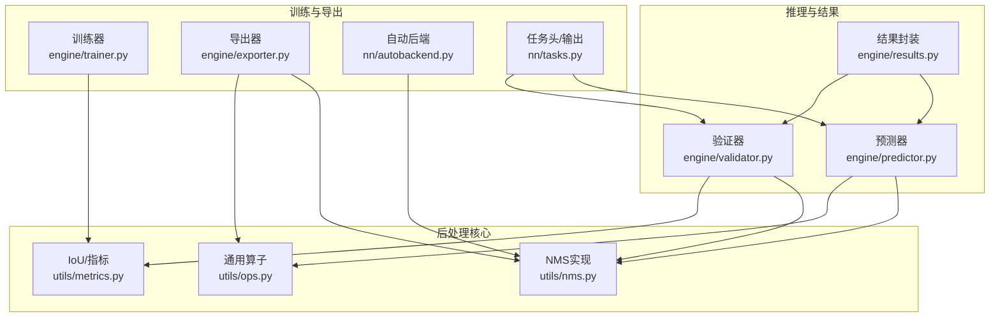
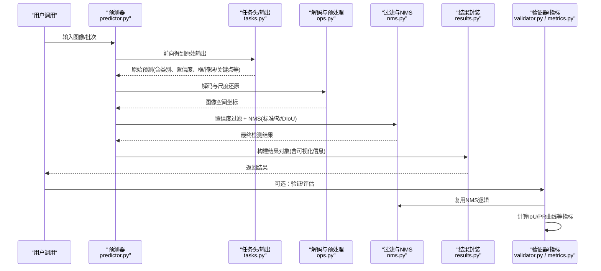
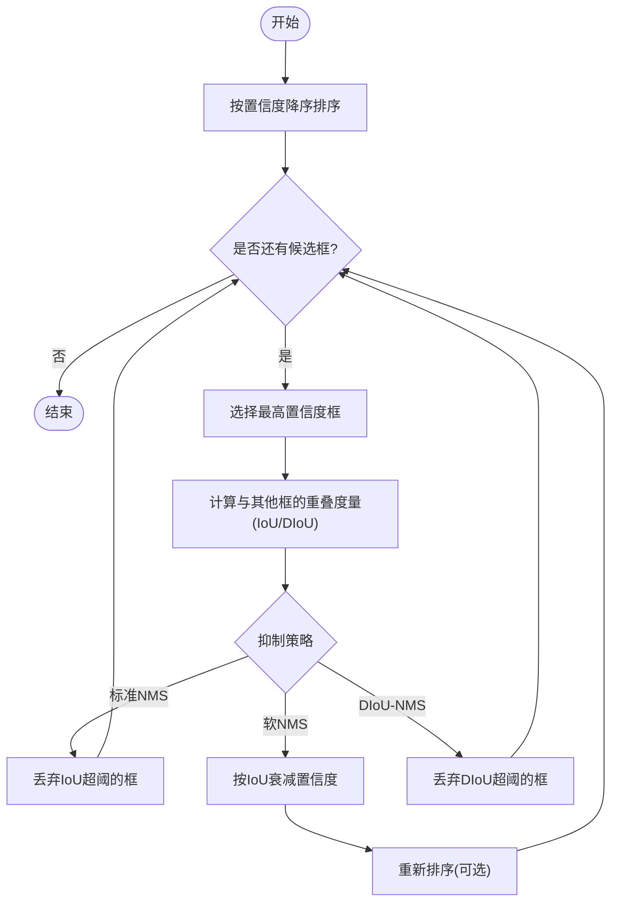
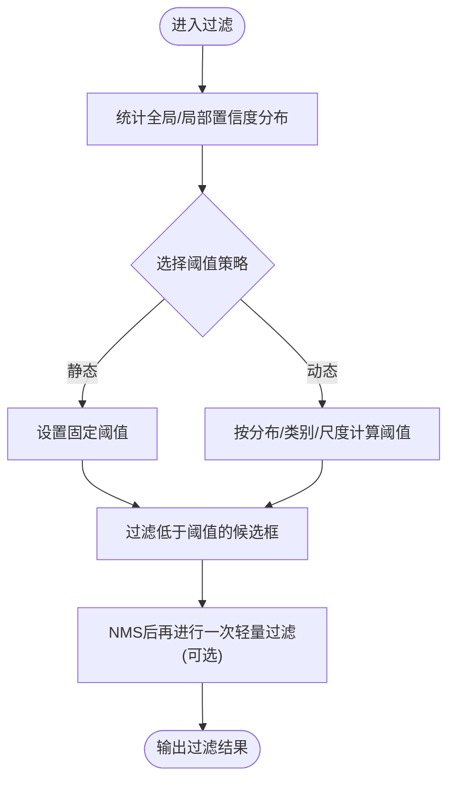
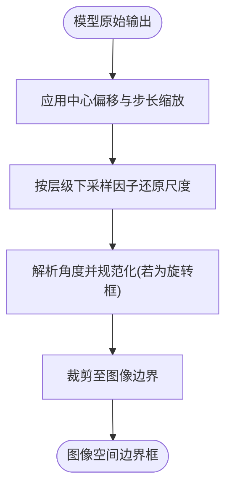
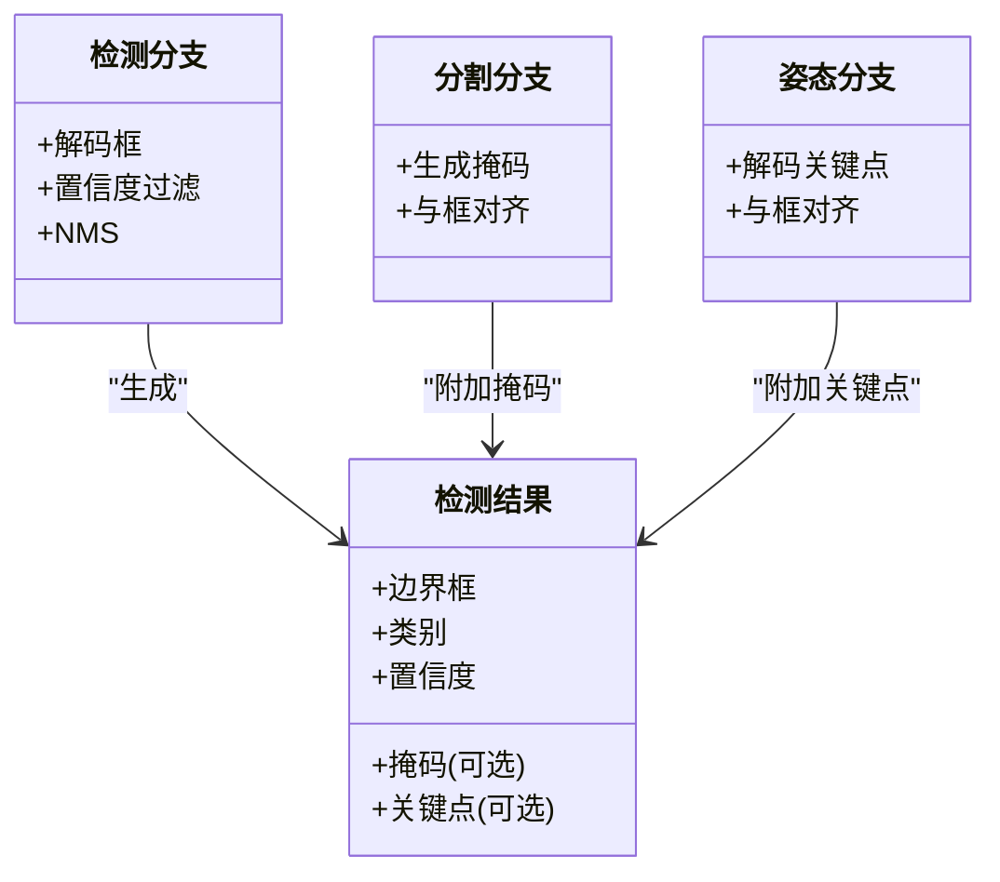
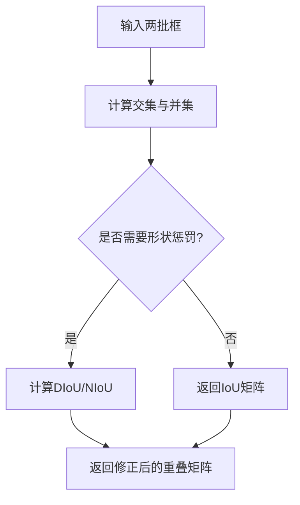
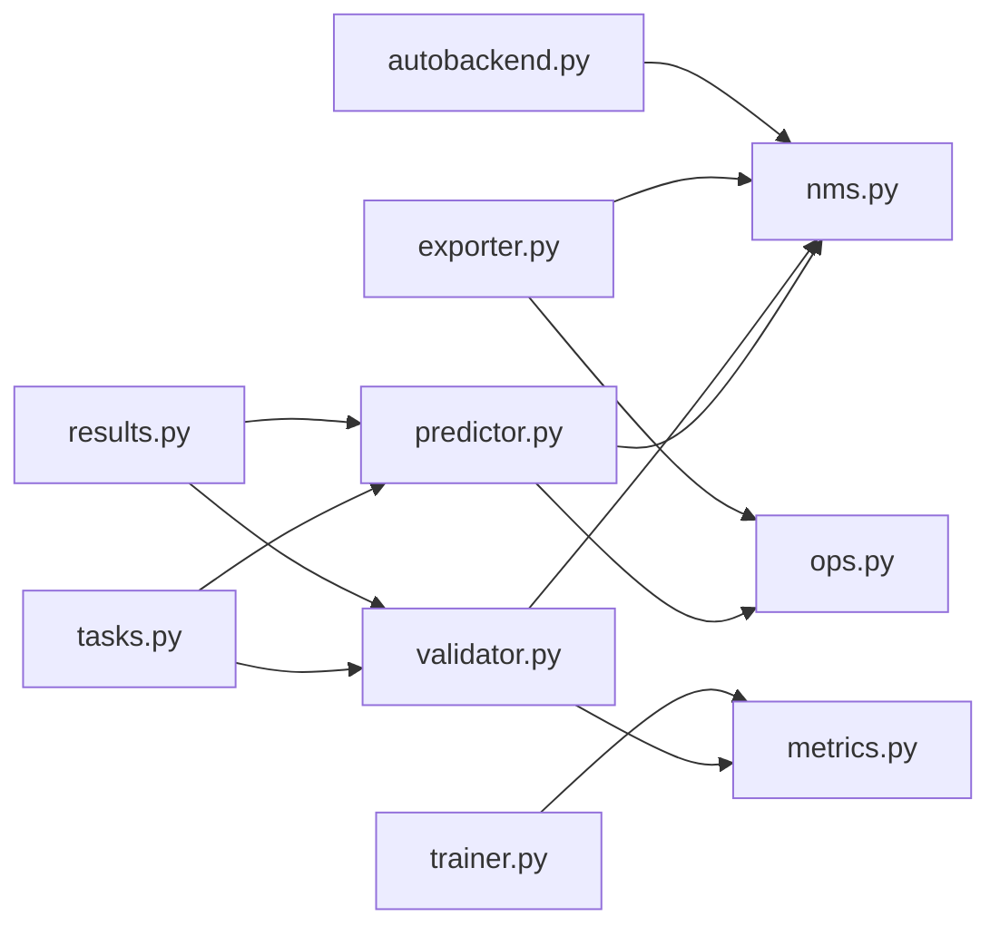

# 后处理算法

<cite>
**本文引用的文件**
- [nms.py](file://ultralytics/utils/nms.py)
- [ops.py](file://ultralytics/utils/ops.py)
- [metrics.py](file://ultralytics/utils/metrics.py)
- [results.py](file://ultralytics/engine/results.py)
- [predictor.py](file://ultralytics/engine/predictor.py)
- [validator.py](file://ultralytics/engine/validator.py)
- [trainer.py](file://ultralytics/engine/trainer.py)
- [exporter.py](file://ultralytics/engine/exporter.py)
- [autobackend.py](file://ultralytics/nn/autobackend.py)
- [tasks.py](file://ultralytics/nn/tasks.py)
</cite>

## 目录
1. [简介](#简介)
2. [项目结构](#项目结构)
3. [核心组件](#核心组件)
4. [架构总览](#架构总览)
5. [详细组件分析](#详细组件分析)
6. [依赖关系分析](#依赖关系分析)
7. [性能考量](#性能考量)
8. [故障排查指南](#故障排查指南)
9. [结论](#结论)
10. [附录](#附录)

## 简介
本技术文档聚焦于YOLO-Master的后处理算法，围绕非极大值抑制（NMS）及其变体、置信度阈值过滤、边界框解码、多任务输出融合、IoU计算与优化、参数调优与基准测试、以及自定义后处理集成等主题展开。目标是帮助读者从工程实现与算法原理两个层面理解并高效使用这些能力。

## 项目结构
后处理相关代码主要分布在以下模块：
- NMS与基础算子：ultralytics/utils/nms.py、ultralytics/utils/ops.py
- IoU与评估指标：ultralytics/utils/metrics.py
- 推理结果封装与可视化：ultralytics/engine/results.py
- 推理流程编排：ultralytics/engine/predictor.py、ultralytics/engine/validator.py、ultralytics/engine/trainer.py
- 导出与后端适配：ultralytics/engine/exporter.py、ultralytics/nn/autobackend.py
- 模型任务头与输出定义：ultralytics/nn/tasks.py

图表来源
- [nms.py](file://ultralytics/utils/nms.py)
- [ops.py](file://ultralytics/utils/ops.py)
- [metrics.py](file://ultralytics/utils/metrics.py)
- [results.py](file://ultralytics/engine/results.py)
- [predictor.py](file://ultralytics/engine/predictor.py)
- [validator.py](file://ultralytics/engine/validator.py)
- [trainer.py](file://ultralytics/engine/trainer.py)
- [exporter.py](file://ultralytics/engine/exporter.py)
- [autobackend.py](file://ultralytics/nn/autobackend.py)
- [tasks.py](file://ultralytics/nn/tasks.py)

章节来源
- [nms.py](file://ultralytics/utils/nms.py)
- [ops.py](file://ultralytics/utils/ops.py)
- [metrics.py](file://ultralytics/utils/metrics.py)
- [results.py](file://ultralytics/engine/results.py)
- [predictor.py](file://ultralytics/engine/predictor.py)
- [validator.py](file://ultralytics/engine/validator.py)
- [trainer.py](file://ultralytics/engine/trainer.py)
- [exporter.py](file://ultralytics/engine/exporter.py)
- [autobackend.py](file://ultralytics/nn/autobackend.py)
- [tasks.py](file://ultralytics/nn/tasks.py)

## 核心组件
- NMS与变体：标准NMS、软NMS、DIoU-NMS等策略在统一接口下提供，便于在不同任务与部署后端中切换。
- 置信度阈值过滤：在NMS前对候选框进行置信度筛选，支持静态阈值与动态阈值策略。
- 边界框解码：将模型输出的原始坐标变换为图像空间坐标，包含尺度还原与角度计算（针对旋转框）。
- 多任务融合：检测、分割、姿态估计等多任务输出在后处理阶段被统一编码到结果对象中，供下游使用。
- IoU计算与优化：提供多种IoU度量与近似加速方案，兼顾精度与速度。
- 参数调优与基准：提供阈值扫描与性能对比工具，辅助定位最优配置。

章节来源
- [nms.py](file://ultralytics/utils/nms.py)
- [ops.py](file://ultralytics/utils/ops.py)
- [metrics.py](file://ultralytics/utils/metrics.py)
- [results.py](file://ultralytics/engine/results.py)
- [predictor.py](file://ultralytics/engine/predictor.py)
- [validator.py](file://ultralytics/engine/validator.py)
- [trainer.py](file://ultralytics/engine/trainer.py)
- [exporter.py](file://ultralytics/engine/exporter.py)
- [autobackend.py](file://ultralytics/nn/autobackend.py)
- [tasks.py](file://ultralytics/nn/tasks.py)

## 架构总览
后处理在推理与验证流程中的位置如下：

图表来源
- [predictor.py](file://ultralytics/engine/predictor.py)
- [tasks.py](file://ultralytics/nn/tasks.py)
- [ops.py](file://ultralytics/utils/ops.py)
- [nms.py](file://ultralytics/utils/nms.py)
- [results.py](file://ultralytics/engine/results.py)
- [validator.py](file://ultralytics/engine/validator.py)
- [metrics.py](file://ultralytics/utils/metrics.py)

## 详细组件分析

### 非极大值抑制（NMS）与变体
- 标准NMS：按置信度降序选择候选框，迭代剔除与当前框IoU超过阈值的其余框。适用于密集重叠场景的常规目标检测。
- 软NMS：对高IoU候选框的置信度进行衰减而非直接剔除，保留弱响应，适合小目标或遮挡严重场景。
- DIoU-NMS：以DIoU作为排序与抑制依据，对长宽比敏感的目标具有更好的抑制效果，常用于旋转框或细长目标。

图表来源
- [nms.py](file://ultralytics/utils/nms.py)

章节来源
- [nms.py](file://ultralytics/utils/nms.py)

### 置信度阈值过滤机制
- 静态阈值：固定阈值过滤低置信度候选框，简单高效，适合稳定数据分布。
- 动态阈值：根据场景复杂度、平均置信度或类别先验自适应调整阈值，提升召回率与精度的平衡。
- 自适应过滤：结合NMS前后两次过滤，或在不同尺度层采用差异化阈值，缓解小目标漏检。

图表来源
- [predictor.py](file://ultralytics/engine/predictor.py)
- [nms.py](file://ultralytics/utils/nms.py)

章节来源
- [predictor.py](file://ultralytics/engine/predictor.py)
- [nms.py](file://ultralytics/utils/nms.py)

### 边界框解码算法
- 坐标变换：将网络输出的相对坐标转换为图像绝对坐标，考虑锚点/网格中心偏移与步长缩放。
- 尺度还原：根据特征图层级对应的下采样因子恢复真实尺度。
- 角度计算：对于旋转框（OBB），解码角度并归一化到合理范围，确保后续IoU/DIoU计算正确。

图表来源
- [ops.py](file://ultralytics/utils/ops.py)
- [tasks.py](file://ultralytics/nn/tasks.py)

章节来源
- [ops.py](file://ultralytics/utils/ops.py)
- [tasks.py](file://ultralytics/nn/tasks.py)

### 多任务输出融合策略
- 检测分支：输出类别概率、置信度与边界框，经解码与NMS得到最终框列表。
- 分割分支：输出掩码系数或像素级预测，与检测框对齐后进行实例掩码合成。
- 姿态估计分支：输出关键点坐标与可见性，与检测框对齐后进行关键点绘制与可视化。
- 统一结果对象：所有任务的输出被封装到统一的结果结构中，便于可视化、导出与评测。

图表来源
- [results.py](file://ultralytics/engine/results.py)
- [tasks.py](file://ultralytics/nn/tasks.py)

章节来源
- [results.py](file://ultralytics/engine/results.py)
- [tasks.py](file://ultralytics/nn/tasks.py)

### IoU计算与优化算法
- 基础IoU：矩形框交并比，计算开销适中，广泛用于标准NMS。
- DIoU/NIoU：引入中心距离或形状惩罚项，抑制效果更好，适合旋转框或长宽比差异大的目标。
- 快速近似：通过预计算面积、边界裁剪与向量化运算降低重复计算成本；在大规模候选集上显著提速。
- 并行优化：利用GPU张量并行与批内并行，减少CPU-GPU往返；在导出模式下可启用后端特定加速内核。

图表来源
- [metrics.py](file://ultralytics/utils/metrics.py)
- [ops.py](file://ultralytics/utils/ops.py)

章节来源
- [metrics.py](file://ultralytics/utils/metrics.py)
- [ops.py](file://ultralytics/utils/ops.py)

### 后处理参数调优指南
- 置信度阈值：提高可降误报但可能牺牲召回，建议在小目标或遮挡场景适度降低。
- NMS阈值：标准NMS常用0.45~0.6；DIoU-NMS对重叠更敏感，阈值可略低。
- 软NMS权重：控制衰减强度，过强会保留过多冗余框，过弱则退化为标准NMS。
- 多尺度阈值：对不同分辨率层设置差异化阈值，有助于平衡大小目标的检测质量。
- 性能权衡：更高阈值与更强抑制可降低后处理耗时，但需评估mAP变化。

章节来源
- [nms.py](file://ultralytics/utils/nms.py)
- [predictor.py](file://ultralytics/engine/predictor.py)
- [validator.py](file://ultralytics/engine/validator.py)

### 自定义后处理算法集成方法
- 替换NMS策略：在预测器或导出器中注入自定义NMS函数，保持输入输出契约一致。
- 扩展过滤策略：在解码后插入自定义置信度过滤或规则引擎，支持业务先验。
- 多任务融合扩展：在结果对象中添加新字段（如属性、轨迹ID），并在可视化与导出中兼容。
- 后端适配：在自动后端中注册新的NMS实现，确保导出与部署一致性。

章节来源
- [predictor.py](file://ultralytics/engine/predictor.py)
- [exporter.py](file://ultralytics/engine/exporter.py)
- [autobackend.py](file://ultralytics/nn/autobackend.py)
- [results.py](file://ultralytics/engine/results.py)

### 算法性能基准测试与对比分析
- 基准维度：吞吐（FPS）、延迟（ms/帧）、内存占用、mAP@IoU阈值、每类召回/精确率。
- 对比策略：标准NMS vs 软NMS vs DIoU-NMS；不同置信度阈值组合；是否启用快速IoU近似。
- 数据集覆盖：COCO、VisDrone、DOTA等典型场景，关注小目标、密集重叠与旋转框。
- 报告输出：汇总表格与曲线（PR曲线、IoU敏感度曲线），便于复现实验与回归检查。

章节来源
- [validator.py](file://ultralytics/engine/validator.py)
- [metrics.py](file://ultralytics/utils/metrics.py)
- [benchmarks](file://benchmarks)

## 依赖关系分析
后处理模块之间的耦合与协作如下：

图表来源
- [predictor.py](file://ultralytics/engine/predictor.py)
- [nms.py](file://ultralytics/utils/nms.py)
- [ops.py](file://ultralytics/utils/ops.py)
- [validator.py](file://ultralytics/engine/validator.py)
- [metrics.py](file://ultralytics/utils/metrics.py)
- [trainer.py](file://ultralytics/engine/trainer.py)
- [exporter.py](file://ultralytics/engine/exporter.py)
- [autobackend.py](file://ultralytics/nn/autobackend.py)
- [tasks.py](file://ultralytics/nn/tasks.py)
- [results.py](file://ultralytics/engine/results.py)

章节来源
- [predictor.py](file://ultralytics/engine/predictor.py)
- [nms.py](file://ultralytics/utils/nms.py)
- [ops.py](file://ultralytics/utils/ops.py)
- [validator.py](file://ultralytics/engine/validator.py)
- [metrics.py](file://ultralytics/utils/metrics.py)
- [trainer.py](file://ultralytics/engine/trainer.py)
- [exporter.py](file://ultralytics/engine/exporter.py)
- [autobackend.py](file://ultralytics/nn/autobackend.py)
- [tasks.py](file://ultralytics/nn/tasks.py)
- [results.py](file://ultralytics/engine/results.py)

## 性能考量
- 候选框数量控制：在解码与过滤阶段尽早剪枝，减少NMS计算规模。
- 向量化与批处理：尽量使用张量并行计算IoU/DIoU，避免逐元素循环。
- 后端加速：在导出与部署时启用平台特定的NMS内核（如TensorRT/OpenVINO），减少Python解释开销。
- 内存管理：避免中间大矩阵常驻内存，及时释放或分块计算。
- 精度-速度权衡：软NMS与DIoU-NMS通常带来一定延迟，需结合实际场景评估收益。

[本节为通用指导，不直接分析具体文件]

## 故障排查指南
- NMS无结果：检查置信度阈值是否过高、NMS阈值是否过大、解码是否正确。
- 大量重复框：降低NMS阈值或改用DIoU-NMS；确认角解码与边界裁剪逻辑。
- 小目标漏检：降低置信度阈值、启用软NMS、分层阈值策略。
- 旋转框异常：核对角度归一化与DIoU实现，确保角度范围与坐标系一致。
- 导出不一致：确认导出器与运行时后端使用的NMS实现一致，必要时固化种子与数值精度。

章节来源
- [nms.py](file://ultralytics/utils/nms.py)
- [ops.py](file://ultralytics/utils/ops.py)
- [metrics.py](file://ultralytics/utils/metrics.py)
- [predictor.py](file://ultralytics/engine/predictor.py)
- [exporter.py](file://ultralytics/engine/exporter.py)
- [autobackend.py](file://ultralytics/nn/autobackend.py)

## 结论
YOLO-Master的后处理体系以NMS为核心，辅以灵活的阈值过滤、稳健的边界框解码与多任务融合策略，并通过IoU优化与后端适配实现良好的精度-速度平衡。通过系统化的参数调优与基准测试，可在不同任务与部署环境中获得稳定可靠的检测结果。

[本节为总结性内容，不直接分析具体文件]

## 附录
- 术语表
  - NMS：非极大值抑制
  - IoU：交并比
  - DIoU：距离交并比
  - OBB：旋转边界框
  - FPS：每秒帧数
- 参考路径
  - NMS实现：[nms.py](file://ultralytics/utils/nms.py)
  - 算子与解码：[ops.py](file://ultralytics/utils/ops.py)
  - IoU与指标：[metrics.py](file://ultralytics/utils/metrics.py)
  - 结果封装：[results.py](file://ultralytics/engine/results.py)
  - 推理与验证：[predictor.py](file://ultralytics/engine/predictor.py)、[validator.py](file://ultralytics/engine/validator.py)
  - 训练与导出：[trainer.py](file://ultralytics/engine/trainer.py)、[exporter.py](file://ultralytics/engine/exporter.py)
  - 后端适配：[autobackend.py](file://ultralytics/nn/autobackend.py)
  - 任务头与输出：[tasks.py](file://ultralytics/nn/tasks.py)

[本节为补充信息，不直接分析具体文件]