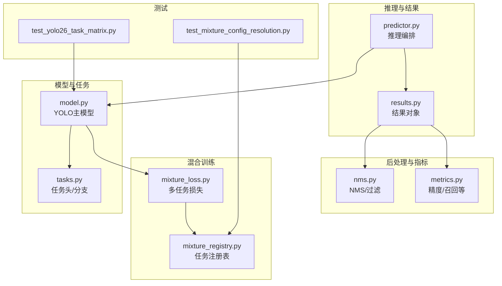
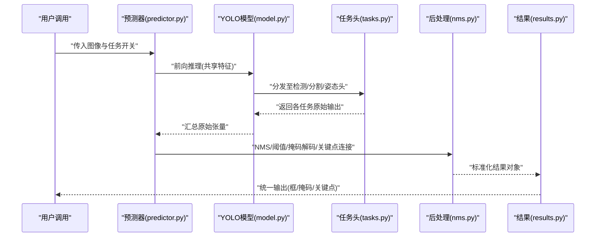
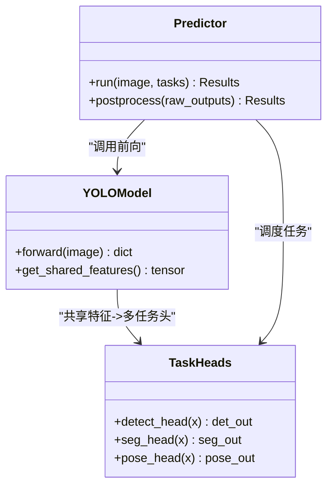
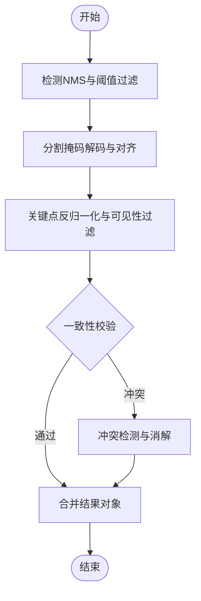
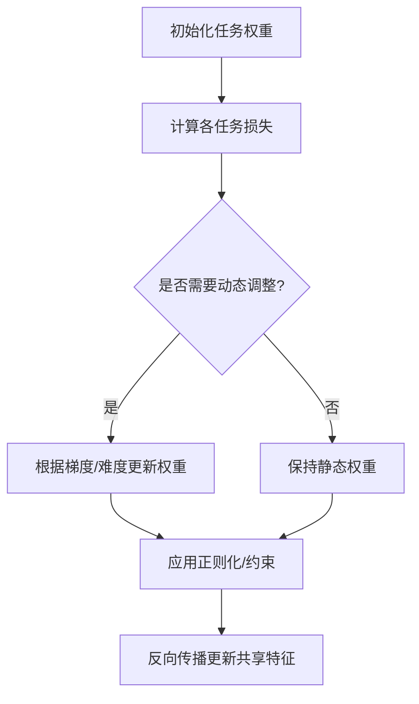
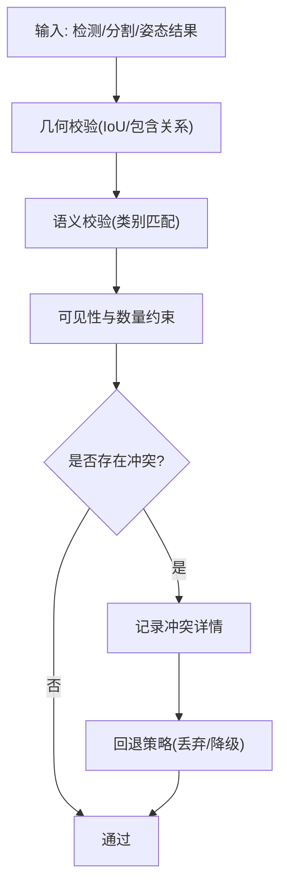
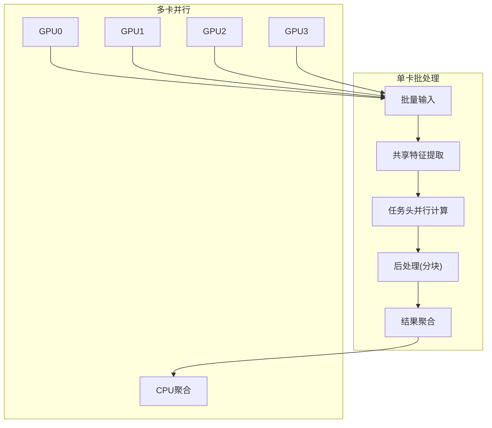
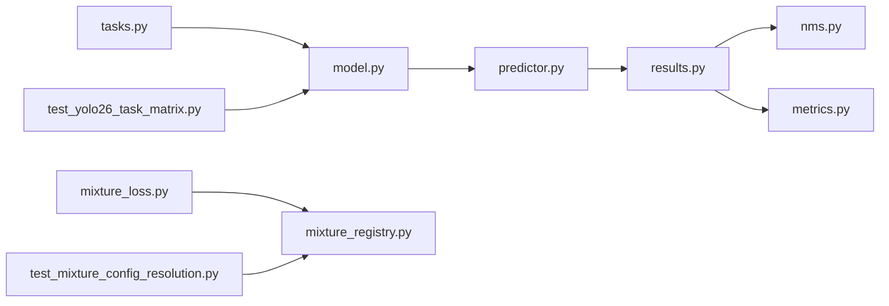

# 多任务输出融合

<cite>
**本文引用的文件**
- [ultralytics/nn/tasks.py](file://ultralytics/nn/tasks.py)
- [ultralytics/models/yolo/model.py](file://ultralytics/models/yolo/model.py)
- [ultralytics/engine/predictor.py](file://ultralytics/engine/predictor.py)
- [ultralytics/engine/results.py](file://ultralytics/engine/results.py)
- [ultralytics/utils/nms.py](file://ultralytics/utils/nms.py)
- [ultralytics/utils/metrics.py](file://ultralytics/utils/metrics.py)
- [ultralytics/nn/mixture_loss.py](file://ultralytics/nn/mixture_loss.py)
- [ultralytics/nn/mixture_registry.py](file://ultralytics/nn/mixture_registry.py)
- [tests/test_yolo26_task_matrix.py](file://tests/test_yolo26_task_matrix.py)
- [tests/test_mixture_config_resolution.py](file://tests/test_mixture_config解析.py)
</cite>

## 目录
1. [引言](#引言)
2. [项目结构](#项目结构)
3. [核心组件](#核心组件)
4. [架构总览](#架构总览)
5. [详细组件分析](#详细组件分析)
6. [依赖关系分析](#依赖关系分析)
7. [性能考量](#性能考量)
8. [故障排查指南](#故障排查指南)
9. [结论](#结论)
10. [附录](#附录)

## 引言
本技术文档聚焦于YOLO-Master的多任务输出融合策略，围绕检测、分割、姿态估计三类任务的统一处理框架展开。内容涵盖：
- 共享特征与后处理流程设计
- 多任务权重分配机制（含动态权重调整与任务冲突解决）
- 结果一致性校验算法（跨任务逻辑验证与冲突检测）
- 多任务推理的内存管理与计算优化（批处理与多GPU并行）
- 任务特定后处理参数配置（掩码生成与关键点连接规则）
- 自定义任务集成接口规范与数据格式要求
- 多任务性能评估与消融实验分析方法

## 项目结构
多任务融合相关代码主要分布在以下模块：
- 模型与任务定义：ultralytics/nn/tasks.py、ultralytics/models/yolo/model.py
- 推理管线与结果封装：ultralytics/engine/predictor.py、ultralytics/engine/results.py
- 后处理与指标：ultralytics/utils/nms.py、ultralytics/utils/metrics.py
- 混合损失与注册表：ultralytics/nn/mixture_loss.py、ultralytics/nn/mixture_registry.py
- 测试与验证：tests/test_yolo26_task_matrix.py、tests/test_mixture_config_resolution.py

图表来源
- [ultralytics/nn/tasks.py](file://ultralytics/nn/tasks.py)
- [ultralytics/models/yolo/model.py](file://ultralytics/models/yolo/model.py)
- [ultralytics/engine/predictor.py](file://ultralytics/engine/predictor.py)
- [ultralytics/engine/results.py](file://ultralytics/engine/results.py)
- [ultralytics/utils/nms.py](file://ultralytics/utils/nms.py)
- [ultralytics/utils/metrics.py](file://ultralytics/utils/metrics.py)
- [ultralytics/nn/mixture_loss.py](file://ultralytics/nn/mixture_loss.py)
- [ultralytics/nn/mixture_registry.py](file://ultralytics/nn/mixture_registry.py)
- [tests/test_yolo26_task_matrix.py](file://tests/test_yolo26_task_matrix.py)
- [tests/test_mixture_config_resolution.py](file://tests/test_mixture_config解析.py)

章节来源
- [ultralytics/nn/tasks.py](file://ultralytics/nn/tasks.py)
- [ultralytics/models/yolo/model.py](file://ultralytics/models/yolo/model.py)
- [ultralytics/engine/predictor.py](file://ultralytics/engine/predictor.py)
- [ultralytics/engine/results.py](file://ultralytics/engine/results.py)
- [ultralytics/utils/nms.py](file://ultralytics/utils/nms.py)
- [ultralytics/utils/metrics.py](file://ultralytics/utils/metrics.py)
- [ultralytics/nn/mixture_loss.py](file://ultralytics/nn/mixture_loss.py)
- [ultralytics/nn/mixture_registry.py](file://ultralytics/nn/mixture_registry.py)
- [tests/test_yolo26_task_matrix.py](file://tests/test_yolo26_task_matrix.py)
- [tests/test_mixture_config_resolution.py](file://tests/test_mixture_config解析.py)

## 核心组件
- 任务头与分支：在任务定义中为检测、分割、姿态估计提供独立输出头，同时复用主干特征，形成“共享特征+多任务头”的结构。
- 推理编排器：负责将输入图像送入模型，收集各任务原始输出，并触发后处理流水线。
- 结果对象：统一封装检测结果、分割掩码、关键点等结构化信息，便于下游可视化与评估。
- 后处理模块：实现NMS、阈值过滤、掩码解码、关键点连接等通用步骤。
- 混合损失与注册表：在多任务训练中组合不同任务损失，并提供任务能力注册与解析机制。

章节来源
- [ultralytics/nn/tasks.py](file://ultralytics/nn/tasks.py)
- [ultralytics/engine/predictor.py](file://ultralytics/engine/predictor.py)
- [ultralytics/engine/results.py](file://ultralytics/engine/results.py)
- [ultralytics/utils/nms.py](file://ultralytics/utils/nms.py)
- [ultralytics/nn/mixture_loss.py](file://ultralytics/nn/mixture_loss.py)
- [ultralytics/nn/mixture_registry.py](file://ultralytics/nn/mixture_registry.py)

## 架构总览
下图展示了从输入到多任务输出的端到端流程，包括共享特征提取、任务分支、后处理与结果聚合。

图表来源
- [ultralytics/engine/predictor.py](file://ultralytics/engine/predictor.py)
- [ultralytics/models/yolo/model.py](file://ultralytics/models/yolo/model.py)
- [ultralytics/nn/tasks.py](file://ultralytics/nn/tasks.py)
- [ultralytics/utils/nms.py](file://ultralytics/utils/nms.py)
- [ultralytics/engine/results.py](file://ultralytics/engine/results.py)

## 详细组件分析

### 共享特征与多任务头
- 共享特征：主干网络提取通用视觉表征，供所有任务头复用，减少重复计算与显存占用。
- 任务头：检测头输出类别置信度与边界框回归；分割头输出实例掩码系数或像素级掩码；姿态头输出关键点坐标与可见性。
- 输出对齐：各任务头在空间维度与通道维度上遵循统一的协议，便于后续融合与后处理。

图表来源
- [ultralytics/models/yolo/model.py](file://ultralytics/models/yolo/model.py)
- [ultralytics/nn/tasks.py](file://ultralytics/nn/tasks.py)
- [ultralytics/engine/predictor.py](file://ultralytics/engine/predictor.py)

章节来源
- [ultralytics/models/yolo/model.py](file://ultralytics/models/yolo/model.py)
- [ultralytics/nn/tasks.py](file://ultralytics/nn/tasks.py)

### 后处理流水线与结果一致性
- 检测后处理：非极大值抑制(NMS)、置信度阈值过滤、类别映射。
- 分割后处理：掩码解码、尺寸还原、与检测框对齐、面积阈值过滤。
- 姿态后处理：关键点坐标反归一化、可见性阈值过滤、关键点连接规则（骨架拓扑）。
- 一致性校验：跨任务结果的逻辑验证，如分割掩码与检测框的重叠度、关键点是否落在掩码内、类别与姿态语义一致性。

图表来源
- [ultralytics/utils/nms.py](file://ultralytics/utils/nms.py)
- [ultralytics/engine/results.py](file://ultralytics/engine/results.py)

章节来源
- [ultralytics/utils/nms.py](file://ultralytics/utils/nms.py)
- [ultralytics/engine/results.py](file://ultralytics/engine/results.py)

### 多任务权重分配与动态调整
- 静态权重：在训练阶段对不同任务损失进行加权求和，支持按任务重要性设置固定权重。
- 动态权重：基于任务难度或梯度尺度自适应调整权重，缓解任务间不平衡。
- 冲突解决：当任务目标存在内在冲突时，采用正则化项或约束条件降低负迁移影响。

图表来源
- [ultralytics/nn/mixture_loss.py](file://ultralytics/nn/mixture_loss.py)
- [ultralytics/nn/mixture_registry.py](file://ultralytics/nn/mixture_registry.py)

章节来源
- [ultralytics/nn/mixture_loss.py](file://ultralytics/nn/mixture_loss.py)
- [ultralytics/nn/mixture_registry.py](file://ultralytics/nn/mixture_registry.py)

### 结果一致性校验算法
- 几何一致性：分割掩码与检测框的IoU阈值检查，确保掩码覆盖合理区域。
- 语义一致性：关键点所属类别与检测类别一致，避免跨类误配。
- 可见性与数量约束：关键点可见性阈值与最小数量限制，剔除低质量姿态。
- 冲突检测：当多个任务输出相互矛盾时，记录冲突类型与严重等级，用于诊断与回退策略。

图表来源
- [ultralytics/engine/results.py](file://ultralytics/engine/results.py)
- [ultralytics/utils/nms.py](file://ultralytics/utils/nms.py)

章节来源
- [ultralytics/engine/results.py](file://ultralytics/engine/results.py)
- [ultralytics/utils/nms.py](file://ultralytics/utils/nms.py)

### 多任务推理的内存管理与计算优化
- 批处理：对同一批次图像共享特征提取，减少重复计算；后处理阶段按任务分块执行，控制峰值显存。
- 多GPU并行：在数据并行模式下，各GPU独立执行前向与后处理，结果在CPU侧聚合，避免跨设备通信瓶颈。
- 内存复用：中间张量及时释放，掩码与关键点使用紧凑数据类型，降低显存占用。
- 编译与算子优化：利用后端加速（如TorchScript/TensorRT）提升关键路径性能。

图表来源
- [ultralytics/engine/predictor.py](file://ultralytics/engine/predictor.py)
- [ultralytics/models/yolo/model.py](file://ultralytics/models/yolo/model.py)

章节来源
- [ultralytics/engine/predictor.py](file://ultralytics/engine/predictor.py)
- [ultralytics/models/yolo/model.py](file://ultralytics/models/yolo/model.py)

### 任务特定后处理参数配置
- 分割掩码生成：掩码阈值、尺寸缩放因子、最小面积阈值、形态学操作选项。
- 关键点连接规则：骨架拓扑定义、可见性阈值、最小关键点数量、连接平滑参数。
- 检测阈值：置信度阈值、NMS IoU阈值、最大检测数。
- 这些参数可通过配置文件或运行时API注入，保证灵活性与可复现性。

章节来源
- [ultralytics/utils/nms.py](file://ultralytics/utils/nms.py)
- [ultralytics/engine/results.py](file://ultralytics/engine/results.py)

### 自定义任务集成接口规范与数据格式
- 任务注册：在任务注册表中声明新任务的能力、输入输出形状与默认参数。
- 输出协议：新任务需遵循统一的张量布局（如batch×channels×H×W），并提供元数据（类别名、关键点索引等）。
- 后处理钩子：为新任务提供独立的后处理函数，并在结果对象中扩展字段以承载新输出。
- 兼容性测试：通过任务矩阵测试验证新任务与现有任务的协同行为。

章节来源
- [ultralytics/nn/mixture_registry.py](file://ultralytics/nn/mixture_registry.py)
- [tests/test_yolo26_task_matrix.py](file://tests/test_yolo26_task_matrix.py)

### 多任务性能评估与消融实验
- 评估指标：检测mAP、分割mAP、姿态PCK/AP，以及整体F1与延迟。
- 消融维度：权重策略（静态/动态）、一致性校验开关、后处理参数敏感性、批大小与并行策略。
- 实验报告：对比基线与改进方案，分析任务间增益与退化原因，给出调参建议。

章节来源
- [ultralytics/utils/metrics.py](file://ultralytics/utils/metrics.py)
- [tests/test_yolo26_task_matrix.py](file://tests/test_yolo26_task_matrix.py)

## 依赖关系分析
多任务融合涉及的关键依赖如下：
- 模型层依赖任务头定义，推理器依赖模型与前/后处理模块。
- 后处理模块依赖NMS与指标工具，结果对象作为统一载体。
- 混合损失与注册表支撑多任务训练与任务能力管理。
- 测试用例验证任务矩阵与配置解析的正确性。

图表来源
- [ultralytics/nn/tasks.py](file://ultralytics/nn/tasks.py)
- [ultralytics/models/yolo/model.py](file://ultralytics/models/yolo/model.py)
- [ultralytics/engine/predictor.py](file://ultralytics/engine/predictor.py)
- [ultralytics/engine/results.py](file://ultralytics/engine/results.py)
- [ultralytics/utils/nms.py](file://ultralytics/utils/nms.py)
- [ultralytics/utils/metrics.py](file://ultralytics/utils/metrics.py)
- [ultralytics/nn/mixture_loss.py](file://ultralytics/nn/mixture_loss.py)
- [ultralytics/nn/mixture_registry.py](file://ultralytics/nn/mixture_registry.py)
- [tests/test_yolo26_task_matrix.py](file://tests/test_yolo26_task_matrix.py)
- [tests/test_mixture_config_resolution.py](file://tests/test_mixture_config解析.py)

章节来源
- [ultralytics/nn/tasks.py](file://ultralytics/nn/tasks.py)
- [ultralytics/models/yolo/model.py](file://ultralytics/models/yolo/model.py)
- [ultralytics/engine/predictor.py](file://ultralytics/engine/predictor.py)
- [ultralytics/engine/results.py](file://ultralytics/engine/results.py)
- [ultralytics/utils/nms.py](file://ultralytics/utils/nms.py)
- [ultralytics/utils/metrics.py](file://ultralytics/utils/metrics.py)
- [ultralytics/nn/mixture_loss.py](file://ultralytics/nn/mixture_loss.py)
- [ultralytics/nn/mixture_registry.py](file://ultralytics/nn/mixture_registry.py)
- [tests/test_yolo26_task_matrix.py](file://tests/test_yolo26_task_matrix.py)
- [tests/test_mixture_config_resolution.py](file://tests/test_mixture_config解析.py)

## 性能考量
- 共享特征显著降低重复计算，提高吞吐。
- 批处理与分块后处理平衡延迟与显存占用。
- 动态权重在训练阶段有助于收敛稳定，但需注意额外开销。
- 多GPU并行下，尽量在单卡内完成前后处理，减少跨设备同步。

## 故障排查指南
- 输出形状不匹配：检查任务头输出协议与后处理期望形状是否一致。
- 掩码与框不一致：调整掩码阈值与IoU阈值，查看一致性日志。
- 关键点缺失：提高可见性阈值或放宽最小关键点数量限制。
- 训练不稳定：检查动态权重更新策略与正则化强度，必要时回退到静态权重。

章节来源
- [ultralytics/engine/results.py](file://ultralytics/engine/results.py)
- [ultralytics/utils/nms.py](file://ultralytics/utils/nms.py)
- [ultralytics/nn/mixture_loss.py](file://ultralytics/nn/mixture_loss.py)

## 结论
YOLO-Master的多任务输出融合通过共享特征与统一后处理流水线，实现了检测、分割、姿态估计的高效协同。动态权重与一致性校验进一步提升了鲁棒性与准确性。结合批处理与多GPU并行，系统在吞吐与延迟之间取得良好平衡。未来可在任务冲突消解与轻量化部署方面继续深化。

## 附录
- 配置示例与参数说明请参考相应模块文档与测试用例。
- 自定义任务接入请遵循注册表协议与输出规范，并通过任务矩阵测试验证。