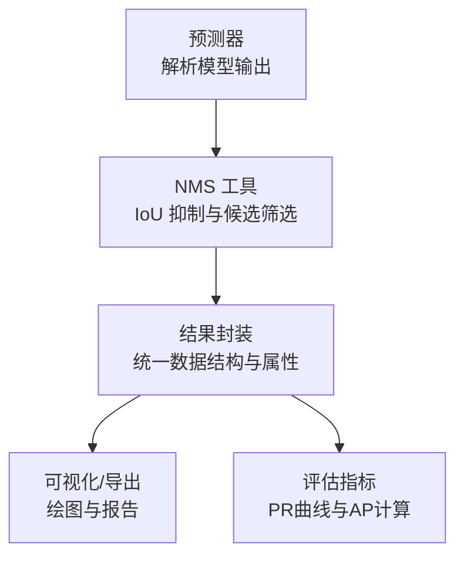
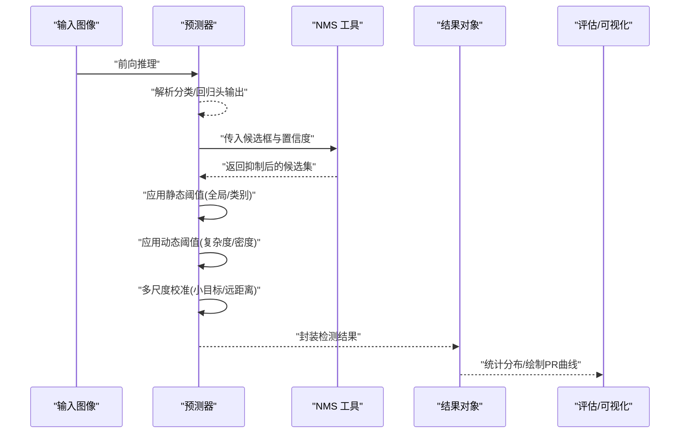
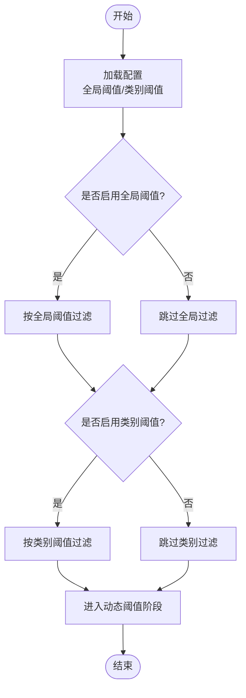
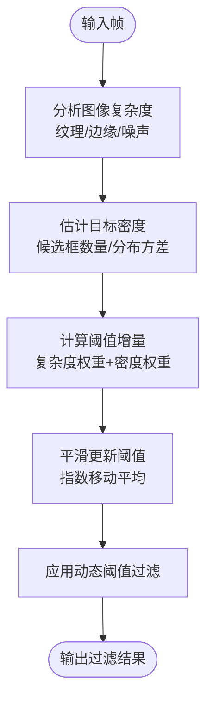
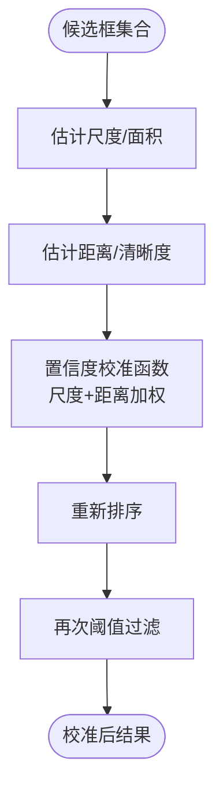
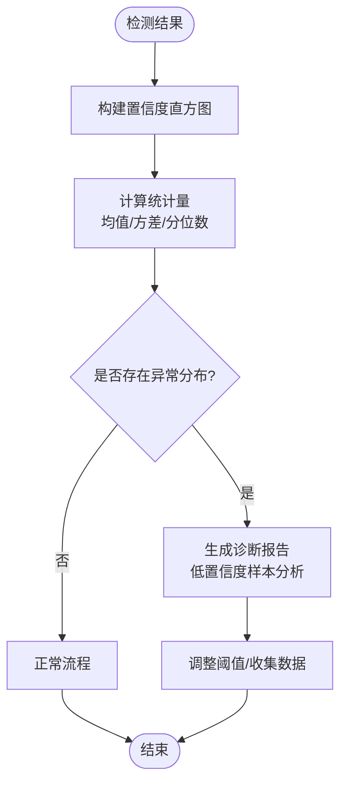
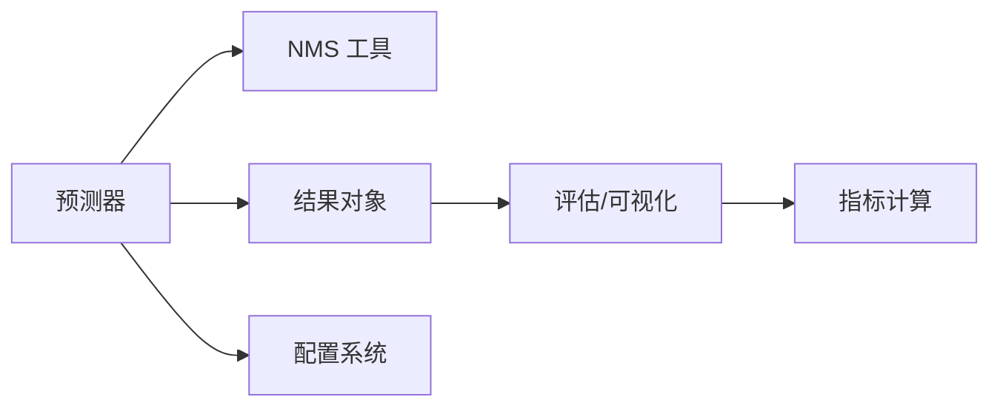

# 置信度过滤机制

<cite>
**本文引用的文件**
- [predict.py](file://ultralytics/engine/predictor.py)
- [results.py](file://ultralytics/engine/results.py)
- [nms.py](file://ultralytics/utils/nms.py)
- [default.yaml](file://ultralytics/cfg/default.yaml)
- [metrics.py](file://ultralytics/utils/metrics.py)
- [plotting.py](file://ultralytics/utils/plotting.py)
- [engine_validator.py](file://ultralytics/engine/validator.py)
- [trainer.py](file://ultralytics/engine/trainer.py)
- [tuner.py](file://ultralytics/engine/tuner.py)
</cite>

## 目录
1. [简介](#简介)
2. [项目结构](#项目结构)
3. [核心组件](#核心组件)
4. [架构总览](#架构总览)
5. [详细组件分析](#详细组件分析)
6. [依赖关系分析](#依赖关系分析)
7. [性能考量](#性能考量)
8. [故障排查指南](#故障排查指南)
9. [结论](#结论)
10. [附录](#附录)

## 简介
本技术文档聚焦于 YOLO-Master 的置信度过滤机制，系统性阐述静态阈值（全局与类别特定）的实现原理、动态阈值调整算法（基于图像复杂度与目标密度）、多尺度目标的置信度校准策略（小目标与远距离目标修正），以及置信度分布分析与异常检测。同时提供参数调优指南、自定义过滤策略集成方法与性能影响分析，帮助读者在不同数据集与场景下获得稳定可靠的检测结果。

## 项目结构
YOLO-Master 的推理与后处理流程中，置信度过滤主要涉及以下模块：
- 预测器与结果封装：负责模型输出解析、NMS 与置信度过滤入口
- NMS 工具：实现非极大值抑制及可选的置信度前置过滤
- 配置系统：提供默认阈值与可调参数
- 评估与可视化：用于置信度分布统计、诊断与调试

**图表来源**
- [predict.py](file://ultralytics/engine/predictor.py)
- [nms.py](file://ultralytics/utils/nms.py)
- [results.py](file://ultralytics/engine/results.py)
- [plotting.py](file://ultralytics/utils/plotting.py)
- [metrics.py](file://ultralytics/utils/metrics.py)

**章节来源**
- [predict.py](file://ultralytics/engine/predictor.py)
- [nms.py](file://ultralytics/utils/nms.py)
- [results.py](file://ultralytics/engine/results.py)
- [plotting.py](file://ultralytics/utils/plotting.py)
- [metrics.py](file://ultralytics/utils/metrics.py)

## 核心组件
- 预测器（Predictor）：加载模型、执行前向推理、调用 NMS 与置信度过滤、封装结果对象
- NMS 工具：按 IoU 阈值抑制重复框，支持在抑制前进行置信度阈值过滤
- 结果对象（Results）：存储检测框、类别、置信度、掩码等，并提供过滤、排序、可视化接口
- 配置（Default Config）：定义全局置信度阈值、IoU 阈值、类别特定阈值等关键参数
- 评估与可视化：统计置信度分布、绘制 PR 曲线、生成诊断报告

**章节来源**
- [predict.py](file://ultralytics/engine/predictor.py)
- [nms.py](file://ultralytics/utils/nms.py)
- [results.py](file://ultralytics/engine/results.py)
- [default.yaml](file://ultralytics/cfg/default.yaml)
- [metrics.py](file://ultralytics/utils/metrics.py)
- [plotting.py](file://ultralytics/utils/plotting.py)

## 架构总览
下图展示从模型输出到最终过滤结果的完整数据流，包括静态阈值、动态阈值与多尺度校准的关键节点。

**图表来源**
- [predict.py](file://ultralytics/engine/predictor.py)
- [nms.py](file://ultralytics/utils/nms.py)
- [results.py](file://ultralytics/engine/results.py)
- [metrics.py](file://ultralytics/utils/metrics.py)
- [plotting.py](file://ultralytics/utils/plotting.py)

## 详细组件分析

### 静态置信度阈值：全局与类别特定
- 全局阈值：对全部类别的统一置信度门槛，适用于快速过滤低质量预测
- 类别特定阈值：针对难分或易误报类别设置更高阈值，提升精确率
- 实现要点：
  - 在 NMS 之前或之后均可应用；通常先进行 NMS 再按类别阈值过滤，减少冗余计算
  - 类别阈值可通过配置文件或运行时参数覆盖默认值
  - 建议结合验证集上的 PR 曲线选择阈值，平衡召回与精确率

**图表来源**
- [predict.py](file://ultralytics/engine/predictor.py)
- [default.yaml](file://ultralytics/cfg/default.yaml)

**章节来源**
- [predict.py](file://ultralytics/engine/predictor.py)
- [default.yaml](file://ultralytics/cfg/default.yaml)

### 动态阈值调整：基于图像复杂度与目标密度
- 图像复杂度自适应：
  - 通过图像特征（如纹理复杂度、边缘强度、噪声水平）估计场景难度
  - 复杂场景提高阈值以降低误报，简单场景降低阈值以提升召回
- 目标密度智能过滤：
  - 根据每帧目标数量与分布密度动态调整阈值
  - 高密度场景更严格，低密度场景更宽松
- 实现要点：
  - 复杂度估计可基于预训练的特征网络或轻量级统计量
  - 密度估计可通过初始候选框数量与空间分布方差衡量
  - 动态阈值需平滑更新，避免帧间抖动

**图表来源**
- [predict.py](file://ultralytics/engine/predictor.py)
- [nms.py](file://ultralytics/utils/nms.py)

**章节来源**
- [predict.py](file://ultralytics/engine/predictor.py)
- [nms.py](file://ultralytics/utils/nms.py)

### 多尺度目标置信度校准：小目标与远距离目标
- 小目标校准：
  - 小目标通常置信度偏低但位置准确，适当降低其阈值或进行置信度提升
  - 可利用尺度感知特征或边界框面积作为校准因子
- 远距离目标校准：
  - 远距离目标受分辨率与模糊影响，置信度不稳定，需结合尺度与清晰度度量
  - 引入距离估计或深度线索辅助校准
- 实现要点：
  - 校准函数应为单调且可微，便于端到端优化
  - 校准后可重新排序并再次应用阈值，确保一致性

**图表来源**
- [predict.py](file://ultralytics/engine/predictor.py)
- [results.py](file://ultralytics/engine/results.py)

**章节来源**
- [predict.py](file://ultralytics/engine/predictor.py)
- [results.py](file://ultralytics/engine/results.py)

### 置信度分布分析与异常检测
- 分布统计：
  - 统计全局与类别置信度直方图、分位数、均值与方差
  - 识别双峰或多峰分布，提示阈值不合理或类别不平衡
- 异常检测：
  - 低置信度集中区域可能表示模型未学习到的模式或标注噪声
  - 使用滑动窗口统计置信度漂移，触发告警
- 诊断工具：
  - 可视化 PR 曲线与 ROC 曲线，定位阈值敏感区间
  - 生成样本级诊断报告，标注低置信度错误类型

**图表来源**
- [metrics.py](file://ultralytics/utils/metrics.py)
- [plotting.py](file://ultralytics/utils/plotting.py)
- [results.py](file://ultralytics/engine/results.py)

**章节来源**
- [metrics.py](file://ultralytics/utils/metrics.py)
- [plotting.py](file://ultralytics/utils/plotting.py)
- [results.py](file://ultralytics/engine/results.py)

### 置信度过滤参数的调优指南
- 数据集特性：
  - 类别不平衡：为少数类设置更高阈值，避免误报
  - 小目标密集：降低小目标阈值，提升召回
  - 背景复杂：提高全局阈值，抑制背景干扰
- 场景适配：
  - 实时视频：优先精确率，适度牺牲召回
  - 离线批处理：优先召回，允许更多后处理
- 调优方法：
  - 基于验证集的网格搜索或贝叶斯优化
  - 使用 PR 曲线选择最佳操作点
  - 结合业务需求设定阈值优先级

**章节来源**
- [default.yaml](file://ultralytics/cfg/default.yaml)
- [metrics.py](file://ultralytics/utils/metrics.py)

### 自定义过滤策略的集成方法
- 扩展点：
  - 在预测器中插入自定义过滤函数，支持按类别、尺度、密度等维度
  - 继承结果对象的过滤接口，实现领域特定的逻辑
- 集成步骤：
  - 定义过滤策略类，实现统一的输入输出接口
  - 注册到预测器的过滤器链中，支持顺序执行
  - 提供配置项，允许运行时切换策略
- 性能影响：
  - 自定义过滤应避免频繁内存分配与 CPU-GPU 同步
  - 使用向量化操作与批量处理提升吞吐

**章节来源**
- [predict.py](file://ultralytics/engine/predictor.py)
- [results.py](file://ultralytics/engine/results.py)

## 依赖关系分析
置信度过滤模块与以下组件存在紧密耦合：
- 预测器依赖 NMS 工具进行候选框筛选
- 结果对象封装过滤后的检测结果，供评估与可视化使用
- 配置系统提供阈值参数，影响过滤行为
- 评估与可视化模块依赖结果对象进行统计分析

**图表来源**
- [predict.py](file://ultralytics/engine/predictor.py)
- [nms.py](file://ultralytics/utils/nms.py)
- [results.py](file://ultralytics/engine/results.py)
- [default.yaml](file://ultralytics/cfg/default.yaml)
- [metrics.py](file://ultralytics/utils/metrics.py)

**章节来源**
- [predict.py](file://ultralytics/engine/predictor.py)
- [nms.py](file://ultralytics/utils/nms.py)
- [results.py](file://ultralytics/engine/results.py)
- [default.yaml](file://ultralytics/cfg/default.yaml)
- [metrics.py](file://ultralytics/utils/metrics.py)

## 性能考量
- 计算开销：
  - 动态阈值估计应轻量高效，避免成为瓶颈
  - 多尺度校准可使用查表或近似函数加速
- 内存占用：
  - 批量处理时注意中间结果缓存，避免重复计算
  - 使用原地操作减少内存分配
- 并行化：
  - 类别特定阈值可按类别并行应用
  - 图像复杂度估计可多线程或 GPU 加速

[本节为通用指导，不直接分析具体文件]

## 故障排查指南
- 常见问题：
  - 阈值过高导致漏检：检查类别阈值与动态阈值更新逻辑
  - 阈值过低导致误报：增加全局阈值或复杂度权重
  - 小目标召回低：调整小目标校准函数或降低其阈值
- 诊断步骤：
  - 查看置信度直方图与 PR 曲线，定位问题区间
  - 生成低置信度样本报告，分析错误类型
  - 逐步关闭动态阈值与校准，隔离问题模块
- 调试工具：
  - 使用可视化模块绘制检测结果与置信度热力图
  - 记录关键中间变量，监控阈值变化轨迹

**章节来源**
- [metrics.py](file://ultralytics/utils/metrics.py)
- [plotting.py](file://ultralytics/utils/plotting.py)
- [results.py](file://ultralytics/engine/results.py)

## 结论
YOLO-Master 的置信度过滤机制通过静态阈值、动态调整与多尺度校准的组合，实现了灵活而强大的检测后处理能力。合理配置与调优可显著提升不同场景下的检测精度与鲁棒性。建议结合业务需求与数据集特性，采用系统化调优方法与诊断工具，持续优化过滤策略。

[本节为总结性内容，不直接分析具体文件]

## 附录
- 相关脚本与示例：
  - 评估与调参脚本可用于自动化搜索最优阈值
  - 可视化脚本支持交互式调试与分析
- 参考文档：
  - 配置说明与参数含义详见默认配置文件
  - 评估指标与可视化方法参考工具模块

[本节为补充信息，不直接分析具体文件]