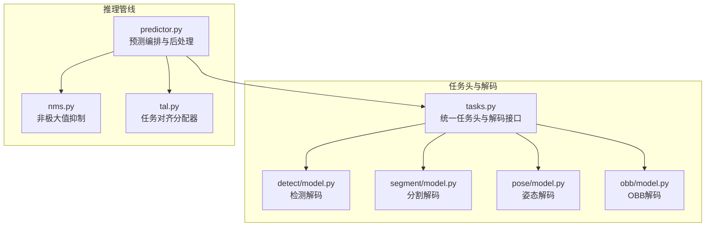
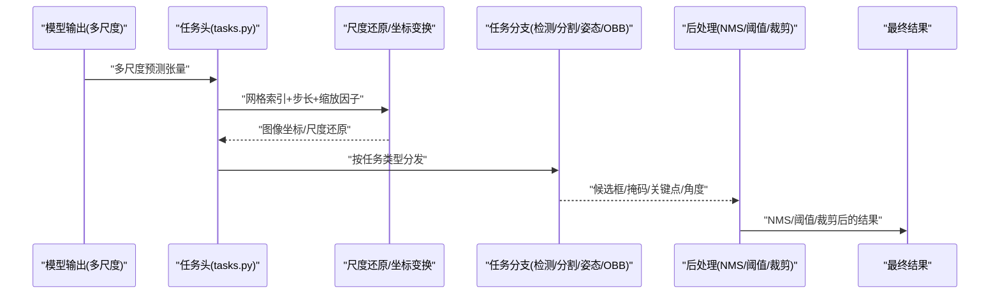
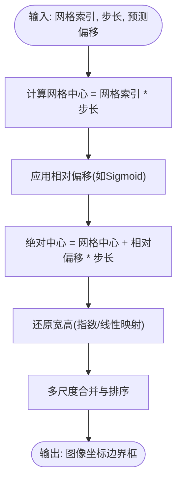
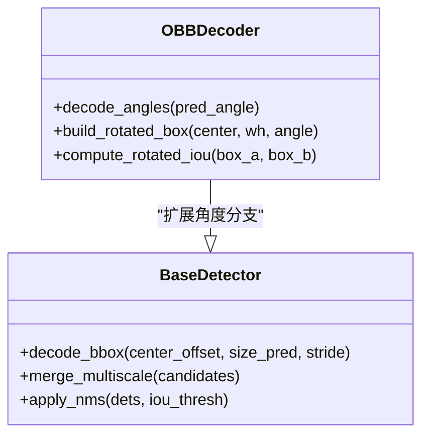
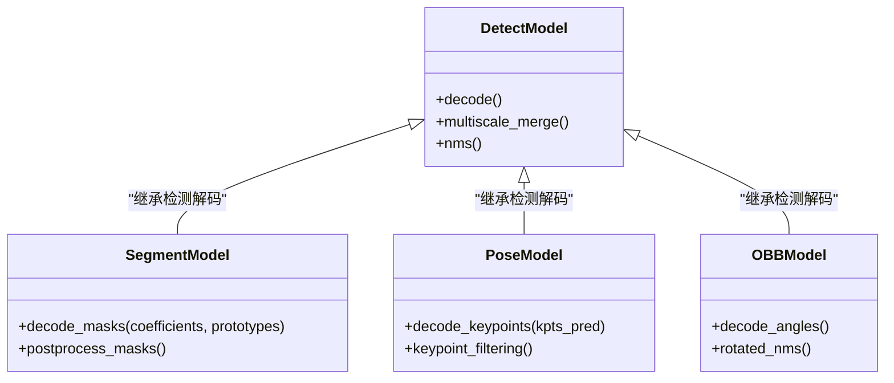
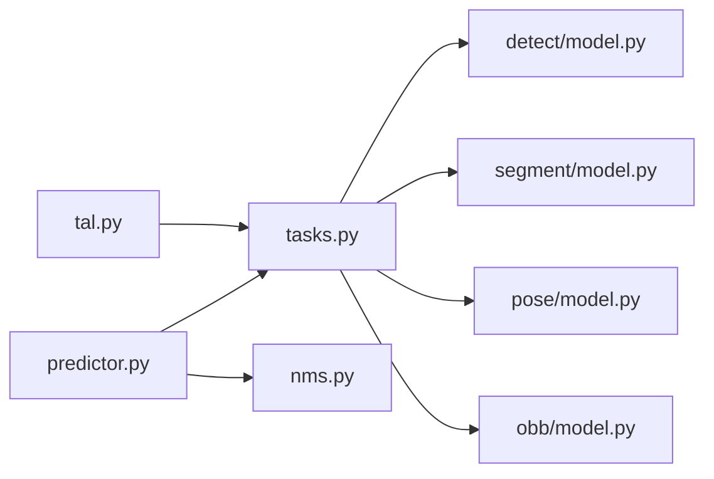

# 边界框解码算法

<cite>
**本文引用的文件**
- [ultralytics/nn/tasks.py](file://ultralytics/nn/tasks.py)
- [ultralytics/engine/predictor.py](file://ultralytics/engine/predictor.py)
- [ultralytics/utils/nms.py](file://ultralytics/utils/nms.py)
- [ultralytics/utils/tal.py](file://ultralytics/utils/tal.py)
- [ultralytics/models/yolo/detect/model.py](file://ultralytics/models/yolo/detect/model.py)
- [ultralytics/models/yolo/segment/model.py](file://ultralytics/models/yolo/segment/model.py)
- [ultralytics/models/yolo/pose/model.py](file://ultralytics/models/yolo/pose/model.py)
- [ultralytics/models/yolo/obb/model.py](file://ultralytics/models/yolo/obb/model.py)
</cite>

## 目录
1. [简介](#简介)
2. [项目结构](#项目结构)
3. [核心组件](#核心组件)
4. [架构总览](#架构总览)
5. [详细组件分析](#详细组件分析)
6. [依赖关系分析](#依赖关系分析)
7. [性能考量](#性能考量)
8. [故障排查指南](#故障排查指南)
9. [结论](#结论)
10. [附录](#附录)

## 简介
本技术文档聚焦于YOLO-Master的边界框解码算法，系统阐述从模型预测到图像坐标的完整转换流程、多尺度特征图上的尺度还原机制、角度计算与旋转边界框（OBB）处理逻辑，以及检测、分割、姿态估计等不同任务的差异化解码策略。同时对比锚框（Anchor-based）与无锚框（Anchor-free）方法的解码差异，并提供解码参数配置指南与精度验证方法。

## 项目结构
围绕边界框解码的关键代码主要分布在以下模块：
- 任务头与解码入口：负责将网络输出转换为边界框、类别概率、掩码或关键点等目标级结果
- 推理管线：在预测阶段组织多尺度输出、执行NMS与非极大值抑制后处理
- 工具库：提供NMS、TAL（TaskAlignedAssigner）等通用算子与分配策略
- 各任务模型：封装特定任务的解码分支（如分割掩码、姿态关键点、OBB角度）

图表来源
- [ultralytics/nn/tasks.py](file://ultralytics/nn/tasks.py)
- [ultralytics/models/yolo/detect/model.py](file://ultralytics/models/yolo/detect/model.py)
- [ultralytics/models/yolo/segment/model.py](file://ultralytics/models/yolo/segment/model.py)
- [ultralytics/models/yolo/pose/model.py](file://ultralytics/models/yolo/pose/model.py)
- [ultralytics/models/yolo/obb/model.py](file://ultralytics/models/yolo/obb/model.py)
- [ultralytics/engine/predictor.py](file://ultralytics/engine/predictor.py)
- [ultralytics/utils/nms.py](file://ultralytics/utils/nms.py)
- [ultralytics/utils/tal.py](file://ultralytics/utils/tal.py)

章节来源
- [ultralytics/nn/tasks.py](file://ultralytics/nn/tasks.py)
- [ultralytics/engine/predictor.py](file://ultralytics/engine/predictor.py)
- [ultralytics/utils/nms.py](file://ultralytics/utils/nms.py)
- [ultralytics/utils/tal.py](file://ultralytics/utils/tal.py)
- [ultralytics/models/yolo/detect/model.py](file://ultralytics/models/yolo/detect/model.py)
- [ultralytics/models/yolo/segment/model.py](file://ultralytics/models/yolo/segment/model.py)
- [ultralytics/models/yolo/pose/model.py](file://ultralytics/models/yolo/pose/model.py)
- [ultralytics/models/yolo/obb/model.py](file://ultralytics/models/yolo/obb/model.py)

## 核心组件
- 统一任务头与解码接口：定义不同任务（检测、分割、姿态、OBB）共享的解码入口与数据契约，确保多尺度输出的拼接与归一化一致
- 多尺度融合与尺度还原：将P3/P4/P5等多尺度特征图上的预测进行上采样与拼接，按步长映射回原图尺寸
- 坐标变换与边界框重建：将网格相对偏移与尺度因子结合，恢复为图像绝对坐标；对OBB额外引入角度计算
- 任务差异化解码：
  - 检测：仅输出中心偏移、宽高与类别分数
  - 分割：在检测基础上附加掩码系数，用于重建实例掩码
  - 姿态：在检测基础上附加关键点坐标
  - OBB：在检测基础上附加角度，支持旋转框
- 后处理：NMS去重、置信度阈值过滤、坐标裁剪至图像边界

章节来源
- [ultralytics/nn/tasks.py](file://ultralytics/nn/tasks.py)
- [ultralytics/models/yolo/detect/model.py](file://ultralytics/models/yolo/detect/model.py)
- [ultralytics/models/yolo/segment/model.py](file://ultralytics/models/yolo/segment/model.py)
- [ultralytics/models/yolo/pose/model.py](file://ultralytics/models/yolo/pose/model.py)
- [ultralytics/models/yolo/obb/model.py](file://ultralytics/models/yolo/obb/model.py)

## 架构总览
下图展示了从模型输出到最终检测结果的整体流程，包括多尺度解码、坐标还原、NMS与任务特定分支。

图表来源
- [ultralytics/nn/tasks.py](file://ultralytics/nn/tasks.py)
- [ultralytics/engine/predictor.py](file://ultralytics/engine/predictor.py)
- [ultralytics/utils/nms.py](file://ultralytics/utils/nms.py)

## 详细组件分析

### 坐标变换与尺度还原
- 网格与步长：每个特征图对应固定步长（stride），网格单元中心位置由网格索引与步长相乘得到
- 相对偏移：预测的中心偏移通常以Sigmoid或类似函数约束在[0,1]区间，表示相对于网格中心的相对位移
- 尺度还原：将相对偏移与步长相乘并加上网格中心，得到图像绝对坐标；宽高同样通过指数或线性映射还原
- 多尺度融合：将P3/P4/P5等尺度的候选框合并，并按置信度排序后进行NMS

图表来源
- [ultralytics/nn/tasks.py](file://ultralytics/nn/tasks.py)
- [ultralytics/models/yolo/detect/model.py](file://ultralytics/models/yolo/detect/model.py)

章节来源
- [ultralytics/nn/tasks.py](file://ultralytics/nn/tasks.py)
- [ultralytics/models/yolo/detect/model.py](file://ultralytics/models/yolo/detect/model.py)

### 角度计算与旋转边界框（OBB）
- 角度预测：OBB在检测基础上增加角度通道，角度通常以周期性激活函数（如正弦/余弦编码）保证连续性
- 旋转框构建：基于中心、宽高与角度生成四个顶点，或在后续可视化/评估中按需展开
- 特殊解码逻辑：角度需与方向一致性约束配合，避免±π跳变；NMS时需使用旋转框IoU

图表来源
- [ultralytics/models/yolo/obb/model.py](file://ultralytics/models/yolo/obb/model.py)
- [ultralytics/nn/tasks.py](file://ultralytics/nn/tasks.py)

章节来源
- [ultralytics/models/yolo/obb/model.py](file://ultralytics/models/yolo/obb/model.py)
- [ultralytics/nn/tasks.py](file://ultralytics/nn/tasks.py)

### 任务差异化解码策略
- 检测（Detect）：解码中心、宽高与类别分数；多尺度合并与NMS
- 分割（Segment）：在检测基础上解码掩码系数，结合原型掩码重建实例掩码
- 姿态（Pose）：在检测基础上解码关键点坐标，并进行关键点级别的NMS或筛选
- OBB：在检测基础上解码角度，构建旋转框并采用旋转IoU

图表来源
- [ultralytics/models/yolo/detect/model.py](file://ultralytics/models/yolo/detect/model.py)
- [ultralytics/models/yolo/segment/model.py](file://ultralytics/models/yolo/segment/model.py)
- [ultralytics/models/yolo/pose/model.py](file://ultralytics/models/yolo/pose/model.py)
- [ultralytics/models/yolo/obb/model.py](file://ultralytics/models/yolo/obb/model.py)

章节来源
- [ultralytics/models/yolo/detect/model.py](file://ultralytics/models/yolo/detect/model.py)
- [ultralytics/models/yolo/segment/model.py](file://ultralytics/models/yolo/segment/model.py)
- [ultralytics/models/yolo/pose/model.py](file://ultralytics/models/yolo/pose/model.py)
- [ultralytics/models/yolo/obb/model.py](file://ultralytics/models/yolo/obb/model.py)

### 锚框机制与无锚框解码差异
- 锚框（Anchor-based）：预定义一组先验框，解码时预测相对偏移与类别；优势在于对小目标更稳定，但需要调参且可能引入冗余
- 无锚框（Anchor-free）：直接预测中心偏移与宽高，无需先验框；简化了超参数量，提升泛化性，适合端到端优化
- YOLO-Master默认采用无锚框策略，减少锚框相关超参，提高部署与训练稳定性

章节来源
- [ultralytics/nn/tasks.py](file://ultralytics/nn/tasks.py)
- [ultralytics/models/yolo/detect/model.py](file://ultralytics/models/yolo/detect/model.py)

### 解码参数配置指南
- 网格大小与步长：根据特征图分辨率设置，常见步长为8/16/32，分别对应P3/P4/P5
- 缩放因子：控制宽高还原的尺度范围，影响小目标的敏感度与大目标的覆盖度
- 置信度阈值：过滤低置信度候选框，平衡召回与误检
- IoU阈值：NMS的去重强度，过大易漏检，过小保留重复框
- 角度阈值（OBB）：旋转框方向一致性约束，避免角度跳变导致的框不稳定

章节来源
- [ultralytics/nn/tasks.py](file://ultralytics/nn/tasks.py)
- [ultralytics/engine/predictor.py](file://ultralytics/engine/predictor.py)

### 解码精度验证与误差分析
- 坐标误差：比较解码后的中心与宽高与标注的真实框，计算L1/L2误差分布
- IoU误差：统计真实框与预测框的IoU偏差，识别系统性偏置
- 角度误差（OBB）：计算角度差（考虑周期性），分析方向一致性
- 多尺度贡献：分解P3/P4/P5的贡献比例，定位尺度选择问题
- 阈值敏感性：扫描置信度与IoU阈值，绘制PR曲线与误差热力图

章节来源
- [ultralytics/utils/nms.py](file://ultralytics/utils/nms.py)
- [ultralytics/utils/tal.py](file://ultralytics/utils/tal.py)

## 依赖关系分析
- tasks.py作为统一任务头，被各任务模型引用，提供一致的解码接口
- predictor.py在推理阶段调用任务头与NMS，组织多尺度输出与后处理
- tal.py提供任务对齐分配器，辅助训练阶段的正负样本分配，间接影响解码质量

图表来源
- [ultralytics/nn/tasks.py](file://ultralytics/nn/tasks.py)
- [ultralytics/engine/predictor.py](file://ultralytics/engine/predictor.py)
- [ultralytics/utils/nms.py](file://ultralytics/utils/nms.py)
- [ultralytics/utils/tal.py](file://ultralytics/utils/tal.py)
- [ultralytics/models/yolo/detect/model.py](file://ultralytics/models/yolo/detect/model.py)
- [ultralytics/models/yolo/segment/model.py](file://ultralytics/models/yolo/segment/model.py)
- [ultralytics/models/yolo/pose/model.py](file://ultralytics/models/yolo/pose/model.py)
- [ultralytics/models/yolo/obb/model.py](file://ultralytics/models/yolo/obb/model.py)

章节来源
- [ultralytics/nn/tasks.py](file://ultralytics/nn/tasks.py)
- [ultralytics/engine/predictor.py](file://ultralytics/engine/predictor.py)
- [ultralytics/utils/nms.py](file://ultralytics/utils/nms.py)
- [ultralytics/utils/tal.py](file://ultralytics/utils/tal.py)
- [ultralytics/models/yolo/detect/model.py](file://ultralytics/models/yolo/detect/model.py)
- [ultralytics/models/yolo/segment/model.py](file://ultralytics/models/yolo/segment/model.py)
- [ultralytics/models/yolo/pose/model.py](file://ultralytics/models/yolo/pose/model.py)
- [ultralytics/models/yolo/obb/model.py](file://ultralytics/models/yolo/obb/model.py)

## 性能考量
- 多尺度并行解码：利用GPU并行特性，同时对P3/P4/P5进行解码与合并
- NMS优化：采用向量化实现与近似IoU加速，降低后处理延迟
- 内存管理：及时释放中间张量，避免多尺度合并时的峰值内存
- 精度-速度权衡：调整阈值与IoU，平衡召回率与推理时间

## 故障排查指南
- 坐标越界：检查步长与缩放因子是否匹配输入图像尺寸，确保坐标裁剪正确
- 角度异常（OBB）：确认角度激活函数与周期性约束，避免±π跳变
- NMS失效：检查IoU阈值与置信度阈值组合，必要时调整任务特定的NMS策略
- 多尺度不平衡：分析P3/P4/P5的贡献，适当调整权重或缩放因子

章节来源
- [ultralytics/utils/nms.py](file://ultralytics/utils/nms.py)
- [ultralytics/models/yolo/obb/model.py](file://ultralytics/models/yolo/obb/model.py)

## 结论
YOLO-Master的边界框解码算法以无锚框为核心，结合多尺度特征图与统一的解码接口，实现了检测、分割、姿态与OBB的统一框架。通过合理的坐标变换、尺度还原与任务差异化处理，系统在精度与效率之间取得良好平衡。未来可进一步优化NMS与角度一致性约束，以提升复杂场景下的鲁棒性。

## 附录
- 术语表：
  - 步长（Stride）：特征图到原图的缩放比例
  - 网格索引（Grid Index）：特征图上每个单元的行列号
  - 相对偏移（Relative Offset）：预测的中心偏移，通常约束在[0,1]
  - 旋转框（Rotated Box）：包含角度的边界框，适用于密集排列与倾斜目标
- 参考实现路径：
  - 统一任务头与解码接口：[ultralytics/nn/tasks.py](file://ultralytics/nn/tasks.py)
  - 检测解码：[ultralytics/models/yolo/detect/model.py](file://ultralytics/models/yolo/detect/model.py)
  - 分割解码：[ultralytics/models/yolo/segment/model.py](file://ultralytics/models/yolo/segment/model.py)
  - 姿态解码：[ultralytics/models/yolo/pose/model.py](file://ultralytics/models/yolo/pose/model.py)
  - OBB解码：[ultralytics/models/yolo/obb/model.py](file://ultralytics/models/yolo/obb/model.py)
  - 推理编排与后处理：[ultralytics/engine/predictor.py](file://ultralytics/engine/predictor.py)
  - NMS实现：[ultralytics/utils/nms.py](file://ultralytics/utils/nms.py)
  - 任务对齐分配器：[ultralytics/utils/tal.py](file://ultralytics/utils/tal.py)