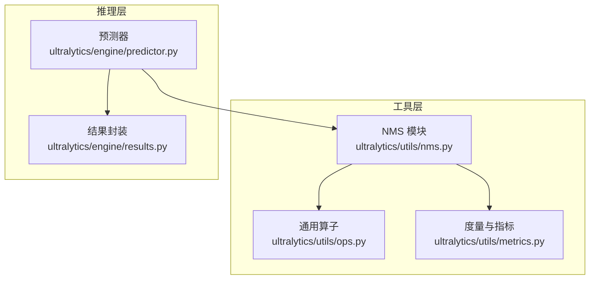
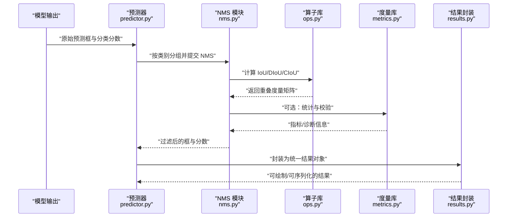
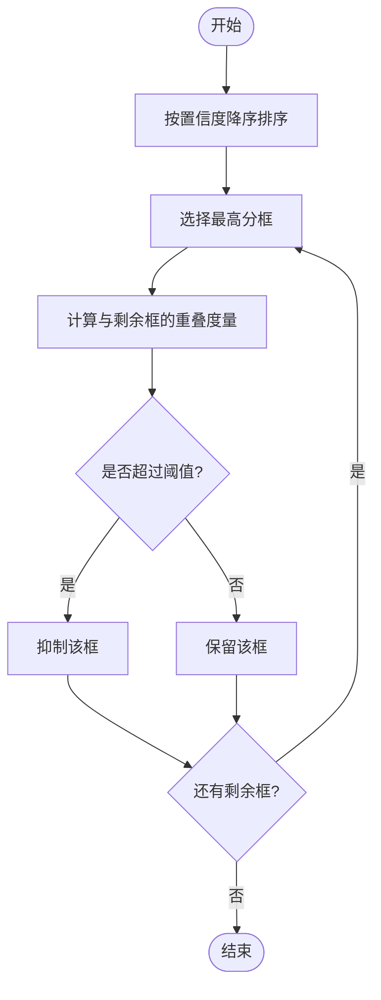
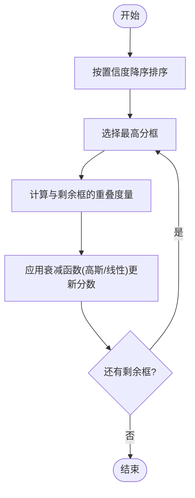
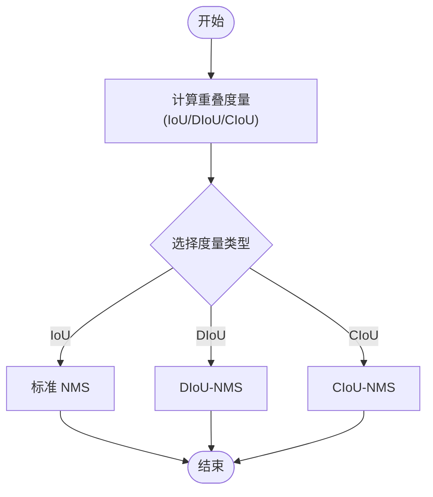
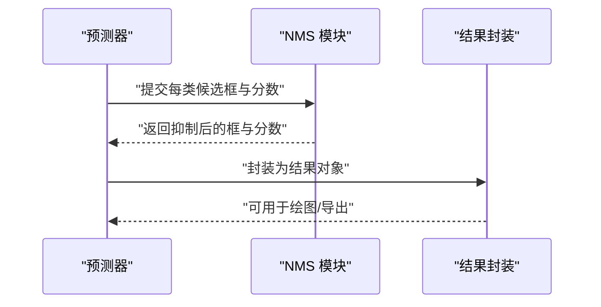
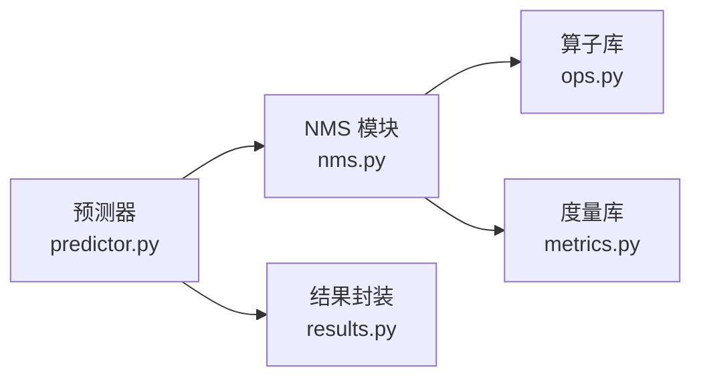

# 非极大值抑制算法

<cite>
**本文引用的文件**
- [nms.py](file://ultralytics/utils/nms.py)
- [ops.py](file://ultralytics/utils/ops.py)
- [metrics.py](file://ultralytics/utils/metrics.py)
- [predictor.py](file://ultralytics/engine/predictor.py)
- [results.py](file://ultralytics/engine/results.py)
</cite>

## 目录
1. [简介](#简介)
2. [项目结构](#项目结构)
3. [核心组件](#核心组件)
4. [架构总览](#架构总览)
5. [详细组件分析](#详细组件分析)
6. [依赖关系分析](#依赖关系分析)
7. [性能考量](#性能考量)
8. [故障排查指南](#故障排查指南)
9. [结论](#结论)
10. [附录](#附录)

## 简介
本技术文档聚焦于 YOLO-Master 中的非极大值抑制（NMS）相关实现与使用，覆盖标准 NMS、软 NMS（Soft-NMS）、以及基于距离与形状增强的 IoU 变体（DIoU-NMS、CIoU-NMS）。文档从算法原理、代码级流程、参数调优到集成与基准测试提供系统化说明，帮助读者在不同场景（小目标、密集目标等）下选择合适的 NMS 策略并优化检测质量与速度。

## 项目结构
YOLO-Master 的 NMS 相关逻辑主要位于工具层与推理引擎中：
- 工具层：封装了 NMS 计算、IoU 度量、批量处理与设备加速等通用算子
- 推理层：在预测后处理阶段调用 NMS 进行候选框筛选与融合
- 结果层：对 NMS 输出进行可视化与序列化

**图示来源**
- [nms.py](file://ultralytics/utils/nms.py)
- [ops.py](file://ultralytics/utils/ops.py)
- [metrics.py](file://ultralytics/utils/metrics.py)
- [predictor.py](file://ultralytics/engine/predictor.py)
- [results.py](file://ultralytics/engine/results.py)

**章节来源**
- [nms.py](file://ultralytics/utils/nms.py)
- [ops.py](file://ultralytics/utils/ops.py)
- [metrics.py](file://ultralytics/utils/metrics.py)
- [predictor.py](file://ultralytics/engine/predictor.py)
- [results.py](file://ultralytics/engine/results.py)

## 核心组件
- 标准 NMS：按类别分别排序置信度，迭代选择最高分框并抑制与其 IoU 超过阈值的其余框
- 软 NMS（Soft-NMS）：通过衰减函数（高斯或线性）逐步降低重叠框的置信度，避免直接丢弃导致的漏检
- DIoU-NMS / CIoU-NMS：以距离或形状信息增强 IoU，提升对小目标和密集目标的抑制精度
- 批量与设备适配：支持 CPU/GPU 张量输入，向量化计算以提升吞吐

关键职责划分：
- nms.py：定义 NMS 接口与具体实现（含 Soft-NMS、DIoU/CIoU 变体）
- ops.py：提供高效的 IoU、坐标变换、掩码/边界框操作等底层算子
- metrics.py：提供评估指标与 IoU 计算辅助方法
- predictor.py：在模型推理后调用 NMS 完成最终框筛选
- results.py：将 NMS 后的检测结果封装为统一结果对象

**章节来源**
- [nms.py](file://ultralytics/utils/nms.py)
- [ops.py](file://ultralytics/utils/ops.py)
- [metrics.py](file://ultralytics/utils/metrics.py)
- [predictor.py](file://ultralytics/engine/predictor.py)
- [results.py](file://ultralytics/engine/results.py)

## 架构总览
下图展示了从模型输出到最终检测结果的端到端流程，重点标注 NMS 在其中的位置与数据流向。

**图示来源**
- [predictor.py](file://ultralytics/engine/predictor.py)
- [nms.py](file://ultralytics/utils/nms.py)
- [ops.py](file://ultralytics/utils/ops.py)
- [metrics.py](file://ultralytics/utils/metrics.py)
- [results.py](file://ultralytics/engine/results.py)

## 详细组件分析

### 标准 NMS 算法
- 输入：每类的候选框集合及其置信度分数
- 步骤：
  - 按置信度降序排序
  - 选取当前最高分框作为保留框
  - 计算该框与其他剩余框的重叠度量（默认 IoU）
  - 若重叠度量超过阈值，则抑制（删除）对应框
  - 重复直至所有框处理完毕
- 复杂度：通常为 O(N^2)，可通过批量化与向量化优化
- 适用场景：一般目标检测、中等密度场景

**图示来源**
- [nms.py](file://ultralytics/utils/nms.py)
- [ops.py](file://ultralytics/utils/ops.py)

**章节来源**
- [nms.py](file://ultralytics/utils/nms.py)
- [ops.py](file://ultralytics/utils/ops.py)

### 软 NMS（Soft-NMS）
- 改进动机：标准 NMS 会直接丢弃高重叠框，易造成漏检；Soft-NMS 通过衰减函数逐步降低重叠框的置信度
- 衰减函数：
  - 高斯衰减：随 IoU 增加平滑降低分数，减少“硬截断”带来的误判
  - 线性衰减：简单线性下降，计算开销更低
- 流程差异：不再直接删除框，而是更新其置信度；后续仍按置信度排序继续抑制
- 适用场景：密集目标、遮挡严重、小目标较多的场景

**图示来源**
- [nms.py](file://ultralytics/utils/nms.py)
- [ops.py](file://ultralytics/utils/ops.py)

**章节来源**
- [nms.py](file://ultralytics/utils/nms.py)
- [ops.py](file://ultralytics/utils/ops.py)

### DIoU-NMS 与 CIoU-NMS
- DIoU-NMS：在 IoU 基础上引入中心点距离惩罚，使重叠度量更关注框间相对位置，有利于小目标与近距离重叠
- CIoU-NMS：进一步考虑长宽比一致性，综合重叠面积、中心距离与形状相似性，抑制更稳健
- 优势：
  - 对小目标更敏感，能更好区分相邻但不同对象的框
  - 在密集场景中减少误抑制，提高召回率
- 代价：计算略高于标准 IoU，需权衡精度与速度

**图示来源**
- [nms.py](file://ultralytics/utils/nms.py)
- [ops.py](file://ultralytics/utils/ops.py)
- [metrics.py](file://ultralytics/utils/metrics.py)

**章节来源**
- [nms.py](file://ultralytics/utils/nms.py)
- [ops.py](file://ultralytics/utils/ops.py)
- [metrics.py](file://ultralytics/utils/metrics.py)

### 预测器与 NMS 的集成
- 预测器在模型输出后进行后处理，包括：
  - 按类别分组
  - 调用 NMS 执行抑制
  - 将结果封装为统一对象供可视化与导出
- 关键点：
  - 类别维度的独立抑制，避免跨类干扰
  - 置信度阈值与 IoU 阈值的组合控制最终输出数量与质量

**图示来源**
- [predictor.py](file://ultralytics/engine/predictor.py)
- [nms.py](file://ultralytics/utils/nms.py)
- [results.py](file://ultralytics/engine/results.py)

**章节来源**
- [predictor.py](file://ultralytics/engine/predictor.py)
- [nms.py](file://ultralytics/utils/nms.py)
- [results.py](file://ultralytics/engine/results.py)

## 依赖关系分析
- NMS 模块依赖算子库进行高效几何计算（如 IoU、坐标变换）
- 度量库提供 IoU 计算与评估指标，便于调试与对比
- 预测器负责编排 NMS 调用与结果封装
- 结果对象承载 NMS 后的检测框、类别与置信度，供下游任务使用

**图示来源**
- [predictor.py](file://ultralytics/engine/predictor.py)
- [nms.py](file://ultralytics/utils/nms.py)
- [ops.py](file://ultralytics/utils/ops.py)
- [metrics.py](file://ultralytics/utils/metrics.py)
- [results.py](file://ultralytics/engine/results.py)

**章节来源**
- [predictor.py](file://ultralytics/engine/predictor.py)
- [nms.py](file://ultralytics/utils/nms.py)
- [ops.py](file://ultralytics/utils/ops.py)
- [metrics.py](file://ultralytics/utils/metrics.py)
- [results.py](file://ultralytics/engine/results.py)

## 性能考量
- 时间复杂度：标准 NMS 为 O(N^2)，Soft-NMS 类似；DIoU/CIoU 相较 IoU 有额外计算开销
- 并行化与向量化：利用 GPU 张量运算与批处理可降低延迟
- 阈值策略：
  - IoU 阈值越高，抑制越激进，可能降低召回
  - 置信度阈值越高，输出越少，可能影响小目标召回
- 场景建议：
  - 小目标：优先尝试 DIoU/CIoU-NMS 与较低 IoU 阈值
  - 密集目标：Soft-NMS 配合适度 IoU 阈值，平衡召回与误检
  - 实时系统：标准 NMS + 合理阈值，保证速度

[本节为通用指导，不直接分析具体文件]

## 故障排查指南
- 常见问题：
  - 输出框过少：检查置信度阈值与 IoU 阈值是否过高
  - 同一目标多次出现：降低 IoU 阈值或改用 Soft-NMS
  - 小目标漏检：尝试 DIoU/CIoU-NMS 并调整阈值
- 定位方法：
  - 打印每类候选框数量与抑制前后变化
  - 记录被抑制框的 IoU 分布，观察阈值是否过于严格
  - 对比不同 NMS 变体的 mAP 与速度

**章节来源**
- [nms.py](file://ultralytics/utils/nms.py)
- [ops.py](file://ultralytics/utils/ops.py)
- [metrics.py](file://ultralytics/utils/metrics.py)

## 结论
YOLO-Master 的 NMS 体系提供了从标准 NMS 到 Soft-NMS 与 DIoU/CIoU 变体的完整方案，结合算子库的高效实现与预测器的良好集成，能够覆盖多种检测场景。通过合理的参数调优与变体选择，可在精度与速度之间取得平衡，尤其在小目标与密集目标场景中表现更佳。

[本节为总结性内容，不直接分析具体文件]

## 附录

### 参数调优指南
- IoU 阈值：
  - 标准 NMS：通常 0.45–0.6
  - Soft-NMS：可略低，配合衰减系数
  - DIoU/CIoU：可略低于 IoU，因度量更敏感
- 置信度阈值：
  - 根据数据集与部署需求设定，兼顾召回与误检
- 类别维度：
  - 确保按类别独立抑制，避免跨类干扰

[本节为通用指导，不直接分析具体文件]

### 自定义 NMS 集成方法
- 在 NMS 模块中扩展新的抑制策略（如加权 NMS、自适应阈值）
- 复用算子库的几何计算能力，保持接口一致
- 在预测器中注册新策略，并在结果封装中保持一致的输出格式

[本节为通用指导，不直接分析具体文件]

### 性能基准测试建议
- 指标：mAP、FPS、内存占用
- 场景：小目标、密集目标、遮挡严重
- 方法：固定模型权重，仅切换 NMS 变体与参数，记录对比结果

[本节为通用指导，不直接分析具体文件]