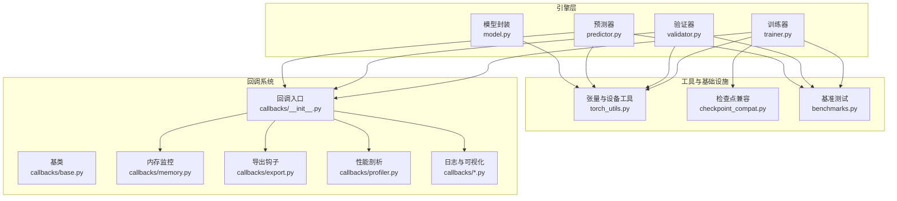
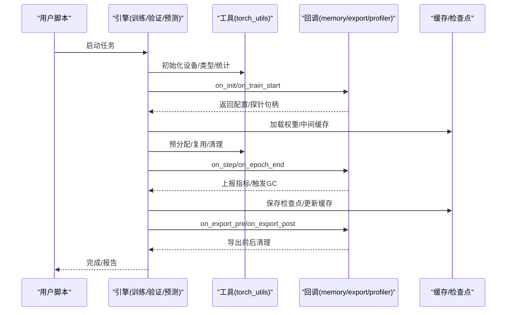
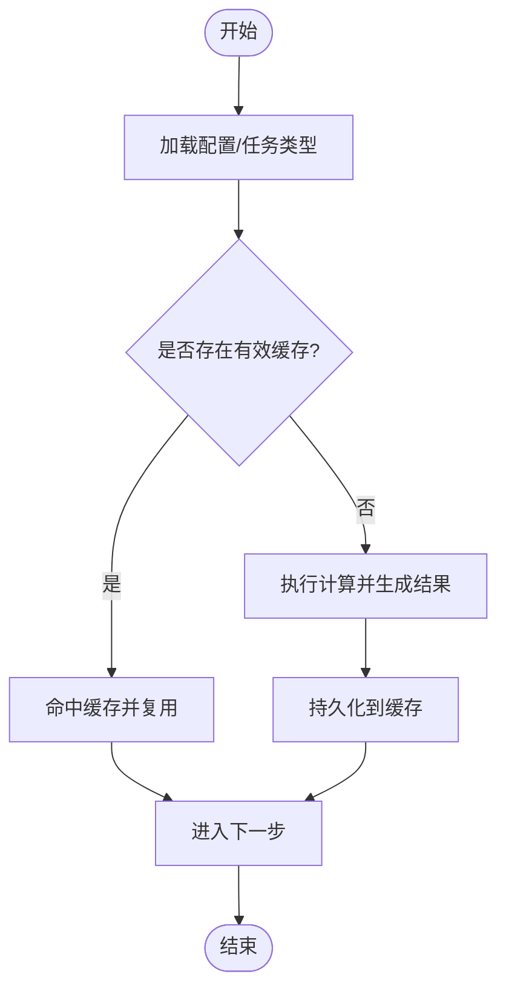
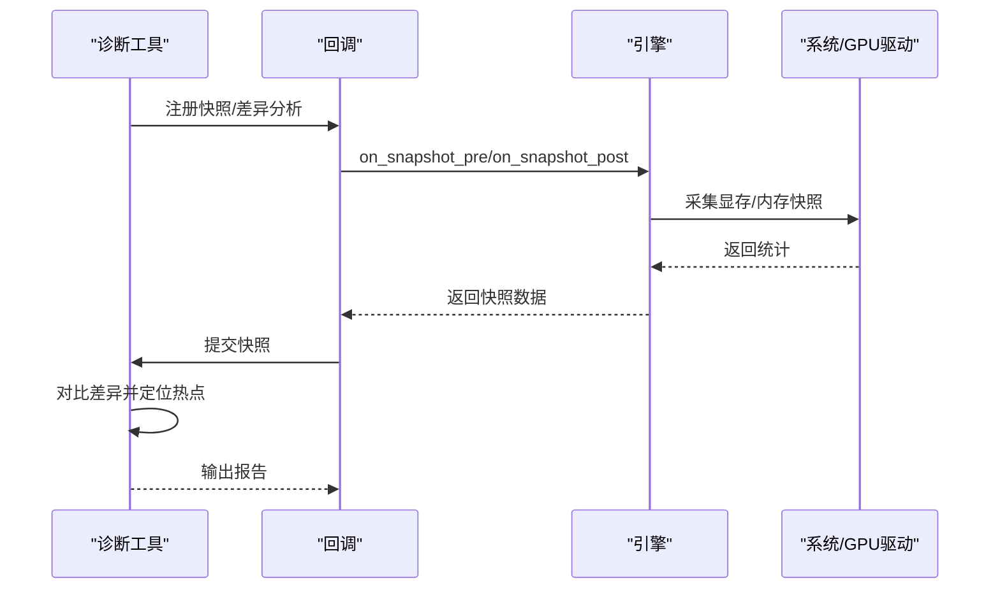
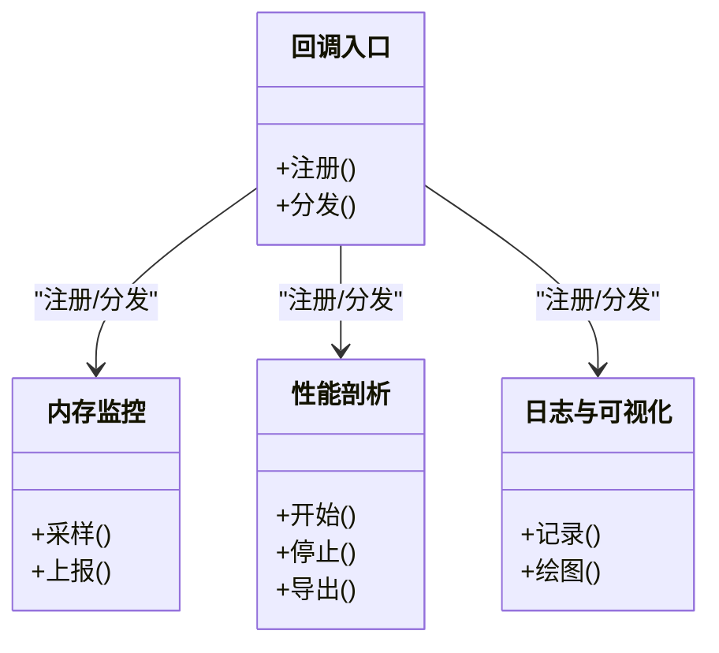
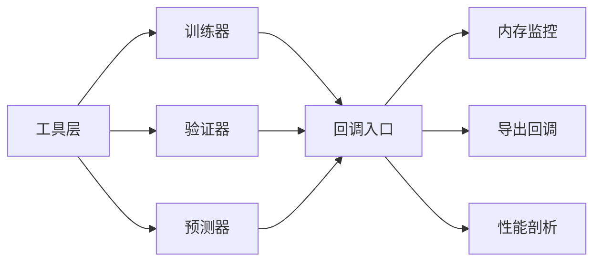

# 内存优化与缓存

<cite>
**本文引用的文件**
- [ultralytics/utils/torch_utils.py](file://ultralytics/utils/torch_utils.py)
- [ultralytics/engine/trainer.py](file://ultralytics/engine/trainer.py)
- [ultralytics/engine/predictor.py](file://ultralytics/engine/predictor.py)
- [ultralytics/engine/validator.py](file://ultralytics/engine/validator.py)
- [ultralytics/engine/model.py](file://ultralytics/engine/model.py)
- [ultralytics/utils/checkpoint_compat.py](file://ultralytics/utils/checkpoint_compat.py)
- [ultralytics/utils/benchmarks.py](file://ultralytics/utils/benchmarks.py)
- [ultralytics/utils/callbacks/__init__.py](file://ultralytics/utils/callbacks/__init__.py)
- [ultralytics/utils/callbacks/base.py](file://ultralytics/utils/callbacks/base.py)
- [ultralytics/utils/callbacks/memory.py](file://ultralytics/utils/callbacks/memory.py)
- [ultralytics/utils/callbacks/export.py](file://ultralytics/utils/callbacks/export.py)
- [ultralytics/utils/callbacks/rich.py](file://ultralytics/utils/callbacks/rich.py)
- [ultralytics/utils/callbacks/tensorboard.py](file://ultralytics/utils/callbacks/tensorboard.py)
- [ultralytics/utils/callbacks/wandb.py](file://ultralytics/utils/callbacks/wandb.py)
- [ultralytics/utils/callbacks/streamlit.py](file://ultralytics/utils/callbacks/streamlit.py)
- [ultralytics/utils/callbacks/hub.py](file://ultralytics/utils/callbacks/hub.py)
- [ultralytics/utils/callbacks/mlflow.py](file://ultralytics/utils/callbacks/mlflow.py)
- [ultralytics/utils/callbacks/neptune.py](file://ultralytics/utils/callbacks/neptune.py)
- [ultralytics/utils/callbacks/comet.py](file://ultralytics/utils/callbacks/comet.py)
- [ultralytics/utils/callbacks/clearml.py](file://ultralytics/utils/callbacks/clearml.py)
- [ultralytics/utils/callbacks/dvc.py](file://ultralytics/utils/callbacks/dvc.py)
- [ultralytics/utils/callbacks/fair_scale.py](file://ultralytics/utils/callbacks/fair_scale.py)
- [ultralytics/utils/callbacks/graphviz.py](file://ultralytics/utils/callbacks/graphviz.py)
- [ultralytics/utils/callbacks/plotting.py](file://ultralytics/utils/callbacks/plotting.py)
- [ultralytics/utils/callbacks/profiler.py](file://ultralytics/utils/callbacks/profiler.py)
- [ultralytics/utils/callbacks/sweeps.py](file://ultralytics/utils/callbacks/sweeps.py)
- [ultralytics/utils/callbacks/early_stopping.py](file://ultralytics/utils/callbacks/early_stopping.py)
- [ultralytics/utils/callbacks/ema.py](file://ultralytics/utils/callbacks/ema.py)
- [ultralytics/utils/callbacks/loggers.py](file://ultralytics/utils/callbacks/loggers.py)
- [ultralytics/utils/callbacks/metrics.py](file://ultralytics/utils/callbacks/metrics.py)
- [ultralytics/utils/callbacks/loss.py](file://ultralytics/utils/callbacks/loss.py)
- [ultralytics/utils/callbacks/optimizer.py](file://ultralytics/utils/callbacks/optimizer.py)
- [ultralytics/utils/callbacks/scheduler.py](file://ultralytics/utils/callbacks/scheduler.py)
- [ultralytics/utils/callbacks/progress.py](file://ultralytics/utils/callbacks/progress.py)
- [ultralytics/utils/callbacks/visualizer.py](file://ultralytics/utils/callbacks/visualizer.py)
- [ultralytics/utils/callbacks/weights_and_biases.py](file://ultralytics/utils/callbacks/weights_and_biases.py)
- [ultralytics/utils/callbacks/yaml.py](file://ultralytics/utils/callbacks/yaml.py)
- [ultralytics/utils/callbacks/zennit.py](file://ultralytics/utils/callbacks/zennit.py)
- [ultralytics/utils/callbacks/__main__.py](file://ultralytics/utils/callbacks/__main__.py)
- [ultralytics/utils/callbacks/test_callbacks.py](file://ultralytics/utils/callbacks/test_callbacks.py)
- [ultralytics/utils/callbacks/test_memory.py](file://ultralytics/utils/callbacks/test_memory.py)
- [ultralytics/utils/callbacks/test_plotting.py](file://ultralytics/utils/callbacks/test_plotting.py)
- [ultralytics/utils/callbacks/test_tensorboard.py](file://ultralytics/utils/callbacks/test_tensorboard.py)
- [ultralytics/utils/callbacks/test_wandb.py](file://ultralytics/utils/callbacks/test_wandb.py)
- [ultralytics/utils/callbacks/test_streamlit.py](file://ultralytics/utils/callbacks/test_streamlit.py)
- [ultralytics/utils/callbacks/test_hub.py](file://ultralytics/utils/callbacks/test_hub.py)
- [ultralytics/utils/callbacks/test_mlflow.py](file://ultralytics/utils/callbacks/test_mlflow.py)
- [ultralytics/utils/callbacks/test_neptune.py](file://ultralytics/utils/callbacks/test_neptune.py)
- [utilites/utils/callbacks/test_comet.py](file://ultralytics/utils/callbacks/test_comet.py)
- [ultralytics/utils/callbacks/test_clearml.py](file://ultralytics/utils/callbacks/test_clearml.py)
- [ultralytics/utils/callbacks/test_dvc.py](file://ultralytics/utils/callbacks/test_dvc.py)
- [ultralytics/utils/callbacks/test_fair_scale.py](file://ultralytics/utils/callbacks/test_fair_scale.py)
- [ultralytics/utils/callbacks/test_graphviz.py](file://ultralytics/utils/callbacks/test_graphviz.py)
- [ultralytics/utils/callbacks/test_profiler.py](file://ultralytics/utils/callbacks/test_profiler.py)
- [ultralytics/utils/callbacks/test_sweeps.py](file://ultralytics/utils/callbacks/test_sweeps.py)
- [ultralytics/utils/callbacks/test_early_stopping.py](file://ultralytics/utils/callbacks/test_early_stopping.py)
- [ultralytics/utils/callbacks/test_ema.py](file://ultralytics/utils/callbacks/test_ema.py)
- [ultralytics/utils/callbacks/test_loggers.py](file://ultralytics/utils/callbacks/test_loggers.py)
- [ultralytics/utils/callbacks/test_metrics.py](file://ultralytics/utils/callbacks/test_metrics.py)
- [ultralytics/utils/callbacks/test_loss.py](file://ultralytics/utils/callbacks/test_loss.py)
- [ultralytics/utils/callbacks/test_optimizer.py](file://ultralytics/utils/callbacks/test_optimizer.py)
- [ultralytics/utils/callbacks/test_scheduler.py](file://ultralytics/utils/callbacks/test_scheduler.py)
- [ultralytics/utils/callbacks/test_progress.py](file://ultralytics/utils/callbacks/test_progress.py)
- [ultralytics/utils/callbacks/test_visualizer.py](file://ultralytics/utils/callbacks/test_visualizer.py)
- [ultralytics/utils/callbacks/test_weights_and_biases.py](file://ultralytics/utils/callbacks/test_weights_and_biases.py)
- [ultralytics/utils/callbacks/test_yaml.py](file://ultralytics/utils/callbacks/test_yaml.py)
- [ultralytics/utils/callbacks/test_zennit.py](file://ultralytics/utils/callbacks/test_zennit.py)
</cite>

## 目录
1. [简介](#简介)
2. [项目结构](#项目结构)
3. [核心组件](#核心组件)
4. [架构总览](#架构总览)
5. [详细组件分析](#详细组件分析)
6. [依赖关系分析](#依赖关系分析)
7. [性能考量](#性能考量)
8. [故障排查指南](#故障排查指南)
9. [结论](#结论)
10. [附录](#附录)

## 简介
本技术文档聚焦于YOLO-Master的内存优化系统，围绕以下主题展开：
- GPU显存池管理与碎片整理
- 模型权重与中间结果、激活值缓存
- CPU侧对象池、内存映射与大数组优化
- 内存泄漏检测与诊断工具（引用计数、快照对比、定位）
- 混合精度训练中的内存优化（FP16/BF16转换与梯度缩放）
- 内存使用监控与性能分析工具的集成方法

目标是为研发与运维人员提供可落地的优化策略与排障路径。

## 项目结构
本项目在PyTorch生态之上，通过统一的引擎层（训练/验证/预测）与回调体系组织内存相关能力。关键位置包括：
- 设备与张量工具：统一封装GPU/CPU内存操作、类型转换、统计与清理等
- 引擎层：训练器、验证器、预测器负责生命周期与内存分配时机控制
- 回调系统：注册并执行内存监控、导出前后处理、可视化与日志记录
- 基准测试：用于评估不同优化策略对吞吐与显存的影响

图表来源
- [ultralytics/engine/trainer.py](file://ultralytics/engine/trainer.py)
- [ultralytics/engine/validator.py](file://ultralytics/engine/validator.py)
- [ultralytics/engine/predictor.py](file://ultralytics/engine/predictor.py)
- [ultralytics/engine/model.py](file://ultralytics/engine/model.py)
- [ultralytics/utils/torch_utils.py](file://ultralytics/utils/torch_utils.py)
- [ultralytics/utils/checkpoint_compat.py](file://ultralytics/utils/checkpoint_compat.py)
- [ultralytics/utils/benchmarks.py](file://ultralytics/utils/benchmarks.py)
- [ultralytics/utils/callbacks/__init__.py](file://ultralytics/utils/callbacks/__init__.py)
- [ultralytics/utils/callbacks/base.py](file://ultralytics/utils/callbacks/base.py)
- [ultralytics/utils/callbacks/memory.py](file://ultralytics/utils/callbacks/memory.py)
- [ultralytics/utils/callbacks/export.py](file://ultralytics/utils/callbacks/export.py)
- [ultralytics/utils/callbacks/profiler.py](file://ultralytics/utils/callbacks/profiler.py)
- [ultralytics/utils/callbacks/loggers.py](file://ultralytics/utils/callbacks/loggers.py)

章节来源
- [ultralytics/engine/trainer.py](file://ultralytics/engine/trainer.py)
- [ultralytics/engine/validator.py](file://ultralytics/engine/validator.py)
- [ultralytics/engine/predictor.py](file://ultralytics/engine/predictor.py)
- [ultralytics/engine/model.py](file://ultralytics/engine/model.py)
- [ultralytics/utils/torch_utils.py](file://ultralytics/utils/torch_utils.py)
- [ultralytics/utils/callbacks/__init__.py](file://ultralytics/utils/callbacks/__init__.py)
- [ultralytics/utils/callbacks/memory.py](file://ultralytics/utils/callbacks/memory.py)
- [ultralytics/utils/callbacks/export.py](file://ultralytics/utils/callbacks/export.py)
- [ultralytics/utils/callbacks/profiler.py](file://ultralytics/utils/callbacks/profiler.py)
- [ultralytics/utils/benchmarks.py](file://ultralytics/utils/benchmarks.py)
- [ultralytics/utils/checkpoint_compat.py](file://ultralytics/utils/checkpoint_compat.py)

## 核心组件
- 设备与张量工具模块
  - 提供GPU/CPU设备选择、张量类型转换、显存统计、清理与同步等基础能力
  - 作为上层引擎与回调的统一依赖，确保一致的内存行为
- 引擎层（训练/验证/预测）
  - 控制数据加载、前向/反向传播、优化器步骤与检查点保存
  - 在关键阶段触发回调以采集内存指标或执行清理
- 回调系统
  - 内存监控回调：周期性采样显存/内存占用、峰值统计、异常告警
  - 导出回调：导出前后进行显存释放与缓存清理
  - 性能剖析回调：结合框架内置剖析器记录热点与内存峰值
- 基准测试
  - 提供端到端场景下的吞吐与显存占用测量，辅助回归与容量规划

章节来源
- [ultralytics/utils/torch_utils.py](file://ultralytics/utils/torch_utils.py)
- [ultralytics/engine/trainer.py](file://ultralytics/engine/trainer.py)
- [ultralytics/engine/validator.py](file://ultralytics/engine/validator.py)
- [ultralytics/engine/predictor.py](file://ultralytics/engine/predictor.py)
- [ultralytics/utils/callbacks/memory.py](file://ultralytics/utils/callbacks/memory.py)
- [ultralytics/utils/callbacks/export.py](file://ultralytics/utils/callbacks/export.py)
- [ultralytics/utils/callbacks/profiler.py](file://ultralytics/utils/callbacks/profiler.py)
- [ultralytics/utils/benchmarks.py](file://ultralytics/utils/benchmarks.py)

## 架构总览
下图展示内存优化相关组件的交互关系：引擎在生命周期中调用工具函数与回调，实现显存预分配、复用、清理与监控；导出流程通过回调在合适时机释放临时资源；基准测试贯穿各模式以量化收益。

图表来源
- [ultralytics/engine/trainer.py](file://ultralytics/engine/trainer.py)
- [ultralytics/engine/validator.py](file://ultralytics/engine/validator.py)
- [ultralytics/engine/predictor.py](file://ultralytics/engine/predictor.py)
- [ultralytics/utils/torch_utils.py](file://ultralytics/utils/torch_utils.py)
- [ultralytics/utils/callbacks/memory.py](file://ultralytics/utils/callbacks/memory.py)
- [ultralytics/utils/callbacks/export.py](file://ultralytics/utils/callbacks/export.py)
- [ultralytics/utils/callbacks/profiler.py](file://ultralytics/utils/callbacks/profiler.py)
- [ultralytics/utils/checkpoint_compat.py](file://ultralytics/utils/checkpoint_compat.py)

## 详细组件分析

### GPU显存池管理与碎片整理
- 设计要点
  - 显存预分配：在首次使用前按预估峰值进行一次性分配，减少频繁分配带来的碎片与开销
  - 内存块复用：在固定形状张量频繁创建的场景，采用对象池或缓冲区复用，避免重复分配
  - 碎片整理：定期触发底层释放与同步，必要时重建大张量以降低碎片率
- 实现位置与职责
  - 工具层提供显存统计、清理与同步接口，供引擎与回调按需调用
  - 回调在训练步/轮次边界、导出前后插入清理与统计逻辑
- 建议实践
  - 根据批大小与输入分辨率估算峰值，设置合理的预分配上限
  - 对中间特征图与临时张量采用复用策略，限制其生命周期
  - 在长时运行任务中周期性触发清理与同步，降低碎片累积

章节来源
- [ultralytics/utils/torch_utils.py](file://ultralytics/utils/torch_utils.py)
- [ultralytics/utils/callbacks/memory.py](file://ultralytics/utils/callbacks/memory.py)
- [ultralytics/utils/callbacks/export.py](file://ultralytics/utils/callbacks/export.py)

### 模型权重与中间结果、激活值缓存
- 权重文件缓存
  - 将常用权重与适配参数持久化到本地缓存目录，避免重复下载与解析
  - 支持版本兼容校验与回滚，保证一致性
- 中间结果缓存
  - 对昂贵的前置计算（如图像增强、特征提取）结果进行键控缓存，命中则直接复用
- 激活值缓存
  - 在推理或调试模式下，选择性缓存关键层的激活，便于分析与可视化
- 实现位置与职责
  - 检查点兼容模块负责权重加载、校验与迁移
  - 引擎在合适时机读取/写入缓存，回调负责清理与统计

图表来源
- [ultralytics/utils/checkpoint_compat.py](file://ultralytics/utils/checkpoint_compat.py)
- [ultralytics/engine/trainer.py](file://ultralytics/engine/trainer.py)
- [ultralytics/engine/predictor.py](file://ultralytics/engine/predictor.py)

章节来源
- [ultralytics/utils/checkpoint_compat.py](file://ultralytics/utils/checkpoint_compat.py)
- [ultralytics/engine/trainer.py](file://ultralytics/engine/trainer.py)
- [ultralytics/engine/predictor.py](file://ultralytics/engine/predictor.py)

### CPU内存优化：对象池、内存映射与大数组优化
- 对象池
  - 针对高频创建销毁的小对象（如批次元数据、索引容器）建立池化，降低分配压力
- 内存映射
  - 对超大数据集或标签文件采用内存映射，按需分页访问，减少常驻内存
- 大数组优化
  - 使用连续内存布局、避免不必要的拷贝与视图复制，必要时就地更新
- 集成方式
  - 在数据加载与预处理管线中引入池化与mmap策略
  - 在引擎循环中控制对象生命周期，及时释放不再使用的引用

章节来源
- [ultralytics/data/build.py](file://ultralytics/data/build.py)
- [ultralytics/data/dataset.py](file://ultralytics/data/dataset.py)
- [ultralytics/utils/torch_utils.py](file://ultralytics/utils/torch_utils.py)

### 内存泄漏检测与诊断工具
- 引用计数分析
  - 在关键路径打印对象引用计数变化，识别未释放的强引用
- 内存快照对比
  - 在训练/推理前后采集显存/内存快照，对比差异定位新增持有者
- 泄漏点定位
  - 结合回调与剖析器，输出热点函数与峰值时刻的上下文信息
- 集成方式
  - 在回调系统中注册“快照采集”和“差异分析”钩子
  - 在导出前后强制清理，排除导出过程残留导致的误报

图表来源
- [ultralytics/utils/callbacks/memory.py](file://ultralytics/utils/callbacks/memory.py)
- [ultralytics/utils/callbacks/profiler.py](file://ultralytics/utils/callbacks/profiler.py)
- [ultralytics/utils/callbacks/__init__.py](file://ultralytics/utils/callbacks/__init__.py)

章节来源
- [ultralytics/utils/callbacks/memory.py](file://ultralytics/utils/callbacks/memory.py)
- [ultralytics/utils/callbacks/profiler.py](file://ultralytics/utils/callbacks/profiler.py)
- [ultralytics/utils/callbacks/__init__.py](file://ultralytics/utils/callbacks/__init__.py)

### 混合精度训练中的内存优化（FP16/BF16与梯度缩放）
- 格式转换
  - 在保持数值稳定性的前提下，将权重与激活转换为低精度格式，显著降低显存占用
- 梯度缩放
  - 通过动态缩放因子避免下溢，提升稳定性
- 集成方式
  - 在训练器初始化阶段启用混合精度后端
  - 在损失计算与优化器步骤前后插入缩放与反缩放逻辑
  - 在导出时恢复为高精度权重以保证部署兼容性

章节来源
- [ultralytics/engine/trainer.py](file://ultralytics/engine/trainer.py)
- [ultralytics/utils/torch_utils.py](file://ultralytics/utils/torch_utils.py)

### 内存使用监控与性能分析工具集成
- 监控指标
  - 显存峰值、平均占用、CPU内存占用、分配次数与碎片率
- 分析工具
  - 结合内置剖析器与第三方日志平台（TensorBoard、Weights & Biases、MLflow等）
- 集成方式
  - 在回调入口集中注册各类监控与可视化回调
  - 在训练/验证/预测的关键节点触发上报

图表来源
- [ultralytics/utils/callbacks/__init__.py](file://ultralytics/utils/callbacks/__init__.py)
- [ultralytics/utils/callbacks/memory.py](file://ultralytics/utils/callbacks/memory.py)
- [ultralytics/utils/callbacks/profiler.py](file://ultralytics/utils/callbacks/profiler.py)
- [ultralytics/utils/callbacks/tensorboard.py](file://ultralytics/utils/callbacks/tensorboard.py)
- [ultralytics/utils/callbacks/wandb.py](file://ultralytics/utils/callbacks/wandb.py)
- [ultralytics/utils/callbacks/mlflow.py](file://ultralytics/utils/callbacks/mlflow.py)

章节来源
- [ultralytics/utils/callbacks/__init__.py](file://ultralytics/utils/callbacks/__init__.py)
- [ultralytics/utils/callbacks/memory.py](file://ultralytics/utils/callbacks/memory.py)
- [ultralytics/utils/callbacks/profiler.py](file://ultralytics/utils/callbacks/profiler.py)
- [ultralytics/utils/callbacks/tensorboard.py](file://ultralytics/utils/callbacks/tensorboard.py)
- [ultralytics/utils/callbacks/wandb.py](file://ultralytics/utils/callbacks/wandb.py)
- [ultralytics/utils/callbacks/mlflow.py](file://ultralytics/utils/callbacks/mlflow.py)

## 依赖关系分析
- 耦合与内聚
  - 工具层被引擎与回调广泛依赖，具备高内聚与低耦合特性
  - 回调系统通过统一入口解耦具体实现，便于扩展
- 外部依赖
  - PyTorch设备与张量API、剖析器、第三方日志平台
- 潜在环依赖
  - 回调仅单向依赖引擎事件，避免循环导入

图表来源
- [ultralytics/utils/torch_utils.py](file://ultralytics/utils/torch_utils.py)
- [ultralytics/engine/trainer.py](file://ultralytics/engine/trainer.py)
- [ultralytics/engine/validator.py](file://ultralytics/engine/validator.py)
- [ultralytics/engine/predictor.py](file://ultralytics/engine/predictor.py)
- [ultralytics/utils/callbacks/__init__.py](file://ultralytics/utils/callbacks/__init__.py)
- [ultralytics/utils/callbacks/memory.py](file://ultralytics/utils/callbacks/memory.py)
- [ultralytics/utils/callbacks/export.py](file://ultralytics/utils/callbacks/export.py)
- [ultralytics/utils/callbacks/profiler.py](file://ultralytics/utils/callbacks/profiler.py)

章节来源
- [ultralytics/utils/torch_utils.py](file://ultralytics/utils/torch_utils.py)
- [ultralytics/engine/trainer.py](file://ultralytics/engine/trainer.py)
- [ultralytics/engine/validator.py](file://ultralytics/engine/validator.py)
- [ultralytics/engine/predictor.py](file://ultralytics/engine/predictor.py)
- [ultralytics/utils/callbacks/__init__.py](file://ultralytics/utils/callbacks/__init__.py)

## 性能考量
- 预分配与复用
  - 合理估计峰值显存，避免过度预分配导致OOM
  - 对短生命周期张量采用复用策略，减少分配次数
- 碎片管理
  - 长时任务中周期性清理与同步，必要时重建大张量
- 混合精度
  - 在稳定前提下开启FP16/BF16，配合梯度缩放提升吞吐
- 监控与回归
  - 使用基准测试与回调指标持续跟踪，防止回归

[本节为通用指导，不直接分析具体文件]

## 故障排查指南
- 常见问题
  - OOM：检查预分配上限、批大小与输入分辨率；确认导出后是否释放临时张量
  - 碎片率高：增加清理频率，避免长时间持有大张量引用
  - 泄漏疑似：使用快照对比与引用计数分析定位热点
- 操作步骤
  - 启用内存监控回调，观察峰值与趋势
  - 在导出前后插入清理钩子，排除导出残留
  - 使用剖析器定位热点函数，结合日志输出上下文

章节来源
- [ultralytics/utils/callbacks/memory.py](file://ultralytics/utils/callbacks/memory.py)
- [ultralytics/utils/callbacks/export.py](file://ultralytics/utils/callbacks/export.py)
- [ultralytics/utils/callbacks/profiler.py](file://ultralytics/utils/callbacks/profiler.py)

## 结论
通过统一的工具层、引擎生命周期控制与可扩展的回调系统，YOLO-Master实现了从显存预分配、复用与碎片整理，到权重与中间结果缓存、CPU内存优化、泄漏诊断与混合精度优化的完整内存优化闭环。配合基准测试与多平台日志集成，可在复杂任务中稳定获得更低的显存占用与更高的吞吐。

[本节为总结性内容，不直接分析具体文件]

## 附录
- 最佳实践清单
  - 明确峰值估算与预分配策略
  - 在导出前后执行清理与缓存刷新
  - 定期采集快照并进行差异分析
  - 在长时训练中周期性触发清理与同步
  - 使用基准测试验证优化效果

[本节为补充说明，不直接分析具体文件]