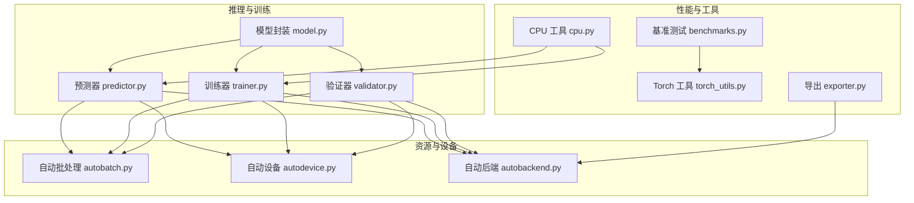
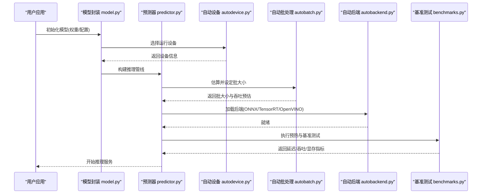
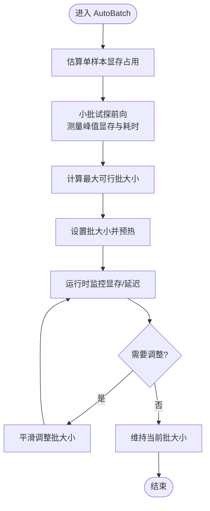
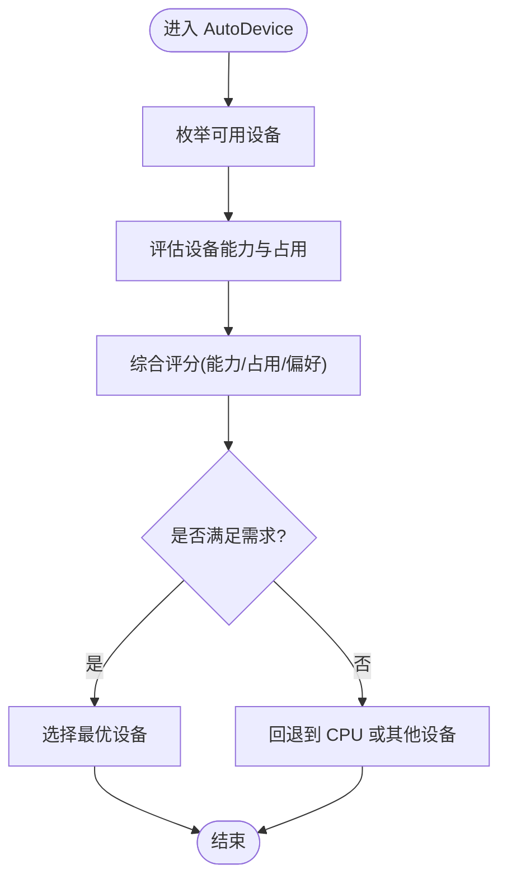
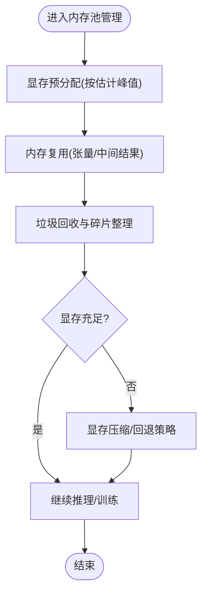
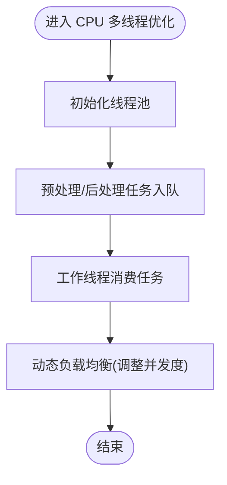
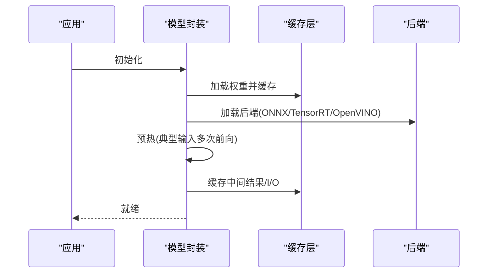
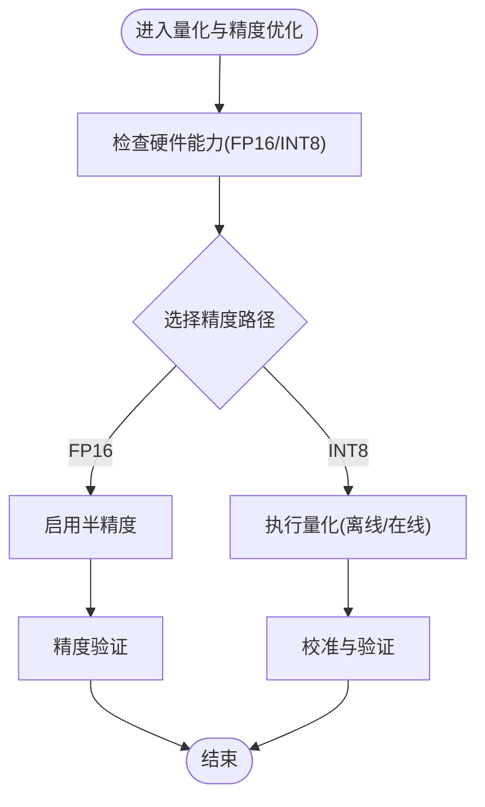
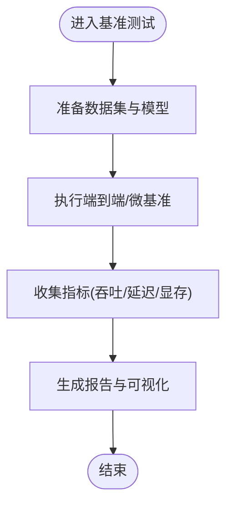
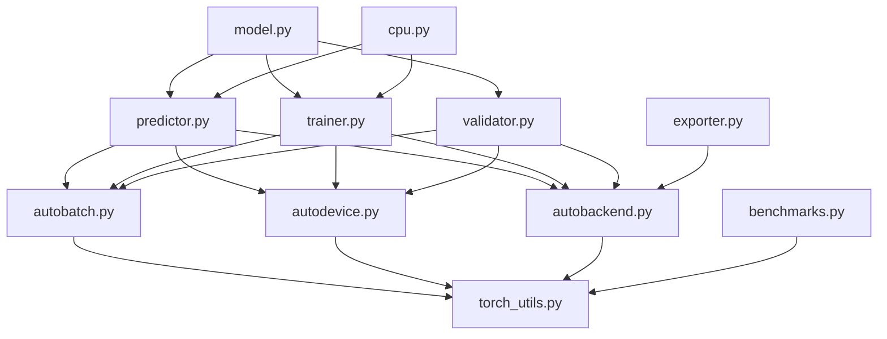

# 性能优化与资源管理

<cite>
**本文引用的文件**
- [autobatch.py](file://ultralytics/utils/autobatch.py)
- [autodevice.py](file://ultralytics/utils/autodevice.py)
- [benchmarks.py](file://ultralytics/utils/benchmarks.py)
- [torch_utils.py](file://ultralytics/utils/torch_utils.py)
- [exporter.py](file://ultralytics/engine/exporter.py)
- [predictor.py](file://ultralytics/engine/predictor.py)
- [trainer.py](file://ultralytics/engine/trainer.py)
- [validator.py](file://ultralytics/engine/validator.py)
- [model.py](file://ultralytics/engine/model.py)
- [autobackend.py](file://ultralytics/nn/autobackend.py)
- [cpu.py](file://ultralytics/utils/cpu.py)
- [test_autobackend_warmup.py](file://tests/test_autobackend_warmup.py)
</cite>

## 目录
1. [简介](#简介)
2. [项目结构](#项目结构)
3. [核心组件](#核心组件)
4. [架构总览](#架构总览)
5. [详细组件分析](#详细组件分析)
6. [依赖关系分析](#依赖关系分析)
7. [性能考量](#性能考量)
8. [故障排查指南](#故障排查指南)
9. [结论](#结论)
10. [附录](#附录)

## 简介
本技术文档聚焦于 YOLO-Master 的性能优化与资源管理系统，围绕以下关键主题展开：
- 自动批处理（AutoBatch）的动态调整机制：内存监控、批大小优化与吞吐量最大化策略。
- 自动设备选择（AutoDevice）的智能决策逻辑：硬件能力评估、显存占用分析与最优设备选择。
- GPU 内存池管理机制：显存预分配、内存复用与碎片整理。
- CPU 多线程优化策略：线程池管理、任务分发与负载均衡。
- 模型预热与缓存机制：权重缓存、中间结果缓存与 I/O 缓存。
- 量化与精度优化选项：FP16、INT8 量化的选择与配置。
- 性能基准测试工具的使用方法与指标解读。
- 内存泄漏检测与性能瓶颈诊断工具。

## 项目结构
与性能优化和资源管理相关的核心代码主要分布在以下模块：
- 自动批处理与设备选择：ultralytics/utils/autobatch.py、ultralytics/utils/autodevice.py
- 推理与训练引擎：ultralytics/engine/predictor.py、ultralytics/engine/trainer.py、ultralytics/engine/validator.py、ultralytics/engine/model.py
- 后端适配与导出：ultralytics/nn/autobackend.py、ultralytics/engine/exporter.py
- 性能基准与工具：ultralytics/utils/benchmarks.py、ultralytics/utils/torch_utils.py、ultralytics/utils/cpu.py
- 相关测试用例：tests/test_autobackend_warmup.py

图表来源
- [predictor.py](file://ultralytics/engine/predictor.py)
- [trainer.py](file://ultralytics/engine/trainer.py)
- [validator.py](file://ultralytics/engine/validator.py)
- [model.py](file://ultralytics/engine/model.py)
- [autobatch.py](file://ultralytics/utils/autobatch.py)
- [autodevice.py](file://ultralytics/utils/autodevice.py)
- [autobackend.py](file://ultralytics/nn/autobackend.py)
- [benchmarks.py](file://ultralytics/utils/benchmarks.py)
- [torch_utils.py](file://ultralytics/utils/torch_utils.py)
- [cpu.py](file://ultralytics/utils/cpu.py)
- [exporter.py](file://ultralytics/engine/exporter.py)

章节来源
- [autobatch.py](file://ultralytics/utils/autobatch.py)
- [autodevice.py](file://ultralytics/utils/autodevice.py)
- [benchmarks.py](file://ultralytics/utils/benchmarks.py)
- [torch_utils.py](file://ultralytics/utils/torch_utils.py)
- [exporter.py](file://ultralytics/engine/exporter.py)
- [predictor.py](file://ultralytics/engine/predictor.py)
- [trainer.py](file://ultralytics/engine/trainer.py)
- [validator.py](file://ultralytics/engine/validator.py)
- [model.py](file://ultralytics/engine/model.py)
- [autobackend.py](file://ultralytics/nn/autobackend.py)
- [cpu.py](file://ultralytics/utils/cpu.py)
- [test_autobackend_warmup.py](file://tests/test_autobackend_warmup.py)

## 核心组件
本节对 AutoBatch、AutoDevice、GPU 内存池、CPU 多线程、模型预热与缓存、量化与精度优化、基准测试与诊断等核心组件进行系统性说明。

- 自动批处理（AutoBatch）
  - 目标：在给定硬件约束下动态调整批大小，以最大化吞吐并避免 OOM。
  - 机制要点：
    - 基于模型规模与输入尺寸估算每样本显存占用。
    - 通过试探性前向或轻量级探测获取实际显存峰值。
    - 根据可用显存上限与目标安全余量计算最大可行批大小。
    - 支持运行时自适应：当检测到显存压力时逐步降批，空闲时逐步升批。
  - 输出：为当前会话提供稳定的 batch_size 与预估吞吐。

- 自动设备选择（AutoDevice）
  - 目标：在多设备环境下智能选择最佳运行设备（CPU/CUDA/ROCm/MPS 等）。
  - 机制要点：
    - 枚举可用设备并查询能力（如 CUDA 版本、驱动、显存容量、MPS 可用性）。
    - 评估各设备的内存占用与历史稳定性，结合用户偏好与约束条件打分。
    - 选择得分最高的设备作为默认运行设备；若显存不足则回退到 CPU。
  - 输出：确定的 device 对象及可选的并行策略提示。

- GPU 内存池管理
  - 目标：减少频繁分配/释放带来的开销与碎片化。
  - 机制要点：
    - 显存预分配：在首次使用前按估计峰值预留一定比例显存。
    - 内存复用：重用张量缓冲区与中间结果，降低分配次数。
    - 碎片整理：周期性清理未引用张量，必要时触发显存压缩或重启后端。
  - 注意：不同后端（CUDA/TensorRT/OpenVINO）实现细节存在差异。

- CPU 多线程优化
  - 目标：提升数据预处理与后处理的并行度，平衡主线程负载。
  - 机制要点：
    - 使用线程池管理预处理/后处理任务，避免频繁创建销毁线程。
    - 任务分发采用队列+工作线程模式，控制并发度以避免上下文切换开销。
    - 负载均衡依据任务耗时统计动态调整 worker 数量。

- 模型预热与缓存
  - 目标：消除冷启动抖动，稳定首帧延迟与吞吐。
  - 机制要点：
    - 权重缓存：加载后的权重常驻内存，避免重复 IO。
    - 中间结果缓存：对固定形状输入可缓存部分中间激活（需权衡显存）。
    - I/O 缓存：图像解码、缩放、归一化结果缓存，减少重复计算。
    - 预热流程：以典型输入执行若干次前向，使 JIT/编译器/后端完成优化。

- 量化与精度优化
  - FP16：在支持的设备上启用半精度以降低带宽与显存占用，提高吞吐。
  - INT8：通过离线或在线量化进一步压缩模型与加速推理，需校准集保证精度。
  - 选择策略：根据硬件能力、精度要求与部署目标决定精度路径。

- 基准测试与诊断
  - 基准：端到端吞吐、延迟分布、显存峰值、CPU/GPU 利用率。
  - 诊断：火焰图、事件追踪、显存快照、梯度/激活统计。

章节来源
- [autobatch.py](file://ultralytics/utils/autobatch.py)
- [autodevice.py](file://ultralytics/utils/autodevice.py)
- [autobackend.py](file://ultralytics/nn/autobackend.py)
- [benchmarks.py](file://ultralytics/utils/benchmarks.py)
- [torch_utils.py](file://ultralytics/utils/torch_utils.py)
- [cpu.py](file://ultralytics/utils/cpu.py)
- [predictor.py](file://ultralytics/engine/predictor.py)
- [trainer.py](file://ultralytics/engine/trainer.py)
- [validator.py](file://ultralytics/engine/validator.py)
- [model.py](file://ultralytics/engine/model.py)
- [exporter.py](file://ultralytics/engine/exporter.py)
- [test_autobackend_warmup.py](file://tests/test_autobackend_warmup.py)

## 架构总览
下图展示了从高层入口到具体优化组件的调用关系与数据流。

图表来源
- [model.py](file://ultralytics/engine/model.py)
- [predictor.py](file://ultralytics/engine/predictor.py)
- [autodevice.py](file://ultralytics/utils/autodevice.py)
- [autobatch.py](file://ultralytics/utils/autobatch.py)
- [autobackend.py](file://ultralytics/nn/autobackend.py)
- [benchmarks.py](file://ultralytics/utils/benchmarks.py)

## 详细组件分析

### 自动批处理（AutoBatch）动态调整机制
- 设计目标
  - 在有限显存下最大化吞吐，同时保持低延迟与稳定性。
- 关键流程
  - 初始估算：基于模型参数量、输入分辨率与通道数估算单样本显存。
  - 试探探测：以小批样本执行前向，测量峰值显存与实际耗时。
  - 批大小计算：根据可用显存与安全余量推导最大可行批大小。
  - 动态调整：运行时监控显存与延迟，向上/向下平滑调整批大小。
- 复杂度与性能
  - 估算阶段近似 O(1)，探测阶段与批大小线性相关。
  - 动态调整引入少量调度开销，但能显著提升整体吞吐。
- 错误处理
  - OOM 保护：超过阈值立即降批并记录告警。
  - 回退策略：若无法达到目标吞吐，回退至较小批或 CPU。

图表来源
- [autobatch.py](file://ultralytics/utils/autobatch.py)

章节来源
- [autobatch.py](file://ultralytics/utils/autobatch.py)

### 自动设备选择（AutoDevice）智能决策逻辑
- 设计目标
  - 在多设备环境中选择最合适的运行设备，兼顾性能与稳定性。
- 关键流程
  - 设备枚举：扫描 CPU、CUDA、ROCm、MPS 等设备。
  - 能力评估：检查驱动版本、算力级别、显存容量、后端支持。
  - 占用分析：读取当前显存占用与进程竞争情况。
  - 评分与选择：结合用户偏好（如强制 GPU）、硬件能力与占用情况打分，选择最优设备。
  - 回退策略：若显存不足或后端不可用，回退到 CPU。
- 复杂度与性能
  - 设备枚举与能力查询为 O(N)（N 为设备数），总体开销极低。
- 错误处理
  - 设备不可用时给出明确错误信息与回退建议。

图表来源
- [autodevice.py](file://ultralytics/utils/autodevice.py)

章节来源
- [autodevice.py](file://ultralytics/utils/autodevice.py)

### GPU 内存池管理机制
- 设计目标
  - 降低分配/释放开销，减少碎片，提升吞吐与稳定性。
- 关键流程
  - 预分配：在首次使用前按估计峰值预留显存。
  - 复用：重用张量缓冲区与中间结果，避免频繁分配。
  - 碎片整理：定期清理未引用张量，必要时触发后端压缩或重启。
- 复杂度与性能
  - 预分配与复用在大多数场景下显著降低分配次数。
  - 碎片整理可能带来短暂停顿，应谨慎调度。
- 错误处理
  - 显存不足时尝试回收与降级，失败则抛出清晰错误。

图表来源
- [autobackend.py](file://ultralytics/nn/autobackend.py)
- [torch_utils.py](file://ultralytics/utils/torch_utils.py)

章节来源
- [autobackend.py](file://ultralytics/nn/autobackend.py)
- [torch_utils.py](file://ultralytics/utils/torch_utils.py)

### CPU 多线程优化策略
- 设计目标
  - 提升数据预处理与后处理的并行度，避免阻塞主线程。
- 关键流程
  - 线程池：维护固定数量的工作线程，避免频繁创建销毁。
  - 任务分发：将预处理/后处理任务放入队列，由工作线程消费。
  - 负载均衡：根据任务耗时统计动态调整并发度。
- 复杂度与性能
  - 线程池开销恒定，任务分发为 O(1)。
  - 合理并发度可显著提升吞吐，过高会导致上下文切换开销。
- 错误处理
  - 任务异常捕获与重试，避免影响整体流水线。

图表来源
- [cpu.py](file://ultralytics/utils/cpu.py)

章节来源
- [cpu.py](file://ultralytics/utils/cpu.py)

### 模型预热与缓存机制
- 设计目标
  - 消除冷启动抖动，稳定首帧延迟与吞吐。
- 关键流程
  - 权重缓存：加载后的权重常驻内存，避免重复 IO。
  - 中间结果缓存：对固定形状输入缓存部分中间激活（需权衡显存）。
  - I/O 缓存：图像解码、缩放、归一化结果缓存。
  - 预热流程：以典型输入执行若干次前向，使 JIT/编译器/后端完成优化。
- 复杂度与性能
  - 预热阶段有额外开销，但长期收益显著。
  - 缓存命中率高时可大幅降低延迟。
- 错误处理
  - 缓存失效或冲突时重建缓存，确保一致性。

图表来源
- [predictor.py](file://ultralytics/engine/predictor.py)
- [autobackend.py](file://ultralytics/nn/autobackend.py)
- [test_autobackend_warmup.py](file://tests/test_autobackend_warmup.py)

章节来源
- [predictor.py](file://ultralytics/engine/predictor.py)
- [autobackend.py](file://ultralytics/nn/autobackend.py)
- [test_autobackend_warmup.py](file://tests/test_autobackend_warmup.py)

### 量化与精度优化选项
- 设计目标
  - 在精度与性能之间取得平衡，满足不同部署场景。
- 关键流程
  - FP16：在支持设备上启用半精度，降低带宽与显存占用。
  - INT8：离线或在线量化，需校准集保证精度。
  - 选择策略：根据硬件能力、精度要求与部署目标决定精度路径。
- 复杂度与性能
  - FP16 通常带来吞吐提升与显存下降。
  - INT8 进一步压缩模型与加速推理，但需校准与验证。
- 错误处理
  - 精度不达标时回退到更高精度或禁用量化。

图表来源
- [exporter.py](file://ultralytics/engine/exporter.py)
- [autobackend.py](file://ultralytics/nn/autobackend.py)

章节来源
- [exporter.py](file://ultralytics/engine/exporter.py)
- [autobackend.py](file://ultralytics/nn/autobackend.py)

### 性能基准测试工具使用方法与指标解读
- 使用方法
  - 端到端基准：覆盖数据加载、预处理、推理、后处理全流程。
  - 微基准：针对特定算子或模块进行延迟与吞吐测量。
  - 多设备对比：在不同设备与后端间比较性能。
- 指标解读
  - 吞吐（FPS）：单位时间内处理的样本数。
  - 延迟（ms）：单次推理的平均/分位延迟。
  - 显存峰值：推理过程中的最大显存占用。
  - CPU/GPU 利用率：反映资源利用效率。
- 输出与可视化
  - 结构化报告：JSON/CSV 格式便于自动化分析。
  - 趋势图：随时间变化的吞吐与延迟曲线。

图表来源
- [benchmarks.py](file://ultralytics/utils/benchmarks.py)

章节来源
- [benchmarks.py](file://ultralytics/utils/benchmarks.py)

## 依赖关系分析
下图展示了核心组件之间的依赖关系与耦合程度。

图表来源
- [autobatch.py](file://ultralytics/utils/autobatch.py)
- [autodevice.py](file://ultralytics/utils/autodevice.py)
- [autobackend.py](file://ultralytics/nn/autobackend.py)
- [torch_utils.py](file://ultralytics/utils/torch_utils.py)
- [predictor.py](file://ultralytics/engine/predictor.py)
- [trainer.py](file://ultralytics/engine/trainer.py)
- [validator.py](file://ultralytics/engine/validator.py)
- [model.py](file://ultralytics/engine/model.py)
- [benchmarks.py](file://ultralytics/utils/benchmarks.py)
- [exporter.py](file://ultralytics/engine/exporter.py)
- [cpu.py](file://ultralytics/utils/cpu.py)

章节来源
- [autobatch.py](file://ultralytics/utils/autobatch.py)
- [autodevice.py](file://ultralytics/utils/autodevice.py)
- [autobackend.py](file://ultralytics/nn/autobackend.py)
- [torch_utils.py](file://ultralytics/utils/torch_utils.py)
- [predictor.py](file://ultralytics/engine/predictor.py)
- [trainer.py](file://ultralytics/engine/trainer.py)
- [validator.py](file://ultralytics/engine/validator.py)
- [model.py](file://ultralytics/engine/model.py)
- [benchmarks.py](file://ultralytics/utils/benchmarks.py)
- [exporter.py](file://ultralytics/engine/exporter.py)
- [cpu.py](file://ultralytics/utils/cpu.py)

## 性能考量
- 批大小与延迟的权衡：较大批提升吞吐但增加延迟，需根据业务 SLA 平衡。
- 设备选择与回退：优先 GPU，显存不足时回退 CPU，避免 OOM。
- 内存池与碎片：合理预分配与定期整理，避免长时间运行导致的碎片累积。
- 多线程与上下文切换：适度并发，避免过多线程导致切换开销。
- 预热与缓存：预热阶段有额外开销，但长期收益显著；缓存需权衡显存占用。
- 量化与精度：FP16 普遍受益，INT8 需严格校准与验证。

## 故障排查指南
- 常见问题
  - OOM：检查批大小、显存预分配与缓存策略。
  - 设备不可用：确认驱动与后端安装，检查设备枚举与回退逻辑。
  - 吞吐不稳定：观察动态批调整与线程池并发度。
  - 精度下降：检查量化校准集与精度回退策略。
- 诊断工具
  - 基准测试：定位瓶颈模块与设备利用率。
  - 事件追踪：分析调用链与热点函数。
  - 显存快照：识别未释放张量与潜在泄漏。
- 调试步骤
  - 逐步缩小范围：从端到端到模块级，定位问题。
  - 日志与指标：开启详细日志，采集关键指标。
  - 回归验证：修复后进行回归测试，确保稳定性。

章节来源
- [benchmarks.py](file://ultralytics/utils/benchmarks.py)
- [torch_utils.py](file://ultralytics/utils/torch_utils.py)
- [autobackend.py](file://ultralytics/nn/autobackend.py)
- [test_autobackend_warmup.py](file://tests/test_autobackend_warmup.py)

## 结论
YOLO-Master 的性能优化与资源管理系统通过 AutoBatch、AutoDevice、GPU 内存池、CPU 多线程、模型预热与缓存、量化与精度优化以及基准测试与诊断工具，构建了完整的性能调优闭环。在实际部署中，建议结合业务需求与硬件环境，合理配置各项参数，并通过持续监控与回归测试确保系统稳定性与高效性。

## 附录
- 术语表
  - AutoBatch：自动批处理，动态调整批大小以优化吞吐。
  - AutoDevice：自动设备选择，智能选择最优运行设备。
  - 内存池：用于减少分配/释放开销的显存管理机制。
  - 预热：在正式推理前执行若干次前向以稳定性能。
  - 量化：将模型权重或激活转换为更低精度以提升性能。
- 参考链接
  - 相关源码文件路径见“本文引用的文件”列表。