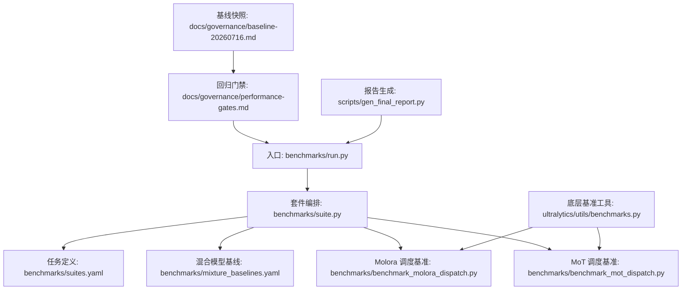
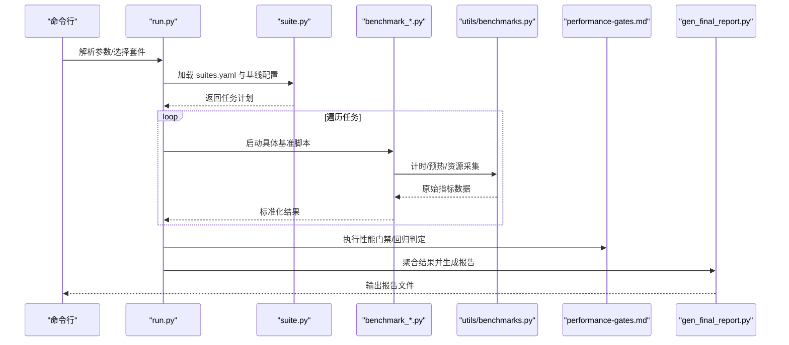
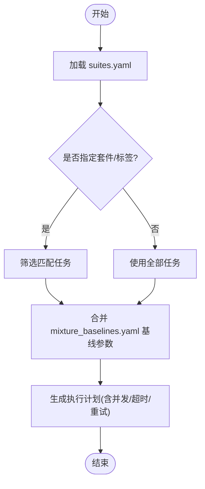
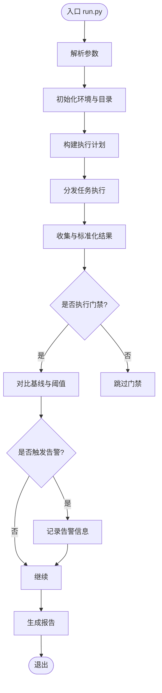
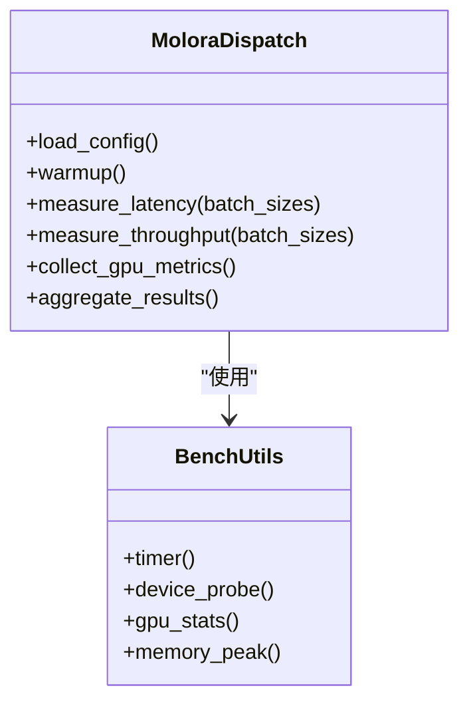
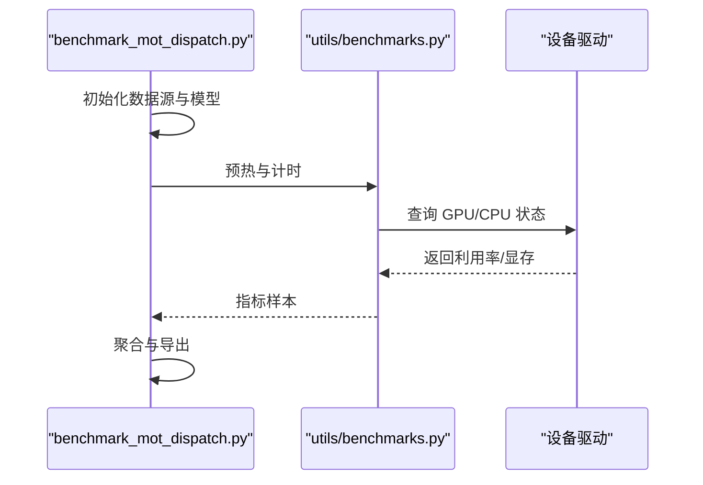
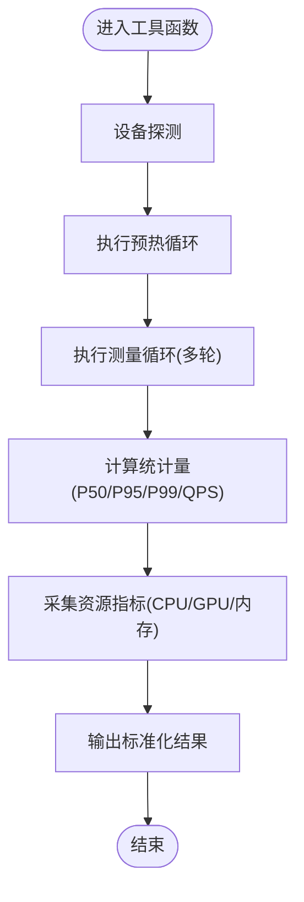
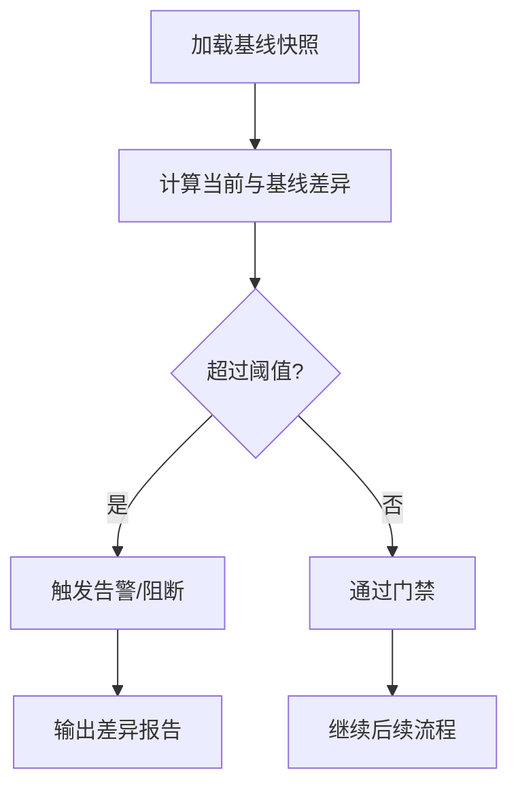
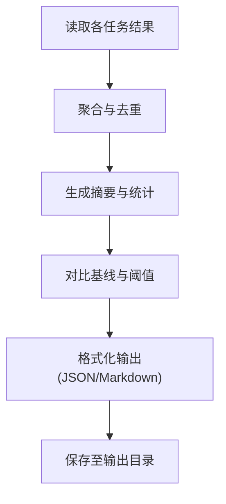
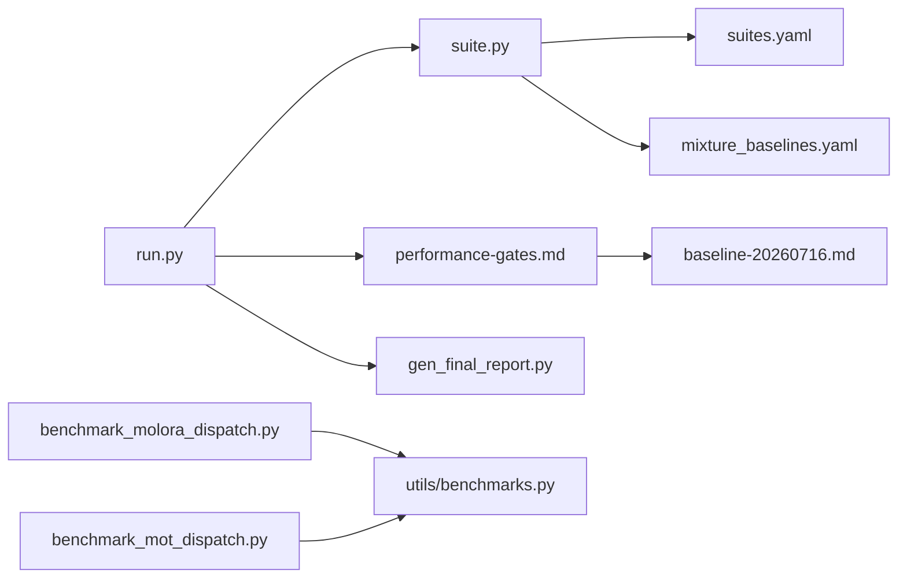

# 性能基准测试

<cite>
**本文引用的文件**
- [benchmarks/run.py](file://benchmarks/run.py)
- [benchmarks/suite.py](file://benchmarks/suite.py)
- [benchmarks/benchmark_molora_dispatch.py](file://benchmarks/benchmark_molora_dispatch.py)
- [benchmarks/benchmark_mot_dispatch.py](file://benchmarks/benchmark_mot_dispatch.py)
- [benchmarks/mixture_baselines.yaml](file://benchmarks/mixture_baselines.yaml)
- [benchmarks/suites.yaml](file://benchmarks/suites.yaml)
- [ultralytics/utils/benchmarks.py](file://ultralytics/utils/benchmarks.py)
- [tests/test_benchmark_suite.py](file://tests/test_benchmark_suite.py)
- [docs/governance/performance-gates.md](file://docs/governance/performance-gates.md)
- [docs/governance/baseline-20260716.md](file://docs/governance/baseline-20260716.md)
- [scripts/gen_final_report.py](file://scripts/gen_final_report.py)
</cite>

## 目录
1. [简介](#简介)
2. [项目结构](#项目结构)
3. [核心组件](#核心组件)
4. [架构总览](#架构总览)
5. [详细组件分析](#详细组件分析)
6. [依赖关系分析](#依赖关系分析)
7. [性能考量](#性能考量)
8. [故障排查指南](#故障排查指南)
9. [结论](#结论)
10. [附录](#附录)

## 简介
本技术文档面向 YOLO-Master 的性能基准测试系统，聚焦 Benchmark 模块的测试框架设计、执行引擎与结果聚合机制。文档覆盖以下关键主题：
- 测试用例定义、执行引擎与结果聚合
- 多种性能指标测量方法（推理延迟、吞吐量、内存占用、GPU 利用率）
- 自动化基准测试流程（环境准备、批量执行、报告生成）
- 性能回归检测（基线对比、趋势分析、告警机制）
- 分布式基准测试支持（多节点测试、结果同步、一致性验证）
- 自定义基准测试开发与最佳实践
- 不同硬件平台的优化建议与调优参数

## 项目结构
Benchmark 相关代码主要位于 benchmarks 目录，配套工具与治理文档分布于 ultralytics/utils、tests、docs/governance 与 scripts 等位置。整体组织遵循“配置驱动 + 套件化 + 可插拔”的设计思路：通过 YAML 描述套件与任务，suite 层负责解析与编排，run 层作为入口协调执行与输出；具体场景的基准脚本以独立模块形式提供，便于扩展与维护。

图表来源
- [benchmarks/run.py](file://benchmarks/run.py)
- [benchmarks/suite.py](file://benchmarks/suite.py)
- [benchmarks/suites.yaml](file://benchmarks/suites.yaml)
- [benchmarks/mixture_baselines.yaml](file://benchmarks/mixture_baselines.yaml)
- [benchmarks/benchmark_molora_dispatch.py](file://benchmarks/benchmark_molora_dispatch.py)
- [benchmarks/benchmark_mot_dispatch.py](file://benchmarks/benchmark_mot_dispatch.py)
- [ultralytics/utils/benchmarks.py](file://ultralytics/utils/benchmarks.py)
- [docs/governance/performance-gates.md](file://docs/governance/performance-gates.md)
- [docs/governance/baseline-20260716.md](file://docs/governance/baseline-20260716.md)
- [scripts/gen_final_report.py](file://scripts/gen_final_report.py)

章节来源
- [benchmarks/run.py](file://benchmarks/run.py)
- [benchmarks/suite.py](file://benchmarks/suite.py)
- [benchmarks/suites.yaml](file://benchmarks/suites.yaml)
- [benchmarks/mixture_baselines.yaml](file://benchmarks/mixture_baselines.yaml)
- [benchmarks/benchmark_molora_dispatch.py](file://benchmarks/benchmark_molora_dispatch.py)
- [benchmarks/benchmark_mot_dispatch.py](file://benchmarks/benchmark_mot_dispatch.py)
- [ultralytics/utils/benchmarks.py](file://ultralytics/utils/benchmarks.py)
- [docs/governance/performance-gates.md](file://docs/governance/performance-gates.md)
- [docs/governance/baseline-20260716.md](file://docs/governance/baseline-20260716.md)
- [scripts/gen_final_report.py](file://scripts/gen_final_report.py)

## 核心组件
- 套件编排器（suite.py）
  - 职责：加载 suites.yaml 与 mixture_baselines.yaml，解析任务清单、参数与环境约束，构建可执行的测试计划。
  - 关键点：支持按套件/标签过滤、并行度控制、失败策略与重试策略。
- 运行入口（run.py）
  - 职责：命令行参数解析、环境初始化、调度 suite 编排器、汇总结果并触发报告生成。
  - 关键点：集成性能门禁检查与基线对比，统一日志与产物输出路径。
- 场景基准脚本
  - Molora 调度基准（benchmark_molora_dispatch.py）：针对 MoE/MoA 路由与专家负载的吞吐/延迟评估。
  - MoT 调度基准（benchmark_mot_dispatch.py）：针对多目标跟踪任务的端到端延迟与吞吐评估。
- 底层基准工具（ultralytics/utils/benchmarks.py）
  - 职责：封装通用计时、预热、批大小扫描、设备探测、资源采集（CPU/GPU/内存）等能力。
- 治理与门禁（performance-gates.md, baseline-20260716.md）
  - 职责：定义性能阈值、回归判定规则与告警策略，维护历史基线快照用于对比。
- 报告生成（gen_final_report.py）
  - 职责：聚合各任务结果，生成结构化报告（JSON/Markdown），支撑可视化与归档。

章节来源
- [benchmarks/suite.py](file://benchmarks/suite.py)
- [benchmarks/run.py](file://benchmarks/run.py)
- [benchmarks/benchmark_molora_dispatch.py](file://benchmarks/benchmark_molora_dispatch.py)
- [benchmarks/benchmark_mot_dispatch.py](file://benchmarks/benchmark_mot_dispatch.py)
- [ultralytics/utils/benchmarks.py](file://ultralytics/utils/benchmarks.py)
- [docs/governance/performance-gates.md](file://docs/governance/performance-gates.md)
- [docs/governance/baseline-20260716.md](file://docs/governance/baseline-20260716.md)
- [scripts/gen_final_report.py](file://scripts/gen_final_report.py)

## 架构总览
下图展示了从入口到具体任务执行的调用链路与数据流，包括套件解析、任务分发、指标采集与结果汇聚。

图表来源
- [benchmarks/run.py](file://benchmarks/run.py)
- [benchmarks/suite.py](file://benchmarks/suite.py)
- [benchmarks/benchmark_molora_dispatch.py](file://benchmarks/benchmark_molora_dispatch.py)
- [benchmarks/benchmark_mot_dispatch.py](file://benchmarks/benchmark_mot_dispatch.py)
- [ultralytics/utils/benchmarks.py](file://ultralytics/utils/benchmarks.py)
- [docs/governance/performance-gates.md](file://docs/governance/performance-gates.md)
- [scripts/gen_final_report.py](file://scripts/gen_final_report.py)

## 详细组件分析

### 套件与任务定义（suites.yaml 与 mixture_baselines.yaml）
- suites.yaml
  - 定义套件集合、任务名、参数模板、设备要求、并发度、超时与重试策略。
  - 支持按标签筛选、条件启用/禁用、环境变量注入。
- mixture_baselines.yaml
  - 集中管理混合模型（如 MoE/MoA）的基线权重、路由策略与专家规模等关键参数，供基准脚本读取。

图表来源
- [benchmarks/suites.yaml](file://benchmarks/suites.yaml)
- [benchmarks/mixture_baselines.yaml](file://benchmarks/mixture_baselines.yaml)
- [benchmarks/suite.py](file://benchmarks/suite.py)

章节来源
- [benchmarks/suites.yaml](file://benchmarks/suites.yaml)
- [benchmarks/mixture_baselines.yaml](file://benchmarks/mixture_baselines.yaml)
- [benchmarks/suite.py](file://benchmarks/suite.py)

### 运行入口与执行引擎（run.py）
- 功能要点
  - 解析命令行参数（套件、设备、并发、输出目录、是否开启门禁）。
  - 初始化日志与临时目录，确保幂等与可重复性。
  - 调用 suite 编排器获取任务计划，按策略分发执行。
  - 收集每个任务的原始指标，进行标准化与校验。
  - 触发性能门禁与基线对比，必要时记录告警。
  - 调用报告生成器产出最终报告。
- 错误处理
  - 对单个任务失败采用隔离策略，不影响其他任务。
  - 支持重试与回退策略，避免偶发性抖动影响整体结果。

图表来源
- [benchmarks/run.py](file://benchmarks/run.py)
- [docs/governance/performance-gates.md](file://docs/governance/performance-gates.md)
- [scripts/gen_final_report.py](file://scripts/gen_final_report.py)

章节来源
- [benchmarks/run.py](file://benchmarks/run.py)
- [docs/governance/performance-gates.md](file://docs/governance/performance-gates.md)
- [scripts/gen_final_report.py](file://scripts/gen_final_report.py)

### 场景基准脚本：Molora 调度（benchmark_molora_dispatch.py）
- 关注点
  - 路由与专家负载的吞吐/延迟分布、负载均衡度、热点专家识别。
  - 在典型数据集与批大小下的稳定性与抖动。
- 指标采集
  - 使用底层工具进行多轮预热与统计，计算 P50/P95/P99 延迟、QPS、GPU 显存峰值、GPU 利用率均值与方差。
- 结果输出
  - 输出结构化 JSON，包含任务元数据、设备信息、参数组合与指标摘要。

图表来源
- [benchmarks/benchmark_molora_dispatch.py](file://benchmarks/benchmark_molora_dispatch.py)
- [ultralytics/utils/benchmarks.py](file://ultralytics/utils/benchmarks.py)

章节来源
- [benchmarks/benchmark_molora_dispatch.py](file://benchmarks/benchmark_molora_dispatch.py)
- [ultralytics/utils/benchmarks.py](file://ultralytics/utils/benchmarks.py)

### 场景基准脚本：MoT 调度（benchmark_mot_dispatch.py）
- 关注点
  - 多目标跟踪端到端延迟、帧率、轨迹质量与资源占用。
  - 在不同分辨率、帧率与对象密度下的鲁棒性。
- 指标采集
  - 视频流或图像序列输入，统计每帧处理时间、队列积压、GPU/CPU 占用。
- 结果输出
  - 与 Molora 一致的 JSON 结构，便于横向对比与聚合。

图表来源
- [benchmarks/benchmark_mot_dispatch.py](file://benchmarks/benchmark_mot_dispatch.py)
- [ultralytics/utils/benchmarks.py](file://ultralytics/utils/benchmarks.py)

章节来源
- [benchmarks/benchmark_mot_dispatch.py](file://benchmarks/benchmark_mot_dispatch.py)
- [ultralytics/utils/benchmarks.py](file://ultralytics/utils/benchmarks.py)

### 底层基准工具（ultralytics/utils/benchmarks.py）
- 能力概述
  - 计时器与预热：支持多次预热、剔除冷启动异常值。
  - 设备探测：自动选择 CPU/GPU，检测可用设备数量与类型。
  - 资源采集：CPU 利用率、GPU 利用率、显存峰值、内存占用。
  - 批大小扫描：自动搜索最优批大小，兼顾吞吐与延迟目标。
- 复杂度与性能
  - 采样次数与预热轮次可调，平衡精度与耗时。
  - 资源采集采用非阻塞方式，降低对主流程的影响。

图表来源
- [ultralytics/utils/benchmarks.py](file://ultralytics/utils/benchmarks.py)

章节来源
- [ultralytics/utils/benchmarks.py](file://ultralytics/utils/benchmarks.py)

### 性能回归检测与门禁（performance-gates.md 与 baseline-20260716.md）
- 基线管理
  - 维护历史基线快照，包含关键指标与设备信息，用于版本间对比。
- 回归判定
  - 基于阈值与相对变化比例进行判断，支持按任务/套件维度设置不同门槛。
- 告警机制
  - 当检测到显著退化时，记录告警并阻断流水线（可选），同时输出差异详情。

图表来源
- [docs/governance/performance-gates.md](file://docs/governance/performance-gates.md)
- [docs/governance/baseline-20260716.md](file://docs/governance/baseline-20260716.md)

章节来源
- [docs/governance/performance-gates.md](file://docs/governance/performance-gates.md)
- [docs/governance/baseline-20260716.md](file://docs/governance/baseline-20260716.md)

### 报告生成（gen_final_report.py）
- 功能要点
  - 聚合各任务结果，生成结构化报告（JSON/Markdown）。
  - 包含任务元数据、指标摘要、差异分析与告警信息。
  - 支持按套件/设备/日期维度归档，便于趋势分析。

图表来源
- [scripts/gen_final_report.py](file://scripts/gen_final_report.py)

章节来源
- [scripts/gen_final_report.py](file://scripts/gen_final_report.py)

### 单元测试与契约验证（test_benchmark_suite.py）
- 作用
  - 验证套件解析、任务执行与结果聚合的正确性与健壮性。
  - 覆盖边界条件（空套件、缺失参数、设备不可用等）。
- 建议
  - 新增任务或变更套件格式时，补充对应用例，确保契约稳定。

章节来源
- [tests/test_benchmark_suite.py](file://tests/test_benchmark_suite.py)

## 依赖关系分析
- 内部依赖
  - run.py 依赖 suite.py 进行任务编排，suite.py 依赖 suites.yaml 与 mixture_baselines.yaml。
  - 场景基准脚本依赖 ultralytics/utils/benchmarks.py 提供的通用能力。
  - run.py 与 performance-gates.md、baseline-20260716.md 协作完成回归检测。
  - run.py 调用 gen_final_report.py 生成报告。
- 外部依赖
  - 设备驱动与系统监控接口（CPU/GPU/内存）。
  - 可能的第三方库（如 PyTorch、NVIDIA 工具链）由底层工具间接使用。

图表来源
- [benchmarks/run.py](file://benchmarks/run.py)
- [benchmarks/suite.py](file://benchmarks/suite.py)
- [benchmarks/suites.yaml](file://benchmarks/suites.yaml)
- [benchmarks/mixture_baselines.yaml](file://benchmarks/mixture_baselines.yaml)
- [benchmarks/benchmark_molora_dispatch.py](file://benchmarks/benchmark_molora_dispatch.py)
- [benchmarks/benchmark_mot_dispatch.py](file://benchmarks/benchmark_mot_dispatch.py)
- [ultralytics/utils/benchmarks.py](file://ultralytics/utils/benchmarks.py)
- [docs/governance/performance-gates.md](file://docs/governance/performance-gates.md)
- [docs/governance/baseline-20260716.md](file://docs/governance/baseline-20260716.md)
- [scripts/gen_final_report.py](file://scripts/gen_final_report.py)

章节来源
- [benchmarks/run.py](file://benchmarks/run.py)
- [benchmarks/suite.py](file://benchmarks/suite.py)
- [benchmarks/suites.yaml](file://benchmarks/suites.yaml)
- [benchmarks/mixture_baselines.yaml](file://benchmarks/mixture_baselines.yaml)
- [benchmarks/benchmark_molora_dispatch.py](file://benchmarks/benchmark_molora_dispatch.py)
- [benchmarks/benchmark_mot_dispatch.py](file://benchmarks/benchmark_mot_dispatch.py)
- [ultralytics/utils/benchmarks.py](file://ultralytics/utils/benchmarks.py)
- [docs/governance/performance-gates.md](file://docs/governance/performance-gates.md)
- [docs/governance/baseline-20260716.md](file://docs/governance/baseline-20260716.md)
- [scripts/gen_final_report.py](file://scripts/gen_final_report.py)

## 性能考量
- 指标测量方法
  - 推理延迟：多轮预热后统计 P50/P95/P99，剔除冷启动与 GC 抖动。
  - 吞吐量：固定时长内累计处理样本数，换算为 QPS；支持批大小扫描。
  - 内存占用：记录进程与设备显存的峰值与均值，区分分配与释放阶段。
  - GPU 利用率：采样频率与窗口长度需适配设备特性，避免采样开销过大。
- 稳定性与可重复性
  - 固定随机种子、关闭无关后台进程、锁定设备与电源模式。
  - 多次独立运行取中位数，减少噪声影响。
- 批大小与并发
  - 根据目标延迟/吞吐自动搜索批大小；合理设置并发度以避免资源争用。
- 平台差异
  - CPU：注意 NUMA 与线程亲和性；I/O 瓶颈可能主导端到端延迟。
  - GPU：利用 TensorRT/OpenVINO 等后端优化；关注显存碎片与内核启动开销。
  - 边缘设备：限制并发与批大小，优先保证延迟稳定性。

[本节为通用指导，不直接分析具体文件]

## 故障排查指南
- 常见问题
  - 设备不可用或权限不足：检查 CUDA/驱动版本与用户权限。
  - 结果不稳定：增加预热轮次与采样次数，排除系统干扰。
  - 报告缺失或为空：确认输出目录权限与写入成功。
- 定位步骤
  - 查看任务级日志与中间产物，核对参数与设备信息。
  - 单独运行问题任务，复现并缩小范围。
  - 对比基线快照，定位回归点与差异字段。
- 恢复策略
  - 调整并发与批大小，降低资源压力。
  - 更新驱动/固件或切换后端实现。
  - 重新生成基线快照（仅在确认可接受时）。

章节来源
- [docs/governance/performance-gates.md](file://docs/governance/performance-gates.md)
- [docs/governance/baseline-20260716.md](file://docs/governance/baseline-20260716.md)
- [scripts/gen_final_report.py](file://scripts/gen_final_report.py)

## 结论
YOLO-Master 的基准测试系统以配置驱动为核心，结合套件编排与场景化脚本，实现了可复用、可扩展且可回归检测的性能评估体系。通过统一的指标采集与报告生成，团队能够在多硬件平台上持续追踪性能趋势并及时发现回归。建议在持续集成中常态化运行门禁与报告，形成闭环的质量保障。

[本节为总结性内容，不直接分析具体文件]

## 附录

### 自动化基准测试流程
- 环境准备
  - 安装依赖、准备数据集与模型权重、校验设备可用性。
- 批量执行
  - 通过 run.py 指定套件与并发度，自动分发任务并收集结果。
- 报告生成
  - 自动生成 JSON/Markdown 报告，归档至输出目录，便于追溯与可视化。

章节来源
- [benchmarks/run.py](file://benchmarks/run.py)
- [benchmarks/suite.py](file://benchmarks/suite.py)
- [scripts/gen_final_report.py](file://scripts/gen_final_report.py)

### 性能回归检测与告警
- 基线对比
  - 加载 baseline-20260716.md 中的快照，计算差异。
- 趋势分析
  - 按日期/套件维度聚合，观察长期趋势与异常点。
- 告警机制
  - 超过阈值即触发告警，可选择阻断流水线并通知相关人员。

章节来源
- [docs/governance/performance-gates.md](file://docs/governance/performance-gates.md)
- [docs/governance/baseline-20260716.md](file://docs/governance/baseline-20260716.md)

### 分布式基准测试支持
- 多节点测试
  - 通过 run.py 的参数与套件配置，将任务拆分到多个节点执行。
- 结果同步
  - 各节点输出本地结果，由主控节点聚合与去重。
- 一致性验证
  - 对比跨节点相同任务的指标分布，确保一致性与可复现性。

[本节为概念性说明，未直接映射到具体源码文件]

### 自定义基准测试开发指南
- 步骤
  - 新建 benchmark_xxx.py，继承或复用 utils/benchmarks.py 的能力。
  - 在 suites.yaml 中注册任务与参数模板。
  - 在 run.py 中确保新任务能被正确调度与报告。
- 最佳实践
  - 明确输入输出契约，保持 JSON 结构一致。
  - 提供足够的预热与采样，保证指标稳定。
  - 记录设备与环境信息，便于复现与对比。

章节来源
- [benchmarks/suites.yaml](file://benchmarks/suites.yaml)
- [benchmarks/run.py](file://benchmarks/run.py)
- [ultralytics/utils/benchmarks.py](file://ultralytics/utils/benchmarks.py)

### 不同硬件平台的优化建议与调优参数
- CPU
  - 调整线程数与批大小，避免上下文切换过多。
  - 关闭不必要的服务，减少 I/O 竞争。
- GPU
  - 使用高效后端（如 TensorRT/OpenVINO），开启混合精度。
  - 预分配显存，减少碎片；合理设置并发度。
- 边缘设备
  - 限制并发与批大小，优先保证延迟稳定性。
  - 量化与剪枝以降低资源占用。

[本节为通用指导，不直接分析具体文件]