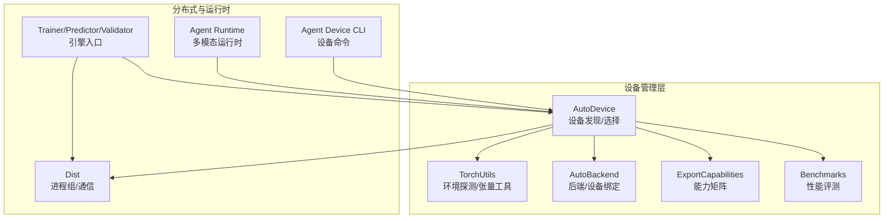
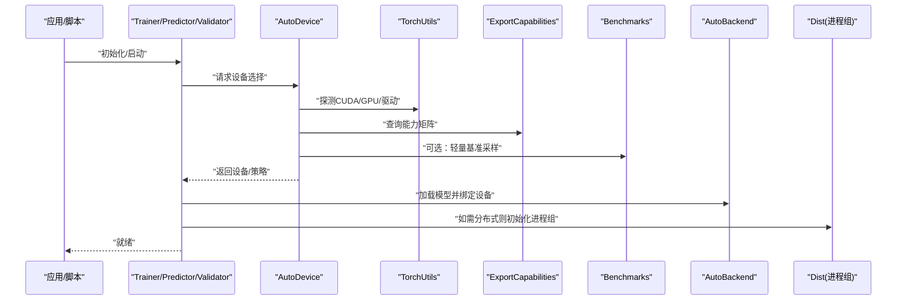
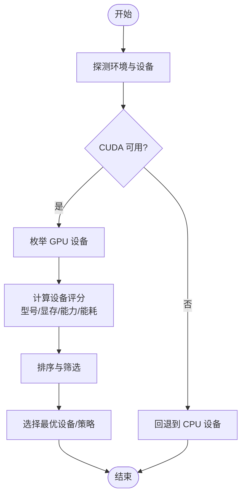
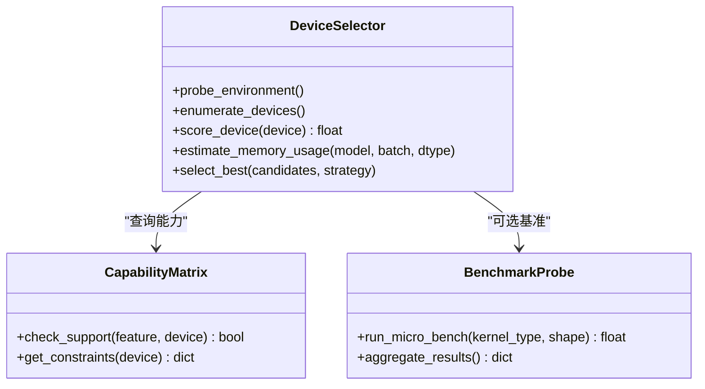
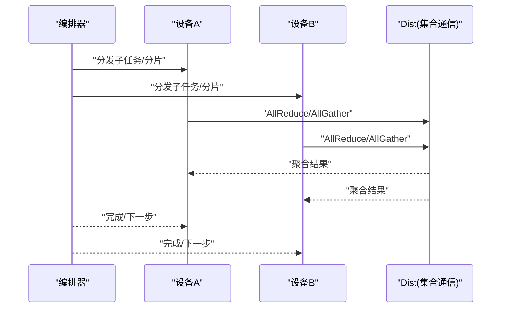
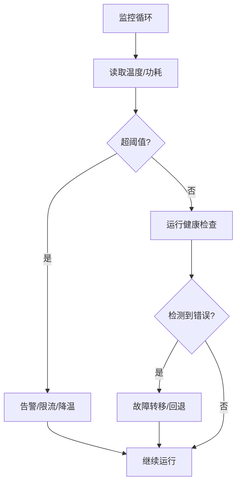
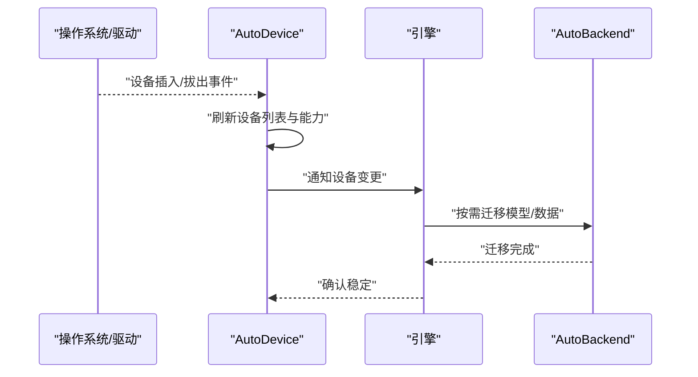
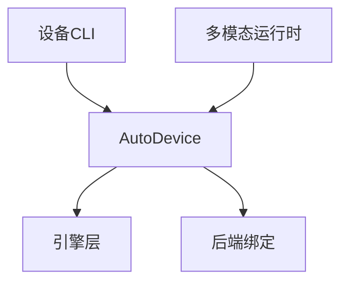
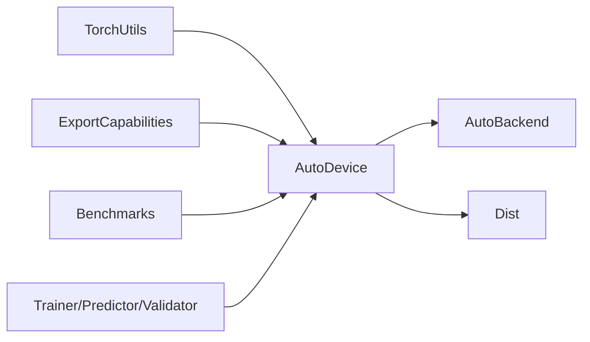

# 智能设备管理

<cite>
**本文引用的文件**
- [autodevice.py](file://ultralytics/utils/autodevice.py)
- [torch_utils.py](file://ultralytics/utils/torch_utils.py)
- [dist.py](file://ultralytics/utils/dist.py)
- [autobackend.py](file://ultralytics/nn/autobackend.py)
- [export_capabilities.py](file://ultralytics/utils/export_capabilities.py)
- [benchmarks.py](file://ultralytics/utils/benchmarks.py)
- [trainer.py](file://ultralytics/engine/trainer.py)
- [predictor.py](file://ultralytics/engine/predictor.py)
- [validator.py](file://ultralytics/engine/validator.py)
- [model.py](file://ultralytics/engine/model.py)
- [runtime.py](file://agent/runtime/multimodal/runtime.py)
- [device.py](file://agent/runtime/cli/device.py)
</cite>

## 目录
1. [简介](#简介)
2. [项目结构](#项目结构)
3. [核心组件](#核心组件)
4. [架构总览](#架构总览)
5. [详细组件分析](#详细组件分析)
6. [依赖关系分析](#依赖关系分析)
7. [性能考虑](#性能考虑)
8. [故障排查指南](#故障排查指南)
9. [结论](#结论)
10. [附录](#附录)

## 简介
本技术文档聚焦于 YOLO-Master 的智能设备管理系统，围绕 AutoDevice 模块的设备发现与能力检测、设备选择算法、多设备协同工作模式、设备状态监控与健康检查、设备切换与热插拔支持，以及不同部署环境的配置与优化建议进行系统化阐述。目标是帮助读者理解系统如何自动识别 GPU/CPU、评估 CUDA 环境、测量显存容量、在单卡或多卡场景下高效调度任务，并在运行期保障稳定性与可恢复性。

## 项目结构
与设备管理相关的核心代码主要分布在以下位置：
- 设备自动选择与探测：ultralytics/utils/autodevice.py
- 底层 Torch 工具与环境探测：ultralytics/utils/torch_utils.py
- 分布式通信与进程组管理：ultralytics/utils/dist.py
- 推理后端自动适配（含设备绑定）：ultralytics/nn/autobackend.py
- 导出能力矩阵与运行时约束：ultralytics/utils/export_capabilities.py
- 基准测试与吞吐/延迟评估：ultralytics/utils/benchmarks.py
- 训练/验证/预测流程中的设备使用点：engine 层各模块
- Agent 侧设备 CLI 与多模态运行时设备协调：agent 子包

图表来源
- [autodevice.py:1-200](file://ultralytics/utils/autodevice.py#L1-L200)
- [torch_utils.py:1-200](file://ultralytics/utils/torch_utils.py#L1-L200)
- [autobackend.py:1-200](file://ultralytics/nn/autobackend.py#L1-L200)
- [export_capabilities.py:1-200](file://ultralytics/utils/export_capabilities.py#L1-L200)
- [benchmarks.py:1-200](file://ultralytics/utils/benchmarks.py#L1-L200)
- [dist.py:1-200](file://ultralytics/utils/dist.py#L1-L200)
- [trainer.py:1-200](file://ultralytics/engine/trainer.py#L1-L200)
- [predictor.py:1-200](file://ultralytics/engine/predictor.py#L1-L200)
- [validator.py:1-200](file://ultralytics/engine/validator.py#L1-L200)
- [runtime.py:1-200](file://agent/runtime/multimodal/runtime.py#L1-L200)
- [device.py:1-200](file://agent/runtime/cli/device.py#L1-L200)

章节来源
- [autodevice.py:1-200](file://ultralytics/utils/autodevice.py#L1-L200)
- [torch_utils.py:1-200](file://ultralytics/utils/torch_utils.py#L1-L200)
- [autobackend.py:1-200](file://ultralytics/nn/autobackend.py#L1-L200)
- [export_capabilities.py:1-200](file://ultralytics/utils/export_capabilities.py#L1-L200)
- [benchmarks.py:1-200](file://ultralytics/utils/benchmarks.py#L1-L200)
- [dist.py:1-200](file://ultralytics/utils/dist.py#L1-L200)
- [trainer.py:1-200](file://ultralytics/engine/trainer.py#L1-L200)
- [predictor.py:1-200](file://ultralytics/engine/predictor.py#L1-L200)
- [validator.py:1-200](file://ultralytics/engine/validator.py#L1-L200)
- [runtime.py:1-200](file://agent/runtime/multimodal/runtime.py#L1-L200)
- [device.py:1-200](file://agent/runtime/cli/device.py#L1-L200)

## 核心组件
- AutoDevice：负责设备发现、能力检测、候选设备评分与最终选择；提供面向上层 API 的便捷接口。
- TorchUtils：封装 PyTorch 环境探测（CUDA 版本、GPU 型号、驱动信息）、张量创建与内存统计等基础工具。
- AutoBackend：根据模型格式与目标平台自动选择执行后端并绑定到具体设备。
- ExportCapabilities：维护导出能力矩阵，用于判断特定后端/设备组合是否支持某类导出或运行特性。
- Benchmarks：提供轻量级基准测试，辅助性能评分与内存占用预估。
- Dist：分布式通信抽象，管理进程组、设备映射与跨设备数据同步。
- 引擎层（Trainer/Predictor/Validator）：在各自生命周期中调用设备选择与分配逻辑，确保模型与数据位于合适设备。
- Agent 运行时与 CLI：在多模态运行时与命令行工具中集成设备管理能力，实现统一设备视图与操作。

章节来源
- [autodevice.py:1-200](file://ultralytics/utils/autodevice.py#L1-L200)
- [torch_utils.py:1-200](file://ultralytics/utils/torch_utils.py#L1-L200)
- [autobackend.py:1-200](file://ultralytics/nn/autobackend.py#L1-L200)
- [export_capabilities.py:1-200](file://ultralytics/utils/export_capabilities.py#L1-L200)
- [benchmarks.py:1-200](file://ultralytics/utils/benchmarks.py#L1-L200)
- [dist.py:1-200](file://ultralytics/utils/dist.py#L1-L200)
- [trainer.py:1-200](file://ultralytics/engine/trainer.py#L1-L200)
- [predictor.py:1-200](file://ultralytics/engine/predictor.py#L1-L200)
- [validator.py:1-200](file://ultralytics/engine/validator.py#L1-L200)
- [runtime.py:1-200](file://agent/runtime/multimodal/runtime.py#L1-L200)
- [device.py:1-200](file://agent/runtime/cli/device.py#L1-L200)

## 架构总览
下图展示了设备管理子系统与上层引擎、后端及分布式层的交互关系。AutoDevice 作为中枢，聚合环境探测、能力矩阵与基准评测结果，为引擎层提供“最佳可用设备”决策；AutoBackend 将模型加载与执行绑定到选定设备；Dist 负责多设备间的通信与同步。

图表来源
- [autodevice.py:1-200](file://ultralytics/utils/autodevice.py#L1-L200)
- [torch_utils.py:1-200](file://ultralytics/utils/torch_utils.py#L1-L200)
- [export_capabilities.py:1-200](file://ultralytics/utils/export_capabilities.py#L1-L200)
- [benchmarks.py:1-200](file://ultralytics/utils/benchmarks.py#L1-L200)
- [autobackend.py:1-200](file://ultralytics/nn/autobackend.py#L1-L200)
- [dist.py:1-200](file://ultralytics/utils/dist.py#L1-L200)
- [trainer.py:1-200](file://ultralytics/engine/trainer.py#L1-L200)
- [predictor.py:1-200](file://ultralytics/engine/predictor.py#L1-L200)
- [validator.py:1-200](file://ultralytics/engine/validator.py#L1-L200)

## 详细组件分析

### AutoDevice 设备发现与能力检测
- 设备发现
  - 通过底层工具获取 GPU 数量、型号、PCIe 拓扑、CUDA 版本与驱动版本，若不可用则回退至 CPU。
  - 对每个候选设备计算可用性标志（如驱动/内核匹配、显存阈值）。
- 能力检测
  - 结合能力矩阵判断当前后端/设备是否支持所需特性（如半精度、特定算子、导出格式）。
  - 对不支持的特性进行降级或提示。
- 内存容量评估
  - 读取设备显存总量与已用/空闲显存，结合模型权重与中间激活估算峰值占用，避免 OOM。
- 输出
  - 返回设备列表、优先级排序与推荐策略（如优先 GPU、按显存大小排序、按功耗/温度加权）。

图表来源
- [autodevice.py:1-200](file://ultralytics/utils/autodevice.py#L1-L200)
- [torch_utils.py:1-200](file://ultralytics/utils/torch_utils.py#L1-L200)
- [export_capabilities.py:1-200](file://ultralytics/utils/export_capabilities.py#L1-L200)

章节来源
- [autodevice.py:1-200](file://ultralytics/utils/autodevice.py#L1-L200)
- [torch_utils.py:1-200](file://ultralytics/utils/torch_utils.py#L1-L200)
- [export_capabilities.py:1-200](file://ultralytics/utils/export_capabilities.py#L1-L200)

### 设备选择算法：性能评分、内存预测与能耗考量
- 性能评分模型
  - 基于 GPU 型号代际、算力指标、显存带宽、驱动/库版本兼容性等维度加权打分。
  - 可选引入轻量基准（如小批量矩阵乘或卷积核）以校准实际吞吐。
- 内存占用预测
  - 依据模型参数量、数据类型、批大小与输入分辨率估算峰值显存；结合历史运行记录修正预测误差。
- 能耗与温度
  - 若可访问功耗/温度传感器，加入能耗惩罚项，避免在高负载高温环境下长时间运行。
- 决策输出
  - 返回单一设备或设备集合（用于并行），附带策略说明与置信度。

图表来源
- [autodevice.py:1-200](file://ultralytics/utils/autodevice.py#L1-L200)
- [export_capabilities.py:1-200](file://ultralytics/utils/export_capabilities.py#L1-L200)
- [benchmarks.py:1-200](file://ultralytics/utils/benchmarks.py#L1-L200)

章节来源
- [autodevice.py:1-200](file://ultralytics/utils/autodevice.py#L1-L200)
- [export_capabilities.py:1-200](file://ultralytics/utils/export_capabilities.py#L1-L200)
- [benchmarks.py:1-200](file://ultralytics/utils/benchmarks.py#L1-L200)

### 多设备协同工作模式：数据并行、模型并行与通信优化
- 数据并行
  - 将批次切分到多个设备，各设备独立前向/反向，再汇总梯度或结果。
  - 适用于训练与高吞吐推理。
- 模型并行
  - 将大模型分片放置在不同设备上，减少单卡显存压力，适合超大模型。
- 通信优化
  - 使用进程组进行 AllReduce/AllGather 等集合通信，尽量采用同机 NVLink/PCIe 拓扑感知路由。
  - 控制通信频率与粒度，避免频繁同步导致瓶颈。

图表来源
- [dist.py:1-200](file://ultralytics/utils/dist.py#L1-L200)
- [trainer.py:1-200](file://ultralytics/engine/trainer.py#L1-L200)
- [predictor.py:1-200](file://ultralytics/engine/predictor.py#L1-L200)
- [validator.py:1-200](file://ultralytics/engine/validator.py#L1-L200)

章节来源
- [dist.py:1-200](file://ultralytics/utils/dist.py#L1-L200)
- [trainer.py:1-200](file://ultralytics/engine/trainer.py#L1-L200)
- [predictor.py:1-200](file://ultralytics/engine/predictor.py#L1-L200)
- [validator.py:1-200](file://ultralytics/engine/validator.py#L1-L200)

### 设备状态监控与健康检查：温度、错误检测与自动故障转移
- 温度监控
  - 定期采集设备温度，超过阈值触发告警或降频策略。
- 错误检测
  - 捕获 CUDA 错误、OOM、内核崩溃等异常，记录上下文与堆栈，便于定位。
- 自动故障转移
  - 当主设备不可用时，自动切换到备用设备或降级到 CPU，保证服务连续性。
- 健康检查
  - 周期性自检（如简单算子执行、显存读写），输出健康状态与诊断信息。

图表来源
- [autodevice.py:1-200](file://ultralytics/utils/autodevice.py#L1-L200)
- [torch_utils.py:1-200](file://ultralytics/utils/torch_utils.py#L1-L200)

章节来源
- [autodevice.py:1-200](file://ultralytics/utils/autodevice.py#L1-L200)
- [torch_utils.py:1-200](file://ultralytics/utils/torch_utils.py#L1-L200)

### 设备切换与热插拔支持机制
- 动态重选
  - 在运行期重新扫描设备，更新候选集与评分，必要时触发迁移。
- 热插拔处理
  - 监听设备插入/拔出事件，及时刷新设备表；对正在运行的任务进行优雅迁移或暂停。
- 一致性保障
  - 在切换过程中保持模型状态与缓存的一致性，避免数据损坏。
- 用户可见行为
  - 提供日志与回调，通知上层关于设备变更与迁移进度。

图表来源
- [autodevice.py:1-200](file://ultralytics/utils/autodevice.py#L1-L200)
- [autobackend.py:1-200](file://ultralytics/nn/autobackend.py#L1-L200)

章节来源
- [autodevice.py:1-200](file://ultralytics/utils/autodevice.py#L1-L200)
- [autobackend.py:1-200](file://ultralytics/nn/autobackend.py#L1-L200)

### Agent 侧设备管理与多模态运行时集成
- 设备 CLI
  - 提供查看设备信息、选择默认设备、运行诊断等命令。
- 多模态运行时
  - 在视频、图像、文本等多模态任务中协调设备分配，确保各模态流水线在合适设备上执行。
- 统一设备视图
  - 对外暴露一致的设备 API，屏蔽底层差异。

图表来源
- [device.py:1-200](file://agent/runtime/cli/device.py#L1-L200)
- [runtime.py:1-200](file://agent/runtime/multimodal/runtime.py#L1-L200)
- [autodevice.py:1-200](file://ultralytics/utils/autodevice.py#L1-L200)
- [autobackend.py:1-200](file://ultralytics/nn/autobackend.py#L1-L200)

章节来源
- [device.py:1-200](file://agent/runtime/cli/device.py#L1-L200)
- [runtime.py:1-200](file://agent/runtime/multimodal/runtime.py#L1-L200)
- [autodevice.py:1-200](file://ultralytics/utils/autodevice.py#L1-L200)
- [autobackend.py:1-200](file://ultralytics/nn/autobackend.py#L1-L200)

## 依赖关系分析
- 低耦合设计
  - AutoDevice 依赖 TorchUtils 进行环境探测，依赖 ExportCapabilities 进行能力判定，依赖 Benchmarks 进行性能校准，整体职责清晰。
- 关键外部依赖
  - PyTorch 运行时（CUDA/cuDNN/驱动）、NVIDIA 工具链（nvidia-smi 等）、分布式通信库（NCCL 等）。
- 潜在循环依赖
  - 通过分层与接口隔离避免循环；AutoDevice 不直接依赖引擎内部实现，仅通过约定好的 API 交互。

图表来源
- [autodevice.py:1-200](file://ultralytics/utils/autodevice.py#L1-L200)
- [torch_utils.py:1-200](file://ultralytics/utils/torch_utils.py#L1-L200)
- [export_capabilities.py:1-200](file://ultralytics/utils/export_capabilities.py#L1-L200)
- [benchmarks.py:1-200](file://ultralytics/utils/benchmarks.py#L1-L200)
- [autobackend.py:1-200](file://ultralytics/nn/autobackend.py#L1-L200)
- [dist.py:1-200](file://ultralytics/utils/dist.py#L1-L200)
- [trainer.py:1-200](file://ultralytics/engine/trainer.py#L1-L200)
- [predictor.py:1-200](file://ultralytics/engine/predictor.py#L1-L200)
- [validator.py:1-200](file://ultralytics/engine/validator.py#L1-L200)

章节来源
- [autodevice.py:1-200](file://ultralytics/utils/autodevice.py#L1-L200)
- [torch_utils.py:1-200](file://ultralytics/utils/torch_utils.py#L1-L200)
- [export_capabilities.py:1-200](file://ultralytics/utils/export_capabilities.py#L1-L200)
- [benchmarks.py:1-200](file://ultralytics/utils/benchmarks.py#L1-L200)
- [autobackend.py:1-200](file://ultralytics/nn/autobackend.py#L1-L200)
- [dist.py:1-200](file://ultralytics/utils/dist.py#L1-L200)
- [trainer.py:1-200](file://ultralytics/engine/trainer.py#L1-L200)
- [predictor.py:1-200](file://ultralytics/engine/predictor.py#L1-L200)
- [validator.py:1-200](file://ultralytics/engine/validator.py#L1-L200)

## 性能考虑
- 批大小与分辨率调优
  - 根据显存与带宽调整批大小与输入尺寸，平衡吞吐与延迟。
- 数据类型与混合精度
  - 在支持的硬件上启用半精度以降低显存占用与提升吞吐。
- 通信开销控制
  - 合并同步、减少 AllReduce 次数，合理设置梯度累积步长。
- 预热与缓存
  - 首次运行进行预热，建立算子缓存与内存池，降低冷启动延迟。
- 能耗与温度管理
  - 在高负载场景下限制功耗上限，避免过热降频影响稳定性。

[本节为通用指导，无需源码引用]

## 故障排查指南
- 常见问题
  - CUDA 不可用或版本不匹配：检查驱动与 CUDA 版本，确认环境变量与路径。
  - 显存不足：降低批大小、分辨率或启用更紧凑的数据类型。
  - 分布式通信失败：检查 NCCL 配置、网络连通性与防火墙规则。
  - 设备热插拔后任务中断：确认设备变更回调与迁移逻辑是否正常触发。
- 诊断步骤
  - 打印设备信息与能力矩阵，确认特性支持情况。
  - 运行轻量基准，观察吞吐与延迟是否符合预期。
  - 收集错误日志与堆栈，定位具体算子或阶段。
- 恢复策略
  - 自动故障转移到备用设备或 CPU。
  - 重启进程组与后端，重建会话与缓存。

章节来源
- [autodevice.py:1-200](file://ultralytics/utils/autodevice.py#L1-L200)
- [torch_utils.py:1-200](file://ultralytics/utils/torch_utils.py#L1-L200)
- [dist.py:1-200](file://ultralytics/utils/dist.py#L1-L200)
- [benchmarks.py:1-200](file://ultralytics/utils/benchmarks.py#L1-L200)

## 结论
YOLO-Master 的智能设备管理以 AutoDevice 为核心，结合环境探测、能力矩阵与基准评测，实现了从单设备到多设备的自动化选择与协同。通过健康检查、故障转移与热插拔支持，系统在复杂部署环境中具备较高的鲁棒性与可维护性。配合合理的性能调优策略，可在多种硬件平台上获得稳定高效的推理与训练体验。

[本节为总结，无需源码引用]

## 附录
- 部署环境配置建议
  - 数据中心 GPU 集群：启用数据并行与混合精度，优化 NCCL 参数，开启预热与缓存。
  - 边缘设备（Jetson/嵌入式）：优先选择低功耗模式，降低分辨率与批大小，必要时回退 CPU。
  - 桌面开发环境：灵活切换设备，利用多卡加速实验，注意显存碎片化问题。
- 参考入口
  - 设备 CLI 与多模态运行时集成见 agent 子包相关模块。
  - 引擎层设备使用点见 trainer/predictor/validator 模块。

[本节为补充信息，无需源码引用]