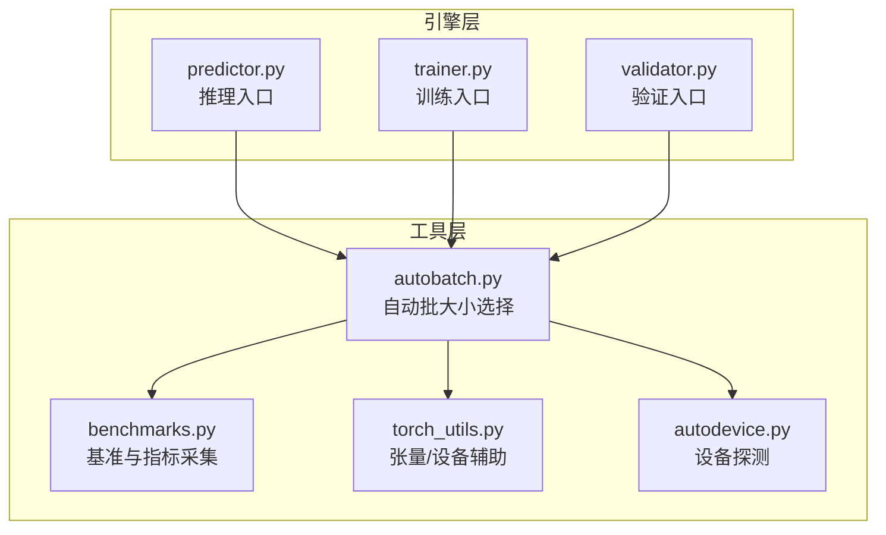
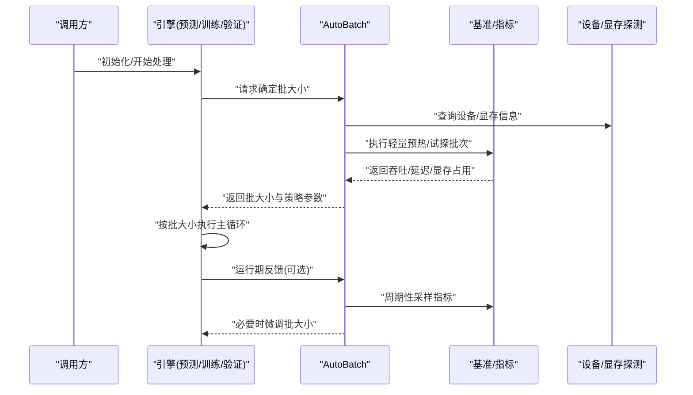
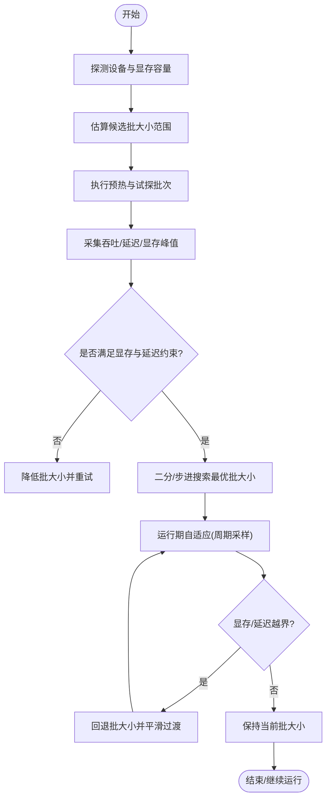
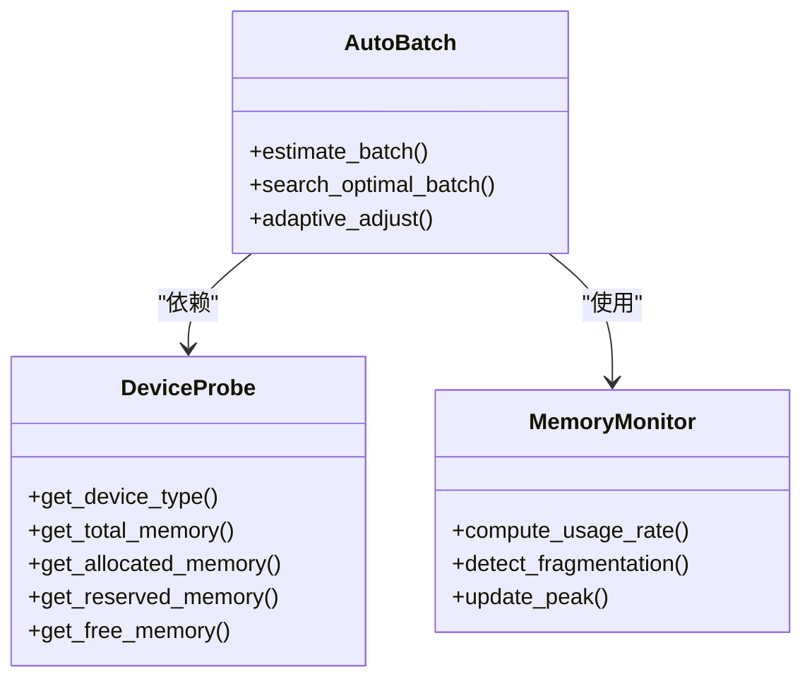
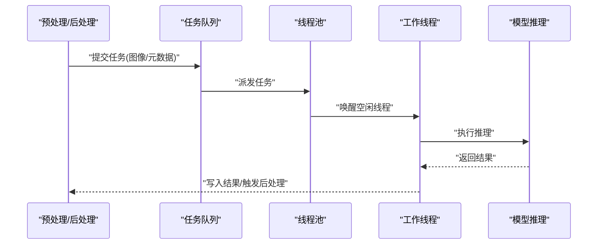
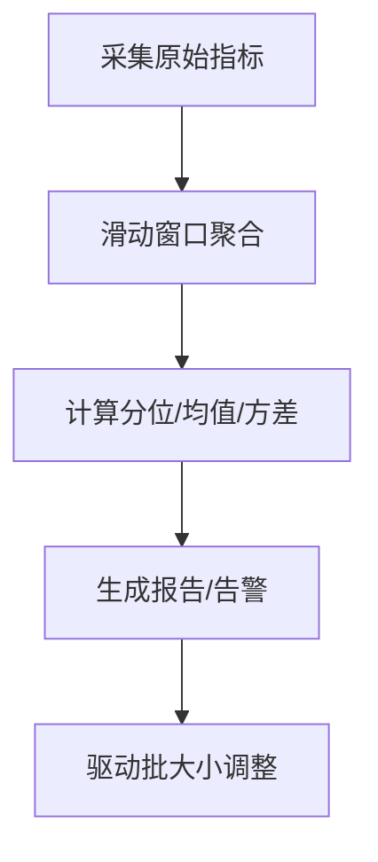
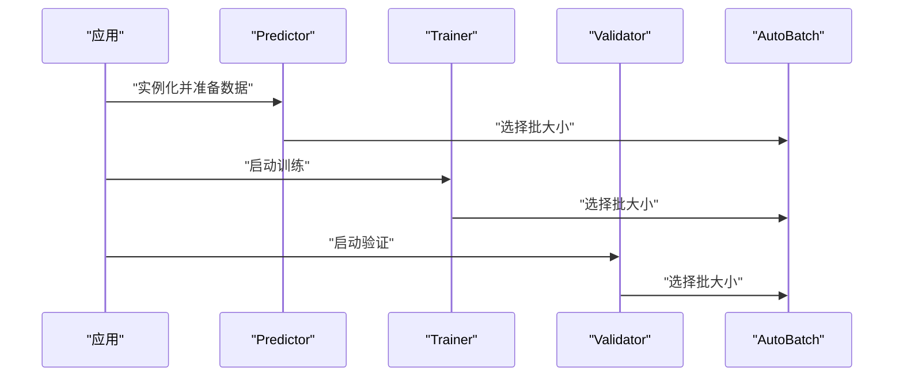
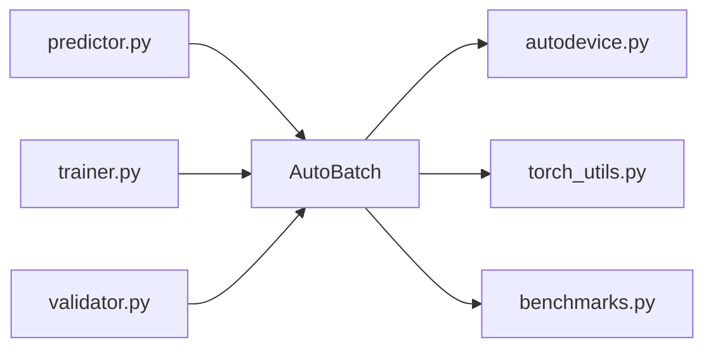

# 自动批处理优化

<cite>
**本文引用的文件**
- [autobatch.py](file://ultralytics/utils/autobatch.py)
- [benchmarks.py](file://ultralytics/utils/benchmarks.py)
- [torch_utils.py](file://ultralytics/utils/torch_utils.py)
- [predictor.py](file://ultralytics/engine/predictor.py)
- [trainer.py](file://ultralytics/engine/trainer.py)
- [validator.py](file://ultralytics/engine/validator.py)
- [autodevice.py](file://ultralytics/utils/autodevice.py)
</cite>

## 目录
1. [简介](#简介)
2. [项目结构](#项目结构)
3. [核心组件](#核心组件)
4. [架构总览](#架构总览)
5. [详细组件分析](#详细组件分析)
6. [依赖关系分析](#依赖关系分析)
7. [性能考量](#性能考量)
8. [故障排查指南](#故障排查指南)
9. [结论](#结论)
10. [附录](#附录)

## 简介
本技术文档聚焦于 YOLO-Master 的自动批处理系统，围绕 AutoBatch 模块的动态批大小调整机制展开，涵盖内存监控算法、批大小计算策略与吞吐优化目标；深入解析 GPU 显存占用分析逻辑（显存使用率监控、碎片检测与动态阈值）；阐述 CPU 多线程批处理的实现（线程池管理、任务队列调度与负载均衡）；并系统化说明批处理性能指标收集与分析能力（延迟统计、吞吐量与资源利用率）。最后提供不同硬件配置下的优化建议与最佳实践，以及异常处理与恢复机制的实现细节。

## 项目结构
自动批处理相关代码主要位于工具层与引擎层的交互处：
- 自动批大小选择与估算：utils/autobatch.py
- 基准测试与吞吐/延迟采集：utils/benchmarks.py
- 设备与显存探测：utils/autodevice.py、utils/torch_utils.py
- 推理/训练/验证流程对自动批大小的调用点：engine/predictor.py、engine/trainer.py、engine/validator.py

图表来源
- [autobatch.py](file://ultralytics/utils/autobatch.py)
- [benchmarks.py](file://ultralytics/utils/benchmarks.py)
- [torch_utils.py](file://ultralytics/utils/torch_utils.py)
- [autodevice.py](file://ultralytics/utils/autodedevice.py)
- [predictor.py](file://ultralytics/engine/predictor.py)
- [trainer.py](file://ultralytics/engine/trainer.py)
- [validator.py](file://ultralytics/engine/validator.py)

章节来源
- [autobatch.py](file://ultralytics/utils/autobatch.py)
- [benchmarks.py](file://ultralytics/utils/benchmarks.py)
- [torch_utils.py](file://ultralytics/utils/torch_utils.py)
- [autodevice.py](file://ultralytics/utils/autodevice.py)
- [predictor.py](file://ultralytics/engine/predictor.py)
- [trainer.py](file://ultralytics/engine/trainer.py)
- [validator.py](file://ultralytics/engine/validator.py)

## 核心组件
- AutoBatch 自动批大小选择器
  - 负责在给定模型、输入形状与设备条件下，估算最大可行批大小，并在运行期根据显存与吞吐反馈进行动态调整。
- 基准与指标采集器
  - 提供吞吐、延迟、GPU/CPU 利用率等指标的采样与聚合方法，供 AutoBatch 决策参考。
- 设备与显存探测
  - 抽象设备类型、显存容量与当前占用，为批大小估算与安全边界提供依据。
- 引擎集成点
  - 推理/训练/验证入口在启动阶段或运行期触发自动批大小选择与后续执行。

章节来源
- [autobatch.py](file://ultralytics/utils/autobatch.py)
- [benchmarks.py](file://ultralytics/utils/benchmarks.py)
- [torch_utils.py](file://ultralytics/utils/torch_utils.py)
- [autodevice.py](file://ultralytics/utils/autodevice.py)
- [predictor.py](file://ultralytics/engine/predictor.py)
- [trainer.py](file://ultralytics/engine/trainer.py)
- [validator.py](file://ultralytics/engine/validator.py)

## 架构总览
下图展示了自动批处理系统在推理/训练/验证流程中的位置与数据流：

图表来源
- [autobatch.py](file://ultralytics/utils/autobatch.py)
- [benchmarks.py](file://ultralytics/utils/benchmarks.py)
- [torch_utils.py](file://ultralytics/utils/torch_utils.py)
- [autodevice.py](file://ultralytics/utils/autodevice.py)
- [predictor.py](file://ultralytics/engine/predictor.py)
- [trainer.py](file://ultralytics/engine/trainer.py)
- [validator.py](file://ultralytics/engine/validator.py)

## 详细组件分析

### AutoBatch 动态批大小调整机制
- 设计目标
  - 在满足显存安全边界的前提下，最大化吞吐；同时兼顾端到端延迟上限，避免过度放大批大小导致时延抖动。
- 关键流程
  - 初始估算：基于模型规模、输入分辨率与设备显存容量，给出候选批大小区间。
  - 试探执行：以较小批次进行预热与多次计时，评估吞吐与延迟，并记录显存峰值。
  - 收敛策略：采用二分/步进式搜索，结合滑动窗口平滑指标，逐步逼近最优批大小。
  - 运行期自适应：在长任务中周期性采样，若检测到显存增长或延迟超标，则回退批大小；反之可尝试提升。
- 内存监控算法
  - 显存使用率监控：通过设备接口获取当前已分配与保留显存，计算使用率与峰值。
  - 内存碎片检测：对比“已分配”与“可用”显存的差值趋势，识别碎片化导致的不可用空间。
  - 动态调整阈值：设置显存使用率上限与碎片容忍度，当超过阈值时触发降批；低于下限时允许升批。
- 批大小计算策略
  - 目标函数：在约束（显存上限、延迟上限）下最大化吞吐。
  - 搜索方法：优先采用二分搜索快速定位上界，辅以小步长精细调优；引入迟滞与指数平滑减少震荡。
  - 多目标权衡：吞吐优先但受延迟上限约束；在低延迟场景下更保守地控制批大小。
- 吞吐优化目标
  - 短期：降低 P95/P99 延迟，稳定吞吐。
  - 长期：在长时间运行中维持稳定的资源利用曲线，避免 OOM 与频繁回退。

图表来源
- [autobatch.py](file://ultralytics/utils/autobatch.py)
- [benchmarks.py](file://ultralytics/utils/benchmarks.py)
- [torch_utils.py](file://ultralytics/utils/torch_utils.py)
- [autodevice.py](file://ultralytics/utils/autodevice.py)

章节来源
- [autobatch.py](file://ultralytics/utils/autobatch.py)
- [benchmarks.py](file://ultralytics/utils/benchmarks.py)
- [torch_utils.py](file://ultralytics/utils/torch_utils.py)
- [autodevice.py](file://ultralytics/utils/autodevice.py)

### GPU 内存占用分析逻辑
- 显存使用率监控
  - 读取当前已分配与保留显存，计算使用率与峰值，用于判断是否接近安全边界。
- 内存碎片检测
  - 通过比较“已分配”和“可用”显存的差异变化，识别碎片化导致的可用空间不足。
- 动态调整阈值
  - 显存使用率上限：超过即触发降批。
  - 碎片容忍度：当碎片占比过高时，即使总体使用率不高也可能提前降批。
  - 迟滞带：避免在阈值附近频繁上下波动。

图表来源
- [autodevice.py](file://ultralytics/utils/autodevice.py)
- [torch_utils.py](file://ultralytics/utils/torch_utils.py)
- [autobatch.py](file://ultralytics/utils/autobatch.py)

章节来源
- [autodevice.py](file://ultralytics/utils/autodevice.py)
- [torch_utils.py](file://ultralytics/utils/torch_utils.py)
- [autobatch.py](file://ultralytics/utils/autobatch.py)

### CPU 多线程批处理实现
- 线程池管理
  - 维护固定数量的工作线程，复用上下文，减少创建销毁开销。
  - 支持动态扩缩容（在负载高时增加线程数，空闲时回收），但需考虑 GIL 与 I/O 混合场景。
- 任务队列调度
  - 生产者-消费者模式：预处理/后处理作为生产者，模型推理作为消费者。
  - 优先级队列：对低延迟敏感的任务优先处理。
- 负载均衡策略
  - 基于队列长度与线程忙闲状态进行分发，避免热点线程。
  - 针对图像尺寸差异较大的情况，采用分桶策略以减少内存抖动。

图表来源
- [autobatch.py](file://ultralytics/utils/autobatch.py)
- [benchmarks.py](file://ultralytics/utils/benchmarks.py)

章节来源
- [autobatch.py](file://ultralytics/utils/autobatch.py)
- [benchmarks.py](file://ultralytics/utils/benchmarks.py)

### 批处理性能指标收集与分析
- 延迟统计
  - 端到端延迟、每样本平均延迟、P50/P95/P99 分位延迟。
- 吞吐量
  - 每秒处理样本数、每秒像素/特征量（视任务而定）。
- 资源利用率
  - GPU 显存使用率、峰值；CPU 利用率；I/O 等待时间占比。
- 指标采集方式
  - 高频采样与滑动窗口聚合，避免瞬时噪声影响决策。
  - 异步上报与本地缓存，降低对主路径的影响。

图表来源
- [benchmarks.py](file://ultralytics/utils/benchmarks.py)
- [autobatch.py](file://ultralytics/utils/autobatch.py)

章节来源
- [benchmarks.py](file://ultralytics/utils/benchmarks.py)
- [autobatch.py](file://ultralytics/utils/autobatch.py)

### 引擎集成点与调用时序
- 推理入口
  - 在初始化阶段调用自动批大小选择，随后进入推理主循环。
- 训练入口
  - 在构建 DataLoader 前后进行批大小估算，确保显存安全与吞吐平衡。
- 验证入口
  - 类似推理，但在验证集上可能更注重稳定性与一致性。

图表来源
- [predictor.py](file://ultralytics/engine/predictor.py)
- [trainer.py](file://ultralytics/engine/trainer.py)
- [validator.py](file://ultralytics/engine/validator.py)
- [autobatch.py](file://ultralytics/utils/autobatch.py)

章节来源
- [predictor.py](file://ultralytics/engine/predictor.py)
- [trainer.py](file://ultralytics/engine/trainer.py)
- [validator.py](file://ultralytics/engine/validator.py)
- [autobatch.py](file://ultralytics/utils/autobatch.py)

## 依赖关系分析
- 组件耦合
  - AutoBatch 强依赖设备与显存探测、基准采集；弱耦合于引擎层，仅通过接口获取/更新批大小。
- 外部依赖
  - 深度学习框架的设备 API、CUDA/ROCm 运行时、系统进程监控库（如 psutil，若使用）。
- 潜在循环依赖
  - 应避免 AutoBatch 反向依赖引擎具体实现，防止耦合加深。
- 接口契约
  - 设备探测接口需提供一致的显存与设备信息；基准采集接口需保证指标的可比性与稳定性。

图表来源
- [autobatch.py](file://ultralytics/utils/autobatch.py)
- [autodevice.py](file://ultralytics/utils/autodevice.py)
- [torch_utils.py](file://ultralytics/utils/torch_utils.py)
- [benchmarks.py](file://ultralytics/utils/benchmarks.py)
- [predictor.py](file://ultralytics/engine/predictor.py)
- [trainer.py](file://ultralytics/engine/trainer.py)
- [validator.py](file://ultralytics/engine/validator.py)

章节来源
- [autobatch.py](file://ultralytics/utils/autobatch.py)
- [autodevice.py](file://ultralytics/utils/autodevice.py)
- [torch_utils.py](file://ultralytics/utils/torch_utils.py)
- [benchmarks.py](file://ultralytics/utils/benchmarks.py)
- [predictor.py](file://ultralytics/engine/predictor.py)
- [trainer.py](file://ultralytics/engine/trainer.py)
- [validator.py](file://ultralytics/engine/validator.py)

## 性能考量
- 硬件配置建议
  - 单卡大显存（如 24GB+）：优先提高批大小以提升吞吐，注意延迟上限。
  - 多卡环境：结合数据并行与自动批大小，避免跨卡通信成为瓶颈。
  - 边缘设备（Jetson/嵌入式）：限制批大小与模型尺寸，优先保证低延迟与稳定性。
- 超参与阈值
  - 显存使用率上限建议设置在 80%-90% 之间，留出余量应对突发峰值。
  - 延迟上限应结合业务 SLA 设定，避免追求吞吐而牺牲实时性。
- 数据与模型特性
  - 高分辨率/复杂模型：更保守的批大小与更强的碎片检测。
  - 小模型/低分辨率：可适当放宽批大小，关注 CPU 预处理瓶颈。
- 运行期优化
  - 预热阶段充分热身，减少冷启动抖动。
  - 使用指数平滑与迟滞带，避免批大小频繁震荡。

[本节为通用指导，不直接分析具体文件]

## 故障排查指南
- 常见问题
  - OOM：检查显存使用率阈值与碎片检测是否过于宽松；适当降低批大小或启用显存清理。
  - 吞吐不稳定：观察延迟分布与队列积压，调整线程池大小与任务优先级。
  - 延迟飙升：确认是否存在 I/O 阻塞或 CPU 预处理瓶颈，必要时拆分流水线。
- 诊断步骤
  - 查看指标报告：重点关注 P95/P99 延迟与显存峰值。
  - 回放最近一次批大小调整：确认触发条件与回退幅度。
  - 隔离问题：关闭自适应，固定批大小复现问题。
- 恢复机制
  - 自动回退：当显存或延迟越界时，按步长回退批大小并平滑过渡。
  - 健康检查：周期性自检，若连续失败则降级到保守批大小并告警。
  - 持久化策略：保存最近稳定批大小，重启后快速恢复。

章节来源
- [autobatch.py](file://ultralytics/utils/autobatch.py)
- [benchmarks.py](file://ultralytics/utils/benchmarks.py)

## 结论
YOLO-Master 的自动批处理系统通过设备与显存探测、基准采集与运行期自适应，实现了在显存安全边界内最大化吞吐的目标。其核心在于稳健的内存监控算法、合理的批大小搜索策略与完善的指标采集体系。在不同硬件环境下，结合业务 SLA 合理设置阈值与策略，可获得稳定且高效的批处理性能。

[本节为总结，不直接分析具体文件]

## 附录
- 术语
  - 批大小：单次推理/训练/验证处理的样本数量。
  - 显存碎片：已分配显存中无法被大块请求利用的分散小块。
  - 迟滞带：为避免频繁切换设置的阈值缓冲区间。
- 参考路径
  - 自动批大小选择：[autobatch.py](file://ultralytics/utils/autobatch.py)
  - 基准与指标采集：[benchmarks.py](file://ultralytics/utils/benchmarks.py)
  - 设备与显存探测：[autodevice.py](file://ultralytics/utils/autodevice.py)、[torch_utils.py](file://ultralytics/utils/torch_utils.py)
  - 引擎集成点：[predictor.py](file://ultralytics/engine/predictor.py)、[trainer.py](file://ultralytics/engine/trainer.py)、[validator.py](file://ultralytics/engine/validator.py)