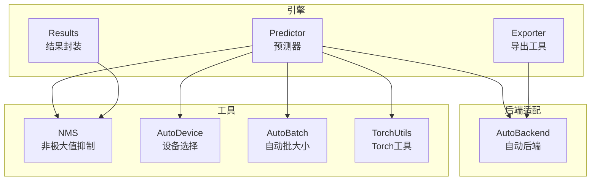
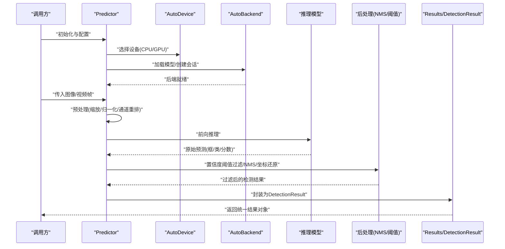
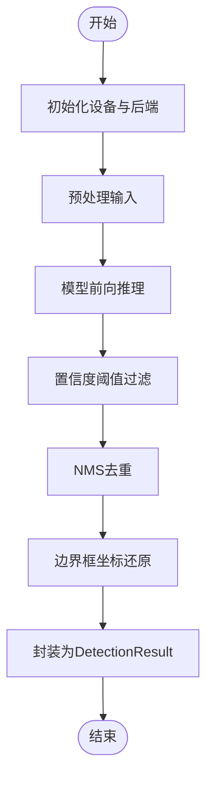
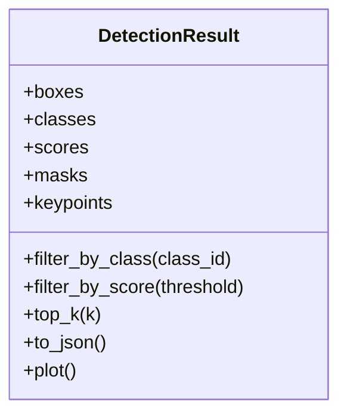
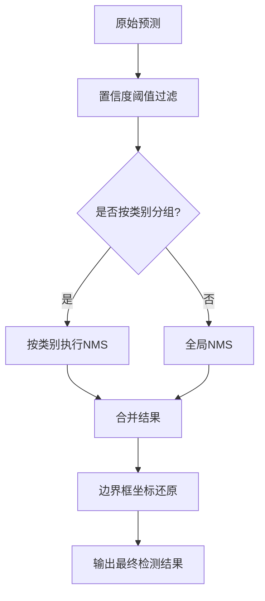
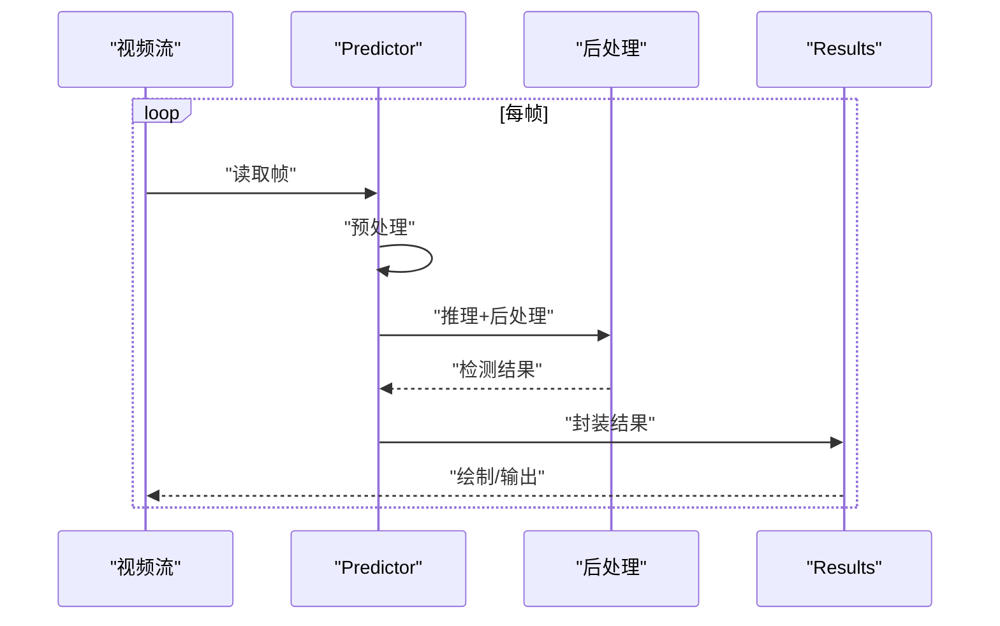
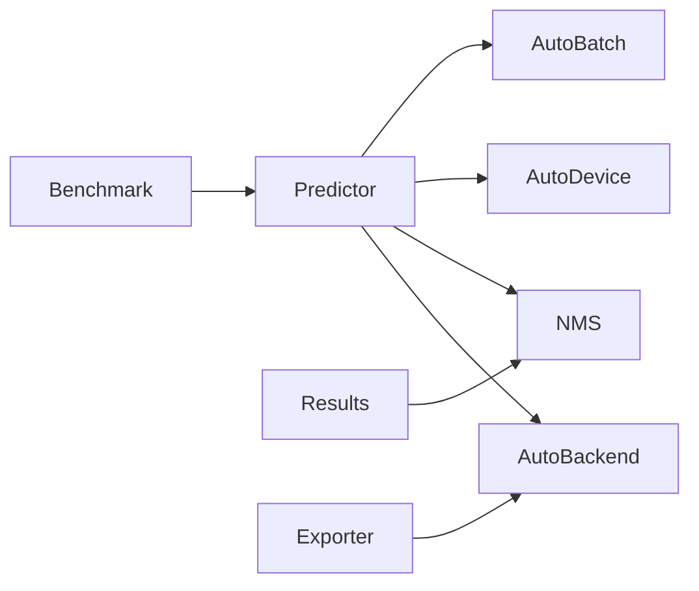

# 推理系统

<cite>
**本文引用的文件**
- [predictor.py](file://ultralytics/engine/predictor.py)
- [results.py](file://ultralytics/engine/results.py)
- [nms.py](file://ultralytics/utils/nms.py)
- [autobackend.py](file://ultralytics/nn/autobackend.py)
- [torch_utils.py](file://ultralytics/utils/torch_utils.py)
- [autodevice.py](file://ultralytics/utils/autodevice.py)
- [autobatch.py](file://ultralytics/utils/autobatch.py)
- [exporter.py](file://ultralytics/engine/exporter.py)
- [benchmark_molora_dispatch.py](file://benchmarks/benchmark_molora_dispatch.py)
- [test_autobackend_warmup.py](file://tests/test_autobackend_warmup.py)
</cite>

## 目录
1. [简介](#简介)
2. [项目结构](#项目结构)
3. [核心组件](#核心组件)
4. [架构总览](#架构总览)
5. [详细组件分析](#详细组件分析)
6. [依赖关系分析](#依赖关系分析)
7. [性能考量](#性能考量)
8. [故障排查指南](#故障排查指南)
9. [结论](#结论)
10. [附录](#附录)

## 简介
本技术文档聚焦于YOLO-Master的推理子系统，围绕预测器(Predictor)的工作流、结果处理机制、不同推理模式（单图、批量、实时视频）、后处理算法（NMS、置信度阈值过滤、边界框解码）、内存与资源优化（GPU内存池、对象复用）、统一结果数据结构(DetectionResult)、并发控制（多线程/多进程）、性能优化实践（批大小、精度、硬件适配）、错误处理与异常恢复、以及推理缓存与模型预热策略进行系统化说明。文档旨在帮助读者快速理解并高效使用推理引擎，同时为二次开发与部署提供可操作的指导。

## 项目结构
推理相关代码主要分布在以下模块：
- 引擎层：预测器、结果封装、导出工具
- 后端适配：自动选择与初始化推理后端（如ONNX Runtime、TensorRT等）
- 工具层：NMS、设备选择、自动批大小、Torch工具函数
- 基准与测试：性能基准脚本与预热/兼容性测试

图表来源
- [predictor.py:1-200](file://ultralytics/engine/predictor.py#L1-L200)
- [results.py:1-200](file://ultralytics/engine/results.py#L1-L200)
- [nms.py:1-200](file://ultralytics/utils/nms.py#L1-L200)
- [autobackend.py:1-200](file://ultralytics/nn/autobackend.py#L1-L200)
- [autodevice.py:1-200](file://ultralytics/utils/autodevice.py#L1-L200)
- [autobatch.py:1-200](file://ultralytics/utils/autobatch.py#L1-L200)
- [torch_utils.py:1-200](file://ultralytics/utils/torch_utils.py#L1-L200)
- [exporter.py:1-200](file://ultralytics/engine/exporter.py#L1-L200)

章节来源
- [predictor.py:1-200](file://ultralytics/engine/predictor.py#L1-L200)
- [results.py:1-200](file://ultralytics/engine/results.py#L1-L200)
- [nms.py:1-200](file://ultralytics/utils/nms.py#L1-L200)
- [autobackend.py:1-200](file://ultralytics/nn/autobackend.py#L1-L200)
- [autodevice.py:1-200](file://ultralytics/utils/autodevice.py#L1-L200)
- [autobatch.py:1-200](file://ultralytics/utils/autobatch.py#L1-L200)
- [torch_utils.py:1-200](file://ultralytics/utils/torch_utils.py#L1-L200)
- [exporter.py:1-200](file://ultralytics/engine/exporter.py#L1-L200)

## 核心组件
- 预测器(Predictor)
  - 负责加载模型、预处理输入、执行推理、后处理与结果封装。
  - 支持多种输入源（图像、视频流），并提供单图与批量推理接口。
  - 内部协调设备选择、后端初始化、批大小策略与NMS等后处理。
- 结果封装(Results/DetectionResult)
  - 统一封装检测输出，包括边界框、类别、置信度、掩码/关键点等。
  - 提供可视化、序列化、索引访问与过滤方法。
- 自动后端(AutoBackend)
  - 根据模型格式与运行环境自动选择最优推理后端。
  - 管理模型加载、会话/上下文创建、内存分配与预热。
- NMS与非极大值抑制
  - 实现高效的NMS算法，支持IoU阈值、类别维度过滤与批量处理。
- 设备与批大小自适应
  - AutoDevice用于设备探测与选择；AutoBatch用于动态批大小估算。
- Torch工具与导出
  - 提供张量操作、精度转换、内存管理等通用工具；Exporter用于导出与验证。

章节来源
- [predictor.py:1-200](file://ultralytics/engine/predictor.py#L1-L200)
- [results.py:1-200](file://ultralytics/engine/results.py#L1-L200)
- [nms.py:1-200](file://ultralytics/utils/nms.py#L1-L200)
- [autobackend.py:1-200](file://ultralytics/nn/autobackend.py#L1-L200)
- [autodevice.py:1-200](file://ultralytics/utils/autodevice.py#L1-L200)
- [autobatch.py:1-200](file://ultralytics/utils/autobatch.py#L1-L200)
- [torch_utils.py:1-200](file://ultralytics/utils/torch_utils.py#L1-L200)
- [exporter.py:1-200](file://ultralytics/engine/exporter.py#L1-L200)

## 架构总览
下图展示了从输入到输出的完整推理流程，涵盖预处理、模型推理、后处理与结果封装的关键环节。

图表来源
- [predictor.py:1-200](file://ultralytics/engine/predictor.py#L1-L200)
- [autobackend.py:1-200](file://ultralytics/nn/autobackend.py#L1-L200)
- [nms.py:1-200](file://ultralytics/utils/nms.py#L1-L200)
- [results.py:1-200](file://ultralytics/engine/results.py#L1-L200)

## 详细组件分析

### 预测器(Predictor)工作流
- 初始化阶段
  - 解析配置参数（设备、精度、批大小、NMS阈值等）。
  - 通过AutoDevice选择目标设备，并通过AutoBackend加载模型与创建推理会话。
  - 可选预热步骤，确保后端稳定与内存布局就绪。
- 单次推理流程
  - 输入预处理：尺寸调整、归一化、数据类型转换、批次填充。
  - 模型前向：将预处理后的张量送入后端执行推理。
  - 后处理：置信度阈值过滤、NMS去重、边界框坐标还原至原图尺度。
  - 结果封装：生成DetectionResult对象，包含元数据与可视化辅助方法。
- 批量与视频流
  - 批量推理：对多张图像进行并行预处理与推理，合并后统一后处理。
  - 视频流：逐帧读取、增量预处理、连续推理与结果绘制，支持丢帧与缓冲策略。

图表来源
- [predictor.py:1-200](file://ultralytics/engine/predictor.py#L1-L200)
- [nms.py:1-200](file://ultralytics/utils/nms.py#L1-L200)
- [results.py:1-200](file://ultralytics/engine/results.py#L1-L200)

章节来源
- [predictor.py:1-200](file://ultralytics/engine/predictor.py#L1-L200)

### 结果处理机制与DetectionResult
- 统一数据结构
  - DetectionResult封装了边界框、类别ID、置信度、掩码/关键点等字段，并提供索引、切片与过滤方法。
- 操作方法
  - 按类别或置信度筛选、获取Top-K结果、转换为JSON/CSV、叠加绘制到图像。
- 与后处理的协作
  - 后处理阶段直接写入DetectionResult的对应字段，保证结果一致性。

图表来源
- [results.py:1-200](file://ultralytics/engine/results.py#L1-L200)

章节来源
- [results.py:1-200](file://ultralytics/engine/results.py#L1-L200)

### 后处理算法：NMS、置信度阈值过滤与边界框解码
- 置信度阈值过滤
  - 在NMS之前剔除低置信度预测，减少计算量与误检。
- NMS（非极大值抑制）
  - 基于IoU阈值去除重叠框，支持按类别独立执行与批量处理。
- 边界框解码
  - 将模型输出的相对坐标还原为原图绝对坐标，考虑缩放与裁剪信息。

图表来源
- [nms.py:1-200](file://ultralytics/utils/nms.py#L1-L200)

章节来源
- [nms.py:1-200](file://ultralytics/utils/nms.py#L1-L200)

### 推理模式：单图像、批量与实时视频流
- 单图像推理
  - 适用于离线分析与调试，延迟优先，批大小为1。
- 批量推理
  - 提高吞吐，适合离线批处理与评测；需平衡显存占用与延迟。
- 实时视频流
  - 逐帧处理，结合缓冲与丢帧策略维持稳定帧率；可与跟踪模块联动。

图表来源
- [predictor.py:1-200](file://ultralytics/engine/predictor.py#L1-L200)
- [results.py:1-200](file://ultralytics/engine/results.py#L1-L200)

章节来源
- [predictor.py:1-200](file://ultralytics/engine/predictor.py#L1-L200)

### 内存管理与资源优化
- GPU内存池与对象复用
  - 通过后端会话与张量缓冲区复用减少频繁分配与释放开销。
- 自动批大小与精度选择
  - AutoBatch根据设备能力估算合适批大小；支持FP16/INT8以降低显存与提升吞吐。
- 预热与缓存
  - 首次推理前进行预热，建立内核缓存与内存布局；对常用输入尺寸进行缓存加速。

章节来源
- [autobackend.py:1-200](file://ultralytics/nn/autobackend.py#L1-L200)
- [autobatch.py:1-200](file://ultralytics/utils/autobatch.py#L1-L200)
- [torch_utils.py:1-200](file://ultralytics/utils/torch_utils.py#L1-L200)
- [test_autobackend_warmup.py:1-200](file://tests/test_autobackend_warmup.py#L1-L200)

### 多线程与多进程推理
- 线程安全
  - Predictor实例通常不跨线程共享；每个线程持有独立实例以避免状态竞争。
- 进程级并行
  - 多进程分别加载模型与后端，避免GIL限制；注意进程间通信与资源隔离。
- 并发控制
  - 使用队列与信号量控制并发度，防止显存溢出与CPU过载。

章节来源
- [predictor.py:1-200](file://ultralytics/engine/predictor.py#L1-L200)
- [autobackend.py:1-200](file://ultralytics/nn/autobackend.py#L1-L200)

### 错误处理与异常恢复
- 设备与后端异常
  - 捕获设备不可用、模型加载失败、会话创建失败等异常，回退至CPU或提示用户检查环境。
- 输入与后处理异常
  - 校验输入尺寸与类型，处理空结果与NMS退化情况，保证鲁棒性。
- 重试与降级
  - 针对临时性错误（如显存不足）实施重试或降低批大小/精度的降级策略。

章节来源
- [autobackend.py:1-200](file://ultralytics/nn/autobackend.py#L1-L200)
- [nms.py:1-200](file://ultralytics/utils/nms.py#L1-L200)

### 推理缓存与模型预热策略
- 模型预热
  - 启动时以典型输入尺寸执行若干次推理，预热内核与内存布局，降低首帧延迟。
- 输入缓存
  - 对重复输入尺寸与预处理参数进行缓存，避免重复计算。
- 后端缓存
  - 利用后端提供的会话与算子缓存，提升后续推理速度。

章节来源
- [test_autobackend_warmup.py:1-200](file://tests/test_autobackend_warmup.py#L1-L200)
- [autobackend.py:1-200](file://ultralytics/nn/autobackend.py#L1-L200)

## 依赖关系分析
- 组件耦合
  - Predictor强依赖AutoBackend与NMS；Results弱依赖NMS（仅用于结果字段）。
  - AutoDevice与AutoBatch为Predictor提供运行时自适应能力。
- 外部集成点
  - 导出工具Exporter与Benchmark脚本用于模型导出与性能评估。

图表来源
- [predictor.py:1-200](file://ultralytics/engine/predictor.py#L1-L200)
- [autobackend.py:1-200](file://ultralytics/nn/autobackend.py#L1-L200)
- [nms.py:1-200](file://ultralytics/utils/nms.py#L1-L200)
- [autodevice.py:1-200](file://ultralytics/utils/autodevice.py#L1-L200)
- [autobatch.py:1-200](file://ultralytics/utils/autobatch.py#L1-L200)
- [exporter.py:1-200](file://ultralytics/engine/exporter.py#L1-L200)
- [benchmark_molora_dispatch.py:1-200](file://benchmarks/benchmark_molora_dispatch.py#L1-L200)

章节来源
- [predictor.py:1-200](file://ultralytics/engine/predictor.py#L1-L200)
- [autobackend.py:1-200](file://ultralytics/nn/autobackend.py#L1-L200)
- [nms.py:1-200](file://ultralytics/utils/nms.py#L1-L200)
- [autodevice.py:1-200](file://ultralytics/utils/autodevice.py#L1-L200)
- [autobatch.py:1-200](file://ultralytics/utils/autobatch.py#L1-L200)
- [exporter.py:1-200](file://ultralytics/engine/exporter.py#L1-L200)
- [benchmark_molora_dispatch.py:1-200](file://benchmarks/benchmark_molora_dispatch.py#L1-L200)

## 性能考量
- 批大小调整
  - 依据显存容量与延迟目标动态调整批大小，避免OOM与抖动。
- 精度选择
  - FP16/INT8可降低显存与提升吞吐，但需评估精度损失与校准质量。
- 硬件适配
  - 针对不同后端（ONNX/TensorRT/OpenVINO）启用相应优化选项，如静态形状、算子融合。
- 预热与缓存
  - 预热减少首帧延迟；输入与后端缓存提升整体吞吐。
- 监控与调优
  - 使用基准脚本收集延迟与吞吐指标，定位瓶颈并进行针对性优化。

[本节为通用指导，无需特定文件引用]

## 故障排查指南
- 设备与后端问题
  - 检查设备可用性、驱动版本与后端库安装；必要时回退至CPU。
- 模型加载失败
  - 确认模型路径与格式正确；查看导出日志与兼容性矩阵。
- 显存不足
  - 降低批大小或精度；启用内存池与对象复用；关闭不必要的日志与可视化。
- NMS退化或空结果
  - 调整置信度阈值与IoU阈值；检查预处理与坐标还原逻辑。
- 预热未生效
  - 确认预热输入尺寸与实际一致；检查后端缓存是否启用。

章节来源
- [autobackend.py:1-200](file://ultralytics/nn/autobackend.py#L1-L200)
- [nms.py:1-200](file://ultralytics/utils/nms.py#L1-L200)
- [test_autobackend_warmup.py:1-200](file://tests/test_autobackend_warmup.py#L1-L200)

## 结论
YOLO-Master的推理系统以Predictor为核心，结合AutoBackend、NMS与Results形成完整的端到端流水线。通过设备与批大小自适应、内存池与对象复用、预热与缓存策略，系统在吞吐与延迟之间取得良好平衡。合理的错误处理与降级策略提升了鲁棒性。建议在生产环境中结合基准脚本持续监控与调优，并根据硬件特性选择合适的后端与精度。

[本节为总结性内容，无需特定文件引用]

## 附录
- 最佳实践清单
  - 预热模型与缓存输入尺寸
  - 合理设置批大小与精度
  - 使用NMS与阈值过滤减少误检
  - 监控显存与延迟，及时降级
  - 定期更新后端与驱动以获得最新优化

[本节为补充信息，无需特定文件引用]