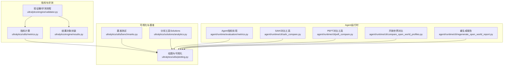
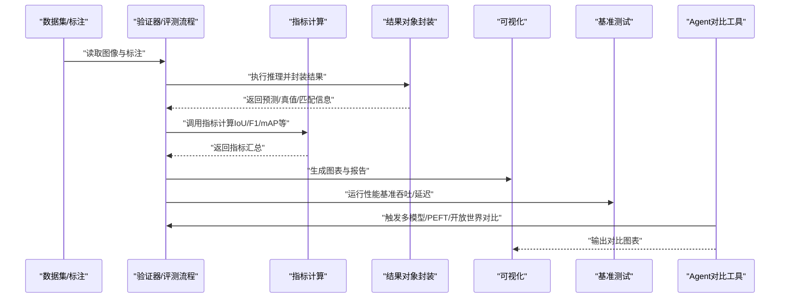
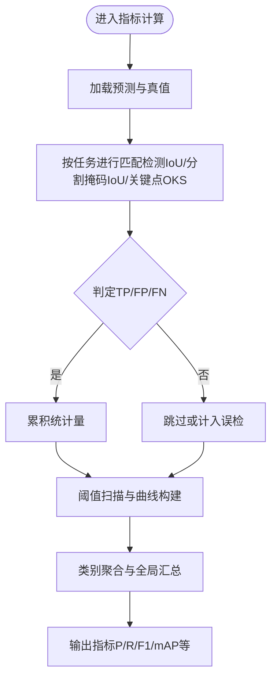
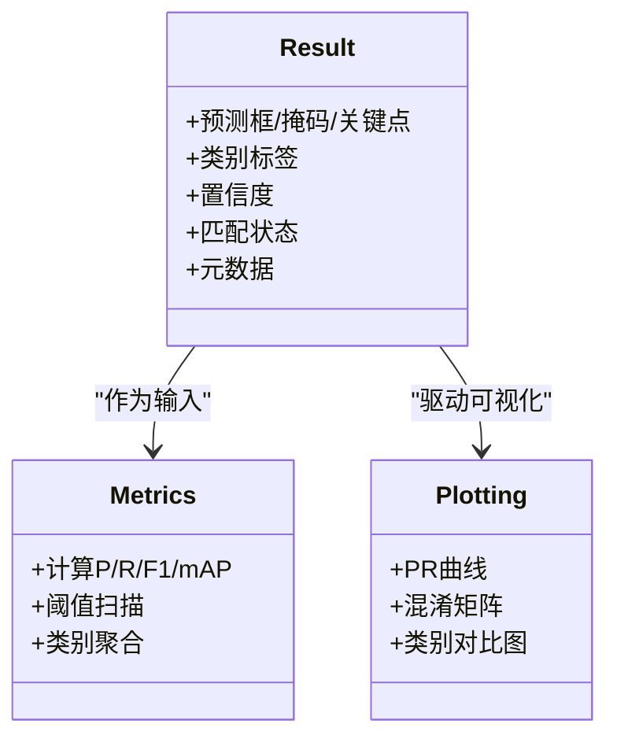
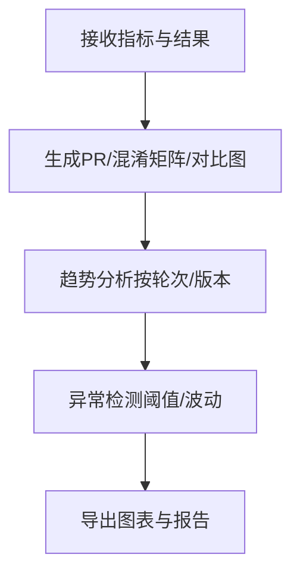
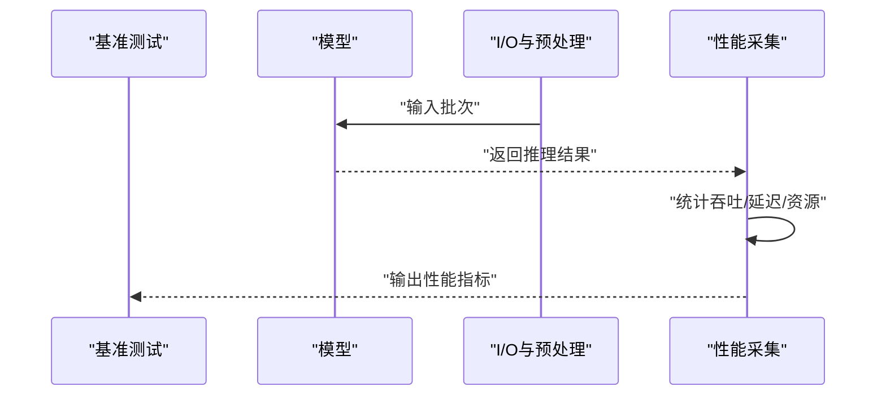
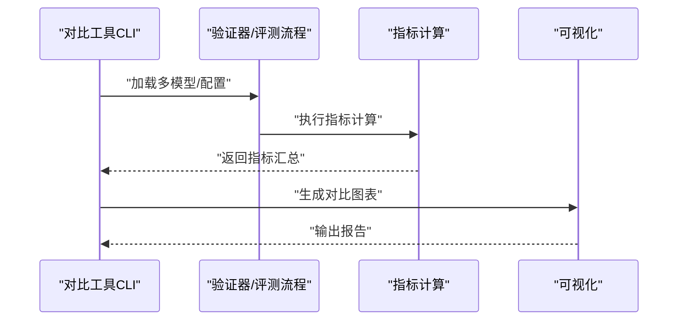
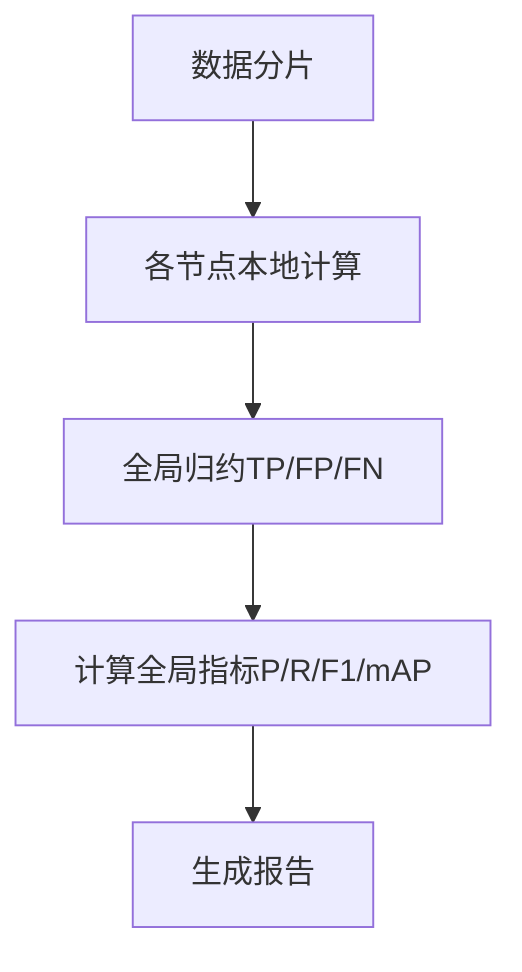
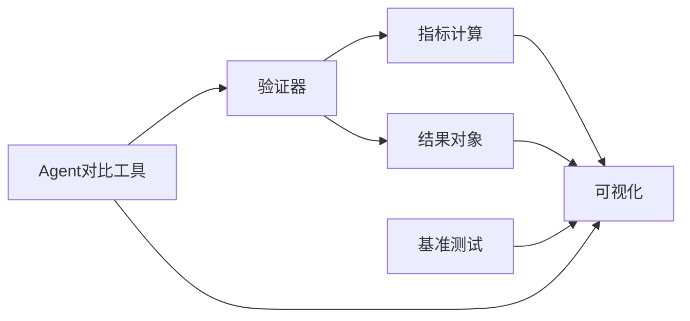

# 分析与统计

<cite>
**本文引用的文件**
- [metrics.py](file://ultralytics/utils/metrics.py)
- [validator.py](file://ultralytics/engine/validator.py)
- [results.py](file://ultralytics/engine/results.py)
- [plotting.py](file://ultralytics/utils/plotting.py)
- [benchmarks.py](file://ultralytics/utils/benchmarks.py)
- [analytics.py](file://ultralytics/solutions/analytics.py)
- [metrics.py](file://agent/runtime/evaluation/metrics.py)
- [sahi_compare.py](file://agent/runtime/cli/sahi_compare.py)
- [peft_compare.py](file://agent/runtime/cli/peft_compare.py)
- [compare_open_world_profiles.py](file://agent/runtime/cli/compare_open_world_profiles.py)
- [regenerate_open_world_report.py](file://agent/runtime/cli/regenerate_open_world_report.py)
</cite>

## 目录
1. [简介](#简介)
2. [项目结构](#项目结构)
3. [核心组件](#核心组件)
4. [架构总览](#架构总览)
5. [详细组件分析](#详细组件分析)
6. [依赖关系分析](#依赖关系分析)
7. [性能考量](#性能考量)
8. [故障排查指南](#故障排查指南)
9. [结论](#结论)
10. [附录](#附录)

## 简介
本技术文档聚焦于YOLO-Master的结果分析与统计系统，围绕以下目标展开：
- 结果统计分析的核心功能：准确率、召回率、F1分数与mAP指标计算
- 不同检测任务的评价指标体系：目标检测的IoU、实例分割的像素级精度、姿态估计的关键点匹配
- 结果对比分析工具：多模型比较与性能基准测试
- 统计数据可视化：图表生成、趋势分析与异常检测
- 自定义评价指标开发接口：面向业务场景的评估标准扩展
- 大规模数据集的分布式统计计算：MapReduce模式与并行聚合
- 结果质量评估与置信度校准工具
- 统计显著性检验与假设验证方法

## 项目结构
与“分析与统计”相关的代码主要分布在如下模块：
- 指标计算与评测引擎：ultralytics/utils/metrics.py、ultralytics/engine/validator.py
- 推理结果封装与后处理：ultralytics/engine/results.py
- 可视化与绘图：ultralytics/utils/plotting.py
- 基准测试与速度评测：ultralytics/utils/benchmarks.py
- 解决方案层分析工具：ultralytics/solutions/analytics.py
- Agent运行时评估与对比脚本：agent/runtime/evaluation/metrics.py、agent/runtime/cli/*

图示来源
- [metrics.py](file://ultralytics/utils/metrics.py)
- [validator.py](file://ultralytics/engine/validator.py)
- [results.py](file://ultralytics/engine/results.py)
- [plotting.py](file://ultralytics/utils/plotting.py)
- [benchmarks.py](file://ultralytics/utils/benchmarks.py)
- [analytics.py](file://ultralytics/solutions/analytics.py)
- [metrics.py](file://agent/runtime/evaluation/metrics.py)
- [sahi_compare.py](file://agent/runtime/cli/sahi_compare.py)
- [peft_compare.py](file://agent/runtime/cli/peft_compare.py)
- [compare_open_world_profiles.py](file://agent/runtime/cli/compare_open_world_profiles.py)
- [regenerate_open_world_report.py](file://agent/runtime/cli/regenerate_open_world_report.py)

章节来源
- [metrics.py](file://ultralytics/utils/metrics.py)
- [validator.py](file://ultralytics/engine/validator.py)
- [results.py](file://ultralytics/engine/results.py)
- [plotting.py](file://ultralytics/utils/plotting.py)
- [benchmarks.py](file://ultralytics/utils/benchmarks.py)
- [analytics.py](file://ultralytics/solutions/analytics.py)
- [metrics.py](file://agent/runtime/evaluation/metrics.py)
- [sahi_compare.py](file://agent/runtime/cli/sahi_compare.py)
- [peft_compare.py](file://agent/runtime/cli/peft_compare.py)
- [compare_open_world_profiles.py](file://agent/runtime/cli/compare_open_world_profiles.py)
- [regenerate_open_world_report.py](file://agent/runtime/cli/regenerate_open_world_report.py)

## 核心组件
本节概述结果分析与统计系统的核心能力与职责划分。

- 指标计算与评测引擎
  - 负责各类任务的指标计算：目标检测（Precision、Recall、F1、mAP）、实例分割（像素级IoU、mAP）、姿态估计（关键点匹配、OKS等）
  - 提供阈值扫描、类别聚合、跨数据集汇总等能力
  - 参考路径：[指标计算](file://ultralytics/utils/metrics.py)、[验证器/评测流程](file://ultralytics/engine/validator.py)

- 结果对象封装
  - 统一封装预测结果、真值标注、匹配状态、置信度分布等
  - 为后续指标计算与可视化提供结构化输入
  - 参考路径：[结果对象封装](file://ultralytics/engine/results.py)

- 可视化与绘图
  - 生成PR曲线、混淆矩阵、类别对比图、趋势图等
  - 支持批量导出与交互式展示
  - 参考路径：[绘图与可视化](file://ultralytics/utils/plotting.py)

- 基准测试与速度评测
  - 提供吞吐、延迟、内存占用等性能基准
  - 与指标结果联动，形成“质量+性能”的综合报告
  - 参考路径：[基准测试](file://ultralytics/utils/benchmarks.py)

- 解决方案层分析工具
  - 面向具体业务场景的分析与洞察（如计数、区域统计、热力图等）
  - 参考路径：[分析工具（Solutions）](file://ultralytics/solutions/analytics.py)

- Agent运行时评估与对比工具
  - 提供多模型对比、PEFT对比、开放世界配置对比、报告重生成等
  - 参考路径：
    - [Agent指标实现](file://agent/runtime/evaluation/metrics.py)
    - [SAHI对比工具](file://agent/runtime/cli/sahi_compare.py)
    - [PEFT对比工具](file://agent/runtime/cli/peft_compare.py)
    - [开放世界对比](file://agent/runtime/cli/compare_open_world_profiles.py)
    - [重生成报告](file://agent/runtime/cli/regenerate_open_world_report.py)

章节来源
- [metrics.py](file://ultralytics/utils/metrics.py)
- [validator.py](file://ultralytics/engine/validator.py)
- [results.py](file://ultralytics/engine/results.py)
- [plotting.py](file://ultralytics/utils/plotting.py)
- [benchmarks.py](file://ultralytics/utils/benchmarks.py)
- [analytics.py](file://ultralytics/solutions/analytics.py)
- [metrics.py](file://agent/runtime/evaluation/metrics.py)
- [sahi_compare.py](file://agent/runtime/cli/sahi_compare.py)
- [peft_compare.py](file://agent/runtime/cli/peft_compare.py)
- [compare_open_world_profiles.py](file://agent/runtime/cli/compare_open_world_profiles.py)
- [regenerate_open_world_report.py](file://agent/runtime/cli/regenerate_open_world_report.py)

## 架构总览
下图展示了从数据加载、推理、指标计算到可视化的端到端流程，以及对比与基准工具的集成位置。

图示来源
- [validator.py](file://ultralytics/engine/validator.py)
- [metrics.py](file://ultralytics/utils/metrics.py)
- [results.py](file://ultralytics/engine/results.py)
- [plotting.py](file://ultralytics/utils/plotting.py)
- [benchmarks.py](file://ultralytics/utils/benchmarks.py)
- [sahi_compare.py](file://agent/runtime/cli/sahi_compare.py)
- [peft_compare.py](file://agent/runtime/cli/peft_compare.py)
- [compare_open_world_profiles.py](file://agent/runtime/cli/compare_open_world_profiles.py)

## 详细组件分析

### 指标计算与评测引擎
- 目标检测指标
  - IoU阈值扫描与匹配策略：用于判定正负样本，支撑Precision、Recall、F1与mAP计算
  - 类别维度聚合与全局mAP汇总
- 实例分割指标
  - 像素级掩码IoU与类别平均mAP
- 姿态估计指标
  - 关键点匹配与OKS（Object Keypoint Similarity）等度量
- 置信度与阈值管理
  - 支持动态阈值选择与置信度校准接口（见“置信度校准”小节）

图示来源
- [metrics.py](file://ultralytics/utils/metrics.py)
- [validator.py](file://ultralytics/engine/validator.py)
- [results.py](file://ultralytics/engine/results.py)

章节来源
- [metrics.py](file://ultralytics/utils/metrics.py)
- [validator.py](file://ultralytics/engine/validator.py)
- [results.py](file://ultralytics/engine/results.py)

### 结果对象封装
- 统一数据结构
  - 包含预测框/掩码/关键点、类别标签、置信度、匹配状态等
- 与指标计算的契约
  - 提供标准化的输入格式，确保不同任务的一致性与可复用性
- 与可视化的对接
  - 直接驱动绘图模块生成图表

图示来源
- [results.py](file://ultralytics/engine/results.py)
- [metrics.py](file://ultralytics/utils/metrics.py)
- [plotting.py](file://ultralytics/utils/plotting.py)

章节来源
- [results.py](file://ultralytics/engine/results.py)
- [metrics.py](file://ultralytics/utils/metrics.py)
- [plotting.py](file://ultralytics/utils/plotting.py)

### 可视化与图表生成
- PR曲线与混淆矩阵
  - 支持多类别叠加与阈值标注
- 趋势分析与异常检测
  - 基于时间序列或迭代轮次的指标变化，识别退化或突变
- 批量导出与报告整合
  - 将图表嵌入综合报告，便于归档与分享

图示来源
- [plotting.py](file://ultralytics/utils/plotting.py)
- [analytics.py](file://ultralytics/solutions/analytics.py)

章节来源
- [plotting.py](file://ultralytics/utils/plotting.py)
- [analytics.py](file://ultralytics/solutions/analytics.py)

### 基准测试与性能评测
- 吞吐与延迟
  - 在相同硬件与批大小下测量推理耗时与吞吐量
- 资源占用
  - 记录显存/CPU使用峰值，辅助容量规划
- 与指标联动
  - 将“质量指标+性能指标”合并呈现，形成完整评测报告

图示来源
- [benchmarks.py](file://ultralytics/utils/benchmarks.py)

章节来源
- [benchmarks.py](file://ultralytics/utils/benchmarks.py)

### 结果对比分析工具
- SAHI切片推理对比
  - 对比不同切片策略对指标的影响
- PEFT微调对比
  - 对比不同LoRA/适配器配置下的指标差异
- 开放世界配置对比
  - 对比不同分类体系或提示模板的效果
- 报告重生成
  - 基于新配置或新数据重新生成对比报告

图示来源
- [sahi_compare.py](file://agent/runtime/cli/sahi_compare.py)
- [peft_compare.py](file://agent/runtime/cli/peft_compare.py)
- [compare_open_world_profiles.py](file://agent/runtime/cli/compare_open_world_profiles.py)
- [regenerate_open_world_report.py](file://agent/runtime/cli/regenerate_open_world_report.py)
- [validator.py](file://ultralytics/engine/validator.py)
- [metrics.py](file://ultralytics/utils/metrics.py)
- [plotting.py](file://ultralytics/utils/plotting.py)

章节来源
- [sahi_compare.py](file://agent/runtime/cli/sahi_compare.py)
- [peft_compare.py](file://agent/runtime/cli/peft_compare.py)
- [compare_open_world_profiles.py](file://agent/runtime/cli/compare_open_world_profiles.py)
- [regenerate_open_world_report.py](file://agent/runtime/cli/regenerate_open_world_report.py)
- [validator.py](file://ultralytics/engine/validator.py)
- [metrics.py](file://ultralytics/utils/metrics.py)
- [plotting.py](file://ultralytics/utils/plotting.py)

### 自定义评价指标开发接口
- 设计原则
  - 以Result对象为输入，以指标字典为输出，保持与现有评测流程兼容
- 扩展点
  - 在指标计算模块中注册新的度量函数，并在验证器中启用
- 示例路径
  - 参考现有指标实现的结构与契约，新增业务特定指标（如领域内特殊匹配规则）

章节来源
- [metrics.py](file://ultralytics/utils/metrics.py)
- [validator.py](file://ultralytics/engine/validator.py)
- [results.py](file://ultralytics/engine/results.py)

### 大规模数据集的分布式统计计算
- MapReduce模式
  - 将数据集分片，在各节点独立计算局部指标，再汇聚全局结果
- 并行聚合
  - 通过集合通信或进程间通信完成TP/FP/FN等统计量的归约
- 一致性保障
  - 确保不同节点上的匹配策略与阈值一致，避免偏差

章节来源
- [metrics.py](file://ultralytics/utils/metrics.py)
- [validator.py](file://ultralytics/engine/validator.py)

### 结果质量评估与置信度校准
- 质量评估
  - 结合指标与可视化，识别弱项类别与困难样本
- 置信度校准
  - 使用温度缩放或Platt缩放等方法调整置信度分布，提升可靠性
- 工具集成
  - 在验证器中插入校准步骤，使指标计算基于校准后的置信度

章节来源
- [validator.py](file://ultralytics/engine/validator.py)
- [metrics.py](file://ultralytics/utils/metrics.py)
- [plotting.py](file://ultralytics/utils/plotting.py)

### 统计显著性检验与假设验证
- 常用方法
  - t检验、Mann-Whitney U检验、Bootstrap置信区间
- 应用场景
  - 对比两个模型或两种配置的指标差异是否显著
- 集成方式
  - 在对比工具中自动执行显著性检验，并在报告中展示p值与效应量

章节来源
- [peft_compare.py](file://agent/runtime/cli/peft_compare.py)
- [compare_open_world_profiles.py](file://agent/runtime/cli/compare_open_world_profiles.py)
- [regenerate_open_world_report.py](file://agent/runtime/cli/regenerate_open_world_report.py)

## 依赖关系分析
- 组件耦合
  - 验证器依赖指标计算与结果对象；可视化依赖指标与结果；基准测试独立但可与验证器协作
- 外部依赖
  - 数值计算库（如NumPy/Torch）、绘图库（如Matplotlib/Plotly）
- 潜在循环依赖
  - 建议通过接口抽象与事件回调解耦，避免紧耦合

图示来源
- [validator.py](file://ultralytics/engine/validator.py)
- [metrics.py](file://ultralytics/utils/metrics.py)
- [results.py](file://ultralytics/engine/results.py)
- [plotting.py](file://ultralytics/utils/plotting.py)
- [benchmarks.py](file://ultralytics/utils/benchmarks.py)
- [sahi_compare.py](file://agent/runtime/cli/sahi_compare.py)
- [peft_compare.py](file://agent/runtime/cli/peft_compare.py)
- [compare_open_world_profiles.py](file://agent/runtime/cli/compare_open_world_profiles.py)

章节来源
- [validator.py](file://ultralytics/engine/validator.py)
- [metrics.py](file://ultralytics/utils/metrics.py)
- [results.py](file://ultralytics/engine/results.py)
- [plotting.py](file://ultralytics/utils/plotting.py)
- [benchmarks.py](file://ultralytics/utils/benchmarks.py)
- [sahi_compare.py](file://agent/runtime/cli/sahi_compare.py)
- [peft_compare.py](file://agent/runtime/cli/peft_compare.py)
- [compare_open_world_profiles.py](file://agent/runtime/cli/compare_open_world_profiles.py)

## 性能考量
- 指标计算复杂度
  - 匹配阶段通常为O(N^2)或近似线性优化（排序/索引），需关注大场景下的开销
- 阈值扫描
  - 多阈值重复计算可通过缓存或向量化优化
- 可视化渲染
  - 大数据集下建议按需采样或降分辨率
- 基准测试
  - 预热与多次采样取稳健统计（均值/方差）

## 故障排查指南
- 常见问题
  - 指标异常：检查匹配阈值、类别映射与标注格式
  - 可视化缺失：确认结果对象字段完整性与绘图依赖
  - 对比不一致：核对不同模型的预处理与后处理参数
- 定位手段
  - 启用详细日志，输出中间统计量（TP/FP/FN）
  - 使用最小复现数据集快速验证

章节来源
- [validator.py](file://ultralytics/engine/validator.py)
- [metrics.py](file://ultralytics/utils/metrics.py)
- [plotting.py](file://ultralytics/utils/plotting.py)

## 结论
YOLO-Master的结果分析与统计系统提供了覆盖多任务、多指标的完整评测能力，并通过可视化与对比工具形成闭环。建议在工程实践中：
- 建立统一的指标契约与结果对象规范
- 引入置信度校准与显著性检验，提升评估严谨性
- 采用分布式计算与缓存策略，应对大规模数据与高并发场景

## 附录
- 术语表
  - IoU：交并比
  - mAP：平均精度均值
  - OKS：关键点相似度
  - PR曲线：精确率-召回率曲线
- 参考路径
  - 指标与评测：[指标计算](file://ultralytics/utils/metrics.py)、[验证器](file://ultralytics/engine/validator.py)
  - 结果与可视化：[结果对象](file://ultralytics/engine/results.py)、[绘图](file://ultralytics/utils/plotting.py)
  - 基准与对比：[基准测试](file://ultralytics/utils/benchmarks.py)、[SAHI对比](file://agent/runtime/cli/sahi_compare.py)、[PEFT对比](file://agent/runtime/cli/peft_compare.py)、[开放世界对比](file://agent/runtime/cli/compare_open_world_profiles.py)、[报告重生成](file://agent/runtime/cli/regenerate_open_world_report.py)