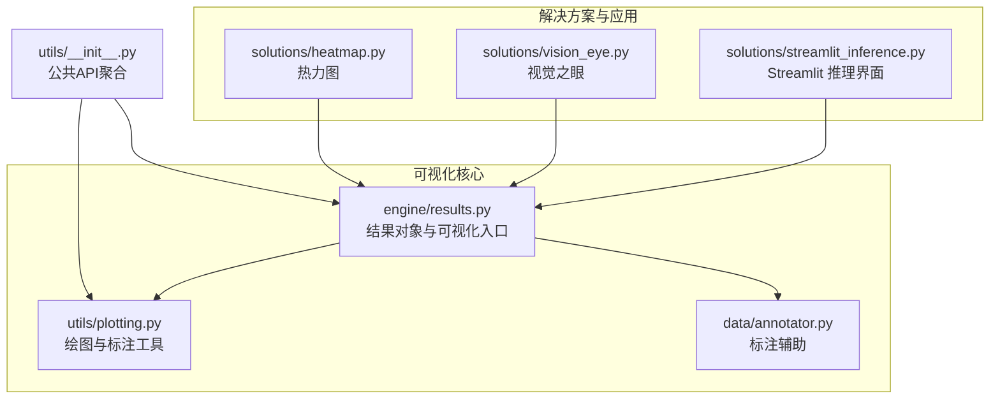
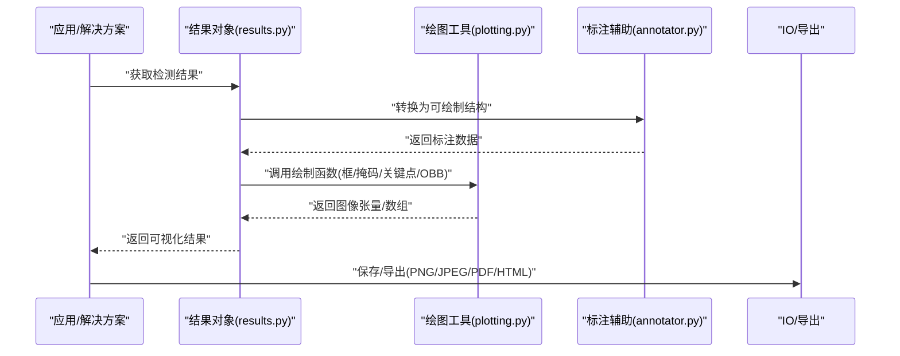
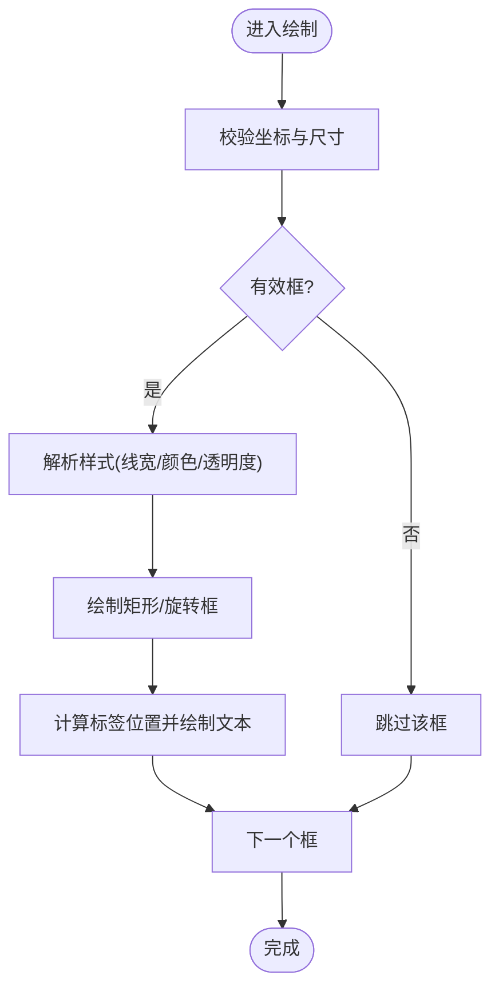
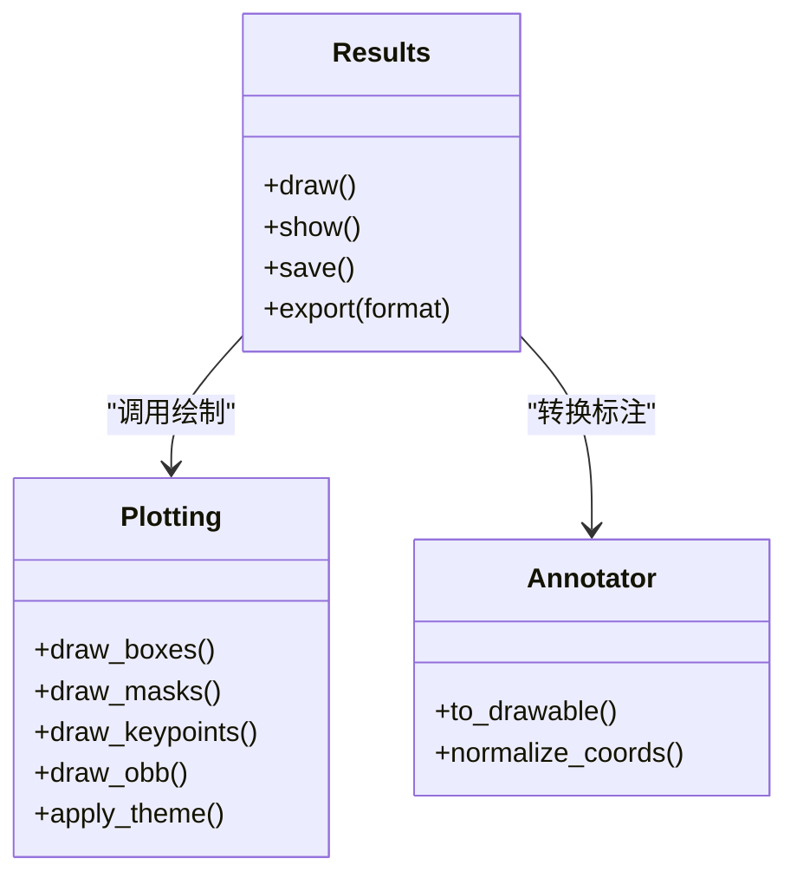
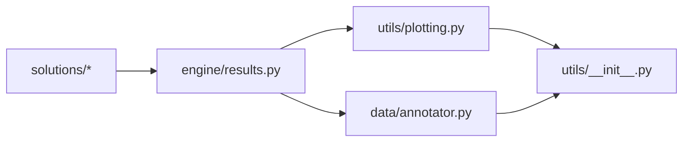

# 可视化渲染系统

<cite>
**本文引用的文件**
- [ultralytics/utils/plotting.py](file://ultralytics/utils/plotting.py)
- [ultralytics/engine/results.py](file://ultralytics/engine/results.py)
- [ultralytics/solutions/streamlit_inference.py](file://ultralytics/solutions/streamlit_inference.py)
- [ultralytics/solutions/vision_eye.py](file://ultralytics/solutions/vision_eye.py)
- [ultralytics/solutions/heatmap.py](file://ultralytics/solutions/heatmap.py)
- [ultralytics/data/annotator.py](file://ultralytics/data/annotator.py)
- [ultralytics/utils/__init__.py](file://ultralytics/utils/__init__.py)
</cite>

## 目录
1. [简介](#简介)
2. [项目结构](#项目结构)
3. [核心组件](#核心组件)
4. [架构总览](#架构总览)
5. [详细组件分析](#详细组件分析)
6. [依赖关系分析](#依赖关系分析)
7. [性能考虑](#性能考虑)
8. [故障排查指南](#故障排查指南)
9. [结论](#结论)
10. [附录](#附录)

## 简介
本技术文档聚焦于 YOLO-Master 的可视化渲染子系统，系统性阐述结果可视化的核心能力与实现要点。内容覆盖：
- 边界框绘制引擎、标签显示系统与颜色映射机制
- 多任务适配：目标检测、实例分割、姿态估计、旋转边界框（OBB）
- 可视化配置项：线条粗细、字体大小、颜色方案、透明度等
- 实时渲染优化：GPU 加速渲染与批量绘制优化
- 交互式可视化接口：缩放、平移、动态过滤
- 导出格式：PNG、JPEG、PDF 及 HTML 报告生成
- 自定义样式与主题配置
- 多线程安全的渲染模式与错误处理机制

## 项目结构
可视化渲染相关代码主要分布在以下模块：
- 绘图与标注工具：ultralytics/utils/plotting.py
- 推理结果封装与可视化入口：ultralytics/engine/results.py
- 数据层标注辅助：ultralytics/data/annotator.py
- 解决方案级可视化应用：ultralytics/solutions/*（如 Streamlit 推理、视觉之眼、热力图等）
- 公共 API 聚合：ultralytics/utils/__init__.py

图表来源
- [ultralytics/utils/plotting.py](file://ultralytics/utils/plotting.py)
- [ultralytics/engine/results.py](file://ultralytics/engine/results.py)
- [ultralytics/data/annotator.py](file://ultralytics/data/annotator.py)
- [ultralytics/solutions/streamlit_inference.py](file://ultralytics/solutions/streamlit_inference.py)
- [ultralytics/solutions/vision_eye.py](file://ultralytics/solutions/vision_eye.py)
- [ultralytics/solutions/heatmap.py](file://ultralytics/solutions/heatmap.py)
- [ultralytics/utils/__init__.py](file://ultralytics/utils/__init__.py)

章节来源
- [ultralytics/utils/plotting.py](file://ultralytics/utils/plotting.py)
- [ultralytics/engine/results.py](file://ultralytics/engine/results.py)
- [ultralytics/data/annotator.py](file://ultralytics/data/annotator.py)
- [ultralytics/solutions/streamlit_inference.py](file://ultralytics/solutions/streamlit_inference.py)
- [ultralytics/solutions/vision_eye.py](file://ultralytics/solutions/vision_eye.py)
- [ultralytics/solutions/heatmap.py](file://ultralytics/solutions/heatmap.py)
- [ultralytics/utils/__init__.py](file://ultralytics/utils/__init__.py)

## 核心组件
- 边界框绘制引擎
  - 负责绘制矩形框、旋转框、多边形轮廓、关键点骨架等基础图形元素
  - 支持按类别或置信度选择颜色，支持半透明填充与描边
- 标签显示系统
  - 在框角或关键点旁渲染类别名与置信度
  - 支持字体大小、背景色、圆角、阴影等样式选项
- 颜色映射机制
  - 基于类别索引或语义信息生成稳定配色
  - 提供预设主题与自定义调色板扩展点
- 多任务适配
  - 目标检测：轴对齐矩形框
  - 实例分割：多边形掩码叠加与轮廓描边
  - 姿态估计：关键点连线与关节标记
  - 旋转边界框（OBB）：角度化矩形绘制与方向指示
- 配置与主题
  - 统一配置对象管理线条粗细、字体大小、透明度、颜色方案等
  - 支持运行时切换主题与局部覆盖
- 导出与交互
  - 导出为 PNG/JPEG/PDF 等格式
  - 通过解决方案层集成缩放、平移、动态过滤等交互能力

章节来源
- [ultralytics/utils/plotting.py](file://ultralytics/utils/plotting.py)
- [ultralytics/engine/results.py](file://ultralytics/engine/results.py)
- [ultralytics/data/annotator.py](file://ultralytics/data/annotator.py)

## 架构总览
可视化渲染采用“结果对象驱动 + 绘图工具库”的分层架构：
- 上层：推理结果对象（results.py）持有检测结果、分割掩码、关键点、旋转框等结构化数据，并提供统一的可视化方法
- 中层：绘图工具库（plotting.py）提供通用绘制原语（线、面、文本、颜色映射），并封装多任务绘制逻辑
- 下层：标注辅助（annotator.py）提供数据到绘图的中间表示转换
- 应用层：解决方案（solutions/*）将可视化嵌入到 Streamlit、Web 或批处理流程中，提供交互与导出能力

图表来源
- [ultralytics/engine/results.py](file://ultralytics/engine/results.py)
- [ultralytics/utils/plotting.py](file://ultralytics/utils/plotting.py)
- [ultralytics/data/annotator.py](file://ultralytics/data/annotator.py)

## 详细组件分析

### 边界框绘制引擎
- 功能要点
  - 绘制轴对齐矩形框与旋转矩形框（OBB）
  - 支持边框宽度、颜色、透明度、是否填充
  - 自动计算文本位置与背景遮罩，避免遮挡关键区域
- 复杂度与优化
  - 批量绘制时优先使用向量化操作减少 Python 循环开销
  - 对高分辨率图像进行按需缩放以降低内存占用
- 错误处理
  - 坐标越界裁剪与无效框过滤
  - 缺失类别或置信度时的降级策略

图表来源
- [ultralytics/utils/plotting.py](file://ultralytics/utils/plotting.py)

章节来源
- [ultralytics/utils/plotting.py](file://ultralytics/utils/plotting.py)

### 标签显示系统
- 功能要点
  - 根据类别与置信度生成标签文本
  - 支持字体大小、背景色、圆角、阴影等样式
  - 自适应布局以避免重叠与溢出
- 主题与配色
  - 从颜色映射器获取类别色
  - 支持用户自定义主题字典覆盖默认样式
- 性能考量
  - 文本渲染缓存与复用
  - 批量文本绘制合并以减少后端调用次数

章节来源
- [ultralytics/utils/plotting.py](file://ultralytics/utils/plotting.py)

### 颜色映射机制
- 功能要点
  - 基于类别索引生成稳定且区分度高的颜色
  - 支持连续色带与离散色板
  - 提供主题切换与随机种子控制以保证一致性
- 扩展性
  - 允许注册新的调色板与映射规则
  - 支持按任务维度（检测/分割/姿态）差异化配色

章节来源
- [ultralytics/utils/plotting.py](file://ultralytics/utils/plotting.py)

### 多任务可视化适配
- 目标检测
  - 绘制轴对齐矩形框与标签
- 实例分割
  - 绘制多边形轮廓与半透明掩码叠加
- 姿态估计
  - 绘制关键点与骨架连线，支持关节权重可视化
- 旋转边界框（OBB）
  - 绘制旋转矩形与方向指示，支持角度标注

图表来源
- [ultralytics/engine/results.py](file://ultralytics/engine/results.py)
- [ultralytics/utils/plotting.py](file://ultralytics/utils/plotting.py)
- [ultralytics/data/annotator.py](file://ultralytics/data/annotator.py)

章节来源
- [ultralytics/engine/results.py](file://ultralytics/engine/results.py)
- [ultralytics/utils/plotting.py](file://ultralytics/utils/plotting.py)
- [ultralytics/data/annotator.py](file://ultralytics/data/annotator.py)

### 可视化配置选项
- 线条粗细：全局与按任务覆盖
- 字体大小：全局与按分辨率自适应
- 颜色方案：预设主题与自定义调色板
- 透明度：掩码与标签背景的可控不透明度
- 其他：是否显示置信度、是否显示类别名、是否启用阴影等

章节来源
- [ultralytics/utils/plotting.py](file://ultralytics/utils/plotting.py)

### 实时渲染优化
- GPU 加速渲染
  - 在支持的设备上将图像与绘制缓冲区移至 GPU，减少 CPU-GPU 拷贝
  - 利用批量内核执行降低绘制开销
- 批量绘制优化
  - 合并多次绘制调用，减少后端状态切换
  - 预分配缓冲区与重用纹理资源
- 流式处理
  - 针对视频帧逐帧渲染，采用增量更新与区域重绘

章节来源
- [ultralytics/utils/plotting.py](file://ultralytics/utils/plotting.py)
- [ultralytics/engine/results.py](file://ultralytics/engine/results.py)

### 交互式可视化接口
- 缩放与平移
  - 在 Streamlit 或 Web 应用中提供滑块与拖拽控件
- 动态过滤
  - 按类别、置信度阈值、时间窗口筛选显示
- 图层控制
  - 开关不同图层（框、掩码、关键点、热力图）

章节来源
- [ultralytics/solutions/streamlit_inference.py](file://ultralytics/solutions/streamlit_inference.py)
- [ultralytics/solutions/vision_eye.py](file://ultralytics/solutions/vision_eye.py)

### 导出格式与报告生成
- 图像格式
  - PNG、JPEG 等位图导出，支持质量与压缩参数
- 矢量格式
  - PDF 导出用于高质量打印与出版
- HTML 报告
  - 生成包含多图、统计信息与交互控件的报告页面

章节来源
- [ultralytics/solutions/streamlit_inference.py](file://ultralytics/solutions/streamlit_inference.py)
- [ultralytics/solutions/heatmap.py](file://ultralytics/solutions/heatmap.py)

### 自定义样式与主题
- 主题字典
  - 定义颜色、字体、线宽、透明度等键值
- 主题注册与切换
  - 支持运行时加载新主题并应用到当前会话
- 任务级覆盖
  - 针对不同任务（检测/分割/姿态/OBB）设置独立样式

章节来源
- [ultralytics/utils/plotting.py](file://ultralytics/utils/plotting.py)

### 多线程安全与错误处理
- 线程安全
  - 共享绘图上下文加锁保护
  - 每线程独立缓冲区避免竞态条件
- 错误处理
  - 输入校验失败时的回退策略
  - 设备不可用时的降级路径（CPU 回退）
  - 异常捕获与日志记录，便于定位问题

章节来源
- [ultralytics/utils/plotting.py](file://ultralytics/utils/plotting.py)
- [ultralytics/engine/results.py](file://ultralytics/engine/results.py)

## 依赖关系分析
- 组件耦合
  - results.py 依赖 plotting.py 与 annotator.py，形成清晰分层
  - solutions/* 依赖 results.py 提供的可视化接口
- 外部依赖
  - 图像处理与绘图后端（如 OpenCV、Pillow、Matplotlib）
  - 可选 GPU 加速库（如 CUDA 支持的绘图内核）
- 潜在循环依赖
  - 通过抽象接口与回调避免直接循环引用

图表来源
- [ultralytics/engine/results.py](file://ultralytics/engine/results.py)
- [ultralytics/utils/plotting.py](file://ultralytics/utils/plotting.py)
- [ultralytics/data/annotator.py](file://ultralytics/data/annotator.py)
- [ultralytics/utils/__init__.py](file://ultralytics/utils/__init__.py)

章节来源
- [ultralytics/engine/results.py](file://ultralytics/engine/results.py)
- [ultralytics/utils/plotting.py](file://ultralytics/utils/plotting.py)
- [ultralytics/data/annotator.py](file://ultralytics/data/annotator.py)
- [ultralytics/utils/__init__.py](file://ultralytics/utils/__init__.py)

## 性能考虑
- 批量绘制优于逐条绘制，减少后端调用与状态切换
- 高分辨率图像建议先缩放再绘制，必要时分块渲染
- 掩码与关键点渲染可使用 GPU 加速内核
- 文本渲染缓存与字体资源复用
- 导出时选择合适的压缩级别与分辨率平衡文件大小与质量

## 故障排查指南
- 常见问题
  - 坐标越界导致绘制异常：检查归一化与裁剪逻辑
  - 颜色冲突难以区分：调整主题或增加对比度
  - 文本遮挡严重：调整标签位置与背景遮罩
  - 渲染卡顿：启用批量绘制与 GPU 加速
- 诊断步骤
  - 开启详细日志输出，定位异常来源
  - 逐步关闭图层以隔离问题
  - 使用小样本验证配置与主题是否正确加载

章节来源
- [ultralytics/utils/plotting.py](file://ultralytics/utils/plotting.py)
- [ultralytics/engine/results.py](file://ultralytics/engine/results.py)

## 结论
YOLO-Master 的可视化渲染系统以结果对象为核心，结合绘图工具库与标注辅助，实现了多任务、高可配置、高性能的可视化能力。通过主题化、批量绘制与 GPU 加速等技术，系统在实时性与质量之间取得良好平衡；同时提供丰富的导出与交互能力，满足从离线分析到在线监控的多场景需求。

## 附录
- 最佳实践
  - 在生产环境启用批量绘制与 GPU 加速
  - 为不同任务配置独立的主题与样式
  - 对高频更新的场景采用增量渲染与区域重绘
- 参考路径
  - 绘图与标注工具：[ultralytics/utils/plotting.py](file://ultralytics/utils/plotting.py)
  - 结果对象与可视化入口：[ultralytics/engine/results.py](file://ultralytics/engine/results.py)
  - 标注辅助：[ultralytics/data/annotator.py](file://ultralytics/data/annotator.py)
  - 解决方案示例：[ultralytics/solutions/streamlit_inference.py](file://ultralytics/solutions/streamlit_inference.py)、[ultralytics/solutions/vision_eye.py](file://ultralytics/solutions/vision_eye.py)、[ultralytics/solutions/heatmap.py](file://ultralytics/solutions/heatmap.py)
  - 公共 API 聚合：[ultralytics/utils/__init__.py](file://ultralytics/utils/__init__.py)