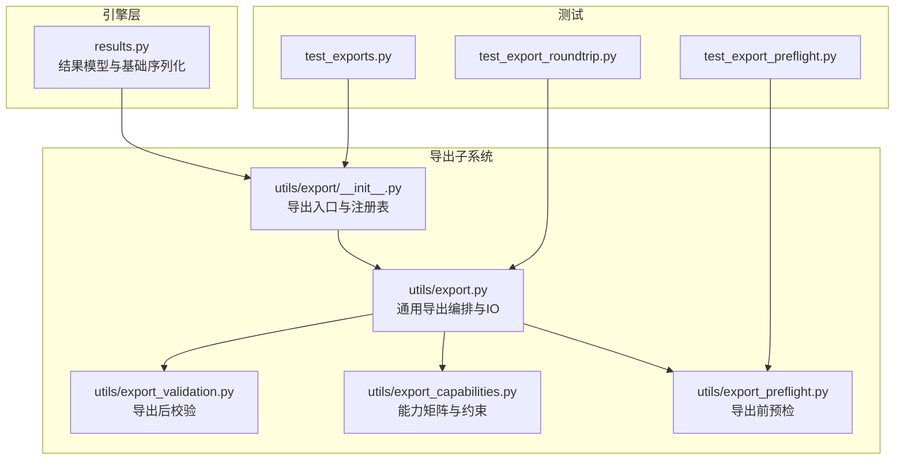
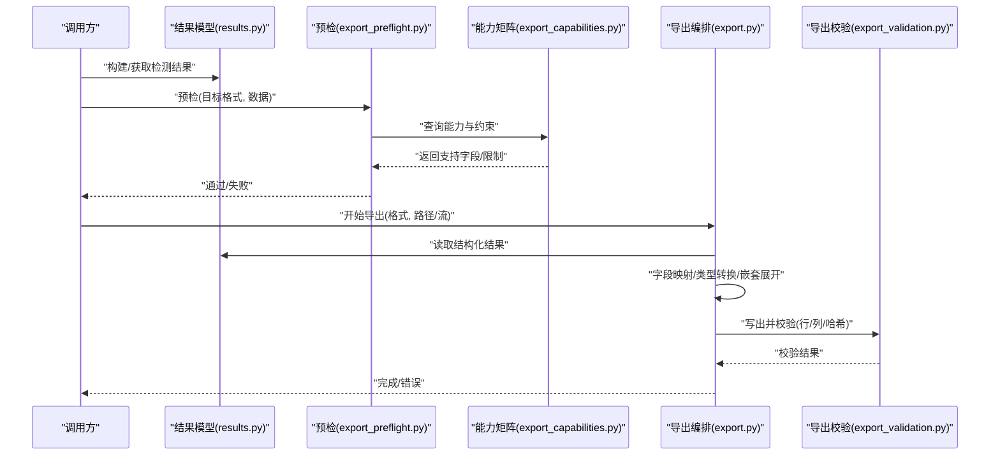
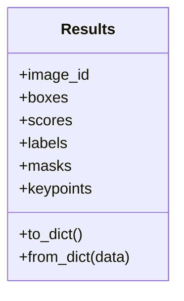
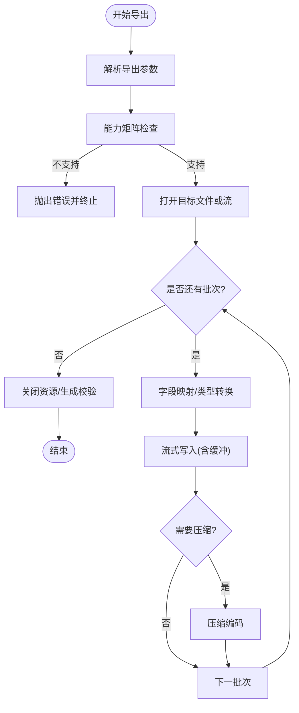
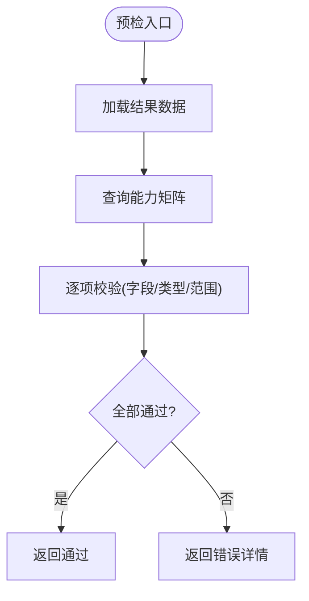
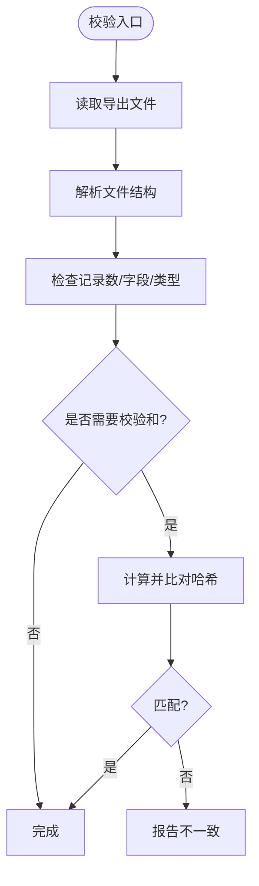
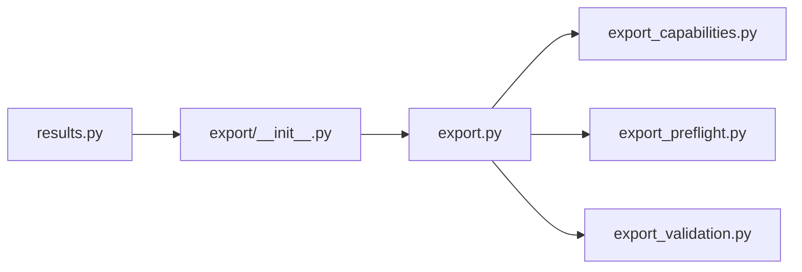

# 序列化与导出

<cite>
**本文引用的文件**
- [ultralytics/engine/results.py](file://ultralytics/engine/results.py)
- [ultralytics/utils/export/__init__.py](file://ultralytics/utils/export/__init__.py)
- [ultralytics/utils/export.py](file://ultralytics/utils/export.py)
- [ultralytics/utils/export_validation.py](file://ultralytics/utils/export_validation.py)
- [ultralytics/utils/export_capabilities.py](file://ultralytics/utils/export_capabilities.py)
- [ultralytics/utils/export_preflight.py](file://ultralytics/utils/export_preflight.py)
- [tests/test_export_roundtrip.py](file://tests/test_export_roundtrip.py)
- [tests/test_export_preflight.py](file://tests/test_export_preflight.py)
- [tests/test_exports.py](file://tests/test_exports.py)
</cite>

## 目录
1. [简介](#简介)
2. [项目结构](#项目结构)
3. [核心组件](#核心组件)
4. [架构总览](#架构总览)
5. [详细组件分析](#详细组件分析)
6. [依赖关系分析](#依赖关系分析)
7. [性能考虑](#性能考虑)
8. [故障排查指南](#故障排查指南)
9. [结论](#结论)
10. [附录](#附录)

## 简介
本技术文档聚焦于 YOLO-Master 的结果序列化与导出系统，围绕以下目标展开：
- 结果数据的序列化机制（JSON、CSV、XML 等）及反序列化实现
- 不同导出格式的数据结构定义（字段映射、类型转换、嵌套对象处理）
- 批量导出优化策略（流式写入、内存缓冲、压缩编码）
- 版本兼容性管理（向前/向后兼容与数据迁移）
- 自定义导出器开发接口（扩展新格式）
- 大数据集处理策略（分块、增量导出、断点续传）
- 导出质量验证与完整性检查工具
- 错误恢复与数据修复机制

## 项目结构
与“结果序列化与导出”直接相关的代码主要分布在以下模块：
- 引擎层结果模型：负责推理结果的统一表示与基础序列化能力
- 导出子系统：提供多格式导出、预检、能力矩阵、校验与兼容性支持
- 测试套件：覆盖往返一致性、预检流程与导出能力

图表来源
- [ultralytics/engine/results.py](file://ultralytics/engine/results.py)
- [ultralytics/utils/export/__init__.py](file://ultralytics/utils/export/__init__.py)
- [ultralytics/utils/export.py](file://ultralytics/utils/export.py)
- [ultralytics/utils/export_validation.py](file://ultralytics/utils/export_validation.py)
- [ultralytics/utils/export_capabilities.py](file://ultralytics/utils/export_capabilities.py)
- [ultralytics/utils/export_preflight.py](file://ultralytics/utils/export_preflight.py)
- [tests/test_export_roundtrip.py](file://tests/test_export_roundtrip.py)
- [tests/test_export_preflight.py](file://tests/test_export_preflight.py)
- [tests/test_exports.py](file://tests/test_exports.py)

章节来源
- [ultralytics/engine/results.py](file://ultralytics/engine/results.py)
- [ultralytics/utils/export/__init__.py](file://ultralytics/utils/export/__init__.py)
- [ultralytics/utils/export.py](file://ultralytics/utils/export.py)
- [ultralytics/utils/export_validation.py](file://ultralytics/utils/export_validation.py)
- [ultralytics/utils/export_capabilities.py](file://ultralytics/utils/export_capabilities.py)
- [ultralytics/utils/export_preflight.py](file://ultralytics/utils/export_preflight.py)
- [tests/test_export_roundtrip.py](file://tests/test_export_roundtrip.py)
- [tests/test_export_preflight.py](file://tests/test_export_preflight.py)
- [tests/test_exports.py](file://tests/test_exports.py)

## 核心组件
- 结果模型与基础序列化
  - 提供统一的检测结果数据结构，包含图像标识、类别、置信度、边界框、掩码、关键点等字段。
  - 暴露基础的 to_dict / from_dict 或等价方法，用于 JSON 序列化与反序列化的中间表示。
  - 对数值类型进行规范化（如浮点精度、NaN/Inf 处理），确保跨语言/平台一致。
- 导出编排与 IO
  - 根据目标格式选择对应导出器，执行字段映射、类型转换与嵌套对象展开。
  - 支持批量导出、流式写入与可选压缩输出。
- 导出预检与能力矩阵
  - 在导出前检查输入数据是否满足目标格式要求（如缺失字段、非法值）。
  - 通过能力矩阵声明各格式支持的字段与约束，避免运行时错误。
- 导出后校验
  - 对已写出的文件进行完整性校验（如行数、字段一致性、哈希校验）。
- 测试与回归
  - 往返一致性测试确保序列化/反序列化不丢失信息。
  - 预检与导出能力测试保障新增格式的正确性。

章节来源
- [ultralytics/engine/results.py](file://ultralytics/engine/results.py)
- [ultralytics/utils/export/__init__.py](file://ultralytics/utils/export/__init__.py)
- [ultralytics/utils/export.py](file://ultralytics/utils/export.py)
- [ultralytics/utils/export_validation.py](file://ultralytics/utils/export_validation.py)
- [ultralytics/utils/export_capabilities.py](file://ultralytics/utils/export_capabilities.py)
- [tests/test_export_roundtrip.py](file://tests/test_export_roundtrip.py)
- [tests/test_export_preflight.py](file://tests/test_export_preflight.py)
- [tests/test_exports.py](file://tests/test_exports.py)

## 架构总览
下图展示了从结果模型到多格式导出的整体流程，包括预检、导出编排、校验与能力矩阵的参与。

图表来源
- [ultralytics/engine/results.py](file://ultralytics/engine/results.py)
- [ultralytics/utils/export_preflight.py](file://ultralytics/utils/export_preflight.py)
- [ultralytics/utils/export_capabilities.py](file://ultralytics/utils/export_capabilities.py)
- [ultralytics/utils/export.py](file://ultralytics/utils/export.py)
- [ultralytics/utils/export_validation.py](file://ultralytics/utils/export_validation.py)

## 详细组件分析

### 结果模型与基础序列化（results.py）
- 职责
  - 定义检测结果的统一数据结构，封装图像级与实例级属性。
  - 提供序列化/反序列化的基础方法，作为所有导出格式的中间表示。
- 关键设计
  - 字段映射：将内部张量/数组转换为可序列化的列表/标量。
  - 类型安全：对坐标归一化、置信度范围、类别索引等进行校验与转换。
  - 嵌套对象：将掩码、关键点、轨迹信息等复杂结构扁平化或分层序列化。
- 复杂度与性能
  - 序列化通常为 O(N)（N 为实例数），注意大掩码的体积控制。
  - 建议对高频字段使用缓存视图，减少重复计算。

图表来源
- [ultralytics/engine/results.py](file://ultralytics/engine/results.py)

章节来源
- [ultralytics/engine/results.py](file://ultralytics/engine/results.py)

### 导出编排与 IO（export.py）
- 职责
  - 根据目标格式选择具体导出器，执行字段映射、类型转换、嵌套对象处理。
  - 支持批量导出、流式写入、压缩编码与进度反馈。
- 关键流程
  - 解析导出参数（路径、格式、压缩、分块大小等）。
  - 遍历结果集，按批次写入目标文件/流。
  - 可选：生成校验文件（如 .md5/.sha256）。
- 批量优化
  - 流式写入：避免一次性加载全部结果到内存。
  - 内存缓冲：按固定批大小聚合后再写入，平衡 I/O 与内存占用。
  - 压缩编码：对文本格式启用 gzip/zstd 等压缩以降低存储与传输成本。

图表来源
- [ultralytics/utils/export.py](file://ultralytics/utils/export.py)
- [ultralytics/utils/export_capabilities.py](file://ultralytics/utils/export_capabilities.py)

章节来源
- [ultralytics/utils/export.py](file://ultralytics/utils/export.py)
- [ultralytics/utils/export_capabilities.py](file://ultralytics/utils/export_capabilities.py)

### 导出预检（export_preflight.py）
- 职责
  - 在正式导出前检查输入数据是否符合目标格式要求。
  - 基于能力矩阵判断字段存在性、取值范围与数据类型。
- 典型检查项
  - 必填字段是否存在（如 image_id、boxes、scores、labels）。
  - 数值范围合法性（如置信度在 [0,1]，坐标在合理范围）。
  - 嵌套对象完整性（如 masks/keypoints 维度匹配）。
- 输出
  - 通过：允许进入导出阶段。
  - 失败：返回详细错误定位，便于用户修正数据。

图表来源
- [ultralytics/utils/export_preflight.py](file://ultralytics/utils/export_preflight.py)
- [ultralytics/utils/export_capabilities.py](file://ultralytics/utils/export_capabilities.py)

章节来源
- [ultralytics/utils/export_preflight.py](file://ultralytics/utils/export_preflight.py)
- [ultralytics/utils/export_capabilities.py](file://ultralytics/utils/export_capabilities.py)

### 导出能力矩阵（export_capabilities.py）
- 职责
  - 声明各导出格式的支持字段、数据类型、约束与可选特性。
  - 为预检与导出编排提供权威参考。
- 内容示例（概念性）
  - JSON：支持完整嵌套结构；可选压缩；支持元数据头。
  - CSV：扁平化表格；需指定分隔符与编码；不支持复杂嵌套。
  - XML：层级结构；命名空间与 Schema 校验；适合严格契约场景。
- 作用
  - 防止运行时出现未知字段或类型不匹配。
  - 为新格式扩展提供模板与规范。

章节来源
- [ultralytics/utils/export_capabilities.py](file://ultralytics/utils/export_capabilities.py)

### 导出后校验（export_validation.py）
- 职责
  - 对已写出的文件进行完整性与一致性检查。
  - 可选：计算并保存校验和（MD5/SHA256）。
- 检查项
  - 文件格式正确性（如 JSON 可解析、CSV 行列一致）。
  - 记录数量与预期一致。
  - 关键字段非空且类型正确。
- 输出
  - 通过：导出成功。
  - 失败：回滚或标记损坏文件，提示修复。

图表来源
- [ultralytics/utils/export_validation.py](file://ultralytics/utils/export_validation.py)

章节来源
- [ultralytics/utils/export_validation.py](file://ultralytics/utils/export_validation.py)

### 导出入口与注册表（utils/export/__init__.py）
- 职责
  - 提供统一的导出 API 入口。
  - 维护导出器注册表，支持动态发现与扩展。
- 扩展方式
  - 实现标准导出器接口（字段映射、写入逻辑、压缩支持）。
  - 在注册表中登记新格式名称与能力描述。
- 典型用法
  - 调用统一入口函数，传入目标格式、数据源与导出参数。
  - 由注册表路由至具体导出器执行。

章节来源
- [ultralytics/utils/export/__init__.py](file://ultralytics/utils/export/__init__.py)

### 测试与回归（tests/*）
- 往返一致性（test_export_roundtrip.py）
  - 验证序列化→反序列化后的数据等价性。
  - 覆盖常见字段与边界情况。
- 预检流程（test_export_preflight.py）
  - 验证预检规则与错误报告。
- 导出能力（test_exports.py）
  - 验证各格式导出行为与能力矩阵一致性。

章节来源
- [tests/test_export_roundtrip.py](file://tests/test_export_roundtrip.py)
- [tests/test_export_preflight.py](file://tests/test_export_preflight.py)
- [tests/test_exports.py](file://tests/test_exports.py)

## 依赖关系分析
- 组件耦合
  - results.py 为导出子系统的上游数据源。
  - export.py 依赖 capabilities、preflight、validation 以形成完整的导出流水线。
  - __init__.py 作为注册中心，解耦具体导出器实现。
- 外部依赖
  - 标准库 JSON/CSV/XML 解析与写入。
  - 可选压缩库（gzip/zstd）与哈希库（hashlib）。
- 潜在循环依赖
  - 通过注册表与接口抽象避免循环导入。

图表来源
- [ultralytics/engine/results.py](file://ultralytics/engine/results.py)
- [ultralytics/utils/export/__init__.py](file://ultralytics/utils/export/__init__.py)
- [ultralytics/utils/export.py](file://ultralytics/utils/export.py)
- [ultralytics/utils/export_capabilities.py](file://ultralytics/utils/export_capabilities.py)
- [ultralytics/utils/export_preflight.py](file://ultralytics/utils/export_preflight.py)
- [ultralytics/utils/export_validation.py](file://ultralytics/utils/export_validation.py)

章节来源
- [ultralytics/engine/results.py](file://ultralytics/engine/results.py)
- [ultralytics/utils/export/__init__.py](file://ultralytics/utils/export/__init__.py)
- [ultralytics/utils/export.py](file://ultralytics/utils/export.py)
- [ultralytics/utils/export_capabilities.py](file://ultralytics/utils/export_capabilities.py)
- [ultralytics/utils/export_preflight.py](file://ultralytics/utils/export_preflight.py)
- [ultralytics/utils/export_validation.py](file://ultralytics/utils/export_validation.py)

## 性能考虑
- 流式写入
  - 针对大规模结果集，采用迭代器/生成器模式逐批写入，降低峰值内存。
- 内存缓冲
  - 设置合适的批大小，平衡 I/O 次数与内存占用。
- 压缩编码
  - 对文本格式启用压缩，显著减小体积；权衡 CPU 开销与磁盘 I/O。
- 并发与并行
  - 在多核环境下可对独立图像结果并行序列化与写入（注意线程安全与锁）。
- 缓存与复用
  - 对频繁使用的字段映射与类型转换器进行缓存，减少重复计算。

[本节为通用指导，无需特定文件引用]

## 故障排查指南
- 常见问题
  - 字段缺失或类型不匹配：检查能力矩阵与预检规则。
  - 导出文件损坏：运行导出后校验，查看校验和是否一致。
  - 内存溢出：调小批大小或启用流式写入。
  - 压缩失败：确认压缩库可用与权限正常。
- 错误恢复
  - 断点续传：记录已导出批次，异常后从断点继续。
  - 增量导出：仅导出新增或变更结果，减少重复工作。
  - 数据修复：对非法值进行默认填充或丢弃，并记录修复日志。
- 诊断工具
  - 预检报告：定位问题字段与原因。
  - 校验报告：输出文件完整性与一致性摘要。

章节来源
- [ultralytics/utils/export_preflight.py](file://ultralytics/utils/export_preflight.py)
- [ultralytics/utils/export_validation.py](file://ultralytics/utils/export_validation.py)

## 结论
YOLO-Master 的结果序列化与导出系统通过清晰的分层设计与严格的预检/校验机制，提供了稳定、可扩展的多格式导出能力。借助能力矩阵与注册表，用户可以便捷地扩展新格式；结合流式写入、缓冲与压缩，系统能够高效处理大规模数据集。完善的测试与诊断工具进一步保障了导出质量与可维护性。

[本节为总结性内容，无需特定文件引用]

## 附录

### 数据结构与字段映射（概念说明）
- 图像级字段
  - image_id：字符串或整数，唯一标识图像。
  - width/height：图像尺寸，用于坐标还原。
- 实例级字段
  - boxes：二维数组，顺序为 [x_min, y_min, x_max, y_max] 或 [cx, cy, w, h]（依格式约定）。
  - scores：置信度，浮点数，范围 [0,1]。
  - labels：类别索引或标签名，依据配置映射。
  - masks：二值掩码或多边形轮廓，视格式支持而定。
  - keypoints：关键点坐标与可见性标志。
- 类型转换与嵌套处理
  - 张量→列表：确保跨语言兼容。
  - NaN/Inf→null 或默认值：保证 JSON/CSV 可解析。
  - 嵌套对象→扁平化或分层：根据目标格式能力决定。

[本节为概念性说明，无需特定文件引用]

### 版本兼容性与数据迁移（概念说明）
- 向前兼容
  - 新版本导出器应能读取旧版数据，忽略未知字段。
- 向后兼容
  - 旧版本导出器应能容忍新版数据中的新增字段。
- 迁移策略
  - 在导出时附加元数据头（版本号、Schema 版本）。
  - 提供迁移脚本，自动补齐缺失字段或重命名字段。

[本节为概念性说明，无需特定文件引用]

### 自定义导出器开发接口（概念说明）
- 接口要点
  - 实现字段映射函数：将结果模型转为目标格式的行/节点。
  - 实现写入函数：支持流式/缓冲/压缩。
  - 注册导出器：在注册表中登记名称、能力描述与依赖。
- 最佳实践
  - 遵循能力矩阵定义，确保预检与校验通过。
  - 提供单元测试，覆盖往返一致性与边界情况。

[本节为概念性说明，无需特定文件引用]