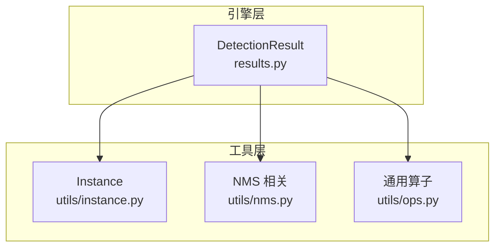
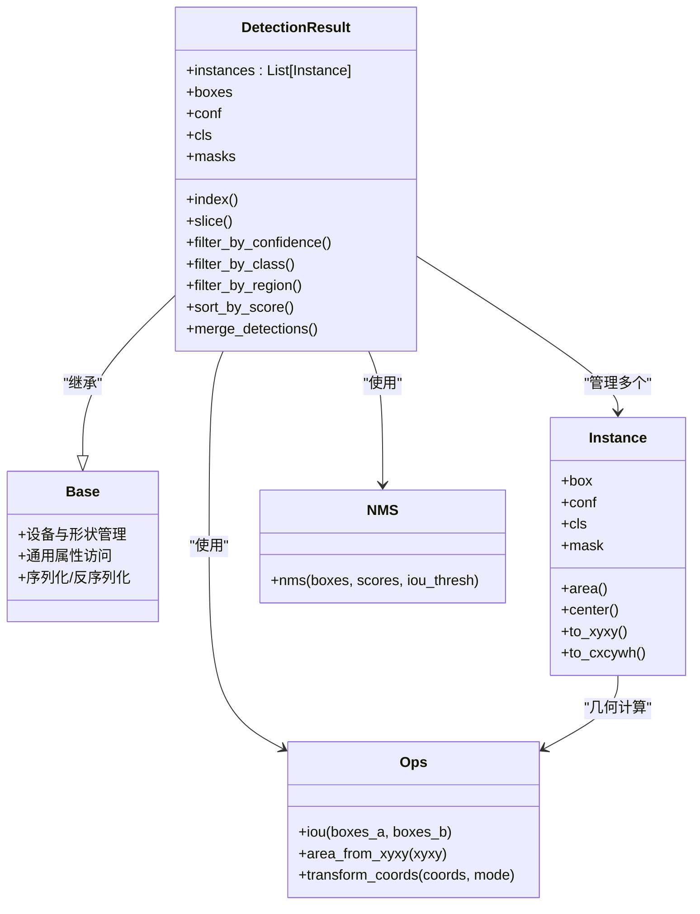
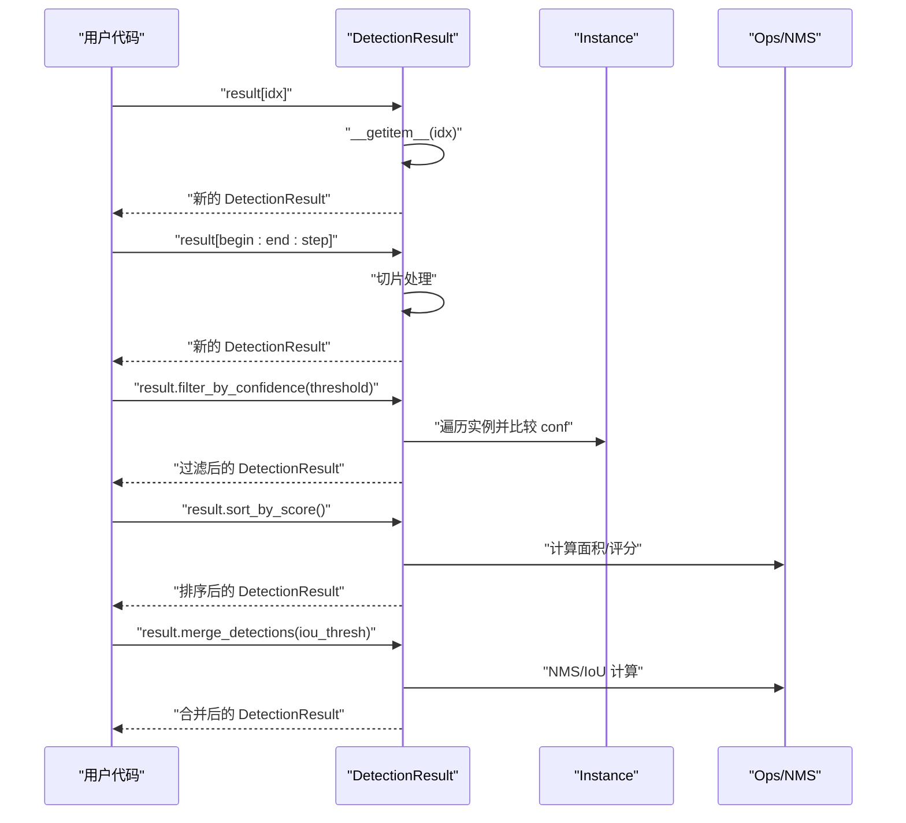
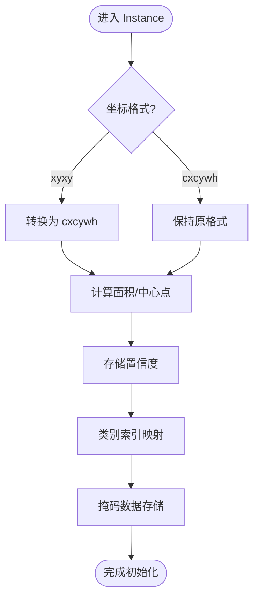
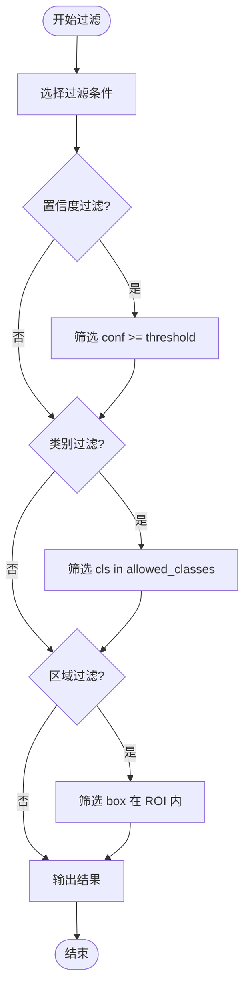
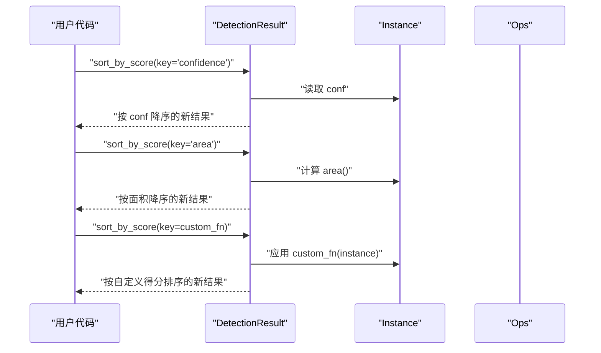
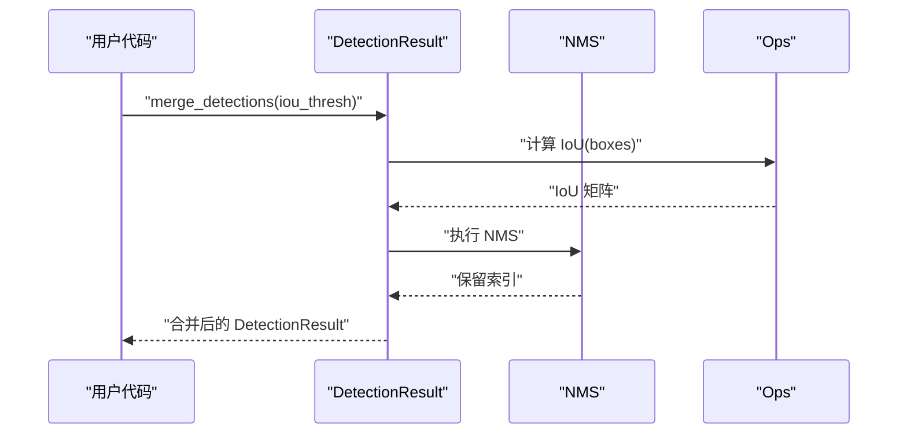
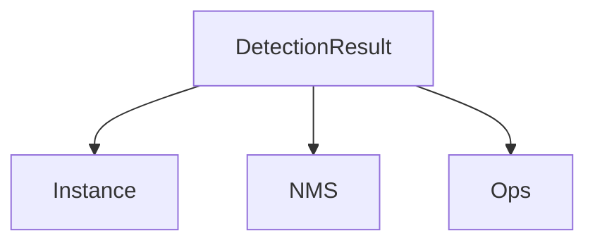

# 检测结果数据模型

<cite>
**本文引用的文件**
- [ultralytics/engine/results.py](file://ultralytics/engine/results.py)
- [ultralytics/utils/instance.py](file://ultralytics/utils/instance.py)
- [ultralytics/utils/nms.py](file://ultralytics/utils/nms.py)
- [ultralytics/utils/ops.py](file://ultralytics/utils/ops.py)
</cite>

## 目录
1. [简介](#简介)
2. [项目结构](#项目结构)
3. [核心组件](#核心组件)
4. [架构总览](#架构总览)
5. [详细组件分析](#详细组件分析)
6. [依赖关系分析](#依赖关系分析)
7. [性能考虑](#性能考虑)
8. [故障排查指南](#故障排查指南)
9. [结论](#结论)
10. [附录](#附录)

## 简介
本技术文档聚焦于 YOLO-Master 检测结果显示系统中的“检测结果数据模型”，围绕 DetectionResult 类的设计与实现进行深入解析。内容涵盖：
- 继承自 Base 类的核心属性与方法
- 实例对象（Instance）管理机制，包括边界框坐标系统、置信度存储、类别标签映射与掩码数据结构化表示
- 结果对象的属性访问模式（索引、切片、批量处理）
- 结果过滤算法（置信度阈值、类别筛选、空间区域过滤）
- 排序与排名机制（按置信度、面积或自定义指标）
- 结果聚合与合并策略（重复检测与冲突解决）
- 内存管理与性能优化建议
- 典型使用场景与操作示例（以路径引用方式提供）

## 项目结构
检测结果数据模型主要位于引擎层的结果模块与工具层的实例与算子模块中，关键文件如下：
- ultralytics/engine/results.py：定义 DetectionResult 及其与 Base 的集成、索引/切片/批量接口、过滤/排序/合并等高层逻辑
- ultralytics/utils/instance.py：定义 Instance 数据结构，封装单条检测结果的边界框、置信度、类别、掩码等
- ultralytics/utils/nms.py：非极大值抑制（NMS）相关实现，用于去重与冲突消解
- ultralytics/utils/ops.py：通用张量与几何运算，为坐标变换、面积计算、IoU 计算等提供底层支持

图表来源
- [ultralytics/engine/results.py](file://ultralytics/engine/results.py)
- [ultralytics/utils/instance.py](file://ultralytics/utils/instance.py)
- [ultralytics/utils/nms.py](file://ultralytics/utils/nms.py)
- [ultralytics/utils/ops.py](file://ultralytics/utils/ops.py)

章节来源
- [ultralytics/engine/results.py](file://ultralytics/engine/results.py)
- [ultralytics/utils/instance.py](file://ultralytics/utils/instance.py)
- [ultralytics/utils/nms.py](file://ultralytics/utils/nms.py)
- [ultralytics/utils/ops.py](file://ultralytics/utils/ops.py)

## 核心组件
- DetectionResult：检测结果容器，负责管理多实例（Instances）、提供统一的属性访问、过滤、排序、合并与可视化接口；通常继承自 Base 以获得通用能力（如设备一致性、形状广播、序列化等）。
- Instance：单条检测结果的载体，包含边界框坐标、置信度、类别索引/标签、可选掩码等字段，并提供几何计算（面积、中心点、宽高）与坐标变换方法。

章节来源
- [ultralytics/engine/results.py](file://ultralytics/engine/results.py)
- [ultralytics/utils/instance.py](file://ultralytics/utils/instance.py)

## 架构总览
下图展示了 DetectionResult 与其依赖之间的关系，以及关键流程（过滤、排序、合并）在组件间的调用路径。

图表来源
- [ultralytics/engine/results.py](file://ultralytics/engine/results.py)
- [ultralytics/utils/instance.py](file://ultralytics/utils/instance.py)
- [ultralytics/utils/nms.py](file://ultralytics/utils/nms.py)
- [ultralytics/utils/ops.py](file://ultralytics/utils/ops.py)

## 详细组件分析

### DetectionResult 设计架构
- 继承关系：DetectionResult 继承自 Base，复用设备一致性、形状广播、序列化等基础能力，确保在多设备（CPU/GPU）环境下稳定运行。
- 核心属性：
  - instances：内部维护的实例列表，承载所有检测结果
  - boxes/conf/cls/masks：便捷属性，分别返回当前可见实例的边界框、置信度、类别索引与掩码集合
- 关键方法：
  - 索引与切片：支持整数索引、切片与布尔掩码，返回新的 DetectionResult 视图或副本
  - 过滤：按置信度阈值、类别集合、空间区域进行筛选
  - 排序：按置信度、面积或自定义指标排序，返回新结果
  - 合并：基于 NMS 或 IoU 阈值进行重复检测合并与冲突解决
  - 批量处理：对 batch 维度的结果进行统一操作（保持维度一致性）

章节来源
- [ultralytics/engine/results.py](file://ultralytics/engine/results.py)

#### 属性访问与索引/切片/批量处理
- 索引操作：通过 __getitem__ 支持按索引或切片获取子集，返回新的 DetectionResult
- 切片操作：支持范围切片与步长，便于批内子序列处理
- 批量处理：对 batch 维度的结果进行向量化操作，避免逐条循环

图表来源
- [ultralytics/engine/results.py](file://ultralytics/engine/results.py)
- [ultralytics/utils/ops.py](file://ultralytics/utils/ops.py)
- [ultralytics/utils/nms.py](file://ultralytics/utils/nms.py)

章节来源
- [ultralytics/engine/results.py](file://ultralytics/engine/results.py)

### Instance 管理机制
- 边界框坐标系统：
  - 支持 xyxy（左上-右下）与 cxcywh（中心-宽高）两种格式
  - 提供 to_xyxy()/to_cxcywh() 转换方法，内部使用 Ops 的坐标变换
- 置信度存储：
  - 每条 Instance 保存标量置信度，用于排序与过滤
- 类别标签映射：
  - cls 字段存储类别索引，结合外部标签表可映射到人类可读名称
- 掩码数据结构化表示：
  - masks 字段为二值或多通道掩码，形状与输入图像尺寸一致或经缩放适配
  - 提供 area() 等方法计算掩码覆盖像素数

图表来源
- [ultralytics/utils/instance.py](file://ultralytics/utils/instance.py)
- [ultralytics/utils/ops.py](file://ultralytics/utils/ops.py)

章节来源
- [ultralytics/utils/instance.py](file://ultralytics/utils/instance.py)
- [ultralytics/utils/ops.py](file://ultralytics/utils/ops.py)

### 结果过滤算法
- 置信度阈值过滤：
  - 遍历 instances，保留 conf >= threshold 的实例
- 类别筛选：
  - 根据 cls 是否在指定类别集合中进行过滤
- 空间区域过滤：
  - 基于 box 的几何位置判断是否落在目标 ROI 区域内

图表来源
- [ultralytics/engine/results.py](file://ultralytics/engine/results.py)
- [ultralytics/utils/ops.py](file://ultralytics/utils/ops.py)

章节来源
- [ultralytics/engine/results.py](file://ultralytics/engine/results.py)
- [ultralytics/utils/ops.py](file://ultralytics/utils/ops.py)

### 排序与排名机制
- 按置信度排序：
  - 依据 conf 降序排列，返回新的 DetectionResult
- 按面积排序：
  - 使用 Instance.area() 计算面积，再排序
- 自定义指标排序：
  - 允许传入评分函数，对每个实例计算得分后排序

图表来源
- [ultralytics/engine/results.py](file://ultralytics/engine/results.py)
- [ultralytics/utils/instance.py](file://ultralytics/utils/instance.py)
- [ultralytics/utils/ops.py](file://ultralytics/utils/ops.py)

章节来源
- [ultralytics/engine/results.py](file://ultralytics/engine/results.py)
- [ultralytics/utils/instance.py](file://ultralytics/utils/instance.py)
- [ultralytics/utils/ops.py](file://ultralytics/utils/ops.py)

### 结果聚合与合并策略
- 重复检测合并：
  - 使用 NMS 或 IoU 阈值对重叠检测进行抑制，保留高分者
- 冲突解决：
  - 当同一区域存在多个类别预测时，优先选择置信度更高的类别
- 合并流程：
  - 计算 IoU -> 标记重叠 -> 选择高分 -> 生成最终结果

图表来源
- [ultralytics/engine/results.py](file://ultralytics/engine/results.py)
- [ultralytics/utils/nms.py](file://ultralytics/utils/nms.py)
- [ultralytics/utils/ops.py](file://ultralytics/utils/ops.py)

章节来源
- [ultralytics/engine/results.py](file://ultralytics/engine/results.py)
- [ultralytics/utils/nms.py](file://ultralytics/utils/nms.py)
- [ultralytics/utils/ops.py](file://ultralytics/utils/ops.py)

## 依赖关系分析
- DetectionResult 依赖：
  - Instance：作为基本单元，承载单条检测结果
  - NMS：用于去重与冲突消解
  - Ops：提供几何与张量运算支持
- 耦合与内聚：
  - DetectionResult 与 Instance 高内聚，职责清晰
  - 对外暴露统一接口，降低上层调用复杂度
- 外部依赖：
  - 无强外部库耦合，主要依赖 PyTorch 张量与内置数学运算

图表来源
- [ultralytics/engine/results.py](file://ultralytics/engine/results.py)
- [ultralytics/utils/instance.py](file://ultralytics/utils/instance.py)
- [ultralytics/utils/nms.py](file://ultralytics/utils/nms.py)
- [ultralytics/utils/ops.py](file://ultralytics/utils/ops.py)

章节来源
- [ultralytics/engine/results.py](file://ultralytics/engine/results.py)
- [ultralytics/utils/instance.py](file://ultralytics/utils/instance.py)
- [ultralytics/utils/nms.py](file://ultralytics/utils/nms.py)
- [ultralytics/utils/ops.py](file://ultralytics/utils/ops.py)

## 性能考虑
- 内存管理：
  - 尽量使用视图而非深拷贝，减少中间对象创建
  - 掩码数据较大时，按需加载与释放，避免一次性占用过多显存
- 向量化操作：
  - 过滤、排序与合并尽量采用张量级向量化，避免 Python 循环
- 设备一致性：
  - 确保所有张量在同一设备上，避免跨设备拷贝带来的开销
- 缓存与重用：
  - 对频繁计算的 IoU、面积等结果进行缓存，减少重复计算

## 故障排查指南
- 常见问题：
  - 坐标格式不一致导致面积/IoU 计算错误：检查 Instance 的坐标转换是否正确
  - 类别索引越界：确认类别映射表与实际模型输出维度一致
  - 掩码形状不匹配：确保掩码尺寸与输入图像或缩放后的尺寸一致
- 调试建议：
  - 打印关键属性（boxes/conf/cls/masks）的形状与数据类型
  - 逐步执行过滤/排序/合并流程，定位异常分支

章节来源
- [ultralytics/engine/results.py](file://ultralytics/engine/results.py)
- [ultralytics/utils/instance.py](file://ultralytics/utils/instance.py)
- [ultralytics/utils/ops.py](file://ultralytics/utils/ops.py)
- [ultralytics/utils/nms.py](file://ultralytics/utils/nms.py)

## 结论
DetectionResult 与 Instance 共同构成了 YOLO-Master 检测结果数据模型的核心。通过清晰的继承关系、丰富的属性访问接口、高效的过滤/排序/合并策略，以及对内存与性能的细致考量，该模型能够支撑复杂的多任务检测与后续分析需求。建议在工程实践中遵循向量化与设备一致性原则，并结合具体业务场景选择合适的过滤与合并参数。

## 附录
- 典型使用示例（路径引用）：
  - 索引与切片：参考 [ultralytics/engine/results.py](file://ultralytics/engine/results.py)
  - 置信度过滤：参考 [ultralytics/engine/results.py](file://ultralytics/engine/results.py)
  - 类别筛选：参考 [ultralytics/engine/results.py](file://ultralytics/engine/results.py)
  - 区域过滤：参考 [ultralytics/engine/results.py](file://ultralytics/engine/results.py)
  - 排序与排名：参考 [ultralytics/engine/results.py](file://ultralytics/engine/results.py)
  - 合并与去重：参考 [ultralytics/engine/results.py](file://ultralytics/engine/results.py)
  - 坐标转换与几何计算：参考 [ultralytics/utils/instance.py](file://ultralytics/utils/instance.py)、[ultralytics/utils/ops.py](file://ultralytics/utils/ops.py)
  - NMS 实现细节：参考 [ultralytics/utils/nms.py](file://ultralytics/utils/nms.py)