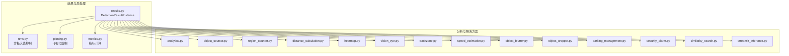
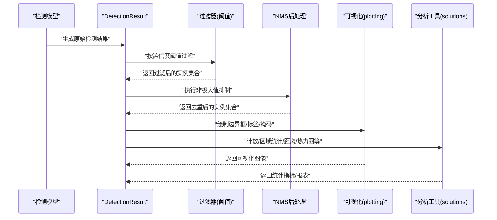
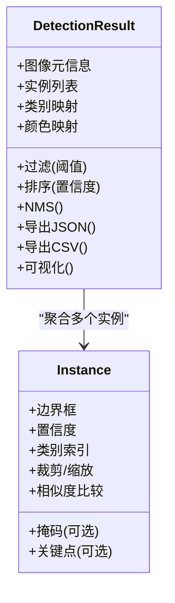
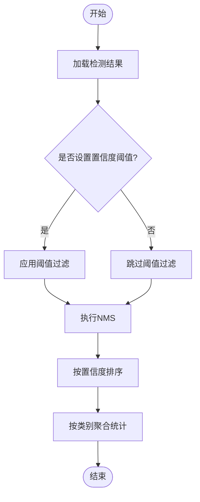
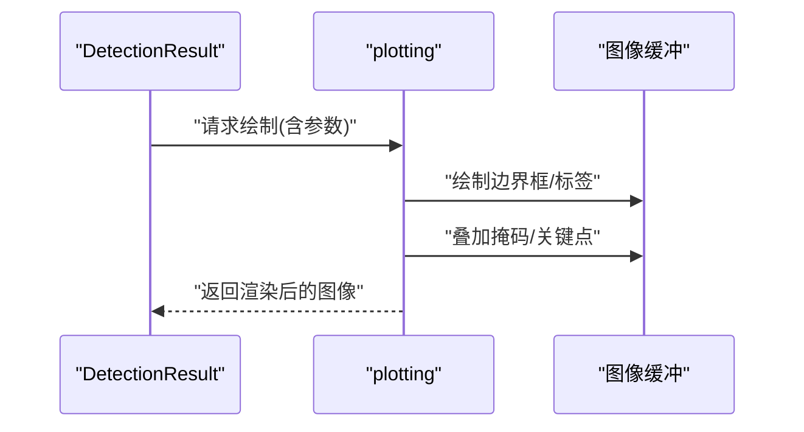
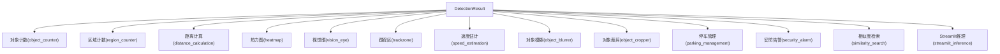
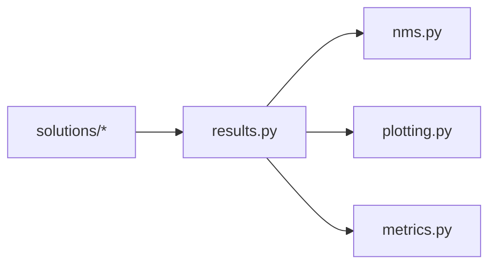

# 结果处理系统

<cite>
**本文引用的文件**
- [engine/results.py](file://ultralytics/engine/results.py)
- [utils/plotting.py](file://ultralytics/utils/plotting.py)
- [utils/nms.py](file://ultralytics/utils/nms.py)
- [utils/metrics.py](file://ultralytics/utils/metrics.py)
- [solutions/analytics.py](file://ultralytics/solutions/analytics.py)
- [solutions/object_counter.py](file://ultralytics/solutions/object_counter.py)
- [solutions/region_counter.py](file://ultralytics/solutions/region_counter.py)
- [solutions/distance_calculation.py](file://ultralytics/solutions/distance_calculation.py)
- [solutions/heatmap.py](file://ultralytics/solutions/heatmap.py)
- [solutions/vision_eye.py](file://ultralytics/solutions/vision_eye.py)
- [solutions/trackzone.py](file://ultralytics/solutions/trackzone.py)
- [solutions/speed_estimation.py](file://ultralytics/solutions/speed_estimation.py)
- [solutions/object_blurrer.py](file://ultralytics/solutions/object_blurrer.py)
- [solutions/object_cropper.py](file://ultralytics/solutions/object_cropper.py)
- [solutions/parking_management.py](file://ultralytics/solutions/parking_management.py)
- [solutions/security_alarm.py](file://ultralytics/solutions/security_alarm.py)
- [solutions/similarity_search.py](file://ultralytics/solutions/similarity_search.py)
- [solutions/streamlit_inference.py](file://ultralytics/solutions/streamlit_inference.py)
</cite>

## 目录
1. [简介](#简介)
2. [项目结构](#项目结构)
3. [核心组件](#核心组件)
4. [架构总览](#架构总览)
5. [详细组件分析](#详细组件分析)
6. [依赖关系分析](#依赖关系分析)
7. [性能考虑](#性能考虑)
8. [故障排查指南](#故障排查指南)
9. [结论](#结论)
10. [附录](#附录)

## 简介
本技术文档聚焦于 YOLO-Master 的结果处理系统，围绕 DetectionResult 类的设计与数据模型、实例对象（Instance）管理、过滤与排序算法（置信度阈值与 NMS）、可视化渲染、序列化与反序列化、缓存与内存优化、分析与统计工具以及多线程安全访问模式进行系统化说明。目标是帮助开发者快速理解并高效使用检测结果数据结构及其周边生态。

## 项目结构
结果处理系统主要位于以下模块：
- 结果数据模型与操作：ultralytics/engine/results.py
- 可视化渲染：ultralytics/utils/plotting.py
- 后处理（NMS）：ultralytics/utils/nms.py
- 指标与评估：ultralytics/utils/metrics.py
- 分析与解决方案：ultralytics/solutions/*

图表来源
- [engine/results.py](file://ultralytics/engine/results.py)
- [utils/nms.py](file://ultralytics/utils/nms.py)
- [utils/plotting.py](file://ultralytics/utils/plotting.py)
- [utils/metrics.py](file://ultralytics/utils/metrics.py)
- [solutions/analytics.py](file://ultralytics/solutions/analytics.py)
- [solutions/object_counter.py](file://ultralytics/solutions/object_counter.py)
- [solutions/region_counter.py](file://ultralytics/solutions/region_counter.py)
- [solutions/distance_calculation.py](file://ultralytics/solutions/distance_calculation.py)
- [solutions/heatmap.py](file://ultralytics/solutions/heatmap.py)
- [solutions/vision_eye.py](file://ultralytics/solutions/vision_eye.py)
- [solutions/trackzone.py](file://ultralytics/solutions/trackzone.py)
- [solutions/speed_estimation.py](file://ultralytics/solutions/speed_estimation.py)
- [solutions/object_blurrer.py](file://ultralytics/solutions/object_blurrer.py)
- [solutions/object_cropper.py](file://ultralytics/solutions/object_cropper.py)
- [solutions/parking_management.py](file://ultralytics/solutions/parking_management.py)
- [solutions/security_alarm.py](file://ultralytics/solutions/security_alarm.py)
- [solutions/similarity_search.py](file://ultralytics/solutions/similarity_search.py)
- [solutions/streamlit_inference.py](file://ultralytics/solutions/streamlit_inference.py)

章节来源
- [engine/results.py](file://ultralytics/engine/results.py)
- [utils/plotting.py](file://ultralytics/utils/plotting.py)
- [utils/nms.py](file://ultralytics/utils/nms.py)
- [utils/metrics.py](file://ultralytics/utils/metrics.py)
- [solutions/analytics.py](file://ultralytics/solutions/analytics.py)
- [solutions/object_counter.py](file://ultralytics/solutions/object_counter.py)
- [solutions/region_counter.py](file://ultralytics/solutions/region_counter.py)
- [solutions/distance_calculation.py](file://ultralytics/solutions/distance_calculation.py)
- [solutions/heatmap.py](file://ultralytics/solutions/heatmap.py)
- [solutions/vision_eye.py](file://ultralytics/solutions/vision_eye.py)
- [solutions/trackzone.py](file://ultralytics/solutions/trackzone.py)
- [solutions/speed_estimation.py](file://ultralytics/solutions/speed_estimation.py)
- [solutions/object_blurrer.py](file://ultralytics/solutions/object_blurrer.py)
- [solutions/object_cropper.py](file://ultralytics/solutions/object_cropper.py)
- [solutions/parking_management.py](file://ultralytics/solutions/parking_management.py)
- [solutions/security_alarm.py](file://ultralytics/solutions/security_alarm.py)
- [solutions/similarity_search.py](file://ultralytics/solutions/similarity_search.py)
- [solutions/streamlit_inference.py](file://ultralytics/solutions/streamlit_inference.py)

## 核心组件
本节聚焦 DetectionResult 的数据模型与能力边界，包括：
- 结构化表示：图像级结果容器，聚合多个实例（Instance）。
- 属性访问：提供便捷方法用于获取类别、置信度、边界框、掩码等。
- 实例管理：增删改查、筛选、排序、切片、视图转换。
- 后处理集成：支持置信度阈值过滤与 NMS 合并。
- 可视化：一键绘制边界框、标签、颜色映射与掩码。
- 序列化：导出为 JSON/CSV 等格式，便于存储与交换。
- 缓存与内存优化：惰性计算、视图共享、张量复用。
- 线程安全：只读访问的并发安全策略。

章节来源
- [engine/results.py](file://ultralytics/engine/results.py)

## 架构总览
下图展示了从推理到结果处理的端到端流程，包括过滤、NMS、可视化与分析。

图表来源
- [engine/results.py](file://ultralytics/engine/results.py)
- [utils/nms.py](file://ultralytics/utils/nms.py)
- [utils/plotting.py](file://ultralytics/utils/plotting.py)
- [solutions/analytics.py](file://ultralytics/solutions/analytics.py)
- [solutions/object_counter.py](file://ultralytics/solutions/object_counter.py)
- [solutions/region_counter.py](file://ultralytics/solutions/region_counter.py)
- [solutions/distance_calculation.py](file://ultralytics/solutions/distance_calculation.py)
- [solutions/heatmap.py](file://ultralytics/solutions/heatmap.py)

## 详细组件分析

### DetectionResult 类设计与数据模型
- 设计目标
  - 统一封装单张图像的检测结果，屏蔽底层张量细节，提供高层 API。
  - 支持多任务输出（检测、分割、姿态等），通过实例对象承载具体信息。
- 数据模型
  - 图像元信息：尺寸、路径、设备、时间戳等。
  - 实例列表：每个 Instance 包含边界框、置信度、类别索引、掩码（可选）、关键点（可选）等。
  - 辅助字段：类别名称映射、颜色映射、自定义标注等。
- 属性访问
  - 提供只读视图与便捷方法，如按类别筛选、按置信度排序、批量导出等。
  - 支持切片与迭代，便于下游消费。
- 复杂度与内存
  - 典型 O(n) 遍历与筛选；掩码与关键点可能带来额外内存占用。
  - 建议按需加载与释放大对象，避免重复拷贝。

图表来源
- [engine/results.py](file://ultralytics/engine/results.py)

章节来源
- [engine/results.py](file://ultralytics/engine/results.py)

### 实例对象（Instance）管理机制
- 存储内容
  - 边界框：归一化或像素坐标，支持多种格式转换。
  - 置信度：分类或回归置信度，用于排序与过滤。
  - 类别标签：整数索引与文本名称映射。
  - 掩码：二值或多通道掩码，用于分割任务。
  - 关键点：姿态估计相关点集。
- 操作方法
  - 几何变换：缩放、平移、旋转、裁剪。
  - 比较与匹配：IoU、相似度度量。
  - 视图与派生：生成子视图、批量导出。
- 性能要点
  - 掩码与关键点采用惰性计算与共享视图，减少内存复制。
  - 提供原地修改与不可变视图两种模式，兼顾效率与安全。

章节来源
- [engine/results.py](file://ultralytics/engine/results.py)

### 结果过滤与排序算法
- 置信度阈值过滤
  - 输入：阈值 t ∈ [0,1]。
  - 过程：遍历实例，保留置信度 ≥ t 的实例。
  - 输出：新的结果视图或就地更新。
- NMS 后处理
  - 输入：IoU 阈值、每类独立或全局策略。
  - 过程：按置信度降序选择候选框，剔除重叠度过高的框。
  - 输出：去重后的实例集合。
- 结果聚合
  - 按类别聚合计数、平均置信度、覆盖面积等。
  - 跨帧聚合（视频流场景）：基于轨迹 ID 或空间一致性。

图表来源
- [engine/results.py](file://ultralytics/engine/results.py)
- [utils/nms.py](file://ultralytics/utils/nms.py)

章节来源
- [engine/results.py](file://ultralytics/engine/results.py)
- [utils/nms.py](file://ultralytics/utils/nms.py)

### 可视化渲染系统
- 功能范围
  - 边界框绘制：线宽、颜色、透明度。
  - 标签显示：类别名称、置信度、ID。
  - 掩码叠加：半透明填充、边缘高亮。
  - 关键点连线：骨架连接顺序与样式。
- 颜色映射
  - 基于类别哈希或调色板分配颜色，保证区分度。
  - 支持自定义配色方案与主题切换。
- 渲染接口
  - 提供一次性绘制与增量绘制两种模式。
  - 支持将结果直接写入图像缓冲区，避免中间拷贝。

图表来源
- [utils/plotting.py](file://ultralytics/utils/plotting.py)
- [engine/results.py](file://ultralytics/engine/results.py)

章节来源
- [utils/plotting.py](file://ultralytics/utils/plotting.py)
- [engine/results.py](file://ultralytics/engine/results.py)

### 结果序列化与反序列化
- 支持的格式
  - JSON：结构化、可读性强，适合配置与报告。
  - CSV：表格化、便于数据分析与导入导出。
- 字段规范
  - 基础字段：图像标识、时间戳、设备信息。
  - 实例字段：边界框、置信度、类别、掩码路径或编码。
  - 元数据：类别名表、颜色映射、版本信息。
- 兼容性
  - 提供版本迁移与降级兼容逻辑。
  - 缺失字段时提供默认值与警告提示。

章节来源
- [engine/results.py](file://ultralytics/engine/results.py)

### 结果缓存与内存优化策略
- 缓存机制
  - 对昂贵计算（如掩码生成、关键点插值）启用缓存键与失效策略。
  - 视图共享：多次筛选/排序不产生新副本，仅改变引用。
- 内存优化
  - 惰性求值：仅在需要时计算掩码/关键点。
  - 批量释放：在批次结束后显式清理大对象。
  - 类型与设备：尽量保持张量在同一设备与数据类型，避免频繁迁移。

章节来源
- [engine/results.py](file://ultralytics/engine/results.py)

### 结果分析与统计工具
- 常用工具
  - 对象计数：按类别/区域统计数量与变化趋势。
  - 区域计数：ROI 内目标计数与进出事件。
  - 距离计算：目标间距离、中心距、运动轨迹长度。
  - 热力图：密度分布与热点区域识别。
  - 视觉眼：关键区域聚焦与注意力可视化。
  - 跟踪区：轨迹管理与冲突检测。
  - 速度估计：基于连续帧位移的速度估算。
  - 其他：模糊处理、裁剪、停车管理、安防告警、相似度检索、Streamlit 推理界面。
- 使用方式
  - 以 DetectionResult 为输入，调用对应分析函数。
  - 支持批处理与流式处理两种模式。
  - 输出指标可导出为 JSON/CSV 或直接绘图。

图表来源
- [solutions/object_counter.py](file://ultralytics/solutions/object_counter.py)
- [solutions/region_counter.py](file://ultralytics/solutions/region_counter.py)
- [solutions/distance_calculation.py](file://ultralytics/solutions/distance_calculation.py)
- [solutions/heatmap.py](file://ultralytics/solutions/heatmap.py)
- [solutions/vision_eye.py](file://ultralytics/solutions/vision_eye.py)
- [solutions/trackzone.py](file://ultralytics/solutions/trackzone.py)
- [solutions/speed_estimation.py](file://ultralytics/solutions/speed_estimation.py)
- [solutions/object_blurrer.py](file://ultralytics/solutions/object_blurrer.py)
- [solutions/object_cropper.py](file://ultralytics/solutions/object_cropper.py)
- [solutions/parking_management.py](file://ultralytics/solutions/parking_management.py)
- [solutions/security_alarm.py](file://ultralytics/solutions/security_alarm.py)
- [solutions/similarity_search.py](file://ultralytics/solutions/similarity_search.py)
- [solutions/streamlit_inference.py](file://ultralytics/solutions/streamlit_inference.py)

章节来源
- [solutions/analytics.py](file://ultralytics/solutions/analytics.py)
- [solutions/object_counter.py](file://ultralytics/solutions/object_counter.py)
- [solutions/region_counter.py](file://ultralytics/solutions/region_counter.py)
- [solutions/distance_calculation.py](file://ultralytics/solutions/distance_calculation.py)
- [solutions/heatmap.py](file://ultralytics/solutions/heatmap.py)
- [solutions/vision_eye.py](file://ultralytics/solutions/vision_eye.py)
- [solutions/trackzone.py](file://ultralytics/solutions/trackzone.py)
- [solutions/speed_estimation.py](file://ultralytics/solutions/speed_estimation.py)
- [solutions/object_blurrer.py](file://ultralytics/solutions/object_blurrer.py)
- [solutions/object_cropper.py](file://ultralytics/solutions/object_cropper.py)
- [solutions/parking_management.py](file://ultralytics/solutions/parking_management.py)
- [solutions/security_alarm.py](file://ultralytics/solutions/security_alarm.py)
- [solutions/similarity_search.py](file://ultralytics/solutions/similarity_search.py)
- [solutions/streamlit_inference.py](file://ultralytics/solutions/streamlit_inference.py)

### 多线程安全的结果访问模式
- 只读访问
  - 在多线程环境下，推荐对 DetectionResult 进行只读访问，避免并发写导致的竞争条件。
  - 使用快照或视图进行读取，确保一致性。
- 读写分离
  - 生产者线程负责生成与更新结果，消费者线程仅消费快照。
  - 必要时使用锁保护关键段，但应尽量减少临界区范围。
- 资源管理
  - 及时释放大对象，避免内存泄漏。
  - 控制并发度，防止 I/O 与 GPU/CPU 资源争用。

章节来源
- [engine/results.py](file://ultralytics/engine/results.py)

## 依赖关系分析
- 内部依赖
  - results.py 依赖 nms.py 进行后处理，依赖 plotting.py 进行可视化，依赖 metrics.py 进行指标计算。
  - solutions/* 模块以 DetectionResult 为输入，实现上层业务逻辑。
- 耦合与内聚
  - results.py 作为核心数据模型，内聚度高，对外暴露稳定接口。
  - solutions 模块相对解耦，便于扩展与替换。
- 外部依赖
  - 数值计算与图像处理库（如 NumPy/OpenCV/Torch）在 utils 层抽象，降低上层耦合。

图表来源
- [engine/results.py](file://ultralytics/engine/results.py)
- [utils/nms.py](file://ultralytics/utils/nms.py)
- [utils/plotting.py](file://ultralytics/utils/plotting.py)
- [utils/metrics.py](file://ultralytics/utils/metrics.py)
- [solutions/analytics.py](file://ultralytics/solutions/analytics.py)
- [solutions/object_counter.py](file://ultralytics/solutions/object_counter.py)
- [solutions/region_counter.py](file://ultralytics/solutions/region_counter.py)
- [solutions/distance_calculation.py](file://ultralytics/solutions/distance_calculation.py)
- [solutions/heatmap.py](file://ultralytics/solutions/heatmap.py)
- [solutions/vision_eye.py](file://ultralytics/solutions/vision_eye.py)
- [solutions/trackzone.py](file://ultralytics/solutions/trackzone.py)
- [solutions/speed_estimation.py](file://ultralytics/solutions/speed_estimation.py)
- [solutions/object_blurrer.py](file://ultralytics/solutions/object_blurrer.py)
- [solutions/object_cropper.py](file://ultralytics/solutions/object_cropper.py)
- [solutions/parking_management.py](file://ultralytics/solutions/parking_management.py)
- [solutions/security_alarm.py](file://ultralytics/solutions/security_alarm.py)
- [solutions/similarity_search.py](file://ultralytics/solutions/similarity_search.py)
- [solutions/streamlit_inference.py](file://ultralytics/solutions/streamlit_inference.py)

章节来源
- [engine/results.py](file://ultralytics/engine/results.py)
- [utils/nms.py](file://ultralytics/utils/nms.py)
- [utils/plotting.py](file://ultralytics/utils/plotting.py)
- [utils/metrics.py](file://ultralytics/utils/metrics.py)
- [solutions/analytics.py](file://ultralytics/solutions/analytics.py)
- [solutions/object_counter.py](file://ultralytics/solutions/object_counter.py)
- [solutions/region_counter.py](file://ultralytics/solutions/region_counter.py)
- [solutions/distance_calculation.py](file://ultralytics/solutions/distance_calculation.py)
- [solutions/heatmap.py](file://ultralytics/solutions/heatmap.py)
- [solutions/vision_eye.py](file://ultralytics/solutions/vision_eye.py)
- [solutions/trackzone.py](file://ultralytics/solutions/trackzone.py)
- [solutions/speed_estimation.py](file://ultralytics/solutions/speed_estimation.py)
- [solutions/object_blurrer.py](file://ultralytics/solutions/object_blurrer.py)
- [solutions/object_cropper.py](file://ultralytics/solutions/object_cropper.py)
- [solutions/parking_management.py](file://ultralytics/solutions/parking_management.py)
- [solutions/security_alarm.py](file://ultralytics/solutions/security_alarm.py)
- [solutions/similarity_search.py](file://ultralytics/solutions/similarity_search.py)
- [solutions/streamlit_inference.py](file://ultralytics/solutions/streamlit_inference.py)

## 性能考虑
- 计算复杂度
  - 过滤与排序通常为 O(n log n)，NMS 近似 O(n^2) 或优化至 O(n log n)。
  - 掩码与关键点操作随分辨率与点数线性增长。
- 内存占用
  - 掩码与关键点为大对象，建议按需生成与释放。
  - 使用视图与惰性计算减少拷贝。
- 并行与流水线
  - 生产-消费分离，流水线化处理提升吞吐。
  - 合理设置批大小与并发度，平衡延迟与资源利用。
- 设备与类型
  - 尽量在同一设备上操作，避免频繁迁移。
  - 选择合适的 dtype 与精度，权衡速度与精度。

[本节为通用指导，无需特定文件来源]

## 故障排查指南
- 常见问题
  - 过滤后结果为空：检查置信度阈值是否过高。
  - NMS 效果异常：调整 IoU 阈值与每类策略。
  - 可视化错位：确认坐标系统与图像尺寸一致。
  - 内存溢出：减少掩码/关键点规模或分批处理。
  - 序列化失败：检查字段完整性与版本兼容性。
- 诊断步骤
  - 打印中间结果与统计信息。
  - 逐步关闭可视化与分析模块定位瓶颈。
  - 使用最小复现用例验证问题。

章节来源
- [engine/results.py](file://ultralytics/engine/results.py)
- [utils/nms.py](file://ultralytics/utils/nms.py)
- [utils/plotting.py](file://ultralytics/utils/plotting.py)
- [utils/metrics.py](file://ultralytics/utils/metrics.py)

## 结论
YOLO-Master 的结果处理系统以 DetectionResult 为核心，提供了完整的实例管理、过滤与 NMS、可视化渲染、序列化导出、缓存与内存优化、分析与统计工具以及多线程安全的访问模式。通过清晰的架构与稳定的接口，开发者可以高效构建面向检测、分割、姿态等多任务的下游应用。

[本节为总结性内容，无需特定文件来源]

## 附录
- 最佳实践
  - 先过滤再 NMS，减少无效计算。
  - 使用视图与惰性计算，避免不必要拷贝。
  - 在多线程环境中采用只读访问与快照模式。
  - 定期清理大对象，监控内存与 CPU/GPU 使用。
- 参考路径
  - 结果模型与操作：[engine/results.py](file://ultralytics/engine/results.py)
  - NMS 后处理：[utils/nms.py](file://ultralytics/utils/nms.py)
  - 可视化绘制：[utils/plotting.py](file://ultralytics/utils/plotting.py)
  - 指标计算：[utils/metrics.py](file://ultralytics/utils/metrics.py)
  - 分析与解决方案：[solutions/*](file://ultralytics/solutions/)

[本节为补充信息，无需特定文件来源]