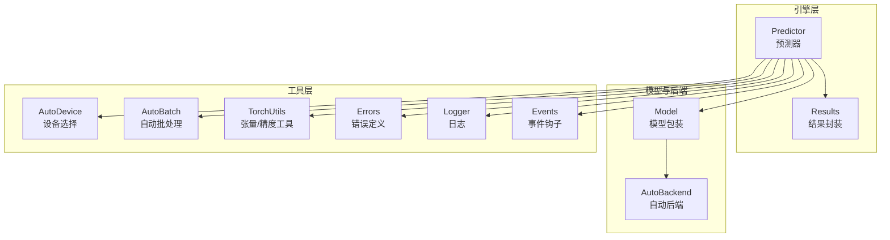
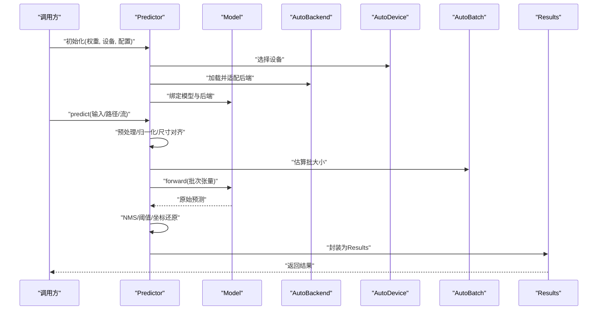
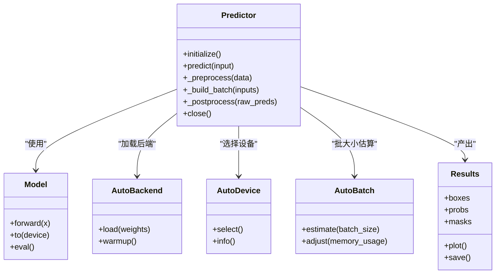
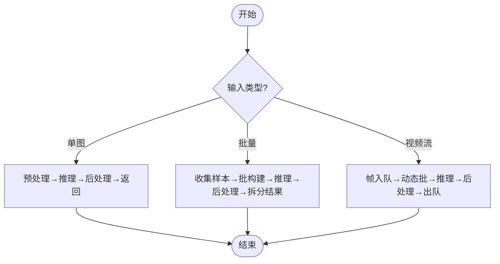
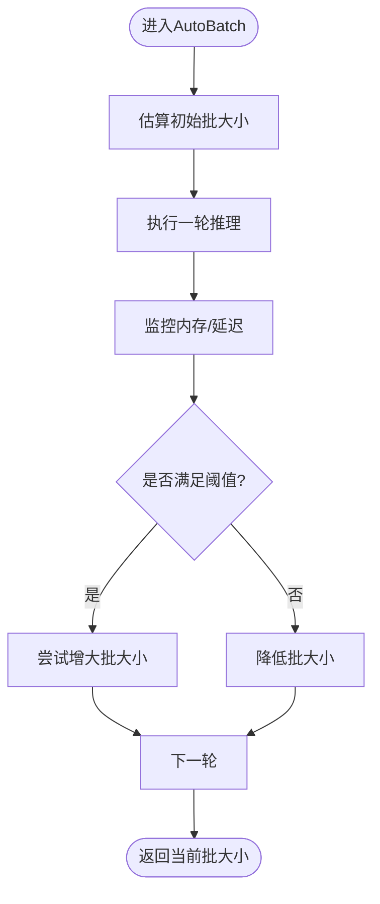
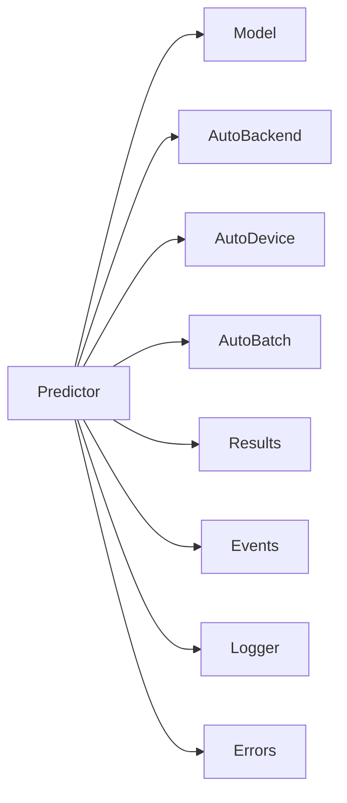

# 预测器引擎

<cite>
**本文引用的文件**
- [predictor.py](file://ultralytics/engine/predictor.py)
- [model.py](file://ultralytics/engine/model.py)
- [autobackend.py](file://ultralytics/nn/autobackend.py)
- [autodevice.py](file://ultralytics/utils/autodevice.py)
- [autobatch.py](file://ultralytics/utils/autobatch.py)
- [results.py](file://ultralytics/engine/results.py)
- [torch_utils.py](file://ultralytics/utils/torch_utils.py)
- [errors.py](file://ultralytics/utils/errors.py)
- [logger.py](file://ultralytics/utils/logger.py)
- [events.py](file://ultralytics/utils/events.py)
</cite>

## 目录
1. [简介](#简介)
2. [项目结构](#项目结构)
3. [核心组件](#核心组件)
4. [架构总览](#架构总览)
5. [详细组件分析](#详细组件分析)
6. [依赖关系分析](#依赖关系分析)
7. [性能考量](#性能考量)
8. [故障排查指南](#故障排查指南)
9. [结论](#结论)
10. [附录](#附录)

## 简介
本文件面向YOLO-Master的预测器引擎，聚焦Predictor类的核心架构与推理生命周期。内容涵盖：
- 初始化流程、模型加载机制与设备选择策略
- 单图像、批量与视频流三种推理模式的调度策略
- 自动批处理(AutoBatch)的动态批大小调整与内存优化
- 设备管理与硬件适配（GPU/CPU自动检测与切换）
- 推理状态管理与会话控制
- 错误处理与异常恢复机制
- 性能监控与调试工具使用方法
- 多线程推理实现细节与并发控制策略

## 项目结构
预测器引擎位于ultralytics.engine模块中，围绕Predictor类组织，并与autobackend、autodevice、autobatch等工具协同工作，形成“前端编排 + 后端执行”的清晰分层。

图表来源
- [predictor.py](file://ultralytics/engine/predictor.py)
- [model.py](file://ultralytics/engine/model.py)
- [autobackend.py](file://ultralytics/nn/autobackend.py)
- [autodevice.py](file://ultralytics/utils/autodevice.py)
- [autobatch.py](file://ultralytics/utils/autobatch.py)
- [results.py](file://ultralytics/engine/results.py)
- [torch_utils.py](file://ultralytics/utils/torch_utils.py)
- [errors.py](file://ultralytics/utils/errors.py)
- [logger.py](file://ultralytics/utils/logger.py)
- [events.py](file://ultralytics/utils/events.py)

章节来源
- [predictor.py](file://ultralytics/engine/predictor.py)
- [model.py](file://ultralytics/engine/model.py)
- [autobackend.py](file://ultralytics/nn/autobackend.py)
- [autodevice.py](file://ultralytics/utils/autodevice.py)
- [autobatch.py](file://ultralytics/utils/autobatch.py)
- [results.py](file://ultralytics/engine/results.py)
- [torch_utils.py](file://ultralytics/utils/torch_utils.py)
- [errors.py](file://ultralytics/utils/errors.py)
- [logger.py](file://ultralytics/utils/logger.py)
- [events.py](file://ultralytics/utils/events.py)

## 核心组件
- Predictor：预测器主类，负责输入预处理、批构建、推理调度、后处理与结果封装；管理会话生命周期与线程安全。
- Model：模型包装器，统一不同任务与导出格式的前向接口，屏蔽后端差异。
- AutoBackend：根据权重与运行时环境自动选择最优推理后端（如ONNX/TensorRT/OpenVINO等）。
- AutoDevice：设备探测与选择（CPU/GPU），并处理显存/算力约束。
- AutoBatch：动态批大小估算与调整，结合内存上限与延迟目标进行自适应。
- Results：标准化推理输出容器，支持可视化、序列化与指标计算。
- TorchUtils：张量转换、精度/类型管理、设备一致性校验等通用工具。
- Errors/Logger/Events：统一的错误体系、结构化日志与可插拔事件钩子。

章节来源
- [predictor.py](file://ultralytics/engine/predictor.py)
- [model.py](file://ultralytics/engine/model.py)
- [autobackend.py](file://ultralytics/nn/autobackend.py)
- [autodevice.py](file://ultralytics/utils/autodevice.py)
- [autobatch.py](file://ultralytics/utils/autobatch.py)
- [results.py](file://ultralytics/engine/results.py)
- [torch_utils.py](file://ultralytics/utils/torch_utils.py)
- [errors.py](file://ultralytics/utils/errors.py)
- [logger.py](file://ultralytics/utils/logger.py)
- [events.py](file://ultralytics/utils/events.py)

## 架构总览
Predictor作为编排中心，将“数据准备—批构建—推理—后处理—结果封装”串联成完整流水线。其关键交互如下：

图表来源
- [predictor.py](file://ultralytics/engine/predictor.py)
- [model.py](file://ultralytics/engine/model.py)
- [autobackend.py](file://ultralytics/nn/autobackend.py)
- [autodevice.py](file://ultralytics/utils/autodevice.py)
- [autobatch.py](file://ultralytics/utils/autobatch.py)
- [results.py](file://ultralytics/engine/results.py)

## 详细组件分析

### Predictor类：初始化、模型加载与推理生命周期
- 初始化阶段
  - 解析配置参数（置信度、IoU阈值、图像尺寸、半精度等）
  - 通过AutoDevice确定目标设备，必要时回退到CPU
  - 通过AutoBackend加载权重并选择最优推理后端
  - 建立Model实例，完成模型图构建与预热
- 推理生命周期
  - 进入前：触发“开始”事件，记录时间戳与资源占用
  - 预处理：读取/解码图像或帧，统一尺寸、归一化、通道顺序转换
  - 批构建：依据AutoBatch建议与队列长度决定实际batch
  - 推理：调用Model.forward，获取原始预测
  - 后处理：NMS、类别过滤、边界框缩放至原图尺度
  - 结果封装：生成Results对象，附加元数据（设备、耗时、形状等）
  - 退出后：触发“结束”事件，更新统计信息
- 会话控制
  - 提供open/close语义，确保后端资源释放与设备状态复位
  - 支持在长时运行中重置内部缓存与预热状态

章节来源
- [predictor.py](file://ultralytics/engine/predictor.py)
- [model.py](file://ultralytics/engine/model.py)
- [autobackend.py](file://ultralytics/nn/autobackend.py)
- [autodevice.py](file://ultralytics/utils/autodevice.py)
- [events.py](file://ultralytics/utils/events.py)

#### 类关系图（代码级）

图表来源
- [predictor.py](file://ultralytics/engine/predictor.py)
- [model.py](file://ultralytics/engine/model.py)
- [autobackend.py](file://ultralytics/nn/autobackend.py)
- [autodevice.py](file://ultralytics/utils/autodevice.py)
- [autobatch.py](file://ultralytics/utils/autobatch.py)
- [results.py](file://ultralytics/engine/results.py)

### 推理模式与调度策略
- 单图像推理
  - 直接预处理→单次forward→后处理→返回Results
  - 适合低延迟场景，避免批开销
- 批量推理
  - 将多张图像按AutoBatch建议合并为批次
  - 通过一次forward吞吐多个样本，提升整体吞吐
  - 注意内存峰值与延迟权衡
- 视频流处理
  - 以帧为单位入队，采用滑动窗口或固定容量队列
  - 根据队列长度与AutoBatch动态调整批大小
  - 支持丢帧策略与超时保护，保证实时性

图表来源
- [predictor.py](file://ultralytics/engine/predictor.py)
- [autobatch.py](file://ultralytics/utils/autobatch.py)

章节来源
- [predictor.py](file://ultralytics/engine/predictor.py)
- [autobatch.py](file://ultralytics/utils/autobatch.py)

### 自动批处理(AutoBatch)：动态批大小与内存优化
- 工作原理
  - 基于模型输入形状、数据类型与设备显存上限估算最大可行批大小
  - 运行时监测内存占用，若接近阈值则降低批大小，反之逐步提升
  - 结合延迟目标与吞吐目标进行多目标优化
- 关键策略
  - 渐进式放大：从保守批大小起步，随空闲显存增加而扩大
  - 快速回落：当检测到OOM或延迟超标时迅速降批
  - 分片策略：对超大请求进行分片，避免一次性占满内存
- 适用场景
  - 高吞吐离线推理
  - 边缘设备受限内存下的稳定推理

图表来源
- [autobatch.py](file://ultralytics/utils/autobatch.py)

章节来源
- [autobatch.py](file://ultralytics/utils/autobatch.py)

### 设备管理与硬件适配：GPU/CPU自动检测与切换
- 设备选择
  - 优先选择可用GPU，若无则回退CPU
  - 考虑显存容量、驱动版本与后端兼容性
- 精度与类型
  - 根据设备能力与后端支持选择半精度/整型
  - 统一张量类型与设备，避免跨设备拷贝
- 热切换
  - 运行时可在安全点切换设备（需重建后端与预热）
  - 切换前清理缓存，防止残留状态影响新设备

章节来源
- [autodevice.py](file://ultralytics/utils/autodevice.py)
- [autobackend.py](file://ultralytics/nn/autobackend.py)
- [torch_utils.py](file://ultralytics/utils/torch_utils.py)

### 推理状态管理与会话控制
- 状态机
  - 未初始化 → 已加载 → 运行中 → 关闭
- 会话控制
  - open：完成后端加载、预热与资源分配
  - close：释放后端句柄、清空缓存、复位设备状态
- 线程安全
  - 内部锁保护共享状态（如批队列、统计信息）
  - 同一会话内允许多线程并发推理，但需避免跨会话共享可变状态

章节来源
- [predictor.py](file://ultralytics/engine/predictor.py)

### 错误处理与异常恢复
- 错误分类
  - 设备不可用/显存不足
  - 后端加载失败/模型不兼容
  - 输入格式错误/尺寸不一致
- 恢复策略
  - 自动降级：GPU→CPU、高精度→低精度、大batch→小batch
  - 重试与熔断：对瞬时错误进行有限次重试，失败则熔断并上报
  - 诊断信息：附带堆栈、设备信息、内存占用与最后输入摘要

章节来源
- [errors.py](file://ultralytics/utils/errors.py)
- [logger.py](file://ultralytics/utils/logger.py)
- [predictor.py](file://ultralytics/engine/predictor.py)

### 性能监控与调试工具
- 内置指标
  - 端到端耗时、各阶段耗时、吞吐、批大小变化曲线
  - 设备利用率、显存峰值、温度（若可用）
- 事件钩子
  - 通过事件系统订阅“开始/结束/错误”等事件，接入外部监控系统
- 调试开关
  - 启用详细日志、保存中间张量形状与设备信息
  - 可视化Results（框、掩码、概率分布）

章节来源
- [events.py](file://ultralytics/utils/events.py)
- [logger.py](file://ultralytics/utils/logger.py)
- [results.py](file://ultralytics/engine/results.py)

### 多线程推理与并发控制
- 并发模型
  - 单会话内多线程并发：共享模型与后端，内部加锁保护批队列与统计
  - 多会话并行：每个会话独立设备/后端，适合多进程或多GPU
- 同步策略
  - 读写分离：只读共享状态无需锁，写操作加锁
  - 无锁队列：用于帧/样本入队，减少锁竞争
- 背压与限流
  - 队列满时阻塞或丢弃旧帧
  - 根据延迟目标限制并发度，避免过载

章节来源
- [predictor.py](file://ultralytics/engine/predictor.py)

## 依赖关系分析
Predictor强依赖Model与AutoBackend，间接依赖AutoDevice与AutoBatch；输出统一为Results；错误、日志与事件贯穿全链路。

图表来源
- [predictor.py](file://ultralytics/engine/predictor.py)
- [model.py](file://ultralytics/engine/model.py)
- [autobackend.py](file://ultralytics/nn/autobackend.py)
- [autodevice.py](file://ultralytics/utils/autodevice.py)
- [autobatch.py](file://ultralytics/utils/autobatch.py)
- [results.py](file://ultralytics/engine/results.py)
- [events.py](file://ultralytics/utils/events.py)
- [logger.py](file://ultralytics/utils/logger.py)
- [errors.py](file://ultralytics/utils/errors.py)

章节来源
- [predictor.py](file://ultralytics/engine/predictor.py)
- [model.py](file://ultralytics/engine/model.py)
- [autobackend.py](file://ultralytics/nn/autobackend.py)
- [autodevice.py](file://ultralytics/utils/autodevice.py)
- [autobatch.py](file://ultralytics/utils/autobatch.py)
- [results.py](file://ultralytics/engine/results.py)
- [events.py](file://ultralytics/utils/events.py)
- [logger.py](file://ultralytics/utils/logger.py)
- [errors.py](file://ultralytics/utils/errors.py)

## 性能考量
- 批大小调优：在高吞吐场景下优先提升批大小，在低延迟场景下保持较小批
- 精度选择：在GPU与合适后端支持下优先使用半精度，注意数值稳定性
- 预热策略：首次推理前进行若干次空跑，消除冷启动抖动
- I/O优化：预取下一帧/图像，减少等待时间
- 内存管理：及时释放中间张量，避免碎片化

## 故障排查指南
- 常见问题
  - OOM：降低批大小、减小输入分辨率、切换到CPU或更低精度
  - 后端加载失败：检查权重格式与后端支持矩阵，必要时重新导出
  - 设备切换异常：确保在安全点切换，先关闭再打开新会话
- 定位手段
  - 开启详细日志，关注“开始/结束/错误”事件
  - 打印设备信息与内存占用，确认资源瓶颈
  - 保存最小复现输入与配置，便于回归测试

章节来源
- [errors.py](file://ultralytics/utils/errors.py)
- [logger.py](file://ultralytics/utils/logger.py)
- [events.py](file://ultralytics/utils/events.py)
- [predictor.py](file://ultralytics/engine/predictor.py)

## 结论
Predictor以清晰的编排职责与可扩展的后端抽象，实现了从单图到视频流的统一推理体验。借助AutoBatch与AutoDevice，系统在吞吐、延迟与资源之间取得良好平衡。配合完善的错误处理、事件系统与调试工具，可支撑生产环境的稳定运行与持续优化。

## 附录
- 最佳实践
  - 为不同部署目标预设配置模板（边缘/云端/服务器）
  - 在生产环境启用事件上报与指标采集
  - 定期评估AutoBatch策略与后端选择效果
- 参考路径
  - 预测器入口与生命周期：[predictor.py](file://ultralytics/engine/predictor.py)
  - 模型包装与前向接口：[model.py](file://ultralytics/engine/model.py)
  - 自动后端选择：[autobackend.py](file://ultralytics/nn/autobackend.py)
  - 设备选择与回退：[autodevice.py](file://ultralytics/utils/autodevice.py)
  - 自动批处理：[autobatch.py](file://ultralytics/utils/autobatch.py)
  - 结果封装与可视化：[results.py](file://ultralytics/engine/results.py)
  - 张量与精度工具：[torch_utils.py](file://ultralytics/utils/torch_utils.py)
  - 错误与日志：[errors.py](file://ultralytics/utils/errors.py), [logger.py](file://ultralytics/utils/logger.py)
  - 事件钩子：[events.py](file://ultralytics/utils/events.py)